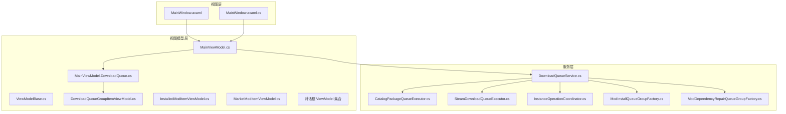
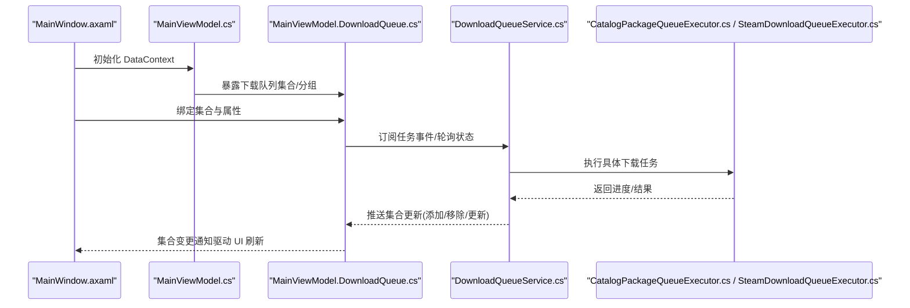
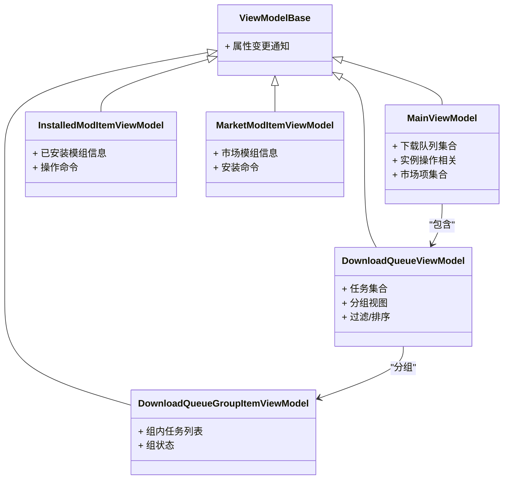
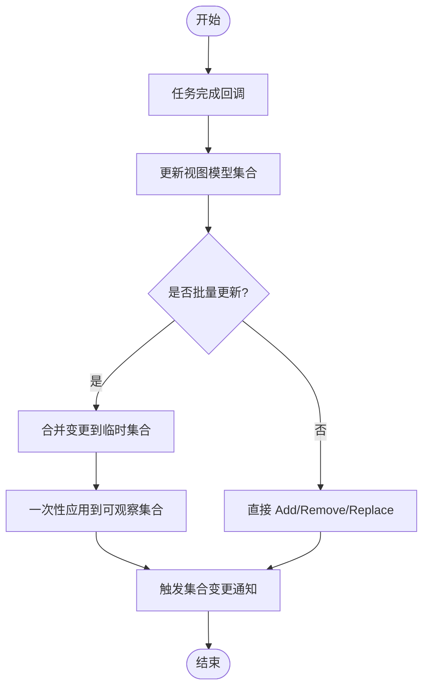
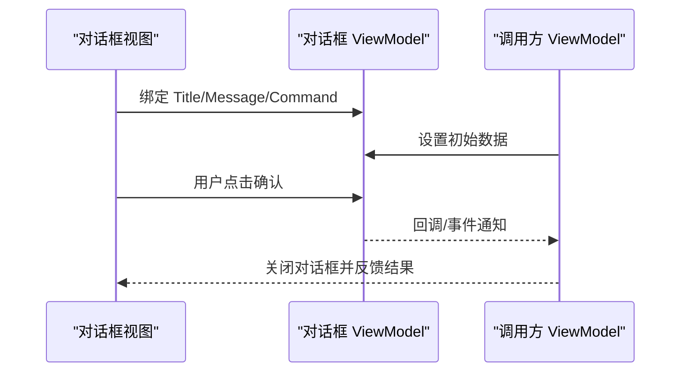
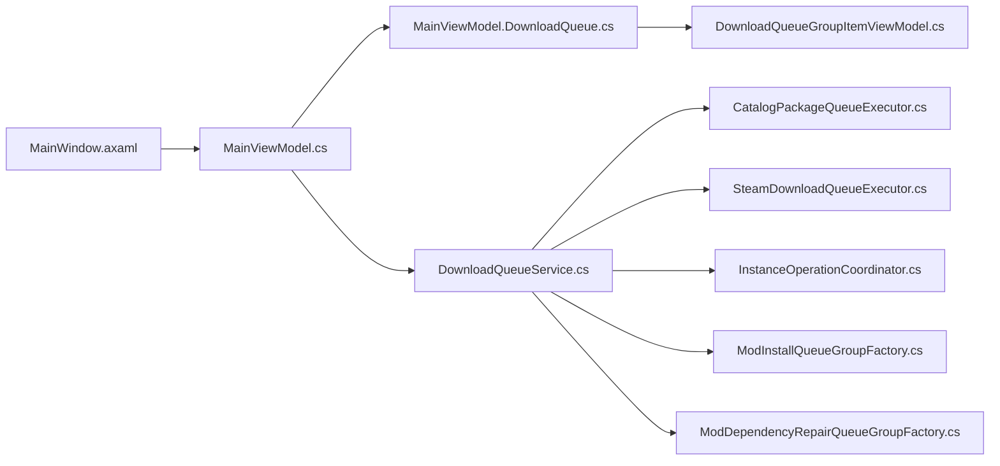

# 数据绑定

<cite>
**本文引用的文件**   
- [ViewModelBase.cs](file://src/Crystalfly.App/ViewModels/ViewModelBase.cs)
- [MainViewModel.cs](file://src/Crystalfly.App/ViewModels/MainViewModel.cs)
- [MainViewModel.DownloadQueue.cs](file://src/Crystalfly.App/ViewModels/MainViewModel.DownloadQueue.cs)
- [MainWindow.axaml](file://src/Crystalfly.App/Views/MainWindow.axaml)
- [MainWindow.axaml.cs](file://src/Crystalfly.App/Views/MainWindow.axaml.cs)
- [DownloadQueueService.cs](file://src/Crystalfly.App/Assets/Downloads/DownloadQueueService.cs)
- [CatalogPackageQueueExecutor.cs](file://src/Crystalfly.App/Assets/Downloads/CatalogPackageQueueExecutor.cs)
- [SteamDownloadQueueExecutor.cs](file://src/Crystalfly.App/Assets/Downloads/SteamDownloadQueueExecutor.cs)
- [InstanceOperationCoordinator.cs](file://src/Crystalfly.App/Assets/Downloads/InstanceOperationCoordinator.cs)
- [ModInstallQueueGroupFactory.cs](file://src/Crystalfly.App/Assets/Downloads/ModInstallQueueGroupFactory.cs)
- [ModDependencyRepairQueueGroupFactory.cs](file://src/Crystalfly.App/Assets/Downloads/ModDependencyRepairQueueGroupFactory.cs)
- [DownloadQueueGroupItemViewModel.cs](file://src/Crystalfly.App/ViewModels/DownloadQueueGroupItemViewModel.cs)
- [InstalledModItemViewModel.cs](file://src/Crystalfly.App/ViewModels/InstalledModItemViewModel.cs)
- [MarketModItemViewModel.cs](file://src/Crystalfly.App/ViewModels/MarketModItemViewModel.cs)
- [ConfirmationDialogViewModel.cs](file://src/Crystalfly.App/ViewModels/Dialogs/ConfirmationDialogViewModel.cs)
- [DependencyPlanDialogViewModel.cs](file://src/Crystalfly.App/ViewModels/Dialogs/DependencyPlanDialogViewModel.cs)
- [MarketInstallDialogViewModel.cs](file://src/Crystalfly.App/ViewModels/Dialogs/MarketInstallDialogViewModel.cs)
- [TextInputDialogViewModel.cs](file://src/Crystalfly.App/ViewModels/Dialogs/TextInputDialogViewModel.cs)
</cite>

## 目录
1. [简介](#简介)
2. [项目结构](#项目结构)
3. [核心组件](#核心组件)
4. [架构总览](#架构总览)
5. [详细组件分析](#详细组件分析)
6. [依赖关系分析](#依赖关系分析)
7. [性能考虑](#性能考虑)
8. [故障排查指南](#故障排查指南)
9. [结论](#结论)
10. [附录](#附录)

## 简介
本文件聚焦于 Avalonia UI 中的数据绑定机制，结合 Crystalfly 项目的实际实现，系统阐述：
- 单向与双向绑定的使用方式与差异
- INotifyPropertyChanged 的规范用法与性能优化
- 集合绑定（如 ObservableCollection）的实现与更新机制
- 复杂数据结构（嵌套对象、字典）的绑定策略
- 绑定错误处理与调试技巧
- 大数据集绑定的虚拟化与性能优化策略

## 项目结构
本项目采用 MVVM 分层组织视图模型与视图：
- ViewModels 层负责暴露可绑定属性、命令与集合，并实现变更通知
- Views 层通过 AXAML 声明式绑定到 ViewModel
- 业务服务位于 Assets/Downloads 等目录，提供后台任务与状态，ViewModel 聚合这些服务并通过集合或属性向 UI 暴露

图表来源
- [MainWindow.axaml](file://src/Crystalfly.App/Views/MainWindow.axaml)
- [MainWindow.axaml.cs](file://src/Crystalfly.App/Views/MainWindow.axaml.cs)
- [ViewModelBase.cs](file://src/Crystalfly.App/ViewModels/ViewModelBase.cs)
- [MainViewModel.cs](file://src/Crystalfly.App/ViewModels/MainViewModel.cs)
- [MainViewModel.DownloadQueue.cs](file://src/Crystalfly.App/ViewModels/MainViewModel.DownloadQueue.cs)
- [DownloadQueueService.cs](file://src/Crystalfly.App/Assets/Downloads/DownloadQueueService.cs)
- [CatalogPackageQueueExecutor.cs](file://src/Crystalfly.App/Assets/Downloads/CatalogPackageQueueExecutor.cs)
- [SteamDownloadQueueExecutor.cs](file://src/Crystalfly.App/Assets/Downloads/SteamDownloadQueueExecutor.cs)
- [InstanceOperationCoordinator.cs](file://src/Crystalfly.App/Assets/Downloads/InstanceOperationCoordinator.cs)
- [ModInstallQueueGroupItemViewModel.cs](file://src/Crystalfly.App/ViewModels/DownloadQueueGroupItemViewModel.cs)
- [InstalledModItemViewModel.cs](file://src/Crystalfly.App/ViewModels/InstalledModItemViewModel.cs)
- [MarketModItemViewModel.cs](file://src/Crystalfly.App/ViewModels/MarketModItemViewModel.cs)

章节来源
- [MainWindow.axaml](file://src/Crystalfly.App/Views/MainWindow.axaml)
- [MainWindow.axaml.cs](file://src/Crystalfly.App/Views/MainWindow.axaml.cs)
- [ViewModelBase.cs](file://src/Crystalfly.App/ViewModels/ViewModelBase.cs)
- [MainViewModel.cs](file://src/Crystalfly.App/ViewModels/MainViewModel.cs)
- [MainViewModel.DownloadQueue.cs](file://src/Crystalfly.App/ViewModels/MainViewModel.DownloadQueue.cs)
- [DownloadQueueService.cs](file://src/Crystalfly.App/Assets/Downloads/DownloadQueueService.cs)

## 核心组件
- 基类与通知机制
  - ViewModelBase 提供统一的属性变更通知能力，是 MVVM 中实现 INotifyPropertyChanged 的基础设施。所有 ViewModel 继承该基类以启用属性级变更通知。
- 主视图模型
  - MainViewModel 作为应用主窗口的数据源，聚合下载队列、实例操作、市场项等子视图模型，并通过集合与属性暴露给 UI。
- 下载队列相关
  - DownloadQueueService 管理下载任务与进度；MainViewModel.DownloadQueue 将服务状态映射为可绑定的集合与分组视图模型；各 ItemViewModel 承载单项数据与交互命令。

章节来源
- [ViewModelBase.cs](file://src/Crystalfly.App/ViewModels/ViewModelBase.cs)
- [MainViewModel.cs](file://src/Crystalfly.App/ViewModels/MainViewModel.cs)
- [MainViewModel.DownloadQueue.cs](file://src/Crystalfly.App/ViewModels/MainViewModel.DownloadQueue.cs)
- [DownloadQueueService.cs](file://src/Crystalfly.App/Assets/Downloads/DownloadQueueService.cs)

## 架构总览
下图展示了从视图到视图模型再到服务的典型绑定与调用路径，以及集合更新的触发点。

图表来源
- [MainWindow.axaml](file://src/Crystalfly.App/Views/MainWindow.axaml)
- [MainViewModel.cs](file://src/Crystalfly.App/ViewModels/MainViewModel.cs)
- [MainViewModel.DownloadQueue.cs](file://src/Crystalfly.App/ViewModels/MainViewModel.DownloadQueue.cs)
- [DownloadQueueService.cs](file://src/Crystalfly.App/Assets/Downloads/DownloadQueueService.cs)
- [CatalogPackageQueueExecutor.cs](file://src/Crystalfly.App/Assets/Downloads/CatalogPackageQueueExecutor.cs)
- [SteamDownloadQueueExecutor.cs](file://src/Crystalfly.App/Assets/Downloads/SteamDownloadQueueExecutor.cs)

## 详细组件分析

### 属性变更通知与 INotifyPropertyChanged
- 基类职责
  - ViewModelBase 统一实现属性变更通知，使派生类的属性在 setter 中触发通知，从而让绑定目标自动刷新。
- 最佳实践
  - 仅在值真正变化时触发通知，避免重复刷新。
  - 对频繁更新的属性进行节流或批量合并，减少 UI 重绘压力。
  - 对于只读计算属性，可在依赖属性变更时再触发一次通知。

章节来源
- [ViewModelBase.cs](file://src/Crystalfly.App/ViewModels/ViewModelBase.cs)

### 主视图模型与下载队列绑定
- 主视图模型
  - MainViewModel 持有下载队列相关的视图模型集合，供 MainWindow 直接绑定展示。
- 下载队列视图模型
  - MainViewModel.DownloadQueue 将服务层的任务转换为可观察集合，并提供分组、过滤与排序所需的视图模型。
- 单项视图模型
  - DownloadQueueGroupItemViewModel、InstalledModItemViewModel、MarketModItemViewModel 分别承载不同场景的数据与交互命令，均基于基类实现属性变更通知。

图表来源
- [ViewModelBase.cs](file://src/Crystalfly.App/ViewModels/ViewModelBase.cs)
- [MainViewModel.cs](file://src/Crystalfly.App/ViewModels/MainViewModel.cs)
- [MainViewModel.DownloadQueue.cs](file://src/Crystalfly.App/ViewModels/MainViewModel.DownloadQueue.cs)
- [DownloadQueueGroupItemViewModel.cs](file://src/Crystalfly.App/ViewModels/DownloadQueueGroupItemViewModel.cs)
- [InstalledModItemViewModel.cs](file://src/Crystalfly.App/ViewModels/InstalledModItemViewModel.cs)
- [MarketModItemViewModel.cs](file://src/Crystalfly.App/ViewModels/MarketModItemViewModel.cs)

章节来源
- [MainViewModel.cs](file://src/Crystalfly.App/ViewModels/MainViewModel.cs)
- [MainViewModel.DownloadQueue.cs](file://src/Crystalfly.App/ViewModels/MainViewModel.DownloadQueue.cs)
- [DownloadQueueGroupItemViewModel.cs](file://src/Crystalfly.App/ViewModels/DownloadQueueGroupItemViewModel.cs)
- [InstalledModItemViewModel.cs](file://src/Crystalfly.App/ViewModels/InstalledModItemViewModel.cs)
- [MarketModItemViewModel.cs](file://src/Crystalfly.App/ViewModels/MarketModItemViewModel.cs)

### 集合绑定与更新机制（ObservableCollection）
- 使用模式
  - 使用可观察集合承载任务、分组与列表项，当集合发生增删改时，UI 自动响应。
- 更新流程
  - 服务层完成一项任务后，通知上层视图模型；视图模型对集合执行原子性更新（Add/Remove/Replace），确保 UI 一次性刷新。
- 注意事项
  - 避免在 UI 线程外直接修改集合；必要时调度到 UI 线程。
  - 大批量更新时使用 Begin/End 批处理或临时集合合并，降低闪烁。

章节来源
- [MainViewModel.DownloadQueue.cs](file://src/Crystalfly.App/ViewModels/MainViewModel.DownloadQueue.cs)
- [DownloadQueueService.cs](file://src/Crystalfly.App/Assets/Downloads/DownloadQueueService.cs)

### 复杂数据结构绑定（嵌套对象与字典）
- 嵌套对象
  - 在 AXAML 中使用点号路径访问嵌套属性，例如“父对象.子对象.属性”。
- 字典数据
  - 使用键索引访问字典项，例如“字典[键]”；注意键类型需与绑定表达式一致。
- 建议
  - 对深层嵌套的属性变更，尽量在上层对象上触发一次通知，避免多次无效刷新。
  - 字典键变更建议使用不可变替换策略，整体替换字典引用而非原地修改。

章节来源
- [MainWindow.axaml](file://src/Crystalfly.App/Views/MainWindow.axaml)

### 对话框与输入绑定示例
- 确认对话框
  - ConfirmationDialogViewModel 暴露标题、消息与按钮命令，供确认对话框视图绑定。
- 依赖计划对话框
  - DependencyPlanDialogViewModel 用于展示依赖修复计划，支持选择与确认。
- 市场安装对话框
  - MarketInstallDialogViewModel 封装市场模组的安装参数与命令。
- 文本输入对话框
  - TextInputDialogViewModel 提供输入框绑定与提交命令。

图表来源
- [ConfirmationDialogViewModel.cs](file://src/Crystalfly.App/ViewModels/Dialogs/ConfirmationDialogViewModel.cs)
- [DependencyPlanDialogViewModel.cs](file://src/Crystalfly.App/ViewModels/Dialogs/DependencyPlanDialogViewModel.cs)
- [MarketInstallDialogViewModel.cs](file://src/Crystalfly.App/ViewModels/Dialogs/MarketInstallDialogViewModel.cs)
- [TextInputDialogViewModel.cs](file://src/Crystalfly.App/ViewModels/Dialogs/TextInputDialogViewModel.cs)

章节来源
- [ConfirmationDialogViewModel.cs](file://src/Crystalfly.App/ViewModels/Dialogs/ConfirmationDialogViewModel.cs)
- [DependencyPlanDialogViewModel.cs](file://src/Crystalfly.App/ViewModels/Dialogs/DependencyPlanDialogViewModel.cs)
- [MarketInstallDialogViewModel.cs](file://src/Crystalfly.App/ViewModels/Dialogs/MarketInstallDialogViewModel.cs)
- [TextInputDialogViewModel.cs](file://src/Crystalfly.App/ViewModels/Dialogs/TextInputDialogViewModel.cs)

## 依赖关系分析
- 视图与视图模型
  - MainWindow 通过 DataContext 绑定到 MainViewModel，进而绑定到下载队列与各项列表。
- 视图模型与服务
  - MainViewModel 组合 DownloadQueueService 与各执行器（CatalogPackageQueueExecutor、SteamDownloadQueueExecutor）、协调器（InstanceOperationCoordinator）及工厂（ModInstallQueueGroupFactory、ModDependencyRepairQueueGroupFactory）。
- 集合与分组
  - 下载队列分组由工厂创建，按任务类型或来源分组，便于 UI 渲染与交互。

图表来源
- [MainWindow.axaml](file://src/Crystalfly.App/Views/MainWindow.axaml)
- [MainViewModel.cs](file://src/Crystalfly.App/ViewModels/MainViewModel.cs)
- [MainViewModel.DownloadQueue.cs](file://src/Crystalfly.App/ViewModels/MainViewModel.DownloadQueue.cs)
- [DownloadQueueService.cs](file://src/Crystalfly.App/Assets/Downloads/DownloadQueueService.cs)
- [CatalogPackageQueueExecutor.cs](file://src/Crystalfly.App/Assets/Downloads/CatalogPackageQueueExecutor.cs)
- [SteamDownloadQueueExecutor.cs](file://src/Crystalfly.App/Assets/Downloads/SteamDownloadQueueExecutor.cs)
- [InstanceOperationCoordinator.cs](file://src/Crystalfly.App/Assets/Downloads/InstanceOperationCoordinator.cs)
- [ModInstallQueueGroupFactory.cs](file://src/Crystalfly.App/Assets/Downloads/ModInstallQueueGroupFactory.cs)
- [ModDependencyRepairQueueGroupFactory.cs](file://src/Crystalfly.App/Assets/Downloads/ModDependencyRepairQueueGroupFactory.cs)

章节来源
- [MainViewModel.cs](file://src/Crystalfly.App/ViewModels/MainViewModel.cs)
- [MainViewModel.DownloadQueue.cs](file://src/Crystalfly.App/ViewModels/MainViewModel.DownloadQueue.cs)
- [DownloadQueueService.cs](file://src/Crystalfly.App/Assets/Downloads/DownloadQueueService.cs)

## 性能考虑
- 属性变更通知优化
  - 仅在值变化时触发通知；对高频更新属性进行节流或合并。
  - 使用只读计算属性缓存中间结果，减少重复计算。
- 集合更新优化
  - 批量更新时使用临时集合合并后再一次性应用到可观察集合，避免多次重排。
  - 对大型列表启用虚拟化（Avalonia 默认支持），仅渲染可视区域项。
- UI 线程调度
  - 后台任务完成后，将集合更新调度到 UI 线程，避免跨线程异常与抖动。
- 内存与对象生命周期
  - 及时释放不再使用的订阅与事件，防止内存泄漏。
  - 对大对象（如图片、二进制数据）使用弱引用或延迟加载。

[本节为通用指导，不直接分析具体文件]

## 故障排查指南
- 常见绑定问题
  - 未触发 PropertyChanged：检查属性 setter 是否正确调用通知方法。
  - 集合未更新：确认是否在 UI 线程更新集合，或使用正确的集合类型。
  - 路径绑定失败：核对 AXAML 中的点号路径与键名大小写。
- 调试技巧
  - 使用输出窗口查看绑定错误日志。
  - 在关键属性 setter 处断点，验证变更触发时机。
  - 对集合更新进行最小化复现，逐步定位问题。
- 错误处理
  - 在命令执行前后捕获异常，记录上下文并提示用户。
  - 对网络与 I/O 操作增加重试与超时控制。

章节来源
- [MainWindow.axaml](file://src/Crystalfly.App/Views/MainWindow.axaml)
- [ViewModelBase.cs](file://src/Crystalfly.App/ViewModels/ViewModelBase.cs)

## 结论
Crystalfly 项目在 Avalonia UI 中遵循标准的 MVVM 模式，通过 ViewModelBase 实现属性变更通知，使用可观察集合承载动态数据，并结合服务层完成后台任务与状态同步。针对大数据集与高频更新场景，应重视集合批量更新、虚拟化与 UI 线程调度等优化手段，以获得流畅的用户体验。

[本节为总结性内容，不直接分析具体文件]

## 附录
- 术语
  - 单向绑定：数据从 ViewModel 流向 View。
  - 双向绑定：View 与 ViewModel 之间互相同步。
  - 虚拟化：仅渲染可视区域的列表项，提升大数据集性能。
- 参考文件
  - 视图与绑定入口：[MainWindow.axaml](file://src/Crystalfly.App/Views/MainWindow.axaml)、[MainWindow.axaml.cs](file://src/Crystalfly.App/Views/MainWindow.axaml.cs)
  - 视图模型基类与主视图模型：[ViewModelBase.cs](file://src/Crystalfly.App/ViewModels/ViewModelBase.cs)、[MainViewModel.cs](file://src/Crystalfly.App/ViewModels/MainViewModel.cs)
  - 下载队列视图模型与服务：[MainViewModel.DownloadQueue.cs](file://src/Crystalfly.App/ViewModels/MainViewModel.DownloadQueue.cs)、[DownloadQueueService.cs](file://src/Crystalfly.App/Assets/Downloads/DownloadQueueService.cs)
  - 执行器与协调器：[CatalogPackageQueueExecutor.cs](file://src/Crystalfly.App/Assets/Downloads/CatalogPackageQueueExecutor.cs)、[SteamDownloadQueueExecutor.cs](file://src/Crystalfly.App/Assets/Downloads/SteamDownloadQueueExecutor.cs)、[InstanceOperationCoordinator.cs](file://src/Crystalfly.App/Assets/Downloads/InstanceOperationCoordinator.cs)
  - 分组工厂：[ModInstallQueueGroupFactory.cs](file://src/Crystalfly.App/Assets/Downloads/ModInstallQueueGroupFactory.cs)、[ModDependencyRepairQueueGroupFactory.cs](file://src/Crystalfly.App/Assets/Downloads/ModDependencyRepairQueueGroupFactory.cs)
  - 对话框 ViewModel：[ConfirmationDialogViewModel.cs](file://src/Crystalfly.App/ViewModels/Dialogs/ConfirmationDialogViewModel.cs)、[DependencyPlanDialogViewModel.cs](file://src/Crystalfly.App/ViewModels/Dialogs/DependencyPlanDialogViewModel.cs)、[MarketInstallDialogViewModel.cs](file://src/Crystalfly.App/ViewModels/Dialogs/MarketInstallDialogViewModel.cs)、[TextInputDialogViewModel.cs](file://src/Crystalfly.App/ViewModels/Dialogs/TextInputDialogViewModel.cs)