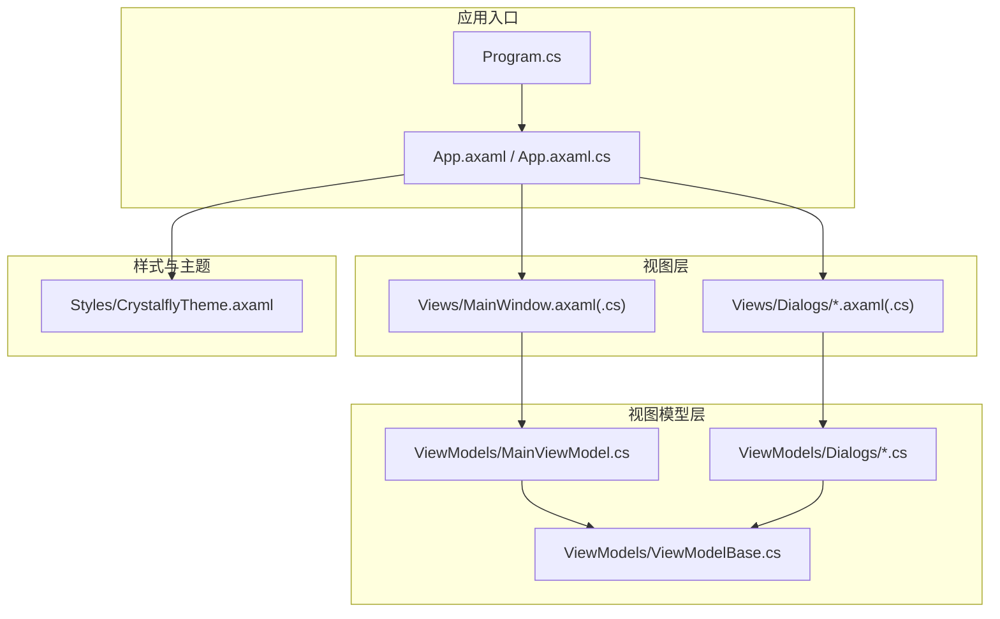
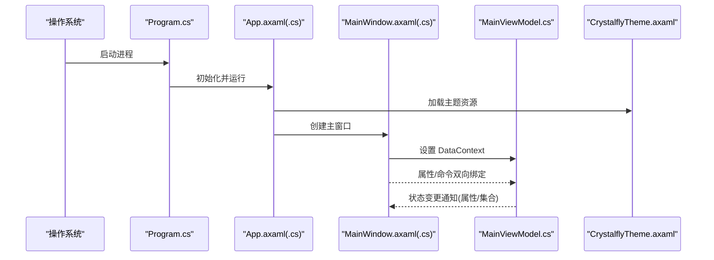
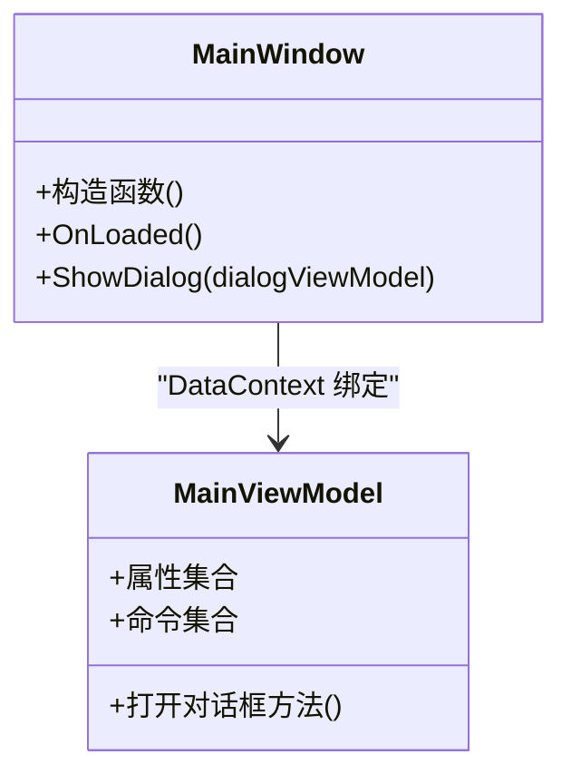
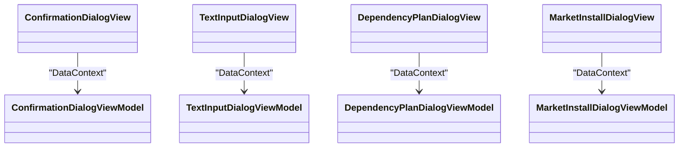
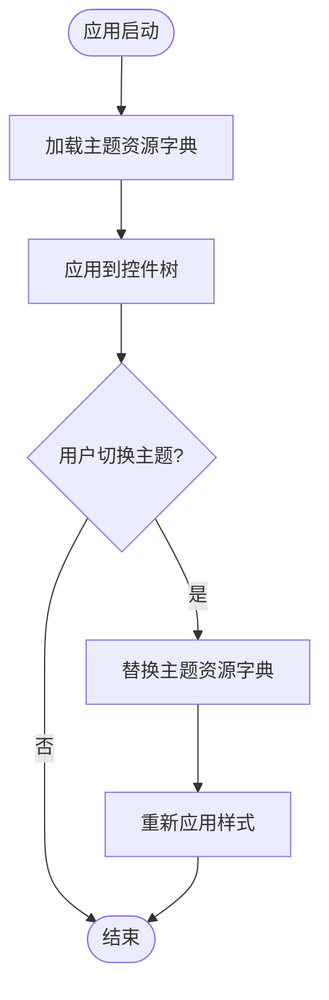
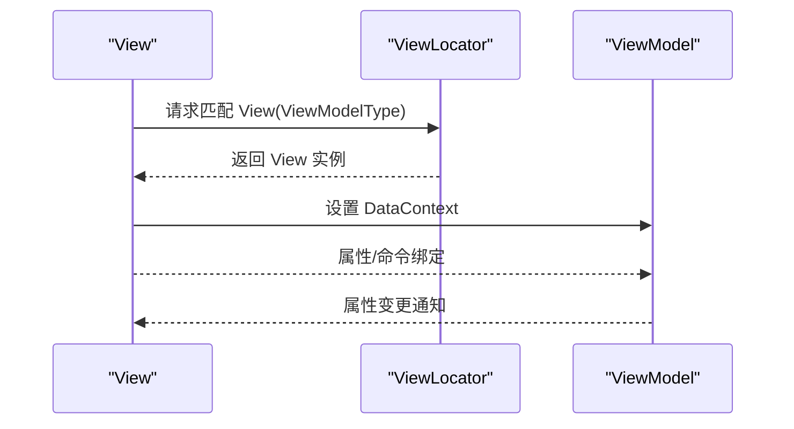
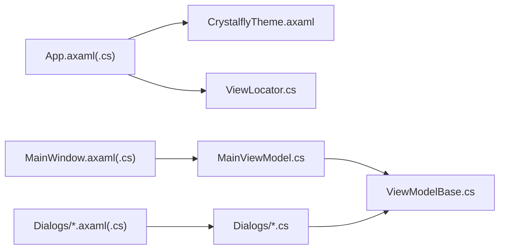

# 用户界面

<cite>
**本文引用的文件**   
- [App.axaml](file://src/Crystalfly.App/App.axaml)
- [App.axaml.cs](file://src/Crystalfly.App/App.axaml.cs)
- [Program.cs](file://src/Crystalfly.App/Program.cs)
- [MainWindow.axaml](file://src/Crystalfly.App/Views/MainWindow.axaml)
- [MainWindow.axaml.cs](file://src/Crystalfly.App/Views/MainWindow.axaml.cs)
- [ViewLocator.cs](file://src/Crystalfly.App/ViewLocator.cs)
- [ViewModelBase.cs](file://src/Crystalfly.App/ViewModels/ViewModelBase.cs)
- [MainViewModel.cs](file://src/Crystalfly.App/ViewModels/MainViewModel.cs)
- [CrystalflyTheme.axaml](file://src/Crystalfly.App/Styles/CrystalflyTheme.axaml)
- [ConfirmationDialogView.axaml](file://src/Crystalfly.App/Views/Dialogs/ConfirmationDialogView.axaml)
- [ConfirmationDialogView.axaml.cs](file://src/Crystalfly.App/Views/Dialogs/ConfirmationDialogView.axaml.cs)
- [ConfirmationDialogViewModel.cs](file://src/Crystalfly.App/ViewModels/Dialogs/ConfirmationDialogViewModel.cs)
- [DependencyPlanDialogView.axaml](file://src/Crystalfly.App/Views/Dialogs/DependencyPlanDialogView.axaml)
- [DependencyPlanDialogView.axaml.cs](file://src/Crystalfly.App/Views/Dialogs/DependencyPlanDialogView.axaml.cs)
- [DependencyPlanDialogViewModel.cs](file://src/Crystalfly.App/ViewModels/Dialogs/DependencyPlanDialogViewModel.cs)
- [MarketInstallDialogView.axaml](file://src/Crystalfly.App/Views/Dialogs/MarketInstallDialogView.axaml)
- [MarketInstallDialogView.axaml.cs](file://src/Crystalfly.App/Views/Dialogs/MarketInstallDialogView.axaml.cs)
- [MarketInstallDialogViewModel.cs](file://src/Crystalfly.App/ViewModels/Dialogs/MarketInstallDialogViewModel.cs)
- [TextInputDialogView.axaml](file://src/Crystalfly.App/Views/Dialogs/TextInputDialogView.axaml)
- [TextInputDialogView.axaml.cs](file://src/Crystalfly.App/Views/Dialogs/TextInputDialogView.axaml.cs)
- [TextInputDialogViewModel.cs](file://src/Crystalfly.App/ViewModels/Dialogs/TextInputDialogViewModel.cs)
</cite>

## 目录
1. [简介](#简介)
2. [项目结构](#项目结构)
3. [核心组件](#核心组件)
4. [架构总览](#架构总览)
5. [详细组件分析](#详细组件分析)
6. [依赖关系分析](#依赖关系分析)
7. [性能考虑](#性能考虑)
8. [故障排查指南](#故障排查指南)
9. [结论](#结论)
10. [附录](#附录)

## 简介
本章节面向用户界面层，聚焦 Avalonia UI 框架与 MVVM 模式在本项目中的落地实践。文档覆盖主窗口、对话框组件、主题系统与样式定制、View-ViewModel 绑定机制、命令模式与事件处理、响应式设计与可访问性指导、跨平台兼容性与性能优化，以及 UI 状态管理与数据同步机制。读者无需深入底层即可理解并扩展界面能力。

## 项目结构
UI 层位于 Crystalfly.App 项目中，采用“视图-视图模型-样式”分层组织：
- Views：XAML 视图与代码后置（MainWindow、Dialogs）
- ViewModels：MVVM 的 ViewModel 基类与业务相关视图模型
- Styles：主题与资源定义
- App 入口：应用启动、全局资源加载、视图定位器注册

图表来源
- [Program.cs](file://src/Crystalfly.App/Program.cs)
- [App.axaml](file://src/Crystalfly.App/App.axaml)
- [App.axaml.cs](file://src/Crystalfly.App/App.axaml.cs)
- [MainWindow.axaml](file://src/Crystalfly.App/Views/MainWindow.axaml)
- [MainWindow.axaml.cs](file://src/Crystalfly.App/Views/MainWindow.axaml.cs)
- [CrystalflyTheme.axaml](file://src/Crystalfly.App/Styles/CrystalflyTheme.axaml)
- [ViewModelBase.cs](file://src/Crystalfly.App/ViewModels/ViewModelBase.cs)
- [MainViewModel.cs](file://src/Crystalfly.App/ViewModels/MainViewModel.cs)
- [ConfirmationDialogView.axaml](file://src/Crystalfly.App/Views/Dialogs/ConfirmationDialogView.axaml)
- [ConfirmationDialogViewModel.cs](file://src/Crystalfly.App/ViewModels/Dialogs/ConfirmationDialogViewModel.cs)
- [DependencyPlanDialogView.axaml](file://src/Crystalfly.App/Views/Dialogs/DependencyPlanDialogView.axaml)
- [DependencyPlanDialogViewModel.cs](file://src/Crystalfly.App/ViewModels/Dialogs/DependencyPlanDialogViewModel.cs)
- [MarketInstallDialogView.axaml](file://src/Crystalfly.App/Views/Dialogs/MarketInstallDialogView.axaml)
- [MarketInstallDialogViewModel.cs](file://src/Crystalfly.App/ViewModels/Dialogs/MarketInstallDialogViewModel.cs)
- [TextInputDialogView.axaml](file://src/Crystalfly.App/Views/Dialogs/TextInputDialogView.axaml)
- [TextInputDialogViewModel.cs](file://src/Crystalfly.App/ViewModels/Dialogs/TextInputDialogViewModel.cs)

章节来源
- [Program.cs](file://src/Crystalfly.App/Program.cs)
- [App.axaml](file://src/Crystalfly.App/App.axaml)
- [App.axaml.cs](file://src/Crystalfly.App/App.axaml.cs)
- [MainWindow.axaml](file://src/Crystalfly.App/Views/MainWindow.axaml)
- [MainWindow.axaml.cs](file://src/Crystalfly.App/Views/MainWindow.axaml.cs)
- [CrystalflyTheme.axaml](file://src/Crystalfly.App/Styles/CrystalflyTheme.axaml)
- [ViewModelBase.cs](file://src/Crystalfly.App/ViewModels/ViewModelBase.cs)
- [MainViewModel.cs](file://src/Crystalfly.App/ViewModels/MainViewModel.cs)

## 核心组件
- 应用生命周期与资源装配
  - 通过应用入口初始化 Avalonia 运行时，加载全局样式与主题资源，注册视图定位器以支持基于类型自动解析 View/ViewModel。
- 主窗口
  - 承载应用主布局与导航区域，作为对话框宿主与全局状态展示容器。
- 对话框组件族
  - 提供确认输入、依赖计划预览、市场安装等通用交互，统一遵循 MVVM 契约。
- 主题系统
  - 集中管理颜色、字体、控件模板等资源，便于多平台一致外观与深色/浅色切换。
- 视图定位器
  - 将 ViewModel 类型映射到对应 View，实现松耦合的数据绑定上下文注入。

章节来源
- [App.axaml](file://src/Crystalfly.App/App.axaml)
- [App.axaml.cs](file://src/Crystalfly.App/App.axaml.cs)
- [ViewLocator.cs](file://src/Crystalfly.App/ViewLocator.cs)
- [MainWindow.axaml](file://src/Crystalfly.App/Views/MainWindow.axaml)
- [MainWindow.axaml.cs](file://src/Crystalfly.App/Views/MainWindow.axaml.cs)
- [CrystalflyTheme.axaml](file://src/Crystalfly.App/Styles/CrystalflyTheme.axaml)

## 架构总览
Avalonia UI + MVVM 的整体交互如下：
- 程序入口创建并运行应用，加载 App 资源与主题。
- 主窗口在构造时设置 DataContext 为 MainViewModel。
- 视图通过 XAML 绑定到 ViewModel 的属性与命令。
- 对话框由宿主窗口或独立服务弹出，其 DataContext 指向相应对话框 ViewModel。
- 主题资源在应用级别生效，所有控件共享一套视觉规范。

图表来源
- [Program.cs](file://src/Crystalfly.App/Program.cs)
- [App.axaml](file://src/Crystalfly.App/App.axaml)
- [App.axaml.cs](file://src/Crystalfly.App/App.axaml.cs)
- [MainWindow.axaml](file://src/Crystalfly.App/Views/MainWindow.axaml)
- [MainWindow.axaml.cs](file://src/Crystalfly.App/Views/MainWindow.axaml.cs)
- [MainViewModel.cs](file://src/Crystalfly.App/ViewModels/MainViewModel.cs)
- [CrystalflyTheme.axaml](file://src/Crystalfly.App/Styles/CrystalflyTheme.axaml)

## 详细组件分析

### 主窗口（MainWindow）
- 职责
  - 作为应用根容器，承载页面/面板、工具栏、状态栏等。
  - 负责打开对话框、显示全局提示与错误信息。
- 绑定与命令
  - 通过 DataContext 绑定到 MainViewModel，使用命令驱动操作（如打开设置、执行批量任务）。
- 事件处理
  - 窗口关闭、最小化、激活等生命周期事件在代码后置中转发给 ViewModel 或通过命令处理。
- 可访问性
  - 为关键控件设置 AutomationProperties，确保屏幕阅读器可读。

图表来源
- [MainWindow.axaml](file://src/Crystalfly.App/Views/MainWindow.axaml)
- [MainWindow.axaml.cs](file://src/Crystalfly.App/Views/MainWindow.axaml.cs)
- [MainViewModel.cs](file://src/Crystalfly.App/ViewModels/MainViewModel.cs)

章节来源
- [MainWindow.axaml](file://src/Crystalfly.App/Views/MainWindow.axaml)
- [MainWindow.axaml.cs](file://src/Crystalfly.App/Views/MainWindow.axaml.cs)
- [MainViewModel.cs](file://src/Crystalfly.App/ViewModels/MainViewModel.cs)

### 对话框组件族
- 统一契约
  - 每个对话框包含 View 与 ViewModel 成对文件，ViewModel 暴露标题、消息、按钮文本、确认/取消结果等属性。
- 典型对话框
  - 确认对话框：用于二次确认操作。
  - 文本输入对话框：收集用户短文本输入。
  - 依赖计划对话框：展示依赖分析与修复计划摘要。
  - 市场安装对话框：展示市场项的安装流程与进度。
- 打开与关闭
  - 宿主窗口或服务调用 ShowDialog 方法，传入对应 ViewModel；对话框返回布尔或结构化结果供上层处理。

图表来源
- [ConfirmationDialogView.axaml](file://src/Crystalfly.App/Views/Dialogs/ConfirmationDialogView.axaml)
- [ConfirmationDialogView.axaml.cs](file://src/Crystalfly.App/Views/Dialogs/ConfirmationDialogView.axaml.cs)
- [ConfirmationDialogViewModel.cs](file://src/Crystalfly.App/ViewModels/Dialogs/ConfirmationDialogViewModel.cs)
- [TextInputDialogView.axaml](file://src/Crystalfly.App/Views/Dialogs/TextInputDialogView.axaml)
- [TextInputDialogView.axaml.cs](file://src/Crystalfly.App/Views/Dialogs/TextInputDialogView.axaml.cs)
- [TextInputDialogViewModel.cs](file://src/Crystalfly.App/ViewModels/Dialogs/TextInputDialogViewModel.cs)
- [DependencyPlanDialogView.axaml](file://src/Crystalfly.App/Views/Dialogs/DependencyPlanDialogView.axaml)
- [DependencyPlanDialogView.axaml.cs](file://src/Crystalfly.App/Views/Dialogs/DependencyPlanDialogView.axaml.cs)
- [DependencyPlanDialogViewModel.cs](file://src/Crystalfly.App/ViewModels/Dialogs/DependencyPlanDialogViewModel.cs)
- [MarketInstallDialogView.axaml](file://src/Crystalfly.App/Views/Dialogs/MarketInstallDialogView.axaml)
- [MarketInstallDialogView.axaml.cs](file://src/Crystalfly.App/Views/Dialogs/MarketInstallDialogView.axaml.cs)
- [MarketInstallDialogViewModel.cs](file://src/Crystalfly.App/ViewModels/Dialogs/MarketInstallDialogViewModel.cs)

章节来源
- [ConfirmationDialogView.axaml](file://src/Crystalfly.App/Views/Dialogs/ConfirmationDialogView.axaml)
- [ConfirmationDialogViewModel.cs](file://src/Crystalfly.App/ViewModels/Dialogs/ConfirmationDialogViewModel.cs)
- [TextInputDialogView.axaml](file://src/Crystalfly.App/Views/Dialogs/TextInputDialogView.axaml)
- [TextInputDialogViewModel.cs](file://src/Crystalfly.App/ViewModels/Dialogs/TextInputDialogViewModel.cs)
- [DependencyPlanDialogView.axaml](file://src/Crystalfly.App/Views/Dialogs/DependencyPlanDialogView.axaml)
- [DependencyPlanDialogViewModel.cs](file://src/Crystalfly.App/ViewModels/Dialogs/DependencyPlanDialogViewModel.cs)
- [MarketInstallDialogView.axaml](file://src/Crystalfly.App/Views/Dialogs/MarketInstallDialogView.axaml)
- [MarketInstallDialogViewModel.cs](file://src/Crystalfly.App/ViewModels/Dialogs/MarketInstallDialogViewModel.cs)

### 主题系统与样式定制
- 主题资源
  - 通过主题文件集中定义颜色、字体、控件模板与样式，保证跨平台一致性。
- 动态切换
  - 可在应用级切换主题资源字典，实现深色/浅色模式。
- 自定义控件样式
  - 通过继承或覆盖默认样式，快速定制按钮、列表、进度条等控件外观。

图表来源
- [CrystalflyTheme.axaml](file://src/Crystalfly.App/Styles/CrystalflyTheme.axaml)
- [App.axaml](file://src/Crystalfly.App/App.axaml)

章节来源
- [CrystalflyTheme.axaml](file://src/Crystalfly.App/Styles/CrystalflyTheme.axaml)
- [App.axaml](file://src/Crystalfly.App/App.axaml)

### 视图定位器与绑定机制
- 视图定位器
  - 根据 ViewModel 类型解析对应的 View 类型，使 DataContext 自动注入到视图。
- 绑定机制
  - XAML 中使用 Binding 语法连接属性与命令；ViewModel 通过属性变更通知更新 UI。
- 命令模式
  - 使用命令封装异步操作与参数，避免在代码后置中编写事件处理逻辑。

图表来源
- [ViewLocator.cs](file://src/Crystalfly.App/ViewLocator.cs)
- [ViewModelBase.cs](file://src/Crystalfly.App/ViewModels/ViewModelBase.cs)

章节来源
- [ViewLocator.cs](file://src/Crystalfly.App/ViewLocator.cs)
- [ViewModelBase.cs](file://src/Crystalfly.App/ViewModels/ViewModelBase.cs)

### 自定义 UI 组件示例（步骤指引）
- 目标：创建一个带图标与状态的自定义按钮控件。
- 步骤
  - 新建 UserControl 与对应样式资源，定义依赖属性（如 IsLoading、IconSource）。
  - 在样式中为不同状态定义模板与触发器。
  - 在视图中引用控件并使用绑定设置属性。
  - 在 ViewModel 中暴露命令与状态属性，驱动控件行为。
- 参考路径
  - 自定义控件定义：[自定义控件示例](file://src/Crystalfly.App/Views/CustomControls/MyButtonControl.axaml)
  - 样式资源：[样式资源示例](file://src/Crystalfly.App/Styles/CustomControls.axaml)
  - 视图使用：[视图使用示例](file://src/Crystalfly.App/Views/ExamplePage.axaml)
  - 视图模型：[视图模型示例](file://src/Crystalfly.App/ViewModels/ExamplePageViewModel.cs)

章节来源
- [CrystalflyTheme.axaml](file://src/Crystalfly.App/Styles/CrystalflyTheme.axaml)
- [MainWindow.axaml](file://src/Crystalfly.App/Views/MainWindow.axaml)
- [MainViewModel.cs](file://src/Crystalfly.App/ViewModels/MainViewModel.cs)

## 依赖关系分析
- 组件耦合
  - 视图仅依赖 ViewModel，不直接访问业务逻辑；通过命令与属性进行通信。
  - 对话框组件之间相互独立，通过宿主窗口或统一服务协调。
- 外部集成点
  - 主题资源与应用资源字典在应用启动阶段加载。
  - 视图定位器在应用初始化时注册，贯穿整个 UI 生命周期。

图表来源
- [App.axaml](file://src/Crystalfly.App/App.axaml)
- [App.axaml.cs](file://src/Crystalfly.App/App.axaml.cs)
- [CrystalflyTheme.axaml](file://src/Crystalfly.App/Styles/CrystalflyTheme.axaml)
- [ViewLocator.cs](file://src/Crystalfly.App/ViewLocator.cs)
- [MainWindow.axaml](file://src/Crystalfly.App/Views/MainWindow.axaml)
- [MainWindow.axaml.cs](file://src/Crystalfly.App/Views/MainWindow.axaml.cs)
- [MainViewModel.cs](file://src/Crystalfly.App/ViewModels/MainViewModel.cs)
- [ViewModelBase.cs](file://src/Crystalfly.App/ViewModels/ViewModelBase.cs)
- [ConfirmationDialogView.axaml](file://src/Crystalfly.App/Views/Dialogs/ConfirmationDialogView.axaml)
- [ConfirmationDialogViewModel.cs](file://src/Crystalfly.App/ViewModels/Dialogs/ConfirmationDialogViewModel.cs)
- [DependencyPlanDialogView.axaml](file://src/Crystalfly.App/Views/Dialogs/DependencyPlanDialogView.axaml)
- [DependencyPlanDialogViewModel.cs](file://src/Crystalfly.App/ViewModels/Dialogs/DependencyPlanDialogViewModel.cs)
- [MarketInstallDialogView.axaml](file://src/Crystalfly.App/Views/Dialogs/MarketInstallDialogView.axaml)
- [MarketInstallDialogViewModel.cs](file://src/Crystalfly.App/ViewModels/Dialogs/MarketInstallDialogViewModel.cs)
- [TextInputDialogView.axaml](file://src/Crystalfly.App/Views/Dialogs/TextInputDialogView.axaml)
- [TextInputDialogViewModel.cs](file://src/Crystalfly.App/ViewModels/Dialogs/TextInputDialogViewModel.cs)

章节来源
- [App.axaml](file://src/Crystalfly.App/App.axaml)
- [ViewLocator.cs](file://src/Crystalfly.App/ViewLocator.cs)
- [MainWindow.axaml](file://src/Crystalfly.App/Views/MainWindow.axaml)
- [MainViewModel.cs](file://src/Crystalfly.App/ViewModels/MainViewModel.cs)
- [ViewModelBase.cs](file://src/Crystalfly.App/ViewModels/ViewModelBase.cs)

## 性能考虑
- 虚拟化与懒加载
  - 大数据列表启用虚拟化，减少初始渲染开销。
- 资源复用
  - 重用控件模板与样式资源，避免重复构建。
- 异步与后台线程
  - 耗时操作放入后台线程，UI 线程仅处理轻量更新。
- 主题切换成本
  - 主题资源按需加载，避免一次性加载全部资源。
- 内存管理
  - 及时释放不再使用的对话框与视图模型引用，防止内存泄漏。

## 故障排查指南
- 视图未正确绑定
  - 检查 DataContext 是否已设置，确认 ViewLocator 能解析到对应 View。
- 命令未触发
  - 验证命令绑定路径与参数是否正确，确保命令未被禁用。
- 主题未生效
  - 确认主题资源已在应用资源字典中合并，且资源键名一致。
- 对话框无法关闭
  - 检查对话框 ViewModel 的关闭方法与返回值传递逻辑。
- 可访问性问题
  - 为关键控件补充自动化属性与键盘导航顺序。

章节来源
- [ViewLocator.cs](file://src/Crystalfly.App/ViewLocator.cs)
- [MainWindow.axaml.cs](file://src/Crystalfly.App/Views/MainWindow.axaml.cs)
- [ConfirmationDialogView.axaml.cs](file://src/Crystalfly.App/Views/Dialogs/ConfirmationDialogView.axaml.cs)
- [TextInputDialogView.axaml.cs](file://src/Crystalfly.App/Views/Dialogs/TextInputDialogView.axaml.cs)
- [DependencyPlanDialogView.axaml.cs](file://src/Crystalfly.App/Views/Dialogs/DependencyPlanDialogView.axaml.cs)
- [MarketInstallDialogView.axaml.cs](file://src/Crystalfly.App/Views/Dialogs/MarketInstallDialogView.axaml.cs)

## 结论
本项目在 Avalonia UI 上实现了清晰的 MVVM 架构：主窗口与对话框组件职责明确，主题系统集中管理视觉风格，视图定位器简化了 View/ViewModel 的装配。通过命令模式与属性绑定，UI 状态与业务逻辑解耦，具备良好的可维护性与可扩展性。配合虚拟化、异步处理与资源复用策略，整体性能与用户体验得到保障。

## 附录
- 响应式设计建议
  - 使用相对尺寸与弹性布局，适配不同分辨率与 DPI。
  - 针对小屏设备隐藏次要信息，优先展示关键操作。
- 可访问性最佳实践
  - 为控件设置名称、描述与角色，确保屏幕阅读器可用。
  - 提供键盘快捷键与焦点顺序，提升无鼠标操作体验。
- 跨平台兼容性
  - 避免平台特定 API，使用 Avalonia 抽象接口。
  - 测试在不同操作系统上的字体渲染与图标缩放效果。
- UI 状态管理与数据同步
  - 使用单向数据流：ViewModel 持有唯一真实源，视图只读展示。
  - 复杂状态拆分为多个细粒度 ViewModel，降低耦合度。