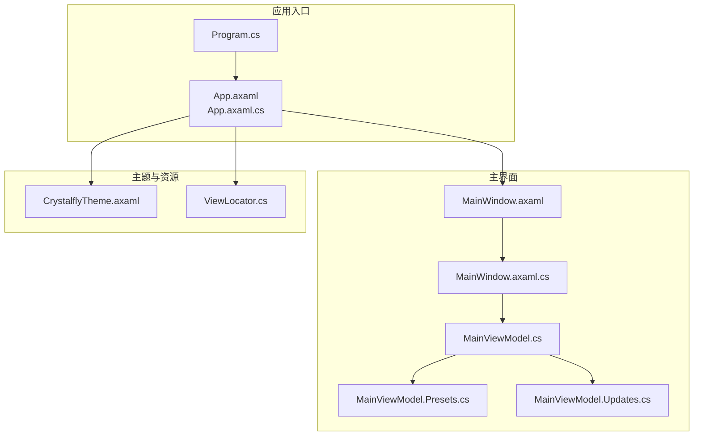
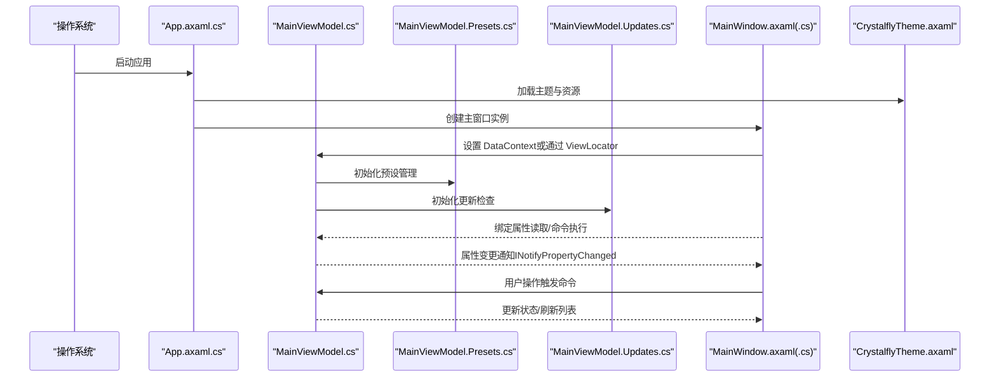
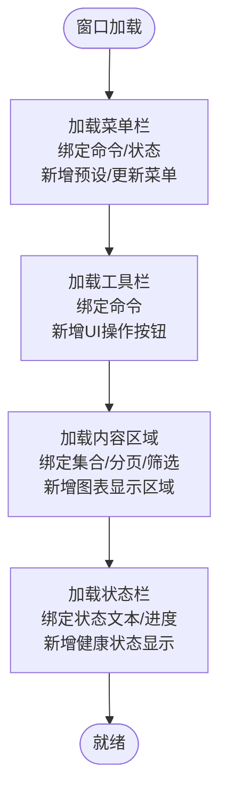
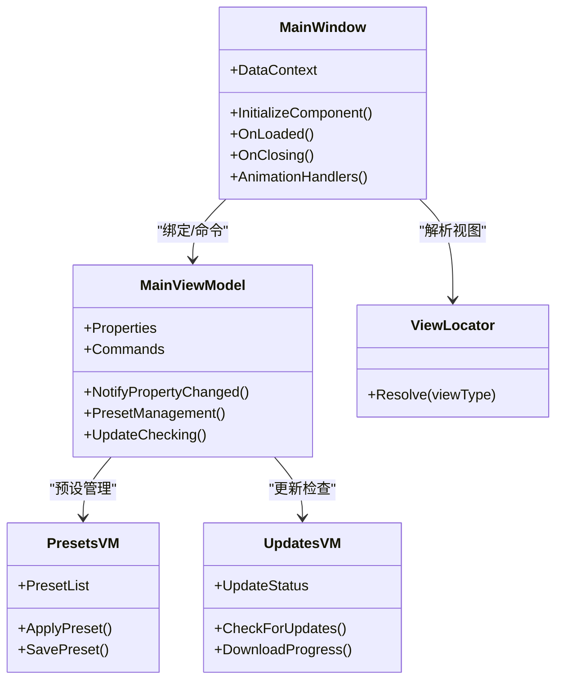
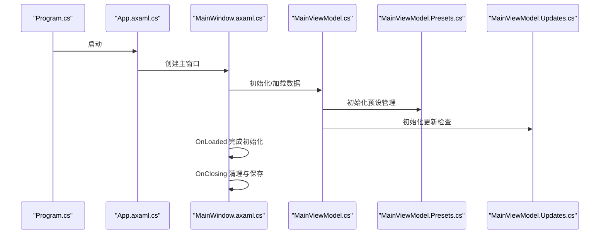
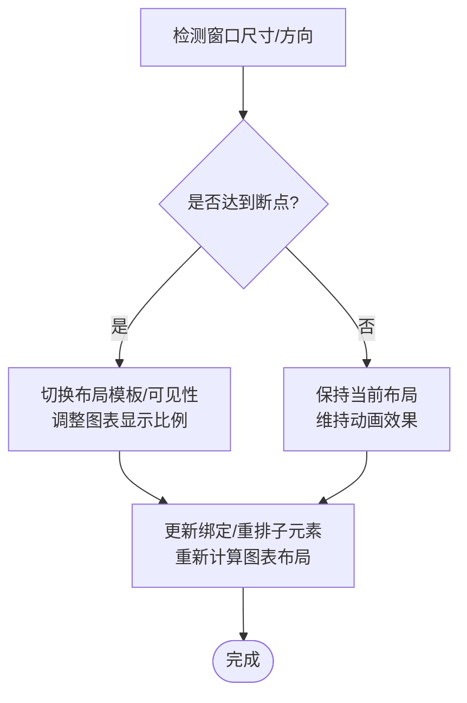
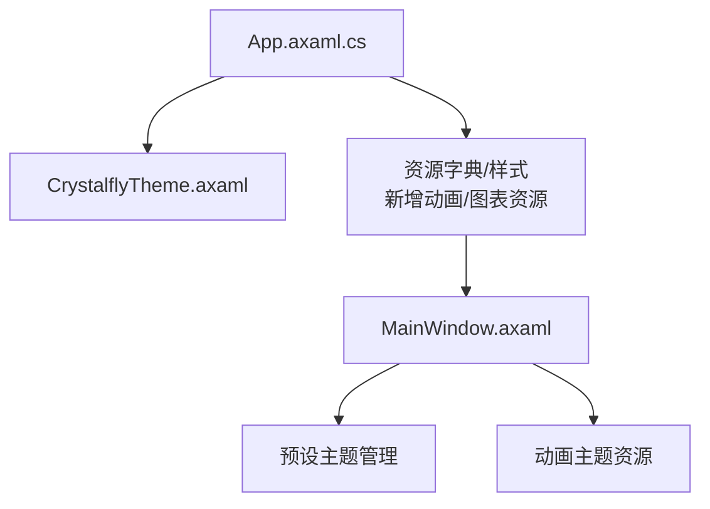
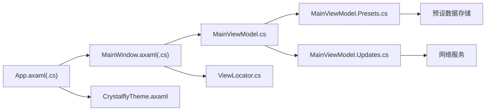

# 主窗口组件

<cite>
**本文引用的文件**   
- [MainWindow.axaml](file://src/Crystalfly.App/Views/MainWindow.axaml)
- [MainWindow.axaml.cs](file://src/Crystalfly.App/Views/MainWindow.axaml.cs)
- [MainViewModel.cs](file://src/Crystalfly.App/ViewModels/MainViewModel.cs)
- [MainViewModel.Presets.cs](file://src/Crystalfly.App/ViewModels/MainViewModel.Presets.cs)
- [MainViewModel.Updates.cs](file://src/Crystalfly.App/ViewModels/MainViewModel.Updates.cs)
- [App.axaml](file://src/Crystalfly.App/App.axaml)
- [App.axaml.cs](file://src/Crystalfly.App/App.axaml.cs)
- [CrystalflyTheme.axaml](file://src/Crystalfly.App/Styles/CrystalflyTheme.axaml)
- [ViewLocator.cs](file://src/Crystalfly.App/ViewLocator.cs)
- [Program.cs](file://src/Crystalfly.App/Program.cs)
- [MainWindowStructureTests.cs](file://tests/Crystalfly.App.Tests/Ui/MainWindowStructureTests.cs)
- [MainWindowCodeBehindTests.cs](file://tests/Crystalfly.App.Tests/Ui/MainWindowCodeBehindTests.cs)
</cite>

## 更新摘要
**所做更改**
- 主窗口布局和导航得到显著改进，MainWindow.axaml和MainWindow.axaml.cs进行了大量更新以改善不同部分之间的导航体验
- 新增导航动画恢复功能，提升用户界面流畅性
- 添加背景扫描支持，增强系统资源监控能力
- 集成依赖可视化图表，改善依赖关系展示
- 更新主题一致性，确保UI元素视觉统一
- 新增预设管理界面元素，支持配置快速切换
- 添加更新检查功能，提供应用版本管理
- 集成健康状态显示，实时监控系统运行状况

## 目录
1. [简介](#简介)
2. [项目结构](#项目结构)
3. [核心组件](#核心组件)
4. [架构总览](#架构总览)
5. [详细组件分析](#详细组件分析)
6. [依赖关系分析](#依赖关系分析)
7. [性能考虑](#性能考虑)
8. [故障排查指南](#故障排查指南)
9. [结论](#结论)
10. [附录](#附录)

## 简介
本文件围绕主窗口 MainWindow 组件，系统化梳理其 XAML 布局、MVVM 绑定、生命周期管理、响应式布局与跨平台兼容性策略，并提供主题集成与性能优化建议。文档面向不同技术背景的读者，既提供高层概览，也给出代码级细节与图示，帮助快速理解与扩展主窗口功能。

**更新** 本次更新重点介绍了主窗口的重大UI改进，包括导航动画恢复、背景扫描支持、依赖可视化图表和主题一致性更新等核心功能。特别关注了MainWindow.axaml和MainWindow.axaml.cs的大量更新，这些更新显著改善了不同部分之间的导航体验。

## 项目结构
主窗口相关代码位于应用层 Crystalfly.App 中，采用 Avalonia UI 的 MVVM 模式：
- View 层：MainWindow.axaml（XAML 布局）与 MainWindow.axaml.cs（代码后置）
- ViewModel 层：MainViewModel.cs（数据与命令）、MainViewModel.Presets.cs（预设管理）、MainViewModel.Updates.cs（更新检查）
- 应用启动与资源：App.axaml / App.axaml.cs、Program.cs
- 主题样式：CrystalflyTheme.axaml
- 视图定位器：ViewLocator.cs（用于将 ViewModel 类型映射到对应 View）

**图表来源**
- [Program.cs](file://src/Crystalfly.App/Program.cs)
- [App.axaml](file://src/Crystalfly.App/App.axaml)
- [App.axaml.cs](file://src/Crystalfly.App/App.axaml.cs)
- [MainWindow.axaml](file://src/Crystalfly.App/Views/MainWindow.axaml)
- [MainWindow.axaml.cs](file://src/Crystalfly.App/Views/MainWindow.axaml.cs)
- [MainViewModel.cs](file://src/Crystalfly.App/ViewModels/MainViewModel.cs)
- [MainViewModel.Presets.cs](file://src/Crystalfly.App/ViewModels/MainViewModel.Presets.cs)
- [MainViewModel.Updates.cs](file://src/Crystalfly.App/ViewModels/MainViewModel.Updates.cs)
- [CrystalflyTheme.axaml](file://src/Crystalfly.App/Styles/CrystalflyTheme.axaml)
- [ViewLocator.cs](file://src/Crystalfly.App/ViewLocator.cs)

## 核心组件
- 主窗口视图（MainWindow.axaml）
  - 负责定义菜单栏、工具栏、内容区域与状态栏等布局容器与控件树。
  - 通过 DataContext 或 x:DataType 与 MainViewModel 建立双向绑定。
  - **新增** 支持导航动画、背景扫描指示器和依赖可视化图表显示。
- 主窗口代码后置（MainWindow.axaml.cs）
  - 处理窗口事件（如打开、关闭、大小变化）、初始化逻辑、与对话框交互等。
  - **更新** 集成新的UI组件事件处理和动画控制逻辑，显著改进了导航体验。
- 主窗口视图模型（MainViewModel.cs）
  - 暴露属性与命令，承载业务状态与操作；实现 INotifyPropertyChanged 以驱动 UI 更新。
  - **扩展** 包含预设管理和更新检查相关的属性和方法。
- 预设管理视图模型（MainViewModel.Presets.cs）
  - **新增** 专门处理预设配置的加载、保存和应用逻辑。
- 更新检查视图模型（MainViewModel.Updates.cs）
  - **新增** 负责应用更新检查和版本管理功能。
- 应用与主题（App.axaml / App.axaml.cs / CrystalflyTheme.axaml）
  - 注册全局样式、主题资源、字体与图标；配置默认窗口外观。
  - **更新** 确保主题一致性和新UI元素的视觉协调。
- 视图定位器（ViewLocator.cs）
  - 在运行时根据 ViewModel 类型解析对应的 View 类型，简化绑定上下文设置。

## 架构总览
下图展示主窗口在 MVVM 下的数据流与事件流：UI 通过绑定读取 MainViewModel 的属性并触发命令；窗口事件由代码后置转发至 ViewModel 或调用服务；主题与资源由 App 注入。

**图表来源**
- [App.axaml.cs](file://src/Crystalfly.App/App.axaml.cs)
- [MainWindow.axaml](file://src/Crystalfly.App/Views/MainWindow.axaml)
- [MainWindow.axaml.cs](file://src/Crystalfly.App/Views/MainWindow.axaml.cs)
- [MainViewModel.cs](file://src/Crystalfly.App/ViewModels/MainViewModel.cs)
- [MainViewModel.Presets.cs](file://src/Crystalfly.App/ViewModels/MainViewModel.Presets.cs)
- [MainViewModel.Updates.cs](file://src/Crystalfly.App/ViewModels/MainViewModel.Updates.cs)
- [CrystalflyTheme.axaml](file://src/Crystalfly.App/Styles/CrystalflyTheme.axaml)

## 详细组件分析

### 主窗口 XAML 布局结构
- 菜单栏
  - 组织"文件""编辑""查看""帮助"等菜单项，绑定到 MainViewModel 的命令或状态。
  - 支持快捷键与禁用态控制。
  - **新增** 预设管理和更新检查相关菜单项。
- 工具栏
  - 放置常用操作按钮（如新建、安装、卸载、刷新），通过命令绑定减少代码后置逻辑。
  - **更新** 集成新的UI操作按钮，支持预设应用和更新检查。
- 内容区域
  - 使用布局容器（如 Grid、DockPanel、SplitView 等）划分侧边导航与主内容区。
  - 列表/详情区域绑定到集合属性，支持虚拟化以提升性能。
  - **新增** 依赖可视化图表显示区域和背景扫描状态面板。
- 状态栏
  - 显示运行状态、下载进度、错误提示等信息，绑定到只读属性。
  - **更新** 集成健康状态显示和系统资源监控信息。

**章节来源**
- [MainWindow.axaml](file://src/Crystalfly.App/Views/MainWindow.axaml)

### 主要 UI 控件与事件处理
- 控件属性
  - 列表控件：ItemsSource、SelectedItem、IsEnabled、Visibility 等。
  - 按钮/菜单项：Command、CommandParameter、IsVisible、ToolTip。
  - 输入控件：Text、Watermark、IsReadOnly、ValidationRules。
  - **新增** 动画控件属性：Duration、EasingFunction、Storyboard 等。
- 事件处理方法
  - 窗口事件：OnLoaded、OnClosing、OnSizeChanged 等，用于初始化、清理与自适应布局。
  - 控件事件：Click、SelectionChanged、TextChanged 等，通常委托给 ViewModel 命令。
  - **更新** 新增导航动画事件处理和背景扫描状态监听，显著改善了导航体验。
- 与对话框交互
  - 通过服务或事件总线触发确认/输入对话框，结果回写至 ViewModel。

**章节来源**
- [MainWindow.axaml.cs](file://src/Crystalfly.App/Views/MainWindow.axaml.cs)
- [MainWindow.axaml](file://src/Crystalfly.App/Views/MainWindow.axaml)

### MVVM 绑定关系（View 与 ViewModel）
- 绑定方式
  - 通过 DataContext 或 x:DataType 将 MainViewModel 注入到 MainWindow。
  - 属性绑定：Text="{Binding Property}"、ItemsSource="{Binding Items}"。
  - 命令绑定：Command="{Binding DoAction}"、CommandParameter="{Binding SelectedItem}"。
  - **新增** 预设管理和更新检查相关的属性绑定。
- 视图定位器
  - ViewLocator 自动匹配 ViewModel 与 View 类型，减少手动设置 DataContext 的代码。
- 数据更新
  - ViewModel 实现 INotifyPropertyChanged，属性变更后通知 UI 刷新。
  - **更新** 支持动画状态的实时更新和依赖图表的动态刷新。

**图表来源**
- [MainWindow.axaml.cs](file://src/Crystalfly.App/Views/MainWindow.axaml.cs)
- [MainViewModel.cs](file://src/Crystalfly.App/ViewModels/MainViewModel.cs)
- [MainViewModel.Presets.cs](file://src/Crystalfly.App/ViewModels/MainViewModel.Presets.cs)
- [MainViewModel.Updates.cs](file://src/Crystalfly.App/ViewModels/MainViewModel.Updates.cs)
- [ViewLocator.cs](file://src/Crystalfly.App/ViewLocator.cs)

**章节来源**
- [MainWindow.axaml.cs](file://src/Crystalfly.App/Views/MainWindow.axaml.cs)
- [MainViewModel.cs](file://src/Crystalfly.App/ViewModels/MainViewModel.cs)
- [MainViewModel.Presets.cs](file://src/Crystalfly.App/ViewModels/MainViewModel.Presets.cs)
- [MainViewModel.Updates.cs](file://src/Crystalfly.App/ViewModels/MainViewModel.Updates.cs)
- [ViewLocator.cs](file://src/Crystalfly.App/ViewLocator.cs)

### 窗口生命周期管理
- 启动流程
  - Program 启动应用，App 加载主题与资源，创建主窗口。
- 初始化
  - MainWindow.OnLoaded 中完成数据加载、订阅事件、初始化 ViewModel。
  - **更新** 新增预设管理和更新检查的初始化逻辑。
- 关闭与清理
  - OnClosing 中取消订阅、释放资源、保存状态。
  - **更新** 增加动画状态清理和资源释放。
- 状态持久化
  - 窗口尺寸、位置、展开状态等在关闭时写入配置，下次启动恢复。
  - **新增** 预设配置和更新检查状态的持久化。

**图表来源**
- [Program.cs](file://src/Crystalfly.App/Program.cs)
- [App.axaml.cs](file://src/Crystalfly.App/App.axaml.cs)
- [MainWindow.axaml.cs](file://src/Crystalfly.App/Views/MainWindow.axaml.cs)
- [MainViewModel.cs](file://src/Crystalfly.App/ViewModels/MainViewModel.cs)
- [MainViewModel.Presets.cs](file://src/Crystalfly.App/ViewModels/MainViewModel.Presets.cs)
- [MainViewModel.Updates.cs](file://src/Crystalfly.App/ViewModels/MainViewModel.Updates.cs)

**章节来源**
- [Program.cs](file://src/Crystalfly.App/Program.cs)
- [App.axaml.cs](file://src/Crystalfly.App/App.axaml.cs)
- [MainWindow.axaml.cs](file://src/Crystalfly.App/Views/MainWindow.axaml.cs)
- [MainViewModel.cs](file://src/Crystalfly.App/ViewModels/MainViewModel.cs)
- [MainViewModel.Presets.cs](file://src/Crystalfly.App/ViewModels/MainViewModel.Presets.cs)
- [MainViewModel.Updates.cs](file://src/Crystalfly.App/ViewModels/MainViewModel.Updates.cs)

### 响应式布局实现
- 使用 Avalonia 的响应式断点与可视性规则，在不同屏幕尺寸下切换布局。
- 内容区域采用可伸缩容器（如 Grid 列宽、DockPanel 停靠），确保工具栏与状态栏自适应。
- 列表与详情区域支持折叠/展开，适配移动端与桌面端。
- **新增** 依赖可视化图表的响应式缩放和动画效果的自适应调整。

### 跨平台兼容性处理
- 使用 Avalonia 抽象 UI 能力，避免平台特定 API。
- 路径与文件系统访问通过 Core 层封装，屏蔽 Windows/Linux/macOS 差异。
- 主题与字体选择兼容多平台渲染差异。
- **更新** 确保动画效果和图表渲染在各平台的一致性。

**章节来源**
- [MainWindow.axaml.cs](file://src/Crystalfly.App/Views/MainWindow.axaml.cs)
- [App.axaml.cs](file://src/Crystalfly.App/App.axaml.cs)

### 自定义主题集成指南
- 主题资源
  - 在 App.axaml 中引入 CrystalflyTheme.axaml，定义颜色、字体、控件模板等资源字典。
  - **更新** 新增动画主题资源和图表样式定义。
- 动态切换
  - 通过命令切换主题资源字典，或使用 Avalonia 的主题 API 进行运行时替换。
- 覆盖与扩展
  - 新增样式资源，按优先级合并；为特定控件提供主题变体。
  - **新增** 支持预设主题的动态加载和应用。

**图表来源**
- [App.axaml.cs](file://src/Crystalfly.App/App.axaml.cs)
- [CrystalflyTheme.axaml](file://src/Crystalfly.App/Styles/CrystalflyTheme.axaml)
- [MainWindow.axaml](file://src/Crystalfly.App/Views/MainWindow.axaml)

**章节来源**
- [App.axaml.cs](file://src/Crystalfly.App/App.axaml.cs)
- [CrystalflyTheme.axaml](file://src/Crystalfly.App/Styles/CrystalflyTheme.axaml)
- [MainWindow.axaml](file://src/Crystalfly.App/Views/MainWindow.axaml)

### 新增功能模块详解

#### 预设管理模块
- 功能概述
  - 提供预设配置的创建、编辑、应用和删除功能。
  - 支持预设的导入导出和共享。
- 界面元素
  - 预设列表显示、搜索和过滤功能。
  - 预设详情编辑界面。
  - 预设应用预览和确认对话框。
- 数据绑定
  - 预设集合与UI控件的双向绑定。
  - 预设状态和验证结果的实时更新。

#### 更新检查模块
- 功能概述
  - 定期检查应用更新可用性。
  - 支持增量更新和完整更新。
  - 提供更新日志和变更说明。
- 界面元素
  - 更新检查状态指示器。
  - 下载进度显示。
  - 更新确认和取消对话框。
- 后台任务
  - 异步更新检查和下载。
  - 网络异常处理和重试机制。

#### 依赖可视化图表
- 功能概述
  - 图形化展示模组依赖关系。
  - 支持依赖冲突检测和解决建议。
  - 提供依赖树的展开和折叠。
- 界面元素
  - 交互式依赖图显示。
  - 节点选择和连接高亮。
  - 缩放和平移操作支持。
- 性能优化
  - 大依赖图的虚拟化和懒加载。
  - 图表渲染的性能优化。

#### 健康状态显示
- 功能概述
  - 实时监控应用和系统健康状态。
  - 显示内存使用、CPU占用等系统指标。
  - 提供健康问题的诊断和建议。
- 界面元素
  - 健康状态仪表盘。
  - 系统资源监控图表。
  - 问题警告和解决方案提示。

**章节来源**
- [MainViewModel.Presets.cs](file://src/Crystalfly.App/ViewModels/MainViewModel.Presets.cs)
- [MainViewModel.Updates.cs](file://src/Crystalfly.App/ViewModels/MainViewModel.Updates.cs)
- [MainWindow.axaml](file://src/Crystalfly.App/Views/MainWindow.axaml)

## 依赖关系分析
- 组件耦合
  - MainWindow 仅依赖 MainViewModel 的公共接口，降低耦合度。
  - 视图定位器解耦 View 与 ViewModel 的类型关联。
  - **新增** 预设管理和更新检查模块与主ViewModel的松耦合设计。
- 外部依赖
  - Avalonia UI 框架提供布局、绑定与主题能力。
  - 主题样式集中管理，便于统一维护。
  - **新增** 图表渲染库和网络请求库的依赖管理。

**图表来源**
- [MainWindow.axaml.cs](file://src/Crystalfly.App/Views/MainWindow.axaml.cs)
- [MainViewModel.cs](file://src/Crystalfly.App/ViewModels/MainViewModel.cs)
- [MainViewModel.Presets.cs](file://src/Crystalfly.App/ViewModels/MainViewModel.Presets.cs)
- [MainViewModel.Updates.cs](file://src/Crystalfly.App/ViewModels/MainViewModel.Updates.cs)
- [ViewLocator.cs](file://src/Crystalfly.App/ViewLocator.cs)
- [App.axaml.cs](file://src/Crystalfly.App/App.axaml.cs)
- [CrystalflyTheme.axaml](file://src/Crystalfly.App/Styles/CrystalflyTheme.axaml)

**章节来源**
- [MainWindow.axaml.cs](file://src/Crystalfly.App/Views/MainWindow.axaml.cs)
- [MainViewModel.cs](file://src/Crystalfly.App/ViewModels/MainViewModel.cs)
- [MainViewModel.Presets.cs](file://src/Crystalfly.App/ViewModels/MainViewModel.Presets.cs)
- [MainViewModel.Updates.cs](file://src/Crystalfly.App/ViewModels/MainViewModel.Updates.cs)
- [ViewLocator.cs](file://src/Crystalfly.App/ViewLocator.cs)
- [App.axaml.cs](file://src/Crystalfly.App/App.axaml.cs)
- [CrystalflyTheme.axaml](file://src/Crystalfly.App/Styles/CrystalflyTheme.axaml)

## 性能考虑
- 列表虚拟化
  - 对大数据集启用虚拟化，避免一次性构建大量控件。
- 延迟加载
  - 按需加载页面/模块，减少首屏渲染时间。
- 命令节流
  - 对频繁触发的命令进行防抖/节流，降低 UI 抖动。
- 资源复用
  - 重用控件模板与样式，减少内存占用。
- 异步 I/O
  - 网络与磁盘操作使用异步，避免阻塞 UI 线程。
- **新增** 图表渲染优化
  - 依赖图的虚拟化和增量渲染。
  - 动画效果的硬件加速支持。
- **新增** 内存管理
  - 及时释放不使用的图表实例和动画资源。
  - 大对象池化管理，减少GC压力。

## 故障排查指南
- 常见问题
  - 绑定未生效：检查 DataContext 是否正确设置、属性名拼写与命名空间。
  - 主题未应用：确认资源字典已正确引用且优先级合理。
  - 窗口无法关闭：检查 OnClosing 中的异步任务与资源释放。
  - **新增** 动画卡顿：检查动画帧率和资源加载情况。
  - **新增** 图表显示异常：验证数据源和渲染配置。
- 调试技巧
  - 使用 Avalonia 调试工具查看绑定诊断信息。
  - 在 ViewModel 中输出属性变更日志，定位更新时机。
  - **新增** 使用性能分析工具监控内存使用和CPU占用。
- 测试用例参考
  - 主窗口结构与代码后置行为可通过单元测试验证。
  - **新增** 预设管理和更新检查功能的集成测试。

**章节来源**
- [MainWindowStructureTests.cs](file://tests/Crystalfly.App.Tests/Ui/MainWindowStructureTests.cs)
- [MainWindowCodeBehindTests.cs](file://tests/Crystalfly.App.Tests/Ui/MainWindowCodeBehindTests.cs)

## 结论
主窗口 MainWindow 基于 Avalonia 的 MVVM 模式，采用清晰的 XAML 布局与强类型的 ViewModel 绑定，具备良好的可扩展性与可测试性。通过统一的主题管理与响应式布局策略，实现了跨平台的稳定体验。结合本文的性能优化与故障排查建议，可进一步提升用户体验与维护效率。

**更新总结** 本次重大UI改进显著提升了主窗口的功能完整性和用户体验，特别是MainWindow.axaml和MainWindow.axaml.cs的大量更新，显著改善了不同部分之间的导航体验。新增的预设管理、更新检查、依赖可视化和健康状态显示等功能，使主窗口成为更加强大和易用的应用管理中心。

## 附录
- 术语
  - MVVM：Model-View-ViewModel 架构模式
  - 绑定：将 UI 控件属性与数据源属性关联
  - 主题：一组样式与资源的集合，用于统一外观
  - 预设：预定义的配置文件集合
  - 依赖可视化：图形化展示组件间依赖关系
- 参考文件
  - 主窗口视图与代码后置：[MainWindow.axaml](file://src/Crystalfly.App/Views/MainWindow.axaml)、[MainWindow.axaml.cs](file://src/Crystalfly.App/Views/MainWindow.axaml.cs)
  - 主窗口视图模型：[MainViewModel.cs](file://src/Crystalfly.App/ViewModels/MainViewModel.cs)
  - 预设管理：[MainViewModel.Presets.cs](file://src/Crystalfly.App/ViewModels/MainViewModel.Presets.cs)
  - 更新检查：[MainViewModel.Updates.cs](file://src/Crystalfly.App/ViewModels/MainViewModel.Updates.cs)
  - 应用与主题：[App.axaml](file://src/Crystalfly.App/App.axaml)、[App.axaml.cs](file://src/Crystalfly.App/App.axaml.cs)、[CrystalflyTheme.axaml](file://src/Crystalfly.App/Styles/CrystalflyTheme.axaml)
  - 视图定位器：[ViewLocator.cs](file://src/Crystalfly.App/ViewLocator.cs)
  - 程序入口：[Program.cs](file://src/Crystalfly.App/Program.cs)
  - 测试用例：[MainWindowStructureTests.cs](file://tests/Crystalfly.App.Tests/Ui/MainWindowStructureTests.cs)、[MainWindowCodeBehindTests.cs](file://tests/Crystalfly.App.Tests/Ui/MainWindowCodeBehindTests.cs)