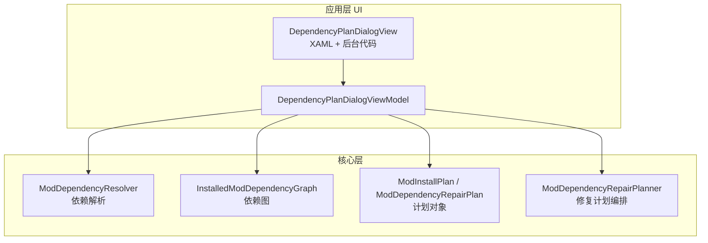
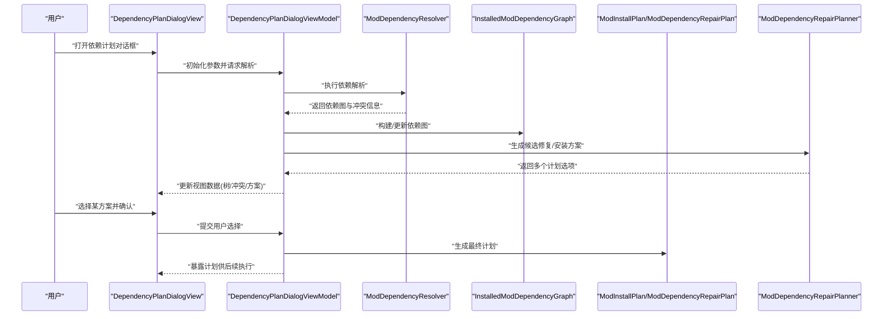
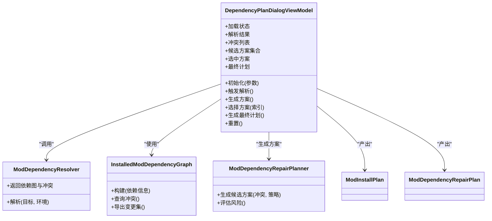
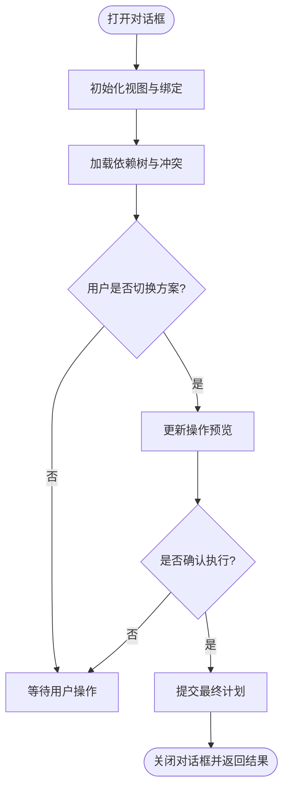
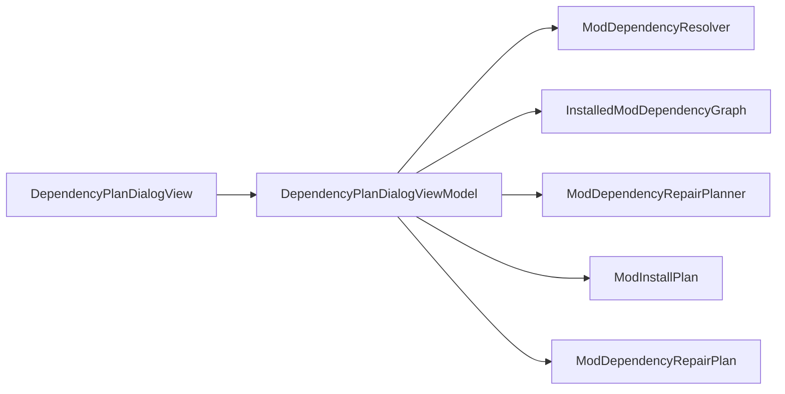
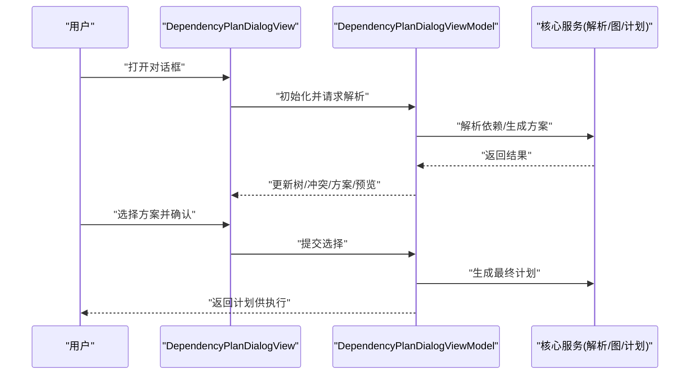

# 依赖计划对话框

<cite>
**本文引用的文件**   
- [DependencyPlanDialogViewModel.cs](file://src/Crystalfly.App/ViewModels/Dialogs/DependencyPlanDialogViewModel.cs)
- [DependencyPlanDialogView.axaml](file://src/Crystalfly.App/Views/Dialogs/DependencyPlanDialogView.axaml)
- [DependencyPlanDialogView.axaml.cs](file://src/Crystalfly.App/Views/Dialogs/DependencyPlanDialogView.axaml.cs)
- [ModDependencyResolver.cs](file://src/Crystalfly.Core/Mods/ModDependencyResolver.cs)
- [InstalledModDependencyGraph.cs](file://src/Crystalfly.Core/Mods/InstalledModDependencyGraph.cs)
- [ModInstallPlan.cs](file://src/Crystalfly.Core/Mods/ModInstallPlan.cs)
- [ModDependencyRepairPlanner.cs](file://src/Crystalfly.Core/Mods/ModDependencyRepairPlanner.cs)
- [ModDependencyRepairPlan.cs](file://src/Crystalfly.Core/Mods/ModDependencyRepairPlan.cs)
</cite>

## 目录
1. [简介](#简介)
2. [项目结构](#项目结构)
3. [核心组件](#核心组件)
4. [架构总览](#架构总览)
5. [详细组件分析](#详细组件分析)
6. [依赖关系分析](#依赖关系分析)
7. [性能考虑](#性能考虑)
8. [故障排查指南](#故障排查指南)
9. [结论](#结论)
10. [附录：使用示例与最佳实践](#附录使用示例与最佳实践)

## 简介
本文件面向“依赖计划对话框”组件，聚焦以下目标：
- 详细说明 DependencyPlanDialogView 的复杂界面布局，包括依赖关系树展示、冲突检测与解决方案选择。
- 记录 DependencyPlanDialogViewModel 的依赖解析结果展示、用户选择处理与计划生成逻辑。
- 提供依赖关系的可视化表示、冲突高亮显示和操作预览功能说明。
- 给出处理复杂模组依赖场景和用户决策的使用示例。
- 说明对话框的状态同步、实时更新与性能优化策略。

该对话框用于在用户安装或修复模组时，呈现依赖解析结果、潜在冲突与可选方案，并允许用户在多种解决路径中做出决策，最终生成可执行的安装/修复计划。

## 项目结构
与依赖计划对话框相关的代码主要分布在应用层（UI）与核心层（业务逻辑）：
- 视图层：DependencyPlanDialogView 及其后台代码负责渲染依赖树、冲突提示、操作预览与交互按钮。
- 视图模型层：DependencyPlanDialogViewModel 负责聚合依赖解析结果、维护用户选择、驱动计划生成与状态更新。
- 核心层：依赖解析器、依赖图、安装/修复计划等类型提供底层能力，供视图模型调用。

图表来源
- [DependencyPlanDialogView.axaml](file://src/Crystalfly.App/Views/Dialogs/DependencyPlanDialogView.axaml)
- [DependencyPlanDialogView.axaml.cs](file://src/Crystalfly.App/Views/Dialogs/DependencyPlanDialogView.axaml.cs)
- [DependencyPlanDialogViewModel.cs](file://src/Crystalfly.App/ViewModels/Dialogs/DependencyPlanDialogViewModel.cs)
- [ModDependencyResolver.cs](file://src/Crystalfly.Core/Mods/ModDependencyResolver.cs)
- [InstalledModDependencyGraph.cs](file://src/Crystalfly.Core/Mods/InstalledModDependencyGraph.cs)
- [ModInstallPlan.cs](file://src/Crystalfly.Core/Mods/ModInstallPlan.cs)
- [ModDependencyRepairPlanner.cs](file://src/Crystalfly.Core/Mods/ModDependencyRepairPlanner.cs)
- [ModDependencyRepairPlan.cs](file://src/Crystalfly.Core/Mods/ModDependencyRepairPlan.cs)

章节来源
- [DependencyPlanDialogView.axaml](file://src/Crystalfly.App/Views/Dialogs/DependencyPlanDialogView.axaml)
- [DependencyPlanDialogView.axaml.cs](file://src/Crystalfly.App/Views/Dialogs/DependencyPlanDialogView.axaml.cs)
- [DependencyPlanDialogViewModel.cs](file://src/Crystalfly.App/ViewModels/Dialogs/DependencyPlanDialogViewModel.cs)
- [ModDependencyResolver.cs](file://src/Crystalfly.Core/Mods/ModDependencyResolver.cs)
- [InstalledModDependencyGraph.cs](file://src/Crystalfly.Core/Mods/InstalledModDependencyGraph.cs)
- [ModInstallPlan.cs](file://src/Crystalfly.Core/Mods/ModInstallPlan.cs)
- [ModDependencyRepairPlanner.cs](file://src/Crystalfly.Core/Mods/ModDependencyRepairPlanner.cs)
- [ModDependencyRepairPlan.cs](file://src/Crystalfly.Core/Mods/ModDependencyRepairPlan.cs)

## 核心组件
- 视图模型：DependencyPlanDialogViewModel
  - 职责：封装依赖解析结果、冲突信息、可用解决方案；响应用户选择；生成并暴露计划对象；管理对话框状态（加载、错误、完成）。
  - 关键行为：触发解析、合并多源依赖、计算冲突、构建候选方案、根据用户选择确定最终计划。
- 视图：DependencyPlanDialogView
  - 职责：渲染依赖树、冲突列表、解决方案选项、操作预览面板；绑定命令与属性；处理用户交互。
  - 关键特性：支持展开/折叠节点、冲突高亮、滚动定位到冲突项、实时刷新。
- 核心服务与模型：
  - ModDependencyResolver：解析模组依赖，返回依赖图与冲突信息。
  - InstalledModDependencyGraph：表达已安装模组的依赖关系。
  - ModInstallPlan / ModDependencyRepairPlan：描述安装或修复的执行步骤与影响范围。
  - ModDependencyRepairPlanner：基于冲突与约束生成修复计划。

章节来源
- [DependencyPlanDialogViewModel.cs](file://src/Crystalfly.App/ViewModels/Dialogs/DependencyPlanDialogViewModel.cs)
- [DependencyPlanDialogView.axaml](file://src/Crystalfly.App/Views/Dialogs/DependencyPlanDialogView.axaml)
- [DependencyPlanDialogView.axaml.cs](file://src/Crystalfly.App/Views/Dialogs/DependencyPlanDialogView.axaml.cs)
- [ModDependencyResolver.cs](file://src/Crystalfly.Core/Mods/ModDependencyResolver.cs)
- [InstalledModDependencyGraph.cs](file://src/Crystalfly.Core/Mods/InstalledModDependencyGraph.cs)
- [ModInstallPlan.cs](file://src/Crystalfly.Core/Mods/ModInstallPlan.cs)
- [ModDependencyRepairPlanner.cs](file://src/Crystalfly.Core/Mods/ModDependencyRepairPlanner.cs)
- [ModDependencyRepairPlan.cs](file://src/Crystalfly.Core/Mods/ModDependencyRepairPlan.cs)

## 架构总览
下图展示了从用户操作到计划生成的端到端流程，以及各组件之间的协作关系。

图表来源
- [DependencyPlanDialogViewModel.cs](file://src/Crystalfly.App/ViewModels/Dialogs/DependencyPlanDialogViewModel.cs)
- [DependencyPlanDialogView.axaml.cs](file://src/Crystalfly.App/Views/Dialogs/DependencyPlanDialogView.axaml.cs)
- [ModDependencyResolver.cs](file://src/Crystalfly.Core/Mods/ModDependencyResolver.cs)
- [InstalledModDependencyGraph.cs](file://src/Crystalfly.Core/Mods/InstalledModDependencyGraph.cs)
- [ModInstallPlan.cs](file://src/Crystalfly.Core/Mods/ModInstallPlan.cs)
- [ModDependencyRepairPlanner.cs](file://src/Crystalfly.Core/Mods/ModDependencyRepairPlanner.cs)
- [ModDependencyRepairPlan.cs](file://src/Crystalfly.Core/Mods/ModDependencyRepairPlan.cs)

## 详细组件分析

### 视图模型：DependencyPlanDialogViewModel
- 输入与上下文
  - 接收待安装/修复的目标模组集合、当前实例环境、可选的预置策略（如优先保留版本、跳过不兼容项等）。
- 依赖解析与冲突检测
  - 调用依赖解析器获取依赖图与冲突清单；将冲突按严重级别分类（例如版本冲突、循环依赖、缺失依赖）。
- 方案生成与排序
  - 基于冲突与策略生成若干候选计划（如升级/降级、替换、移除冲突方、忽略警告继续），并按风险与影响面排序。
- 用户选择处理
  - 暴露当前选中方案、变更摘要、回滚点等信息；监听用户切换方案后重新计算预览。
- 计划生成与输出
  - 根据最终选择生成 ModInstallPlan 或 ModDependencyRepairPlan，包含步骤顺序、受影响模组、前置条件与校验点。
- 状态与通知
  - 管理加载/错误/完成状态；通过事件或属性变更通知视图进行刷新。

图表来源
- [DependencyPlanDialogViewModel.cs](file://src/Crystalfly.App/ViewModels/Dialogs/DependencyPlanDialogViewModel.cs)
- [ModDependencyResolver.cs](file://src/Crystalfly.Core/Mods/ModDependencyResolver.cs)
- [InstalledModDependencyGraph.cs](file://src/Crystalfly.Core/Mods/InstalledModDependencyGraph.cs)
- [ModDependencyRepairPlanner.cs](file://src/Crystalfly.Core/Mods/ModDependencyRepairPlanner.cs)
- [ModInstallPlan.cs](file://src/Crystalfly.Core/Mods/ModInstallPlan.cs)
- [ModDependencyRepairPlan.cs](file://src/Crystalfly.Core/Mods/ModDependencyRepairPlan.cs)

章节来源
- [DependencyPlanDialogViewModel.cs](file://src/Crystalfly.App/ViewModels/Dialogs/DependencyPlanDialogViewModel.cs)
- [ModDependencyResolver.cs](file://src/Crystalfly.Core/Mods/ModDependencyResolver.cs)
- [InstalledModDependencyGraph.cs](file://src/Crystalfly.Core/Mods/InstalledModDependencyGraph.cs)
- [ModDependencyRepairPlanner.cs](file://src/Crystalfly.Core/Mods/ModDependencyRepairPlanner.cs)
- [ModInstallPlan.cs](file://src/Crystalfly.Core/Mods/ModInstallPlan.cs)
- [ModDependencyRepairPlan.cs](file://src/Crystalfly.Core/Mods/ModDependencyRepairPlan.cs)

### 视图：DependencyPlanDialogView
- 布局要点
  - 左侧：依赖关系树，支持层级展开/折叠、搜索过滤、定位到冲突节点。
  - 中部：冲突列表与详情，按严重级别分组，提供一键跳转到对应树节点。
  - 右侧：解决方案选择区，展示候选计划的差异对比与风险评估。
  - 底部：操作预览面板，列出即将执行的操作序列、影响范围与回滚信息。
- 交互行为
  - 用户点击“生成计划”触发视图模型解析；选择不同方案即时更新预览；确认后将最终计划传递给上层执行器。
- 数据绑定
  - 通过属性与命令实现双向绑定，确保视图与视图模型状态一致。

图表来源
- [DependencyPlanDialogView.axaml](file://src/Crystalfly.App/Views/Dialogs/DependencyPlanDialogView.axaml)
- [DependencyPlanDialogView.axaml.cs](file://src/Crystalfly.App/Views/Dialogs/DependencyPlanDialogView.axaml.cs)
- [DependencyPlanDialogViewModel.cs](file://src/Crystalfly.App/ViewModels/Dialogs/DependencyPlanDialogViewModel.cs)

章节来源
- [DependencyPlanDialogView.axaml](file://src/Crystalfly.App/Views/Dialogs/DependencyPlanDialogView.axaml)
- [DependencyPlanDialogView.axaml.cs](file://src/Crystalfly.App/Views/Dialogs/DependencyPlanDialogView.axaml.cs)
- [DependencyPlanDialogViewModel.cs](file://src/Crystalfly.App/ViewModels/Dialogs/DependencyPlanDialogViewModel.cs)

## 依赖关系分析
- 耦合关系
  - 视图对视图模型强依赖，遵循 MVVM 模式；视图模型对核心服务弱依赖，便于测试与替换。
- 外部集成点
  - 依赖解析器可能访问本地文件系统与元数据缓存；计划对象可能被安装/修复执行器消费。
- 可能的循环依赖
  - 视图模型不应反向依赖视图；核心层之间保持单向依赖（解析→图→计划→执行）。

图表来源
- [DependencyPlanDialogView.axaml.cs](file://src/Crystalfly.App/Views/Dialogs/DependencyPlanDialogView.axaml.cs)
- [DependencyPlanDialogViewModel.cs](file://src/Crystalfly.App/ViewModels/Dialogs/DependencyPlanDialogViewModel.cs)
- [ModDependencyResolver.cs](file://src/Crystalfly.Core/Mods/ModDependencyResolver.cs)
- [InstalledModDependencyGraph.cs](file://src/Crystalfly.Core/Mods/InstalledModDependencyGraph.cs)
- [ModDependencyRepairPlanner.cs](file://src/Crystalfly.Core/Mods/ModDependencyRepairPlanner.cs)
- [ModInstallPlan.cs](file://src/Crystalfly.Core/Mods/ModInstallPlan.cs)
- [ModDependencyRepairPlan.cs](file://src/Crystalfly.Core/Mods/ModDependencyRepairPlan.cs)

章节来源
- [DependencyPlanDialogView.axaml.cs](file://src/Crystalfly.App/Views/Dialogs/DependencyPlanDialogView.axaml.cs)
- [DependencyPlanDialogViewModel.cs](file://src/Crystalfly.App/ViewModels/Dialogs/DependencyPlanDialogViewModel.cs)
- [ModDependencyResolver.cs](file://src/Crystalfly.Core/Mods/ModDependencyResolver.cs)
- [InstalledModDependencyGraph.cs](file://src/Crystalfly.Core/Mods/InstalledModDependencyGraph.cs)
- [ModDependencyRepairPlanner.cs](file://src/Crystalfly.Core/Mods/ModDependencyRepairPlanner.cs)
- [ModInstallPlan.cs](file://src/Crystalfly.Core/Mods/ModInstallPlan.cs)
- [ModDependencyRepairPlan.cs](file://src/Crystalfly.Core/Mods/ModDependencyRepairPlan.cs)

## 性能考虑
- 大数据量依赖树的虚拟化与懒加载
  - 仅渲染可见节点，按需展开子树，避免一次性构建完整树导致卡顿。
- 增量更新与防抖
  - 对频繁的属性变更（如搜索过滤）采用防抖；冲突列表与方案预览仅在必要时机重算。
- 异步与取消
  - 依赖解析与方案生成应在后台线程执行，并提供取消令牌以响应用户快速切换。
- 内存与对象复用
  - 重用计划对象与中间结果，减少 GC 压力；对只读数据进行快照化共享。
- 渲染优化
  - 冲突高亮与定位应避免全量重绘，采用局部刷新与延迟绘制策略。

[本节为通用性能建议，无需特定文件引用]

## 故障排查指南
- 常见问题
  - 依赖解析失败：检查网络与本地缓存、模组清单完整性、版本兼容性规则。
  - 冲突无法自动解决：查看冲突详情，手动调整策略（如强制降级/移除）。
  - 预览不一致：确认当前选中方案与依赖图状态一致，必要时重置视图模型。
- 诊断步骤
  - 启用详细日志，记录解析输入、冲突清单与方案评分。
  - 导出依赖图与计划对象，离线复现问题。
  - 逐步缩小目标模组集合，定位最小冲突集。
- 恢复策略
  - 使用计划中的回滚点恢复；若回滚不可用，先卸载冲突模组再重试。

章节来源
- [DependencyPlanDialogViewModel.cs](file://src/Crystalfly.App/ViewModels/Dialogs/DependencyPlanDialogViewModel.cs)
- [DependencyPlanDialogView.axaml.cs](file://src/Crystalfly.App/Views/Dialogs/DependencyPlanDialogView.axaml.cs)
- [ModDependencyResolver.cs](file://src/Crystalfly.Core/Mods/ModDependencyResolver.cs)
- [ModDependencyRepairPlanner.cs](file://src/Crystalfly.Core/Mods/ModDependencyRepairPlanner.cs)

## 结论
依赖计划对话框通过清晰的视图分层与稳健的视图模型逻辑，将复杂的依赖解析、冲突检测与方案选择过程透明化，帮助用户在高风险操作中做出知情决策。结合虚拟化、异步与增量更新等策略，可在大规模模组生态下保持良好体验。

[本节为总结性内容，无需特定文件引用]

## 附录：使用示例与最佳实践

### 典型工作流
- 打开对话框并传入目标模组与环境参数。
- 视图模型执行依赖解析，生成依赖树与冲突清单。
- 自动生成若干候选方案，用户浏览并选择最合适的方案。
- 预览操作序列与影响范围，确认后生成最终计划并交由执行器运行。

图表来源
- [DependencyPlanDialogView.axaml.cs](file://src/Crystalfly.App/Views/Dialogs/DependencyPlanDialogView.axaml.cs)
- [DependencyPlanDialogViewModel.cs](file://src/Crystalfly.App/ViewModels/Dialogs/DependencyPlanDialogViewModel.cs)
- [ModDependencyResolver.cs](file://src/Crystalfly.Core/Mods/ModDependencyResolver.cs)
- [InstalledModDependencyGraph.cs](file://src/Crystalfly.Core/Mods/InstalledModDependencyGraph.cs)
- [ModInstallPlan.cs](file://src/Crystalfly.Core/Mods/ModInstallPlan.cs)
- [ModDependencyRepairPlanner.cs](file://src/Crystalfly.Core/Mods/ModDependencyRepairPlanner.cs)
- [ModDependencyRepairPlan.cs](file://src/Crystalfly.Core/Mods/ModDependencyRepairPlan.cs)

### 复杂模组依赖场景
- 多版本共存与选择性升级
  - 当同一库存在多个版本时，视图模型应提供“按模块隔离”的方案，并在预览中标注潜在运行时冲突。
- 循环依赖与拓扑排序
  - 检测到环时，视图需高亮相关节点，并提供打破环的策略（如移除桥接模组或引入替代依赖）。
- 缺失依赖与回退链
  - 对于缺失依赖，自动生成回退链并标注风险等级，允许用户选择“忽略警告继续”或“中止”。

### 用户决策辅助
- 冲突高亮与一键定位
  - 在依赖树中突出显示冲突节点，并提供“定位到冲突”的快捷操作。
- 方案对比与风险评估
  - 并列展示候选方案的差异（新增/删除/升级/降级）、影响范围与回滚成本。
- 操作预览与回滚点
  - 明确列出每一步操作的预期效果与回滚点，降低误操作风险。

### 状态同步与实时更新
- 属性变更通知
  - 视图模型在解析、方案变化、选中项切换时及时通知视图，保证 UI 一致性。
- 防抖与节流
  - 对高频输入（如搜索）进行防抖，避免重复计算与渲染抖动。
- 异步进度反馈
  - 在长时间任务中提供进度与取消入口，提升用户体验。

### 性能优化策略
- 虚拟树与分页加载
  - 对大型依赖树采用虚拟化渲染与分页加载，减少内存占用与首屏时间。
- 增量计算与缓存
  - 对依赖解析结果与方案评分进行缓存，仅在输入变化时增量更新。
- 批量更新与批渲染
  - 将多次属性变更合并为一次批量更新，降低 UI 刷新频率。

[本节为概念性与指导性内容，无需特定文件引用]