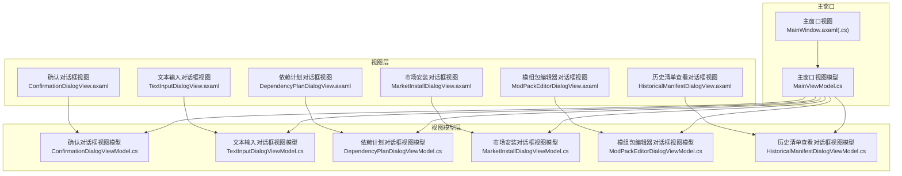
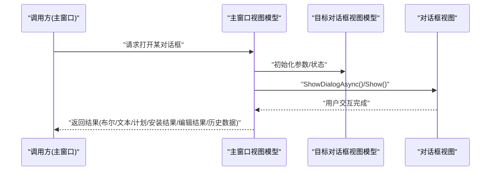
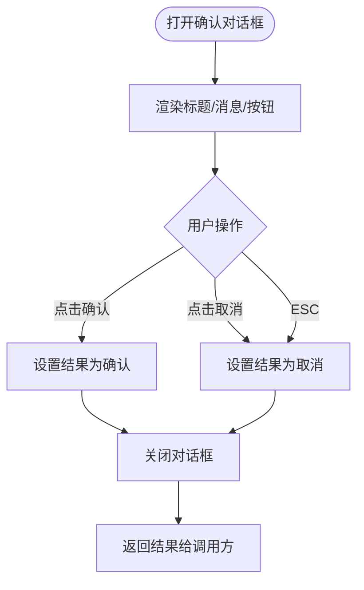
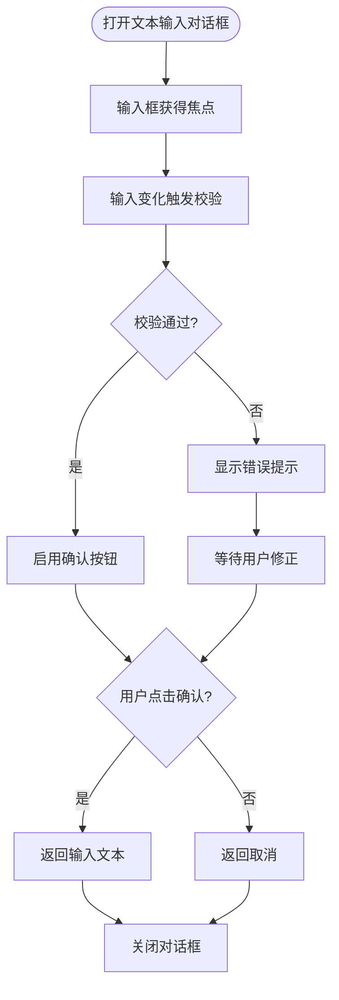
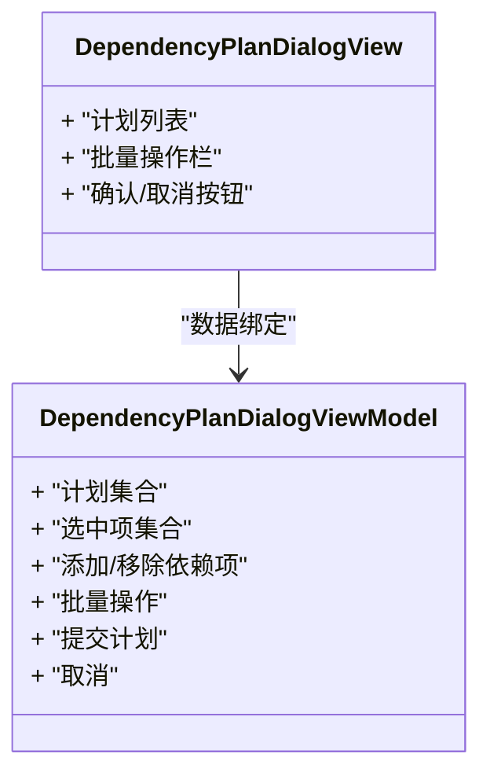
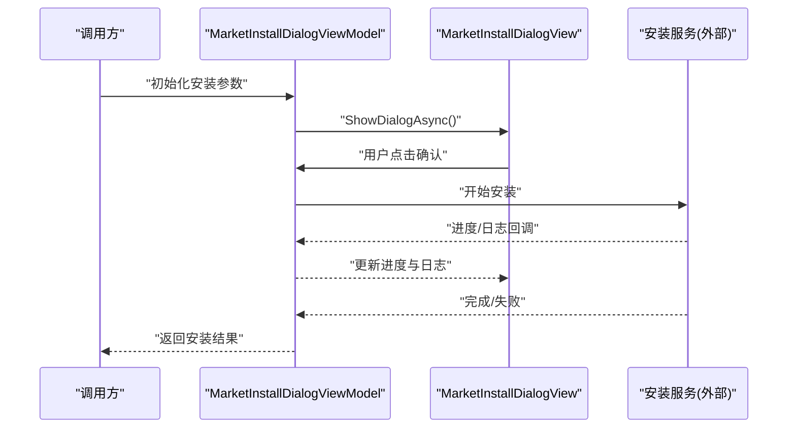
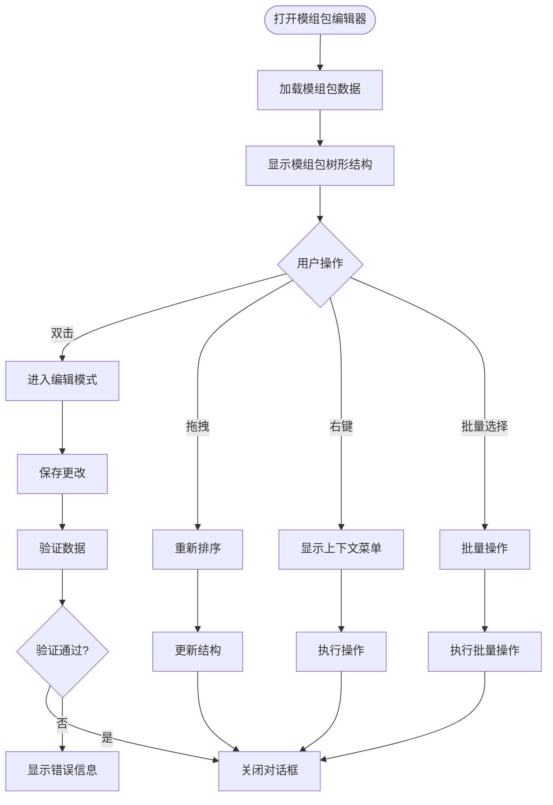
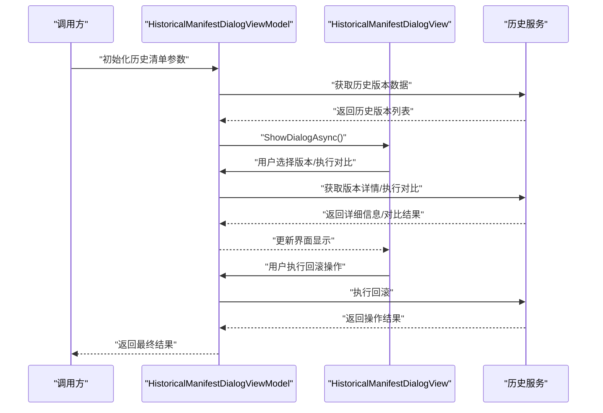
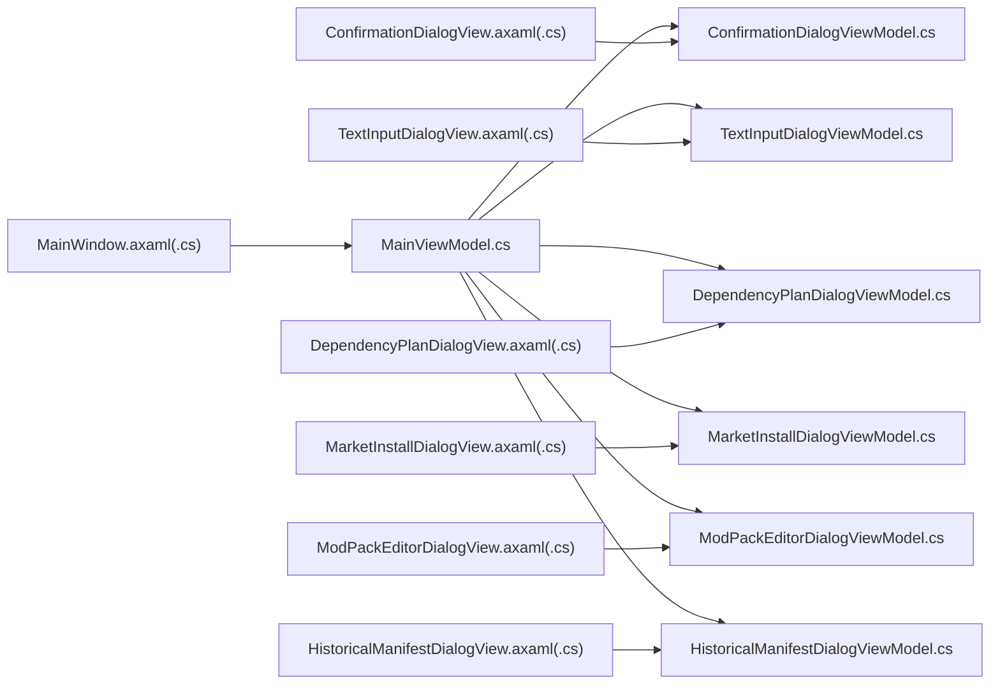
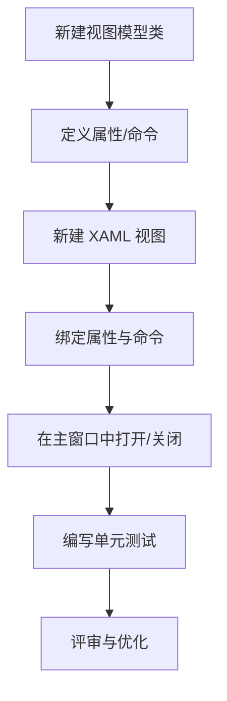

# 对话框组件

<cite>
**本文引用的文件**   
- [ConfirmationDialogViewModel.cs](file://src/Crystalfly.App/ViewModels/Dialogs/ConfirmationDialogViewModel.cs)
- [TextInputDialogViewModel.cs](file://src/Crystalfly.App/ViewModels/Dialogs/TextInputDialogViewModel.cs)
- [DependencyPlanDialogViewModel.cs](file://src/Crystalfly.App/ViewModels/Dialogs/DependencyPlanDialogViewModel.cs)
- [MarketInstallDialogViewModel.cs](file://src/Crystalfly.App/ViewModels/Dialogs/MarketInstallDialogViewModel.cs)
- [ModPackEditorDialogViewModel.cs](file://src/Crystalfly.App/ViewModels/Dialogs/ModPackEditorDialogViewModel.cs)
- [HistoricalManifestDialogViewModel.cs](file://src/Crystalfly.App/ViewModels/Dialogs/HistoricalManifestDialogViewModel.cs)
- [ConfirmationDialogView.axaml](file://src/Crystalfly.App/Views/Dialogs/ConfirmationDialogView.axaml)
- [ConfirmationDialogView.axaml.cs](file://src/Crystalfly.App/Views/Dialogs/ConfirmationDialogView.axaml.cs)
- [TextInputDialogView.axaml](file://src/Crystalfly.App/Views/Dialogs/TextInputDialogView.axaml)
- [TextInputDialogView.axaml.cs](file://src/Crystalfly.App/Views/Dialogs/TextInputDialogView.axaml.cs)
- [DependencyPlanDialogView.axaml](file://src/Crystalfly.App/Views/Dialogs/DependencyPlanDialogView.axaml)
- [DependencyPlanDialogView.axaml.cs](file://src/Crystalfly.App/Views/Dialogs/DependencyPlanDialogView.axaml.cs)
- [MarketInstallDialogView.axaml](file://src/Crystalfly.App/Views/Dialogs/MarketInstallDialogView.axaml)
- [MarketInstallDialogView.axaml.cs](file://src/Crystalfly.App/Views/Dialogs/MarketInstallDialogView.axaml.cs)
- [ModPackEditorDialogView.axaml](file://src/Crystalfly.App/Views/Dialogs/ModPackEditorDialogView.axaml)
- [ModPackEditorDialogView.axaml.cs](file://src/Crystalfly.App/Views/Dialogs/ModPackEditorDialogView.axaml.cs)
- [HistoricalManifestDialogView.axaml](file://src/Crystalfly.App/Views/Dialogs/HistoricalManifestDialogView.axaml)
- [HistoricalManifestDialogView.axaml.cs](file://src/Crystalfly.App/Views/Dialogs/HistoricalManifestDialogView.axaml.cs)
- [MainWindow.axaml](file://src/Crystalfly.App/Views/MainWindow.axaml)
- [MainWindow.axaml.cs](file://src/Crystalfly.App/Views/MainWindow.axaml.cs)
- [MainViewModel.cs](file://src/Crystalfly.App/ViewModels/MainViewModel.cs)
- [DialogViewModelTests.cs](file://tests/Crystalfly.App.Tests/ViewModels/DialogViewModelTests.cs)
- [MarketInstallDialogViewModelTests.cs](file://tests/Crystalfly.App.Tests/ViewModels/MarketInstallDialogViewModelTests.cs)
</cite>

## 更新摘要
**所做更改**
- 新增模组包编辑器对话框（ModPackEditorDialog）文档章节
- 新增历史清单查看对话框（HistoricalManifestDialog）文档章节
- 更新项目结构图以包含新对话框组件
- 更新核心组件概述以涵盖新增功能
- 扩展依赖关系分析以包含新对话框的集成方式

## 目录
1. [简介](#简介)
2. [项目结构](#项目结构)
3. [核心组件](#核心组件)
4. [架构总览](#架构总览)
5. [详细组件分析](#详细组件分析)
6. [依赖关系分析](#依赖关系分析)
7. [性能与可用性考虑](#性能与可用性考虑)
8. [故障排查指南](#故障排查指南)
9. [结论](#结论)
10. [附录：自定义对话框开发模板与最佳实践](#附录自定义对话框开发模板与最佳实践)

## 简介
本文件面向 Crystalfly 应用中的对话框组件集合，聚焦以下六种对话框的实现与使用方式：
- 确认对话框（ConfirmationDialog）
- 文本输入对话框（TextInputDialog）
- 依赖计划对话框（DependencyPlanDialog）
- 市场安装对话框（MarketInstallDialog）
- **模组包编辑器对话框（ModPackEditorDialog）** - 新增
- **历史清单查看对话框（HistoricalManifestDialog）** - 新增

文档将覆盖 XAML 布局、数据绑定、用户交互逻辑、返回值处理、显示隐藏控制、模态行为以及用户体验优化，并提供可复用的自定义对话框开发模板与最佳实践。

## 项目结构
对话框采用 MVVM 模式组织，每个对话框包含：
- ViewModels：承载状态、命令与业务交互
- Views：XAML 布局与代码隐藏（仅做 UI 事件桥接）
- 测试：针对 ViewModel 的行为验证

图表来源
- [ConfirmationDialogView.axaml](file://src/Crystalfly.App/Views/Dialogs/ConfirmationDialogView.axaml)
- [ConfirmationDialogView.axaml.cs](file://src/Crystalfly.App/Views/Dialogs/ConfirmationDialogView.axaml.cs)
- [ConfirmationDialogViewModel.cs](file://src/Crystalfly.App/ViewModels/Dialogs/ConfirmationDialogViewModel.cs)
- [TextInputDialogView.axaml](file://src/Crystalfly.App/Views/Dialogs/TextInputDialogView.axaml)
- [TextInputDialogView.axaml.cs](file://src/Crystalfly.App/Views/Dialogs/TextInputDialogView.axaml.cs)
- [TextInputDialogViewModel.cs](file://src/Crystalfly.App/ViewModels/Dialogs/TextInputDialogViewModel.cs)
- [DependencyPlanDialogView.axaml](file://src/Crystalfly.App/Views/Dialogs/DependencyPlanDialogView.axaml)
- [DependencyPlanDialogView.axaml.cs](file://src/Crystalfly.App/Views/Dialogs/DependencyPlanDialogView.axaml.cs)
- [DependencyPlanDialogViewModel.cs](file://src/Crystalfly.App/ViewModels/Dialogs/DependencyPlanDialogViewModel.cs)
- [MarketInstallDialogView.axaml](file://src/Crystalfly.App/Views/Dialogs/MarketInstallDialogView.axaml)
- [MarketInstallDialogView.axaml.cs](file://src/Crystalfly.App/Views/Dialogs/MarketInstallDialogView.axaml.cs)
- [MarketInstallDialogViewModel.cs](file://src/Crystalfly.App/ViewModels/Dialogs/MarketInstallDialogViewModel.cs)
- [ModPackEditorDialogView.axaml](file://src/Crystalfly.App/Views/Dialogs/ModPackEditorDialogView.axaml)
- [ModPackEditorDialogView.axaml.cs](file://src/Crystalfly.App/Views/Dialogs/ModPackEditorDialogView.axaml.cs)
- [ModPackEditorDialogViewModel.cs](file://src/Crystalfly.App/ViewModels/Dialogs/ModPackEditorDialogViewModel.cs)
- [HistoricalManifestDialogView.axaml](file://src/Crystalfly.App/Views/Dialogs/HistoricalManifestDialogView.axaml)
- [HistoricalManifestDialogView.axaml.cs](file://src/Crystalfly.App/Views/Dialogs/HistoricalManifestDialogView.axaml.cs)
- [HistoricalManifestDialogViewModel.cs](file://src/Crystalfly.App/ViewModels/Dialogs/HistoricalManifestDialogViewModel.cs)
- [MainWindow.axaml](file://src/Crystalfly.App/Views/MainWindow.axaml)
- [MainWindow.axaml.cs](file://src/Crystalfly.App/Views/MainWindow.axaml.cs)
- [MainViewModel.cs](file://src/Crystalfly.App/ViewModels/MainViewModel.cs)

章节来源
- [MainWindow.axaml](file://src/Crystalfly.App/Views/MainWindow.axaml)
- [MainWindow.axaml.cs](file://src/Crystalfly.App/Views/MainWindow.axaml.cs)
- [MainViewModel.cs](file://src/Crystalfly.App/ViewModels/MainViewModel.cs)

## 核心组件
本节概述六类对话框的职责与交互要点：
- 确认对话框：用于二次确认操作，返回布尔结果或用户选择
- 文本输入对话框：收集单行或多行文本输入，支持校验与默认值
- 依赖计划对话框：展示并允许用户调整依赖变更计划，确认后执行
- 市场安装对话框：从市场安装模组，支持进度反馈与错误提示
- **模组包编辑器对话框**：提供模组包的创建、编辑和管理功能，支持批量操作和配置管理
- **历史清单查看对话框**：展示模组历史版本清单，支持版本对比和回滚操作

章节来源
- [ConfirmationDialogViewModel.cs](file://src/Crystalfly.App/ViewModels/Dialogs/ConfirmationDialogViewModel.cs)
- [TextInputDialogViewModel.cs](file://src/Crystalfly.App/ViewModels/Dialogs/TextInputDialogViewModel.cs)
- [DependencyPlanDialogViewModel.cs](file://src/Crystalfly.App/ViewModels/Dialogs/DependencyPlanDialogViewModel.cs)
- [MarketInstallDialogViewModel.cs](file://src/Crystalfly.App/ViewModels/Dialogs/MarketInstallDialogViewModel.cs)
- [ModPackEditorDialogViewModel.cs](file://src/Crystalfly.App/ViewModels/Dialogs/ModPackEditorDialogViewModel.cs)
- [HistoricalManifestDialogViewModel.cs](file://src/Crystalfly.App/ViewModels/Dialogs/HistoricalManifestDialogViewModel.cs)

## 架构总览
对话框在应用中通过主窗口进行调度，遵循"视图模型驱动 + 视图呈现"的 MVVM 模式。主窗口负责打开/关闭对话框，并将对话框结果回传至调用方。

图表来源
- [MainWindow.axaml.cs](file://src/Crystalfly.App/Views/MainWindow.axaml.cs)
- [MainViewModel.cs](file://src/Crystalfly.App/ViewModels/MainViewModel.cs)
- [ConfirmationDialogViewModel.cs](file://src/Crystalfly.App/ViewModels/Dialogs/ConfirmationDialogViewModel.cs)
- [TextInputDialogViewModel.cs](file://src/Crystalfly.App/ViewModels/Dialogs/TextInputDialogViewModel.cs)
- [DependencyPlanDialogViewModel.cs](file://src/Crystalfly.App/ViewModels/Dialogs/DependencyPlanDialogViewModel.cs)
- [MarketInstallDialogViewModel.cs](file://src/Crystalfly.App/ViewModels/Dialogs/MarketInstallDialogViewModel.cs)
- [ModPackEditorDialogViewModel.cs](file://src/Crystalfly.App/ViewModels/Dialogs/ModPackEditorDialogViewModel.cs)
- [HistoricalManifestDialogViewModel.cs](file://src/Crystalfly.App/ViewModels/Dialogs/HistoricalManifestDialogViewModel.cs)

## 详细组件分析

### 确认对话框（ConfirmationDialog）
- 职责
  - 向用户展示确认信息，获取"确认/取消"等选择
  - 返回布尔或枚举结果供调用方决策
- XAML 布局要点
  - 标题、消息内容区域
  - 按钮组（确认/取消），支持键盘导航与回车/ESC 快捷键
- 数据绑定
  - 标题、消息文本、按钮文案均通过属性绑定
  - 是否启用确认按钮可由条件属性控制
- 用户交互逻辑
  - 点击确认：设置结果为"已确认"，关闭对话框
  - 点击取消：设置结果为"已取消"，关闭对话框
  - ESC 键：等价于取消
- 返回值处理
  - 调用方根据返回值执行不同分支（如继续/中止）
- 显示/隐藏与模态
  - 以模态方式阻塞后续交互，直到用户做出选择
- 用户体验优化
  - 焦点默认落在确认按钮
  - 长文本自动换行，避免截断
  - 提供清晰的标题与说明，减少歧义

图表来源
- [ConfirmationDialogView.axaml](file://src/Crystalfly.App/Views/Dialogs/ConfirmationDialogView.axaml)
- [ConfirmationDialogView.axaml.cs](file://src/Crystalfly.App/Views/Dialogs/ConfirmationDialogView.axaml.cs)
- [ConfirmationDialogViewModel.cs](file://src/Crystalfly.App/ViewModels/Dialogs/ConfirmationDialogViewModel.cs)

章节来源
- [ConfirmationDialogView.axaml](file://src/Crystalfly.App/Views/Dialogs/ConfirmationDialogView.axaml)
- [ConfirmationDialogView.axaml.cs](file://src/Crystalfly.App/Views/Dialogs/ConfirmationDialogView.axaml.cs)
- [ConfirmationDialogViewModel.cs](file://src/Crystalfly.App/ViewModels/Dialogs/ConfirmationDialogViewModel.cs)

### 文本输入对话框（TextInputDialog）
- 职责
  - 收集用户输入的文本，支持默认值与校验规则
- XAML 布局要点
  - 标题、提示文本、输入框（单行/多行）、校验提示区
  - 确认/取消按钮；输入框获得初始焦点
- 数据绑定
  - 输入文本双向绑定到视图模型属性
  - 校验状态与错误信息绑定到界面元素
- 用户交互逻辑
  - 输入变化时触发校验，更新可用状态
  - 确认：若校验通过则返回输入文本；否则阻止关闭并提示错误
  - 取消：直接关闭并返回空或取消标记
- 返回值处理
  - 调用方接收文本后执行业务逻辑（如重命名、搜索、过滤）
- 显示/隐藏与模态
  - 模态显示，确保输入完成前无法切换上下文
- 用户体验优化
  - 实时校验反馈，避免提交后才报错
  - 支持 Enter 确认、Esc 取消
  - 对超长输入提供滚动与字符计数

图表来源
- [TextInputDialogView.axaml](file://src/Crystalfly.App/Views/Dialogs/TextInputDialogView.axaml)
- [TextInputDialogView.axaml.cs](file://src/Crystalfly.App/Views/Dialogs/TextInputDialogView.axaml.cs)
- [TextInputDialogViewModel.cs](file://src/Crystalfly.App/ViewModels/Dialogs/TextInputDialogViewModel.cs)

章节来源
- [TextInputDialogView.axaml](file://src/Crystalfly.App/Views/Dialogs/TextInputDialogView.axaml)
- [TextInputDialogView.axaml.cs](file://src/Crystalfly.App/Views/Dialogs/TextInputDialogView.axaml.cs)
- [TextInputDialogViewModel.cs](file://src/Crystalfly.App/ViewModels/Dialogs/TextInputDialogViewModel.cs)

### 依赖计划对话框（DependencyPlanDialog）
- 职责
  - 展示模组依赖变更计划（新增/移除/版本变更），允许用户审阅与微调
- XAML 布局要点
  - 计划概览（统计摘要）
  - 列表项（每项含名称、类型、版本、影响范围）
  - 批量操作（全选/反选）、筛选与排序
  - 确认/取消按钮
- 数据绑定
  - 计划集合绑定到列表控件
  - 选中状态、禁用状态、展开详情等属性绑定
- 用户交互逻辑
  - 勾选/取消单个依赖项，动态更新计划
  - 批量操作快速调整计划
  - 确认：提交最终计划；取消：丢弃更改
- 返回值处理
  - 调用方依据最终计划执行安装/卸载流程
- 显示/隐藏与模态
  - 模态显示，防止用户在计划未确认时误操作
- 用户体验优化
  - 大列表虚拟化渲染，保持流畅
  - 关键风险项高亮提示
  - 提供"撤销最近一次修改"能力

图表来源
- [DependencyPlanDialogView.axaml](file://src/Crystalfly.App/Views/Dialogs/DependencyPlanDialogView.axaml)
- [DependencyPlanDialogView.axaml.cs](file://src/Crystalfly.App/Views/Dialogs/DependencyPlanDialogView.axaml.cs)
- [DependencyPlanDialogViewModel.cs](file://src/Crystalfly.App/ViewModels/Dialogs/DependencyPlanDialogViewModel.cs)

章节来源
- [DependencyPlanDialogView.axaml](file://src/Crystalfly.App/Views/Dialogs/DependencyPlanDialogView.axaml)
- [DependencyPlanDialogView.axaml.cs](file://src/Crystalfly.App/Views/Dialogs/DependencyPlanDialogView.axaml.cs)
- [DependencyPlanDialogViewModel.cs](file://src/Crystalfly.App/ViewModels/Dialogs/DependencyPlanDialogViewModel.cs)

### 市场安装对话框（MarketInstallDialog）
- 职责
  - 引导用户完成从市场安装模组的全流程，包括预览、确认、进度反馈与错误处理
- XAML 布局要点
  - 安装目标与前置条件检查
  - 安装清单（依赖、冲突、变更集）
  - 进度条与日志输出区
  - 确认/取消按钮
- 数据绑定
  - 安装清单与状态绑定
  - 进度百分比与日志条目集合绑定
- 用户交互逻辑
  - 预览阶段：用户可调整安装选项
  - 确认阶段：开始安装，禁用确认按钮，启用取消
  - 进行中：实时更新进度与日志
  - 完成/失败：显示结果，提供重试或查看详情入口
- 返回值处理
  - 调用方根据安装结果更新 UI 与状态
- 显示/隐藏与模态
  - 模态显示，保证安装过程不被中断
- 用户体验优化
  - 长时间任务提供取消与后台继续选项
  - 错误信息可读且可操作（如"查看原因"、"重试"）
  - 进度分段提示，缓解等待焦虑

图表来源
- [MarketInstallDialogView.axaml](file://src/Crystalfly.App/Views/Dialogs/MarketInstallDialogView.axaml)
- [MarketInstallDialogView.axaml.cs](file://src/Crystalfly.App/Views/Dialogs/MarketInstallDialogView.axaml.cs)
- [MarketInstallDialogViewModel.cs](file://src/Crystalfly.App/ViewModels/Dialogs/MarketInstallDialogViewModel.cs)

章节来源
- [MarketInstallDialogView.axaml](file://src/Crystalfly.App/Views/Dialogs/MarketInstallDialogView.axaml)
- [MarketInstallDialogView.axaml.cs](file://src/Crystalfly.App/Views/Dialogs/MarketInstallDialogView.axaml.cs)
- [MarketInstallDialogViewModel.cs](file://src/Crystalfly.App/ViewModels/Dialogs/MarketInstallDialogViewModel.cs)

### 模组包编辑器对话框（ModPackEditorDialog）
- 职责
  - 提供模组包的创建、编辑和管理功能
  - 支持模组包的导入、导出、备份和恢复操作
  - 提供模组包的批量管理和配置编辑界面
- XAML 布局要点
  - 模组包列表视图（支持树形结构展示）
  - 模组包属性编辑面板
  - 批量操作工具栏（添加、删除、移动、复制）
  - 导入/导出按钮和操作日志区
  - 搜索和筛选功能
- 数据绑定
  - 模组包集合与树形控件绑定
  - 选中模组包的属性与编辑表单绑定
  - 操作状态与进度指示器绑定
- 用户交互逻辑
  - 双击模组包进入编辑模式
  - 拖拽支持模组包重新排序
  - 右键菜单提供快捷操作
  - 批量选择支持 Shift/Ctrl 多选
  - 撤销/重做操作支持
- 返回值处理
  - 返回编辑后的模组包对象或操作结果
  - 支持部分成功的情况返回详细结果
- 显示/隐藏与模态
  - 模态显示，确保编辑操作的完整性
  - 支持嵌套编辑场景
- 用户体验优化
  - 实时保存草稿，防止数据丢失
  - 操作确认和警告提示
  - 进度反馈和错误处理
  - 键盘快捷键支持

图表来源
- [ModPackEditorDialogView.axaml](file://src/Crystalfly.App/Views/Dialogs/ModPackEditorDialogView.axaml)
- [ModPackEditorDialogView.axaml.cs](file://src/Crystalfly.App/Views/Dialogs/ModPackEditorDialogView.axaml.cs)
- [ModPackEditorDialogViewModel.cs](file://src/Crystalfly.App/ViewModels/Dialogs/ModPackEditorDialogViewModel.cs)

章节来源
- [ModPackEditorDialogView.axaml](file://src/Crystalfly.App/Views/Dialogs/ModPackEditorDialogView.axaml)
- [ModPackEditorDialogView.axaml.cs](file://src/Crystalfly.App/Views/Dialogs/ModPackEditorDialogView.axaml.cs)
- [ModPackEditorDialogViewModel.cs](file://src/Crystalfly.App/ViewModels/Dialogs/ModPackEditorDialogViewModel.cs)

### 历史清单查看对话框（HistoricalManifestDialog）
- 职责
  - 展示模组的历史版本清单和变更记录
  - 支持版本对比、回滚和快照管理
  - 提供历史数据的查询和分析功能
- XAML 布局要点
  - 历史版本时间线视图
  - 版本详情面板（包含变更说明、依赖变化）
  - 版本对比工具（差异高亮显示）
  - 回滚操作确认对话框
  - 搜索和筛选历史版本
- 数据绑定
  - 历史版本集合与时间线控件绑定
  - 选中版本的详细信息与面板绑定
  - 对比结果与差异显示绑定
- 用户交互逻辑
  - 点击历史版本查看详细信息
  - 选择两个版本进行对比
  - 执行回滚操作需要二次确认
  - 支持按日期、版本号、变更类型筛选
- 返回值处理
  - 返回选定的历史版本或回滚操作结果
  - 支持批量回滚操作
- 显示/隐藏与模态
  - 模态显示，确保历史操作的安全性
  - 支持只读模式和编辑模式的切换
- 用户体验优化
  - 版本差异可视化展示
  - 操作历史记录和审计追踪
  - 快速定位特定版本的功能
  - 数据完整性检查和恢复机制

图表来源
- [HistoricalManifestDialogView.axaml](file://src/Crystalfly.App/Views/Dialogs/HistoricalManifestDialogView.axaml)
- [HistoricalManifestDialogView.axaml.cs](file://src/Crystalfly.App/Views/Dialogs/HistoricalManifestDialogView.axaml.cs)
- [HistoricalManifestDialogViewModel.cs](file://src/Crystalfly.App/ViewModels/Dialogs/HistoricalManifestDialogViewModel.cs)

章节来源
- [HistoricalManifestDialogView.axaml](file://src/Crystalfly.App/Views/Dialogs/HistoricalManifestDialogView.axaml)
- [HistoricalManifestDialogView.axaml.cs](file://src/Crystalfly.App/Views/Dialogs/HistoricalManifestDialogView.axaml.cs)
- [HistoricalManifestDialogViewModel.cs](file://src/Crystalfly.App/ViewModels/Dialogs/HistoricalManifestDialogViewModel.cs)

## 依赖关系分析
- 视图与视图模型
  - 各对话框视图通过 DataContext 绑定到对应视图模型
  - 视图模型暴露属性与命令，驱动界面状态与行为
- 主窗口与对话框
  - 主窗口负责实例化并显示对话框，接收返回值
- 测试与实现
  - 单元测试覆盖关键交互路径，保障稳定性

图表来源
- [MainWindow.axaml](file://src/Crystalfly.App/Views/MainWindow.axaml)
- [MainWindow.axaml.cs](file://src/Crystalfly.App/Views/MainWindow.axaml.cs)
- [MainViewModel.cs](file://src/Crystalfly.App/ViewModels/MainViewModel.cs)
- [ConfirmationDialogView.axaml](file://src/Crystalfly.App/Views/Dialogs/ConfirmationDialogView.axaml)
- [ConfirmationDialogView.axaml.cs](file://src/Crystalfly.App/Views/Dialogs/ConfirmationDialogView.axaml.cs)
- [ConfirmationDialogViewModel.cs](file://src/Crystalfly.App/ViewModels/Dialogs/ConfirmationDialogViewModel.cs)
- [TextInputDialogView.axaml](file://src/Crystalfly.App/Views/Dialogs/TextInputDialogView.axaml)
- [TextInputDialogView.axaml.cs](file://src/Crystalfly.App/Views/Dialogs/TextInputDialogView.axaml.cs)
- [TextInputDialogViewModel.cs](file://src/Crystalfly.App/ViewModels/Dialogs/TextInputDialogViewModel.cs)
- [DependencyPlanDialogView.axaml](file://src/Crystalfly.App/Views/Dialogs/DependencyPlanDialogView.axaml)
- [DependencyPlanDialogView.axaml.cs](file://src/Crystalfly.App/Views/Dialogs/DependencyPlanDialogView.axaml.cs)
- [DependencyPlanDialogViewModel.cs](file://src/Crystalfly.App/ViewModels/Dialogs/DependencyPlanDialogViewModel.cs)
- [MarketInstallDialogView.axaml](file://src/Crystalfly.App/Views/Dialogs/MarketInstallDialogView.axaml)
- [MarketInstallDialogView.axaml.cs](file://src/Crystalfly.App/Views/Dialogs/MarketInstallDialogView.axaml.cs)
- [MarketInstallDialogViewModel.cs](file://src/Crystalfly.App/ViewModels/Dialogs/MarketInstallDialogViewModel.cs)
- [ModPackEditorDialogView.axaml](file://src/Crystalfly.App/Views/Dialogs/ModPackEditorDialogView.axaml)
- [ModPackEditorDialogView.axaml.cs](file://src/Crystalfly.App/Views/Dialogs/ModPackEditorDialogView.axaml.cs)
- [ModPackEditorDialogViewModel.cs](file://src/Crystalfly.App/ViewModels/Dialogs/ModPackEditorDialogViewModel.cs)
- [HistoricalManifestDialogView.axaml](file://src/Crystalfly.App/Views/Dialogs/HistoricalManifestDialogView.axaml)
- [HistoricalManifestDialogView.axaml.cs](file://src/Crystalfly.App/Views/Dialogs/HistoricalManifestDialogView.axaml.cs)
- [HistoricalManifestDialogViewModel.cs](file://src/Crystalfly.App/ViewModels/Dialogs/HistoricalManifestDialogViewModel.cs)

章节来源
- [DialogViewModelTests.cs](file://tests/Crystalfly.App.Tests/ViewModels/DialogViewModelTests.cs)
- [MarketInstallDialogViewModelTests.cs](file://tests/Crystalfly.App.Tests/ViewModels/MarketInstallDialogViewModelTests.cs)

## 性能与可用性考虑
- 列表与大数据量
  - 使用虚拟化渲染提升列表性能（依赖计划、安装清单、历史版本）
  - 按需加载与分页，避免一次性构建大量节点
- 异步与响应性
  - 所有耗时操作（网络、磁盘、历史查询）必须异步执行，避免阻塞 UI
  - 进度与日志增量更新，降低 UI 刷新压力
- 内存管理
  - 及时释放不再使用的资源（订阅、定时器、缓存）
  - 对话框关闭后清理中间状态
- 可访问性与国际化
  - 为所有交互元素提供键盘可达性与屏幕阅读器标签
  - 文案集中管理，便于本地化扩展
- **新增对话框的特殊考虑**
  - 模组包编辑器：大型模组包的数据加载优化，增量更新机制
  - 历史清单查看：历史数据的分页加载和缓存策略

[本节为通用指导，不直接分析具体文件]

## 故障排查指南
- 常见问题定位
  - 对话框无法关闭：检查确认/取消命令是否正确设置结果与关闭逻辑
  - 输入校验不生效：确认绑定路径与校验触发时机
  - 进度不更新：检查异步回调是否在 UI 线程更新或使用正确的调度器
  - 依赖计划异常：核对计划生成与变更合并逻辑
  - **模组包编辑器问题**：检查数据同步机制和事务处理
  - **历史清单问题**：验证历史数据加载和版本对比逻辑
- 调试建议
  - 在视图模型中记录关键状态转换与错误堆栈
  - 使用单元测试复现边界场景（空输入、超大列表、并发取消）
  - 结合日志输出与截图辅助定位 UI 问题
  - 对于复杂操作，添加详细的操作审计日志

章节来源
- [DialogViewModelTests.cs](file://tests/Crystalfly.App.Tests/ViewModels/DialogViewModelTests.cs)
- [MarketInstallDialogViewModelTests.cs](file://tests/Crystalfly.App.Tests/ViewModels/MarketInstallDialogViewModelTests.cs)

## 结论
通过对确认、文本输入、依赖计划、市场安装、模组包编辑器和历史清单查看六类对话框的系统化梳理，明确了其职责边界、交互流程与数据流向。新增的模组包编辑器和历史清单查看对话框进一步增强了应用的模组管理能力。遵循 MVVM 与模态语义，配合良好的用户体验设计与完善的测试覆盖，可显著提升应用的可靠性与易用性。

[本节为总结性内容，不直接分析具体文件]

## 附录：自定义对话框开发模板与最佳实践

### 开发模板步骤
- 创建视图模型
  - 定义输入/输出属性与命令
  - 实现校验、状态管理与结果封装
- 创建视图
  - 编写 XAML 布局，绑定视图模型属性
  - 在代码隐藏中仅处理必要的 UI 事件桥接
- 集成到主窗口
  - 在主窗口视图中打开/关闭对话框
  - 接收并处理返回值
- 编写测试
  - 覆盖正常路径与异常路径
  - 模拟用户交互与异步回调

[此图为概念流程图，无需图表来源]

### 最佳实践清单
- 明确职责：每个对话框只解决单一问题域
- 清晰契约：输入参数与返回值类型明确，避免隐式约定
- 可测试性：视图模型无 UI 依赖，便于单元测试
- 可访问性：键盘导航、焦点顺序、Aria 标签完善
- 可本地化：所有可见文案走资源文件
- 健壮性：处理取消、超时、重复提交等边界情况
- 一致性：统一的样式、图标与交互规范
- **复杂操作处理**：对于模组包编辑器等复杂操作，实现事务处理和撤销机制
- **数据安全性**：对于历史清单查看等操作，确保数据完整性和操作审计

[本节为通用指导，不直接分析具体文件]