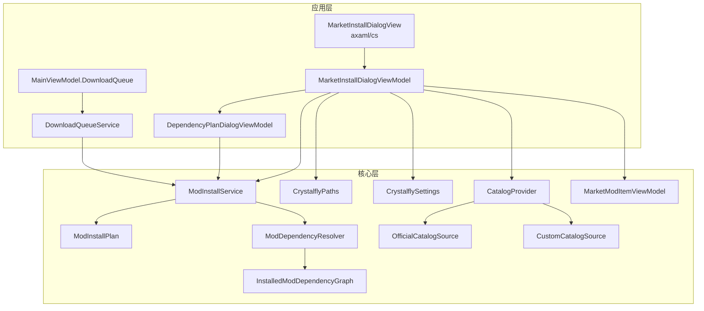
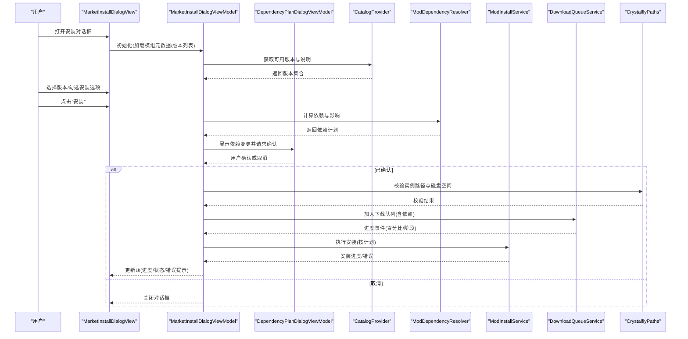
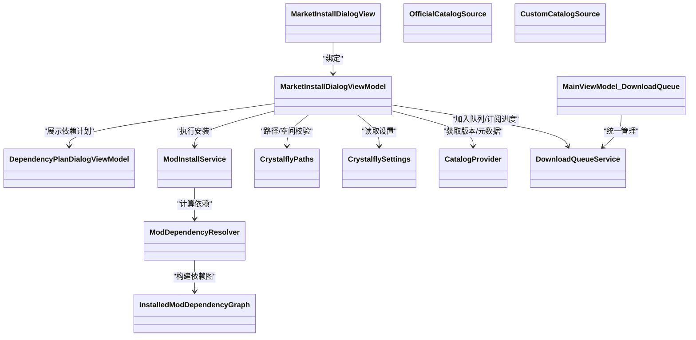

# 市场安装对话框

<cite>
**本文引用的文件**   
- [MarketInstallDialogView.axaml](file://src/Crystalfly.App/Views/Dialogs/MarketInstallDialogView.axaml)
- [MarketInstallDialogView.axaml.cs](file://src/Crystalfly.App/Views/Dialogs/MarketInstallDialogView.axaml.cs)
- [MarketInstallDialogViewModel.cs](file://src/Crystalfly.App/ViewModels/Dialogs/MarketInstallDialogViewModel.cs)
- [DependencyPlanDialogViewModel.cs](file://src/Crystalfly.App/ViewModels/Dialogs/DependencyPlanDialogViewModel.cs)
- [DependencyPlanDialogView.axaml](file://src/Crystalfly.App/Views/Dialogs/DependencyPlanDialogView.axaml)
- [DependencyPlanDialogView.axaml.cs](file://src/Crystalfly.App/Views/Dialogs/DependencyPlanDialogView.axaml.cs)
- [ModInstallService.cs](file://src/Crystalfly.Core/Mods/ModInstallService.cs)
- [ModInstallPlan.cs](file://src/Crystalfly.Core/Mods/ModInstallPlan.cs)
- [ModDependencyResolver.cs](file://src/Crystalfly.Core/Mods/ModDependencyResolver.cs)
- [InstalledModDependencyGraph.cs](file://src/Crystalfly.Core/Mods/InstalledModDependencyGraph.cs)
- [CrystalflyPaths.cs](file://src/Crystalfly.Core/Configuration/CrystalflyPaths.cs)
- [CrystalflySettings.cs](file://src/Crystalfly.Core/Configuration/CrystalflySettings.cs)
- [MainViewModel.DownloadQueue.cs](file://src/Crystalfly.App/ViewModels/MainViewModel.DownloadQueue.cs)
- [DownloadQueueService.cs](file://src/Crystalffly.App/Downloads/DownloadQueueService.cs)
- [CatalogProvider.cs](file://src/Crystalfly.Core/Catalog/CatalogProvider.cs)
- [OfficialCatalogSource.cs](file://src/Crystalfly.Core/Catalog/OfficialCatalogSource.cs)
- [CustomCatalogSource.cs](file://src/Crystalfly.Core/Catalog/CustomCatalogSource.cs)
- [MarketModItemViewModel.cs](file://src/Crystalfly.App/ViewModels/MarketModItemViewModel.cs)
</cite>

## 目录
1. [简介](#简介)
2. [项目结构](#项目结构)
3. [核心组件](#核心组件)
4. [架构总览](#架构总览)
5. [详细组件分析](#详细组件分析)
6. [依赖关系分析](#依赖关系分析)
7. [性能考虑](#性能考虑)
8. [故障排查指南](#故障排查指南)
9. [结论](#结论)
10. [附录：使用示例与集成步骤](#附录使用示例与集成步骤)

## 简介
本文件面向“市场模组安装对话框”的 UI 与业务逻辑，聚焦以下目标：
- MarketInstallDialogView 的安装界面布局：模组信息展示、版本选择、安装选项配置。
- MarketInstallDialogViewModel 的安装参数处理、进度跟踪与错误恢复。
- 安装前预检流程：依赖检查、空间验证等。
- 集成示例：如何串联模组安装流程与用户确认步骤。
- 异步操作处理、进度更新机制与异常的用户友好提示。

## 项目结构
围绕“市场安装对话框”的相关代码分布在 App 层（UI 与 ViewModel）与 Core 层（安装服务、依赖解析、路径与设置）。关键位置如下：
- UI 视图：MarketInstallDialogView.axaml 与 MarketInstallDialogView.axaml.cs
- 视图模型：MarketInstallDialogViewModel.cs
- 依赖计划对话框：DependencyPlanDialog*（用于显示并确认依赖变更）
- 安装服务与计划：ModInstallService.cs、ModInstallPlan.cs
- 依赖解析与图：ModDependencyResolver.cs、InstalledModDependencyGraph.cs
- 路径与设置：CrystalflyPaths.cs、CrystalflySettings.cs
- 下载队列与主界面集成：MainViewModel.DownloadQueue.cs、DownloadQueueService.cs
- 目录源与模组元数据：CatalogProvider.cs、OfficialCatalogSource.cs、CustomCatalogSource.cs
- 市场项视图模型：MarketModItemViewModel.cs

图表来源
- [MarketInstallDialogView.axaml:1-200](file://src/Crystalfly.App/Views/Dialogs/MarketInstallDialogView.axaml#L1-L200)
- [MarketInstallDialogView.axaml.cs:1-200](file://src/Crystalfly.App/Views/Dialogs/MarketInstallDialogView.axaml.cs#L1-L200)
- [MarketInstallDialogViewModel.cs:1-300](file://src/Crystalfly.App/ViewModels/Dialogs/MarketInstallDialogViewModel.cs#L1-L300)
- [DependencyPlanDialogViewModel.cs:1-200](file://src/Crystalfly.App/ViewModels/Dialogs/DependencyPlanDialogViewModel.cs#L1-L200)
- [DependencyPlanDialogView.axaml:1-200](file://src/Crystalfly.App/Views/Dialogs/DependencyPlanDialogView.axaml#L1-L200)
- [DependencyPlanDialogView.axaml.cs:1-200](file://src/Crystalfly.App/Views/Dialogs/DependencyPlanDialogView.axaml.cs#L1-L200)
- [ModInstallService.cs:1-300](file://src/Crystalfly.Core/Mods/ModInstallService.cs#L1-L300)
- [ModInstallPlan.cs:1-200](file://src/Crystalfly.Core/Mods/ModInstallPlan.cs#L1-L200)
- [ModDependencyResolver.cs:1-200](file://src/Crystalfly.Core/Mods/ModDependencyResolver.cs#L1-L200)
- [InstalledModDependencyGraph.cs:1-200](file://src/Crystalfly.Core/Mods/InstalledModDependencyGraph.cs#L1-L200)
- [CrystalflyPaths.cs:1-200](file://src/Crystalfly.Core/Configuration/CrystalflyPaths.cs#L1-L200)
- [CrystalflySettings.cs:1-200](file://src/Crystalfly.Core/Configuration/CrystalflySettings.cs#L1-L200)
- [MainViewModel.DownloadQueue.cs:1-200](file://src/Crystalfly.App/ViewModels/MainViewModel.DownloadQueue.cs#L1-L200)
- [DownloadQueueService.cs:1-200](file://src/Crystalfly.App/Downloads/DownloadQueueService.cs#L1-L200)
- [CatalogProvider.cs:1-200](file://src/Crystalfly.Core/Catalog/CatalogProvider.cs#L1-L200)
- [OfficialCatalogSource.cs:1-200](file://src/Crystalfly.Core/Catalog/OfficialCatalogSource.cs#L1-L200)
- [CustomCatalogSource.cs:1-200](file://src/Crystalfly.Core/Catalog/CustomCatalogSource.cs#L1-L200)
- [MarketModItemViewModel.cs:1-200](file://src/Crystalfly.App/ViewModels/MarketModItemViewModel.cs#L1-L200)

章节来源
- [MarketInstallDialogView.axaml:1-200](file://src/Crystalfly.App/Views/Dialogs/MarketInstallDialogView.axaml#L1-L200)
- [MarketInstallDialogView.axaml.cs:1-200](file://src/Crystalfly.App/Views/Dialogs/MarketInstallDialogView.axaml.cs#L1-L200)
- [MarketInstallDialogViewModel.cs:1-300](file://src/Crystalfly.App/ViewModels/Dialogs/MarketInstallDialogViewModel.cs#L1-L300)

## 核心组件
- MarketInstallDialogView：负责渲染安装对话框的界面元素，包括模组名称、描述、作者、版本下拉、安装选项（如是否包含依赖、覆盖策略等）、进度条与状态文本。
- MarketInstallDialogViewModel：承载安装参数、预检结果、依赖计划、进度与错误信息；协调依赖计划对话框与安装服务；提供命令绑定以触发安装。
- DependencyPlanDialogViewModel/View：用于向用户展示依赖变更清单并提供确认入口。
- ModInstallService：执行实际的安装流程，生成安装计划、校验环境、下载与写入文件、回滚与恢复。
- ModDependencyResolver/InstalledModDependencyGraph：计算依赖关系与冲突，辅助生成可执行的安装计划。
- CrystalflyPaths/CrystalflySettings：提供实例路径、存储路径与用户偏好设置（例如默认安装行为）。
- CatalogProvider/OfficialCatalogSource/CustomCatalogSource：聚合模组目录源，为对话框提供可用版本与元数据。
- MainViewModel.DownloadQueue/DownloadQueueService：将安装任务纳入全局下载队列，统一管理与进度聚合。

章节来源
- [MarketInstallDialogViewModel.cs:1-300](file://src/Crystalfly.App/ViewModels/Dialogs/MarketInstallDialogViewModel.cs#L1-L300)
- [DependencyPlanDialogViewModel.cs:1-200](file://src/Crystalfly.App/ViewModels/Dialogs/DependencyPlanDialogViewModel.cs#L1-L200)
- [ModInstallService.cs:1-300](file://src/Crystalfly.Core/Mods/ModInstallService.cs#L1-L300)
- [ModDependencyResolver.cs:1-200](file://src/Crystalfly.Core/Mods/ModDependencyResolver.cs#L1-L200)
- [InstalledModDependencyGraph.cs:1-200](file://src/Crystalfly.Core/Mods/InstalledModDependencyGraph.cs#L1-L200)
- [CrystalflyPaths.cs:1-200](file://src/Crystalfly.Core/Configuration/CrystalflyPaths.cs#L1-L200)
- [CrystalflySettings.cs:1-200](file://src/Crystalfly.Core/Configuration/CrystalflySettings.cs#L1-L200)
- [CatalogProvider.cs:1-200](file://src/Crystalfly.Core/Catalog/CatalogProvider.cs#L1-L200)
- [OfficialCatalogSource.cs:1-200](file://src/Crystalfly.Core/Catalog/OfficialCatalogSource.cs#L1-L200)
- [CustomCatalogSource.cs:1-200](file://src/Crystalfly.Core/Catalog/CustomCatalogSource.cs#L1-L200)
- [MainViewModel.DownloadQueue.cs:1-200](file://src/Crystalfly.App/ViewModels/MainViewModel.DownloadQueue.cs#L1-L200)
- [DownloadQueueService.cs:1-200](file://src/Crystalfly.App/Downloads/DownloadQueueService.cs#L1-L200)

## 架构总览
下图展示了从用户点击“安装”到完成安装的端到端交互，涵盖预检、依赖计划、下载队列、安装执行与进度反馈。

图表来源
- [MarketInstallDialogView.axaml:1-200](file://src/Crystalfly.App/Views/Dialogs/MarketInstallDialogView.axaml#L1-L200)
- [MarketInstallDialogView.axaml.cs:1-200](file://src/Crystalfly.App/Views/Dialogs/MarketInstallDialogView.axaml.cs#L1-L200)
- [MarketInstallDialogViewModel.cs:1-300](file://src/Crystalfly.App/ViewModels/Dialogs/MarketInstallDialogViewModel.cs#L1-L300)
- [DependencyPlanDialogViewModel.cs:1-200](file://src/Crystalfly.App/ViewModels/Dialogs/DependencyPlanDialogViewModel.cs#L1-L200)
- [DependencyPlanDialogView.axaml:1-200](file://src/Crystalfly.App/Views/Dialogs/DependencyPlanDialogView.axaml#L1-L200)
- [DependencyPlanDialogView.axaml.cs:1-200](file://src/Crystalfly.App/Views/Dialogs/DependencyPlanDialogView.axaml.cs#L1-L200)
- [CatalogProvider.cs:1-200](file://src/Crystalfly.Core/Catalog/CatalogProvider.cs#L1-L200)
- [ModDependencyResolver.cs:1-200](file://src/Crystalfly.Core/Mods/ModDependencyResolver.cs#L1-L200)
- [ModInstallService.cs:1-300](file://src/Crystalfly.Core/Mods/ModInstallService.cs#L1-L300)
- [DownloadQueueService.cs:1-200](file://src/Crystalfly.App/Downloads/DownloadQueueService.cs#L1-L200)
- [CrystalflyPaths.cs:1-200](file://src/Crystalfly.Core/Configuration/CrystalflyPaths.cs#L1-L200)

## 详细组件分析

### MarketInstallDialogView 安装界面布局
- 模组信息展示区：标题、副标题、作者、简介、截图/图标占位。
- 版本选择区：下拉框或列表，支持过滤与搜索。
- 安装选项区：复选框（如“自动安装依赖”、“覆盖已有文件”、“保留用户配置”等）。
- 进度与状态区：进度条、当前阶段文本、错误消息区域。
- 操作按钮：确认安装、取消、查看依赖详情。

章节来源
- [MarketInstallDialogView.axaml:1-200](file://src/Crystalfly.App/Views/Dialogs/MarketInstallDialogView.axaml#L1-L200)
- [MarketInstallDialogView.axaml.cs:1-200](file://src/Crystalfly.App/Views/Dialogs/MarketInstallDialogView.axaml.cs#L1-L200)

### MarketInstallDialogViewModel 安装参数处理、进度与错误恢复
- 输入参数：模组标识、目标实例、目标版本、安装选项。
- 预检流程：
  - 依赖检查：调用依赖解析器生成依赖计划。
  - 空间验证：基于实例路径与待安装大小估算剩余空间。
- 依赖计划展示：通过 DependencyPlanDialogViewModel 呈现变更清单，等待用户确认。
- 进度跟踪：订阅下载队列与服务进度事件，映射到 UI 的百分比与阶段文本。
- 错误恢复：
  - 网络失败：重试与降级策略（切换源、断点续传）。
  - 磁盘不足：提示清理空间或更改实例路径。
  - 依赖冲突：引导用户进入依赖计划对话框进行选择性安装/卸载。
  - 安装中断：事务性回滚，确保实例一致性。

章节来源
- [MarketInstallDialogViewModel.cs:1-300](file://src/Crystalfly.App/ViewModels/Dialogs/MarketInstallDialogViewModel.cs#L1-L300)
- [DependencyPlanDialogViewModel.cs:1-200](file://src/Crystalfly.App/ViewModels/Dialogs/DependencyPlanDialogViewModel.cs#L1-L200)
- [ModInstallService.cs:1-300](file://src/Crystalfly.Core/Mods/ModInstallService.cs#L1-L300)
- [CrystalflyPaths.cs:1-200](file://src/Crystalfly.Core/Configuration/CrystalflyPaths.cs#L1-L200)

### 依赖计划对话框
- 目的：在正式安装前，清晰展示需要新增/更新的依赖项，以及可能的冲突与移除项。
- 交互：用户可逐项确认或批量接受；若拒绝，则阻止后续安装。
- 数据来源：由依赖解析器生成的计划对象驱动。

章节来源
- [DependencyPlanDialogViewModel.cs:1-200](file://src/Crystalfly.App/ViewModels/Dialogs/DependencyPlanDialogViewModel.cs#L1-L200)
- [DependencyPlanDialogView.axaml:1-200](file://src/Crystalfly.App/Views/Dialogs/DependencyPlanDialogView.axaml#L1-L200)
- [DependencyPlanDialogView.axaml.cs:1-200](file://src/Crystalfly.App/Views/Dialogs/DependencyPlanDialogView.axaml.cs#L1-L200)
- [ModDependencyResolver.cs:1-200](file://src/Crystalfly.Core/Mods/ModDependencyResolver.cs#L1-L200)
- [InstalledModDependencyGraph.cs:1-200](file://src/Crystalfly.Core/Mods/InstalledModDependencyGraph.cs#L1-L200)

### 安装服务与计划
- 安装计划：封装了要安装的文件、顺序、依赖关系与回滚点。
- 安装执行：按阶段下载、校验、写入、注册；每步可上报进度。
- 事务性与回滚：失败时撤销已变更文件，保证实例一致。

章节来源
- [ModInstallPlan.cs:1-200](file://src/Crystalfly.Core/Mods/Mods/ModInstallPlan.cs#L1-L200)
- [ModInstallService.cs:1-300](file://src/Crystalfly.Core/Mods/ModInstallService.cs#L1-L300)

### 目录源与版本选择
- CatalogProvider 聚合多个目录源（官方与自定义），为对话框提供可用版本与元数据。
- OfficialCatalogSource/CustomCatalogSource 分别对接不同来源的数据。

章节来源
- [CatalogProvider.cs:1-200](file://src/Crystalfly.Core/Catalog/CatalogProvider.cs#L1-L200)
- [OfficialCatalogSource.cs:1-200](file://src/Crystalfly.Core/Catalog/OfficialCatalogSource.cs#L1-L200)
- [CustomCatalogSource.cs:1-200](file://src/Crystalfly.Core/Catalog/CustomCatalogSource.cs#L1-L200)
- [MarketModItemViewModel.cs:1-200](file://src/Crystalfly.App/ViewModels/MarketModItemViewModel.cs#L1-L200)

### 下载队列与进度聚合
- DownloadQueueService 管理并发下载、重试与进度聚合。
- MainViewModel.DownloadQueue 将安装任务接入全局队列，便于跨页面展示与管理。

章节来源
- [DownloadQueueService.cs:1-200](file://src/Crystalfly.App/Downloads/DownloadQueueService.cs#L1-L200)
- [MainViewModel.DownloadQueue.cs:1-200](file://src/Crystalfly.App/ViewModels/MainViewModel.DownloadQueue.cs#L1-L200)

## 依赖关系分析
- 视图与视图模型：MarketInstallDialogView 绑定 MarketInstallDialogViewModel。
- 视图模型与核心服务：依赖计划对话框、安装服务、路径与设置、目录源。
- 安装服务与依赖解析：ModInstallService 依赖 ModDependencyResolver 与 InstalledModDependencyGraph。
- 下载队列与安装服务：DownloadQueueService 与 ModInstallService 协作完成下载与安装。

图表来源
- [MarketInstallDialogView.axaml:1-200](file://src/Crystalfly.App/Views/Dialogs/MarketInstallDialogView.axaml#L1-L200)
- [MarketInstallDialogView.axaml.cs:1-200](file://src/Crystalfly.App/Views/Dialogs/MarketInstallDialogView.axaml.cs#L1-L200)
- [MarketInstallDialogViewModel.cs:1-300](file://src/Crystalfly.App/ViewModels/Dialogs/MarketInstallDialogViewModel.cs#L1-L300)
- [DependencyPlanDialogViewModel.cs:1-200](file://src/Crystalfly.App/ViewModels/Dialogs/DependencyPlanDialogViewModel.cs#L1-L200)
- [ModInstallService.cs:1-300](file://src/Crystalfly.Core/Mods/ModInstallService.cs#L1-L300)
- [ModDependencyResolver.cs:1-200](file://src/Crystalfly.Core/Mods/ModDependencyResolver.cs#L1-L200)
- [InstalledModDependencyGraph.cs:1-200](file://src/Crystalfly.Core/Mods/InstalledModDependencyGraph.cs#L1-L200)
- [CrystalflyPaths.cs:1-200](file://src/Crystalfly.Core/Configuration/CrystalflyPaths.cs#L1-L200)
- [CrystalflySettings.cs:1-200](file://src/Crystalfly.Core/Configuration/CrystalflySettings.cs#L1-L200)
- [CatalogProvider.cs:1-200](file://src/Crystalfly.Core/Catalog/CatalogProvider.cs#L1-L200)
- [OfficialCatalogSource.cs:1-200](file://src/Crystalfly.Core/Catalog/OfficialCatalogSource.cs#L1-L200)
- [CustomCatalogSource.cs:1-200](file://src/Crystalfly.Core/Catalog/CustomCatalogSource.cs#L1-L200)
- [DownloadQueueService.cs:1-200](file://src/Crystalfly.App/Downloads/DownloadQueueService.cs#L1-L200)
- [MainViewModel.DownloadQueue.cs:1-200](file://src/Crystalfly.App/ViewModels/MainViewModel.DownloadQueue.cs#L1-L200)

## 性能考虑
- 版本列表与元数据缓存：避免重复拉取目录数据，提升首次与后续打开速度。
- 依赖图增量计算：仅对受影响节点重算，减少大模组的解析开销。
- 下载并发控制：根据网络与磁盘 I/O 动态调整并发度，避免拥塞。
- 进度事件节流：合并高频进度事件，降低 UI 刷新压力。
- 空间预检优化：采用近似估算与快速扫描，必要时再精确计算。

[本节为通用指导，不直接分析具体文件]

## 故障排查指南
- 无法连接目录源：检查网络与自定义源配置；尝试切换官方源。
- 磁盘空间不足：提示清理实例目录或更换实例路径；重新运行预检。
- 依赖冲突：进入依赖计划对话框，选择性安装/卸载相关模组。
- 安装中断或回滚：查看错误日志与回滚记录；修复权限或文件占用后重试。
- 进度停滞：检查下载队列是否被阻塞；重启队列或重置任务。

章节来源
- [MarketInstallDialogViewModel.cs:1-300](file://src/Crystalfly.App/ViewModels/Dialogs/MarketInstallDialogViewModel.cs#L1-L300)
- [ModInstallService.cs:1-300](file://src/Crystalfly.Core/Mods/ModInstallService.cs#L1-L300)
- [DownloadQueueService.cs:1-200](file://src/Crystalfly.App/Downloads/DownloadQueueService.cs#L1-L200)

## 结论
市场安装对话框通过清晰的界面布局与稳健的后台服务协作，实现了从版本选择、依赖确认到安装执行的完整闭环。其预检、依赖计划、进度反馈与错误恢复机制共同保障了用户体验与系统稳定性。

[本节为总结，不直接分析具体文件]

## 附录：使用示例与集成步骤
- 打开对话框：在主界面中调用 MarketInstallDialogView 的打开方法，传入 MarketModItemViewModel 作为上下文。
- 初始化与加载：视图模型从 CatalogProvider 获取可用版本与元数据，填充界面。
- 用户选择：用户在对话框中选择目标版本与安装选项。
- 预检与依赖计划：视图模型计算依赖并弹出 DependencyPlanDialog 进行确认。
- 加入队列与安装：确认后加入 DownloadQueueService，订阅进度并调用 ModInstallService 执行安装。
- 完成与反馈：安装完成后关闭对话框，并在主界面更新模组列表与状态。

章节来源
- [MarketInstallDialogView.axaml:1-200](file://src/Crystalfly.App/Views/Dialogs/MarketInstallDialogView.axaml#L1-L200)
- [MarketInstallDialogView.axaml.cs:1-200](file://src/Crystalfly.App/Views/Dialogs/MarketInstallDialogView.axaml.cs#L1-L200)
- [MarketInstallDialogViewModel.cs:1-300](file://src/Crystalfly.App/ViewModels/Dialogs/MarketInstallDialogViewModel.cs#L1-L300)
- [DependencyPlanDialogViewModel.cs:1-200](file://src/Crystalfly.App/ViewModels/Dialogs/DependencyPlanDialogViewModel.cs#L1-L200)
- [DownloadQueueService.cs:1-200](file://src/Crystalfly.App/Downloads/DownloadQueueService.cs#L1-L200)
- [ModInstallService.cs:1-300](file://src/Crystalfly.Core/Mods/ModInstallService.cs#L1-L300)
- [CatalogProvider.cs:1-200](file://src/Crystalfly.Core/Catalog/CatalogProvider.cs#L1-L200)
- [MarketModItemViewModel.cs:1-200](file://src/Crystalfly.App/ViewModels/MarketModItemViewModel.cs#L1-L200)