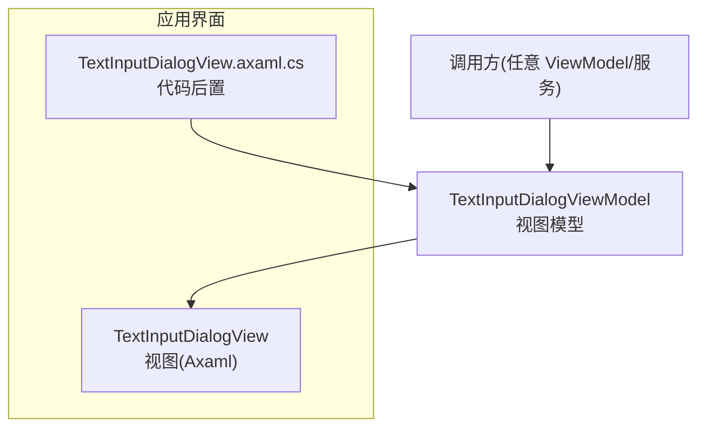
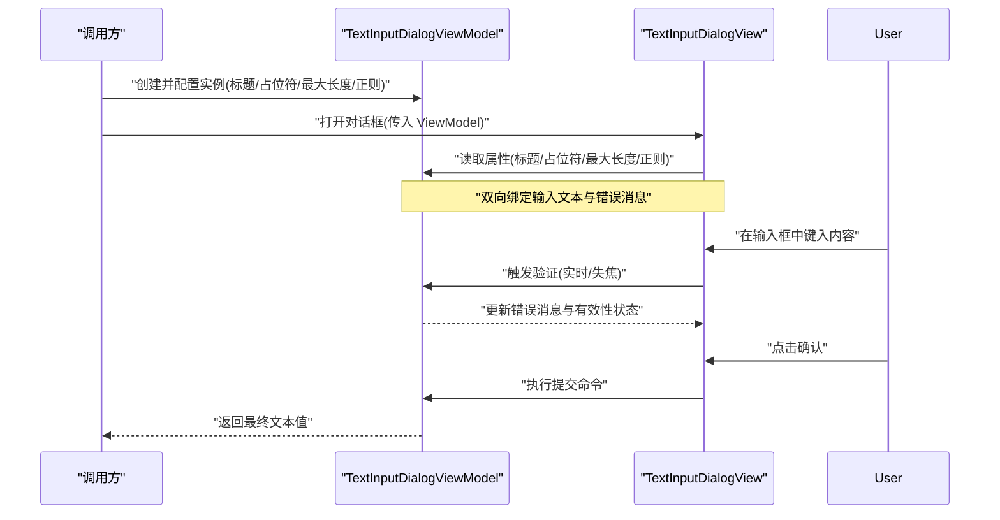
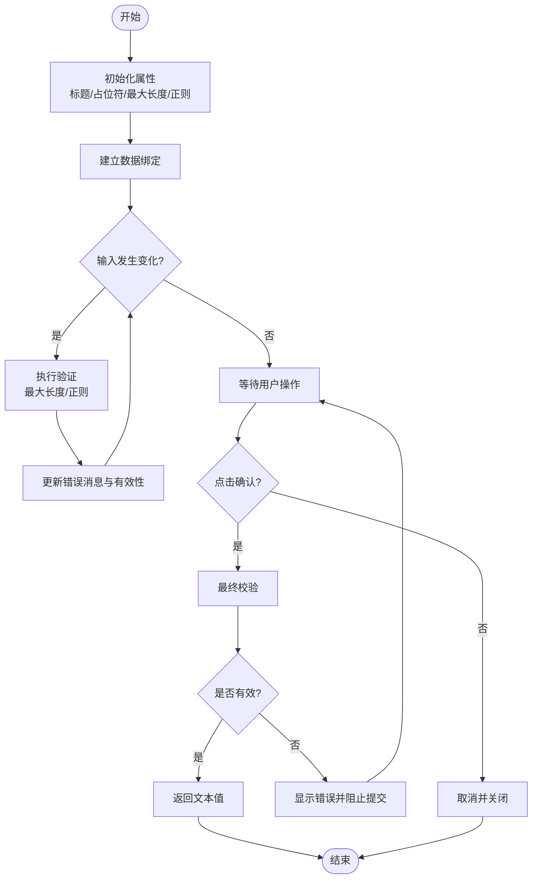
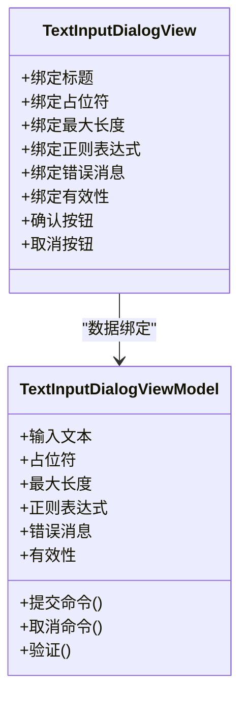

# 文本输入对话框

<cite>
**本文引用的文件**   
- [TextInputDialogView.axaml](file://src/Crystalfly.App/Views/Dialogs/TextInputDialogView.axaml)
- [TextInputDialogView.axaml.cs](file://src/Crystalfly.App/Views/Dialogs/TextInputDialogView.axaml.cs)
- [TextInputDialogViewModel.cs](file://src/Crystalfly.App/ViewModels/Dialogs/TextInputDialogViewModel.cs)
</cite>

## 目录
1. [简介](#简介)
2. [项目结构](#项目结构)
3. [核心组件](#核心组件)
4. [架构总览](#架构总览)
5. [详细组件分析](#详细组件分析)
6. [依赖分析](#依赖分析)
7. [性能考虑](#性能考虑)
8. [故障排查指南](#故障排查指南)
9. [结论](#结论)
10. [附录](#附录) 

## 简介
本文件面向“文本输入对话框”组件，聚焦于以下目标：
- 说明 TextInputDialogView 的输入框布局与交互元素
- 记录 TextInputDialogViewModel 的数据绑定、输入验证与文本处理逻辑
- 覆盖占位符设置、最大长度限制与正则表达式验证等格式化选项
- 提供使用示例，展示如何获取用户输入的文本值并进行后续处理
- 说明对话框的输入状态管理、错误提示显示与用户体验优化建议

## 项目结构
该对话框由视图层（Axaml + Code-behind）与视图模型层组成，遵循 MVVM 模式。关键文件如下：
- 视图定义与代码后置：位于 Views/Dialogs 目录
- 视图模型：位于 ViewModels/Dialogs 目录

图表来源
- [TextInputDialogView.axaml](file://src/Crystalfly.App/Views/Dialogs/TextInputDialogView.axaml)
- [TextInputDialogView.axaml.cs](file://src/Crystalfly.App/Views/Dialogs/TextInputDialogView.axaml.cs)
- [TextInputDialogViewModel.cs](file://src/Crystalfly.App/ViewModels/Dialogs/TextInputDialogViewModel.cs)

章节来源
- [TextInputDialogView.axaml](file://src/Crystalfly.App/Views/Dialogs/TextInputDialogView.axaml)
- [TextInputDialogView.axaml.cs](file://src/Crystalfly.App/Views/Dialogs/TextInputDialogView.axaml.cs)
- [TextInputDialogViewModel.cs](file://src/Crystalfly.App/ViewModels/Dialogs/TextInputDialogViewModel.cs)

## 核心组件
- TextInputDialogView：负责渲染对话框 UI，包含标题、提示文本、输入框、错误消息区域以及确认/取消按钮。通过数据绑定与视图模型同步状态。
- TextInputDialogViewModel：承载对话框的业务逻辑，包括：
  - 输入文本的双向绑定属性
  - 占位符、最大长度、是否只读等配置项
  - 输入验证规则（含可选的正则表达式匹配）
  - 错误消息管理与有效性状态
  - 提交与取消命令，用于返回结果或关闭对话框

章节来源
- [TextInputDialogView.axaml](file://src/Crystalfly.App/Views/Dialogs/TextInputDialogView.axaml)
- [TextInputDialogViewModel.cs](file://src/Crystalfly.App/ViewModels/Dialogs/TextInputDialogViewModel.cs)

## 架构总览
下图展示了从调用方到视图模型的交互流程，以及视图与视图模型之间的数据绑定关系。

图表来源
- [TextInputDialogView.axaml](file://src/Crystalfly.App/Views/Dialogs/TextInputDialogView.axaml)
- [TextInputDialogView.axaml.cs](file://src/Crystalfly.App/Views/Dialogs/TextInputDialogView.axaml.cs)
- [TextInputDialogViewModel.cs](file://src/Crystalfly.App/ViewModels/Dialogs/TextInputDialogViewModel.cs)

## 详细组件分析

### 视图层：TextInputDialogView
- 布局要点
  - 标题区：显示对话框标题
  - 提示区：显示简短说明或引导语
  - 输入框：支持占位符、最大长度、只读/禁用等特性
  - 错误消息区：当输入无效时显示具体错误信息
  - 操作按钮：确认与取消
- 数据绑定
  - 与视图模型进行双向绑定，确保输入变化即时反映到验证与错误提示
  - 按钮可用性通常受有效性状态控制，避免提交非法输入

章节来源
- [TextInputDialogView.axaml](file://src/Crystalfly.App/Views/Dialogs/TextInputDialogView.axaml)
- [TextInputDialogView.axaml.cs](file://src/Crystalfly.App/Views/Dialogs/TextInputDialogView.axaml.cs)

### 视图模型：TextInputDialogViewModel
- 数据绑定属性
  - 输入文本：供视图双向绑定
  - 占位符：输入框提示文本
  - 最大长度：限制输入字符数
  - 正则表达式：可选的模式校验
  - 错误消息：当前验证失败的提示信息
  - 有效性：整体输入是否合法
- 输入验证与文本处理
  - 实时或失焦时触发验证
  - 根据最大长度截断或拒绝超长输入
  - 若配置了正则表达式，按模式校验并生成错误消息
  - 提交前再次校验，确保返回值有效
- 命令与生命周期
  - 确认命令：执行最终校验后返回文本值
  - 取消命令：关闭对话框且不保存任何更改

图表来源
- [TextInputDialogViewModel.cs](file://src/Crystalfly.App/ViewModels/Dialogs/TextInputDialogViewModel.cs)

章节来源
- [TextInputDialogViewModel.cs](file://src/Crystalfly.App/ViewModels/Dialogs/TextInputDialogViewModel.cs)

### 使用示例（步骤说明）
以下为典型的使用流程，便于集成到现有业务中：
- 准备参数
  - 设置对话框标题、提示文本、占位符、最大长度与可选的正则表达式
- 创建并打开对话框
  - 将配置好的视图模型传递给视图并显示
- 获取结果
  - 在确认回调中读取最终文本值，进行后续处理（如保存、搜索、重命名等）
- 错误处理
  - 若验证失败，依据错误消息提示用户修正后再提交

章节来源
- [TextInputDialogView.axaml](file://src/Crystalfly.App/Views/Dialogs/TextInputDialogView.axaml)
- [TextInputDialogView.axaml.cs](file://src/Crystalfly.App/Views/Dialogs/TextInputDialogView.axaml.cs)
- [TextInputDialogViewModel.cs](file://src/Crystalfly.App/ViewModels/Dialogs/TextInputDialogViewModel.cs)

## 依赖分析
- 视图对视图模型的依赖
  - 视图通过数据绑定访问视图模型的属性与命令
- 视图模型对外部配置的依赖
  - 外部调用方在构造时注入标题、占位符、最大长度、正则表达式等配置
- 可能的循环依赖
  - 视图模型不应反向持有视图引用，以避免耦合与内存泄漏

图表来源
- [TextInputDialogView.axaml](file://src/Crystalfly.App/Views/Dialogs/TextInputDialogView.axaml)
- [TextInputDialogView.axaml.cs](file://src/Crystalfly.App/Views/Dialogs/TextInputDialogView.axaml.cs)
- [TextInputDialogViewModel.cs](file://src/Crystalfly.App/ViewModels/Dialogs/TextInputDialogViewModel.cs)

章节来源
- [TextInputDialogView.axaml](file://src/Crystalfly.App/Views/Dialogs/TextInputDialogView.axaml)
- [TextInputDialogView.axaml.cs](file://src/Crystalfly.App/Views/Dialogs/TextInputDialogView.axaml.cs)
- [TextInputDialogViewModel.cs](file://src/Crystalfly.App/ViewModels/Dialogs/TextInputDialogViewModel.cs)

## 性能考虑
- 验证频率
  - 建议在输入变化时进行轻量级验证；复杂正则可考虑防抖或仅在失焦时触发
- 字符串处理
  - 避免在每次按键时进行昂贵的复制与替换操作；必要时缓存中间结果
- UI 响应性
  - 将耗时计算放入后台线程，并通过调度器更新 UI 属性，防止界面卡顿

[本节为通用指导，不直接分析具体文件]

## 故障排查指南
- 输入无法提交
  - 检查有效性状态是否为真
  - 查看错误消息是否非空
  - 确认最大长度与正则表达式配置是否正确
- 占位符未显示
  - 确认占位符属性已正确绑定且未被覆盖
- 正则表达式不生效
  - 检查正则语法与输入内容的匹配情况
  - 确认验证逻辑在输入变更时被触发
- 异常与日志
  - 捕获并记录验证过程中的异常，便于定位问题

章节来源
- [TextInputDialogViewModel.cs](file://src/Crystalfly.App/ViewModels/Dialogs/TextInputDialogViewModel.cs)

## 结论
文本输入对话框通过清晰的 MVVM 分层实现了可配置、可验证、易扩展的输入体验。借助占位符、最大长度与正则表达式等选项，能够满足多种业务场景；结合实时的错误提示与有效性管理，有助于提升用户的输入效率与满意度。

[本节为总结性内容，不直接分析具体文件]

## 附录
- 最佳实践
  - 始终提供明确的错误消息与修复指引
  - 合理设置最大长度，避免过长输入影响性能与可读性
  - 谨慎使用复杂正则，必要时提供示例帮助理解
  - 在取消操作时保持输入框原值不变，尊重用户意图

[本节为通用指导，不直接分析具体文件]