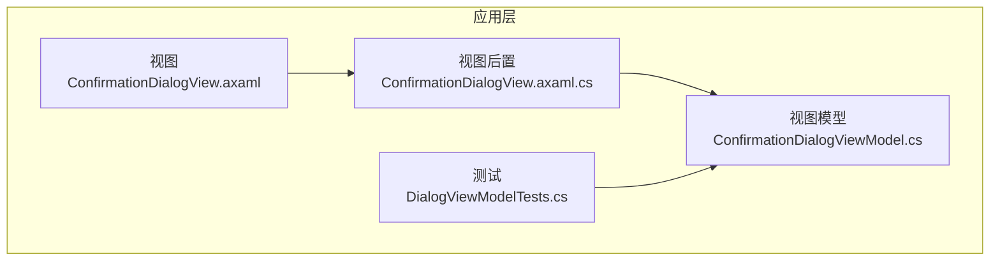
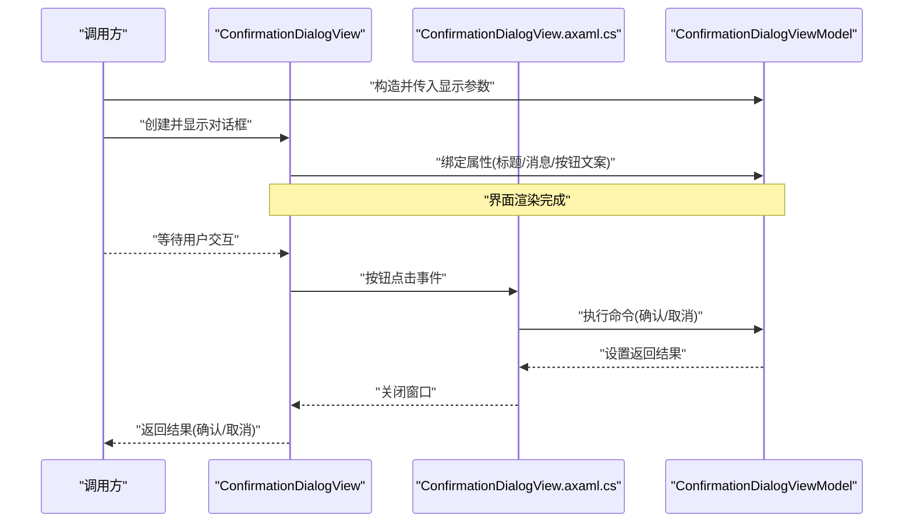
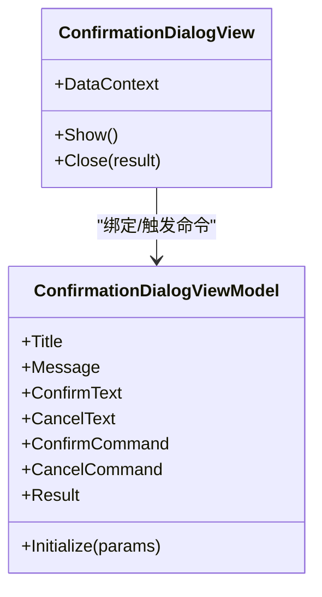
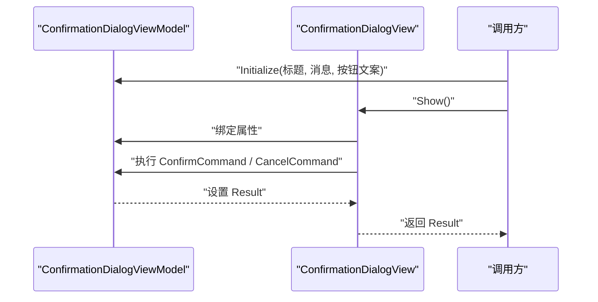
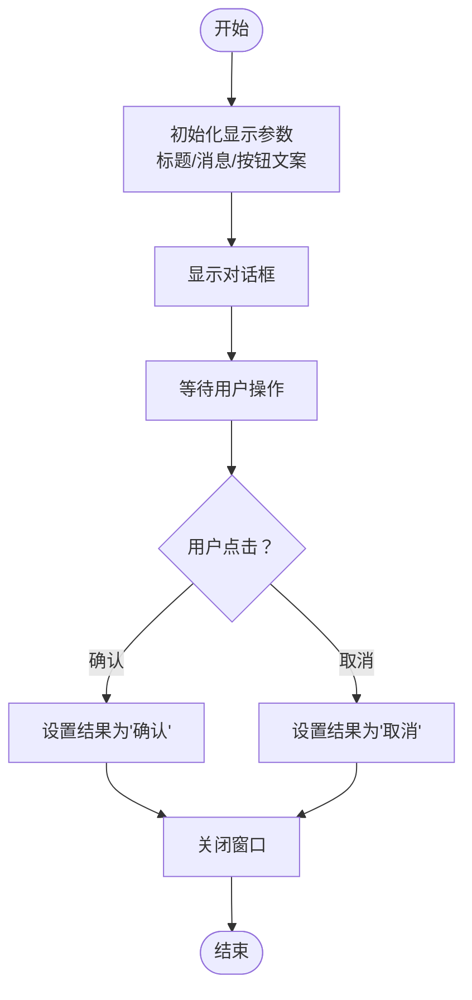
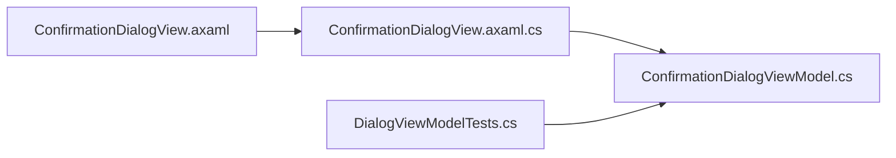

# 确认对话框

<cite>
**本文引用的文件**   
- [ConfirmationDialogView.axaml](file://src/Crystalfly.App/Views/Dialogs/ConfirmationDialogView.axaml)
- [ConfirmationDialogView.axaml.cs](file://src/Crystalfly.App/Views/Dialogs/ConfirmationDialogView.axaml.cs)
- [ConfirmationDialogViewModel.cs](file://src/Crystalfly.App/ViewModels/Dialogs/ConfirmationDialogViewModel.cs)
- [DialogViewModelTests.cs](file://tests/Crystalfly.App.Tests/ViewModels/DialogViewModelTests.cs)
</cite>

## 目录
1. [简介](#简介)
2. [项目结构](#项目结构)
3. [核心组件](#核心组件)
4. [架构总览](#架构总览)
5. [详细组件分析](#详细组件分析)
6. [依赖关系分析](#依赖关系分析)
7. [性能考虑](#性能考虑)
8. [故障排查指南](#故障排查指南)
9. [结论](#结论)
10. [附录：使用示例与最佳实践](#附录使用示例与最佳实践)

## 简介
本文件为“确认对话框”组件的完整技术文档，聚焦于以下方面：
- ConfirmationDialogView 的 XAML 布局设计与交互行为
- ConfirmationDialogViewModel 的数据绑定、命令处理与返回值机制
- 对话框显示参数配置、消息内容自定义与按钮文本本地化
- 在业务逻辑中调用确认对话框并处理用户响应的示例流程
- 模态行为、焦点管理与键盘快捷键支持说明

## 项目结构
确认对话框由视图层（XAML + 代码后置）与视图模型层组成，位于 App 层的 Views/Dialogs 与 ViewModels/Dialogs 目录下。测试用例位于 Tests 层，覆盖对话框 ViewModel 的关键行为。

图表来源
- [ConfirmationDialogView.axaml](file://src/Crystalfly.App/Views/Dialogs/ConfirmationDialogView.axaml)
- [ConfirmationDialogView.axaml.cs](file://src/Crystalfly.App/Views/Dialogs/ConfirmationDialogView.axaml.cs)
- [ConfirmationDialogViewModel.cs](file://src/Crystalfly.App/ViewModels/Dialogs/ConfirmationDialogViewModel.cs)
- [DialogViewModelTests.cs](file://tests/Crystalfly.App.Tests/ViewModels/DialogViewModelTests.cs)

章节来源
- [ConfirmationDialogView.axaml](file://src/Crystalfly.App/Views/Dialogs/ConfirmationDialogView.axaml)
- [ConfirmationDialogView.axaml.cs](file://src/Crystalfly.App/Views/Dialogs/ConfirmationDialogView.axaml.cs)
- [ConfirmationDialogViewModel.cs](file://src/Crystalfly.App/ViewModels/Dialogs/ConfirmationDialogViewModel.cs)
- [DialogViewModelTests.cs](file://tests/Crystalfly.App.Tests/ViewModels/DialogViewModelTests.cs)

## 核心组件
- 视图 ConfirmationDialogView：负责呈现确认提示、标题、正文消息以及操作按钮；通过数据绑定将 ViewModel 的属性映射到 UI 元素。
- 视图后置 ConfirmationDialogView.axaml.cs：承载视图生命周期与事件桥接，确保命令执行与窗口关闭语义正确。
- 视图模型 ConfirmationDialogViewModel：封装显示参数（标题、消息、按钮文案等）、命令实现与返回结果（确认/取消）。

章节来源
- [ConfirmationDialogView.axaml](file://src/Crystalfly.App/Views/Dialogs/ConfirmationDialogView.axaml)
- [ConfirmationDialogView.axaml.cs](file://src/Crystalfly.App/Views/Dialogs/ConfirmationDialogView.axaml.cs)
- [ConfirmationDialogViewModel.cs](file://src/Crystalffly.App/ViewModels/Dialogs/ConfirmationDialogViewModel.cs)

## 架构总览
确认对话框采用 MVVM 模式：视图通过 DataContext 绑定到视图模型，用户点击按钮触发命令，视图模型设置返回结果并关闭窗口，调用方根据返回值继续业务流程。

图表来源
- [ConfirmationDialogView.axaml](file://src/Crystalfly.App/Views/Dialogs/ConfirmationDialogView.axaml)
- [ConfirmationDialogView.axaml.cs](file://src/Crystalfly.App/Views/Dialogs/ConfirmationDialogView.axaml.cs)
- [ConfirmationDialogViewModel.cs](file://src/Crystalfly.App/ViewModels/Dialogs/ConfirmationDialogViewModel.cs)

## 详细组件分析

### 视图层：ConfirmationDialogView（XAML 布局与交互）
- 布局要点
  - 标题区域：绑定至视图模型的标题属性，用于展示对话主题。
  - 消息区域：绑定至视图模型的消息属性，用于展示需要用户确认的内容。
  - 按钮区域：包含“确认”和“取消”两个按钮，分别绑定到视图模型的对应命令。
- 交互要点
  - 按钮点击触发命令，命令内部设置返回结果并关闭窗口。
  - 支持默认焦点落在“确认”或“取消”按钮上，便于快速回车确认。
  - 支持 ESC 键关闭对话框并返回“取消”。

章节来源
- [ConfirmationDialogView.axaml](file://src/Crystalfly.App/Views/Dialogs/ConfirmationDialogView.axaml)
- [ConfirmationDialogView.axaml.cs](file://src/Crystalfly.App/Views/Dialogs/ConfirmationDialogView.axaml.cs)

#### 类图（视图与视图模型关系）

图表来源
- [ConfirmationDialogView.axaml](file://src/Crystalfly.App/Views/Dialogs/ConfirmationDialogView.axaml)
- [ConfirmationDialogView.axaml.cs](file://src/Crystalfly.App/Views/Dialogs/ConfirmationDialogView.axaml.cs)
- [ConfirmationDialogViewModel.cs](file://src/Crystalfly.App/ViewModels/Dialogs/ConfirmationDialogViewModel.cs)

### 视图模型层：ConfirmationDialogViewModel（数据绑定、命令与返回值）
- 数据绑定
  - Title：对话框标题
  - Message：确认消息正文
  - ConfirmText：确认按钮文案
  - CancelText：取消按钮文案
- 命令处理
  - ConfirmCommand：设置结果为“确认”，并关闭窗口
  - CancelCommand：设置结果为“取消”，并关闭窗口
- 返回值机制
  - Result：对外暴露的结果值，供调用方判断后续流程
- 初始化参数
  - Initialize(params)：接收显示参数（标题、消息、按钮文案等），用于动态定制对话框内容

章节来源
- [ConfirmationDialogViewModel.cs](file://src/Crystalfly.App/ViewModels/Dialogs/ConfirmationDialogViewModel.cs)

#### 序列图（命令执行与返回）

图表来源
- [ConfirmationDialogViewModel.cs](file://src/Crystalfly.App/ViewModels/Dialogs/ConfirmationDialogViewModel.cs)
- [ConfirmationDialogView.axaml.cs](file://src/Crystalfly.App/Views/Dialogs/ConfirmationDialogView.axaml.cs)

### 复杂逻辑流程图（确认流程）

图表来源
- [ConfirmationDialogViewModel.cs](file://src/Crystalfly.App/ViewModels/Dialogs/ConfirmationDialogViewModel.cs)
- [ConfirmationDialogView.axaml.cs](file://src/Crystalfly.App/Views/Dialogs/ConfirmationDialogView.axaml.cs)

## 依赖关系分析
- 视图与视图模型之间通过数据绑定耦合，职责清晰：视图负责展示与事件转发，视图模型负责状态与命令。
- 测试对视图模型进行验证，确保命令与返回值符合预期。

图表来源
- [ConfirmationDialogView.axaml](file://src/Crystalfly.App/Views/Dialogs/ConfirmationDialogView.axaml)
- [ConfirmationDialogView.axaml.cs](file://src/Crystalfly.App/Views/Dialogs/ConfirmationDialogView.axaml.cs)
- [ConfirmationDialogViewModel.cs](file://src/Crystalfly.App/ViewModels/Dialogs/ConfirmationDialogViewModel.cs)
- [DialogViewModelTests.cs](file://tests/Crystalfly.App.Tests/ViewModels/DialogViewModelTests.cs)

章节来源
- [ConfirmationDialogView.axaml](file://src/Crystalfly.App/Views/Dialogs/ConfirmationDialogView.axaml)
- [ConfirmationDialogView.axaml.cs](file://src/Crystalfly.App/Views/Dialogs/ConfirmationDialogView.axaml.cs)
- [ConfirmationDialogViewModel.cs](file://src/Crystalfly.App/ViewModels/Dialogs/ConfirmationDialogViewModel.cs)
- [DialogViewModelTests.cs](file://tests/Crystalfly.App.Tests/ViewModels/DialogViewModelTests.cs)

## 性能考虑
- 对话框为轻量级 UI 组件，通常不涉及大量计算或 I/O，性能开销可忽略。
- 建议避免在命令中执行耗时操作，如需异步任务，应在调用方处理并在完成后更新 UI。

## 故障排查指南
- 问题：点击按钮无响应
  - 检查命令是否正确绑定到按钮
  - 确认视图模型已实例化且属性未为空
- 问题：对话框不关闭或返回结果不正确
  - 检查命令是否设置了正确的结果值
  - 确认视图后置代码是否正确关闭窗口
- 问题：按钮文案未本地化
  - 检查初始化时传入的按钮文案是否为本地化资源
  - 确认视图模型属性被正确赋值

章节来源
- [ConfirmationDialogView.axaml.cs](file://src/Crystalfly.App/Views/Dialogs/ConfirmationDialogView.axaml.cs)
- [ConfirmationDialogViewModel.cs](file://src/Crystalfly.App/ViewModels/Dialogs/ConfirmationDialogViewModel.cs)
- [DialogViewModelTests.cs](file://tests/Crystalfly.App.Tests/ViewModels/DialogViewModelTests.cs)

## 结论
确认对话框组件以清晰的 MVVM 分层组织，视图负责展示与事件转发，视图模型负责状态与命令，测试结果保障关键路径的正确性。通过灵活的显示参数与本地化支持，该组件可在多种业务场景中复用。

## 附录：使用示例与最佳实践
- 显示参数配置
  - 标题：用于描述确认主题
  - 消息：详细说明需要用户确认的内容
  - 按钮文案：分别为“确认”和“取消”提供本地化文本
- 消息内容自定义
  - 支持多行文本与富文本占位，建议在消息中明确风险与后果
- 按钮文本本地化
  - 通过初始化参数传入不同语言的按钮文案，适配多语言环境
- 调用示例（概念流程）
  - 构造视图模型并传入显示参数
  - 创建并显示对话框
  - 等待用户交互，获取返回结果
  - 根据返回结果执行相应业务逻辑
- 模态行为
  - 对话框为模态窗口，阻塞父窗口的输入直至关闭
- 焦点管理
  - 默认焦点置于“确认”或“取消”按钮，提升键盘可用性
- 键盘快捷键
  - 支持回车键确认、ESC 键取消，提高操作效率

[本节为概念性指导，不直接分析具体文件]