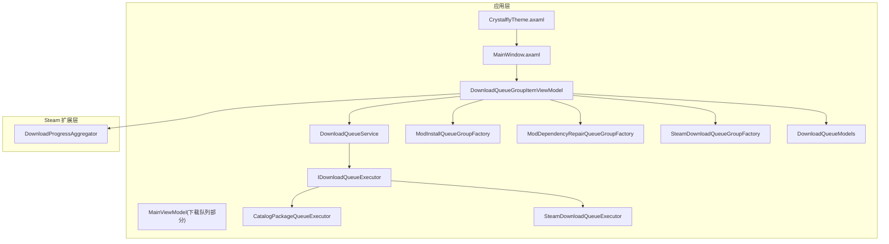
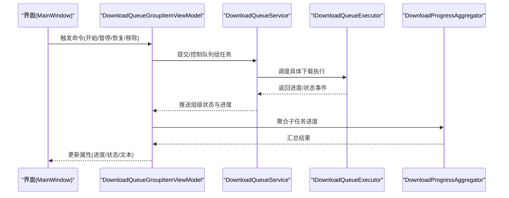
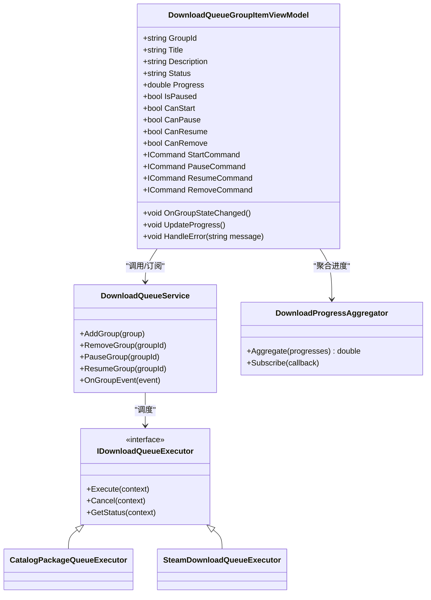
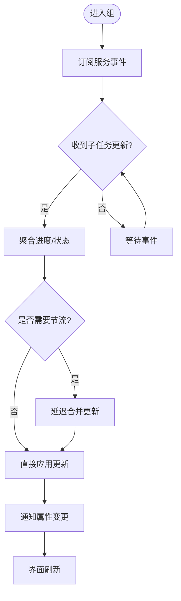
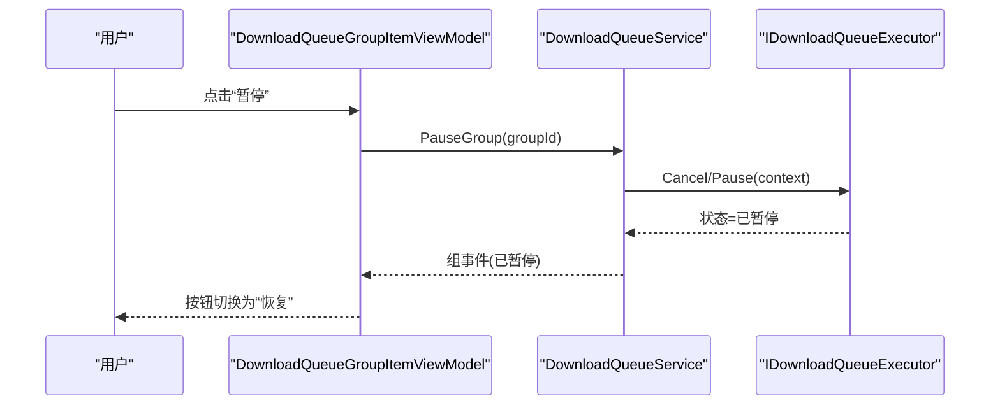
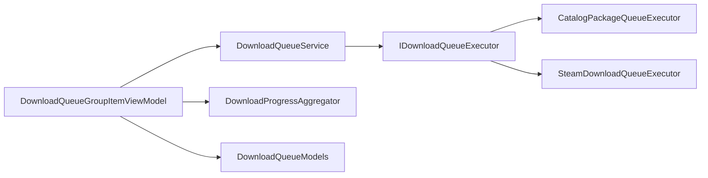

# 下载队列组控件

<cite>
**本文引用的文件**   
- [DownloadQueueGroupItemViewModel.cs](file://src/Crystalfly.App/ViewModels/DownloadQueueGroupItemViewModel.cs)
- [MainViewModel.DownloadQueue.cs](file://src/Crystalfly.App/ViewModels/MainViewModel.DownloadQueue.cs)
- [DownloadQueueService.cs](file://src/Crystalfly.App/Downloads/DownloadQueueService.cs)
- [DownloadQueueModels.cs](file://src/Crystalfly.App/Downloads/DownloadQueueModels.cs)
- [IDownloadQueueExecutor.cs](file://src/Crystalfly.App/Downloads/IDownloadQueueExecutor.cs)
- [CatalogPackageQueueExecutor.cs](file://src/Crystalfly.App/Downloads/CatalogPackageQueueExecutor.cs)
- [SteamDownloadQueueExecutor.cs](file://src/Crystalfly.App/Downloads/SteamDownloadQueueExecutor.cs)
- [ModInstallQueueGroupFactory.cs](file://src/Crystalfly.App/Downloads/ModInstallQueueGroupFactory.cs)
- [ModDependencyRepairQueueGroupFactory.cs](file://src/Crystalfly.App/Downloads/ModDependencyRepairQueueGroupFactory.cs)
- [SteamDownloadQueueGroupFactory.cs](file://src/Crystalfly.App/Downloads/SteamDownloadQueueGroupFactory.cs)
- [DownloadProgressAggregator.cs](file://src/Crystalfly.Steam/Downloads/DownloadProgressAggregator.cs)
- [CrystalflyTheme.axaml](file://src/Crystalfly.App/Styles/CrystalflyTheme.axaml)
- [MainWindow.axaml](file://src/Crystalfly.App/Views/MainWindow.axaml)
- [DownloadQueueRenderingTests.cs](file://tests/Crystalfly.App.Tests/Ui/DownloadQueueRenderingTests.cs)
- [DownloadQueueGroupItemViewModelTests.cs](file://tests/Crystalfly.App.Tests/ViewModels/DownloadQueueGroupItemViewModelTests.cs)
</cite>

## 目录
1. [简介](#简介)
2. [项目结构](#项目结构)
3. [核心组件](#核心组件)
4. [架构总览](#架构总览)
5. [详细组件分析](#详细组件分析)
6. [依赖关系分析](#依赖关系分析)
7. [性能考虑](#性能考虑)
8. [故障排查指南](#故障排查指南)
9. [结论](#结论)
10. [附录](#附录)

## 简介
本文件围绕“下载队列组控件”的 ViewModel 实现与集成进行系统化文档化，重点覆盖：
- DownloadQueueGroupItemViewModel 的职责边界、数据模型与状态机
- 下载任务分组管理、进度聚合显示与状态同步机制
- 属性绑定、命令处理、事件响应与数据更新策略
- 与下载队列服务的集成方式（添加、移除、暂停、恢复）
- 控件样式定制与主题适配方法
- 性能优化建议与内存管理最佳实践

## 项目结构
下载队列相关代码主要分布在应用层与 Steam 扩展层：
- 应用层（App）负责 UI 视图模型、队列服务、执行器与工厂
- Steam 扩展层（Steam）提供底层下载进度聚合与客户端能力
- 测试用例覆盖渲染与行为验证

图表来源
- [DownloadQueueGroupItemViewModel.cs](file://src/Crystalfly.App/ViewModels/DownloadQueueGroupItemViewModel.cs)
- [MainViewModel.DownloadQueue.cs](file://src/Crystalfly.App/ViewModels/MainViewModel.DownloadQueue.cs)
- [DownloadQueueService.cs](file://src/Crystalfly.App/Downloads/DownloadQueueService.cs)
- [DownloadQueueModels.cs](file://src/Crystalfly.App/Downloads/DownloadQueueModels.cs)
- [IDownloadQueueExecutor.cs](file://src/Crystalfly.App/Downloads/IDownloadQueueExecutor.cs)
- [CatalogPackageQueueExecutor.cs](file://src/Crystalfly.App/Downloads/CatalogPackageQueueExecutor.cs)
- [SteamDownloadQueueExecutor.cs](file://src/Crystalfly.App/Downloads/SteamDownloadQueueExecutor.cs)
- [ModInstallQueueGroupFactory.cs](file://src/Crystalfly.App/Downloads/ModInstallQueueGroupFactory.cs)
- [ModDependencyRepairQueueGroupFactory.cs](file://src/Crystalfly.App/Downloads/ModDependencyRepairQueueGroupFactory.cs)
- [SteamDownloadQueueGroupFactory.cs](file://src/Crystalfly.App/Downloads/SteamDownloadQueueGroupFactory.cs)
- [DownloadProgressAggregator.cs](file://src/Crystalfly.Steam/Downloads/DownloadProgressAggregator.cs)
- [CrystalflyTheme.axaml](file://src/Crystalfly.App/Styles/CrystalflyTheme.axaml)
- [MainWindow.axaml](file://src/Crystalfly.App/Views/MainWindow.axaml)

章节来源
- [DownloadQueueGroupItemViewModel.cs](file://src/Crystalfly.App/ViewModels/DownloadQueueGroupItemViewModel.cs)
- [DownloadQueueService.cs](file://src/Crystalfly.App/Downloads/DownloadQueueService.cs)
- [DownloadQueueModels.cs](file://src/Crystalfly.App/Downloads/DownloadQueueModels.cs)
- [IDownloadQueueExecutor.cs](file://src/Crystalfly.App/Downloads/IDownloadQueueExecutor.cs)
- [CatalogPackageQueueExecutor.cs](file://src/Crystalfly.App/Downloads/CatalogPackageQueueExecutor.cs)
- [SteamDownloadQueueExecutor.cs](file://src/Crystalfly.App/Downloads/SteamDownloadQueueExecutor.cs)
- [ModInstallQueueGroupFactory.cs](file://src/Crystalfly.App/Downloads/ModInstallQueueGroupFactory.cs)
- [ModDependencyRepairQueueGroupFactory.cs](file://src/Crystalfly.App/Downloads/ModDependencyRepairQueueGroupFactory.cs)
- [SteamDownloadQueueGroupFactory.cs](file://src/Crystalfly.App/Downloads/SteamDownloadQueueGroupFactory.cs)
- [DownloadProgressAggregator.cs](file://src/Crystalfly.Steam/Downloads/DownloadProgressAggregator.cs)
- [CrystalflyTheme.axaml](file://src/Crystalfly.App/Styles/CrystalflyTheme.axaml)
- [MainWindow.axaml](file://src/Crystalfly.App/Views/MainWindow.axaml)

## 核心组件
- DownloadQueueGroupItemViewModel：封装单个下载队列组的展示与交互逻辑，包括分组内任务的聚合进度、状态同步、用户操作（开始/暂停/恢复/移除等）。
- DownloadQueueService：提供队列生命周期管理与任务调度，协调不同执行器完成具体下载。
- IDownloadQueueExecutor 与各执行器：抽象下载执行接口，分别对接包目录与 Steam 内容分发。
- 工厂类：按场景创建不同类型的队列组实例（模组安装、依赖修复、Steam 下载）。
- DownloadProgressAggregator：对底层下载进度进行聚合计算，供上层统一展示。

章节来源
- [DownloadQueueGroupItemViewModel.cs](file://src/Crystalfly.App/ViewModels/DownloadQueueGroupItemViewModel.cs)
- [DownloadQueueService.cs](file://src/Crystalfly.App/Downloads/DownloadQueueService.cs)
- [IDownloadQueueExecutor.cs](file://src/Crystalfly.App/Downloads/IDownloadQueueExecutor.cs)
- [CatalogPackageQueueExecutor.cs](file://src/Crystalfly.App/Downloads/CatalogPackageQueueExecutor.cs)
- [SteamDownloadQueueExecutor.cs](file://src/Crystalfly.App/Downloads/SteamDownloadQueueExecutor.cs)
- [ModInstallQueueGroupFactory.cs](file://src/Crystalfly.App/Downloads/ModInstallQueueGroupFactory.cs)
- [ModDependencyRepairQueueGroupFactory.cs](file://src/Crystalfly.App/Downloads/ModDependencyRepairQueueGroupFactory.cs)
- [SteamDownloadQueueGroupFactory.cs](file://src/Crystalfly.App/Downloads/SteamDownloadQueueGroupFactory.cs)
- [DownloadProgressAggregator.cs](file://src/Crystalfly.Steam/Downloads/DownloadProgressAggregator.cs)

## 架构总览
下图展示了从 UI 到服务再到执行器的调用链路与数据流向。

图表来源
- [DownloadQueueGroupItemViewModel.cs](file://src/Crystalfly.App/ViewModels/DownloadQueueGroupItemViewModel.cs)
- [DownloadQueueService.cs](file://src/Crystalfly.App/Downloads/DownloadQueueService.cs)
- [IDownloadQueueExecutor.cs](file://src/Crystalfly.App/Downloads/IDownloadQueueExecutor.cs)
- [DownloadProgressAggregator.cs](file://src/Crystalfly.Steam/Downloads/DownloadProgressAggregator.cs)
- [MainWindow.axaml](file://src/Crystalfly.App/Views/MainWindow.axaml)

## 详细组件分析

### DownloadQueueGroupItemViewModel 分析
职责与边界
- 维护一个队列组的上下文：包含组标识、标题、描述、当前状态、聚合进度、错误信息、可操作命令等。
- 订阅来自服务的事件，将底层任务状态变化映射为 UI 可见的属性变更。
- 对外暴露命令以响应用户操作（开始、暂停、恢复、移除），并委托给服务执行。
- 使用进度聚合器汇总子任务进度，保证 UI 展示的平滑性与一致性。

关键属性与命令（概念性说明）
- 状态属性：如“空闲/运行中/已暂停/已完成/失败”，用于驱动 UI 按钮显隐与颜色。
- 进度属性：百分比、剩余时间、速度等，由聚合器计算后刷新。
- 命令属性：开始、暂停、恢复、移除等，绑定到界面按钮或菜单项。
- 元数据属性：组名、类型、任务数量、错误消息等。

数据更新策略
- 采用事件驱动+属性通知的方式，避免频繁轮询。
- 在后台线程接收事件，通过调度器切换到 UI 线程更新属性，确保线程安全。
- 对高频进度事件进行节流合并，减少 UI 重绘压力。

与服务的集成
- 通过服务提供的 API 加入/移除组任务，监听组级事件回调。
- 根据组类型选择对应执行器（包目录或 Steam），由服务内部路由。

图表来源
- [DownloadQueueGroupItemViewModel.cs](file://src/Crystalfly.App/ViewModels/DownloadQueueGroupItemViewModel.cs)
- [DownloadQueueService.cs](file://src/Crystalfly.App/Downloads/DownloadQueueService.cs)
- [IDownloadQueueExecutor.cs](file://src/Crystalfly.App/Downloads/IDownloadQueueExecutor.cs)
- [CatalogPackageQueueExecutor.cs](file://src/Crystalfly.App/Downloads/CatalogPackageQueueExecutor.cs)
- [SteamDownloadQueueExecutor.cs](file://src/Crystalfly.App/Downloads/SteamDownloadQueueExecutor.cs)
- [DownloadProgressAggregator.cs](file://src/Crystalfly.Steam/Downloads/DownloadProgressAggregator.cs)

章节来源
- [DownloadQueueGroupItemViewModel.cs](file://src/Crystalfly.App/ViewModels/DownloadQueueGroupItemViewModel.cs)
- [DownloadQueueService.cs](file://src/Crystalfly.App/Downloads/DownloadQueueService.cs)
- [DownloadProgressAggregator.cs](file://src/Crystalfly.Steam/Downloads/DownloadProgressAggregator.cs)

### 进度聚合与状态同步机制
- 进度聚合：聚合器收集组内各子任务的进度，按权重或数量计算整体百分比，同时支持速率与剩余时间的估算。
- 状态同步：服务在任务状态变化时广播事件，ViewModel 订阅并转换为属性变更；UI 通过数据绑定自动刷新。
- 错误传播：当任一子任务失败，组状态标记为失败，并携带错误摘要，便于用户定位问题。

图表来源
- [DownloadProgressAggregator.cs](file://src/Crystalfly.Steam/Downloads/DownloadProgressAggregator.cs)
- [DownloadQueueService.cs](file://src/Crystalfly.App/Downloads/DownloadQueueService.cs)
- [DownloadQueueGroupItemViewModel.cs](file://src/Crystalfly.App/ViewModels/DownloadQueueGroupItemViewModel.cs)

章节来源
- [DownloadProgressAggregator.cs](file://src/Crystalfly.Steam/Downloads/DownloadProgressAggregator.cs)
- [DownloadQueueService.cs](file://src/Crystalfly.App/Downloads/DownloadQueueService.cs)
- [DownloadQueueGroupItemViewModel.cs](file://src/Crystalfly.App/ViewModels/DownloadQueueGroupItemViewModel.cs)

### 命令处理与事件响应
- 开始：校验当前状态是否允许启动，调用服务添加组任务并启动执行器。
- 暂停：若处于运行中，则请求服务暂停组任务，执行器挂起下载。
- 恢复：若处于暂停态，则请求服务恢复组任务，执行器继续下载。
- 移除：取消并清理组任务，释放资源，更新 UI 列表。

图表来源
- [DownloadQueueGroupItemViewModel.cs](file://src/Crystalfly.App/ViewModels/DownloadQueueGroupItemViewModel.cs)
- [DownloadQueueService.cs](file://src/Crystalfly.App/Downloads/DownloadQueueService.cs)
- [IDownloadQueueExecutor.cs](file://src/Crystalfly.App/Downloads/IDownloadQueueExecutor.cs)

章节来源
- [DownloadQueueGroupItemViewModel.cs](file://src/Crystalfly.App/ViewModels/DownloadQueueGroupItemViewModel.cs)
- [DownloadQueueService.cs](file://src/Crystalfly.App/Downloads/DownloadQueueService.cs)
- [IDownloadQueueExecutor.cs](file://src/Crystalfly.App/Downloads/IDownloadQueueExecutor.cs)

### 与下载队列服务的集成方式
- 任务添加：通过服务 AddGroup 接口传入组配置与任务清单，服务选择合适的执行器并初始化上下文。
- 任务移除：调用 RemoveGroup 取消并清理，确保执行器释放资源。
- 暂停与恢复：通过 PauseGroup/ResumeGroup 控制执行器状态，保持组状态与服务一致。
- 事件订阅：ViewModel 订阅服务组事件，实时更新 UI 属性。

章节来源
- [DownloadQueueService.cs](file://src/Crystalfly.App/Downloads/DownloadQueueService.cs)
- [DownloadQueueGroupItemViewModel.cs](file://src/Crystalfly.App/ViewModels/DownloadQueueGroupItemViewModel.cs)

### 控件样式定制与主题适配
- 主题资源：通过 CrystalflyTheme.axaml 定义颜色、字体、控件模板等资源，可在主题中覆盖下载队列组的样式。
- 界面绑定：MainWindow.axaml 中将 DownloadQueueGroupItemViewModel 的属性绑定到控件模板，支持动态外观调整。
- 自定义建议：
  - 重写进度条模板与状态图标资源，适配深色/浅色主题。
  - 使用静态资源引用而非硬编码颜色，确保主题切换生效。
  - 为不同组类型（模组安装、依赖修复、Steam 下载）提供差异化视觉提示。

章节来源
- [CrystalflyTheme.axaml](file://src/Crystalfly.App/Styles/CrystalflyTheme.axaml)
- [MainWindow.axaml](file://src/Crystalfly.App/Views/MainWindow.axaml)

### 测试与验证
- 渲染测试：验证下载队列在不同主题下的渲染效果与布局稳定性。
- 行为测试：验证 ViewModel 的命令处理、状态转换与属性更新是否符合预期。

章节来源
- [DownloadQueueRenderingTests.cs](file://tests/Crystalfly.App.Tests/Ui/DownloadQueueRenderingTests.cs)
- [DownloadQueueGroupItemViewModelTests.cs](file://tests/Crystalfly.App.Tests/ViewModels/DownloadQueueGroupItemViewModelTests.cs)

## 依赖关系分析
- 松耦合设计：ViewModel 仅依赖服务接口与聚合器，不直接耦合具体执行器实现。
- 多执行器支持：通过工厂与接口抽象，新增下载源只需实现接口并注册。
- 事件驱动：服务与 ViewModel 之间通过事件解耦，降低循环依赖风险。

图表来源
- [DownloadQueueGroupItemViewModel.cs](file://src/Crystalfly.App/ViewModels/DownloadQueueGroupItemViewModel.cs)
- [DownloadQueueService.cs](file://src/Crystalfly.App/Downloads/DownloadQueueService.cs)
- [IDownloadQueueExecutor.cs](file://src/Crystalfly.App/Downloads/IDownloadQueueExecutor.cs)
- [CatalogPackageQueueExecutor.cs](file://src/Crystalfly.App/Downloads/CatalogPackageQueueExecutor.cs)
- [SteamDownloadQueueExecutor.cs](file://src/Crystalfly.App/Downloads/SteamDownloadQueueExecutor.cs)
- [DownloadProgressAggregator.cs](file://src/Crystalfly.Steam/Downloads/DownloadProgressAggregator.cs)
- [DownloadQueueModels.cs](file://src/Crystalfly.App/Downloads/DownloadQueueModels.cs)

章节来源
- [DownloadQueueGroupItemViewModel.cs](file://src/Crystalfly.App/ViewModels/DownloadQueueGroupItemViewModel.cs)
- [DownloadQueueService.cs](file://src/Crystalfly.App/Downloads/DownloadQueueService.cs)
- [IDownloadQueueExecutor.cs](file://src/Crystalfly.App/Downloads/IDownloadQueueExecutor.cs)
- [DownloadProgressAggregator.cs](file://src/Crystalfly.Steam/Downloads/DownloadProgressAggregator.cs)
- [DownloadQueueModels.cs](file://src/Crystalfly.App/Downloads/DownloadQueueModels.cs)

## 性能考虑
- 进度事件节流：对高频进度事件进行合并，避免 UI 过度刷新。
- 异步与线程安全：所有 UI 更新必须回到 UI 线程；后台事件处理需避免阻塞。
- 资源释放：在移除组任务时及时取消执行器任务，释放句柄与缓存。
- 聚合计算优化：对大量子任务采用增量聚合与懒加载，减少 CPU 占用。
- 内存管理：避免在 ViewModel 中持有大对象引用；使用弱事件或适当的生命周期管理防止泄漏。

[本节为通用指导，无需特定文件来源]

## 故障排查指南
- 常见问题
  - 进度不更新：检查服务事件是否正确订阅与转发；确认节流阈值设置合理。
  - 暂停无效：确认执行器是否支持暂停语义；核对服务状态机转换。
  - 移除后仍占资源：检查取消信号是否送达执行器；确认资源释放路径。
- 调试建议
  - 在服务层增加日志输出，记录组事件与执行器状态。
  - 在 ViewModel 中打印属性变更序列，辅助定位 UI 不同步问题。
  - 使用单元测试复现异常路径，验证状态转换与命令处理。

章节来源
- [DownloadQueueService.cs](file://src/Crystalfly.App/Downloads/DownloadQueueService.cs)
- [DownloadQueueGroupItemViewModel.cs](file://src/Crystalfly.App/ViewModels/DownloadQueueGroupItemViewModel.cs)

## 结论
DownloadQueueGroupItemViewModel 作为下载队列组的核心展示与交互层，通过与服务与聚合器的协作，实现了稳定的分组管理、进度聚合与状态同步。配合工厂与执行器抽象，系统具备良好的可扩展性与可维护性。遵循本文的性能与内存管理建议，可进一步提升用户体验与系统稳定性。

[本节为总结性内容，无需特定文件来源]

## 附录
- 相关入口与主窗口绑定参考：
  - [MainWindow.axaml](file://src/Crystalfly.App/Views/MainWindow.axaml)
- 主题资源与样式覆盖参考：
  - [CrystalflyTheme.axaml](file://src/Crystalfly.App/Styles/CrystalflyTheme.axaml)
- 测试用例参考：
  - [DownloadQueueRenderingTests.cs](file://tests/Crystalfly.App.Tests/Ui/DownloadQueueRenderingTests.cs)
  - [DownloadQueueGroupItemViewModelTests.cs](file://tests/Crystalfly.App.Tests/ViewModels/DownloadQueueGroupItemViewModelTests.cs)