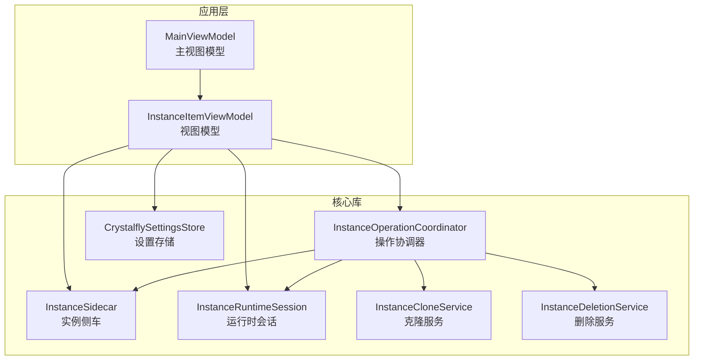
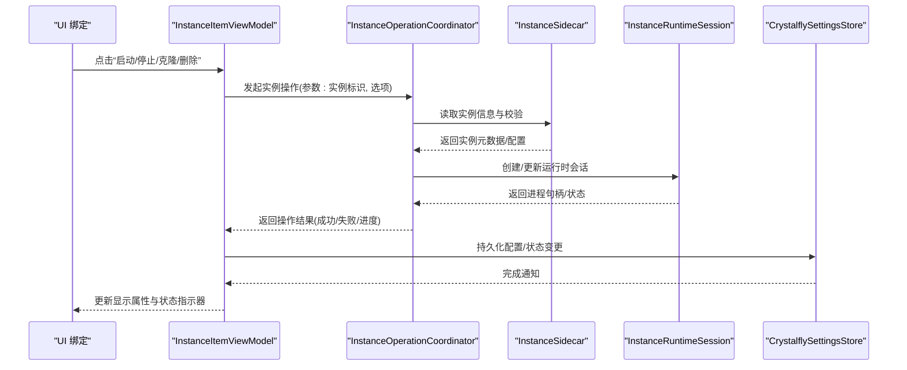
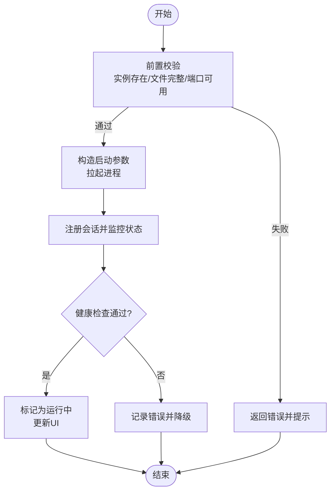
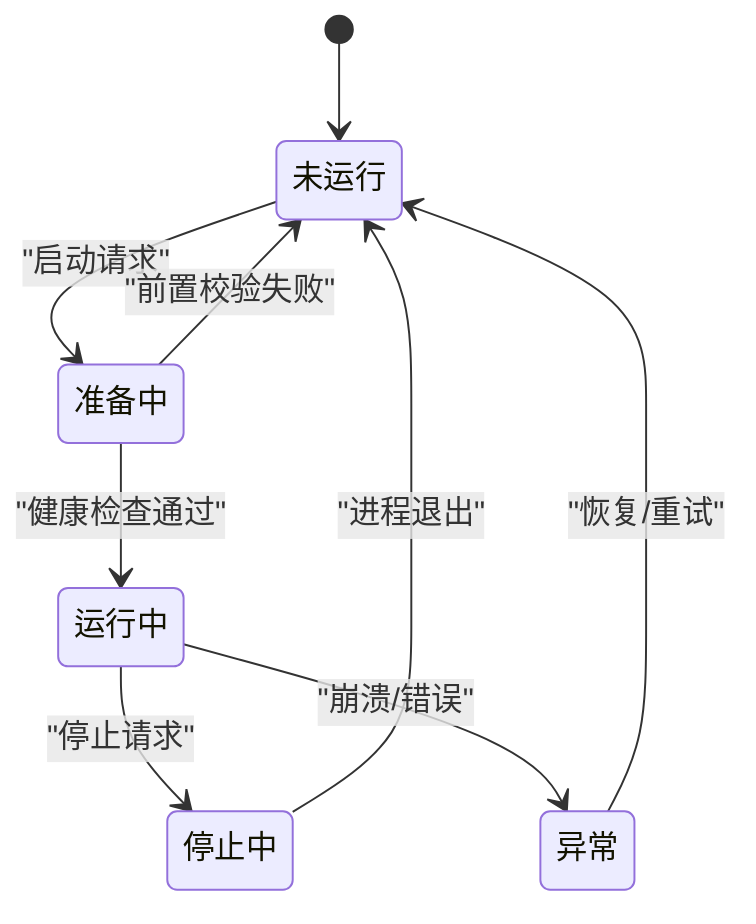
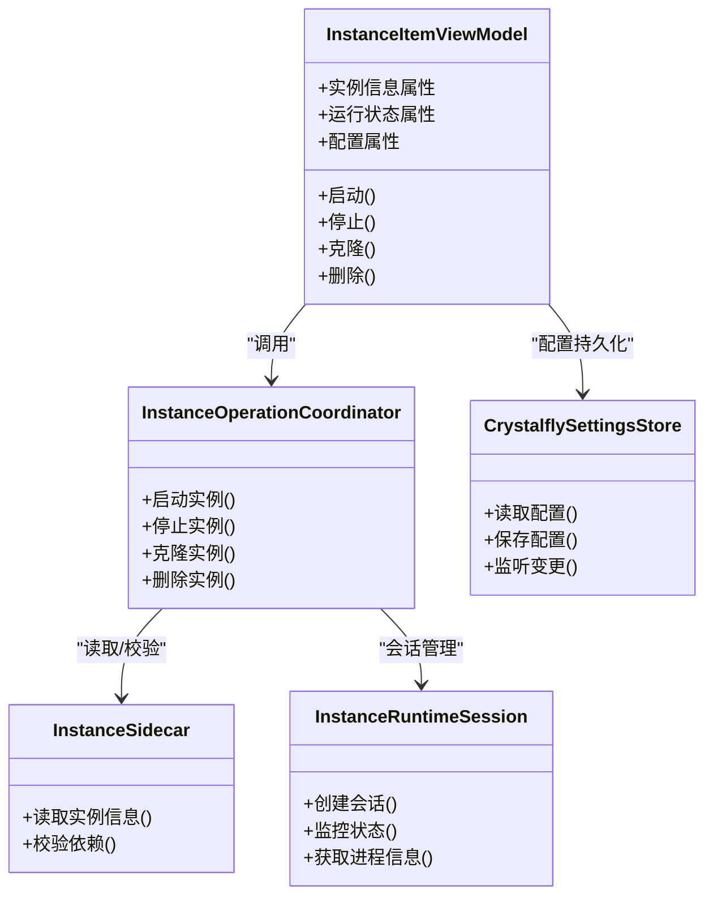

# 实例项控件

<cite>
**本文引用的文件**   
- [InstanceItemViewModel.cs](file://src/Crystalfly.App/ViewModels/InstanceItemViewModel.cs)
- [MainViewModel.cs](file://src/Crystalfly.App/ViewModels/MainViewModel.cs)
- [InstanceOperationCoordinator.cs](file://src/Crystalfly.App/Downloads/InstanceOperationCoordinator.cs)
- [InstanceCloneService.cs](file://src/Crystalfly.Core/Instances/InstanceCloneService.cs)
- [InstanceDeletionService.cs](file://src/Crystalfly.Core/Instances/InstanceDeletionService.cs)
- [InstanceSidecar.cs](file://src/Crystalfly.Core/Instances/InstanceSidecar.cs)
- [InstanceRuntimeSession.cs](file://src/Crystalfly.Core/Runtime/InstanceRuntimeSession.cs)
- [CrystalflySettingsStore.cs](file://src/Crystalfly.Core/Configuration/CrystalflySettingsStore.cs)
</cite>

## 目录
1. [简介](#简介)
2. [项目结构](#项目结构)
3. [核心组件](#核心组件)
4. [架构总览](#架构总览)
5. [详细组件分析](#详细组件分析)
6. [依赖关系分析](#依赖关系分析)
7. [性能考虑](#性能考虑)
8. [故障排查指南](#故障排查指南)
9. [结论](#结论)
10. [附录](#附录) 

## 简介
本文件围绕“实例项控件”的 ViewModel 实现进行系统化文档化，重点覆盖：
- 游戏实例信息展示（名称、路径、版本、构建指纹等）
- 启动状态监控与 UI 同步
- 配置管理与持久化
- 生命周期管理、状态同步与异步操作处理
- 实例操作能力：启动、停止、克隆、删除
- 实例图标动态加载、状态指示器与交互反馈机制
- 性能优化策略与资源管理最佳实践

## 项目结构
该功能位于应用层与核心库协作的边界处：
- 应用层负责 UI 绑定与用户交互：InstanceItemViewModel 提供数据与命令，MainViewModel 协调全局状态。
- 核心库负责实例侧车、运行时会话、服务编排与持久化：InstanceSidecar、InstanceRuntimeSession、InstanceOperationCoordinator、各 Service 与 SettingsStore。

图表来源
- [InstanceItemViewModel.cs](file://src/Crystalfly.App/ViewModels/InstanceItemViewModel.cs)
- [MainViewModel.cs](file://src/Crystalfly.App/ViewModels/MainViewModel.cs)
- [InstanceOperationCoordinator.cs](file://src/Crystalfly.App/Downloads/InstanceOperationCoordinator.cs)
- [InstanceSidecar.cs](file://src/Crystalfly.Core/Instances/InstanceSidecar.cs)
- [InstanceRuntimeSession.cs](file://src/Crystalfly.Core/Runtime/InstanceRuntimeSession.cs)
- [InstanceCloneService.cs](file://src/Crystalfly.Core/Instances/InstanceCloneService.cs)
- [InstanceDeletionService.cs](file://src/Crystalfly.Core/Instances/InstanceDeletionService.cs)
- [CrystalflySettingsStore.cs](file://src/Crystalfly.Core/Configuration/CrystalflySettingsStore.cs)

章节来源
- [InstanceItemViewModel.cs](file://src/Crystalfly.App/ViewModels/InstanceItemViewModel.cs)
- [MainViewModel.cs](file://src/Crystalfly.App/ViewModels/MainViewModel.cs)
- [InstanceOperationCoordinator.cs](file://src/Crystalfly.App/Downloads/InstanceOperationCoordinator.cs)
- [InstanceSidecar.cs](file://src/Crystalfly.Core/Instances/InstanceSidecar.cs)
- [InstanceRuntimeSession.cs](file://src/Crystalfly.Core/Runtime/InstanceRuntimeSession.cs)
- [InstanceCloneService.cs](file://src/Crystalfly.Core/Instances/InstanceCloneService.cs)
- [InstanceDeletionService.cs](file://src/Crystalfly.Core/Instances/InstanceDeletionService.cs)
- [CrystalflySettingsStore.cs](file://src/Crystalfly.Core/Configuration/CrystalflySettingsStore.cs)

## 核心组件
- InstanceItemViewModel：封装单个实例的展示属性、命令与状态，负责与 UI 双向绑定、异步任务编排与错误传播。
- MainViewModel：维护实例集合与全局上下文，持有并更新 InstanceItemViewModel 列表，触发刷新与通知。
- InstanceOperationCoordinator：统一编排实例级操作（启动、停止、克隆、删除），保证并发安全与结果回传。
- InstanceSidecar：读取实例元数据、配置文件与运行态信息，为 VM 提供数据源。
- InstanceRuntimeSession：跟踪进程生命周期、端口、日志与退出码，驱动状态同步。
- InstanceCloneService / InstanceDeletionService：执行磁盘层面的实例复制与清理。
- CrystalflySettingsStore：读写应用与实例相关设置，支持热更新与变更通知。

章节来源
- [InstanceItemViewModel.cs](file://src/Crystalfly.App/ViewModels/InstanceItemViewModel.cs)
- [MainViewModel.cs](file://src/Crystalfly.App/ViewModels/MainViewModel.cs)
- [InstanceOperationCoordinator.cs](file://src/Crystalfly.App/Downloads/InstanceOperationCoordinator.cs)
- [InstanceSidecar.cs](file://src/Crystalfly.Core/Instances/InstanceSidecar.cs)
- [InstanceRuntimeSession.cs](file://src/Crystalfly.Core/Runtime/InstanceRuntimeSession.cs)
- [InstanceCloneService.cs](file://src/Crystalfly.Core/Instances/InstanceCloneService.cs)
- [InstanceDeletionService.cs](file://src/Crystalfly.Core/Instances/InstanceDeletionService.cs)
- [CrystalflySettingsStore.cs](file://src/Crystalfly.Core/Configuration/CrystalflySettingsStore.cs)

## 架构总览
下图展示了从 UI 到核心服务的调用链路与数据流向，强调异步编排与状态同步。

图表来源
- [InstanceItemViewModel.cs](file://src/Crystalfly.App/ViewModels/InstanceItemViewModel.cs)
- [InstanceOperationCoordinator.cs](file://src/Crystalfly.App/Downloads/InstanceOperationCoordinator.cs)
- [InstanceSidecar.cs](file://src/Crystalfly.Core/Instances/InstanceSidecar.cs)
- [InstanceRuntimeSession.cs](file://src/Crystalfly.Core/Runtime/InstanceRuntimeSession.cs)
- [CrystalflySettingsStore.cs](file://src/Crystalfly.Core/Configuration/CrystalflySettingsStore.cs)

## 详细组件分析

### InstanceItemViewModel 实现要点
- 数据展示
  - 实例基本信息：名称、路径、版本、构建指纹、描述等。
  - 运行状态：未运行、准备中、运行中、停止中、异常等。
  - 配置快照：上次启动参数、窗口模式、分辨率、语言等。
- 状态同步
  - 通过事件或回调订阅运行时会话的状态变化，将底层状态映射为可绑定的属性。
  - 使用防抖/节流避免频繁 UI 重绘。
- 异步操作处理
  - 所有耗时操作均基于异步任务编排，提供 IsBusy 标志位与 Progress 报告。
  - 错误统一捕获并转换为友好的提示消息，必要时记录日志。
- 配置管理
  - 读/写实例配置时先做校验，成功后写入并触发变更通知。
  - 支持配置热重载，无需重启实例即可生效。
- 图标与状态指示器
  - 图标采用懒加载与缓存策略，优先从本地缓存读取，缺失时再下载或生成占位图。
  - 状态指示器根据运行状态切换颜色/动画，并在异常时高亮提示。
- 交互反馈
  - 按钮禁用策略：在操作进行中禁用重复点击。
  - 进度条与状态文本实时更新，失败时提供重试入口。

章节来源
- [InstanceItemViewModel.cs](file://src/Crystalfly.App/ViewModels/InstanceItemViewModel.cs)
- [InstanceRuntimeSession.cs](file://src/Crystalfly.Core/Runtime/InstanceRuntimeSession.cs)
- [CrystalflySettingsStore.cs](file://src/Crystalfly.Core/Configuration/CrystalflySettingsStore.cs)

### 实例操作：启动、停止、克隆、删除
- 启动
  - 前置检查：实例存在性、必要文件完整性、端口占用、依赖项就绪。
  - 启动流程：构造启动参数 -> 拉起进程 -> 注册会话 -> 轮询健康检查 -> 更新状态。
- 停止
  - 优雅关闭：发送终止信号 -> 等待退出超时 -> 强制结束 -> 清理临时文件。
- 克隆
  - 校验目标名唯一性 -> 复制实例目录 -> 更新引用与索引 -> 重建缓存。
- 删除
  - 二次确认 -> 检查是否正在运行 -> 停止后执行删除 -> 清理索引与缓存。

图表来源
- [InstanceOperationCoordinator.cs](file://src/Crystalfly.App/Downloads/InstanceOperationCoordinator.cs)
- [InstanceSidecar.cs](file://src/Crystalfly.Core/Instances/InstanceSidecar.cs)
- [InstanceRuntimeSession.cs](file://src/Crystalfly.Core/Runtime/InstanceRuntimeSession.cs)

章节来源
- [InstanceOperationCoordinator.cs](file://src/Crystalfly.App/Downloads/InstanceOperationCoordinator.cs)
- [InstanceCloneService.cs](file://src/Crystalfly.Core/Instances/InstanceCloneService.cs)
- [InstanceDeletionService.cs](file://src/Crystalfly.Core/Instances/InstanceDeletionService.cs)
- [InstanceSidecar.cs](file://src/Crystalfly.Core/Instances/InstanceSidecar.cs)
- [InstanceRuntimeSession.cs](file://src/Crystalfly.Core/Runtime/InstanceRuntimeSession.cs)

### 生命周期管理与状态同步
- 创建阶段
  - 初始化实例元数据、加载默认配置、建立会话监听。
- 运行阶段
  - 持续同步进程状态、日志输出、崩溃恢复提示。
- 销毁阶段
  - 释放资源、取消订阅、清理临时文件、保存最终状态。

图表来源
- [InstanceRuntimeSession.cs](file://src/Crystalfly.Core/Runtime/InstanceRuntimeSession.cs)
- [InstanceItemViewModel.cs](file://src/Crystalfly.App/ViewModels/InstanceItemViewModel.cs)

章节来源
- [InstanceRuntimeSession.cs](file://src/Crystalfly.Core/Runtime/InstanceRuntimeSession.cs)
- [InstanceItemViewModel.cs](file://src/Crystalfly.App/ViewModels/InstanceItemViewModel.cs)

### 配置管理与持久化
- 配置项范围：启动参数、窗口模式、分辨率、语言、模组开关等。
- 持久化策略：原子写入、变更通知、冲突合并。
- 热更新：在不重启实例的前提下应用部分配置变更。

章节来源
- [CrystalflySettingsStore.cs](file://src/Crystalfly.Core/Configuration/CrystalflySettingsStore.cs)
- [InstanceItemViewModel.cs](file://src/Crystalfly.App/ViewModels/InstanceItemViewModel.cs)

### 图标动态加载与状态指示器
- 图标加载
  - 优先级：本地缓存 -> 实例内资源 -> 在线资源 -> 占位图。
  - 缓存策略：LRU + 过期时间，避免重复 IO。
- 状态指示器
  - 颜色映射：绿色=运行中、灰色=未运行、黄色=准备中、红色=异常。
  - 动画：运行中微动效，异常闪烁提示。

章节来源
- [InstanceItemViewModel.cs](file://src/Crystalfly.App/ViewModels/InstanceItemViewModel.cs)
- [InstanceRuntimeSession.cs](file://src/Crystalfly.Core/Runtime/InstanceRuntimeSession.cs)

### 交互反馈机制
- 按钮状态：操作中禁用、完成后恢复。
- 进度反馈：百分比与阶段文本。
- 错误处理：统一弹窗与日志记录，支持一键重试。

章节来源
- [InstanceItemViewModel.cs](file://src/Crystalfly.App/ViewModels/InstanceItemViewModel.cs)
- [InstanceOperationCoordinator.cs](file://src/Crystalfly.App/Downloads/InstanceOperationCoordinator.cs)

## 依赖关系分析
- 松耦合设计：ViewModel 仅依赖抽象接口与服务，便于替换与测试。
- 关键依赖链：
  - InstanceItemViewModel -> InstanceOperationCoordinator -> InstanceSidecar/InstanceRuntimeSession
  - InstanceItemViewModel -> CrystalflySettingsStore
  - MainViewModel -> InstanceItemViewModel 集合

图表来源
- [InstanceItemViewModel.cs](file://src/Crystalfly.App/ViewModels/InstanceItemViewModel.cs)
- [InstanceOperationCoordinator.cs](file://src/Crystalfly.App/Downloads/InstanceOperationCoordinator.cs)
- [InstanceSidecar.cs](file://src/Crystalfly.Core/Instances/InstanceSidecar.cs)
- [InstanceRuntimeSession.cs](file://src/Crystalfly.Core/Runtime/InstanceRuntimeSession.cs)
- [CrystalflySettingsStore.cs](file://src/Crystalfly.Core/Configuration/CrystalflySettingsStore.cs)

章节来源
- [InstanceItemViewModel.cs](file://src/Crystalfly.App/ViewModels/InstanceItemViewModel.cs)
- [InstanceOperationCoordinator.cs](file://src/Crystalfly.App/Downloads/InstanceOperationCoordinator.cs)
- [InstanceSidecar.cs](file://src/Crystalfly.Core/Instances/InstanceSidecar.cs)
- [InstanceRuntimeSession.cs](file://src/Crystalfly.Core/Runtime/InstanceRuntimeSession.cs)
- [CrystalflySettingsStore.cs](file://src/Crystalfly.Core/Configuration/CrystalflySettingsStore.cs)

## 性能考虑
- 异步与并发
  - 所有 IO 与网络操作异步化，避免阻塞 UI 线程。
  - 对高频状态变更采用批处理与去抖，降低 UI 刷新频率。
- 缓存与懒加载
  - 图标与配置缓存，命中率高时显著减少 IO。
  - 大对象按需加载，避免一次性载入过多实例信息。
- 资源管理
  - 及时释放进程句柄、文件流与订阅，防止内存泄漏。
  - 使用原子写入与事务式更新，避免脏数据。
- 错误快速失败
  - 前置校验尽早返回，减少无效工作。
  - 超时与重试策略合理配置，避免雪崩。

[本节为通用指导，不直接分析具体文件]

## 故障排查指南
- 常见问题定位
  - 启动失败：检查前置校验日志、端口占用、依赖完整性。
  - 运行中崩溃：查看运行时会话日志、崩溃转储、最近配置变更。
  - 配置未生效：确认原子写入是否成功、是否存在并发修改冲突。
- 诊断步骤
  - 启用详细日志级别，复现问题并收集上下文。
  - 验证实例目录权限与磁盘空间。
  - 隔离第三方模组或外部依赖，逐步缩小范围。
- 恢复建议
  - 使用最近一次稳定配置回滚。
  - 清理临时文件与缓存后重试。
  - 若为网络资源问题，切换镜像或离线包。

章节来源
- [InstanceOperationCoordinator.cs](file://src/Crystalfly.App/Downloads/InstanceOperationCoordinator.cs)
- [InstanceRuntimeSession.cs](file://src/Crystalfly.Core/Runtime/InstanceRuntimeSession.cs)
- [CrystalflySettingsStore.cs](file://src/Crystalfly.Core/Configuration/CrystalflySettingsStore.cs)

## 结论
InstanceItemViewModel 作为实例项控件的核心，将 UI 展示、状态同步、配置管理与实例操作有机整合。通过与 InstanceOperationCoordinator、InstanceSidecar、InstanceRuntimeSession 及设置存储的协作，实现了稳健的异步编排与良好的用户体验。遵循本文的性能与资源管理建议，可进一步提升稳定性与响应速度。

[本节为总结性内容，不直接分析具体文件]

## 附录
- 术语表
  - 实例：一个独立的游戏运行环境，包含独立的配置与数据。
  - 侧车：辅助读取实例元数据与配置的轻量服务。
  - 运行时会话：跟踪进程生命周期与健康状态的抽象。
- 参考文件
  - 视图模型与协调器：InstanceItemViewModel、InstanceOperationCoordinator
  - 核心服务：InstanceSidecar、InstanceRuntimeSession、InstanceCloneService、InstanceDeletionService
  - 配置存储：CrystalflySettingsStore

[本节为补充说明，不直接分析具体文件]