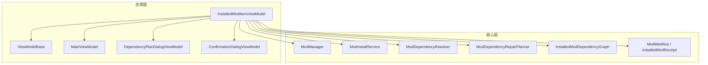
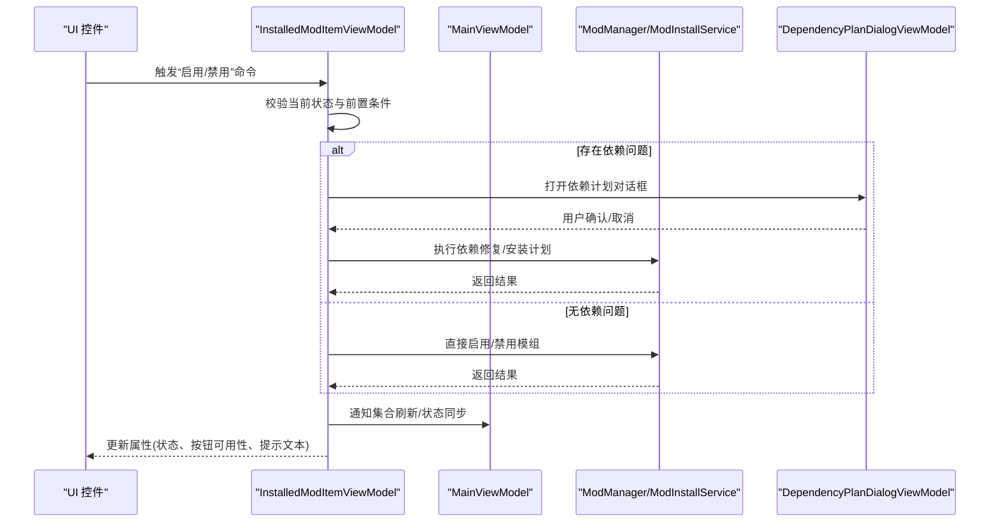
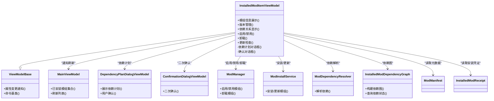
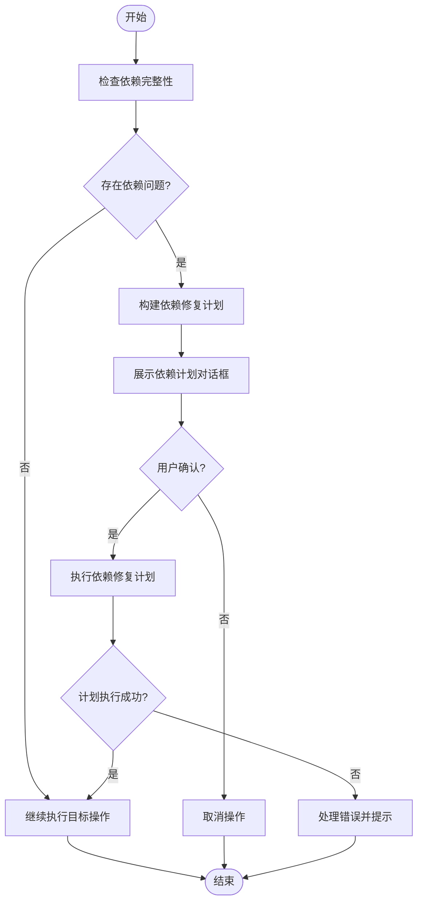
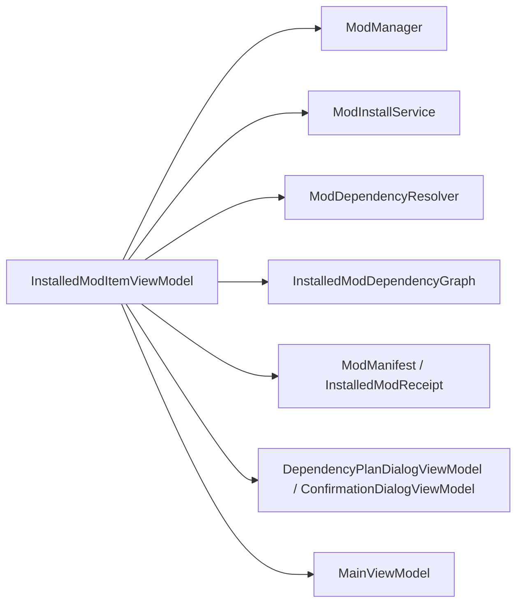

# 已安装模组项控件

<cite>
**本文引用的文件**   
- [InstalledModItemViewModel.cs](file://src/Crystalfly.App/ViewModels/InstalledModItemViewModel.cs)
- [ViewModelBase.cs](file://src/Crystalfly.App/ViewModels/ViewModelBase.cs)
- [MainViewModel.cs](file://src/Crystalfly.App/ViewModels/MainViewModel.cs)
- [DependencyPlanDialogViewModel.cs](file://src/Crystalfly.App/ViewModels/Dialogs/DependencyPlanDialogViewModel.cs)
- [ConfirmationDialogViewModel.cs](file://src/Crystalfly.App/ViewModels/Dialogs/ConfirmationDialogViewModel.cs)
- [ModManager.cs](file://src/Crystalfly.Core/Mods/ModManager.cs)
- [ModInstallService.cs](file://src/Crystalfly.Core/Mods/ModInstallService.cs)
- [ModDependencyResolver.cs](file://src/Crystalfly.Core/Mods/ModDependencyResolver.cs)
- [ModDependencyRepairPlanner.cs](file://src/Crystalfly.Core/Mods/ModDependencyRepairPlanner.cs)
- [InstalledModDependencyGraph.cs](file://src/Crystalfly.Core/Mods/InstalledModDependencyGraph.cs)
- [ModManifest.cs](file://src/Crystalfly.Core/Models/ModManifest.cs)
- [InstalledModReceipt.cs](file://src/Crystalfly.Core/Models/InstalledModReceipt.cs)
</cite>

## 目录
1. [简介](#简介)
2. [项目结构](#项目结构)
3. [核心组件](#核心组件)
4. [架构总览](#架构总览)
5. [详细组件分析](#详细组件分析)
6. [依赖关系分析](#依赖关系分析)
7. [性能考虑](#性能考虑)
8. [故障排查指南](#故障排查指南)
9. [结论](#结论)
10. [附录](#附录)

## 简介
本文件围绕“已安装模组项控件”的视图模型实现进行系统化文档化，重点覆盖 InstalledModItemViewModel 的职责边界、数据模型关联、属性变更通知与命令绑定机制，以及模组操作（启用/禁用、卸载、更新检查）的工作流。同时给出依赖关系展示、错误处理与用户反馈机制的实现要点，并提供自定义扩展点与样式覆盖建议，帮助开发者快速理解并扩展该控件。

## 项目结构
已安装模组项控件位于应用层的 ViewModel 层，负责将 Core 层的模组管理能力暴露给 UI 层，并通过对话框 ViewModel 协调复杂交互流程。

图表来源
- [InstalledModItemViewModel.cs](file://src/Crystalfly.App/ViewModels/InstalledModItemViewModel.cs)
- [ViewModelBase.cs](file://src/Crystalfly.App/ViewModels/ViewModelBase.cs)
- [MainViewModel.cs](file://src/Crystalfly.App/ViewModels/MainViewModel.cs)
- [DependencyPlanDialogViewModel.cs](file://src/Crystalfly.App/ViewModels/Dialogs/DependencyPlanDialogViewModel.cs)
- [ConfirmationDialogViewModel.cs](file://src/Crystalfly.App/ViewModels/Dialogs/ConfirmationDialogViewModel.cs)
- [ModManager.cs](file://src/Crystalfly.Core/Mods/ModManager.cs)
- [ModInstallService.cs](file://src/Crystalfly.Core/Mods/ModInstallService.cs)
- [ModDependencyResolver.cs](file://src/Crystalfly.Core/Mods/ModDependencyResolver.cs)
- [ModDependencyRepairPlanner.cs](file://src/Crystalfly.Core/Mods/ModDependencyRepairPlanner.cs)
- [InstalledModDependencyGraph.cs](file://src/Crystalfly.Core/Mods/InstalledModDependencyGraph.cs)
- [ModManifest.cs](file://src/Crystalfly.Core/Models/ModManifest.cs)
- [InstalledModReceipt.cs](file://src/Crystalfly.Core/Models/InstalledModReceipt.cs)

章节来源
- [InstalledModItemViewModel.cs](file://src/Crystalfly.App/ViewModels/InstalledModItemViewModel.cs)
- [ViewModelBase.cs](file://src/Crystalfly.App/ViewModels/ViewModelBase.cs)
- [MainViewModel.cs](file://src/Crystalfly.App/ViewModels/MainViewModel.cs)

## 核心组件
- InstalledModItemViewModel：封装单个已安装模组的展示与操作，包括名称、版本、状态、依赖信息、可用操作等；提供启用/禁用、卸载、更新检查等命令；在需要时弹出依赖计划或确认对话框。
- ViewModelBase：提供通用的属性变更通知与命令基类能力，确保 UI 能响应属性变化。
- MainViewModel：作为容器型 ViewModel，持有已安装模组集合及全局操作入口，通常由 InstalledModItemViewModel 反向引用以触发列表刷新或状态同步。
- 对话框 ViewModel：DependencyPlanDialogViewModel 用于展示依赖修复/安装计划；ConfirmationDialogViewModel 用于二次确认关键操作。
- Core 层服务与模型：ModManager、ModInstallService、ModDependencyResolver、ModDependencyRepairPlanner、InstalledModDependencyGraph 提供模组管理、安装、依赖解析与修复规划能力；ModManifest 与 InstalledModReceipt 描述模组元数据与安装凭证。

章节来源
- [InstalledModItemViewModel.cs](file://src/Crystalfly.App/ViewModels/InstalledModItemViewModel.cs)
- [ViewModelBase.cs](file://src/Crystalfly.App/ViewModels/ViewModelBase.cs)
- [MainViewModel.cs](file://src/Crystalfly.App/ViewModels/MainViewModel.cs)
- [DependencyPlanDialogViewModel.cs](file://src/Crystalfly.App/ViewModels/Dialogs/DependencyPlanDialogViewModel.cs)
- [ConfirmationDialogViewModel.cs](file://src/Crystalfly.App/ViewModels/Dialogs/ConfirmationDialogViewModel.cs)
- [ModManager.cs](file://src/Crystalfly.Core/Mods/ModManager.cs)
- [ModInstallService.cs](file://src/Crystalfly.Core/Mods/ModInstallService.cs)
- [ModDependencyResolver.cs](file://src/Crystalfly.Core/Mods/ModDependencyResolver.cs)
- [ModDependencyRepairPlanner.cs](file://src/Crystalfly.Core/Mods/ModDependencyRepairPlanner.cs)
- [InstalledModDependencyGraph.cs](file://src/Crystalfly.Core/Mods/InstalledModDependencyGraph.cs)
- [ModManifest.cs](file://src/Crystalfly.Core/Models/ModManifest.cs)
- [InstalledModReceipt.cs](file://src/Crystalfly.Core/Models/InstalledModReceipt.cs)

## 架构总览
以下序列图展示了“启用/禁用模组”的典型调用链，从 UI 命令到 Core 层执行，再到 UI 状态回写。

图表来源
- [InstalledModItemViewModel.cs](file://src/Crystalfly.App/ViewModels/InstalledModItemViewModel.cs)
- [DependencyPlanDialogViewModel.cs](file://src/Crystalfly.App/ViewModels/Dialogs/DependencyPlanDialogViewModel.cs)
- [MainViewModel.cs](file://src/Crystalfly.App/ViewModels/MainViewModel.cs)
- [ModManager.cs](file://src/Crystalfly.Core/Mods/ModManager.cs)
- [ModInstallService.cs](file://src/Crystalfly.Core/Mods/ModInstallService.cs)

## 详细组件分析

### InstalledModItemViewModel 实现要点
- 数据模型关联
  - 通过 ModManifest 获取模组标识、名称、版本、作者、描述等展示信息。
  - 通过 InstalledModReceipt 获取本地安装状态、路径、时间戳等运行时信息。
  - 使用 InstalledModDependencyGraph 与 ModDependencyResolver 计算并缓存依赖关系，供 UI 展示与冲突检测。
- 属性变更通知
  - 继承自 ViewModelBase，利用其属性变更通知机制，使 UI 自动响应状态、按钮可用性、提示信息等属性的变化。
- 命令绑定机制
  - 为“启用/禁用”、“卸载”、“更新检查”等操作定义命令，并在命令执行前进行前置校验（如是否正在运行、是否存在未决依赖）。
  - 命令内部可异步执行，期间更新“进行中”状态，完成后刷新相关属性。
- 模组操作功能
  - 启用/禁用：根据当前状态切换，必要时先构建并执行依赖修复计划。
  - 卸载：在确认后进行移除，清理本地记录并刷新列表。
  - 更新检查：查询可用新版本，若存在则提示用户并引导进入安装流程。
- 依赖关系显示
  - 基于 InstalledModDependencyGraph 生成依赖树/列表，标注必需/可选依赖、缺失/不兼容状态。
  - 当检测到依赖问题时，弹出 DependencyPlanDialogViewModel 展示计划并等待用户确认。
- 错误处理与用户反馈
  - 捕获并包装异常，设置友好的错误消息与重试选项。
  - 对关键操作使用 ConfirmationDialogViewModel 进行二次确认，避免误操作。
  - 通过属性（如 IsBusy、ErrorMessage、SuccessMessage）向 UI 反馈进度与结果。

章节来源
- [InstalledModItemViewModel.cs](file://src/Crystalfly.App/ViewModels/InstalledModItemViewModel.cs)
- [ModManifest.cs](file://src/Crystalfly.Core/Models/ModManifest.cs)
- [InstalledModReceipt.cs](file://src/Crystalfly.Core/Models/InstalledModReceipt.cs)
- [InstalledModDependencyGraph.cs](file://src/Crystalfly.Core/Mods/InstalledModDependencyGraph.cs)
- [ModDependencyResolver.cs](file://src/Crystalfly.Core/Mods/ModDependencyResolver.cs)
- [DependencyPlanDialogViewModel.cs](file://src/Crystalfly.App/ViewModels/Dialogs/DependencyPlanDialogViewModel.cs)
- [ConfirmationDialogViewModel.cs](file://src/Crystalfly.App/ViewModels/Dialogs/ConfirmationDialogViewModel.cs)

#### 类关系图（代码级）

图表来源
- [InstalledModItemViewModel.cs](file://src/Crystalfly.App/ViewModels/InstalledModItemViewModel.cs)
- [ViewModelBase.cs](file://src/Crystalfly.App/ViewModels/ViewModelBase.cs)
- [MainViewModel.cs](file://src/Crystalfly.App/ViewModels/MainViewModel.cs)
- [DependencyPlanDialogViewModel.cs](file://src/Crystalfly.App/ViewModels/Dialogs/DependencyPlanDialogViewModel.cs)
- [ConfirmationDialogViewModel.cs](file://src/Crystalfly.App/ViewModels/Dialogs/ConfirmationDialogViewModel.cs)
- [ModManager.cs](file://src/Crystalfly.Core/Mods/ModManager.cs)
- [ModInstallService.cs](file://src/Crystalfly.Core/Mods/ModInstallService.cs)
- [ModDependencyResolver.cs](file://src/Crystalfly.Core/Mods/ModDependencyResolver.cs)
- [InstalledModDependencyGraph.cs](file://src/Crystalfly.Core/Mods/InstalledModDependencyGraph.cs)
- [ModManifest.cs](file://src/Crystalfly.Core/Models/ModManifest.cs)
- [InstalledModReceipt.cs](file://src/Crystalfly.Core/Models/InstalledModReceipt.cs)

#### 依赖修复流程图（算法级）

图表来源
- [InstalledModItemViewModel.cs](file://src/Crystalfly.App/ViewModels/InstalledModItemViewModel.cs)
- [ModDependencyRepairPlanner.cs](file://src/Crystalfly.Core/Mods/ModDependencyRepairPlanner.cs)
- [DependencyPlanDialogViewModel.cs](file://src/Crystalfly.App/ViewModels/Dialogs/DependencyPlanDialogViewModel.cs)

章节来源
- [InstalledModItemViewModel.cs](file://src/Crystalfly.App/ViewModels/InstalledModItemViewModel.cs)
- [ModDependencyRepairPlanner.cs](file://src/Crystalfly.Core/Mods/ModDependencyRepairPlanner.cs)
- [DependencyPlanDialogViewModel.cs](file://src/Crystalfly.App/ViewModels/Dialogs/DependencyPlanDialogViewModel.cs)

### 数据模型与属性映射
- 模组信息展示
  - 名称、版本、作者、描述来源于 ModManifest。
  - 本地路径、安装时间、状态来源于 InstalledModReceipt。
- 版本管理
  - 通过 ModInstallService 提供的接口进行更新检查与安装。
  - 结合 Catalog 信息判断是否有新版本可用。
- 依赖关系显示
  - 使用 InstalledModDependencyGraph 构建依赖图，ModDependencyResolver 解析具体依赖版本约束。
  - 将依赖状态（满足/缺失/冲突）映射为 UI 可读的标签与颜色提示。

章节来源
- [ModManifest.cs](file://src/Crystalfly.Core/Models/ModManifest.cs)
- [InstalledModReceipt.cs](file://src/Crystalfly.Core/Models/InstalledModReceipt.cs)
- [ModInstallService.cs](file://src/Crystalfly.Core/Mods/ModInstallService.cs)
- [InstalledModDependencyGraph.cs](file://src/Crystalfly.Core/Mods/InstalledModDependencyGraph.cs)
- [ModDependencyResolver.cs](file://src/Crystalfly.Core/Mods/ModDependencyResolver.cs)

### 属性变更通知与命令绑定
- 属性变更通知
  - 所有影响 UI 的属性（如 IsEnabled、IsDisabled、IsBusy、ErrorMessage、HasUpdateAvailable）均通过 ViewModelBase 的通知机制更新。
- 命令绑定
  - 每个操作对应一个命令对象，支持 CanExecute 判定与异步执行。
  - 命令执行前后更新 IsBusy 与结果消息，确保 UI 一致性。

章节来源
- [ViewModelBase.cs](file://src/Crystalfly.App/ViewModels/ViewModelBase.cs)
- [InstalledModItemViewModel.cs](file://src/Crystalfly.App/ViewModels/InstalledModItemViewModel.cs)

### 模组操作工作流
- 启用/禁用
  - 校验当前状态与依赖，必要时先执行依赖修复计划。
  - 调用 ModManager 完成状态切换，随后刷新列表与属性。
- 卸载
  - 使用 ConfirmationDialogViewModel 进行二次确认。
  - 调用 ModManager 执行卸载，清理本地记录并刷新列表。
- 更新检查
  - 查询 Catalog 与本地版本差异，若有新版本则提示用户并引导安装。
  - 安装过程交由 ModInstallService 处理，并反馈进度与结果。

章节来源
- [InstalledModItemViewModel.cs](file://src/Crystalfly.App/ViewModels/InstalledModItemViewModel.cs)
- [ModManager.cs](file://src/Crystalfly.Core/Mods/ModManager.cs)
- [ModInstallService.cs](file://src/Crystalfly.Core/Mods/ModInstallService.cs)
- [ConfirmationDialogViewModel.cs](file://src/Crystalfly.App/ViewModels/Dialogs/ConfirmationDialogViewModel.cs)

### 自定义扩展点与样式覆盖
- 扩展点
  - 通过继承 InstalledModItemViewModel 并重写关键方法（如依赖解析、更新检查、错误处理），注入自定义逻辑。
  - 在主界面中替换默认 ViewModel 实例，以实现不同业务场景下的行为定制。
- 样式覆盖
  - 针对依赖状态、按钮可用性、错误提示等 UI 元素，可通过主题资源或样式模板进行覆盖，保持视觉一致性。
  - 建议在主题文件中集中定义状态色与图标，便于统一维护。

章节来源
- [InstalledModItemViewModel.cs](file://src/Crystalfly.App/ViewModels/InstalledModItemViewModel.cs)
- [CrystalflyTheme.axaml](file://src/Crystalfly.App/Styles/CrystalflyTheme.axaml)

## 依赖关系分析
- 组件耦合
  - InstalledModItemViewModel 与 Core 层服务松耦合，通过接口化的服务调用完成实际业务。
  - 与对话框 ViewModel 的组合关系清晰，职责分离明确。
- 外部依赖
  - 依赖 ModManifest 与 InstalledModReceipt 的数据契约，保证展示与操作的准确性。
  - 依赖 ModDependencyResolver 与 InstalledModDependencyGraph 提供稳定的依赖分析能力。
- 潜在循环依赖
  - 通过 MainViewModel 的单向引用避免循环依赖；InstalledModItemViewModel 仅通知刷新，不直接修改集合。

图表来源
- [InstalledModItemViewModel.cs](file://src/Crystalfly.App/ViewModels/InstalledModItemViewModel.cs)
- [ModManager.cs](file://src/Crystalfly.Core/Mods/ModManager.cs)
- [ModInstallService.cs](file://src/Crystalfly.Core/Mods/ModInstallService.cs)
- [ModDependencyResolver.cs](file://src/Crystalfly.Core/Mods/ModDependencyResolver.cs)
- [InstalledModDependencyGraph.cs](file://src/Crystalfly.Core/Mods/InstalledModDependencyGraph.cs)
- [ModManifest.cs](file://src/Crystalfly.Core/Models/ModManifest.cs)
- [InstalledModReceipt.cs](file://src/Crystalfly.Core/Models/InstalledModReceipt.cs)
- [DependencyPlanDialogViewModel.cs](file://src/Crystalfly.App/ViewModels/Dialogs/DependencyPlanDialogViewModel.cs)
- [ConfirmationDialogViewModel.cs](file://src/Crystalfly.App/ViewModels/Dialogs/ConfirmationDialogViewModel.cs)
- [MainViewModel.cs](file://src/Crystalfly.App/ViewModels/MainViewModel.cs)

章节来源
- [InstalledModItemViewModel.cs](file://src/Crystalfly.App/ViewModels/InstalledModItemViewModel.cs)
- [MainViewModel.cs](file://src/Crystalfly.App/ViewModels/MainViewModel.cs)

## 性能考虑
- 依赖解析缓存
  - 对 InstalledModDependencyGraph 的结果进行缓存，避免重复计算。
- 异步与并发
  - 所有耗时操作（安装、卸载、更新检查）采用异步执行，避免阻塞 UI。
- 批量刷新
  - 通过 MainViewModel 的集合刷新机制减少频繁 UI 重绘。
- 资源释放
  - 在 ViewModel 销毁时释放订阅与临时资源，防止内存泄漏。

[本节为通用指导，无需列出具体文件来源]

## 故障排查指南
- 常见问题定位
  - 依赖冲突：查看依赖计划对话框中的冲突详情，确认是否需要降级或升级依赖。
  - 权限不足：检查模组目录写入权限与 Steam 内容交付客户端状态。
  - 网络问题：更新检查失败时，检查网络连接与源可达性。
- 错误处理策略
  - 捕获并包装异常，设置 ErrorMessage 属性，提供重试与查看详情选项。
  - 对关键操作使用 ConfirmationDialogViewModel 进行二次确认，降低误操作风险。
- 调试建议
  - 启用日志输出，记录关键步骤与异常堆栈。
  - 在单元测试中模拟依赖图与服务返回，验证边界情况。

章节来源
- [InstalledModItemViewModel.cs](file://src/Crystalfly.App/ViewModels/InstalledModItemViewModel.cs)
- [DependencyPlanDialogViewModel.cs](file://src/Crystalfly.App/ViewModels/Dialogs/DependencyPlanDialogViewModel.cs)
- [ConfirmationDialogViewModel.cs](file://src/Crystalfly.App/ViewModels/Dialogs/ConfirmationDialogViewModel.cs)

## 结论
InstalledModItemViewModel 作为已安装模组项控件的核心，将 Core 层的模组管理能力以清晰的属性与命令暴露给 UI，并通过对话框 ViewModel 协调复杂交互。其设计遵循 MVVM 模式，具备良好的可扩展性与可测试性。通过合理的依赖解析、错误处理与用户反馈机制，能够为用户提供稳定且友好的模组管理体验。

[本节为总结性内容，无需列出具体文件来源]

## 附录
- 术语表
  - 模组：游戏扩展包，包含脚本、资源与配置。
  - 依赖：模组运行所需的其他模组或库。
  - 依赖修复计划：为满足依赖约束而制定的安装/升级/降级方案。
- 参考文件
  - 视图模型与对话框：InstalledModItemViewModel.cs、DependencyPlanDialogViewModel.cs、ConfirmationDialogViewModel.cs
  - 核心服务与模型：ModManager.cs、ModInstallService.cs、ModDependencyResolver.cs、InstalledModDependencyGraph.cs、ModManifest.cs、InstalledModReceipt.cs

[本节为补充说明，无需列出具体文件来源]