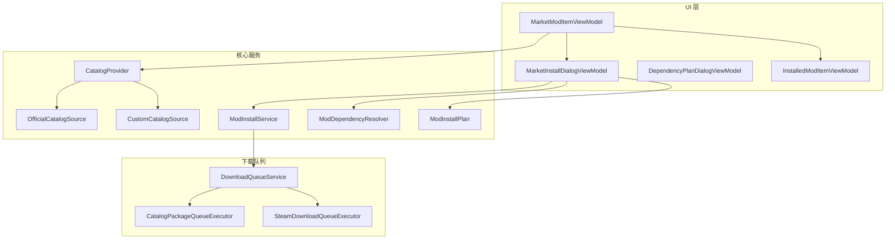
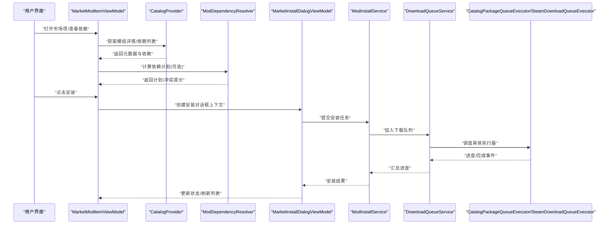
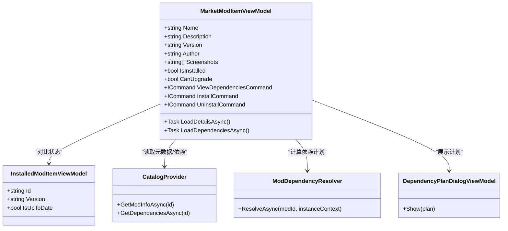
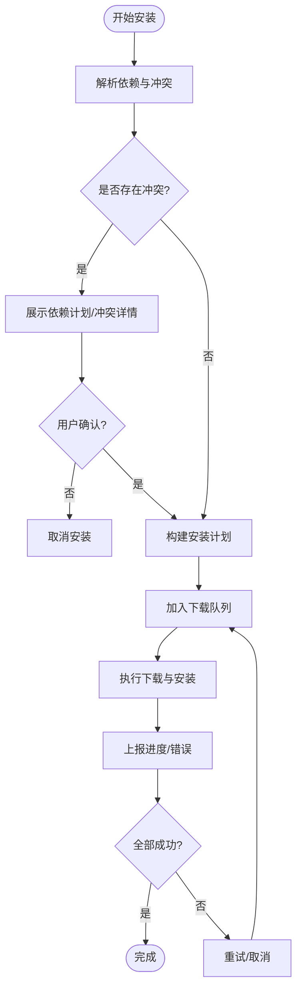
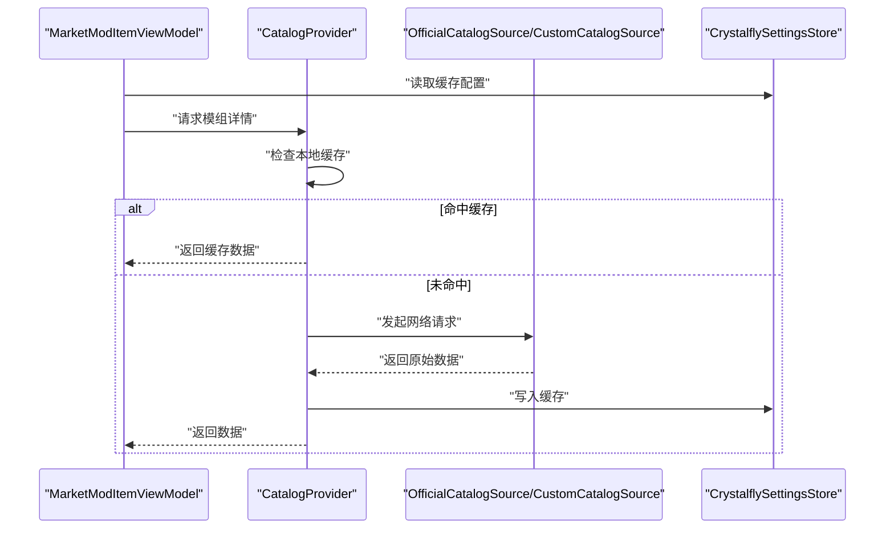
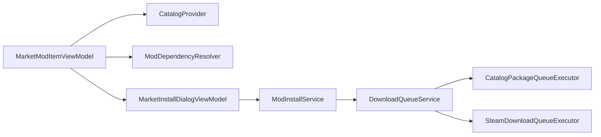

# 市场模组项控件

<cite>
**本文引用的文件**   
- [MarketModItemViewModel.cs](file://src/Crystalfly.App/ViewModels/MarketModItemViewModel.cs)
- [MarketInstallDialogViewModel.cs](file://src/Crystalfly.App/ViewModels/Dialogs/MarketInstallDialogViewModel.cs)
- [DependencyPlanDialogViewModel.cs](file://src/Crystalfly.App/ViewModels/Dialogs/DependencyPlanDialogViewModel.cs)
- [InstalledModItemViewModel.cs](file://src/Crystalfly.App/ViewModels/InstalledModItemViewModel.cs)
- [CatalogProvider.cs](file://src/Crystalfly.Core/Catalog/CatalogProvider.cs)
- [OfficialCatalogSource.cs](file://src/Crystalfly.Core/Catalog/OfficialCatalogSource.cs)
- [CustomCatalogSource.cs](file://src/Crystalfly.Core/Catalog/CustomCatalogSource.cs)
- [ModInstallService.cs](file://src/Crystalfly.Core/Mods/ModInstallService.cs)
- [ModDependencyResolver.cs](file://src/Crystalfly.Core/Mods/ModDependencyResolver.cs)
- [ModInstallPlan.cs](file://src/Crystalfly.Core/Mods/ModInstallPlan.cs)
- [DownloadQueueService.cs](file://src/Crystalfly.App/Downloads/DownloadQueueService.cs)
- [CatalogPackageQueueExecutor.cs](file://src/Crystalfly.App/Downloads/CatalogPackageQueueExecutor.cs)
- [SteamDownloadQueueExecutor.cs](file://src/Crystalfly.App/Downloads/SteamDownloadQueueExecutor.cs)
- [CrystalflySettingsStore.cs](file://src/Crystalfly.Core/Configuration/CrystalflySettingsStore.cs)
- [MarketModItemViewModelTests.cs](file://tests/Crystalfly.App.Tests/ViewModels/MarketModItemViewModelTests.cs)
</cite>

## 目录
1. [简介](#简介)
2. [项目结构](#项目结构)
3. [核心组件](#核心组件)
4. [架构总览](#架构总览)
5. [详细组件分析](#详细组件分析)
6. [依赖关系分析](#依赖关系分析)
7. [性能考虑](#性能考虑)
8. [故障排查指南](#故障排查指南)
9. [结论](#结论)
10. [附录](#附录)

## 简介
本文件围绕“市场模组项控件”的 ViewModel 实现进行系统化文档化，重点覆盖 MarketModItemViewModel 的职责与行为：模组元数据展示、依赖预览、安装状态管理；网络请求处理与缓存策略；异步数据加载；与安装流程、依赖检查、冲突检测的集成；模板定制、图片加载优化与用户交互设计；以及网络错误处理、重试机制和用户体验优化方案。

## 项目结构
与市场模组项控件相关的代码主要分布在 App 层的 ViewModels 与 Core 层的服务/提供者中：
- UI 层（App）
  - MarketModItemViewModel：市场模组项的视图模型，负责展示与交互
  - MarketInstallDialogViewModel：安装对话框的视图模型，协调安装计划与执行
  - DependencyPlanDialogViewModel：依赖计划对话框的视图模型，用于展示依赖修复或变更计划
  - InstalledModItemViewModel：已安装模组的视图模型，提供对比与状态联动
- 核心服务（Core）
  - CatalogProvider / OfficialCatalogSource / CustomCatalogSource：目录源聚合与解析
  - ModInstallService / ModDependencyResolver / ModInstallPlan：安装与依赖解析
- 下载队列（App）
  - DownloadQueueService / CatalogPackageQueueExecutor / SteamDownloadQueueExecutor：统一下载编排与执行器

图表来源
- [MarketModItemViewModel.cs](file://src/Crystalfly.App/ViewModels/MarketModItemViewModel.cs)
- [MarketInstallDialogViewModel.cs](file://src/Crystalfly.App/ViewModels/Dialogs/MarketInstallDialogViewModel.cs)
- [DependencyPlanDialogViewModel.cs](file://src/Crystalfly.App/ViewModels/Dialogs/DependencyPlanDialogViewModel.cs)
- [InstalledModItemViewModel.cs](file://src/Crystalfly.App/ViewModels/InstalledModItemViewModel.cs)
- [CatalogProvider.cs](file://src/Crystalfly.Core/Catalog/CatalogProvider.cs)
- [OfficialCatalogSource.cs](file://src/Crystalfly.Core/Catalog/OfficialCatalogSource.cs)
- [CustomCatalogSource.cs](file://src/Crystalfly.Core/Catalog/CustomCatalogSource.cs)
- [ModInstallService.cs](file://src/Crystalfly.Core/Mods/ModInstallService.cs)
- [ModDependencyResolver.cs](file://src/Crystalfly.Core/Mods/ModDependencyResolver.cs)
- [ModInstallPlan.cs](file://src/Crystalfly.Core/Mods/ModInstallPlan.cs)
- [DownloadQueueService.cs](file://src/Crystalfly.App/Downloads/DownloadQueueService.cs)
- [CatalogPackageQueueExecutor.cs](file://src/Crystalfly.App/Downloads/CatalogPackageQueueExecutor.cs)
- [SteamDownloadQueueExecutor.cs](file://src/Crystalfly.App/Downloads/SteamDownloadQueueExecutor.cs)

章节来源
- [MarketModItemViewModel.cs](file://src/Crystalfly.App/ViewModels/MarketModItemViewModel.cs)
- [CatalogProvider.cs](file://src/Crystalfly.Core/Catalog/CatalogProvider.cs)
- [ModInstallService.cs](file://src/Crystalfly.Core/Mods/ModInstallService.cs)
- [DownloadQueueService.cs](file://src/Crystalfly.App/Downloads/DownloadQueueService.cs)

## 核心组件
- MarketModItemViewModel
  - 职责：封装单个市场模组的展示数据与交互命令，包括名称、描述、版本、作者、截图、依赖预览、安装状态、操作按钮等
  - 关键能力：
    - 元数据展示：从目录源获取并绑定到 UI
    - 依赖预览：在点击时触发依赖解析并生成计划
    - 安装状态管理：与本地已安装模组状态同步，驱动按钮文案与可用性
    - 网络与缓存：通过 CatalogProvider 拉取目录信息，结合设置存储进行缓存控制
    - 异步加载：使用异步方法加载详情与依赖图，避免阻塞 UI
- MarketInstallDialogViewModel
  - 职责：承载一次安装操作的上下文，包含目标模组、依赖计划、进度与结果
  - 关键能力：
    - 调用 ModInstallService 执行安装
    - 与 DownloadQueueService 协作，按批次调度下载与安装
    - 暴露取消与重试入口
- DependencyPlanDialogViewModel
  - 职责：以可读方式呈现依赖修复/变更计划，支持用户确认
- InstalledModItemViewModel
  - 职责：表示本地已安装模组，为 MarketModItemViewModel 提供“是否已安装/版本差异”等对比信息

章节来源
- [MarketModItemViewModel.cs](file://src/Crystalfly.App/ViewModels/MarketModItemViewModel.cs)
- [MarketInstallDialogViewModel.cs](file://src/Crystalfly.App/ViewModels/Dialogs/MarketInstallDialogViewModel.cs)
- [DependencyPlanDialogViewModel.cs](file://src/Crystalfly.App/ViewModels/Dialogs/DependencyPlanDialogViewModel.cs)
- [InstalledModItemViewModel.cs](file://src/Crystalfly.App/ViewModels/InstalledModItemViewModel.cs)

## 架构总览
下图展示了从 UI 到核心服务的端到端调用链，涵盖目录读取、依赖解析、安装计划与下载执行。

图表来源
- [MarketModItemViewModel.cs](file://src/Crystalfly.App/ViewModels/MarketModItemViewModel.cs)
- [CatalogProvider.cs](file://src/Crystalfly.Core/Catalog/CatalogProvider.cs)
- [ModDependencyResolver.cs](file://src/Crystalfly.Core/Mods/ModDependencyResolver.cs)
- [MarketInstallDialogViewModel.cs](file://src/Crystalfly.App/ViewModels/Dialogs/MarketInstallDialogViewModel.cs)
- [ModInstallService.cs](file://src/Crystalfly.Core/Mods/ModInstallService.cs)
- [DownloadQueueService.cs](file://src/Crystalfly.App/Downloads/DownloadQueueService.cs)
- [CatalogPackageQueueExecutor.cs](file://src/Crystalfly.App/Downloads/CatalogPackageQueueExecutor.cs)
- [SteamDownloadQueueExecutor.cs](file://src/Crystalfly.App/Downloads/SteamDownloadQueueExecutor.cs)

## 详细组件分析

### MarketModItemViewModel 分析
- 数据绑定与展示
  - 暴露属性：名称、描述、版本、作者、截图 URL、标签、评分等
  - 依赖预览：提供只读的依赖摘要与展开详情
  - 安装状态：根据 InstalledModItemViewModel 的状态显示“未安装/可升级/已最新/不可用”等
- 网络与缓存
  - 通过 CatalogProvider 访问官方/自定义目录源
  - 结合 CrystalflySettingsStore 中的缓存开关与过期策略，减少重复请求
- 异步加载
  - 详情页与依赖图采用异步加载，首次进入时按需拉取
  - 使用可观察集合与通知机制，保证 UI 响应性
- 用户交互
  - “查看依赖”按钮：弹出依赖计划对话框
  - “安装/升级/卸载”按钮：根据当前状态切换命令
  - 错误提示：网络异常、依赖冲突、权限不足等场景给出友好提示

图表来源
- [MarketModItemViewModel.cs](file://src/Crystalfly.App/ViewModels/MarketModItemViewModel.cs)
- [InstalledModItemViewModel.cs](file://src/Crystalfly.App/ViewModels/InstalledModItemViewModel.cs)
- [CatalogProvider.cs](file://src/Crystalfly.Core/Catalog/CatalogProvider.cs)
- [ModDependencyResolver.cs](file://src/Crystalfly.Core/Mods/ModDependencyResolver.cs)
- [DependencyPlanDialogViewModel.cs](file://src/Crystalfly.App/ViewModels/Dialogs/DependencyPlanDialogViewModel.cs)

章节来源
- [MarketModItemViewModel.cs](file://src/Crystalfly.App/ViewModels/MarketModItemViewModel.cs)
- [InstalledModItemViewModel.cs](file://src/Crystalfly.App/ViewModels/InstalledModItemViewModel.cs)
- [CatalogProvider.cs](file://src/Crystalfly.Core/Catalog/CatalogProvider.cs)
- [ModDependencyResolver.cs](file://src/Crystalfly.Core/Mods/ModDependencyResolver.cs)
- [DependencyPlanDialogViewModel.cs](file://src/Crystalfly.App/ViewModels/Dialogs/DependencyPlanDialogViewModel.cs)

### 安装流程集成与依赖检查
- 安装入口
  - 用户在 MarketModItemViewModel 点击安装后，构造 MarketInstallDialogViewModel 并展示
- 依赖检查与冲突检测
  - 通过 ModDependencyResolver 计算依赖图，识别缺失、版本不兼容与潜在冲突
  - 若存在冲突，DependencyPlanDialogViewModel 会高亮冲突点并提供修复建议
- 安装计划
  - ModInstallPlan 描述需要安装/升级/保留的模组清单及顺序
- 执行与进度
  - ModInstallService 将任务交给 DownloadQueueService，由具体执行器（目录包或 Steam）下载与安装
  - 进度事件回传到 UI，支持取消与重试

图表来源
- [MarketInstallDialogViewModel.cs](file://src/Crystalfly.App/ViewModels/Dialogs/MarketInstallDialogViewModel.cs)
- [ModDependencyResolver.cs](file://src/Crystalfly.Core/Mods/ModDependencyResolver.cs)
- [DependencyPlanDialogViewModel.cs](file://src/Crystalfly.App/ViewModels/Dialogs/DependencyPlanDialogViewModel.cs)
- [ModInstallPlan.cs](file://src/Crystalfly.Core/Mods/ModInstallPlan.cs)
- [ModInstallService.cs](file://src/Crystalfly.Core/Mods/ModInstallService.cs)
- [DownloadQueueService.cs](file://src/Crystalfly.App/Downloads/DownloadQueueService.cs)

章节来源
- [MarketInstallDialogViewModel.cs](file://src/Crystalfly.App/ViewModels/Dialogs/MarketInstallDialogViewModel.cs)
- [ModDependencyResolver.cs](file://src/Crystalfly.Core/Mods/ModDependencyResolver.cs)
- [DependencyPlanDialogViewModel.cs](file://src/Crystalfly.App/ViewModels/Dialogs/DependencyPlanDialogViewModel.cs)
- [ModInstallPlan.cs](file://src/Crystalfly.Core/Mods/ModInstallPlan.cs)
- [ModInstallService.cs](file://src/Crystalfly.Core/Mods/ModInstallService.cs)
- [DownloadQueueService.cs](file://src/Crystalfly.App/Downloads/DownloadQueueService.cs)

### 网络请求处理、缓存策略与异步加载
- 目录源
  - CatalogProvider 聚合多个源（官方与自定义），对外提供统一的模组信息与依赖查询接口
  - OfficialCatalogSource 与 CustomCatalogSource 分别对接不同来源的数据
- 缓存策略
  - 通过 CrystalflySettingsStore 控制是否启用缓存、缓存有效期与最大条目数
  - 首次加载后落盘，后续优先读缓存并在后台增量更新
- 异步加载
  - 所有 I/O 操作均异步执行，避免阻塞 UI 线程
  - 对大图资源采用懒加载与占位图，降低首屏压力

图表来源
- [CatalogProvider.cs](file://src/Crystalfly.Core/Catalog/CatalogProvider.cs)
- [OfficialCatalogSource.cs](file://src/Crystalfly.Core/Catalog/OfficialCatalogSource.cs)
- [CustomCatalogSource.cs](file://src/Crystalfly.Core/Catalog/CustomCatalogSource.cs)
- [CrystalflySettingsStore.cs](file://src/Crystalfly.Core/Configuration/CrystalflySettingsStore.cs)

章节来源
- [CatalogProvider.cs](file://src/Crystalfly.Core/Catalog/CatalogProvider.cs)
- [OfficialCatalogSource.cs](file://src/Crystalfly.Core/Catalog/OfficialCatalogSource.cs)
- [CustomCatalogSource.cs](file://src/Crystalfly.Core/Catalog/CustomCatalogSource.cs)
- [CrystalflySettingsStore.cs](file://src/Crystalfly.Core/Configuration/CrystalflySettingsStore.cs)

### 模板定制、图片加载优化与用户交互设计
- 模板定制
  - 通过 DataTemplate 与样式分离，允许替换图标、布局与信息密度
  - 支持国际化文本绑定，便于多语言展示
- 图片加载优化
  - 缩略图懒加载、失败降级为默认占位图
  - 大尺寸图片按需加载，避免一次性占用过多内存
- 用户交互
  - 按钮状态随安装状态变化，禁用无效操作
  - 依赖冲突时提供一键查看计划与修复建议
  - 安装进行中提供进度条与取消入口

[本节为通用设计与最佳实践说明，不直接分析具体文件]

### 网络错误处理、重试机制与用户体验优化
- 错误分类
  - 网络超时/连接失败：提示网络问题并提供重试
  - 服务端错误：记录日志并提示稍后再试
  - 依赖冲突：明确冲突点与影响范围，引导用户决策
- 重试机制
  - 指数退避重试，限制最大重试次数
  - 支持手动重试与批量重试
- 用户体验优化
  - 骨架屏/占位图提升感知速度
  - 错误消息简洁明了，附带可操作建议
  - 安装失败时保留中间状态，支持断点续传（由执行器决定）

章节来源
- [MarketModItemViewModelTests.cs](file://tests/Crystalfly.App.Tests/ViewModels/MarketModItemViewModelTests.cs)

## 依赖关系分析
- 组件耦合
  - MarketModItemViewModel 仅依赖抽象化的 CatalogProvider 与 ModDependencyResolver，保持低耦合
  - 安装流程通过 MarketInstallDialogViewModel 解耦 UI 与核心服务
- 外部依赖
  - 目录源（官方/自定义）作为外部数据提供方
  - 下载执行器（目录包/Steam）作为外部执行通道
- 循环依赖
  - 当前分层清晰，未见循环引用风险

图表来源
- [MarketModItemViewModel.cs](file://src/Crystalfly.App/ViewModels/MarketModItemViewModel.cs)
- [CatalogProvider.cs](file://src/Crystalfly.Core/Catalog/CatalogProvider.cs)
- [ModDependencyResolver.cs](file://src/Crystalfly.Core/Mods/ModDependencyResolver.cs)
- [MarketInstallDialogViewModel.cs](file://src/Crystalfly.App/ViewModels/Dialogs/MarketInstallDialogViewModel.cs)
- [ModInstallService.cs](file://src/Crystalfly.Core/Mods/ModInstallService.cs)
- [DownloadQueueService.cs](file://src/Crystalfly.App/Downloads/DownloadQueueService.cs)
- [CatalogPackageQueueExecutor.cs](file://src/Crystalfly.App/Downloads/CatalogPackageQueueExecutor.cs)
- [SteamDownloadQueueExecutor.cs](file://src/Crystalfly.App/Downloads/SteamDownloadQueueExecutor.cs)

章节来源
- [MarketModItemViewModel.cs](file://src/Crystalfly.App/ViewModels/MarketModItemViewModel.cs)
- [CatalogProvider.cs](file://src/Crystalfly.Core/Catalog/CatalogProvider.cs)
- [ModDependencyResolver.cs](file://src/Crystalfly.Core/Mods/ModDependencyResolver.cs)
- [MarketInstallDialogViewModel.cs](file://src/Crystalfly.App/ViewModels/Dialogs/MarketInstallDialogViewModel.cs)
- [ModInstallService.cs](file://src/Crystalfly.Core/Mods/ModInstallService.cs)
- [DownloadQueueService.cs](file://src/Crystalfly.App/Downloads/DownloadQueueService.cs)
- [CatalogPackageQueueExecutor.cs](file://src/Crystalfly.App/Downloads/CatalogPackageQueueExecutor.cs)
- [SteamDownloadQueueExecutor.cs](file://src/Crystalfly.App/Downloads/SteamDownloadQueueExecutor.cs)

## 性能考虑
- 列表渲染
  - 虚拟化与分页加载，避免一次性渲染大量项
- 图片与媒体
  - 缩略图缓存与复用，大图懒加载
- 网络与缓存
  - 合理设置缓存有效期，减少重复请求
  - 并发控制与限流，避免瞬时风暴
- 依赖解析
  - 延迟计算依赖图，仅在用户显式查看时触发
  - 结果缓存，避免重复解析

[本节为通用性能指导，不直接分析具体文件]

## 故障排查指南
- 常见问题
  - 无法加载模组详情：检查网络连通性与目录源可达性
  - 依赖冲突导致安装失败：查看依赖计划，定位冲突模组与版本要求
  - 安装中断：检查磁盘空间、权限与下载执行器状态
- 诊断步骤
  - 开启调试日志，定位错误堆栈
  - 验证缓存是否过期或被污染，必要时清理缓存
  - 切换执行器（目录包/Steam）以隔离问题
- 恢复策略
  - 重试失败任务，必要时回滚到上一快照
  - 修正依赖版本或移除冲突模组后重新安装

章节来源
- [MarketModItemViewModelTests.cs](file://tests/Crystalfly.App.Tests/ViewModels/MarketModItemViewModelTests.cs)

## 结论
MarketModItemViewModel 作为市场模组项的核心视图模型，将目录数据、依赖解析、安装流程与下载队列有机整合，提供了良好的可扩展性与用户体验。通过合理的缓存策略、异步加载与错误处理机制，系统在复杂网络与依赖环境下仍能保持稳定与流畅。

## 附录
- 相关测试用例
  - MarketModItemViewModelTests：覆盖基本交互、状态转换与错误路径
- 参考文件
  - 目录源与安装服务定义见 Core 层对应文件
  - 下载队列与执行器定义见 App 层 Downloads 目录