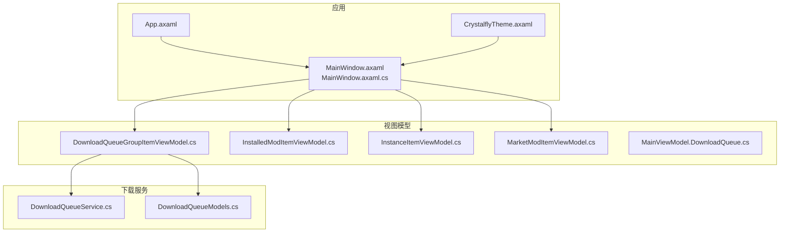
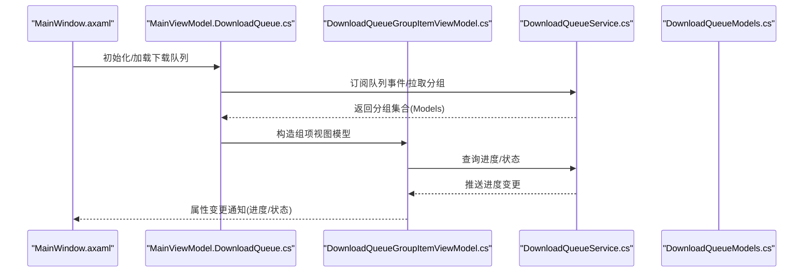
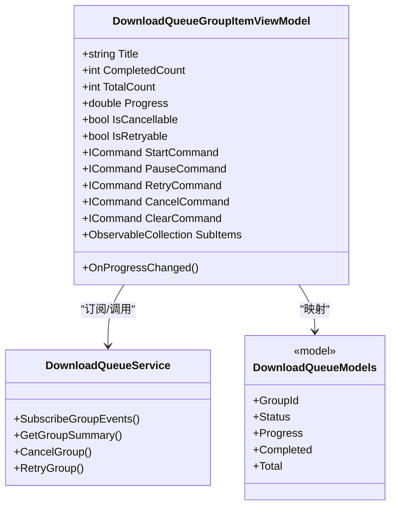
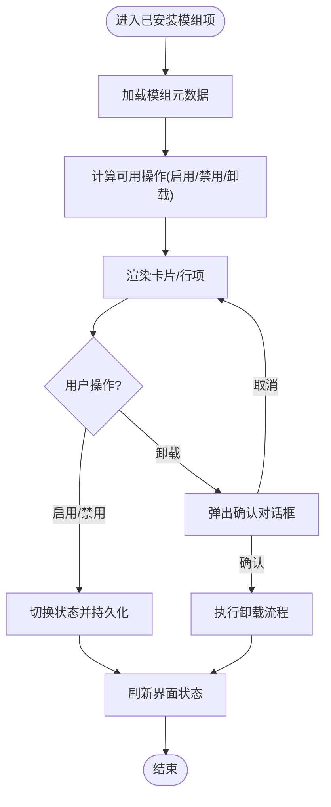
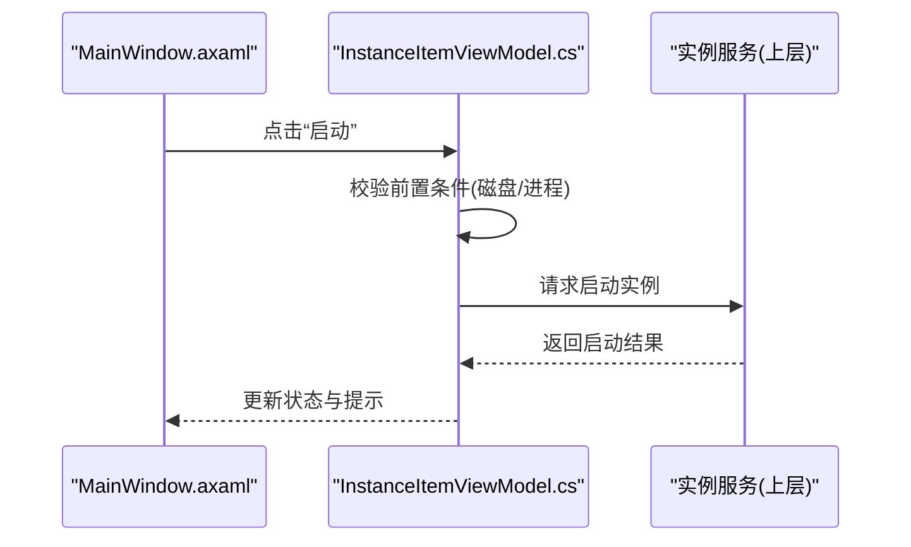
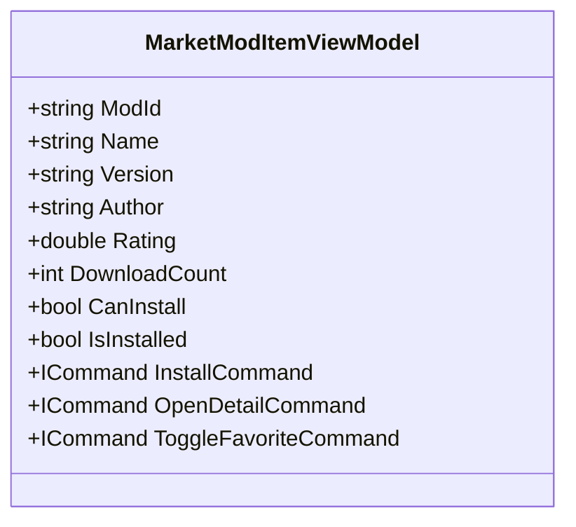
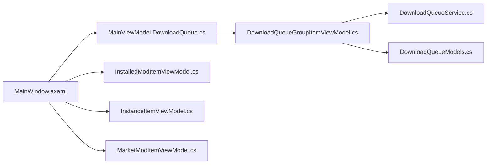

# 自定义控件

<cite>
**本文引用的文件**   
- [MainWindow.axaml](file://src/Crystalfly.App/Views/MainWindow.axaml)
- [MainWindow.axaml.cs](file://src/Crystalfly.App/Views/MainWindow.axaml.cs)
- [CrystalflyTheme.axaml](file://src/Crystalfly.App/Styles/CrystalflyTheme.axaml)
- [App.axaml](file://src/Crystalfly.App/App.axaml)
- [DownloadQueueGroupItemViewModel.cs](file://src/Crystalfly.App/ViewModels/DownloadQueueGroupItemViewModel.cs)
- [InstalledModItemViewModel.cs](file://src/Crystalfly.App/ViewModels/InstalledModItemViewModel.cs)
- [InstanceItemViewModel.cs](file://src/Crystalfly.App/ViewModels/InstanceItemViewModel.cs)
- [MarketModItemViewModel.cs](file://src/Crystalfly.App/ViewModels/MarketModItemViewModel.cs)
- [MainViewModel.DownloadQueue.cs](file://src/Crystalfly.App/ViewModels/MainViewModel.DownloadQueue.cs)
- [DownloadQueueService.cs](file://src/Crystalfly.App/Downloads/DownloadQueueService.cs)
- [DownloadQueueModels.cs](file://src/Crystalfly.App/Downloads/DownloadQueueModels.cs)
- [DocumentationScreenshotTests.cs](file://tests/Crystalfly.App.Tests/Ui/DocumentationScreenshotTests.cs)
- [DownloadQueueRenderingTests.cs](file://tests/Crystalfly.App.Tests/Ui/DownloadQueueRenderingTests.cs)
- [LayoutRenderingTests.cs](file://tests/Crystalfly.App.Tests/Ui/LayoutRenderingTests.cs)
- [ModMarketRenderingTests.cs](file://tests/Crystalfly.App.Tests/Ui/ModMarketRenderingTests.cs)
- [ThemeRenderingTests.cs](file://tests/Crystalfly.App.Tests/Ui/ThemeRenderingTests.cs)
- [DownloadQueueGroupItemViewModelTests.cs](file://tests/Crystalfly.App.Tests/ViewModels/DownloadQueueGroupItemViewModelTests.cs)
- [InstalledModItemViewModelTests.cs](file://tests/Crystalfly.App.Tests/ViewModels/InstalledModItemViewModelTests.cs)
- [MarketModItemViewModelTests.cs](file://tests/Crystalfly.App.Tests/ViewModels/MarketModItemViewModelTests.cs)
</cite>

## 目录
1. [简介](#简介)
2. [项目结构](#项目结构)
3. [核心组件](#核心组件)
4. [架构总览](#架构总览)
5. [详细组件分析](#详细组件分析)
6. [依赖关系分析](#依赖关系分析)
7. [性能考虑](#性能考虑)
8. [故障排查指南](#故障排查指南)
9. [结论](#结论)
10. [附录](#附录)

## 简介
本文件面向自定义控件与可复用 UI 组件的文档化，聚焦以下四类控件：下载队列组项、已安装模组项、实例项、市场模组项。文档覆盖属性定义、样式定制、事件处理与命令绑定、数据模型关联与业务逻辑封装、扩展指南与主题支持，以及测试方法与性能优化技巧。读者无需深入 AVALONIA/XAML 细节即可理解并扩展这些控件。

## 项目结构
UI 层位于 Crystalfly.App 工程，采用 MVVM 模式：
- Views：XAML 视图与代码后置（如主窗口）
- ViewModels：各列表项与页面级视图模型
- Styles：主题资源与样式
- Downloads：下载队列服务与模型（为“下载队列组项”提供数据源）

图表来源
- [MainWindow.axaml](file://src/Crystalfly.App/Views/MainWindow.axaml)
- [MainWindow.axaml.cs](file://src/Crystalfly.App/Views/MainWindow.axaml.cs)
- [CrystalflyTheme.axaml](file://src/Crystalfly.App/Styles/CrystalflyTheme.axaml)
- [App.axaml](file://src/Crystalfly.App/App.axaml)
- [DownloadQueueGroupItemViewModel.cs](file://src/Crystalfly.App/ViewModels/DownloadQueueGroupItemViewModel.cs)
- [InstalledModItemViewModel.cs](file://src/Crystalfly.App/ViewModels/InstalledModItemViewModel.cs)
- [InstanceItemViewModel.cs](file://src/Crystalfly.App/ViewModels/InstanceItemViewModel.cs)
- [MarketModItemViewModel.cs](file://src/Crystalfly.App/ViewModels/MarketModItemViewModel.cs)
- [MainViewModel.DownloadQueue.cs](file://src/Crystalfly.App/ViewModels/MainViewModel.DownloadQueue.cs)
- [DownloadQueueService.cs](file://src/Crystalfly.App/Downloads/DownloadQueueService.cs)
- [DownloadQueueModels.cs](file://src/Crystalfly.App/Downloads/DownloadQueueModels.cs)

章节来源
- [MainWindow.axaml](file://src/Crystalfly.App/Views/MainWindow.axaml)
- [MainWindow.axaml.cs](file://src/Crystalfly.App/Views/MainWindow.axaml.cs)
- [CrystalflyTheme.axaml](file://src/Crystalfly.App/Styles/CrystalflyTheme.axaml)
- [App.axaml](file://src/Crystalfly.App/App.axaml)

## 核心组件
本节概述四类自定义控件的职责与交互边界：
- 下载队列组项：展示一组下载任务的状态、进度与操作入口，通常由下载服务驱动更新。
- 已安装模组项：展示已安装模组的基本信息与常用操作（如卸载、查看依赖）。
- 实例项：展示游戏实例信息（名称、版本、状态等），并提供启动、克隆、删除等操作。
- 市场模组项：展示市场模组的元数据与安装入口，支持搜索过滤与批量操作。

上述控件通过各自的 ViewModel 暴露属性与命令，供 XAML 绑定使用；下载队列组项还与服务层通信以获取实时进度与状态。

章节来源
- [DownloadQueueGroupItemViewModel.cs](file://src/Crystalfly.App/ViewModels/DownloadQueueGroupItemViewModel.cs)
- [InstalledModItemViewModel.cs](file://src/Crystalfly.App/ViewModels/InstalledModItemViewModel.cs)
- [InstanceItemViewModel.cs](file://src/Crystalfly.App/ViewModels/InstanceItemViewModel.cs)
- [MarketModItemViewModel.cs](file://src/Crystalfly.App/ViewModels/MarketModItemViewModel.cs)
- [MainViewModel.DownloadQueue.cs](file://src/Crystalfly.App/ViewModels/MainViewModel.DownloadQueue.cs)
- [DownloadQueueService.cs](file://src/Crystalfly.App/Downloads/DownloadQueueService.cs)
- [DownloadQueueModels.cs](file://src/Crystalfly.App/Downloads/DownloadQueueModels.cs)

## 架构总览
下图展示了从视图到视图模型再到服务的调用链与数据流向，强调“下载队列组项”的端到端流程。

图表来源
- [MainWindow.axaml](file://src/Crystalfly.App/Views/MainWindow.axaml)
- [MainViewModel.DownloadQueue.cs](file://src/Crystalfly.App/ViewModels/MainViewModel.DownloadQueue.cs)
- [DownloadQueueGroupItemViewModel.cs](file://src/Crystalfly.App/ViewModels/DownloadQueueGroupItemViewModel.cs)
- [DownloadQueueService.cs](file://src/Crystalfly.App/Downloads/DownloadQueueService.cs)
- [DownloadQueueModels.cs](file://src/Crystalfly.App/Downloads/DownloadQueueModels.cs)

## 详细组件分析

### 下载队列组项控件
职责
- 展示一个下载分组的概览：标题、总体进度、完成数量、错误计数等。
- 提供展开/收起子项、重试、取消、清空等命令。
- 与 DownloadQueueService 协作，响应进度与状态变化。

关键属性（示例）
- 标题、描述、图标
- 进度百分比、已完成数、总数、错误数
- 是否可取消、是否可重试、是否可清空
- 子项集合（用于展开详情）

命令与事件
- 开始/暂停/重试/取消/清空命令
- 子项点击导航或查看详情
- 进度更新事件（由服务触发）

数据模型关联
- 映射 DownloadQueueModels 中的分组实体
- 将服务层的进度聚合结果转换为视图模型属性

样式与主题
- 支持主题色、圆角、阴影、间距等
- 可通过 CrystalflyTheme.axaml 覆盖默认样式

扩展点
- 新增子项类型时，在组项中注册渲染器
- 新增命令时，在 ViewModel 中暴露并绑定

图表来源
- [DownloadQueueGroupItemViewModel.cs](file://src/Crystalfly.App/ViewModels/DownloadQueueGroupItemViewModel.cs)
- [DownloadQueueService.cs](file://src/Crystalfly.App/Downloads/DownloadQueueService.cs)
- [DownloadQueueModels.cs](file://src/Crystalfly.App/Downloads/DownloadQueueModels.cs)

章节来源
- [DownloadQueueGroupItemViewModel.cs](file://src/Crystalfly.App/ViewModels/DownloadQueueGroupItemViewModel.cs)
- [DownloadQueueService.cs](file://src/Crystalfly.App/Downloads/DownloadQueueService.cs)
- [DownloadQueueModels.cs](file://src/Crystalfly.App/Downloads/DownloadQueueModels.cs)

### 已安装模组项控件
职责
- 展示已安装模组的关键信息：名称、版本、作者、启用状态等。
- 提供启用/禁用、卸载、查看依赖、打开目录等命令。
- 与模组管理相关服务交互（通过上层 ViewModel 或服务注入）。

关键属性（示例）
- 模组标识、名称、版本、作者
- 是否启用、是否可卸载、是否可切换版本
- 依赖摘要、冲突提示

命令与事件
- 启用/禁用切换
- 卸载确认与执行
- 打开模组目录、查看依赖图

数据模型关联
- 映射已安装模组记录（如 InstalledModReceipt 等）
- 计算派生属性（如是否可卸载、是否有冲突）

样式与主题
- 支持不同状态的视觉反馈（启用/禁用/冲突）
- 通过主题资源统一按钮、标签、图标风格

章节来源
- [InstalledModItemViewModel.cs](file://src/Crystalfly.App/ViewModels/InstalledModItemViewModel.cs)

### 实例项控件
职责
- 展示游戏实例信息：名称、构建指纹、运行状态、最近启动时间等。
- 提供启动、克隆、导入、删除、重命名等命令。
- 与实例管理服务交互，确保操作安全与一致性。

关键属性（示例）
- 实例标识、名称、路径、状态
- 最近启动时间、构建指纹摘要
- 是否可启动、是否可删除、是否可克隆

命令与事件
- 启动/停止（若支持）
- 克隆/导入/删除/重命名
- 打开日志/目录

数据模型关联
- 映射 InstanceRecord 等实例记录
- 结合运行时检测服务更新状态

样式与主题
- 根据运行状态显示不同颜色/图标
- 支持大/小尺寸布局

章节来源
- [InstanceItemViewModel.cs](file://src/Crystalfly.App/ViewModels/InstanceItemViewModel.cs)

### 市场模组项控件
职责
- 展示市场模组元数据：名称、版本、评分、下载次数、作者等。
- 提供安装、预览、查看详情、收藏等命令。
- 支持筛选、排序与分页加载。

关键属性（示例）
- 模组标识、名称、版本、作者
- 评分、下载量、封面图 URL
- 是否可安装、是否已安装、是否收藏

命令与事件
- 安装（含依赖解析与计划确认）
- 打开详情页/仓库链接
- 收藏/取消收藏

数据模型关联
- 映射市场模组条目（来自目录/市场 API）
- 与本地已安装状态联动，避免重复安装

样式与主题
- 网格/列表两种布局
- 支持占位图与懒加载

图表来源
- [MarketModItemViewModel.cs](file://src/Crystalfly.App/ViewModels/MarketModItemViewModel.cs)

章节来源
- [MarketModItemViewModel.cs](file://src/Crystalfly.App/ViewModels/MarketModItemViewModel.cs)

## 依赖关系分析
- 视图层（MainWindow.axaml）通过数据上下文绑定到 MainViewModel 及其下载队列部分。
- 下载队列组项 ViewModel 依赖 DownloadQueueService 与 DownloadQueueModels。
- 其他项控件（已安装模组、实例、市场模组）各自依赖对应领域服务（通过注入或上层 ViewModel 暴露）。

图表来源
- [MainWindow.axaml](file://src/Crystalfly.App/Views/MainWindow.axaml)
- [MainViewModel.DownloadQueue.cs](file://src/Crystalfly.App/ViewModels/MainViewModel.DownloadQueue.cs)
- [DownloadQueueGroupItemViewModel.cs](file://src/Crystalfly.App/ViewModels/DownloadQueueGroupItemViewModel.cs)
- [DownloadQueueService.cs](file://src/Crystalfly.App/Downloads/DownloadQueueService.cs)
- [DownloadQueueModels.cs](file://src/Crystalfly.App/Downloads/DownloadQueueModels.cs)
- [InstalledModItemViewModel.cs](file://src/Crystalfly.App/ViewModels/InstalledModItemViewModel.cs)
- [InstanceItemViewModel.cs](file://src/Crystalfly.App/ViewModels/InstanceItemViewModel.cs)
- [MarketModItemViewModel.cs](file://src/Crystalfly.App/ViewModels/MarketModItemViewModel.cs)

章节来源
- [MainWindow.axaml](file://src/Crystalfly.App/Views/MainWindow.axaml)
- [MainViewModel.DownloadQueue.cs](file://src/Crystalfly.App/ViewModels/MainViewModel.DownloadQueue.cs)
- [DownloadQueueGroupItemViewModel.cs](file://src/Crystalfly.App/ViewModels/DownloadQueueGroupItemViewModel.cs)
- [DownloadQueueService.cs](file://src/Crystalfly.App/Downloads/DownloadQueueService.cs)
- [DownloadQueueModels.cs](file://src/Crystalfly.App/Downloads/DownloadQueueModels.cs)
- [InstalledModItemViewModel.cs](file://src/Crystalfly.App/ViewModels/InstalledModItemViewModel.cs)
- [InstanceItemViewModel.cs](file://src/Crystalfly.App/ViewModels/InstanceItemViewModel.cs)
- [MarketModItemViewModel.cs](file://src/Crystalfly.App/ViewModels/MarketModItemViewModel.cs)

## 性能考虑
- 虚拟化与懒加载：对长列表（市场模组、已安装模组）启用虚拟化，按需加载图片与详情。
- 增量更新：下载队列组项仅更新必要属性，减少 UI 重绘。
- 异步与背压：网络请求与文件 IO 使用异步，避免阻塞 UI 线程。
- 缓存策略：封面图、元数据缓存，降低重复请求。
- 主题切换开销：集中式样式资源，避免频繁重建模板。

[本节为通用指导，不直接分析具体文件]

## 故障排查指南
- 下载队列无更新
  - 检查服务订阅是否正确建立，事件回调是否被移除导致内存泄漏。
  - 验证 DownloadQueueModels 字段是否与视图模型属性映射一致。
- 命令未触发
  - 确认命令绑定路径与 DataContext 层级正确。
  - 检查命令 CanExecute 条件是否阻止执行。
- 样式不生效
  - 确认主题资源已在 App.axaml 中合并。
  - 检查控件模板键名与主题资源键名一致。
- 截图/渲染测试失败
  - 参考 UI 测试用例，确保控件树结构与预期一致。

章节来源
- [DownloadQueueGroupItemViewModel.cs](file://src/Crystalfly.App/ViewModels/DownloadQueueGroupItemViewModel.cs)
- [DownloadQueueService.cs](file://src/Crystalfly.App/Downloads/DownloadQueueService.cs)
- [DownloadQueueModels.cs](file://src/Crystalfly.App/Downloads/DownloadQueueModels.cs)
- [MainWindow.axaml](file://src/Crystalfly.App/Views/MainWindow.axaml)
- [App.axaml](file://src/Crystalfly.App/App.axaml)

## 结论
四类自定义控件围绕 MVVM 模式组织，通过清晰的属性与命令暴露能力，配合主题资源实现一致的视觉体验。下载队列组项与服务层紧密协作，保证实时性与可靠性。建议遵循本文档的扩展指南与性能建议，持续完善控件的可复用性与可维护性。

[本节为总结，不直接分析具体文件]

## 附录

### 控件扩展指南
- 新增属性
  - 在 ViewModel 中声明属性并触发变更通知。
  - 在 XAML 中绑定到控件模板或内容区域。
- 新增命令
  - 在 ViewModel 中实现命令逻辑与 CanExecute 判断。
  - 在 XAML 中绑定到按钮或菜单项。
- 新增样式
  - 在 CrystalflyTheme.axaml 中添加或覆盖控件模板。
  - 在 App.axaml 中确保主题资源被合并。
- 新增数据模型
  - 在 ViewModel 中增加映射逻辑，保持只读与派生属性分离。

章节来源
- [CrystalflyTheme.axaml](file://src/Crystalfly.App/Styles/CrystalflyTheme.axaml)
- [App.axaml](file://src/Crystalfly.App/App.axaml)

### 自定义主题支持
- 主题资源位置：CrystalflyTheme.axaml
- 合并方式：在 App.axaml 中引用主题资源
- 覆盖策略：按控件类型或控件键名覆盖默认模板与样式
- 动态切换：通过设置当前主题资源字典实现

章节来源
- [CrystalflyTheme.axaml](file://src/Crystalfly.App/Styles/CrystalflyTheme.axaml)
- [App.axaml](file://src/Crystalfly.App/App.axaml)

### 控件测试方法
- UI 渲染测试
  - 使用 DocumentationScreenshotTests、DownloadQueueRenderingTests、LayoutRenderingTests、ModMarketRenderingTests、ThemeRenderingTests 进行截图与布局断言。
- 视图模型单元测试
  - 使用 DownloadQueueGroupItemViewModelTests、InstalledModItemViewModelTests、MarketModItemViewModelTests 验证属性与命令行为。

章节来源
- [DocumentationScreenshotTests.cs](file://tests/Crystalfly.App.Tests/Ui/DocumentationScreenshotTests.cs)
- [DownloadQueueRenderingTests.cs](file://tests/Crystalfly.App.Tests/Ui/DownloadQueueRenderingTests.cs)
- [LayoutRenderingTests.cs](file://tests/Crystalfly.App.Tests/Ui/LayoutRenderingTests.cs)
- [ModMarketRenderingTests.cs](file://tests/Crystalfly.App.Tests/Ui/ModMarketRenderingTests.cs)
- [ThemeRenderingTests.cs](file://tests/Crystalfly.App.Tests/Ui/ThemeRenderingTests.cs)
- [DownloadQueueGroupItemViewModelTests.cs](file://tests/Crystalfly.App.Tests/ViewModels/DownloadQueueGroupItemViewModelTests.cs)
- [InstalledModItemViewModelTests.cs](file://tests/Crystalfly.App.Tests/ViewModels/InstalledModItemViewModelTests.cs)
- [MarketModItemViewModelTests.cs](file://tests/Crystalfly.App.Tests/ViewModels/MarketModItemViewModelTests.cs)