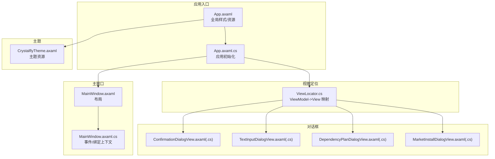
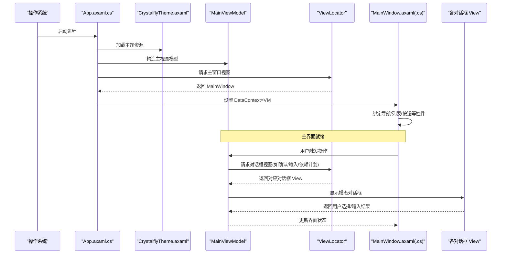
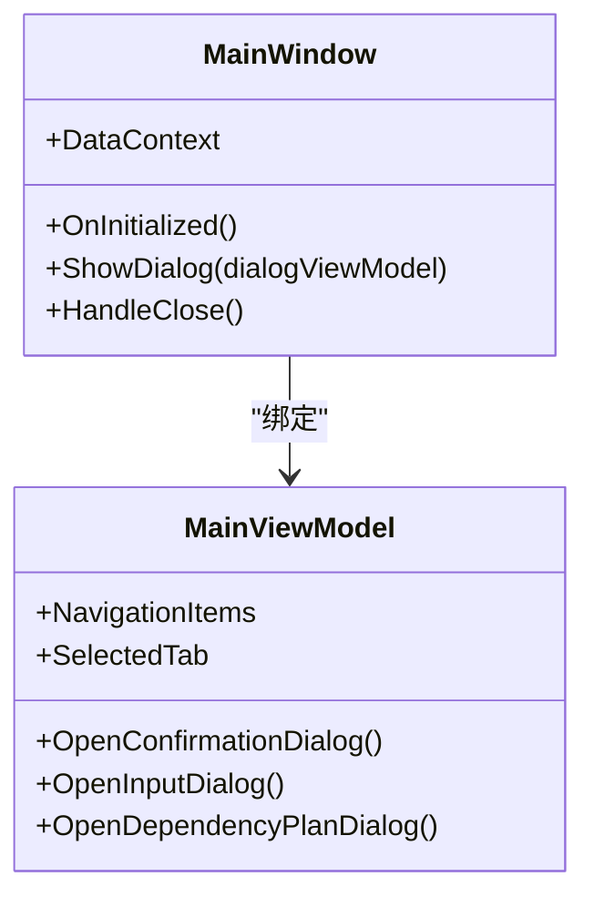
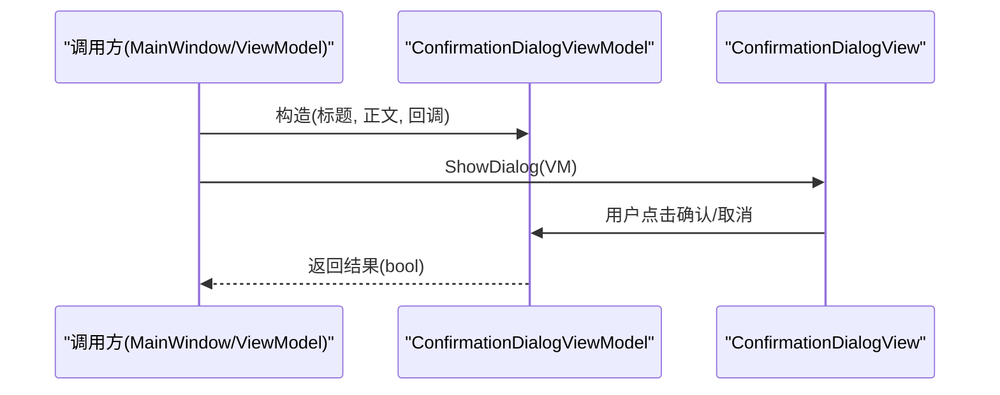
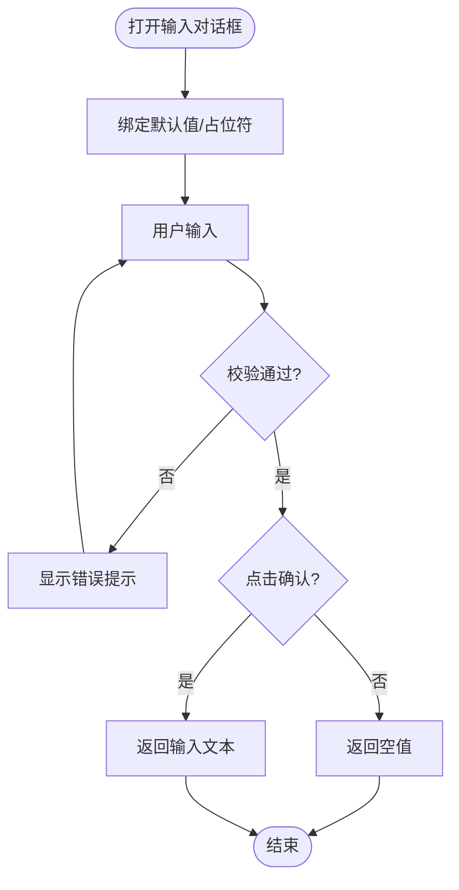
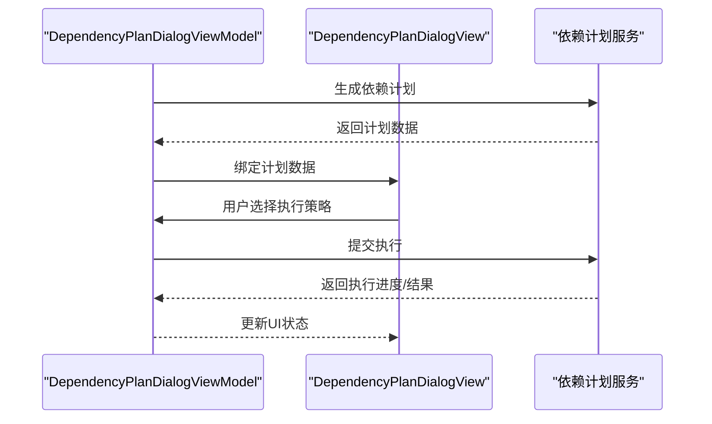
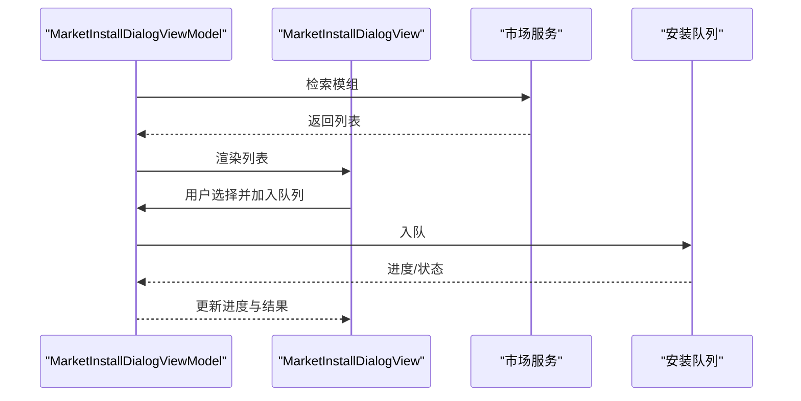
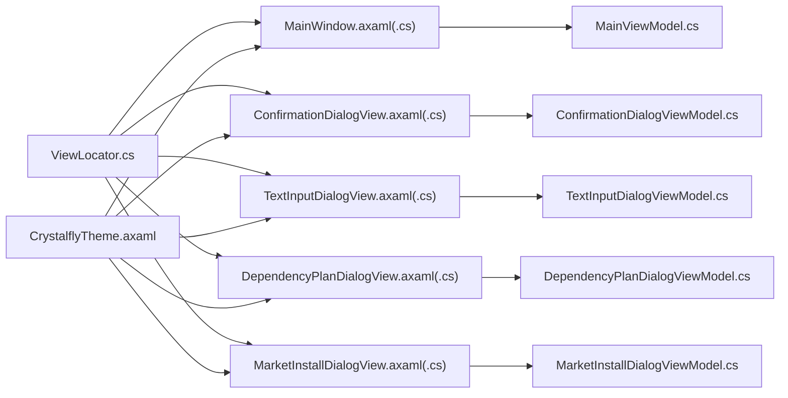

# 视图组件

<cite>
**本文引用的文件**   
- [MainWindow.axaml](file://src/Crystalfly.App/Views/MainWindow.axaml)
- [MainWindow.axaml.cs](file://src/Crystalfly.App/Views/MainWindow.axaml.cs)
- [App.axaml](file://src/Crystalfly.App/App.axaml)
- [App.axaml.cs](file://src/Crystalfly.App/App.axaml.cs)
- [ViewLocator.cs](file://src/Crystalfly.App/ViewLocator.cs)
- [CrystalflyTheme.axaml](file://src/Crystalfly.App/Styles/CrystalflyTheme.axaml)
- [ConfirmationDialogView.axaml](file://src/Crystalfly.App/Views/Dialogs/ConfirmationDialogView.axaml)
- [ConfirmationDialogView.axaml.cs](file://src/Crystalfly.App/Views/Dialogs/ConfirmationDialogView.axaml.cs)
- [ConfirmationDialogViewModel.cs](file://src/Crystalfly.App/ViewModels/Dialogs/ConfirmationDialogViewModel.cs)
- [TextInputDialogView.axaml](file://src/Crystalfly.App/Views/Dialogs/TextInputDialogView.axaml)
- [TextInputDialogView.axaml.cs](file://src/Crystalfly.App/Views/Dialogs/TextInputDialogView.axaml.cs)
- [TextInputDialogViewModel.cs](file://src/Crystalfly.App/ViewModels/Dialogs/TextInputDialogViewModel.cs)
- [DependencyPlanDialogView.axaml](file://src/Crystalfly.App/Views/Dialogs/DependencyPlanDialogView.axaml)
- [DependencyPlanDialogView.axaml.cs](file://src/Crystalfly.App/Views/Dialogs/DependencyPlanDialogView.axaml.cs)
- [DependencyPlanDialogViewModel.cs](file://src/Crystalfly.App/ViewModels/Dialogs/DependencyPlanDialogViewModel.cs)
- [MarketInstallDialogView.axaml](file://src/Crystalfly.App/Views/Dialogs/MarketInstallDialogView.axaml)
- [MarketInstallDialogView.axaml.cs](file://src/Crystalfly.App/Views/Dialogs/MarketInstallDialogView.axaml.cs)
- [MarketInstallDialogViewModel.cs](file://src/Crystalfly.App/ViewModels/Dialogs/MarketInstallDialogViewModel.cs)
- [MainViewModel.cs](file://src/Crystalfly.App/ViewModels/MainViewModel.cs)
- [MainWindowStructureTests.cs](file://tests/Crystalfly.App.Tests/Ui/MainWindowStructureTests.cs)
- [LayoutRenderingTests.cs](file://tests/Crystalfly.App.Tests/Ui/LayoutRenderingTests.cs)
</cite>

## 目录
1. [简介](#简介)
2. [项目结构](#项目结构)
3. [核心组件](#核心组件)
4. [架构总览](#架构总览)
5. [详细组件分析](#详细组件分析)
6. [依赖关系分析](#依赖关系分析)
7. [性能考虑](#性能考虑)
8. [故障排查指南](#故障排查指南)
9. [结论](#结论)
10. [附录](#附录)

## 简介
本章节面向用户界面视图组件，聚焦 Avalonia UI（XAML）实现。文档覆盖主窗口 MainWindow 的布局结构与组件组织方式；详细说明对话框组件（确认对话框、文本输入对话框、依赖计划对话框等）的实现与交互；记录 XAML 布局语法要点、控件属性配置与事件处理方法；提供自定义控件开发指南；并给出响应式布局设计与跨平台兼容性建议，以及性能优化与内存管理最佳实践。

## 项目结构
应用采用 MVVM 模式：
- Views 层：XAML 布局与代码后置（axaml + axaml.cs），负责呈现与用户交互。
- ViewModels 层：承载业务状态与命令，驱动视图更新。
- App 启动与主题：App.axaml 定义全局样式与资源，App.axaml.cs 初始化应用。
- ViewLocator：负责根据 ViewModel 类型解析对应 View。

图表来源
- [App.axaml](file://src/Crystalfly.App/App.axaml)
- [App.axaml.cs](file://src/Crystalfly.App/App.axaml.cs)
- [MainWindow.axaml](file://src/Crystalfly.App/Views/MainWindow.axaml)
- [MainWindow.axaml.cs](file://src/Crystalfly.App/Views/MainWindow.axaml.cs)
- [ViewLocator.cs](file://src/Crystalfly.App/ViewLocator.cs)
- [CrystalflyTheme.axaml](file://src/Crystalfly.App/Styles/CrystalflyTheme.axaml)
- [ConfirmationDialogView.axaml](file://src/Crystalfly.App/Views/Dialogs/ConfirmationDialogView.axaml)
- [TextInputDialogView.axaml](file://src/Crystalfly.App/Views/Dialogs/TextInputDialogView.axaml)
- [DependencyPlanDialogView.axaml](file://src/Crystalfly.App/Views/Dialogs/DependencyPlanDialogView.axaml)
- [MarketInstallDialogView.axaml](file://src/Crystalfly.App/Views/Dialogs/MarketInstallDialogView.axaml)

章节来源
- [App.axaml](file://src/Crystalfly.App/App.axaml)
- [App.axaml.cs](file://src/Crystalfly.App/App.axaml.cs)
- [MainWindow.axaml](file://src/Crystalfly.App/Views/MainWindow.axaml)
- [MainWindow.axaml.cs](file://src/Crystalfly.App/Views/MainWindow.axaml.cs)
- [ViewLocator.cs](file://src/Crystalfly.App/ViewLocator.cs)
- [CrystalflyTheme.axaml](file://src/Crystalfly.App/Styles/CrystalflyTheme.axaml)

## 核心组件
- 主窗口 MainWindow
  - 作为应用根容器，承载导航区域、内容区与底部状态栏。
  - 通过数据绑定将 MainViewModel 暴露为 DataContext，驱动列表、按钮、进度等控件。
  - 在代码后置中处理窗口生命周期事件、对话框弹出与消息提示。
- 对话框组件
  - 确认对话框：用于二次确认操作，支持标题、正文、确认/取消按钮及回调。
  - 文本输入对话框：用于获取用户短文本输入，支持占位符、默认值与校验提示。
  - 依赖计划对话框：展示依赖安装/修复计划，支持展开详情、批量操作与执行反馈。
  - 市场安装对话框：用于从市场选择并安装模组，包含搜索、筛选与安装队列。
- 视图定位器 ViewLocator
  - 基于约定或注册表将 ViewModel 类型映射到对应 View，简化弹窗与页面创建流程。
- 主题 CrystalflyTheme
  - 集中定义颜色、字体、控件模板等资源，确保一致的外观与可切换主题能力。

章节来源
- [MainWindow.axaml](file://src/Crystalfly.App/Views/MainWindow.axaml)
- [MainWindow.axaml.cs](file://src/Crystalfly.App/Views/MainWindow.axaml.cs)
- [ConfirmationDialogView.axaml](file://src/Crystalfly.App/Views/Dialogs/ConfirmationDialogView.axaml)
- [ConfirmationDialogView.axaml.cs](file://src/Crystalfly.App/Views/Dialogs/ConfirmationDialogView.axaml.cs)
- [ConfirmationDialogViewModel.cs](file://src/Crystalfly.App/ViewModels/Dialogs/ConfirmationDialogViewModel.cs)
- [TextInputDialogView.axaml](file://src/Crystalfly.App/Views/Dialogs/TextInputDialogView.axaml)
- [TextInputDialogView.axaml.cs](file://src/Crystalfly.App/Views/Dialogs/TextInputDialogView.axaml.cs)
- [TextInputDialogViewModel.cs](file://src/Crystalfly.App/ViewModels/Dialogs/TextInputDialogViewModel.cs)
- [DependencyPlanDialogView.axaml](file://src/Crystalfly.App/Views/Dialogs/DependencyPlanDialogView.axaml)
- [DependencyPlanDialogView.axaml.cs](file://src/Crystalfly.App/Views/Dialogs/DependencyPlanDialogView.axaml.cs)
- [DependencyPlanDialogViewModel.cs](file://src/Crystalfly.App/ViewModels/Dialogs/DependencyPlanDialogViewModel.cs)
- [MarketInstallDialogView.axaml](file://src/Crystalfly.App/Views/Dialogs/MarketInstallDialogView.axaml)
- [MarketInstallDialogView.axaml.cs](file://src/Crystalfly.App/Views/Dialogs/MarketInstallDialogView.axaml.cs)
- [MarketInstallDialogViewModel.cs](file://src/Crystalfly.App/ViewModels/Dialogs/MarketInstallDialogViewModel.cs)
- [ViewLocator.cs](file://src/Crystalfly.App/ViewLocator.cs)
- [CrystalflyTheme.axaml](file://src/Crystalfly.App/Styles/CrystalflyTheme.axaml)

## 架构总览
下图展示了从应用启动到主窗口与对话框渲染的整体流程，包括主题加载、视图定位与数据绑定。

图表来源
- [App.axaml.cs](file://src/Crystalfly.App/App.axaml.cs)
- [CrystalflyTheme.axaml](file://src/Crystalfly.App/Styles/CrystalflyTheme.axaml)
- [MainViewModel.cs](file://src/Crystalfly.App/ViewModels/MainViewModel.cs)
- [ViewLocator.cs](file://src/Crystalfly.App/ViewLocator.cs)
- [MainWindow.axaml](file://src/Crystalfly.App/Views/MainWindow.axaml)
- [MainWindow.axaml.cs](file://src/Crystalfly.App/Views/MainWindow.axaml.cs)
- [ConfirmationDialogView.axaml](file://src/Crystalfly.App/Views/Dialogs/ConfirmationDialogView.axaml)
- [TextInputDialogView.axaml](file://src/Crystalfly.App/Views/Dialogs/TextInputDialogView.axaml)
- [DependencyPlanDialogView.axaml](file://src/Crystalfly.App/Views/Dialogs/DependencyPlanDialogView.axaml)

## 详细组件分析

### 主窗口 MainWindow
- 布局结构
  - 顶部导航区：标签页或侧边栏，用于切换功能模块。
  - 中部内容区：动态承载不同页面的内容面板。
  - 底部状态栏：显示运行状态、日志摘要或下载进度。
- 数据绑定
  - DataContext 指向 MainViewModel，使用双向绑定同步列表、开关、进度条等。
  - 命令绑定用于按钮点击、菜单项与快捷键。
- 事件处理
  - 窗口关闭前进行清理与保存。
  - 对话框弹出与结果回传逻辑封装在代码后置中，保持视图简洁。
- 测试验证
  - 通过单元测试验证主窗口结构完整性与关键控件存在性。

图表来源
- [MainWindow.axaml](file://src/Crystalfly.App/Views/MainWindow.axaml)
- [MainWindow.axaml.cs](file://src/Crystalfly.App/Views/MainWindow.axaml.cs)
- [MainViewModel.cs](file://src/Crystalfly.App/ViewModels/MainViewModel.cs)

章节来源
- [MainWindow.axaml](file://src/Crystalfly.App/Views/MainWindow.axaml)
- [MainWindow.axaml.cs](file://src/Crystalfly.App/Views/MainWindow.axaml.cs)
- [MainViewModel.cs](file://src/Crystalfly.App/ViewModels/MainViewModel.cs)
- [MainWindowStructureTests.cs](file://tests/Crystalfly.App.Tests/Ui/MainWindowStructureTests.cs)

### 确认对话框 ConfirmationDialog
- 用途
  - 对破坏性或重要操作进行二次确认，降低误操作风险。
- 布局与属性
  - 标题、正文、确认/取消按钮，支持禁用状态与键盘焦点控制。
  - 通过参数注入消息内容与回调函数。
- 交互流程
  - 调用方传入 ViewModel，显示模态窗口，等待用户选择后返回布尔结果。

图表来源
- [ConfirmationDialogView.axaml](file://src/Crystalfly.App/Views/Dialogs/ConfirmationDialogView.axaml)
- [ConfirmationDialogView.axaml.cs](file://src/Crystalfly.App/Views/Dialogs/ConfirmationDialogView.axaml.cs)
- [ConfirmationDialogViewModel.cs](file://src/Crystalfly.App/ViewModels/Dialogs/ConfirmationDialogViewModel.cs)

章节来源
- [ConfirmationDialogView.axaml](file://src/Crystalfly.App/Views/Dialogs/ConfirmationDialogView.axaml)
- [ConfirmationDialogView.axaml.cs](file://src/Crystalfly.App/Views/Dialogs/ConfirmationDialogView.axaml.cs)
- [ConfirmationDialogViewModel.cs](file://src/Crystalfly.App/ViewModels/Dialogs/ConfirmationDialogViewModel.cs)

### 文本输入对话框 TextInputDialog
- 用途
  - 收集用户简短文本输入，支持默认值、占位符与基础校验。
- 布局与属性
  - 单行或多行文本框，输入长度限制、正则校验提示。
  - 确认/取消按钮，Enter 键快捷确认。
- 交互流程
  - 返回用户输入字符串或空值（取消时）。

图表来源
- [TextInputDialogView.axaml](file://src/Crystalfly.App/Views/Dialogs/TextInputDialogView.axaml)
- [TextInputDialogView.axaml.cs](file://src/Crystalfly.App/Views/Dialogs/TextInputDialogView.axaml.cs)
- [TextInputDialogViewModel.cs](file://src/Crystalfly.App/ViewModels/Dialogs/TextInputDialogViewModel.cs)

章节来源
- [TextInputDialogView.axaml](file://src/Crystalfly.App/Views/Dialogs/TextInputDialogView.axaml)
- [TextInputDialogView.axaml.cs](file://src/Crystalfly.App/Views/Dialogs/TextInputDialogView.axaml.cs)
- [TextInputDialogViewModel.cs](file://src/Crystalfly.App/ViewModels/Dialogs/TextInputDialogViewModel.cs)

### 依赖计划对话框 DependencyPlanDialog
- 用途
  - 展示模组依赖安装/修复计划，允许用户预览并执行。
- 布局与属性
  - 计划列表、依赖树/表格、操作按钮（全部执行/逐项执行）、进度指示。
  - 支持折叠/展开、过滤与排序。
- 交互流程
  - 生成计划 -> 展示 -> 用户确认 -> 执行 -> 反馈结果。

图表来源
- [DependencyPlanDialogView.axaml](file://src/Crystalfly.App/Views/Dialogs/DependencyPlanDialogView.axaml)
- [DependencyPlanDialogView.axaml.cs](file://src/Crystalfly.App/Views/Dialogs/DependencyPlanDialogView.axaml.cs)
- [DependencyPlanDialogViewModel.cs](file://src/Crystalfly.App/ViewModels/Dialogs/DependencyPlanDialogViewModel.cs)

章节来源
- [DependencyPlanDialogView.axaml](file://src/Crystalfly.App/Views/Dialogs/DependencyPlanDialogView.axaml)
- [DependencyPlanDialogView.axaml.cs](file://src/Crystalfly.App/Views/Dialogs/DependencyPlanDialogView.axaml.cs)
- [DependencyPlanDialogViewModel.cs](file://src/Crystalfly.App/ViewModels/Dialogs/DependencyPlanDialogViewModel.cs)

### 市场安装对话框 MarketInstallDialog
- 用途
  - 浏览市场模组、查看详情、加入安装队列并跟踪进度。
- 布局与属性
  - 搜索框、筛选条件、列表/网格、详情面板、安装队列与进度条。
- 交互流程
  - 查询市场 -> 选择模组 -> 加入队列 -> 执行安装 -> 更新状态。

图表来源
- [MarketInstallDialogView.axaml](file://src/Crystalfly.App/Views/Dialogs/MarketInstallDialogView.axaml)
- [MarketInstallDialogView.axaml.cs](file://src/Crystalfly.App/Views/Dialogs/MarketInstallDialogView.axaml.cs)
- [MarketInstallDialogViewModel.cs](file://src/Crystalfly.App/ViewModels/Dialogs/MarketInstallDialogViewModel.cs)

章节来源
- [MarketInstallDialogView.axaml](file://src/Crystalfly.App/Views/Dialogs/MarketInstallDialogView.axaml)
- [MarketInstallDialogView.axaml.cs](file://src/Crystalfly.App/Views/Dialogs/MarketInstallDialogView.axaml.cs)
- [MarketInstallDialogViewModel.cs](file://src/Crystalfly.App/ViewModels/Dialogs/MarketInstallDialogViewModel.cs)

### 自定义控件开发指南
- 设计原则
  - 单一职责：每个控件聚焦一个功能域，便于复用与维护。
  - 可配置性：通过依赖属性暴露外观与行为，支持主题与样式覆盖。
  - 可测试性：提供最小化示例与断言点，便于自动化测试。
- 开发步骤
  - 新建 UserControl 或 TemplatedControl，定义 XAML 布局与代码后置。
  - 声明依赖属性（如 Text、IsEnabled、Command 等），并在布局中绑定。
  - 实现命令与事件处理，避免在代码后置中持有长生命周期引用。
  - 编写单元测试与截图测试，确保在不同主题与分辨率下表现一致。
- 复用与集成
  - 将控件放入公共库或共享样式包，通过资源字典引入。
  - 在 ViewLocator 中注册自定义控件的 ViewModel 映射，统一创建流程。

章节来源
- [MainWindow.axaml](file://src/Crystalfly.App/Views/MainWindow.axaml)
- [MainWindow.axaml.cs](file://src/Crystalfly.App/Views/MainWindow.axaml.cs)
- [ViewLocator.cs](file://src/Crystalfly.App/ViewLocator.cs)
- [CrystalflyTheme.axaml](file://src/Crystalfly.App/Styles/CrystalflyTheme.axaml)

### 响应式布局与跨平台兼容
- 响应式布局
  - 使用 Grid、StackPanel、DockPanel 组合实现自适应布局。
  - 利用 MinWidth/MaxWidth、MinHeight/MaxHeight 与比例列宽，适配不同屏幕尺寸。
  - 针对小屏设备隐藏次要信息，保留核心操作路径。
- 跨平台兼容
  - 避免平台特定 API 直接耦合于视图层，必要时通过抽象接口隔离。
  - 使用主题资源统一管理字体、颜色与图标，保证多平台一致性。
  - 在测试中覆盖不同 DPI 与缩放级别，确保控件不被裁剪或重叠。

章节来源
- [MainWindow.axaml](file://src/Crystalfly.App/Views/MainWindow.axaml)
- [MainWindow.axaml.cs](file://src/Crystalfly.App/Views/MainWindow.axaml.cs)
- [CrystalflyTheme.axaml](file://src/Crystalfly.App/Styles/CrystalflyTheme.axaml)
- [LayoutRenderingTests.cs](file://tests/Crystalfly.App.Tests/Ui/LayoutRenderingTests.cs)

## 依赖关系分析
视图层与视图模型、主题与定位器的依赖关系如下：

图表来源
- [MainWindow.axaml](file://src/Crystalfly.App/Views/MainWindow.axaml)
- [MainWindow.axaml.cs](file://src/Crystalfly.App/Views/MainWindow.axaml.cs)
- [MainViewModel.cs](file://src/Crystalfly.App/ViewModels/MainViewModel.cs)
- [ConfirmationDialogView.axaml](file://src/Crystalfly.App/Views/Dialogs/ConfirmationDialogView.axaml)
- [ConfirmationDialogView.axaml.cs](file://src/Crystalfly.App/Views/Dialogs/ConfirmationDialogView.axaml.cs)
- [ConfirmationDialogViewModel.cs](file://src/Crystalfly.App/ViewModels/Dialogs/ConfirmationDialogViewModel.cs)
- [TextInputDialogView.axaml](file://src/Crystalfly.App/Views/Dialogs/TextInputDialogView.axaml)
- [TextInputDialogView.axaml.cs](file://src/Crystalfly.App/Views/Dialogs/TextInputDialogView.axaml.cs)
- [TextInputDialogViewModel.cs](file://src/Crystalfly.App/ViewModels/Dialogs/TextInputDialogViewModel.cs)
- [DependencyPlanDialogView.axaml](file://src/Crystalfly.App/Views/Dialogs/DependencyPlanDialogView.axaml)
- [DependencyPlanDialogView.axaml.cs](file://src/Crystalfly.App/Views/Dialogs/DependencyPlanDialogView.axaml.cs)
- [DependencyPlanDialogViewModel.cs](file://src/Crystalfly.App/ViewModels/Dialogs/DependencyPlanDialogViewModel.cs)
- [MarketInstallDialogView.axaml](file://src/Crystalfly.App/Views/Dialogs/MarketInstallDialogView.axaml)
- [MarketInstallDialogView.axaml.cs](file://src/Crystalfly.App/Views/Dialogs/MarketInstallDialogView.axaml.cs)
- [MarketInstallDialogViewModel.cs](file://src/Crystalfly.App/ViewModels/Dialogs/MarketInstallDialogViewModel.cs)
- [ViewLocator.cs](file://src/Crystalfly.App/ViewLocator.cs)
- [CrystalflyTheme.axaml](file://src/Crystalfly.App/Styles/CrystalflyTheme.axaml)

章节来源
- [ViewLocator.cs](file://src/Crystalfly.App/ViewLocator.cs)
- [CrystalflyTheme.axaml](file://src/Crystalfly.App/Styles/CrystalflyTheme.axaml)
- [MainWindow.axaml](file://src/Crystalfly.App/Views/MainWindow.axaml)
- [MainWindow.axaml.cs](file://src/Crystalfly.App/Views/MainWindow.axaml.cs)

## 性能考虑
- 虚拟化与懒加载
  - 大数据列表启用虚拟化，减少初始渲染开销。
  - 图片与资源按需加载，避免一次性载入大量资源。
- 绑定与命令
  - 使用 OneWay 绑定减少不必要的反向更新。
  - 合并频繁更新的属性变更，避免抖动。
- 线程与异步
  - 耗时操作移至后台线程，仅在主线程更新 UI。
  - 使用取消令牌与超时机制，防止长时间阻塞。
- 内存管理
  - 及时释放订阅与事件处理器，避免内存泄漏。
  - 对话框关闭后清理 ViewModel 引用，避免残留对象。
- 主题与样式
  - 将重复样式提取为资源字典，减少重复定义。
  - 避免在运行时频繁替换主题，尽量在启动时确定。

[本节为通用指导，不直接分析具体文件]

## 故障排查指南
- 视图未显示或空白
  - 检查 ViewLocator 是否正确映射 ViewModel 到 View。
  - 确认 DataContext 已正确设置且属性命名匹配。
- 对话框无法关闭或卡死
  - 检查是否在主线程更新 UI，是否存在循环绑定。
  - 确认事件处理器未被多次订阅导致重复执行。
- 布局错乱或控件重叠
  - 使用布局测试验证在不同 DPI 下的渲染效果。
  - 调整 Grid 列宽与 Panel 对齐方式，避免固定尺寸导致的溢出。
- 主题不一致
  - 核对资源字典加载顺序，确保主题资源优先覆盖默认样式。
  - 检查控件是否使用了硬编码颜色而非主题资源。

章节来源
- [ViewLocator.cs](file://src/Crystalfly.App/ViewLocator.cs)
- [MainWindow.axaml](file://src/Crystalfly.App/Views/MainWindow.axaml)
- [MainWindow.axaml.cs](file://src/Crystalfly.App/Views/MainWindow.axaml.cs)
- [LayoutRenderingTests.cs](file://tests/Crystalfly.App.Tests/Ui/LayoutRenderingTests.cs)

## 结论
本文件系统化梳理了主窗口与对话框组件的布局结构、数据绑定与交互流程，提供了自定义控件开发指南与响应式布局、跨平台兼容的实践建议，并总结了性能优化与内存管理的最佳实践。遵循 MVVM 与主题化设计，结合完善的测试与诊断手段，可有效提升界面的可维护性与用户体验。

[本节为总结性内容，不直接分析具体文件]

## 附录
- 常用 XAML 布局元素
  - Grid：行列网格布局，适合复杂界面。
  - StackPanel：线性堆叠布局，适合简单列表或工具栏。
  - DockPanel：停靠布局，适合顶部/底部/左侧/右侧区域划分。
- 控件属性配置要点
  - IsEnabled：控制可用状态。
  - Visibility：控制显示/隐藏。
  - Margin/Padding：控制间距与内边距。
  - FontSize/FontFamily：控制字体大小与族。
- 事件处理方法
  - Click：按钮点击事件。
  - KeyDown/KeyUp：键盘事件。
  - Loaded/Unloaded：生命周期事件。

[本节为概念性说明，不直接分析具体文件]