# 速通支持

<cite>
**本文引用的文件**   
- [SpeedrunEnvironmentProvisioner.cs](file://src/Crystalfly.Core/Speedrun/SpeedrunEnvironmentProvisioner.cs)
- [SpeedrunEnvironmentVerifier.cs](file://src/Crystalfly.Core/Speedrun/SpeedrunEnvironmentVerifier.cs)
- [OfficialSpeedrunTemplatePolicy.cs](file://src/Crystalfly.Core/Speedrun/OfficialSpeedrunTemplatePolicy.cs)
- [SpeedrunVerificationRequest.cs](file://src/Crystalfly.Core/Speedrun/SpeedrunVerificationRequest.cs)
- [SpeedrunFileRule.cs](file://src/Crystalfly.Core/Models/SpeedrunFileRule.cs)
- [SpeedrunTemplate.cs](file://src/Crystalfly.Core/Models/SpeedrunTemplate.cs)
- [SpeedrunVerificationReport.cs](file://src/Crystalfly.Core/Models/SpeedrunVerificationReport.cs)
- [SpeedrunAsset.cs](file://src/Crystalfly.Core/Models/SpeedrunAsset.cs)
- [InstanceDirectory.cs](file://src/Crystalfly.Core/Instances/InstanceDirectory.cs)
- [LocalLowIsolationService.cs](file://src/Crystalfly.Core/LocalLow/LocalLowIsolationService.cs)
- [BuildFingerprintService.cs](file://src/Crystalfly.Core/Instances/BuildFingerprintService.cs)
- [VersionDirectoryScanner.cs](file://src/Crystalfly.Core/Instances/VersionDirectoryScanner.cs)
- [LaunchPreflightEvaluator.cs](file://src/Crystalfly.Core/Runtime/LaunchPreflightEvaluator.cs)
- [HollowKnightProcessGuard.cs](file://src/Crystalfly.Core/Runtime/HollowKnightProcessGuard.cs)
- [CrystalflySettingsStore.cs](file://src/Crystalfly.Core/Configuration/CrystalflySettingsStore.cs)
- [CrystalflyPaths.cs](file://src/Crystalfly.Core/Configuration/CrystalflyPaths.cs)
</cite>

## 目录
1. [简介](#简介)
2. [项目结构](#项目结构)
3. [核心组件](#核心组件)
4. [架构总览](#架构总览)
5. [详细组件分析](#详细组件分析)
6. [依赖关系分析](#依赖关系分析)
7. [性能考虑](#性能考虑)
8. [故障排查指南](#故障排查指南)
9. [结论](#结论)
10. [附录](#附录)

## 简介
本文件为“速通支持系统”的权威文档，聚焦于官方速通模板策略、环境准备与验证机制。内容涵盖：
- 速度跑环境的配置、规则验证与报告生成
- 速通文件规则的定义与匹配算法
- 自定义速通模板与验证规则的创建示例
- 验证报告的格式与内容结构
- 与游戏实例的集成方式与隔离机制
- 环境差异、版本兼容性与验证失败的处理策略

## 项目结构
速通相关能力集中在 Crystalfly.Core 模块中，围绕“模板—环境—验证—报告”的主线组织：
- 模型层：定义速通模板、文件规则、资产、验证请求与报告等数据结构
- 策略层：提供官方速通模板策略
- 运行期：负责环境准备（预检、清理、快照）与环境验证（规则匹配、完整性检查）
- 实例与隔离：与游戏实例目录、LocalLow 隔离服务协作，确保速通环境与主环境隔离
- 运行时守护：启动前评估与进程保护，避免干扰速通过程

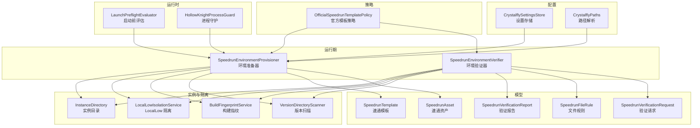

图表来源
- [OfficialSpeedrunTemplatePolicy.cs](file://src/Crystalfly.Core/Speedrun/OfficialSpeedrunTemplatePolicy.cs)
- [SpeedrunEnvironmentProvisioner.cs](file://src/Crystalfly.Core/Speedrun/SpeedrunEnvironmentProvisioner.cs)
- [SpeedrunEnvironmentVerifier.cs](file://src/Crystalfly.Core/Speedrun/SpeedrunEnvironmentVerifier.cs)
- [SpeedrunTemplate.cs](file://src/Crystalfly.Core/Models/SpeedrunTemplate.cs)
- [SpeedrunFileRule.cs](file://src/Crystalfly.Core/Models/SpeedrunFileRule.cs)
- [SpeedrunAsset.cs](file://src/Crystalfly.Core/Models/SpeedrunAsset.cs)
- [SpeedrunVerificationRequest.cs](file://src/Crystalfly.Core/Speedrun/SpeedrunVerificationRequest.cs)
- [SpeedrunVerificationReport.cs](file://src/Crystalfly.Core/Models/SpeedrunVerificationReport.cs)
- [InstanceDirectory.cs](file://src/Crystalfly.Core/Instances/InstanceDirectory.cs)
- [LocalLowIsolationService.cs](file://src/Crystalfly.Core/LocalLow/LocalLowIsolationService.cs)
- [BuildFingerprintService.cs](file://src/Crystalfly.Core/Instances/BuildFingerprintService.cs)
- [VersionDirectoryScanner.cs](file://src/Crystalfly.Core/Instances/VersionDirectoryScanner.cs)
- [LaunchPreflightEvaluator.cs](file://src/Crystalfly.Core/Runtime/LaunchPreflightEvaluator.cs)
- [HollowKnightProcessGuard.cs](file://src/Crystalfly.Core/Runtime/HollowKnightProcessGuard.cs)
- [CrystalflySettingsStore.cs](file://src/Crystalfly.Core/Configuration/CrystalflySettingsStore.cs)
- [CrystalflyPaths.cs](file://src/Crystalfly.Core/Configuration/CrystalflyPaths.cs)

章节来源
- [OfficialSpeedrunTemplatePolicy.cs](file://src/Crystalfly.Core/Speedrun/OfficialSpeedrunTemplatePolicy.cs)
- [SpeedrunEnvironmentProvisioner.cs](file://src/Crystalfly.Core/Speedrun/SpeedrunEnvironmentProvisioner.cs)
- [SpeedrunEnvironmentVerifier.cs](file://src/Crystalfly.Core/Speedrun/SpeedrunEnvironmentVerifier.cs)
- [SpeedrunTemplate.cs](file://src/Crystalfly.Core/Models/SpeedrunTemplate.cs)
- [SpeedrunFileRule.cs](file://src/Crystalfly.Core/Models/SpeedrunFileRule.cs)
- [SpeedrunAsset.cs](file://src/Crystalfly.Core/Models/SpeedrunAsset.cs)
- [SpeedrunVerificationRequest.cs](file://src/Crystalfly.Core/Speedrun/SpeedrunVerificationRequest.cs)
- [SpeedrunVerificationReport.cs](file://src/Crystalfly.Core/Models/SpeedrunVerificationReport.cs)
- [InstanceDirectory.cs](file://src/Crystalfly.Core/Instances/InstanceDirectory.cs)
- [LocalLowIsolationService.cs](file://src/Crystalfly.Core/LocalLow/LocalLowIsolationService.cs)
- [BuildFingerprintService.cs](file://src/Crystalfly.Core/Instances/BuildFingerprintService.cs)
- [VersionDirectoryScanner.cs](file://src/Crystalfly.Core/Instances/VersionDirectoryScanner.cs)
- [LaunchPreflightEvaluator.cs](file://src/Crystalfly.Core/Runtime/LaunchPreflightEvaluator.cs)
- [HollowKnightProcessGuard.cs](file://src/Crystalfly.Core/Runtime/HollowKnightProcessGuard.cs)
- [CrystalflySettingsStore.cs](file://src/Crystalfly.Core/Configuration/CrystalflySettingsStore.cs)
- [CrystalflyPaths.cs](file://src/Crystalfly.Core/Configuration/CrystalflyPaths.cs)

## 核心组件
- 官方速通模板策略：提供默认模板选择与约束，保证速通环境符合官方规范
- 环境准备器：基于模板与设置，完成速通环境的初始化、清理与资源注入
- 环境验证器：依据文件规则对速通环境进行完整性与合规性校验，并生成报告
- 模型与数据：模板、规则、资产、请求与报告的结构化定义
- 实例与隔离：通过实例目录与 LocalLow 隔离，确保速通环境独立且可复现
- 运行时守护：启动前评估与进程守护，防止外部干扰影响速通结果

章节来源
- [OfficialSpeedrunTemplatePolicy.cs](file://src/Crystalfly.Core/Speedrun/OfficialSpeedrunTemplatePolicy.cs)
- [SpeedrunEnvironmentProvisioner.cs](file://src/Crystalfly.Core/Speedrun/SpeedrunEnvironmentProvisioner.cs)
- [SpeedrunEnvironmentVerifier.cs](file://src/Crystalfly.Core/Speedrun/SpeedrunEnvironmentVerifier.cs)
- [SpeedrunTemplate.cs](file://src/Crystalfly.Core/Models/SpeedrunTemplate.cs)
- [SpeedrunFileRule.cs](file://src/Crystalfly.Core/Models/SpeedrunFileRule.cs)
- [SpeedrunAsset.cs](file://src/Crystalfly.Core/Models/SpeedrunAsset.cs)
- [SpeedrunVerificationRequest.cs](file://src/Crystalfly.Core/Speedrun/SpeedrunVerificationRequest.cs)
- [SpeedrunVerificationReport.cs](file://src/Crystalfly.Core/Models/SpeedrunVerificationReport.cs)
- [InstanceDirectory.cs](file://src/Crystalfly.Core/Instances/InstanceDirectory.cs)
- [LocalLowIsolationService.cs](file://src/Crystalfly.Core/LocalLow/LocalLowIsolationService.cs)
- [BuildFingerprintService.cs](file://src/Crystalfly.Core/Instances/BuildFingerprintService.cs)
- [VersionDirectoryScanner.cs](file://src/Crystalfly.Core/Instances/VersionDirectoryScanner.cs)
- [LaunchPreflightEvaluator.cs](file://src/Crystalfly.Core/Runtime/LaunchPreflightEvaluator.cs)
- [HollowKnightProcessGuard.cs](file://src/Crystalfly.Core/Runtime/HollowKnightProcessGuard.cs)
- [CrystalflySettingsStore.cs](file://src/Crystalfly.Core/Configuration/CrystalflySettingsStore.cs)
- [CrystalflyPaths.cs](file://src/Crystalfly.Core/Configuration/CrystalflyPaths.cs)

## 架构总览
下图展示从“模板策略”到“环境准备与验证”，再到“报告输出”的整体流程，以及与实例和运行时守护的交互。

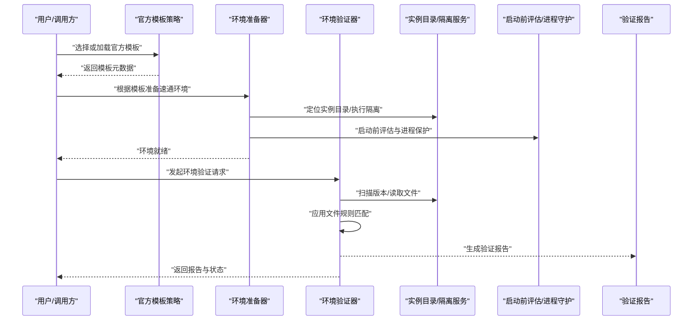

图表来源
- [OfficialSpeedrunTemplatePolicy.cs](file://src/Crystalfly.Core/Speedrun/OfficialSpeedrunTemplatePolicy.cs)
- [SpeedrunEnvironmentProvisioner.cs](file://src/Crystalfly.Core/Speedrun/SpeedrunEnvironmentProvisioner.cs)
- [SpeedrunEnvironmentVerifier.cs](file://src/Crystalfly.Core/Speedrun/SpeedrunEnvironmentVerifier.cs)
- [InstanceDirectory.cs](file://src/Crystalfly.Core/Instances/InstanceDirectory.cs)
- [LocalLowIsolationService.cs](file://src/Crystalfly.Core/LocalLow/LocalLowIsolationService.cs)
- [LaunchPreflightEvaluator.cs](file://src/Crystalfly.Core/Runtime/LaunchPreflightEvaluator.cs)
- [HollowKnightProcessGuard.cs](file://src/Crystalfly.Core/Runtime/HollowKnightProcessGuard.cs)
- [SpeedrunVerificationReport.cs](file://src/Crystalfly.Core/Models/SpeedrunVerificationReport.cs)

## 详细组件分析

### 官方速通模板策略
- 职责：提供官方认可的模板集合与选择逻辑，确保速通环境满足官方规则
- 关键点：
  - 模板元数据包含目标版本、必要资产、文件规则集合等
  - 策略会过滤不兼容的模板（如版本不匹配）
  - 对外暴露统一的模板查询接口，供准备器与验证器使用

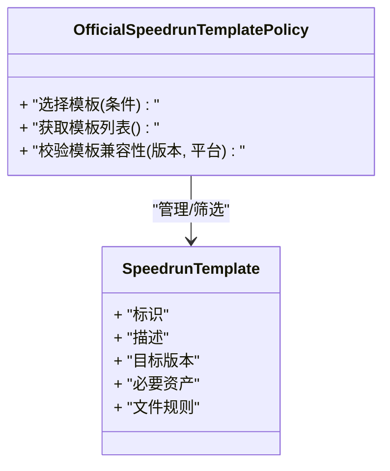

图表来源
- [OfficialSpeedrunTemplatePolicy.cs](file://src/Crystalfly.Core/Speedrun/OfficialSpeedrunTemplatePolicy.cs)
- [SpeedrunTemplate.cs](file://src/Crystalfly.Core/Models/SpeedrunTemplate.cs)

章节来源
- [OfficialSpeedrunTemplatePolicy.cs](file://src/Crystalfly.Core/Speedrun/OfficialSpeedrunTemplatePolicy.cs)
- [SpeedrunTemplate.cs](file://src/Crystalfly.Core/Models/SpeedrunTemplate.cs)

### 环境准备器
- 职责：根据模板与设置，完成速通环境的初始化、清理与资源注入
- 关键点：
  - 解析实例目录与 LocalLow 隔离路径，确保速通环境独立
  - 执行启动前评估，阻止冲突进程
  - 按模板要求注入必要资产（如白名单文件、配置文件）
  - 记录环境指纹，便于后续验证与复现

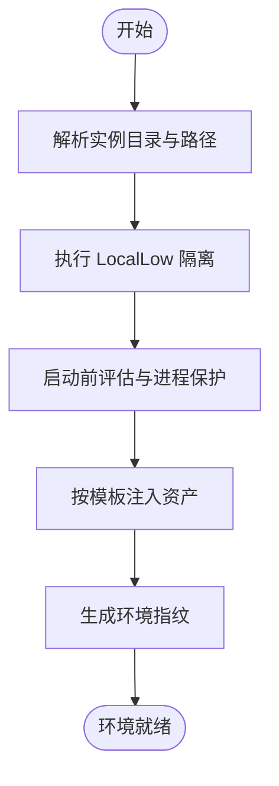

图表来源
- [SpeedrunEnvironmentProvisioner.cs](file://src/Crystalfly.Core/Speedrun/SpeedrunEnvironmentProvisioner.cs)
- [InstanceDirectory.cs](file://src/Crystalfly.Core/Instances/InstanceDirectory.cs)
- [LocalLowIsolationService.cs](file://src/Crystalfly.Core/LocalLow/LocalLowIsolationService.cs)
- [LaunchPreflightEvaluator.cs](file://src/Crystalfly.Core/Runtime/LaunchPreflightEvaluator.cs)
- [HollowKnightProcessGuard.cs](file://src/Crystalfly.Core/Runtime/HollowKnightProcessGuard.cs)
- [CrystalflyPaths.cs](file://src/Crystalfly.Core/Configuration/CrystalflyPaths.cs)
- [CrystalflySettingsStore.cs](file://src/Crystalfly.Core/Configuration/CrystalflySettingsStore.cs)

章节来源
- [SpeedrunEnvironmentProvisioner.cs](file://src/Crystalfly.Core/Speedrun/SpeedrunEnvironmentProvisioner.cs)
- [InstanceDirectory.cs](file://src/Crystalfly.Core/Instances/InstanceDirectory.cs)
- [LocalLowIsolationService.cs](file://src/Crystalfly.Core/LocalLow/LocalLowIsolationService.cs)
- [LaunchPreflightEvaluator.cs](file://src/Crystalfly.Core/Runtime/LaunchPreflightEvaluator.cs)
- [HollowKnightProcessGuard.cs](file://src/Crystalfly.Core/Runtime/HollowKnightProcessGuard.cs)
- [CrystalflyPaths.cs](file://src/Crystalfly.Core/Configuration/CrystalflyPaths.cs)
- [CrystalflySettingsStore.cs](file://src/Crystalfly.Core/Configuration/CrystalflySettingsStore.cs)

### 环境验证器
- 职责：依据文件规则对速通环境进行完整性与合规性校验，并生成报告
- 关键点：
  - 接收验证请求（包含模板、目标实例、规则范围等）
  - 扫描版本目录与关键文件，计算指纹
  - 应用文件规则匹配算法，判定通过/失败及原因
  - 汇总结果并输出结构化验证报告

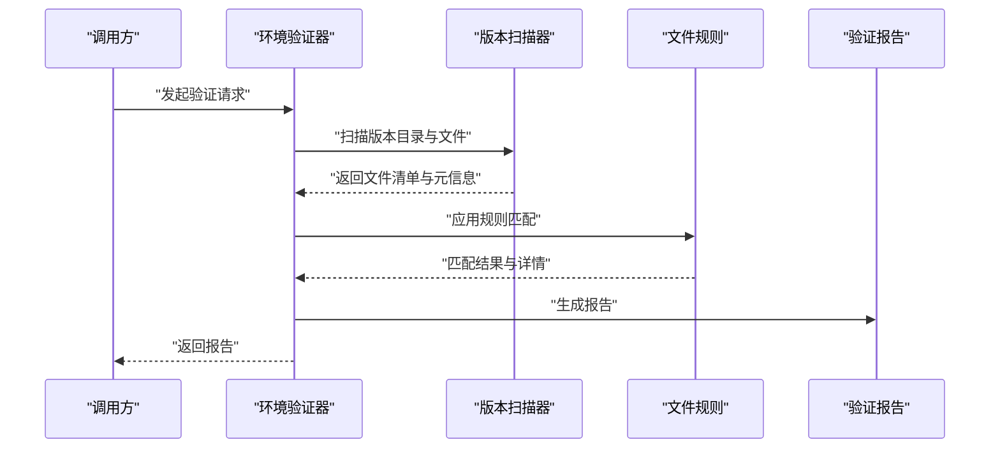

图表来源
- [SpeedrunEnvironmentVerifier.cs](file://src/Crystalfly.Core/Speedrun/SpeedrunEnvironmentVerifier.cs)
- [SpeedrunVerificationRequest.cs](file://src/Crystalfly.Core/Speedrun/SpeedrunVerificationRequest.cs)
- [SpeedrunFileRule.cs](file://src/Crystalfly.Core/Models/SpeedrunFileRule.cs)
- [VersionDirectoryScanner.cs](file://src/Crystalfly.Core/Instances/VersionDirectoryScanner.cs)
- [SpeedrunVerificationReport.cs](file://src/Crystalfly.Core/Models/SpeedrunVerificationReport.cs)

章节来源
- [SpeedrunEnvironmentVerifier.cs](file://src/Crystalfly.Core/Speedrun/SpeedrunEnvironmentVerifier.cs)
- [SpeedrunVerificationRequest.cs](file://src/Crystalfly.Core/Speedrun/SpeedrunVerificationRequest.cs)
- [SpeedrunFileRule.cs](file://src/Crystalfly.Core/Models/SpeedrunFileRule.cs)
- [VersionDirectoryScanner.cs](file://src/Crystalfly.Core/Instances/VersionDirectoryScanner.cs)
- [SpeedrunVerificationReport.cs](file://src/Crystalfly.Core/Models/SpeedrunVerificationReport.cs)

### 模型与数据
- 速通模板：定义目标版本、必要资产、文件规则集合等
- 文件规则：定义匹配模式、允许/禁止集合、校验策略
- 速通资产：定义需要注入或校验的资源包与来源
- 验证请求：封装模板、实例、规则范围与附加参数
- 验证报告：汇总通过/失败项、错误详情、环境指纹与时间戳

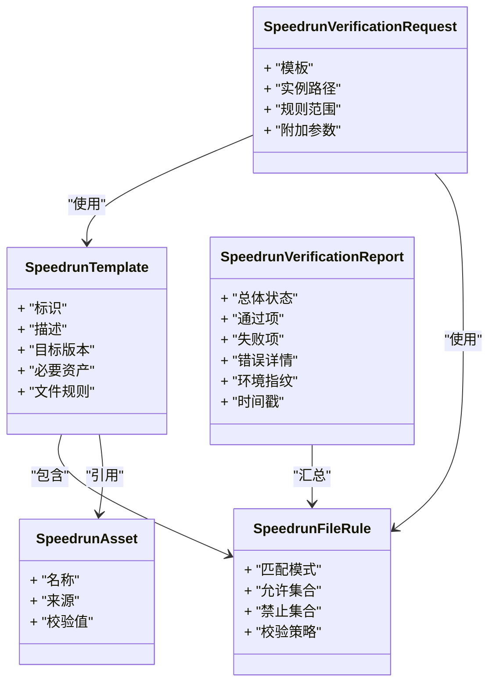

图表来源
- [SpeedrunTemplate.cs](file://src/Crystalfly.Core/Models/SpeedrunTemplate.cs)
- [SpeedrunFileRule.cs](file://src/Crystalfly.Core/Models/SpeedrunFileRule.cs)
- [SpeedrunAsset.cs](file://src/Crystalfly.Core/Models/SpeedrunAsset.cs)
- [SpeedrunVerificationRequest.cs](file://src/Crystalfly.Core/Speedrun/SpeedrunVerificationRequest.cs)
- [SpeedrunVerificationReport.cs](file://src/Crystalfly.Core/Models/SpeedrunVerificationReport.cs)

章节来源
- [SpeedrunTemplate.cs](file://src/Crystalfly.Core/Models/SpeedrunTemplate.cs)
- [SpeedrunFileRule.cs](file://src/Crystalfly.Core/Models/SpeedrunFileRule.cs)
- [SpeedrunAsset.cs](file://src/Crystalfly.Core/Models/SpeedrunAsset.cs)
- [SpeedrunVerificationRequest.cs](file://src/Crystalfly.Core/Speedrun/SpeedrunVerificationRequest.cs)
- [SpeedrunVerificationReport.cs](file://src/Crystalfly.Core/Models/SpeedrunVerificationReport.cs)

### 与游戏实例的集成与隔离
- 实例目录：用于定位游戏安装与版本目录，作为速通环境的根
- LocalLow 隔离：将用户数据与缓存隔离至独立路径，避免污染主环境
- 构建指纹：记录关键文件哈希与版本信息，确保可复现
- 版本扫描：枚举版本目录中的文件与元信息，支撑规则匹配

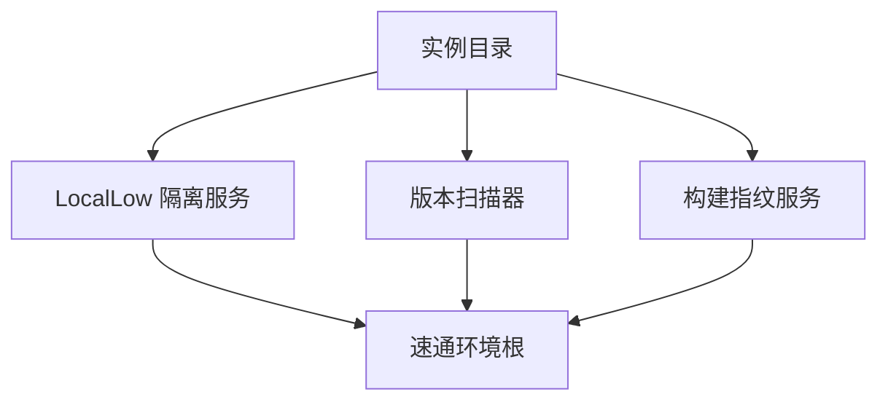

图表来源
- [InstanceDirectory.cs](file://src/Crystalfly.Core/Instances/InstanceDirectory.cs)
- [LocalLowIsolationService.cs](file://src/Crystalfly.Core/LocalLow/LocalLowIsolationService.cs)
- [BuildFingerprintService.cs](file://src/Crystalfly.Core/Instances/BuildFingerprintService.cs)
- [VersionDirectoryScanner.cs](file://src/Crystalfly.Core/Instances/VersionDirectoryScanner.cs)

章节来源
- [InstanceDirectory.cs](file://src/Crystalfly.Core/Instances/InstanceDirectory.cs)
- [LocalLowIsolationService.cs](file://src/Crystalfly.Core/LocalLow/LocalLowIsolationService.cs)
- [BuildFingerprintService.cs](file://src/Crystalfly.Core/Instances/BuildFingerprintService.cs)
- [VersionDirectoryScanner.cs](file://src/Crystalfly.Core/Instances/VersionDirectoryScanner.cs)

### 运行时守护与启动前评估
- 启动前评估：在速通环境启动前检查前置条件（如进程占用、依赖缺失）
- 进程守护：监控并阻止可能干扰速通的进程，确保环境纯净

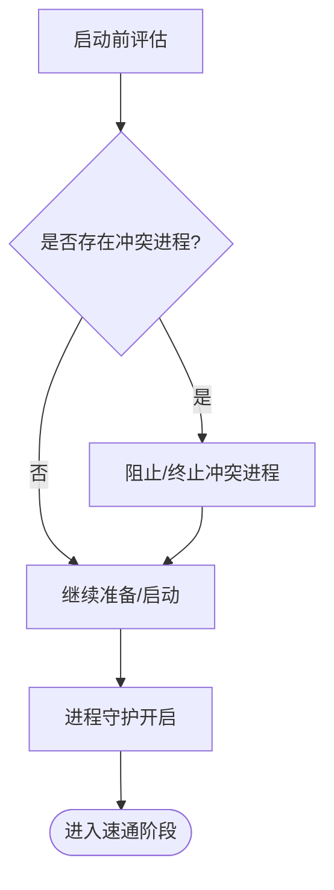

图表来源
- [LaunchPreflightEvaluator.cs](file://src/Crystalfly.Core/Runtime/LaunchPreflightEvaluator.cs)
- [HollowKnightProcessGuard.cs](file://src/Crystalfly.Core/Runtime/HollowKnightProcessGuard.cs)

章节来源
- [LaunchPreflightEvaluator.cs](file://src/Crystalfly.Core/Runtime/LaunchPreflightEvaluator.cs)
- [HollowKnightProcessGuard.cs](file://src/Crystalfly.Core/Runtime/HollowKnightProcessGuard.cs)

### 文件规则匹配算法
- 输入：文件清单（来自版本扫描）、文件规则集合（来自模板）
- 处理：
  - 按匹配模式筛选候选文件
  - 应用允许/禁止集合进行二次过滤
  - 执行校验策略（存在性、哈希、大小、权限等）
- 输出：通过/失败项与详细原因，供报告聚合

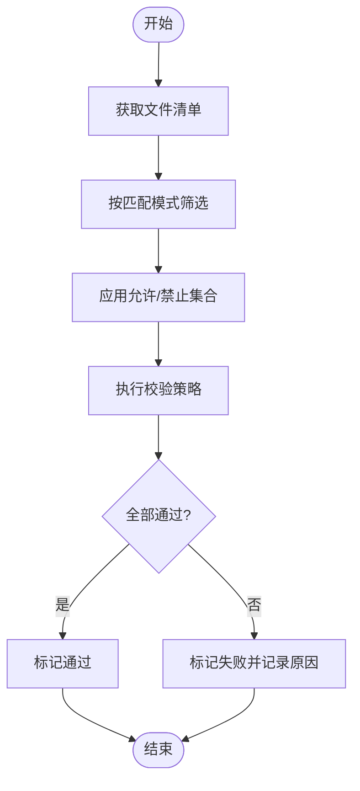

图表来源
- [SpeedrunEnvironmentVerifier.cs](file://src/Crystalfly.Core/Speedrun/SpeedrunEnvironmentVerifier.cs)
- [SpeedrunFileRule.cs](file://src/Crystalfly.Core/Models/SpeedrunFileRule.cs)
- [VersionDirectoryScanner.cs](file://src/Crystalfly.Core/Instances/VersionDirectoryScanner.cs)

章节来源
- [SpeedrunEnvironmentVerifier.cs](file://src/Crystalfly.Core/Speedrun/SpeedrunEnvironmentVerifier.cs)
- [SpeedrunFileRule.cs](file://src/Crystalfly.Core/Models/SpeedrunFileRule.cs)
- [VersionDirectoryScanner.cs](file://src/Crystalfly.Core/Instances/VersionDirectoryScanner.cs)

### 验证报告格式与内容结构
- 总体状态：通过/失败/部分通过
- 通过项：列出所有通过的文件与规则
- 失败项：列出失败的文件与具体原因
- 错误详情：异常类型、消息、堆栈摘要（如有）
- 环境指纹：关键文件哈希、版本信息与时间戳
- 附加信息：模板标识、实例路径、规则范围等

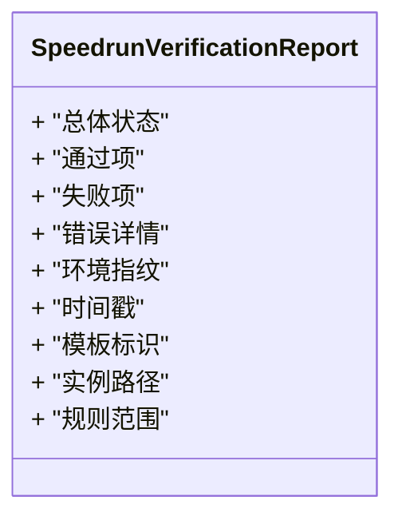

图表来源
- [SpeedrunVerificationReport.cs](file://src/Crystalfly.Core/Models/SpeedrunVerificationReport.cs)

章节来源
- [SpeedrunVerificationReport.cs](file://src/Crystalfly.Core/Models/SpeedrunVerificationReport.cs)

### 使用示例：创建自定义速通模板与验证规则
- 步骤概览：
  - 定义模板元数据（目标版本、描述、必要资产）
  - 编写文件规则（匹配模式、允许/禁止集合、校验策略）
  - 注册模板策略（可选，若需纳入官方策略集）
  - 使用环境准备器初始化速通环境
  - 使用环境验证器执行验证并生成报告
- 注意事项：
  - 确保模板与目标版本兼容
  - 规则应覆盖关键文件与配置
  - 报告需包含足够的环境指纹以便复现

章节来源
- [SpeedrunTemplate.cs](file://src/Crystalfly.Core/Models/SpeedrunTemplate.cs)
- [SpeedrunFileRule.cs](file://src/Crystalfly.Core/Models/SpeedrunFileRule.cs)
- [OfficialSpeedrunTemplatePolicy.cs](file://src/Crystalfly.Core/Speedrun/OfficialSpeedrunTemplatePolicy.cs)
- [SpeedrunEnvironmentProvisioner.cs](file://src/Crystalfly.Core/Speedrun/SpeedrunEnvironmentProvisioner.cs)
- [SpeedrunEnvironmentVerifier.cs](file://src/Crystalfly.Core/Speedrun/SpeedrunEnvironmentVerifier.cs)
- [SpeedrunVerificationReport.cs](file://src/Crystalfly.Core/Models/SpeedrunVerificationReport.cs)

## 依赖关系分析
- 组件耦合：
  - 官方模板策略依赖模板模型
  - 环境准备器依赖实例目录、隔离服务、路径与设置
  - 环境验证器依赖版本扫描器、文件规则与报告模型
- 外部依赖：
  - 文件系统访问（实例目录、版本目录）
  - 进程管理与守护（运行时守护）
  - 配置与路径解析（设置存储与路径服务）

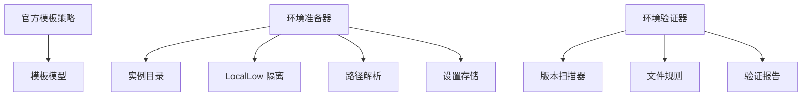

图表来源
- [OfficialSpeedrunTemplatePolicy.cs](file://src/Crystalfly.Core/Speedrun/OfficialSpeedrunTemplatePolicy.cs)
- [SpeedrunTemplate.cs](file://src/Crystalfly.Core/Models/SpeedrunTemplate.cs)
- [SpeedrunEnvironmentProvisioner.cs](file://src/Crystalfly.Core/Speedrun/SpeedrunEnvironmentProvisioner.cs)
- [InstanceDirectory.cs](file://src/Crystalfly.Core/Instances/InstanceDirectory.cs)
- [LocalLowIsolationService.cs](file://src/Crystalfly.Core/LocalLow/LocalLowIsolationService.cs)
- [CrystalflyPaths.cs](file://src/Crystalfly.Core/Configuration/CrystalflyPaths.cs)
- [CrystalflySettingsStore.cs](file://src/Crystalfly.Core/Configuration/CrystalflySettingsStore.cs)
- [SpeedrunEnvironmentVerifier.cs](file://src/Crystalfly.Core/Speedrun/SpeedrunEnvironmentVerifier.cs)
- [VersionDirectoryScanner.cs](file://src/Crystalfly.Core/Instances/VersionDirectoryScanner.cs)
- [SpeedrunFileRule.cs](file://src/Crystalfly.Core/Models/SpeedrunFileRule.cs)
- [SpeedrunVerificationReport.cs](file://src/Crystalfly.Core/Models/SpeedrunVerificationReport.cs)

章节来源
- [OfficialSpeedrunTemplatePolicy.cs](file://src/Crystalfly.Core/Speedrun/OfficialSpeedrunTemplatePolicy.cs)
- [SpeedrunTemplate.cs](file://src/Crystalfly.Core/Models/SpeedrunTemplate.cs)
- [SpeedrunEnvironmentProvisioner.cs](file://src/Crystalfly.Core/Speedrun/SpeedrunEnvironmentProvisioner.cs)
- [InstanceDirectory.cs](file://src/Crystalfly.Core/Instances/InstanceDirectory.cs)
- [LocalLowIsolationService.cs](file://src/Crystalfly.Core/LocalLow/LocalLowIsolationService.cs)
- [CrystalflyPaths.cs](file://src/Crystalfly.Core/Configuration/CrystalflyPaths.cs)
- [CrystalflySettingsStore.cs](file://src/Crystalfly.Core/Configuration/CrystalflySettingsStore.cs)
- [SpeedrunEnvironmentVerifier.cs](file://src/Crystalfly.Core/Speedrun/SpeedrunEnvironmentVerifier.cs)
- [VersionDirectoryScanner.cs](file://src/Crystalfly.Core/Instances/VersionDirectoryScanner.cs)
- [SpeedrunFileRule.cs](file://src/Crystalfly.Core/Models/SpeedrunFileRule.cs)
- [SpeedrunVerificationReport.cs](file://src/Crystalfly.Core/Models/SpeedrunVerificationReport.cs)

## 性能考虑
- 文件扫描优化：
  - 按需扫描，避免全量遍历大目录
  - 并行读取与校验，提升吞吐
- 规则匹配优化：
  - 预编译匹配模式，减少重复开销
  - 短路评估，尽早返回失败结果
- 报告生成优化：
  - 增量更新报告项，避免重复计算
  - 压缩环境指纹，降低存储与传输成本

[本节为通用指导，无需特定文件来源]

## 故障排查指南
- 常见失败场景：
  - 模板与版本不兼容：检查模板目标版本与实际版本是否一致
  - 文件缺失或损坏：查看报告中的失败项与错误详情，重新注入必要资产
  - 进程冲突：确认启动前评估与进程守护是否生效，必要时手动终止冲突进程
  - 隔离失败：检查 LocalLow 隔离路径权限与可用性
- 诊断建议：
  - 启用更详细的日志输出（由上层调用方控制）
  - 对比环境指纹，定位变更点
  - 逐步缩小规则范围，定位问题规则

章节来源
- [SpeedrunEnvironmentVerifier.cs](file://src/Crystalfly.Core/Speedrun/SpeedrunEnvironmentVerifier.cs)
- [LaunchPreflightEvaluator.cs](file://src/Crystalfly.Core/Runtime/LaunchPreflightEvaluator.cs)
- [HollowKnightProcessGuard.cs](file://src/Crystalfly.Core/Runtime/HollowKnightProcessGuard.cs)
- [LocalLowIsolationService.cs](file://src/Crystalfly.Core/LocalLow/LocalLowIsolationService.cs)
- [SpeedrunVerificationReport.cs](file://src/Crystalfly.Core/Models/SpeedrunVerificationReport.cs)

## 结论
速通支持系统以“模板—环境—验证—报告”为主线，结合实例与隔离机制以及运行时守护，提供了稳定、可复现的速通环境管理能力。通过官方模板策略与灵活的文件规则匹配算法，既能保障合规性，又支持扩展自定义模板与规则。建议在部署时关注版本兼容、隔离权限与进程守护，以获得最佳体验。

[本节为总结，无需特定文件来源]

## 附录
- 术语表：
  - 速通模板：定义目标版本、必要资产与文件规则的集合
  - 文件规则：用于匹配与校验文件的模式与策略
  - 环境指纹：关键文件哈希与版本信息的摘要
  - 验证报告：环境验证结果的汇总与详情
- 参考路径：
  - 模型定义：参见 Models 下的相关文件
  - 策略实现：参见 Speedrun 下的策略与服务
  - 实例与隔离：参见 Instances 与 LocalLow 下的服务

[本节为补充说明，无需特定文件来源]