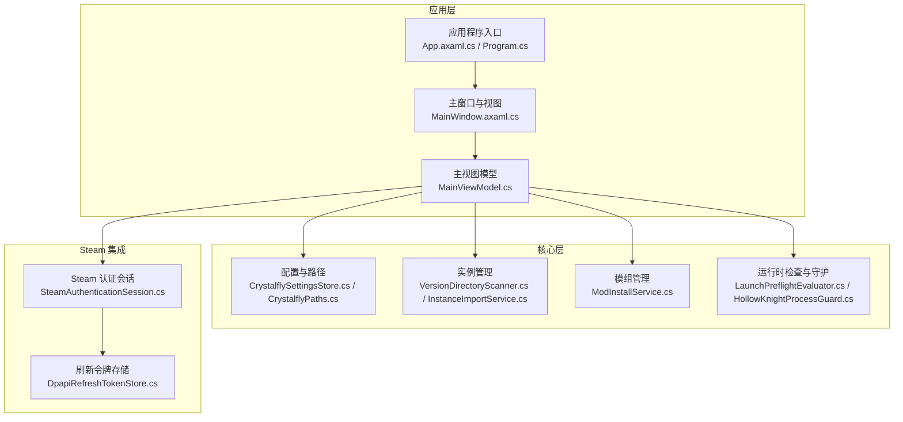
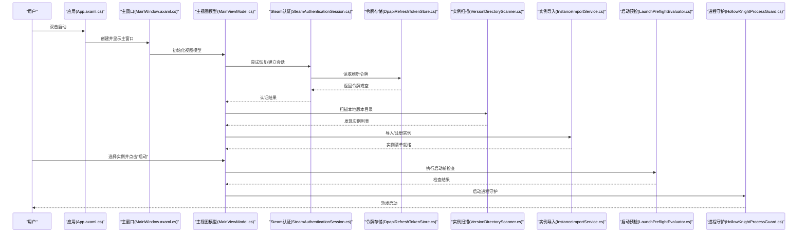
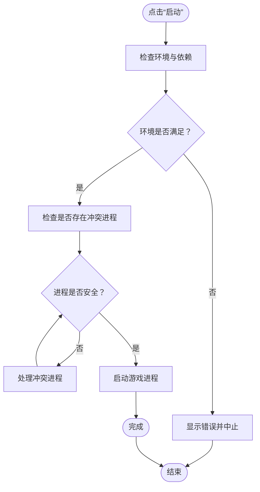
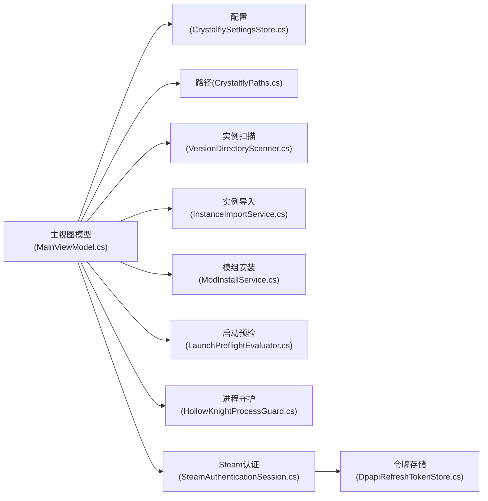

# 快速开始

<cite>
**本文引用的文件**   
- [Program.cs](file://src/Crystalfly.App/Program.cs)
- [App.axaml.cs](file://src/Crystalfly.App/App.axaml.cs)
- [MainWindow.axaml.cs](file://src/Crystalfly.App/Views/MainWindow.axaml.cs)
- [MainViewModel.cs](file://src/Crystalfly.App/ViewModels/MainViewModel.cs)
- [CrystalflySettingsStore.cs](file://src/Crystalfly.Core/Configuration/CrystalflySettingsStore.cs)
- [CrystalflyPaths.cs](file://src/Crystalfly.Core/Configuration/CrystalflyPaths.cs)
- [SteamAuthenticationSession.cs](file://src/Crystalfly.Steam/Authentication/SteamAuthenticationSession.cs)
- [DpapiRefreshTokenStore.cs](file://src/Crystalfly.Steam/Security/DpapiRefreshTokenStore.cs)
- [VersionDirectoryScanner.cs](file://src/Crystalfly.Core/Instances/VersionDirectoryScanner.cs)
- [InstanceImportService.cs](file://src/Crystalfly.Core/Instances/InstanceImportService.cs)
- [ModInstallService.cs](file://src/Crystalfly.Core/Mods/ModInstallService.cs)
- [LaunchPreflightEvaluator.cs](file://src/Crystalfly.Core/Runtime/LaunchPreflightEvaluator.cs)
- [HollowKnightProcessGuard.cs](file://src/Crystalfly.Core/Runtime/HollowKnightProcessGuard.cs)
- [Crystalfly.iss](file://installer/Crystalfly.iss)
- [build-release.ps1](file://scripts/build-release.ps1)
</cite>

## 目录
1. [简介](#简介)
2. [项目结构](#项目结构)
3. [核心组件](#核心组件)
4. [架构总览](#架构总览)
5. [详细组件分析](#详细组件分析)
6. [依赖关系分析](#依赖关系分析)
7. [性能与体验建议](#性能与体验建议)
8. [故障排除指南](#故障排除指南)
9. [结论](#结论)
10. [附录：常见问题解答](#附录：常见问题解答)

## 简介
本指南面向首次接触 Crystalfly 的用户，帮助你在最短时间内完成安装、初始配置并成功运行游戏实例。你将了解：
- 系统要求与下载方式（安装包或源码构建）
- 安装步骤与验证方法
- 首次启动后的初始化流程（Steam 认证、扫描游戏实例、基础设置）
- 常见使用场景的快速操作（创建第一个实例、安装模组、启动游戏）
- 基本故障排除方法与常见问题解答

## 项目结构
Crystalfly 采用分层架构：UI 应用层负责交互与展示；Core 提供核心能力（配置、实例管理、模组管理、运行时检查等）；Steam 模块负责 Steam 集成（认证、下载）。

图表来源
- [Program.cs](file://src/Crystalfly.App/Program.cs)
- [App.axaml.cs](file://src/Crystalfly.App/App.axaml.cs)
- [MainWindow.axaml.cs](file://src/Crystalfly.App/Views/MainWindow.axaml.cs)
- [MainViewModel.cs](file://src/Crystalfly.App/ViewModels/MainViewModel.cs)
- [CrystalflySettingsStore.cs](file://src/Crystalfly.Core/Configuration/CrystalflySettingsStore.cs)
- [CrystalflyPaths.cs](file://src/Crystalfly.Core/Configuration/CrystalflyPaths.cs)
- [VersionDirectoryScanner.cs](file://src/Crystalfly.Core/Instances/VersionDirectoryScanner.cs)
- [InstanceImportService.cs](file://src/Crystalfly.Core/Instances/InstanceImportService.cs)
- [ModInstallService.cs](file://src/Crystalfly.Core/Mods/ModInstallService.cs)
- [LaunchPreflightEvaluator.cs](file://src/Crystalfly.Core/Runtime/LaunchPreflightEvaluator.cs)
- [HollowKnightProcessGuard.cs](file://src/Crystalfly.Core/Runtime/HollowKnightProcessGuard.cs)
- [SteamAuthenticationSession.cs](file://src/Crystalfly.Steam/Authentication/SteamAuthenticationSession.cs)
- [DpapiRefreshTokenStore.cs](file://src/Crystalfly.Steam/Security/DpapiRefreshTokenStore.cs)

章节来源
- [Program.cs](file://src/Crystalfly.App/Program.cs)
- [App.axaml.cs](file://src/Crystalfly.App/App.axaml.cs)
- [MainWindow.axaml.cs](file://src/Crystalfly.App/Views/MainWindow.axaml.cs)
- [MainViewModel.cs](file://src/Crystalfly.App/ViewModels/MainViewModel.cs)

## 核心组件
- 应用入口与生命周期
  - 程序入口负责初始化应用上下文与主窗口，随后进入消息循环。
  - 应用启动时加载主题、定位器与全局服务。
- 主界面与视图模型
  - 主窗口承载主要功能区域，视图模型协调配置、实例、模组与运行时状态。
- 配置与路径
  - 提供用户配置读写与关键路径解析（如应用数据目录、实例目录等）。
- Steam 集成
  - 提供 Steam 登录会话与刷新令牌持久化，用于访问 Steam 内容分发。
- 实例管理
  - 扫描本地版本目录、导入已有实例、维护实例元数据。
- 模组管理
  - 提供模组安装计划生成与执行、依赖修复等能力。
- 运行时检查与守护
  - 启动前预检环境、进程保护与冲突检测。

章节来源
- [App.axaml.cs](file://src/Crystalfly.App/App.axaml.cs)
- [MainWindow.axaml.cs](file://src/Crystalfly.App/Views/MainWindow.axaml.cs)
- [MainViewModel.cs](file://src/Crystalfly.App/ViewModels/MainViewModel.cs)
- [CrystalflySettingsStore.cs](file://src/Crystalfly.Core/Configuration/CrystalflySettingsStore.cs)
- [CrystalflyPaths.cs](file://src/Crystalfly.Core/Configuration/CrystalflyPaths.cs)
- [SteamAuthenticationSession.cs](file://src/Crystalfly.Steam/Authentication/SteamAuthenticationSession.cs)
- [DpapiRefreshTokenStore.cs](file://src/Crystalfly.Steam/Security/DpapiRefreshTokenStore.cs)
- [VersionDirectoryScanner.cs](file://src/Crystalfly.Core/Instances/VersionDirectoryScanner.cs)
- [InstanceImportService.cs](file://src/Crystalfly.Core/Instances/InstanceImportService.cs)
- [ModInstallService.cs](file://src/Crystalfly.Core/Mods/ModInstallService.cs)
- [LaunchPreflightEvaluator.cs](file://src/Crystalfly.Core/Runtime/LaunchPreflightEvaluator.cs)
- [HollowKnightProcessGuard.cs](file://src/Crystalfly.Core/Runtime/HollowKnightProcessGuard.cs)

## 架构总览
下图展示了从应用启动到首次运行的关键流程，包括认证、实例扫描、预检与启动。

图表来源
- [App.axaml.cs](file://src/Crystalfly.App/App.axaml.cs)
- [MainWindow.axaml.cs](file://src/Crystalfly.App/Views/MainWindow.axaml.cs)
- [MainViewModel.cs](file://src/Crystalfly.App/ViewModels/MainViewModel.cs)
- [SteamAuthenticationSession.cs](file://src/Crystalfly.Steam/Authentication/SteamAuthenticationSession.cs)
- [DpapiRefreshTokenStore.cs](file://src/Crystalfly.Steam/Security/DpapiRefreshTokenStore.cs)
- [VersionDirectoryScanner.cs](file://src/Crystalfly.Core/Instances/VersionDirectoryScanner.cs)
- [InstanceImportService.cs](file://src/Crystalfly.Core/Instances/InstanceImportService.cs)
- [LaunchPreflightEvaluator.cs](file://src/Crystalfly.Core/Runtime/LaunchPreflightEvaluator.cs)
- [HollowKnightProcessGuard.cs](file://src/Crystalfly.Core/Runtime/HollowKnightProcessGuard.cs)

## 详细组件分析

### 安装与系统要求
- 系统要求
  - 操作系统：Windows（基于安装包与 DPAPI 令牌存储的实现推断）
  - 运行时：.NET 桌面运行时（由 C# 项目结构与脚本推断）
  - 磁盘空间：预留足够空间以容纳游戏与模组
  - 网络：首次下载模组或更新时需要联网
- 下载方式
  - 安装包：通过官方发布渠道获取安装包（.exe/.msi），适合大多数用户
  - 源码构建：适合开发者或需要自定义构建的用户
- 安装过程
  - 安装包安装：运行安装程序，按向导完成安装；完成后在桌面或开始菜单找到快捷方式
  - 源码构建：克隆仓库后使用构建脚本生成可执行文件，再运行生成的应用
- 安装验证
  - 双击启动应用，若出现主窗口且无报错提示，则安装成功

章节来源
- [Crystalfly.iss](file://installer/Crystalfly.iss)
- [build-release.ps1](file://scripts/build-release.ps1)
- [DpapiRefreshTokenStore.cs](file://src/Crystalfly.Steam/Security/DpapiRefreshTokenStore.cs)

### 首次启动与初始配置
- 启动应用
  - 双击应用图标，进入主界面
- Steam 账户认证
  - 若未登录，应用将引导进行 Steam 登录与会话建立
  - 登录后刷新令牌将被安全存储，后续自动恢复会话
- 游戏实例扫描
  - 应用会扫描本地已安装的游戏版本目录，识别可用实例
  - 如发现新实例，会自动导入并注册到应用
- 基本设置
  - 可在设置中调整语言、下载路径、日志级别等常用选项

章节来源
- [App.axaml.cs](file://src/Crystalfly.App/App.axaml.cs)
- [MainWindow.axaml.cs](file://src/Crystalfly.App/Views/MainWindow.axaml.cs)
- [MainViewModel.cs](file://src/Crystalfly.App/ViewModels/MainViewModel.cs)
- [SteamAuthenticationSession.cs](file://src/Crystalfly.Steam/Authentication/SteamAuthenticationSession.cs)
- [DpapiRefreshTokenStore.cs](file://src/Crystalfly.Steam/Security/DpapiRefreshTokenStore.cs)
- [VersionDirectoryScanner.cs](file://src/Crystalfly.Core/Instances/VersionDirectoryScanner.cs)
- [InstanceImportService.cs](file://src/Crystalfly.Core/Instances/InstanceImportService.cs)
- [CrystalflySettingsStore.cs](file://src/Crystalfly.Core/Configuration/CrystalflySettingsStore.cs)
- [CrystalflyPaths.cs](file://src/Crystalfly.Core/Configuration/CrystalflyPaths.cs)

### 快速上手：创建第一个游戏实例
- 如果你已经通过 Steam 安装了游戏，应用通常会自动扫描并导入实例
- 如需手动导入：
  - 在主界面选择“导入实例”，指向游戏根目录
  - 确认导入成功后，实例列表中会出现该实例
- 预期结果
  - 实例名称、版本信息正确显示，可点击“启动”

章节来源
- [VersionDirectoryScanner.cs](file://src/Crystalfly.Core/Instances/VersionDirectoryScanner.cs)
- [InstanceImportService.cs](file://src/Crystalfly.Core/Instances/InstanceImportService.cs)
- [MainViewModel.cs](file://src/Crystalfly.App/ViewModels/MainViewModel.cs)

### 快速上手：安装第一个模组
- 打开模组市场或本地模组源
- 搜索目标模组，查看依赖说明
- 点击“安装”，应用会生成安装计划并执行
- 预期结果
  - 模组出现在已安装列表，依赖关系满足，可正常加载

章节来源
- [ModInstallService.cs](file://src/Crystalfly.Core/Mods/ModInstallService.cs)
- [MainViewModel.cs](file://src/Crystalfly.App/ViewModels/MainViewModel.cs)

### 快速上手：启动游戏
- 在实例列表中选择目标实例
- 点击“启动”，应用会执行启动前检查并拉起游戏进程
- 预期结果
  - 游戏窗口弹出，模组生效，运行稳定

章节来源
- [LaunchPreflightEvaluator.cs](file://src/Crystalfly.Core/Runtime/LaunchPreflightEvaluator.cs)
- [HollowKnightProcessGuard.cs](file://src/Crystalfly.Core/Runtime/HollowKnightProcessGuard.cs)
- [MainViewModel.cs](file://src/Crystalfly.App/ViewModels/MainViewModel.cs)

#### 启动前检查流程图

图表来源
- [LaunchPreflightEvaluator.cs](file://src/Crystalfly.Core/Runtime/LaunchPreflightEvaluator.cs)
- [HollowKnightProcessGuard.cs](file://src/Crystalfly.Core/Runtime/HollowKnightProcessGuard.cs)

## 依赖关系分析
- 组件耦合
  - 主视图模型集中协调配置、实例、模组与运行时检查，属于高内聚的编排层
  - Steam 认证与令牌存储解耦，便于替换存储实现
- 外部依赖
  - Steam 客户端与服务：用于认证与内容分发
  - Windows DPAPI：用于安全存储刷新令牌
- 潜在风险
  - 若 Steam 服务不可用或网络受限，可能导致认证失败或下载缓慢
  - 若实例目录权限不足，可能导致导入失败

图表来源
- [MainViewModel.cs](file://src/Crystalfly.App/ViewModels/MainViewModel.cs)
- [CrystalflySettingsStore.cs](file://src/Crystalfly.Core/Configuration/CrystalflySettingsStore.cs)
- [CrystalflyPaths.cs](file://src/Crystalfly.Core/Configuration/CrystalflyPaths.cs)
- [VersionDirectoryScanner.cs](file://src/Crystalfly.Core/Instances/VersionDirectoryScanner.cs)
- [InstanceImportService.cs](file://src/Crystalfly.Core/Instances/InstanceImportService.cs)
- [ModInstallService.cs](file://src/Crystalfly.Core/Mods/ModInstallService.cs)
- [LaunchPreflightEvaluator.cs](file://src/Crystalfly.Core/Runtime/LaunchPreflightEvaluator.cs)
- [HollowKnightProcessGuard.cs](file://src/Crystalfly.Core/Runtime/HollowKnightProcessGuard.cs)
- [SteamAuthenticationSession.cs](file://src/Crystalfly.Steam/Authentication/SteamAuthenticationSession.cs)
- [DpapiRefreshTokenStore.cs](file://src/Crystalfly.Steam/Security/DpapiRefreshTokenStore.cs)

## 性能与体验建议
- 首次启动较慢属正常现象，涉及认证、扫描与索引
- 将下载路径设置在高速磁盘上可减少等待时间
- 避免同时开启多个大型模组包，降低 I/O 压力
- 保持 Steam 客户端在线以提升下载稳定性

[本节为通用建议，不直接分析具体文件]

## 故障排除指南
- 无法登录 Steam
  - 检查网络连接与 Steam 客户端状态
  - 清除本地刷新令牌缓存后重试
- 找不到游戏实例
  - 确认游戏安装路径正确
  - 重新执行实例扫描或手动导入
- 启动失败或闪退
  - 查看启动前检查结果，解决环境或依赖问题
  - 关闭可能冲突的进程后再试
- 模组安装失败
  - 检查依赖是否满足，必要时先安装前置模组
  - 清理损坏的模组缓存后重试

章节来源
- [SteamAuthenticationSession.cs](file://src/Crystalfly.Steam/Authentication/SteamAuthenticationSession.cs)
- [DpapiRefreshTokenStore.cs](file://src/Crystalfly.Steam/Security/DpapiRefreshTokenStore.cs)
- [VersionDirectoryScanner.cs](file://src/Crystalfly.Core/Instances/VersionDirectoryScanner.cs)
- [InstanceImportService.cs](file://src/Crystalfly.Core/Instances/InstanceImportService.cs)
- [LaunchPreflightEvaluator.cs](file://src/Crystalfly.Core/Runtime/LaunchPreflightEvaluator.cs)
- [HollowKnightProcessGuard.cs](file://src/Crystalfly.Core/Runtime/HollowKnightProcessGuard.cs)
- [ModInstallService.cs](file://src/Crystalfly.Core/Mods/ModInstallService.cs)

## 结论
通过以上步骤，你应已完成 Crystalfly 的安装、初始配置与首次运行。建议熟悉实例管理与模组安装的基本流程，并根据自身需求逐步扩展模组组合。遇到问题时，优先参考故障排除指南与日志输出。

[本节为总结性内容，不直接分析具体文件]

## 附录：常见问题解答
- 问：我需要安装 .NET 吗？
  - 答：根据项目结构，建议使用包含所需运行时的安装包；源码构建需自行准备 .NET 桌面运行时。
- 问：为什么没有自动发现我的游戏？
  - 答：请确认游戏安装位置符合预期，或在设置中指定正确的实例目录。
- 问：如何切换语言？
  - 答：在设置中更改语言选项并重启应用。
- 问：模组安装后未生效？
  - 答：检查依赖是否完整，必要时重新安装或修复依赖。

[本节为概念性内容，不直接分析具体文件]