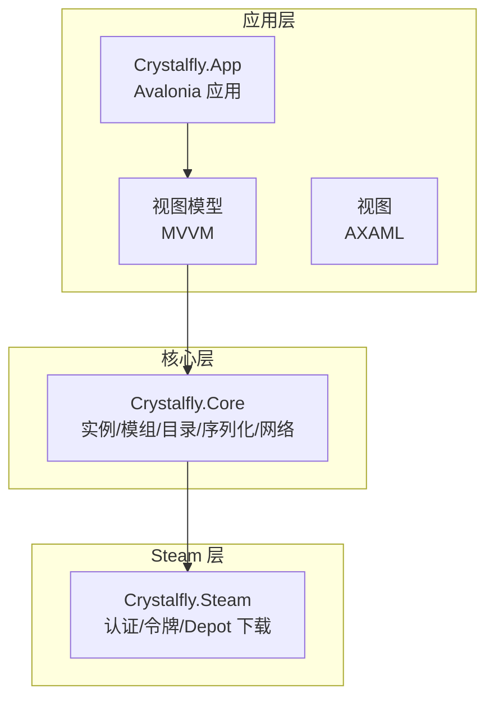
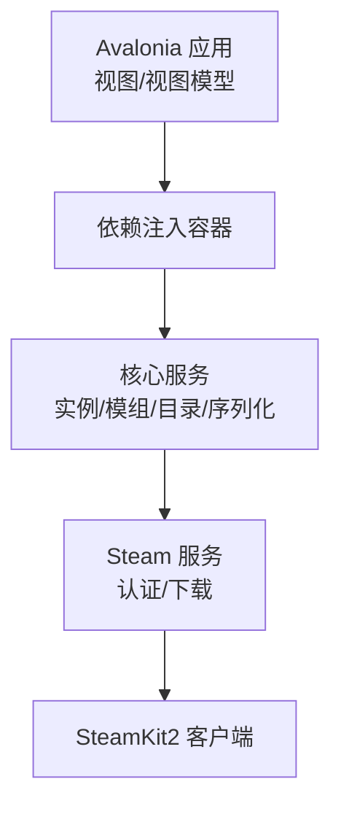
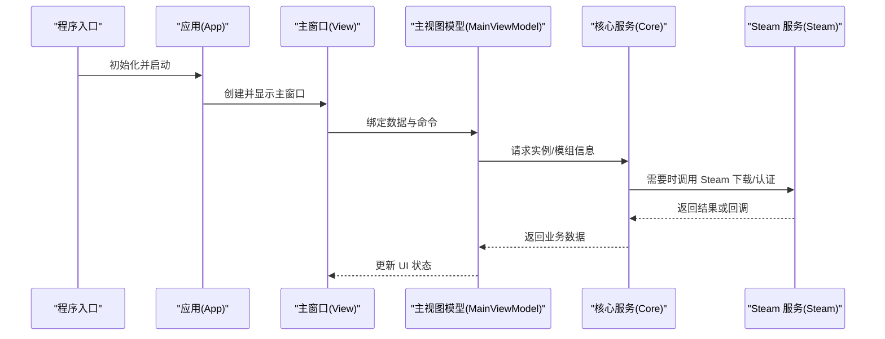
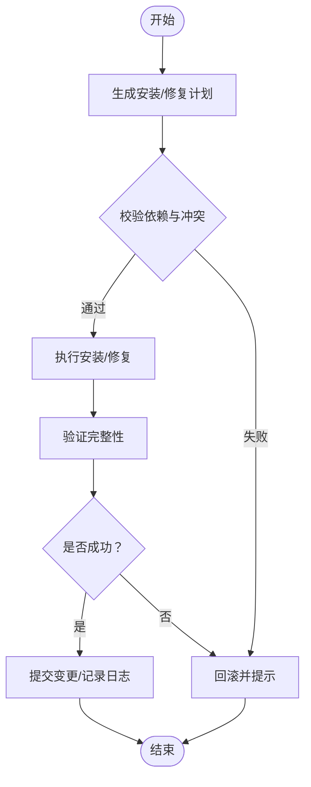
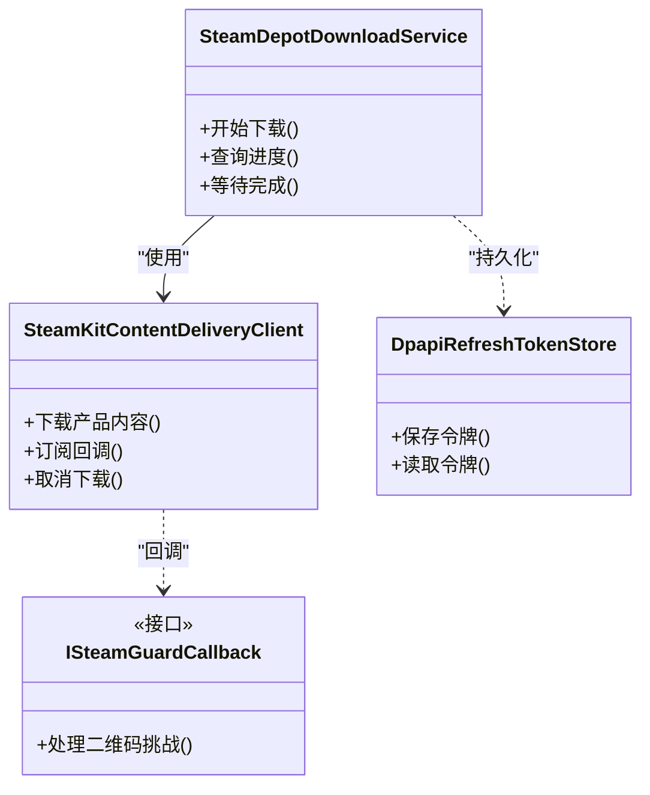
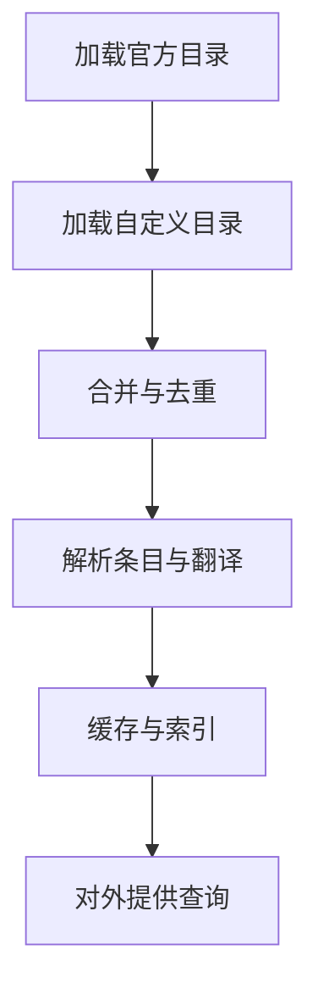
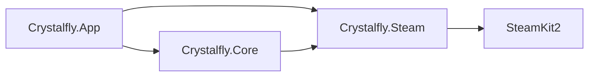

# 技术栈概览

<cite>
**本文引用的文件**   
- [Crystalfly.slnx](file://Crystalfly.slnx)
- [Directory.Build.props](file://Directory.Build.props)
- [Directory.Packages.props](file://Directory.Packages.props)
- [Program.cs](file://src/Crystalfly.App/Program.cs)
- [App.axaml.cs](file://src/Crystalfly.App/App.axaml.cs)
- [MainWindow.axaml.cs](file://src/Crystalfly.App/Views/MainWindow.axaml.cs)
- [MainViewModel.cs](file://src/Crystalfly.App/ViewModels/MainViewModel.cs)
- [ViewLocator.cs](file://src/Crystalfly.App/ViewLocator.cs)
- [Crystalfly.Core.csproj](file://src/Crystalfly.Core/Crystalfly.Core.csproj)
- [Crystalfly.Steam.csproj](file://src/Crystalfly.Steam/Crystalfly.Steam.csproj)
- [SteamKitContentDeliveryClient.cs](file://src/Crystalfly.Steam/Downloads/SteamKitContentDeliveryClient.cs)
- [SteamDepotDownloadService.cs](file://src/Crystalfly.Steam/Downloads/SteamDepotDownloadService.cs)
- [CatalogProvider.cs](file://src/Crystalfly.Core/Catalog/CatalogProvider.cs)
- [ModInstallService.cs](file://src/Crystalfly.Core/Mods/ModInstallService.cs)
- [InstanceRuntimeSession.cs](file://src/Crystalfly.Core/Runtime/InstanceRuntimeSession.cs)
</cite>

## 目录
1. [简介](#简介)
2. [项目结构](#项目结构)
3. [核心组件](#核心组件)
4. [架构总览](#架构总览)
5. [详细组件分析](#详细组件分析)
6. [依赖关系分析](#依赖关系分析)
7. [性能考量](#性能考量)
8. [故障排查指南](#故障排查指南)
9. [结论](#结论)
10. [附录](#附录)

## 简介
本技术栈概览面向 Crystalfly 项目的开发者与维护者，系统性梳理其核心技术选型与架构设计。项目基于 .NET 运行时与 Avalonia UI 框架构建跨平台桌面应用，通过 SteamKit2 深度集成 Steam 平台能力（认证、内容分发等），并以 MVVM 模式组织界面逻辑，结合依赖注入与模块化设计提升可测试性与可维护性。文档同时提供版本兼容性要点、系统要求说明，以及面向初学者与资深开发者的分层解读。

## 项目结构
仓库采用多工程解决方案，按职责划分为：
- 应用层（UI）：负责用户交互、视图与视图模型，使用 Avalonia 实现跨平台桌面体验。
- 核心业务层（Core）：封装游戏实例管理、模组安装与依赖解析、目录与快照、序列化、网络路由等通用能力。
- Steam 集成层（Steam）：封装 Steam 认证、令牌存储、Depot 下载与进度聚合等能力，对外暴露统一接口供上层调用。
- 测试工程：覆盖 UI、核心与 Steam 层的单元测试与渲染测试。
- 配置与脚本：集中定义包版本、构建属性与发布脚本。

图表来源
- [Program.cs:1-200](file://src/Crystalfly.App/Program.cs#L1-L200)
- [App.axaml.cs:1-200](file://src/Crystalfly.App/App.axaml.cs#L1-L200)
- [MainWindow.axaml.cs:1-200](file://src/Crystalfly.App/Views/MainWindow.axaml.cs#L1-L200)
- [Crystalfly.Core.csproj:1-200](file://src/Crystalfly.Core/Crystalfly.Core.csproj#L1-L200)
- [Crystalfly.Steam.csproj:1-200](file://src/Crystalfly.Steam/Crystalfly.Steam.csproj#L1-L200)

章节来源
- [Crystalfly.slnx:1-200](file://Crystalfly.slnx#L1-L200)
- [Directory.Build.props:1-200](file://Directory.Build.props#L1-L200)
- [Directory.Packages.props:1-200](file://Directory.Packages.props#L1-L200)

## 核心组件
- .NET 运行时与 SDK
  - 作用：提供跨平台运行环境、现代语言特性与生态库支持。
  - 选择原因：稳定、高性能、跨平台一致性好；与 Avalonia 和 SteamKit2 生态契合。
  - 关键位置：解决方案与包清单中声明运行时与公共包版本。
- Avalonia UI
  - 作用：跨平台桌面 UI 框架，支持 Windows/macOS/Linux，统一 XAML 风格与数据绑定。
  - 选择原因：一次编写、多处运行；与 MVVM 天然契合；主题与样式体系完善。
  - 关键位置：应用入口、视图定位器、主窗口与主题资源。
- SteamKit2
  - 作用：Steam 客户端协议实现，用于登录认证、获取 Depot 列表与下载内容。
  - 选择原因：官方社区广泛使用、功能完备、异步 API 友好。
  - 关键位置：Steam 层的内容交付客户端与下载服务。
- 依赖注入与模块化
  - 作用：解耦组件、便于替换实现与单测；以模块边界划分职责。
  - 选择原因：提高可测试性与扩展性；降低耦合度。
  - 关键位置：应用启动时注册服务、各层服务装配。

章节来源
- [Directory.Packages.props:1-200](file://Directory.Packages.props#L1-L200)
- [Directory.Build.props:1-200](file://Directory.Build.props#L1-L200)
- [Program.cs:1-200](file://src/Crystalfly.App/Program.cs#L1-L200)
- [App.axaml.cs:1-200](file://src/Crystalfly.App/App.axaml.cs#L1-L200)
- [ViewLocator.cs:1-200](file://src/Crystalfly.App/ViewLocator.cs#L1-L200)
- [Crystalfly.Steam.csproj:1-200](file://src/Crystalfly.Steam/Crystalfly.Steam.csproj#L1-L200)

## 架构总览
整体采用“应用层（MVVM）—核心层—Steam 层”的分层架构，配合依赖注入与服务发现，形成高内聚、低耦合的模块化结构。UI 仅持有视图模型，业务逻辑下沉至 Core，平台相关能力收敛在 Steam 层，避免 UI 直接依赖第三方平台 SDK。

图表来源
- [Program.cs:1-200](file://src/Crystalfly.App/Program.cs#L1-L200)
- [App.axaml.cs:1-200](file://src/Crystalfly.App/App.axaml.cs#L1-L200)
- [Crystalfly.Core.csproj:1-200](file://src/Crystalfly.Core/Crystalfly.Core.csproj#L1-L200)
- [Crystalfly.Steam.csproj:1-200](file://src/Crystalfly.Steam/Crystalfly.Steam.csproj#L1-L200)

## 详细组件分析

### 应用层（Avalonia + MVVM）
- 启动流程
  - Program 初始化应用上下文并创建根窗口。
  - App 完成主题、国际化与依赖注入容器的装配。
  - ViewLocator 根据类型将 ViewModel 映射到对应 View。
- MVVM 实践
  - 视图模型承载状态与命令，视图仅做展示与事件转发。
  - 对话框与主界面均遵循同一模式，便于复用与测试。
- 关键路径
  - 应用入口与生命周期：[Program.cs](file://src/Crystalfly.App/Program.cs)
  - 应用装配与主题：[App.axaml.cs](file://src/Crystalfly.App/App.axaml.cs)
  - 主窗口与视图绑定：[MainWindow.axaml.cs](file://src/Crystalfly.App/Views/MainWindow.axaml.cs)
  - 视图定位策略：[ViewLocator.cs](file://src/Crystalfly.App/ViewLocator.cs)
  - 主界面视图模型：[MainViewModel.cs](file://src/Crystalfly.App/ViewModels/MainViewModel.cs)

图表来源
- [Program.cs:1-200](file://src/Crystalfly.App/Program.cs#L1-L200)
- [App.axaml.cs:1-200](file://src/Crystalfly.App/App.axaml.cs#L1-L200)
- [MainWindow.axaml.cs:1-200](file://src/Crystalfly.App/Views/MainWindow.axaml.cs#L1-L200)
- [MainViewModel.cs:1-200](file://src/Crystalfly.App/ViewModels/MainViewModel.cs#L1-L200)

章节来源
- [Program.cs:1-200](file://src/Crystalfly.App/Program.cs#L1-L200)
- [App.axaml.cs:1-200](file://src/Crystalfly.App/App.axaml.cs#L1-L200)
- [MainWindow.axaml.cs:1-200](file://src/Crystalfly.App/Views/MainWindow.axaml.cs#L1-L200)
- [ViewLocator.cs:1-200](file://src/Crystalfly.App/ViewLocator.cs#L1-L200)
- [MainViewModel.cs:1-200](file://src/Crystalfly.App/ViewModels/MainViewModel.cs#L1-L200)

### 核心层（业务与领域能力）
- 目录与实例管理
  - 负责游戏实例的创建、克隆、删除、导入与扫描，提供侧车文件与指纹计算。
- 模组管理与依赖解析
  - 提供模组安装计划生成、依赖修复规划、安装执行与影响面评估。
- 目录与快照
  - 命名快照服务用于快速回滚与对比。
- 序列化和事务
  - JSON 原子写入与事务式文件操作保障一致性。
- 网络与路由
  - GitHub 下载路由与延迟探测，为下载链路提供优化。
- 运行时守护
  - 进程守护与启动预检，确保目标游戏环境就绪。
- 关键路径
  - 模组安装服务：[ModInstallService.cs](file://src/Crystalfly.Core/Mods/ModInstallService.cs)
  - 运行时会话：[InstanceRuntimeSession.cs](file://src/Crystalfly.Core/Runtime/InstanceRuntimeSession.cs)
  - 目录与实例：[Instances/*](file://src/Crystalfly.Core/Instances)
  - 模组依赖与计划：[Mods/*](file://src/Crystalfly.Core/Mods)
  - 序列化与事务：[Serialization/*](file://src/Crystalfly.Core/Serialization), [Transactions/*](file://src/Crystalfly.Core/Transactions)
  - 网络路由：[Networking/*](file://src/Crystalfly.Core/Networking)

图表来源
- [ModInstallService.cs:1-200](file://src/Crystalfly.Core/Mods/ModInstallService.cs#L1-L200)

章节来源
- [Crystalfly.Core.csproj:1-200](file://src/Crystalfly.Core/Crystalfly.Core.csproj#L1-L200)
- [ModInstallService.cs:1-200](file://src/Crystalfly.Core/Mods/ModInstallService.cs#L1-L200)
- [InstanceRuntimeSession.cs:1-200](file://src/Crystalfly.Core/Runtime/InstanceRuntimeSession.cs#L1-L200)

### Steam 集成层（SteamKit2 封装）
- 认证与会话
  - 封装二维码挑战、刷新令牌持久化与安全存储。
- 内容分发
  - 基于 SteamKit2 的 Depot 下载客户端，提供进度聚合与断点续传语义。
- 关键路径
  - 内容交付客户端：[SteamKitContentDeliveryClient.cs](file://src/Crystalfly.Steam/Downloads/SteamKitContentDeliveryClient.cs)
  - Depot 下载服务：[SteamDepotDownloadService.cs](file://src/Crystalfly.Steam/Downloads/SteamDepotDownloadService.cs)
  - 安全令牌存储：[Security/*](file://src/Crystalfly.Steam/Security)

图表来源
- [SteamKitContentDeliveryClient.cs:1-200](file://src/Crystalfly.Steam/Downloads/SteamKitContentDeliveryClient.cs#L1-L200)
- [SteamDepotDownloadService.cs:1-200](file://src/Crystalfly.Steam/Downloads/SteamDepotDownloadService.cs#L1-L200)

章节来源
- [Crystalfly.Steam.csproj:1-200](file://src/Crystalfly.Steam/Crystalfly.Steam.csproj#L1-L200)
- [SteamKitContentDeliveryClient.cs:1-200](file://src/Crystalfly.Steam/Downloads/SteamKitContentDeliveryClient.cs#L1-L200)
- [SteamDepotDownloadService.cs:1-200](file://src/Crystalfly.Steam/Downloads/SteamDepotDownloadService.cs#L1-L200)

### 目录与模组目录解析（示例）
- 目录提供者负责合并多个来源的目录数据，解析官方与自定义源，并提供统一的查询接口。
- 关键路径
  - 目录提供者：[CatalogProvider.cs](file://src/Crystalfly.Core/Catalog/CatalogProvider.cs)

图表来源
- [CatalogProvider.cs:1-200](file://src/Crystalfly.Core/Catalog/CatalogProvider.cs#L1-L200)

章节来源
- [CatalogProvider.cs:1-200](file://src/Crystalfly.Core/Catalog/CatalogProvider.cs#L1-L200)

## 依赖关系分析
- 包与版本治理
  - Directory.Packages.props 集中声明公共包版本，保证多工程一致性。
  - Directory.Build.props 统一构建属性与输出规范。
- 工程间依赖
  - Crystalfly.App 依赖 Crystalfly.Core 与 Crystalfly.Steam。
  - Crystalfly.Core 不反向依赖 UI 或平台特定实现。
  - Crystalfly.Steam 聚焦平台能力，被 Core 按需调用。
- 外部依赖
  - Avalonia UI 提供跨平台 UI。
  - SteamKit2 提供 Steam 协议与下载能力。
  - 其他常用库（JSON、日志、HTTP 等）由包清单统一管理。

图表来源
- [Crystalfly.slnx:1-200](file://Crystalfly.slnx#L1-L200)
- [Directory.Packages.props:1-200](file://Directory.Packages.props#L1-L200)
- [Directory.Build.props:1-200](file://Directory.Build.props#L1-L200)

章节来源
- [Directory.Packages.props:1-200](file://Directory.Packages.props#L1-L200)
- [Directory.Build.props:1-200](file://Directory.Build.props#L1-L200)
- [Crystalfly.slnx:1-200](file://Crystalfly.slnx#L1-L200)

## 性能考量
- 下载与并发
  - 对大体积内容采用分块与并发控制，避免阻塞 UI 线程；利用异步 IO 与背压机制。
- 缓存与索引
  - 目录与元数据建立内存索引，减少重复解析与磁盘访问。
- 序列化与事务
  - 原子写入与事务式文件操作降低损坏风险，缩短锁粒度。
- 网络优化
  - 路由延迟探测与就近选择，降低首包时延。
- 建议
  - 监控下载队列与吞吐指标，设置超时与重试退避策略。
  - 对热点目录项进行懒加载与分页展示，减轻 UI 压力。

## 故障排查指南
- 常见问题定位
  - 无法登录 Steam：检查令牌存储与网络代理设置，确认二维码挑战回调是否触发。
  - 下载中断：查看 Depot 下载服务的错误码与重试计数，必要时清理临时文件并重试。
  - 模组安装失败：核对依赖图与冲突报告，查看事务回滚日志与快照差异。
  - 目录解析异常：确认官方与自定义目录格式是否符合 schema，检查合并顺序与去重策略。
- 诊断手段
  - 启用详细日志与结构化输出，关联时间戳与请求 ID。
  - 使用命名快照对比变更前后的文件系统差异。
  - 针对网络问题抓取 HTTP/Steam 协议握手阶段的关键报文。

章节来源
- [SteamDepotDownloadService.cs:1-200](file://src/Crystalfly.Steam/Downloads/SteamDepotDownloadService.cs#L1-L200)
- [ModInstallService.cs:1-200](file://src/Crystalfly.Core/Mods/ModInstallService.cs#L1-L200)
- [CatalogProvider.cs:1-200](file://src/Crystalfly.Core/Catalog/CatalogProvider.cs#L1-L200)

## 结论
Crystalfly 以 .NET 与 Avalonia 为基础，借助 SteamKit2 打通 Steam 生态，采用 MVVM 与依赖注入构建清晰的分层架构。Core 层沉淀通用业务能力，Steam 层屏蔽平台细节，UI 层专注交互呈现。该设计兼顾可维护性、可扩展性与用户体验，适合持续演进与团队协作。

## 附录
- 技术版本与兼容性
  - .NET 运行时与 SDK：参考包清单与构建属性中的版本约束。
  - Avalonia UI：遵循包清单中声明的版本，注意与 .NET 版本的兼容矩阵。
  - SteamKit2：遵循包清单中声明的版本，关注其支持的 Steam 协议特性。
- 系统要求
  - 操作系统：Windows、macOS、Linux（依据 Avalonia 支持范围）。
  - 权限：首次登录与令牌存储可能需要相应系统凭据访问权限。
  - 网络：需访问 Steam 服务器与可能的第三方托管源。
- 术语解释（面向初学者）
  - MVVM：将界面（View）、数据与行为（ViewModel）分离，便于测试与复用。
  - 依赖注入：在运行时将依赖对象注入到组件中，降低耦合。
  - Depot：Steam 上的内容分发单元，包含游戏或模组的具体文件集合。
  - 快照：对某一时刻的文件系统状态进行标记，便于回滚与对比。