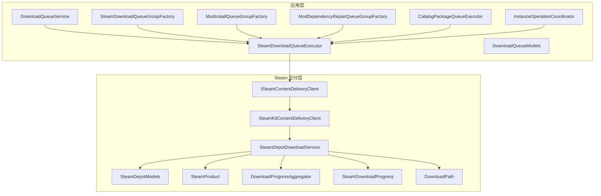
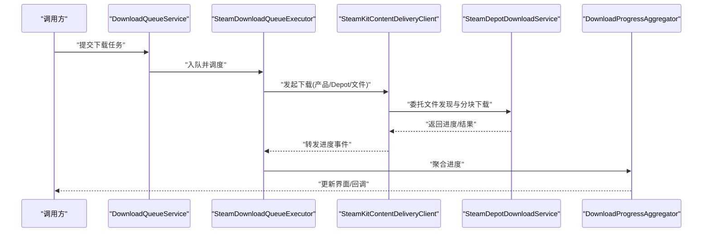
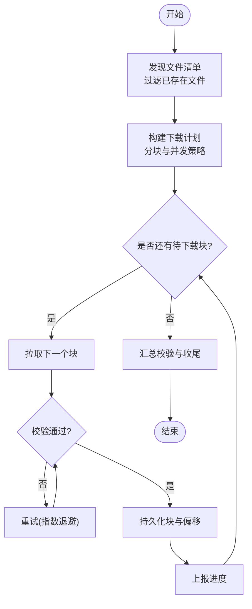
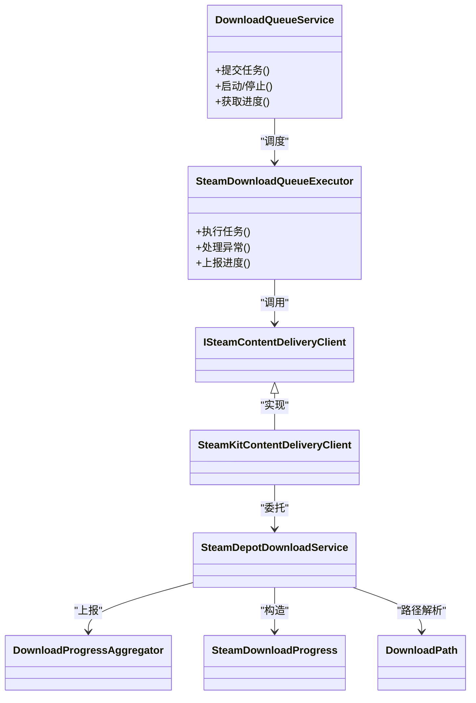
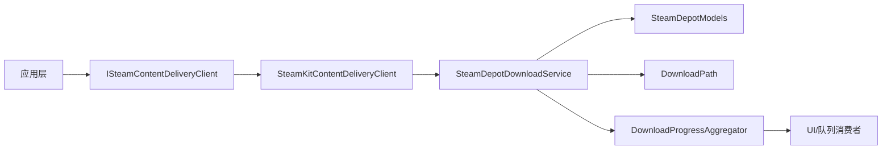

# Steam 内容交付服务

<cite>
**本文引用的文件**   
- [ISteamContentDeliveryClient.cs](file://src/Crystalfly.Steam/Downloads/ISteamContentDeliveryClient.cs)
- [SteamKitContentDeliveryClient.cs](file://src/Crystalfly.Steam/Downloads/SteamKitContentDeliveryClient.cs)
- [SteamDepotDownloadService.cs](file://src/Crystalfly.Steam/Downloads/SteamDepotDownloadService.cs)
- [SteamDepotModels.cs](file://src/Crystalfly.Steam/Downloads/SteamDepotModels.cs)
- [SteamProduct.cs](file://src/Crystalfly.Steam/Downloads/SteamProduct.cs)
- [DownloadProgressAggregator.cs](file://src/Crystalfly.Steam/Downloads/DownloadProgressAggregator.cs)
- [SteamDownloadProgress.cs](file://src/Crystalfly.Steam/Downloads/SteamDownloadProgress.cs)
- [DownloadPath.cs](file://src/Crystalfly.Steam/Downloads/DownloadPath.cs)
- [SteamDownloadQueueExecutor.cs](file://src/Crystalfly.App/Downloads/SteamDownloadQueueExecutor.cs)
- [DownloadQueueService.cs](file://src/Crystalfly.App/Downloads/DownloadQueueService.cs)
- [DownloadQueueModels.cs](file://src/Crystalfly.App/Downloads/DownloadQueueModels.cs)
- [IDownloadQueueExecutor.cs](file://src/Crystalfly.App/Downloads/IDownloadQueueExecutor.cs)
- [CatalogPackageQueueExecutor.cs](file://src/Crystalfly.App/Downloads/CatalogPackageQueueExecutor.cs)
- [ModInstallQueueGroupFactory.cs](file://src/Crystalfly.App/Downloads/ModInstallQueueGroupFactory.cs)
- [ModDependencyRepairQueueGroupFactory.cs](file://src/Crystalfly.App/Downloads/ModDependencyRepairQueueGroupFactory.cs)
- [InstanceOperationCoordinator.cs](file://src/Crystalfly.App/Downloads/InstanceOperationCoordinator.cs)
- [SteamDownloadQueueGroupFactory.cs](file://src/Crystalfly.App/Downloads/SteamDownloadQueueGroupFactory.cs)
</cite>

## 目录
1. [简介](#简介)
2. [项目结构](#项目结构)
3. [核心组件](#核心组件)
4. [架构总览](#架构总览)
5. [详细组件分析](#详细组件分析)
6. [依赖关系分析](#依赖关系分析)
7. [性能考虑](#性能考虑)
8. [故障排查指南](#故障排查指南)
9. [结论](#结论)
10. [附录](#附录)

## 简介
本技术文档聚焦 Crystalfly 的 Steam 内容交付服务，围绕 Depot 文件下载服务的实现与使用展开。文档覆盖以下关键主题：
- 文件发现、分块下载与完整性验证
- SteamKitContentDeliveryClient 的设计模式（连接管理、任务调度、进度监控）
- ISteamContentDeliveryClient 接口抽象与扩展点
- 实际下载操作示例（批量下载、断点续传、错误重试）
- 与 Steam 内容分发网络的通信协议与性能优化策略
- 下载队列管理与并发控制最佳实践

## 项目结构
Crystalfly 将 Steam 内容交付能力集中在 Crystalfly.Steam 模块中，并在 Crystalfly.App 层提供下载队列编排与执行器适配。关键路径如下：
- 接口与客户端实现：src/Crystalfly.Steam/Downloads
- 下载服务与模型：src/Crystalfly.Steam/Downloads
- 应用层队列与服务：src/Crystalfly.App/Downloads

图表来源
- [SteamDownloadQueueExecutor.cs](file://src/Crystalfly.App/Downloads/SteamDownloadQueueExecutor.cs)
- [DownloadQueueService.cs](file://src/Crystalfly.App/Downloads/DownloadQueueService.cs)
- [DownloadQueueModels.cs](file://src/Crystalfly.App/Downloads/DownloadQueueModels.cs)
- [SteamDownloadQueueGroupFactory.cs](file://src/Crystalfly.App/Downloads/SteamDownloadQueueGroupFactory.cs)
- [ModInstallQueueGroupFactory.cs](file://src/Crystalfly.App/Downloads/ModInstallQueueGroupFactory.cs)
- [ModDependencyRepairQueueGroupFactory.cs](file://src/Crystalfly.App/Downloads/ModDependencyRepairQueueGroupFactory.cs)
- [CatalogPackageQueueExecutor.cs](file://src/Crystalfly.App/Downloads/CatalogPackageQueueExecutor.cs)
- [InstanceOperationCoordinator.cs](file://src/Crystalfly.App/Downloads/InstanceOperationCoordinator.cs)
- [ISteamContentDeliveryClient.cs](file://src/Crystalfly.Steam/Downloads/ISteamContentDeliveryClient.cs)
- [SteamKitContentDeliveryClient.cs](file://src/Crystalfly.Steam/Downloads/SteamKitContentDeliveryClient.cs)
- [SteamDepotDownloadService.cs](file://src/Crystalfly.Steam/Downloads/SteamDepotDownloadService.cs)
- [SteamDepotModels.cs](file://src/Crystalfly.Steam/Downloads/SteamDepotModels.cs)
- [SteamProduct.cs](file://src/Crystalfly.Steam/Downloads/SteamProduct.cs)
- [DownloadProgressAggregator.cs](file://src/Crystalfly.Steam/Downloads/DownloadProgressAggregator.cs)
- [SteamDownloadProgress.cs](file://src/Crystalfly.Steam/Downloads/SteamDownloadProgress.cs)
- [DownloadPath.cs](file://src/Crystalfly.Steam/Downloads/DownloadPath.cs)

章节来源
- [SteamDownloadQueueExecutor.cs](file://src/Crystalfly.App/Downloads/SteamDownloadQueueExecutor.cs)
- [DownloadQueueService.cs](file://src/Crystalfly.App/Downloads/DownloadQueueService.cs)
- [DownloadQueueModels.cs](file://src/Crystalfly.App/Downloads/DownloadQueueModels.cs)
- [SteamDownloadQueueGroupFactory.cs](file://src/Crystalfly.App/Downloads/SteamDownloadQueueGroupFactory.cs)
- [ModInstallQueueGroupFactory.cs](file://src/Crystalfly.App/Downloads/ModInstallQueueGroupFactory.cs)
- [ModDependencyRepairQueueGroupFactory.cs](file://src/Crystalfly.App/Downloads/ModDependencyRepairQueueGroupFactory.cs)
- [CatalogPackageQueueExecutor.cs](file://src/Crystalfly.App/Downloads/CatalogPackageQueueExecutor.cs)
- [InstanceOperationCoordinator.cs](file://src/Crystalfly.App/Downloads/InstanceOperationCoordinator.cs)
- [ISteamContentDeliveryClient.cs](file://src/Crystalfly.Steam/Downloads/ISteamContentDeliveryClient.cs)
- [SteamKitContentDeliveryClient.cs](file://src/Crystalfly.Steam/Downloads/SteamKitContentDeliveryClient.cs)
- [SteamDepotDownloadService.cs](file://src/Crystalfly.Steam/Downloads/SteamDepotDownloadService.cs)
- [SteamDepotModels.cs](file://src/Crystalfly.Steam/Downloads/SteamDepotModels.cs)
- [SteamProduct.cs](file://src/Crystalfly.Steam/Downloads/SteamProduct.cs)
- [DownloadProgressAggregator.cs](file://src/Crystalfly.Steam/Downloads/DownloadProgressAggregator.cs)
- [SteamDownloadProgress.cs](file://src/Crystalfly.Steam/Downloads/SteamDownloadProgress.cs)
- [DownloadPath.cs](file://src/Crystalfly.Steam/Downloads/DownloadPath.cs)

## 核心组件
本节概述 Steam 内容交付的核心类与职责边界：
- ISteamContentDeliveryClient：定义与 Steam 内容分发交互的统一接口，屏蔽底层实现差异，便于替换或扩展。
- SteamKitContentDeliveryClient：基于 SteamKit 的具体实现，负责连接管理、会话状态、下载任务调度与进度上报。
- SteamDepotDownloadService：面向 Depot 的高层下载服务，封装文件发现、分块下载、校验与重试等流程。
- DownloadProgressAggregator / SteamDownloadProgress：聚合与标准化下载进度事件，供上层 UI 与队列消费。
- DownloadPath：统一处理目标路径解析、命名与冲突避免。
- 应用层执行器与队列：SteamDownloadQueueExecutor、DownloadQueueService 及其工厂与协调器，负责并发控制、任务分组与生命周期管理。

章节来源
- [ISteamContentDeliveryClient.cs](file://src/Crystalfly.Steam/Downloads/ISteamContentDeliveryClient.cs)
- [SteamKitContentDeliveryClient.cs](file://src/Crystalfly.Steam/Downloads/SteamKitContentDeliveryClient.cs)
- [SteamDepotDownloadService.cs](file://src/Crystalfly.Steam/Downloads/SteamDepotDownloadService.cs)
- [DownloadProgressAggregator.cs](file://src/Crystalfly.Steam/Downloads/DownloadProgressAggregator.cs)
- [SteamDownloadProgress.cs](file://src/Crystalfly.Steam/Downloads/SteamDownloadProgress.cs)
- [DownloadPath.cs](file://src/Crystalfly.Steam/Downloads/DownloadPath.cs)
- [SteamDownloadQueueExecutor.cs](file://src/Crystalfly.App/Downloads/SteamDownloadQueueExecutor.cs)
- [DownloadQueueService.cs](file://src/Crystalfly.App/Downloads/DownloadQueueService.cs)

## 架构总览
整体采用“接口 + 具体客户端 + 高层服务 + 应用层队列”的分层设计：
- 接口层：ISteamContentDeliveryClient 暴露稳定的下载契约。
- 客户端层：SteamKitContentDeliveryClient 对接 SteamKit，管理连接与会话。
- 服务层：SteamDepotDownloadService 组织下载流程，包括文件发现、分块、校验与重试。
- 应用层：通过队列执行器与工厂进行任务编排、并发控制与进度聚合。

图表来源
- [DownloadQueueService.cs](file://src/Crystalfly.App/Downloads/DownloadQueueService.cs)
- [SteamDownloadQueueExecutor.cs](file://src/Crystalfly.App/Downloads/SteamDownloadQueueExecutor.cs)
- [SteamKitContentDeliveryClient.cs](file://src/Crystalfly.Steam/Downloads/SteamKitContentDeliveryClient.cs)
- [SteamDepotDownloadService.cs](file://src/Crystalfly.Steam/Downloads/SteamDepotDownloadService.cs)
- [DownloadProgressAggregator.cs](file://src/Crystalfly.Steam/Downloads/DownloadProgressAggregator.cs)

## 详细组件分析

### ISteamContentDeliveryClient 接口抽象
- 职责：定义统一的下载入口，屏蔽底层连接与协议细节；提供取消、进度订阅等通用能力。
- 扩展点：新增不同后端（如镜像源、缓存代理）时，只需实现该接口并通过注入替换。
- 典型方法族（概念性说明）：
  - 初始化/登录与会话管理
  - 列出可下载内容与元数据
  - 启动下载任务（支持范围/分块）
  - 查询/监听进度与完成事件
  - 取消与清理资源

章节来源
- [ISteamContentDeliveryClient.cs](file://src/Crystalfly.Steam/Downloads/ISteamContentDeliveryClient.cs)

### SteamKitContentDeliveryClient 设计与模式
- 设计模式：
  - 适配器模式：将 SteamKit 的异步 API 适配为稳定接口。
  - 观察者模式：通过进度事件对外发布下载状态。
  - 责任链/模板方法：在客户端内部组织连接、认证、下载、校验的流程。
- 连接管理：
  - 单例/共享连接池（由实现决定），避免重复握手。
  - 自动重连与退避策略（网络抖动场景）。
- 任务调度：
  - 内部线程池/通道控制并发度，防止压垮服务端。
  - 任务优先级与抢占（可选）。
- 进度监控：
  - 将细粒度分块进度聚合为文件级/任务级进度。
  - 支持增量更新与去抖，降低 UI 刷新压力。

章节来源
- [SteamKitContentDeliveryClient.cs](file://src/Crystalfly.Steam/Downloads/SteamKitContentDeliveryClient.cs)

### SteamDepotDownloadService 下载流程
- 文件发现：
  - 根据产品/版本/构建信息定位 Depot 与文件清单。
  - 过滤已存在文件，减少冗余下载。
- 分块下载：
  - 按块大小切分请求，提升吞吐与容错。
  - 并行拉取不同文件/块，结合全局并发上限。
- 完整性验证：
  - 对每个块计算校验和并与清单比对。
  - 失败则触发重试与回滚机制。
- 断点续传：
  - 记录已完成的块偏移与校验状态。
  - 恢复时跳过已完成部分，仅拉取缺失块。
- 错误重试：
  - 区分可重试与不可重试错误。
  - 指数退避与最大重试次数限制。

图表来源
- [SteamDepotDownloadService.cs](file://src/Crystalfly.Steam/Downloads/SteamDepotDownloadService.cs)
- [SteamDepotModels.cs](file://src/Crystalfly.Steam/Downloads/SteamDepotModels.cs)
- [DownloadPath.cs](file://src/Crystalfly.Steam/Downloads/DownloadPath.cs)
- [DownloadProgressAggregator.cs](file://src/Crystalfly.Steam/Downloads/DownloadProgressAggregator.cs)
- [SteamDownloadProgress.cs](file://src/Crystalfly.Steam/Downloads/SteamDownloadProgress.cs)

章节来源
- [SteamDepotDownloadService.cs](file://src/Crystalfly.Steam/Downloads/SteamDepotDownloadService.cs)
- [SteamDepotModels.cs](file://src/Crystalfly.Steam/Downloads/SteamDepotModels.cs)
- [DownloadPath.cs](file://src/Crystalfly.Steam/Downloads/DownloadPath.cs)
- [DownloadProgressAggregator.cs](file://src/Crystalfly.Steam/Downloads/DownloadProgressAggregator.cs)
- [SteamDownloadProgress.cs](file://src/Crystalfly.Steam/Downloads/SteamDownloadProgress.cs)

### 进度聚合与上报
- DownloadProgressAggregator：
  - 合并多个任务的进度，提供总体百分比与速率统计。
  - 支持节流与批量推送，避免频繁事件风暴。
- SteamDownloadProgress：
  - 标准化进度数据结构，包含任务标识、字节数、速率、状态码等。

章节来源
- [DownloadProgressAggregator.cs](file://src/Crystalfly.Steam/Downloads/DownloadProgressAggregator.cs)
- [SteamDownloadProgress.cs](file://src/Crystalfly.Steam/Downloads/SteamDownloadProgress.cs)

### 应用层队列与执行器
- DownloadQueueService：
  - 维护任务队列、生命周期与错误恢复。
  - 与执行器协作，保证顺序与并发约束。
- SteamDownloadQueueExecutor：
  - 将队列任务转换为具体的下载调用。
  - 处理异常、重试与最终状态落盘。
- 工厂与协调器：
  - SteamDownloadQueueGroupFactory / ModInstallQueueGroupFactory / ModDependencyRepairQueueGroupFactory：按业务域创建任务组。
  - InstanceOperationCoordinator：跨实例操作的协调与互斥。
  - CatalogPackageQueueExecutor：基于目录包的任务编排。

图表来源
- [DownloadQueueService.cs](file://src/Crystalfly.App/Downloads/DownloadQueueService.cs)
- [SteamDownloadQueueExecutor.cs](file://src/Crystalfly.App/Downloads/SteamDownloadQueueExecutor.cs)
- [ISteamContentDeliveryClient.cs](file://src/Crystalfly.Steam/Downloads/ISteamContentDeliveryClient.cs)
- [SteamKitContentDeliveryClient.cs](file://src/Crystalfly.Steam/Downloads/SteamKitContentDeliveryClient.cs)
- [SteamDepotDownloadService.cs](file://src/Crystalfly.Steam/Downloads/SteamDepotDownloadService.cs)
- [DownloadProgressAggregator.cs](file://src/Crystalfly.Steam/Downloads/DownloadProgressAggregator.cs)
- [SteamDownloadProgress.cs](file://src/Crystalfly.Steam/Downloads/SteamDownloadProgress.cs)
- [DownloadPath.cs](file://src/Crystalfly.Steam/Downloads/DownloadPath.cs)

章节来源
- [DownloadQueueService.cs](file://src/Crystalfly.App/Downloads/DownloadQueueService.cs)
- [SteamDownloadQueueExecutor.cs](file://src/Crystalfly.App/Downloads/SteamDownloadQueueExecutor.cs)
- [SteamDownloadQueueGroupFactory.cs](file://src/Crystalfly.App/Downloads/SteamDownloadQueueGroupFactory.cs)
- [ModInstallQueueGroupFactory.cs](file://src/Crystalfly.App/Downloads/ModInstallQueueGroupFactory.cs)
- [ModDependencyRepairQueueGroupFactory.cs](file://src/Crystalfly.App/Downloads/ModDependencyRepairQueueGroupFactory.cs)
- [CatalogPackageQueueExecutor.cs](file://src/Crystalfly.App/Downloads/CatalogPackageQueueExecutor.cs)
- [InstanceOperationCoordinator.cs](file://src/Crystalfly.App/Downloads/InstanceOperationCoordinator.cs)

## 依赖关系分析
- 松耦合：应用层通过 ISteamContentDeliveryClient 与 Steam 层解耦，便于替换实现或引入中间层（如缓存/代理）。
- 内聚性：SteamDepotDownloadService 集中处理下载相关逻辑，职责清晰。
- 外部依赖：
  - SteamKit：用于与 Steam 服务器通信（认证、清单、下载）。
  - 文件系统：读写本地文件与临时块。
  - 日志与配置：用于调试与参数调优。

图表来源
- [ISteamContentDeliveryClient.cs](file://src/Crystalfly.Steam/Downloads/ISteamContentDeliveryClient.cs)
- [SteamKitContentDeliveryClient.cs](file://src/Crystalfly.Steam/Downloads/SteamKitContentDeliveryClient.cs)
- [SteamDepotDownloadService.cs](file://src/Crystalfly.Steam/Downloads/SteamDepotDownloadService.cs)
- [SteamDepotModels.cs](file://src/Crystalfly.Steam/Downloads/SteamDepotModels.cs)
- [DownloadPath.cs](file://src/Crystalfly.Steam/Downloads/DownloadPath.cs)
- [DownloadProgressAggregator.cs](file://src/Crystalfly.Steam/Downloads/DownloadProgressAggregator.cs)

章节来源
- [ISteamContentDeliveryClient.cs](file://src/Crystalfly.Steam/Downloads/ISteamContentDeliveryClient.cs)
- [SteamKitContentDeliveryClient.cs](file://src/Crystalfly.Steam/Downloads/SteamKitContentDeliveryClient.cs)
- [SteamDepotDownloadService.cs](file://src/Crystalfly.Steam/Downloads/SteamDepotDownloadService.cs)
- [SteamDepotModels.cs](file://src/Crystalfly.Steam/Downloads/SteamDepotModels.cs)
- [DownloadPath.cs](file://src/Crystalfly.Steam/Downloads/DownloadPath.cs)
- [DownloadProgressAggregator.cs](file://src/Crystalfly.Steam/Downloads/DownloadProgressAggregator.cs)

## 性能考虑
- 并发控制：
  - 全局并发上限与每文件并发上限分离，避免热点文件争用。
  - 使用令牌桶或信号量控制出站请求速率。
- 分块大小：
  - 根据网络带宽与磁盘 IO 动态调整，平衡吞吐与内存占用。
- 缓存与复用：
  - 复用连接与会话，减少握手开销。
  - 对清单与索引做短期缓存。
- 进度上报节流：
  - 合并与去抖，降低 UI 刷新频率。
- 错误恢复：
  - 快速失败与重试分离，避免雪崩。
  - 指数退避与抖动，避免集中重试。

[本节为通用指导，不直接分析具体文件]

## 故障排查指南
- 常见问题定位：
  - 认证失败：检查会话初始化与凭据存储。
  - 清单加载失败：核对产品/构建/Depot 选择是否正确。
  - 校验失败：确认块校验算法与清单一致，检查磁盘空间与权限。
  - 进度不更新：检查进度聚合器的节流与事件订阅。
- 建议手段：
  - 开启详细日志，记录关键阶段耗时与错误堆栈。
  - 使用最小复现集（小文件/低并发）隔离问题。
  - 对重试与退避参数进行压测评估。

章节来源
- [SteamDepotDownloadService.cs](file://src/Crystalfly.Steam/Downloads/SteamDepotDownloadService.cs)
- [DownloadProgressAggregator.cs](file://src/Crystalfly.Steam/Downloads/DownloadProgressAggregator.cs)
- [SteamDownloadQueueExecutor.cs](file://src/Crystalfly.App/Downloads/SteamDownloadQueueExecutor.cs)

## 结论
本服务通过清晰的接口抽象与分层设计，实现了可扩展、高可用的 Steam 内容交付能力。SteamKitContentDeliveryClient 与 SteamDepotDownloadService 的组合提供了稳健的连接管理、任务调度与完整性保障；配合应用层的队列与执行器，可实现批量下载、断点续传与错误重试等高级特性。建议在部署中结合并发控制与进度节流策略，以获得更佳的吞吐与稳定性。

[本节为总结性内容，不直接分析具体文件]

## 附录

### 实际下载操作示例（步骤指引）
以下为常见用例的步骤式指引（不包含代码片段，仅提供路径参考）：
- 批量下载
  - 步骤：准备产品/构建列表 -> 构建下载计划 -> 提交到队列 -> 监听进度 -> 汇总结果
  - 参考路径：
    - [SteamDownloadQueueExecutor.cs](file://src/Crystalfly.App/Downloads/SteamDownloadQueueExecutor.cs)
    - [DownloadQueueService.cs](file://src/Crystalfly.App/Downloads/DownloadQueueService.cs)
    - [SteamDepotDownloadService.cs](file://src/Crystalfly.Steam/Downloads/SteamDepotDownloadService.cs)
- 断点续传
  - 步骤：读取上次偏移与校验状态 -> 仅拉取缺失块 -> 完成后重新校验 -> 清理临时块
  - 参考路径：
    - [SteamDepotDownloadService.cs](file://src/Crystalfly.Steam/Downloads/SteamDepotDownloadService.cs)
    - [DownloadPath.cs](file://src/Crystalfly.Steam/Downloads/DownloadPath.cs)
- 错误重试
  - 步骤：捕获可重试异常 -> 指数退避 -> 限制最大重试次数 -> 失败降级与告警
  - 参考路径：
    - [SteamDownloadQueueExecutor.cs](file://src/Crystalfly.App/Downloads/SteamDownloadQueueExecutor.cs)
    - [SteamDepotDownloadService.cs](file://src/Crystalfly.Steam/Downloads/SteamDepotDownloadService.cs)

### 与 Steam 内容分发网络的通信协议要点
- 认证与会话：基于 SteamKit 的登录流程，确保后续访问合法。
- 清单与索引：从 Steam 获取文件清单，确定文件哈希、大小与分块信息。
- 传输协议：HTTP/TCP 流式传输，支持范围请求以实现断点续传。
- 安全与校验：服务端提供校验值，客户端逐块验证，确保一致性。

[本节为概念性说明，不直接分析具体文件]

### 下载队列管理与并发控制最佳实践
- 任务分组：按业务域划分（安装、修复、目录包），避免相互阻塞。
- 优先级与抢占：关键任务优先，非关键任务可延迟。
- 背压与限流：当下游写入慢时，主动降速或暂停拉取。
- 幂等与去重：同一任务多次提交应去重，避免重复下载。
- 可观测性：指标与日志覆盖关键路径，便于定位瓶颈。

章节来源
- [DownloadQueueService.cs](file://src/Crystalfly.App/Downloads/DownloadQueueService.cs)
- [SteamDownloadQueueExecutor.cs](file://src/Crystalfly.App/Downloads/SteamDownloadQueueExecutor.cs)
- [SteamDownloadQueueGroupFactory.cs](file://src/Crystalfly.App/Downloads/SteamDownloadQueueGroupFactory.cs)
- [ModInstallQueueGroupFactory.cs](file://src/Crystalfly.App/Downloads/ModInstallQueueGroupFactory.cs)
- [ModDependencyRepairQueueGroupFactory.cs](file://src/Crystalfly.App/Downloads/ModDependencyRepairQueueGroupFactory.cs)
- [CatalogPackageQueueExecutor.cs](file://src/Crystalfly.App/Downloads/CatalogPackageQueueExecutor.cs)
- [InstanceOperationCoordinator.cs](file://src/Crystalfly.App/Downloads/InstanceOperationCoordinator.cs)