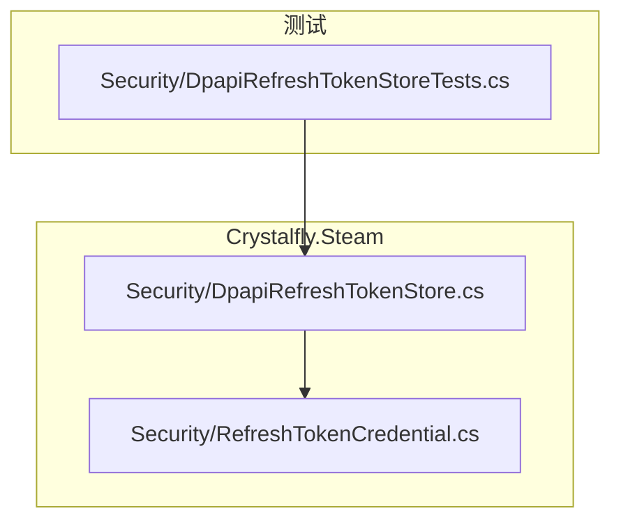
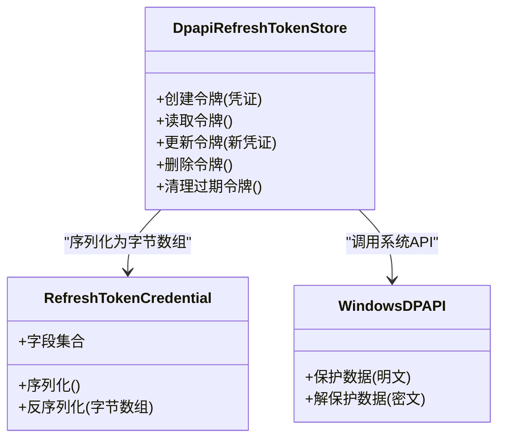
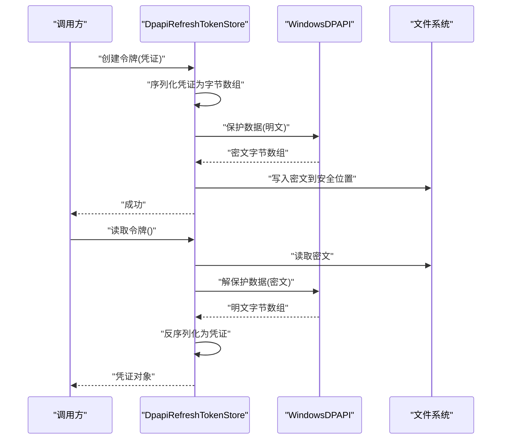
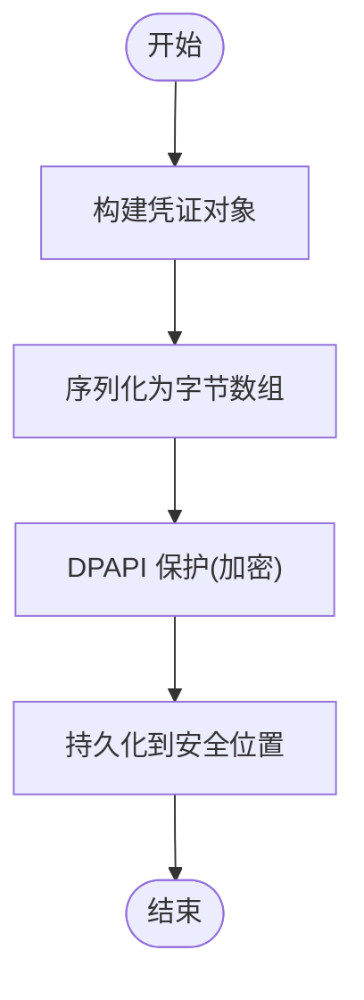
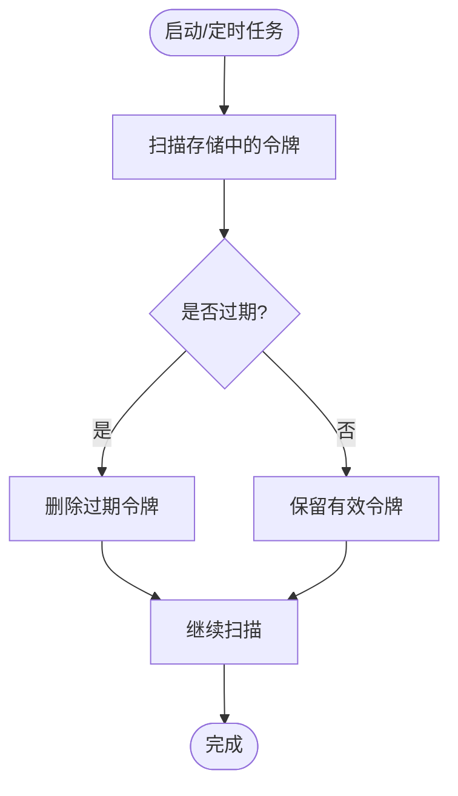
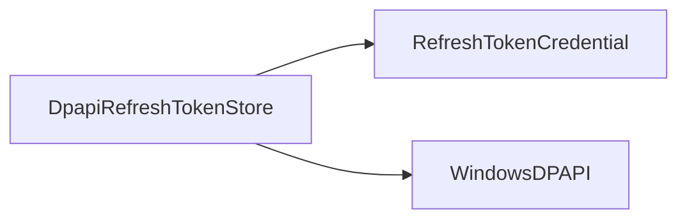

# Steam 安全存储

<cite>
**本文引用的文件**   
- [DpapiRefreshTokenStore.cs](file://src/Crystalfly.Steam/Security/DpapiRefreshTokenStore.cs)
- [RefreshTokenCredential.cs](file://src/Crystalfly.Steam/Security/RefreshTokenCredential.cs)
- [DpapiRefreshTokenStoreTests.cs](file://tests/Crystalfly.Steam.Tests/Security/DpapiRefreshTokenStoreTests.cs)
</cite>

## 目录
1. [简介](#简介)
2. [项目结构](#项目结构)
3. [核心组件](#核心组件)
4. [架构总览](#架构总览)
5. [详细组件分析](#详细组件分析)
6. [依赖关系分析](#依赖关系分析)
7. [性能考虑](#性能考虑)
8. [故障排查指南](#故障排查指南)
9. [结论](#结论)
10. [附录](#附录)

## 简介
本技术文档聚焦 Crystalfly 的 Steam 安全存储子系统，围绕 Windows DPAPI（数据保护 API）对刷新令牌进行本地加密持久化展开。文档将深入解析 DpapiRefreshTokenStore 的设计模式、令牌生命周期与自动清理策略、RefreshTokenCredential 的数据模型与序列化格式，并提供覆盖安全写入、读取与更新操作的实践示例路径。同时说明 Windows DPAPI 的安全特性与跨平台兼容性考量，并给出安全最佳实践与常见风险防护措施。

## 项目结构
与安全存储相关的代码位于 Crystalfly.Steam 模块的 Security 子目录中，测试位于对应测试工程下：
- 实现层
  - src/Crystalfly.Steam/Security/DpapiRefreshTokenStore.cs
  - src/Crystalfly.Steam/Security/RefreshTokenCredential.cs
- 测试层
  - tests/Crystalfly.Steam.Tests/Security/DpapiRefreshTokenStoreTests.cs

图示来源
- [DpapiRefreshTokenStore.cs](file://src/Crystalfly.Steam/Security/DpapiRefreshTokenStore.cs)
- [RefreshTokenCredential.cs](file://src/Crystalfly.Steam/Security/RefreshTokenCredential.cs)
- [DpapiRefreshTokenStoreTests.cs](file://tests/Crystalfly.Steam.Tests/Security/DpapiRefreshTokenStoreTests.cs)

章节来源
- [DpapiRefreshTokenStore.cs](file://src/Crystalfly.Steam/Security/DpapiRefreshTokenStore.cs)
- [RefreshTokenCredential.cs](file://src/Crystalfly.Steam/Security/RefreshTokenCredential.cs)
- [DpapiRefreshTokenStoreTests.cs](file://tests/Crystalfly.Steam.Tests/Security/DpapiRefreshTokenStoreTests.cs)

## 核心组件
- DpapiRefreshTokenStore：封装基于 Windows DPAPI 的刷新令牌安全存储能力，提供令牌的创建、读取、更新与删除等原子操作；负责在进程或用户上下文内加解密敏感数据，并管理令牌的生命周期与清理策略。
- RefreshTokenCredential：定义刷新令牌的明文数据结构与序列化格式，作为与 DPAPI 交互前的输入与解密后的输出载体。

章节来源
- [DpapiRefreshTokenStore.cs](file://src/Crystalfly.Steam/Security/DpapiRefreshTokenStore.cs)
- [RefreshTokenCredential.cs](file://src/Crystalfly.Steam/Security/RefreshTokenCredential.cs)

## 架构总览
下图展示了安全存储的关键角色与调用关系：上层服务通过 DpapiRefreshTokenStore 访问令牌，底层由 DPAPI 完成加解密；RefreshTokenCredential 作为数据模型贯穿读写流程。

图示来源
- [DpapiRefreshTokenStore.cs](file://src/Crystalfly.Steam/Security/DpapiRefreshTokenStore.cs)
- [RefreshTokenCredential.cs](file://src/Crystalfly.Steam/Security/RefreshTokenCredential.cs)

## 详细组件分析

### DpapiRefreshTokenStore 设计与实现
- 设计模式
  - 门面模式：对外暴露简洁的令牌操作方法，隐藏 DPAPI 细节与序列化逻辑。
  - 单一职责：仅关注令牌的加解密与持久化，不耦合业务认证流程。
  - 资源管理：确保敏感内存及时释放，避免泄露。
- 关键能力
  - 安全写入：将 RefreshTokenCredential 序列化为字节数组后，使用 DPAPI 以当前用户或进程上下文进行保护，再落盘。
  - 安全读取：从磁盘读取密文，使用 DPAPI 在当前上下文中解保护，再反序列化为 RefreshTokenCredential。
  - 安全更新：先验证旧令牌有效性，再按“写新→校验→替换”的策略原子更新，失败回滚。
  - 自动清理：依据过期时间或策略定期清理无效或过期令牌，降低长期驻留风险。
- 错误处理
  - 针对 DPAPI 不可用、权限不足、数据损坏等情况返回明确错误类型，便于上层重试或降级。
- 线程安全
  - 对同一令牌的并发读写进行同步控制，保证一致性。

图示来源
- [DpapiRefreshTokenStore.cs](file://src/Crystalfly.Steam/Security/DpapiRefreshTokenStore.cs)

章节来源
- [DpapiRefreshTokenStore.cs](file://src/Crystalfly.Steam/Security/DpapiRefreshTokenStore.cs)

### RefreshTokenCredential 数据模型与序列化
- 数据模型
  - 包含刷新令牌所需的最小必要字段，如令牌值、有效期、扩展信息等。
  - 字段命名与类型遵循清晰、稳定的约定，便于版本演进。
- 序列化格式
  - 采用 JSON 或其他稳定格式将对象序列化为字节数组，再进行 DPAPI 保护。
  - 支持向后兼容的字段可选性，避免破坏既有存储。
- 安全注意
  - 不在日志或异常信息中打印完整令牌内容。
  - 反序列化时严格校验长度与结构，拒绝畸形数据。

图示来源
- [RefreshTokenCredential.cs](file://src/Crystalfly.Steam/Security/RefreshTokenCredential.cs)
- [DpapiRefreshTokenStore.cs](file://src/Crystalfly.Steam/Security/DpapiRefreshTokenStore.cs)

章节来源
- [RefreshTokenCredential.cs](file://src/Crystalfly.Steam/Security/RefreshTokenCredential.cs)
- [DpapiRefreshTokenStore.cs](file://src/Crystalfly.Steam/Security/DpapiRefreshTokenStore.cs)

### 令牌生命周期管理与自动清理
- 生命周期阶段
  - 创建：首次登录成功后生成并安全存储。
  - 使用：需要时读取并用于刷新会话。
  - 更新：服务端下发新令牌后原子替换旧令牌。
  - 失效：过期或被吊销后标记并清理。
- 清理策略
  - 基于过期时间的惰性清理：在读取失败或定时任务触发时扫描并移除过期条目。
  - 基于容量的淘汰：当存储条目超过阈值时，优先清理最久未使用的条目。
  - 进程退出时的兜底清理：确保不再有效的临时状态被清除。

图示来源
- [DpapiRefreshTokenStore.cs](file://src/Crystalfly.Steam/Security/DpapiRefreshTokenStore.cs)

章节来源
- [DpapiRefreshTokenStore.cs](file://src/Crystalfly.Steam/Security/DpapiRefreshTokenStore.cs)

### 实际令牌存储操作示例（路径指引）
以下示例路径指向仓库中的具体实现与测试，便于快速定位与参考：
- 安全写入（创建令牌）
  - 实现入口：[DpapiRefreshTokenStore.cs](file://src/Crystalfly.Steam/Security/DpapiRefreshTokenStore.cs)
  - 测试用例：[DpapiRefreshTokenStoreTests.cs](file://tests/Crystalfly.Steam.Tests/Security/DpapiRefreshTokenStoreTests.cs)
- 安全读取（获取令牌）
  - 实现入口：[DpapiRefreshTokenStore.cs](file://src/Crystalfly.Steam/Security/DpapiRefreshTokenStore.cs)
  - 测试用例：[DpapiRefreshTokenStoreTests.cs](file://tests/Crystalfly.Steam.Tests/Security/DpapiRefreshTokenStoreTests.cs)
- 安全更新（替换令牌）
  - 实现入口：[DpapiRefreshTokenStore.cs](file://src/Crystalfly.Steam/Security/DpapiRefreshTokenStore.cs)
  - 测试用例：[DpapiRefreshTokenStoreTests.cs](file://tests/Crystalfly.Steam.Tests/Security/DpapiRefreshTokenStoreTests.cs)

章节来源
- [DpapiRefreshTokenStore.cs](file://src/Crystalfly.Steam/Security/DpapiRefreshTokenStore.cs)
- [DpapiRefreshTokenStoreTests.cs](file://tests/Crystalfly.Steam.Tests/Security/DpapiRefreshTokenStoreTests.cs)

## 依赖关系分析
- 内部依赖
  - DpapiRefreshTokenStore 依赖 RefreshTokenCredential 进行数据建模与序列化。
- 外部依赖
  - 依赖 Windows DPAPI 提供的系统级加解密能力，绑定当前用户或进程上下文。
- 耦合与内聚
  - 高内聚：安全存储逻辑集中在 Store 类中。
  - 低耦合：对外仅暴露接口方法，屏蔽 DPAPI 与序列化细节。

图示来源
- [DpapiRefreshTokenStore.cs](file://src/Crystalfly.Steam/Security/DpapiRefreshTokenStore.cs)
- [RefreshTokenCredential.cs](file://src/Crystalfly.Steam/Security/RefreshTokenCredential.cs)

章节来源
- [DpapiRefreshTokenStore.cs](file://src/Crystalfly.Steam/Security/DpapiRefreshTokenStore.cs)
- [RefreshTokenCredential.cs](file://src/Crystalfly.Steam/Security/RefreshTokenCredential.cs)

## 性能考虑
- I/O 优化
  - 批量清理时采用顺序扫描与最小化锁粒度，减少阻塞。
  - 写入前进行幂等检查，避免重复落盘。
- 内存安全
  - 明文数据使用后尽快清零或释放引用，降低驻留风险。
- 加解密开销
  - DPAPI 调用尽量复用上下文，避免频繁切换用户/进程上下文导致的额外开销。

## 故障排查指南
- 常见问题
  - DPAPI 不可用：在非 Windows 环境或受限账户下可能失败。
  - 权限不足：目标存储路径无写入权限或受保护。
  - 数据损坏：磁盘错误或非法修改导致反序列化失败。
- 诊断步骤
  - 确认运行环境与 DPAPI 可用性。
  - 检查存储路径权限与磁盘健康。
  - 查看异常堆栈与错误码，定位具体失败阶段（序列化、保护、I/O）。
- 恢复建议
  - 删除损坏的存储文件并重新创建令牌。
  - 在权限不足时提升运行账户或调整路径。

章节来源
- [DpapiRefreshTokenStore.cs](file://src/Crystalfly.Steam/Security/DpapiRefreshTokenStore.cs)
- [DpapiRefreshTokenStoreTests.cs](file://tests/Crystalfly.Steam.Tests/Security/DpapiRefreshTokenStoreTests.cs)

## 结论
DpapiRefreshTokenStore 结合 RefreshTokenCredential 提供了面向 Windows 环境的刷新令牌安全存储方案。通过门面式接口、严格的序列化与 DPAPI 保护、完善的生命周期与清理策略，实现了高内聚、低耦合且易于维护的安全存储能力。建议在非 Windows 平台引入适配层以维持一致体验，并持续遵循安全最佳实践以降低风险。

## 附录

### Windows DPAPI 安全特性与跨平台兼容性
- 安全特性
  - 基于操作系统密钥派生，绑定用户或进程上下文，防止跨用户/进程直接解密。
  - 与系统安全机制集成，利用 TPM/DPAPI 后端增强抗攻击能力。
- 跨平台考虑
  - 非 Windows 环境需抽象出统一接口并提供替代实现（如 OS Keychain、KMS、HSM）。
  - 在可移植库中通过条件编译或插件机制选择合适后端。

### 安全最佳实践与防护
- 最小权限原则：仅授予必要的文件与系统 API 访问权限。
- 敏感数据零拷贝：尽量避免将明文长时间驻留在内存中。
- 输入校验：对反序列化数据进行严格校验，拒绝异常长度与非法结构。
- 审计与告警：记录关键操作事件（不含敏感内容），出现异常时及时告警。
- 密钥轮换：配合服务端策略定期刷新令牌，缩短泄露窗口。