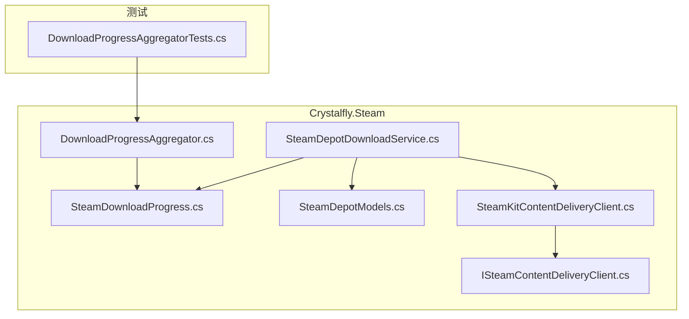
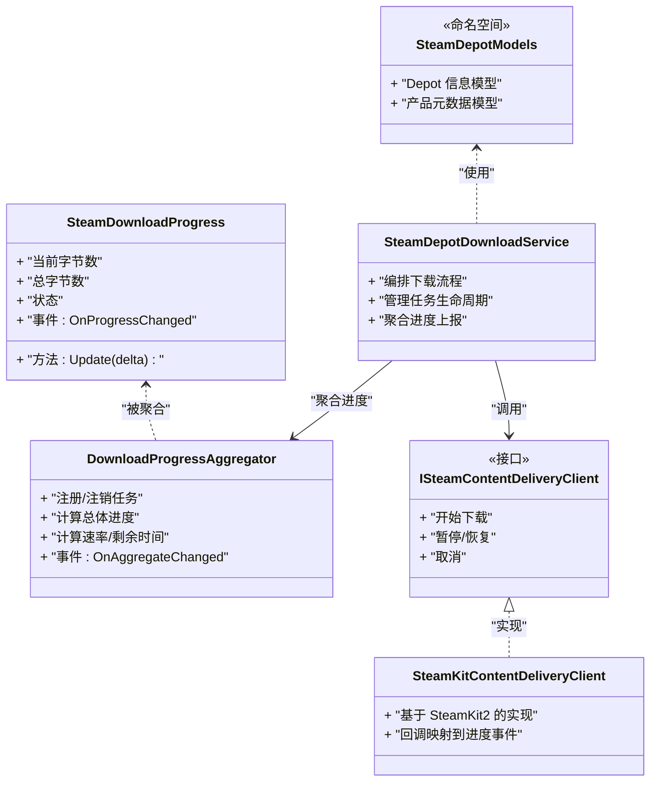
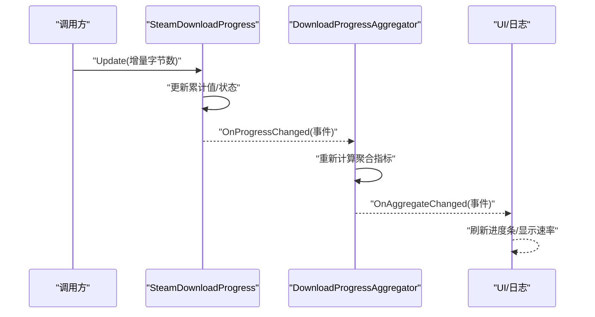
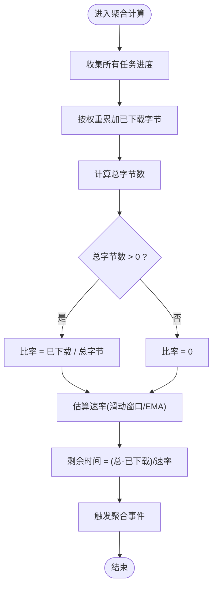
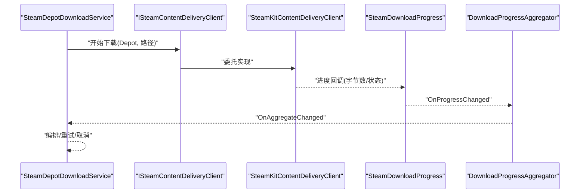
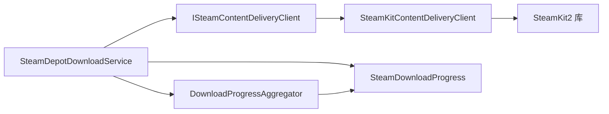

# Steam 数据模型和工具

<cite>
**本文引用的文件**   
- [SteamDepotModels.cs](file://src/Crystalfly.Steam/Downloads/SteamDepotModels.cs)
- [SteamDownloadProgress.cs](file://src/Crystalfly.Steam/Downloads/SteamDownloadProgress.cs)
- [DownloadProgressAggregator.cs](file://src/Crystalfly.Steam/Downloads/DownloadProgressAggregator.cs)
- [ISteamContentDeliveryClient.cs](file://src/Crystalfly.Steam/Downloads/ISteamContentDeliveryClient.cs)
- [SteamKitContentDeliveryClient.cs](file://src/Crystalfly.Steam/Downloads/SteamKitContentDeliveryClient.cs)
- [SteamDepotDownloadService.cs](file://src/Crystalfly.Steam/Downloads/SteamDepotDownloadService.cs)
- [Crystalfly.Steam.csproj](file://src/Crystalfly.Steam/Crystalfly.Steam.csproj)
- [DownloadProgressAggregatorTests.cs](file://tests/Crystalfly.Steam.Tests/Downloads/DownloadProgressAggregatorTests.cs)
</cite>

## 目录
1. [简介](#简介)
2. [项目结构](#项目结构)
3. [核心组件](#核心组件)
4. [架构总览](#架构总览)
5. [详细组件分析](#详细组件分析)
6. [依赖关系分析](#依赖关系分析)
7. [性能考量](#性能考量)
8. [故障排查指南](#故障排查指南)
9. [结论](#结论)
10. [附录](#附录)

## 简介
本技术文档聚焦于 Crystalfly 的 Steam 数据模型与下载进度工具，覆盖以下要点：
- Steam 相关数据结构定义：Depot 信息、产品元数据、下载进度模型。
- SteamDownloadProgress 类的进度跟踪机制与事件通知系统。
- DownloadProgressAggregator 的聚合算法与统计计算方法。
- 实际使用示例（对象序列化/反序列化）与与 SteamKit2 的数据类型映射策略。
- 数据验证规则与异常处理最佳实践。

## 项目结构
与 Steam 数据模型和下载进度相关的代码主要位于 Crystalfly.Steam 模块中，关键文件如下：
- 数据模型与产品元数据：SteamDepotModels.cs
- 下载进度模型与事件：SteamDownloadProgress.cs
- 进度聚合器：DownloadProgressAggregator.cs
- 内容交付客户端接口与实现：ISteamContentDeliveryClient.cs、SteamKitContentDeliveryClient.cs
- 下载服务编排：SteamDepotDownloadService.cs
- 测试用例：DownloadProgressAggregatorTests.cs

图表来源
- [SteamDepotModels.cs](file://src/Crystalfly.Steam/Downloads/SteamDepotModels.cs)
- [SteamDownloadProgress.cs](file://src/Crystalfly.Steam/Downloads/SteamDownloadProgress.cs)
- [DownloadProgressAggregator.cs](file://src/Crystalfly.Steam/Downloads/DownloadProgressAggregator.cs)
- [ISteamContentDeliveryClient.cs](file://src/Crystalfly.Steam/Downloads/ISteamContentDeliveryClient.cs)
- [SteamKitContentDeliveryClient.cs](file://src/Crystalfly.Steam/Downloads/SteamKitContentDeliveryClient.cs)
- [SteamDepotDownloadService.cs](file://src/Crystalfly.Steam/Downloads/SteamDepotDownloadService.cs)
- [DownloadProgressAggregatorTests.cs](file://tests/Crystalfly.Steam.Tests/Downloads/DownloadProgressAggregatorTests.cs)

章节来源
- [SteamDepotModels.cs](file://src/Crystalfly.Steam/Downloads/SteamDepotModels.cs)
- [SteamDownloadProgress.cs](file://src/Crystalfly.Steam/Downloads/SteamDownloadProgress.cs)
- [DownloadProgressAggregator.cs](file://src/Crystalfly.Steam/Downloads/DownloadProgressAggregator.cs)
- [ISteamContentDeliveryClient.cs](file://src/Crystalfly.Steam/Downloads/ISteamContentDeliveryClient.cs)
- [SteamKitContentDeliveryClient.cs](file://src/Crystalfly.Steam/Downloads/SteamKitContentDeliveryClient.cs)
- [SteamDepotDownloadService.cs](file://src/Crystalfly.Steam/Downloads/SteamDepotDownloadService.cs)
- [DownloadProgressAggregatorTests.cs](file://tests/Crystalfly.Steam.Tests/Downloads/DownloadProgressAggregatorTests.cs)

## 核心组件
本节概述各核心组件的职责与交互方式：
- 数据模型层：提供 Depot 信息、产品元数据等结构化数据，用于跨层传递与持久化。
- 进度模型层：封装单个任务或分片的下载进度，支持事件通知。
- 聚合层：汇总多个任务的进度，计算总体百分比、速率、剩余时间等统计指标。
- 客户端与服务层：对接 SteamKit2 进行内容分发，协调下载流程。

章节来源
- [SteamDepotModels.cs](file://src/Crystalfly.Steam/Downloads/SteamDepotModels.cs)
- [SteamDownloadProgress.cs](file://src/Crystalfly.Steam/Downloads/SteamDownloadProgress.cs)
- [DownloadProgressAggregator.cs](file://src/Crystalfly.Steam/Downloads/DownloadProgressAggregator.cs)
- [ISteamContentDeliveryClient.cs](file://src/Crystalfly.Steam/Downloads/ISteamContentDeliveryClient.cs)
- [SteamKitContentDeliveryClient.cs](file://src/Crystalfly.Steam/Downloads/SteamKitContentDeliveryClient.cs)
- [SteamDepotDownloadService.cs](file://src/Crystalfly.Steam/Downloads/SteamDepotDownloadService.cs)

## 架构总览
整体架构围绕“数据模型 + 进度模型 + 聚合器 + 客户端/服务”的分层组织，确保职责清晰、可测试性强。

图表来源
- [SteamDepotModels.cs](file://src/Crystalfly.Steam/Downloads/SteamDepotModels.cs)
- [SteamDownloadProgress.cs](file://src/Crystalfly.Steam/Downloads/SteamDownloadProgress.cs)
- [DownloadProgressAggregator.cs](file://src/Crystalfly.Steam/Downloads/DownloadProgressAggregator.cs)
- [ISteamContentDeliveryClient.cs](file://src/Crystalfly.Steam/Downloads/ISteamContentDeliveryClient.cs)
- [SteamKitContentDeliveryClient.cs](file://src/Crystalfly.Steam/Downloads/SteamKitContentDeliveryClient.cs)
- [SteamDepotDownloadService.cs](file://src/Crystalfly.Steam/Downloads/SteamDepotDownloadService.cs)

## 详细组件分析

### 数据模型：Depot 信息与产品元数据
- 目标：为上层业务提供稳定的 Depot 与产品信息载体，便于序列化和跨模块共享。
- 关注点：
  - 字段完整性：包含必要的标识符、版本、大小、校验信息等。
  - 可扩展性：预留扩展字段，兼容未来 Steam 平台变更。
  - 不可变性：在可能的情况下采用只读属性，避免并发修改导致不一致。
- 典型用法：
  - 从服务端或本地缓存加载后，转换为内部模型供下载服务使用。
  - 作为 UI 展示与日志记录的数据源。

章节来源
- [SteamDepotModels.cs](file://src/Crystalfly.Steam/Downloads/SteamDepotModels.cs)

### 进度模型：SteamDownloadProgress
- 目标：表示单个下载任务或分片的实时进度，并提供事件通知。
- 关键能力：
  - 增量更新：通过增量字节数更新累计进度，避免重复计算。
  - 状态机：区分空闲、进行中、完成、失败等状态，驱动 UI 与聚合逻辑。
  - 事件通知：当进度变化时触发事件，供订阅者刷新界面或记录日志。
- 线程安全：
  - 对共享状态的更新需加锁或使用原子操作，防止竞态条件。
  - 事件派发应在安全的上下文执行，避免阻塞底层回调。

图表来源
- [SteamDownloadProgress.cs](file://src/Crystalfly.Steam/Downloads/SteamDownloadProgress.cs)
- [DownloadProgressAggregator.cs](file://src/Crystalfly.Steam/Downloads/DownloadProgressAggregator.cs)

章节来源
- [SteamDownloadProgress.cs](file://src/Crystalfly.Steam/Downloads/SteamDownloadProgress.cs)
- [DownloadProgressAggregator.cs](file://src/Crystalfly.Steam/Downloads/DownloadProgressAggregator.cs)

### 聚合器：DownloadProgressAggregator
- 目标：汇总多个任务的进度，计算总体百分比、平均速率、剩余时间等统计指标。
- 聚合算法要点：
  - 加权平均：根据每个任务的总字节数权重计算总体进度。
  - 速率估算：基于滑动窗口或指数移动平均，平滑瞬时波动。
  - 剩余时间：由当前速率与剩余字节数推导，考虑零速率边界情况。
- 事件与一致性：
  - 聚合结果变化时触发事件，保证 UI 与外部观察者及时刷新。
  - 在多线程环境下，聚合计算需具备幂等性与一致性。

图表来源
- [DownloadProgressAggregator.cs](file://src/Crystalfly.Steam/Downloads/DownloadProgressAggregator.cs)

章节来源
- [DownloadProgressAggregator.cs](file://src/Crystalfly.Steam/Downloads/DownloadProgressAggregator.cs)
- [DownloadProgressAggregatorTests.cs](file://tests/Crystalfly.Steam.Tests/Downloads/DownloadProgressAggregatorTests.cs)

### 客户端与服务：ISteamContentDeliveryClient 与 SteamKitContentDeliveryClient
- 接口契约：
  - 定义统一的下载控制方法（开始、暂停、恢复、取消）。
  - 统一进度回调与错误回调，屏蔽底层差异。
- 实现细节：
  - 基于 SteamKit2 的回调机制，将平台事件映射为内部进度事件。
  - 处理网络异常、认证失败、权限不足等场景，向上抛出标准化异常。
- 集成点：
  - 与 SteamDepotDownloadService 协作，负责具体数据传输与状态同步。

图表来源
- [ISteamContentDeliveryClient.cs](file://src/Crystalfly.Steam/Downloads/ISteamContentDeliveryClient.cs)
- [SteamKitContentDeliveryClient.cs](file://src/Crystalfly.Steam/Downloads/SteamKitContentDeliveryClient.cs)
- [SteamDepotDownloadService.cs](file://src/Crystalfly.Steam/Downloads/SteamDepotDownloadService.cs)
- [SteamDownloadProgress.cs](file://src/Crystalfly.Steam/Downloads/SteamDownloadProgress.cs)
- [DownloadProgressAggregator.cs](file://src/Crystalfly.Steam/Downloads/DownloadProgressAggregator.cs)

章节来源
- [ISteamContentDeliveryClient.cs](file://src/Crystalfly.Steam/Downloads/ISteamContentDeliveryClient.cs)
- [SteamKitContentDeliveryClient.cs](file://src/Crystalfly.Steam/Downloads/SteamKitContentDeliveryClient.cs)
- [SteamDepotDownloadService.cs](file://src/Crystalfly.Steam/Downloads/SteamDepotDownloadService.cs)

## 依赖关系分析
- 模块内依赖：
  - 服务层依赖客户端接口，降低耦合度，便于替换实现与单元测试。
  - 聚合器依赖进度模型，不直接访问底层传输细节。
- 外部依赖：
  - SteamKitContentDeliveryClient 依赖 SteamKit2 库，负责与 Steam 平台交互。
  - 项目文件声明了必要的 NuGet 包引用。

图表来源
- [SteamDepotDownloadService.cs](file://src/Crystalfly.Steam/Downloads/SteamDepotDownloadService.cs)
- [ISteamContentDeliveryClient.cs](file://src/Crystalfly.Steam/Downloads/ISteamContentDeliveryClient.cs)
- [SteamKitContentDeliveryClient.cs](file://src/Crystalfly.Steam/Downloads/SteamKitContentDeliveryClient.cs)
- [SteamDownloadProgress.cs](file://src/Crystalfly.Steam/Downloads/SteamDownloadProgress.cs)
- [DownloadProgressAggregator.cs](file://src/Crystalfly.Steam/Downloads/DownloadProgressAggregator.cs)
- [Crystalfly.Steam.csproj](file://src/Crystalfly.Steam/Crystalfly.Steam.csproj)

章节来源
- [Crystalfly.Steam.csproj](file://src/Crystalfly.Steam/Crystalfly.Steam.csproj)

## 性能考量
- 事件频率控制：
  - 对高频进度事件进行节流，避免 UI 频繁重绘与日志风暴。
- 聚合计算优化：
  - 使用增量更新与滑动窗口，减少全量扫描开销。
- 内存占用：
  - 大文件下载时避免一次性加载全部数据，采用流式写入。
- 并发安全：
  - 对共享状态加锁或使用无锁数据结构，确保高并发下的稳定性。

[本节为通用指导，无需特定文件来源]

## 故障排查指南
- 常见问题定位：
  - 进度不更新：检查进度事件是否被正确订阅与派发；确认聚合器是否正确注册任务。
  - 速率异常：查看滑动窗口长度与采样间隔；排除网络抖动导致的瞬时零速率。
  - 下载失败：核对客户端回调的错误码与异常类型；确认认证与权限配置。
- 建议措施：
  - 增加结构化日志，记录关键状态转换与异常堆栈。
  - 引入超时与重试策略，提升鲁棒性。
  - 使用断点续传与校验和验证，保障数据完整性。

章节来源
- [DownloadProgressAggregatorTests.cs](file://tests/Crystalfly.Steam.Tests/Downloads/DownloadProgressAggregatorTests.cs)

## 结论
本模块以清晰的分层设计与稳健的进度聚合机制，实现了与 Steam 平台的稳定集成。通过数据模型、进度模型与聚合器的解耦，既保证了可扩展性，也提升了可测试性与可维护性。后续可在速率估算、容错与监控方面持续优化。

[本节为总结性内容，无需特定文件来源]

## 附录

### 数据模型使用示例（序列化/反序列化）
- 说明：
  - 将 Depot 信息与产品元数据序列化为 JSON，便于存储与传输。
  - 从 JSON 反序列化为内部模型，供下载服务消费。
- 步骤概览：
  - 构造模型实例并填充必要字段。
  - 使用 JSON 序列化器输出字符串或字节流。
  - 读取输入并进行反序列化，校验关键字段非空与范围合法。
  - 将模型传递给下载服务启动任务。

章节来源
- [SteamDepotModels.cs](file://src/Crystalfly.Steam/Downloads/SteamDepotModels.cs)

### 与 SteamKit2 的数据类型映射与转换策略
- 说明：
  - 将 SteamKit2 的回调与实体类型映射到内部进度与错误模型。
  - 保持字段语义一致，必要时进行单位换算（如字节与块）。
- 策略要点：
  - 明确映射表与转换函数，集中管理以避免散落逻辑。
  - 对未知或新增字段做兼容处理，避免破坏性变更。
  - 在转换层进行数据验证与规范化，确保下游一致性。

章节来源
- [SteamKitContentDeliveryClient.cs](file://src/Crystalfly.Steam/Downloads/SteamKitContentDeliveryClient.cs)

### 数据验证规则与异常处理最佳实践
- 验证规则：
  - 必填字段非空检查（如 ID、大小、路径）。
  - 数值范围校验（如总字节数大于 0、进度百分比在 [0,1]）。
  - 格式校验（如版本号、时间戳）。
- 异常处理：
  - 区分可恢复与不可恢复错误，提供重试或降级策略。
  - 统一异常包装，保留原始上下文以便诊断。
  - 在 UI 层捕获并友好提示用户，避免崩溃。

章节来源
- [SteamDownloadProgress.cs](file://src/Crystalfly.Steam/Downloads/SteamDownloadProgress.cs)
- [DownloadProgressAggregator.cs](file://src/Crystalfly.Steam/Downloads/DownloadProgressAggregator.cs)
- [ISteamContentDeliveryClient.cs](file://src/Crystalfly.Steam/Downloads/ISteamContentDeliveryClient.cs)
- [SteamKitContentDeliveryClient.cs](file://src/Crystalfly.Steam/Downloads/SteamKitContentDeliveryClient.cs)
- [SteamDepotDownloadService.cs](file://src/Crystalfly.Steam/Downloads/SteamDepotDownloadService.cs)