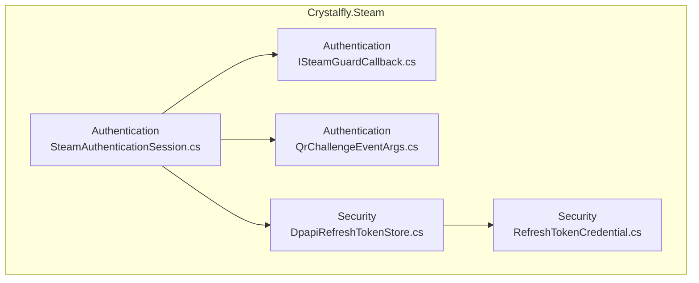
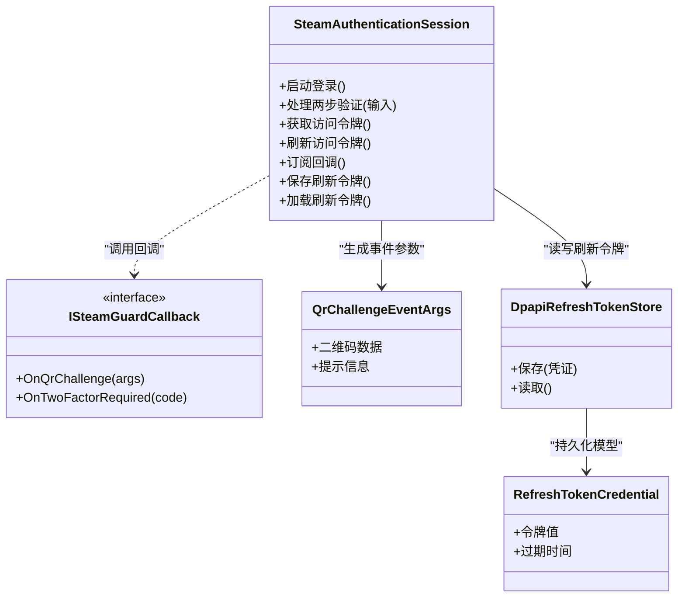
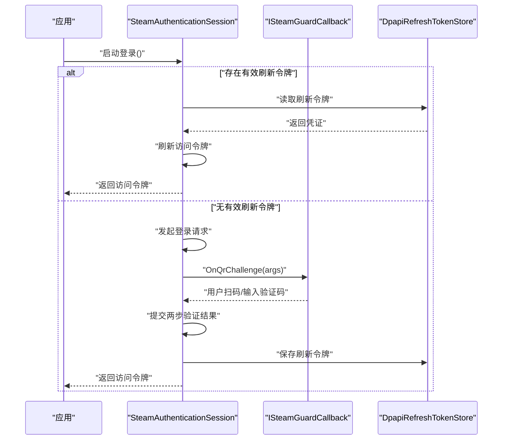
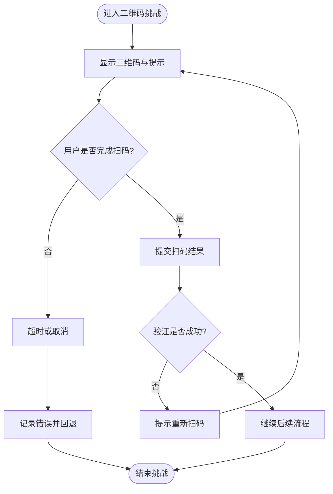
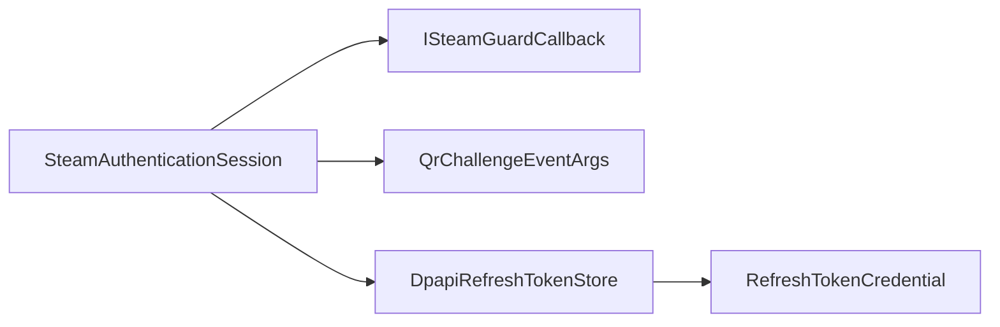

# Steam 认证系统

<cite>
**本文引用的文件**   
- [ISteamGuardCallback.cs](file://src/Crystalfly.Steam/Authentication/ISteamGuardCallback.cs)
- [QrChallengeEventArgs.cs](file://src/Crystalfly.Steam/Authentication/QrChallengeEventArgs.cs)
- [SteamAuthenticationSession.cs](file://src/Crystalfly.Steam/Authentication/SteamAuthenticationSession.cs)
- [DpapiRefreshTokenStore.cs](file://src/Crystalfly.Steam/Security/DpapiRefreshTokenStore.cs)
- [RefreshTokenCredential.cs](file://src/Crystalfly.Steam/Security/RefreshTokenCredential.cs)
</cite>

## 目录
1. [简介](#简介)
2. [项目结构](#项目结构)
3. [核心组件](#核心组件)
4. [架构总览](#架构总览)
5. [详细组件分析](#详细组件分析)
6. [依赖关系分析](#依赖关系分析)
7. [性能考虑](#性能考虑)
8. [故障排查指南](#故障排查指南)
9. [结论](#结论)
10. [附录](#附录)

## 简介
本技术文档聚焦 Crystalfly 的 Steam 认证子系统，围绕用户登录授权、两步验证（含二维码挑战）与会话管理展开。重点阐述以下方面：
- 用户认证流程的整体设计与关键步骤
- SteamAuthenticationSession 的状态跟踪、令牌获取与刷新策略
- ISteamGuardCallback 接口的设计与二维码挑战回调机制
- 安全存储与持久化（基于 DPAPI 的刷新令牌存储）
- 与 Steam 平台认证协议交互的安全考量
- 常见问题定位与调试技巧

## 项目结构
Steam 认证相关代码位于 Crystalfly.Steam 模块中，主要包含 Authentication 与 Security 两个子目录：
- Authentication：负责认证会话、状态机、事件与回调
- Security：负责刷新令牌的本地安全存储与模型定义

图表来源
- [ISteamGuardCallback.cs](file://src/Crystalfly.Steam/Authentication/ISteamGuardCallback.cs)
- [QrChallengeEventArgs.cs](file://src/Crystalfly.Steam/Authentication/QrChallengeEventArgs.cs)
- [SteamAuthenticationSession.cs](file://src/Crystalfly.Steam/Authentication/SteamAuthenticationSession.cs)
- [DpapiRefreshTokenStore.cs](file://src/Crystalfly.Steam/Security/DpapiRefreshTokenStore.cs)
- [RefreshTokenCredential.cs](file://src/Crystalfly.Steam/Security/RefreshTokenCredential.cs)

章节来源
- [ISteamGuardCallback.cs](file://src/Crystalfly.Steam/Authentication/ISteamGuardCallback.cs)
- [QrChallengeEventArgs.cs](file://src/Crystalfly.Steam/Authentication/QrChallengeEventArgs.cs)
- [SteamAuthenticationSession.cs](file://src/Crystalfly.Steam/Authentication/SteamAuthenticationSession.cs)
- [DpapiRefreshTokenStore.cs](file://src/Crystalfly.Steam/Security/DpapiRefreshTokenStore.cs)
- [RefreshTokenCredential.cs](file://src/Crystalfly.Steam/Security/RefreshTokenCredential.cs)

## 核心组件
- SteamAuthenticationSession：封装一次完整的 Steam 认证生命周期，包括发起登录、处理两步验证、获取并刷新访问令牌、维护会话状态等。
- ISteamGuardCallback：定义两步验证回调契约，用于在需要用户提供验证码或扫描 QR 码时通知上层 UI 或业务逻辑。
- QrChallengeEventArgs：承载二维码挑战所需的数据（如二维码内容、提示文本等），作为事件参数传递给回调。
- DpapiRefreshTokenStore：使用操作系统提供的 DPAPI 对刷新令牌进行本地加密存储，提供读取与写入能力。
- RefreshTokenCredential：表示刷新令牌的凭证模型，供存储层序列化/反序列化。

章节来源
- [SteamAuthenticationSession.cs](file://src/Crystalfly.Steam/Authentication/SteamAuthenticationSession.cs)
- [ISteamGuardCallback.cs](file://src/Crystalfly.Steam/Authentication/ISteamGuardCallback.cs)
- [QrChallengeEventArgs.cs](file://src/Crystalfly.Steam/Authentication/QrChallengeEventArgs.cs)
- [DpapiRefreshTokenStore.cs](file://src/Crystalfly.Steam/Security/DpapiRefreshTokenStore.cs)
- [RefreshTokenCredential.cs](file://src/Crystalfly.Steam/Security/RefreshTokenCredential.cs)

## 架构总览
下图展示了认证会话与回调、存储之间的交互关系。会话是控制中枢，负责协调外部回调与本地安全存储，完成从“开始登录”到“获得可用令牌”的完整流程。

图表来源
- [SteamAuthenticationSession.cs](file://src/Crystalfly.Steam/Authentication/SteamAuthenticationSession.cs)
- [ISteamGuardCallback.cs](file://src/Crystalfly.Steam/Authentication/ISteamGuardCallback.cs)
- [QrChallengeEventArgs.cs](file://src/Crystalfly.Steam/Authentication/QrChallengeEventArgs.cs)
- [DpapiRefreshTokenStore.cs](file://src/Crystalfly.Steam/Security/DpapiRefreshTokenStore.cs)
- [RefreshTokenCredential.cs](file://src/Crystalfly.Steam/Security/RefreshTokenCredential.cs)

## 详细组件分析

### SteamAuthenticationSession 工作机制
- 职责边界
  - 管理认证状态机：未登录、等待两步验证、已登录、令牌刷新中、错误等
  - 驱动登录流程：发起登录请求、监听回调、收集必要信息
  - 令牌管理：获取访问令牌、自动刷新、失败重试
  - 会话持久化：将刷新令牌安全落盘，下次启动可恢复
- 关键行为
  - 启动登录：根据是否有有效刷新令牌决定直接刷新还是走完整登录
  - 两步验证：当服务端要求二次验证时，通过 ISteamGuardCallback 触发 UI 展示二维码或输入验证码
  - 令牌刷新：在访问令牌过期前主动刷新，避免中断业务流程
  - 错误处理：区分网络错误、凭据无效、两步验证失败等，向上抛出明确异常或事件
- 复杂度与性能
  - 状态切换为 O(1)，网络 IO 为异步非阻塞
  - 刷新令牌采用幂等设计，避免并发重复刷新
  - 建议引入令牌过期前的预刷新窗口，降低失败率

章节来源
- [SteamAuthenticationSession.cs](file://src/Crystalfly.Steam/Authentication/SteamAuthenticationSession.cs)

#### 认证主流程时序图

图表来源
- [SteamAuthenticationSession.cs](file://src/Crystalfly.Steam/Authentication/SteamAuthenticationSession.cs)
- [ISteamGuardCallback.cs](file://src/Crystalfly.Steam/Authentication/ISteamGuardCallback.cs)
- [DpapiRefreshTokenStore.cs](file://src/Crystalfly.Steam/Security/DpapiRefreshTokenStore.cs)

### ISteamGuardCallback 接口与二维码挑战
- 设计目标
  - 解耦认证流程与 UI 实现，使会话不感知具体界面细节
  - 标准化两步验证事件，支持二维码与验证码两种形式
- 关键方法
  - OnQrChallenge：当需要扫描二维码时触发，携带二维码内容与提示
  - OnTwoFactorRequired：当需要手动输入验证码时触发，携带提示与输入框默认值
- 事件参数
  - QrChallengeEventArgs：包含二维码数据与用户可见的提示信息，便于渲染与引导

章节来源
- [ISteamGuardCallback.cs](file://src/Crystalfly.Steam/Authentication/ISteamGuardCallback.cs)
- [QrChallengeEventArgs.cs](file://src/Crystalfly.Steam/Authentication/QrChallengeEventArgs.cs)

#### 二维码挑战处理流程图

图表来源
- [ISteamGuardCallback.cs](file://src/Crystalfly.Steam/Authentication/ISteamGuardCallback.cs)
- [QrChallengeEventArgs.cs](file://src/Crystalfly.Steam/Authentication/QrChallengeEventArgs.cs)

### 刷新令牌安全存储（DPAPI）
- 存储策略
  - 使用 DPAPI 对刷新令牌进行本地加密，避免明文落地
  - 提供统一的读取/写入接口，屏蔽底层加密细节
- 数据结构
  - RefreshTokenCredential：包含令牌值与过期时间等元数据
- 安全性
  - 仅当前用户上下文可解密，防止跨用户泄露
  - 建议结合进程级保护与最小权限原则

章节来源
- [DpapiRefreshTokenStore.cs](file://src/Crystalfly.Steam/Security/DpapiRefreshTokenStore.cs)
- [RefreshTokenCredential.cs](file://src/Crystalfly.Steam/Security/RefreshTokenCredential.cs)

## 依赖关系分析
- 耦合度
  - SteamAuthenticationSession 与 ISteamGuardCallback 松耦合，通过接口抽象回调
  - 与 DpapiRefreshTokenStore 通过接口/类组合，便于替换存储实现
- 外部依赖
  - 操作系统 DPAPI（Windows）
  - Steam 认证服务（外部网络）
- 潜在循环依赖
  - 当前结构未见循环引用；若扩展回调或存储实现，需保持单向依赖

图表来源
- [SteamAuthenticationSession.cs](file://src/Crystalfly.Steam/Authentication/SteamAuthenticationSession.cs)
- [ISteamGuardCallback.cs](file://src/Crystalfly.Steam/Authentication/ISteamGuardCallback.cs)
- [QrChallengeEventArgs.cs](file://src/Crystalfly.Steam/Authentication/QrChallengeEventArgs.cs)
- [DpapiRefreshTokenStore.cs](file://src/Crystalfly.Steam/Security/DpapiRefreshTokenStore.cs)
- [RefreshTokenCredential.cs](file://src/Crystalfly.Steam/Security/RefreshTokenCredential.cs)

## 性能考虑
- 异步与非阻塞：所有网络与 IO 操作应异步执行，避免阻塞 UI 线程
- 令牌预刷新：在访问令牌剩余有效期低于阈值时提前刷新，减少失败重试
- 幂等刷新：并发场景下确保只进行一次刷新，其他请求复用同一结果
- 缓存与去抖：避免短时间内重复发起登录或刷新请求
- 资源释放：会话结束时及时释放回调订阅与临时资源

[本节为通用指导，无需源码引用]

## 故障排查指南
- 常见错误分类
  - 网络错误：DNS/连接超时/SSL 握手失败
  - 凭据无效：用户名/密码错误或账号被锁定
  - 两步验证失败：二维码过期、验证码错误、设备绑定问题
  - 刷新失败：DPAPI 解密失败、令牌损坏、权限不足
- 定位步骤
  - 检查回调是否触发：确认 OnQrChallenge/OnTwoFactorRequired 是否按预期调用
  - 检查存储读写：确认刷新令牌是否正确保存与读取
  - 查看错误码与消息：区分服务端错误与客户端错误
  - 复现路径：记录触发条件（网络环境、账号状态、设备信息）
- 调试技巧
  - 启用详细日志：记录关键状态转换与网络请求摘要
  - 模拟失败：注入网络延迟与错误响应，验证健壮性
  - 隔离测试：单独测试回调与存储实现，快速定位问题域

章节来源
- [SteamAuthenticationSession.cs](file://src/Crystalfly.Steam/Authentication/SteamAuthenticationSession.cs)
- [ISteamGuardCallback.cs](file://src/Crystalfly.Steam/Authentication/ISteamGuardCallback.cs)
- [DpapiRefreshTokenStore.cs](file://src/Crystalfly.Steam/Security/DpapiRefreshTokenStore.cs)

## 结论
Crystalfly 的 Steam 认证系统以 SteamAuthenticationSession 为核心，结合 ISteamGuardCallback 与 DPAPI 刷新令牌存储，实现了可扩展、可测试且安全的认证流程。通过清晰的状态机与回调契约，系统能够优雅地处理两步验证与令牌刷新，同时具备良好的错误处理与可观测性。建议在后续迭代中完善令牌预刷新策略、增强并发安全与增加端到端集成测试覆盖。

[本节为总结性内容，无需源码引用]

## 附录

### 实际认证操作示例（路径指引）
- 正常登录流程
  - 启动登录：参考 [SteamAuthenticationSession.cs](file://src/Crystalfly.Steam/Authentication/SteamAuthenticationSession.cs)
  - 处理二维码挑战：参考 [ISteamGuardCallback.cs](file://src/Crystalfly.Steam/Authentication/ISteamGuardCallback.cs)、[QrChallengeEventArgs.cs](file://src/Crystalfly.Steam/Authentication/QrChallengeEventArgs.cs)
  - 保存刷新令牌：参考 [DpapiRefreshTokenStore.cs](file://src/Crystalfly.Steam/Security/DpapiRefreshTokenStore.cs)
- 错误处理场景
  - 网络错误与重试：参考 [SteamAuthenticationSession.cs](file://src/Crystalfly.Steam/Authentication/SteamAuthenticationSession.cs)
  - 凭据无效与提示：参考 [ISteamGuardCallback.cs](file://src/Crystalfly.Steam/Authentication/ISteamGuardCallback.cs)
  - 存储失败与降级：参考 [DpapiRefreshTokenStore.cs](file://src/Crystalfly.Steam/Security/DpapiRefreshTokenStore.cs)

章节来源
- [SteamAuthenticationSession.cs](file://src/Crystalfly.Steam/Authentication/SteamAuthenticationSession.cs)
- [ISteamGuardCallback.cs](file://src/Crystalfly.Steam/Authentication/ISteamGuardCallback.cs)
- [QrChallengeEventArgs.cs](file://src/Crystalfly.Steam/Authentication/QrChallengeEventArgs.cs)
- [DpapiRefreshTokenStore.cs](file://src/Crystalfly.Steam/Security/DpapiRefreshTokenStore.cs)