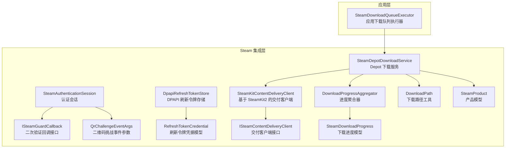
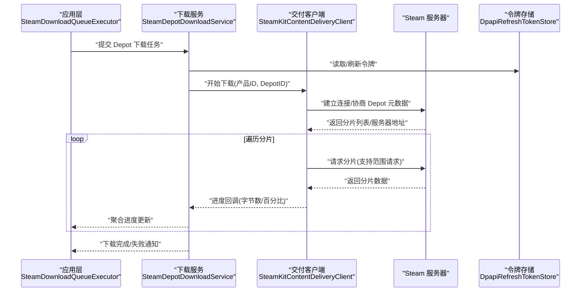
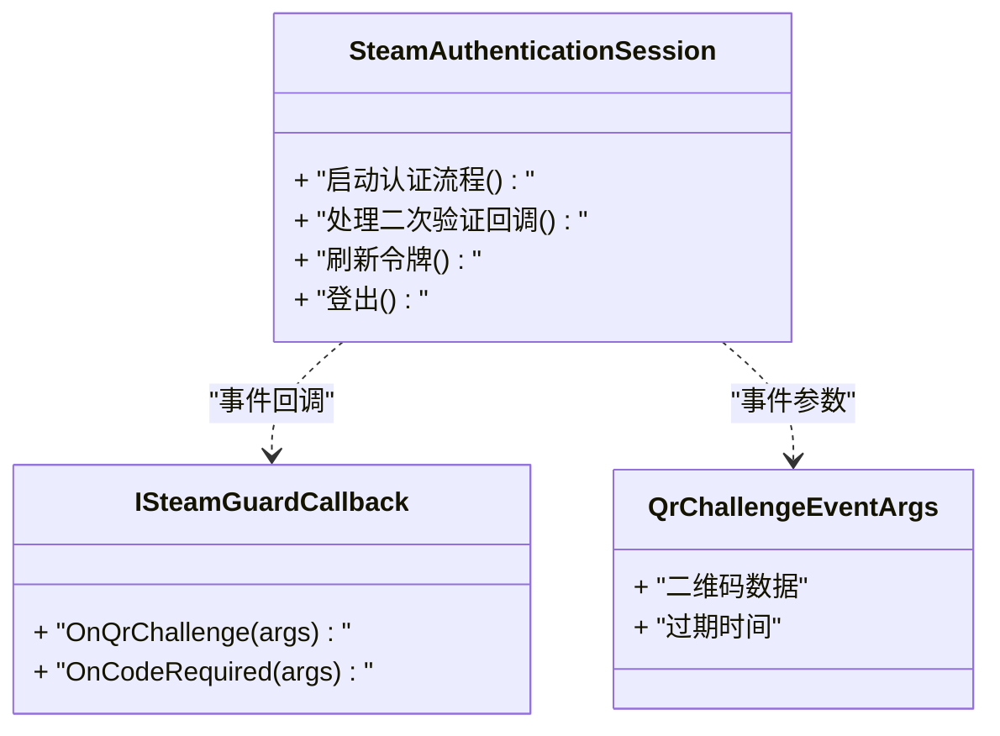
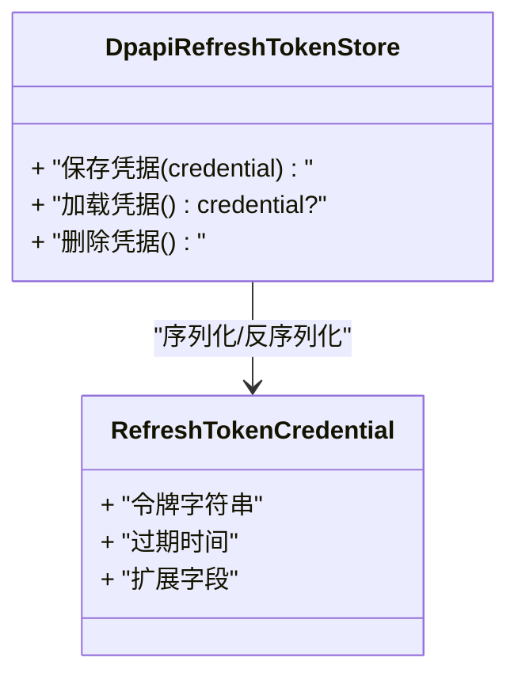
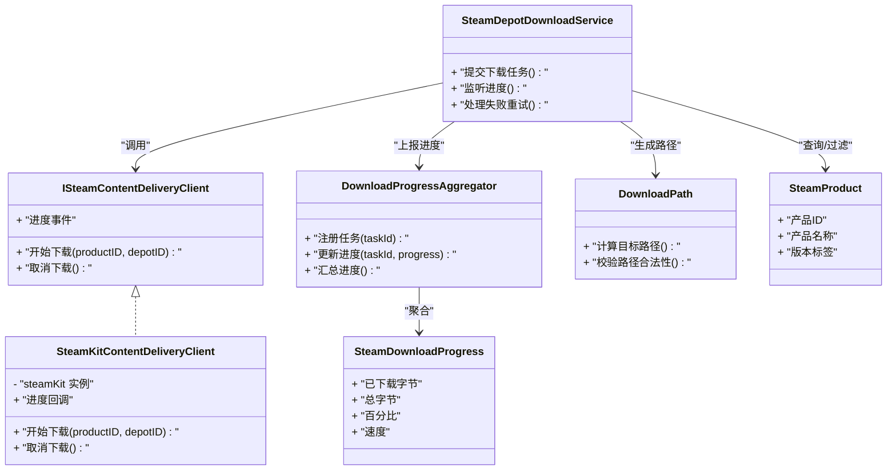
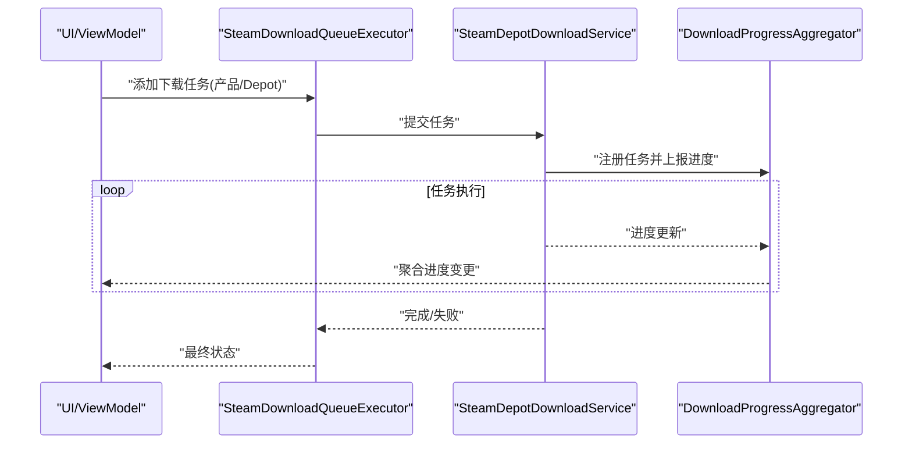
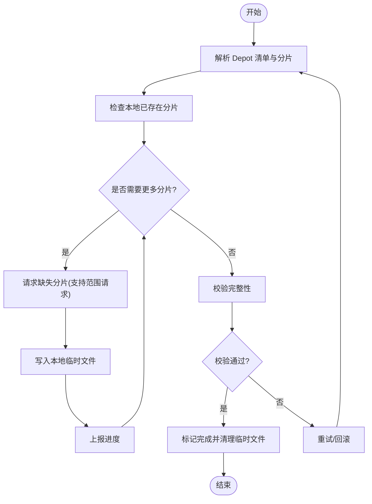
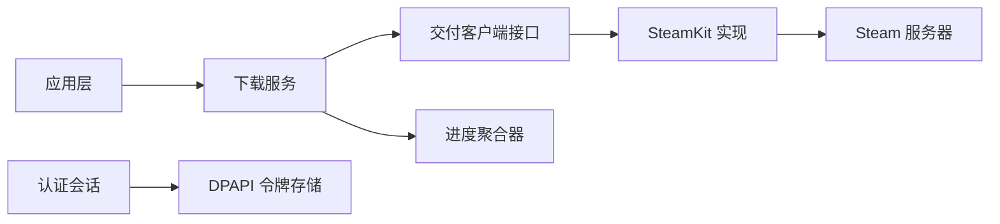

# Steam 集成服务

<cite>
**本文引用的文件**   
- [SteamAuthenticationSession.cs](file://src/Crystalfly.Steam/Authentication/SteamAuthenticationSession.cs)
- [ISteamGuardCallback.cs](file://src/Crystalfly.Steam/Authentication/ISteamGuardCallback.cs)
- [QrChallengeEventArgs.cs](file://src/Crystalfly.Steam/Authentication/QrChallengeEventArgs.cs)
- [DpapiRefreshTokenStore.cs](file://src/Crystalfly.Steam/Security/DpapiRefreshTokenStore.cs)
- [RefreshTokenCredential.cs](file://src/Crystalfly.Steam/Security/RefreshTokenCredential.cs)
- [SteamDepotDownloadService.cs](file://src/Crystalfly.Steam/Downloads/SteamDepotDownloadService.cs)
- [SteamKitContentDeliveryClient.cs](file://src/Crystalfly.Steam/Downloads/SteamKitContentDeliveryClient.cs)
- [ISteamContentDeliveryClient.cs](file://src/Crystalfly.Steam/Downloads/ISteamContentDeliveryClient.cs)
- [DownloadProgressAggregator.cs](file://src/Crystalfly.Steam/Downloads/DownloadProgressAggregator.cs)
- [SteamDownloadProgress.cs](file://src/Crystalfly.Steam/Downloads/SteamDownloadProgress.cs)
- [DownloadPath.cs](file://src/Crystalfly.Steam/Downloads/DownloadPath.cs)
- [SteamProduct.cs](file://src/Crystalfly.Steam/Downloads/SteamProduct.cs)
- [SteamDownloadQueueExecutor.cs](file://src/Crystalfly.App/Downloads/SteamDownloadQueueExecutor.cs)
- [Crystalfly.Steam.csproj](file://src/Crystalfly.Steam/Crystalfly.Steam.csproj)
</cite>

## 目录
1. [简介](#简介)
2. [项目结构](#项目结构)
3. [核心组件](#核心组件)
4. [架构总览](#架构总览)
5. [详细组件分析](#详细组件分析)
6. [依赖关系分析](#依赖关系分析)
7. [性能考虑](#性能考虑)
8. [故障排查指南](#故障排查指南)
9. [结论](#结论)
10. [附录](#附录)

## 简介
本技术文档面向 Crystalfly 的 Steam 集成服务，聚焦以下目标：
- 阐述 Steam 认证流程的实现，包括用户授权、令牌管理与会话维护。
- 说明内容下载服务的工作机制，涵盖 Depot 文件获取、断点续传与进度监控。
- 解释安全令牌存储的安全策略与加密机制。
- 给出 SteamKit2 库的集成模式与错误处理策略。
- 提供实际的认证与下载操作示例（以代码片段路径形式引用）。
- 说明与 Steam 平台的网络协议交互要点与性能优化技巧。
- 覆盖常见问题排查与安全最佳实践。

## 项目结构
Steam 集成相关代码主要位于 Crystalfly.Steam 与 Crystalfly.App 两个项目中：
- Crystalfly.Steam：封装 Steam 认证、安全令牌持久化、基于 SteamKit2 的内容交付客户端以及 Depot 下载编排。
- Crystalfly.App：在应用层将下载队列与 Steam 下载执行器组合，驱动 UI 与业务流程。

图表来源
- [SteamDownloadQueueExecutor.cs](file://src/Crystalfly.App/Downloads/SteamDownloadQueueExecutor.cs)
- [SteamDepotDownloadService.cs](file://src/Crystalfly.Steam/Downloads/SteamDepotDownloadService.cs)
- [SteamKitContentDeliveryClient.cs](file://src/Crystalfly.Steam/Downloads/SteamKitContentDeliveryClient.cs)
- [ISteamContentDeliveryClient.cs](file://src/Crystalfly.Steam/Downloads/ISteamContentDeliveryClient.cs)
- [DownloadProgressAggregator.cs](file://src/Crystalfly.Steam/Downloads/DownloadProgressAggregator.cs)
- [SteamDownloadProgress.cs](file://src/Crystalfly.Steam/Downloads/SteamDownloadProgress.cs)
- [DownloadPath.cs](file://src/Crystalfly.Steam/Downloads/DownloadPath.cs)
- [SteamProduct.cs](file://src/Crystalfly.Steam/Downloads/SteamProduct.cs)
- [SteamAuthenticationSession.cs](file://src/Crystalfly.Steam/Authentication/SteamAuthenticationSession.cs)
- [ISteamGuardCallback.cs](file://src/Crystalfly.Steam/Authentication/ISteamGuardCallback.cs)
- [QrChallengeEventArgs.cs](file://src/Crystalfly.Steam/Authentication/QrChallengeEventArgs.cs)
- [DpapiRefreshTokenStore.cs](file://src/Crystalfly.Steam/Security/DpapiRefreshTokenStore.cs)
- [RefreshTokenCredential.cs](file://src/Crystalfly.Steam/Security/RefreshTokenCredential.cs)

章节来源
- [Crystalfly.Steam.csproj](file://src/Crystalfly.Steam/Crystalfly.Steam.csproj)

## 核心组件
- 认证与会话
  - 认证会话负责发起登录、处理二次验证（含二维码挑战）、管理访问令牌与刷新令牌的生命周期。
  - 二次验证通过回调接口向上层暴露，支持扫码或输入验证码等交互。
- 安全令牌存储
  - 使用操作系统级 DPAPI 对刷新令牌进行本地加密持久化，避免明文落盘。
  - 提供凭据模型用于序列化与反序列化。
- 内容交付与下载
  - 交付客户端基于 SteamKit2 实现，负责与 Steam 服务器建立连接、协商 Depot 信息并拉取分片。
  - 下载服务编排 Depot 清单解析、分片调度、断点续传与进度上报。
  - 进度聚合器汇总多任务进度，供 UI 展示与业务逻辑消费。
- 应用层集成
  - 应用侧通过下载队列执行器协调多个 Depot 下载任务，统一生命周期与错误重试。

章节来源
- [SteamAuthenticationSession.cs](file://src/Crystalfly.Steam/Authentication/SteamAuthenticationSession.cs)
- [ISteamGuardCallback.cs](file://src/Crystalfly.Steam/Authentication/ISteamGuardCallback.cs)
- [QrChallengeEventArgs.cs](file://src/Crystalfly.Steam/Authentication/QrChallengeEventArgs.cs)
- [DpapiRefreshTokenStore.cs](file://src/Crystalfly.Steam/Security/DpapiRefreshTokenStore.cs)
- [RefreshTokenCredential.cs](file://src/Crystalfly.Steam/Security/RefreshTokenCredential.cs)
- [SteamKitContentDeliveryClient.cs](file://src/Crystalfly.Steam/Downloads/SteamKitContentDeliveryClient.cs)
- [ISteamContentDeliveryClient.cs](file://src/Crystalfly.Steam/Downloads/ISteamContentDeliveryClient.cs)
- [SteamDepotDownloadService.cs](file://src/Crystalfly.Steam/Downloads/SteamDepotDownloadService.cs)
- [DownloadProgressAggregator.cs](file://src/Crystalfly.Steam/Downloads/DownloadProgressAggregator.cs)
- [SteamDownloadProgress.cs](file://src/Crystalfly.Steam/Downloads/SteamDownloadProgress.cs)
- [DownloadPath.cs](file://src/Crystalfly.Steam/Downloads/DownloadPath.cs)
- [SteamProduct.cs](file://src/Crystalfly.Steam/Downloads/SteamProduct.cs)
- [SteamDownloadQueueExecutor.cs](file://src/Crystalfly.App/Downloads/SteamDownloadQueueExecutor.cs)

## 架构总览
下图展示了从应用层到 Steam 平台的关键交互路径：应用触发下载 -> 下载服务编排 -> 交付客户端调用 SteamKit2 -> 与 Steam 服务器通信完成 Depot 分片拉取；同时认证与会话为下载提供必要的凭据。

图表来源
- [SteamDownloadQueueExecutor.cs](file://src/Crystalfly.App/Downloads/SteamDownloadQueueExecutor.cs)
- [SteamDepotDownloadService.cs](file://src/Crystalfly.Steam/Downloads/SteamDepotDownloadService.cs)
- [SteamKitContentDeliveryClient.cs](file://src/Crystalfly.Steam/Downloads/SteamKitContentDeliveryClient.cs)
- [DpapiRefreshTokenStore.cs](file://src/Crystalfly.Steam/Security/DpapiRefreshTokenStore.cs)

## 详细组件分析

### 认证与会话组件
- 职责
  - 启动认证流程，处理用户名/密码或刷新令牌登录。
  - 处理二次验证（含二维码挑战），通过回调向 UI 层提示。
  - 管理访问令牌与刷新令牌的缓存与自动刷新。
- 关键类型与关系
  - 认证会话类负责状态机流转与事件发布。
  - 二次验证回调接口定义事件契约。
  - 二维码挑战事件参数承载二维码数据与超时等信息。

图表来源
- [SteamAuthenticationSession.cs](file://src/Crystalfly.Steam/Authentication/SteamAuthenticationSession.cs)
- [ISteamGuardCallback.cs](file://src/Crystalfly.Steam/Authentication/ISteamGuardCallback.cs)
- [QrChallengeEventArgs.cs](file://src/Crystalfly.Steam/Authentication/QrChallengeEventArgs.cs)

章节来源
- [SteamAuthenticationSession.cs](file://src/Crystalfly.Steam/Authentication/SteamAuthenticationSession.cs)
- [ISteamGuardCallback.cs](file://src/Crystalfly.Steam/Authentication/ISteamGuardCallback.cs)
- [QrChallengeEventArgs.cs](file://src/Crystalfly.Steam/Authentication/QrChallengeEventArgs.cs)

### 安全令牌存储组件
- 职责
  - 使用 DPAPI 对刷新令牌进行本地加密存储，降低泄露风险。
  - 提供凭据模型的序列化工具方法。
- 关键点
  - 仅当前用户上下文可解密，避免跨用户越权。
  - 建议结合定期轮换与最小权限原则。

图表来源
- [DpapiRefreshTokenStore.cs](file://src/Crystalfly.Steam/Security/DpapiRefreshTokenStore.cs)
- [RefreshTokenCredential.cs](file://src/Crystalfly.Steam/Security/RefreshTokenCredential.cs)

章节来源
- [DpapiRefreshTokenStore.cs](file://src/Crystalfly.Steam/Security/DpapiRefreshTokenStore.cs)
- [RefreshTokenCredential.cs](file://src/Crystalfly.Steam/Security/RefreshTokenCredential.cs)

### 内容交付与下载组件
- 职责
  - 交付客户端封装 SteamKit2 的 Depot 下载能力，抽象为统一的接口。
  - 下载服务负责解析 Depot 清单、调度分片、断点续传与进度上报。
  - 进度聚合器汇总多任务进度，供上层消费。
- 关键类型与关系

图表来源
- [ISteamContentDeliveryClient.cs](file://src/Crystalfly.Steam/Downloads/ISteamContentDeliveryClient.cs)
- [SteamKitContentDeliveryClient.cs](file://src/Crystalfly.Steam/Downloads/SteamKitContentDeliveryClient.cs)
- [SteamDepotDownloadService.cs](file://src/Crystalfly.Steam/Downloads/SteamDepotDownloadService.cs)
- [DownloadProgressAggregator.cs](file://src/Crystalfly.Steam/Downloads/DownloadProgressAggregator.cs)
- [SteamDownloadProgress.cs](file://src/Crystalfly.Steam/Downloads/SteamDownloadProgress.cs)
- [DownloadPath.cs](file://src/Crystalfly.Steam/Downloads/DownloadPath.cs)
- [SteamProduct.cs](file://src/Crystalfly.Steam/Downloads/SteamProduct.cs)

章节来源
- [ISteamContentDeliveryClient.cs](file://src/Crystalfly.Steam/Downloads/ISteamContentDeliveryClient.cs)
- [SteamKitContentDeliveryClient.cs](file://src/Crystalfly.Steam/Downloads/SteamKitContentDeliveryClient.cs)
- [SteamDepotDownloadService.cs](file://src/Crystalfly.Steam/Downloads/SteamDepotDownloadService.cs)
- [DownloadProgressAggregator.cs](file://src/Crystalfly.Steam/Downloads/DownloadProgressAggregator.cs)
- [SteamDownloadProgress.cs](file://src/Crystalfly.Steam/Downloads/SteamDownloadProgress.cs)
- [DownloadPath.cs](file://src/Crystalfly.Steam/Downloads/DownloadPath.cs)
- [SteamProduct.cs](file://src/Crystalfly.Steam/Downloads/SteamProduct.cs)

### 应用层下载执行器
- 职责
  - 将多个 Depot 下载任务组织为队列，按依赖顺序执行。
  - 统一错误处理、重试与取消语义。
  - 与 UI 绑定，实时展示下载状态。

图表来源
- [SteamDownloadQueueExecutor.cs](file://src/Crystalfly.App/Downloads/SteamDownloadQueueExecutor.cs)
- [SteamDepotDownloadService.cs](file://src/Crystalfly.Steam/Downloads/SteamDepotDownloadService.cs)
- [DownloadProgressAggregator.cs](file://src/Crystalfly.Steam/Downloads/DownloadProgressAggregator.cs)

章节来源
- [SteamDownloadQueueExecutor.cs](file://src/Crystalfly.App/Downloads/SteamDownloadQueueExecutor.cs)

### 算法流程图：断点续传与分片调度

图表来源
- [SteamDepotDownloadService.cs](file://src/Crystalfly.Steam/Downloads/SteamDepotDownloadService.cs)
- [SteamKitContentDeliveryClient.cs](file://src/Crystalfly.Steam/Downloads/SteamKitContentDeliveryClient.cs)

## 依赖关系分析
- 内部依赖
  - 应用层依赖下载服务与进度聚合器。
  - 下载服务依赖交付客户端接口及其 SteamKit2 实现。
  - 认证与会话为下载提供令牌来源。
- 外部依赖
  - SteamKit2：用于与 Steam 服务器通信、获取 Depot 元数据与分片数据。
  - DPAPI：用于本地加密存储刷新令牌。

图表来源
- [SteamDownloadQueueExecutor.cs](file://src/Crystalfly.App/Downloads/SteamDownloadQueueExecutor.cs)
- [SteamDepotDownloadService.cs](file://src/Crystalfly.Steam/Downloads/SteamDepotDownloadService.cs)
- [ISteamContentDeliveryClient.cs](file://src/Crystalfly.Steam/Downloads/ISteamContentDeliveryClient.cs)
- [SteamKitContentDeliveryClient.cs](file://src/Crystalfly.Steam/Downloads/SteamKitContentDeliveryClient.cs)
- [DpapiRefreshTokenStore.cs](file://src/Crystalfly.Steam/Security/DpapiRefreshTokenStore.cs)
- [SteamAuthenticationSession.cs](file://src/Crystalfly.Steam/Authentication/SteamAuthenticationSession.cs)

章节来源
- [Crystalfly.Steam.csproj](file://src/Crystalfly.Steam/Crystalfly.Steam.csproj)

## 性能考虑
- 并发控制
  - 合理限制并行下载的分片数量，避免磁盘 IO 与网络拥塞。
  - 针对大文件采用批量化写入与缓冲策略。
- 断点续传
  - 优先复用本地已有分片，减少重复下载。
  - 失败时快速定位缺失分片并增量恢复。
- 进度上报
  - 合并高频进度事件，降低 UI 渲染压力。
- 资源释放
  - 及时释放 SteamKit2 连接与文件句柄，避免泄漏。
- 网络优化
  - 根据服务器响应动态调整重试退避策略。
  - 启用 HTTP 范围请求以减少带宽浪费。

[本节为通用指导，不直接分析具体文件]

## 故障排查指南
- 认证问题
  - 二次验证失败：检查回调是否被正确订阅，确认二维码/验证码输入流程。
  - 令牌过期：确保刷新令牌有效并在必要时重新登录。
- 下载问题
  - 分片校验失败：检查磁盘空间与权限，清理临时文件后重试。
  - 网络中断：启用指数退避重试，记录失败分片以便断点续传。
- 性能问题
  - 高 CPU/IO：降低并发度，增大写入缓冲，避免频繁小文件写入。
- 日志与诊断
  - 记录关键事件（登录、令牌刷新、分片请求、校验结果）便于定位。

章节来源
- [SteamAuthenticationSession.cs](file://src/Crystalfly.Steam/Authentication/SteamAuthenticationSession.cs)
- [DpapiRefreshTokenStore.cs](file://src/Crystalfly.Steam/Security/DpapiRefreshTokenStore.cs)
- [SteamDepotDownloadService.cs](file://src/Crystalfly.Steam/Downloads/SteamDepotDownloadService.cs)
- [SteamKitContentDeliveryClient.cs](file://src/Crystalfly.Steam/Downloads/SteamKitContentDeliveryClient.cs)

## 结论
Crystalfly 的 Steam 集成服务通过清晰的组件分层与接口抽象，实现了稳健的认证与会话管理、高效的 Depot 下载与断点续传、以及安全的本地令牌存储。配合应用层的队列执行器与进度聚合，整体具备较好的可扩展性与可维护性。建议在后续迭代中持续完善错误分类、重试策略与性能监控指标。

[本节为总结性内容，不直接分析具体文件]

## 附录

### 实际代码示例（以路径引用代替代码内容）
- 认证与令牌管理
  - 启动认证流程与处理二次验证回调：
    - [SteamAuthenticationSession.cs](file://src/Crystalfly.Steam/Authentication/SteamAuthenticationSession.cs)
    - [ISteamGuardCallback.cs](file://src/Crystalfly.Steam/Authentication/ISteamGuardCallback.cs)
    - [QrChallengeEventArgs.cs](file://src/Crystalfly.Steam/Authentication/QrChallengeEventArgs.cs)
  - 刷新令牌持久化与加载：
    - [DpapiRefreshTokenStore.cs](file://src/Crystalfly.Steam/Security/DpapiRefreshTokenStore.cs)
    - [RefreshTokenCredential.cs](file://src/Crystalfly.Steam/Security/RefreshTokenCredential.cs)
- 下载与进度监控
  - 提交 Depot 下载任务与监听进度：
    - [SteamDepotDownloadService.cs](file://src/Crystalfly.Steam/Downloads/SteamDepotDownloadService.cs)
    - [DownloadProgressAggregator.cs](file://src/Crystalfly.Steam/Downloads/DownloadProgressAggregator.cs)
    - [SteamDownloadProgress.cs](file://src/Crystalfly.Steam/Downloads/SteamDownloadProgress.cs)
  - 基于 SteamKit2 的交付客户端实现：
    - [ISteamContentDeliveryClient.cs](file://src/Crystalfly.Steam/Downloads/ISteamContentDeliveryClient.cs)
    - [SteamKitContentDeliveryClient.cs](file://src/Crystalfly.Steam/Downloads/SteamKitContentDeliveryClient.cs)
  - 应用层下载队列执行器：
    - [SteamDownloadQueueExecutor.cs](file://src/Crystalfly.App/Downloads/SteamDownloadQueueExecutor.cs)

### 与 Steam 平台的网络协议交互要点
- 使用 SteamKit2 提供的 API 进行登录、获取 Depot 元数据与分片下载。
- 利用范围请求与分片校验提升可靠性与效率。
- 遵循速率限制与退避策略，避免触发服务端保护机制。

[本节为通用指导，不直接分析具体文件]

### 安全最佳实践
- 使用 DPAPI 加密敏感凭据，避免明文存储。
- 最小权限原则：仅授予必要权限与访问范围。
- 定期轮换令牌，缩短有效期窗口。
- 对异常与错误进行分类与告警，防止敏感信息泄露。

[本节为通用指导，不直接分析具体文件]