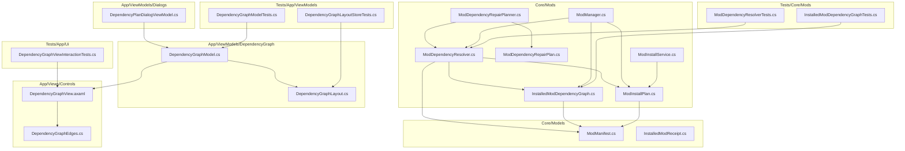
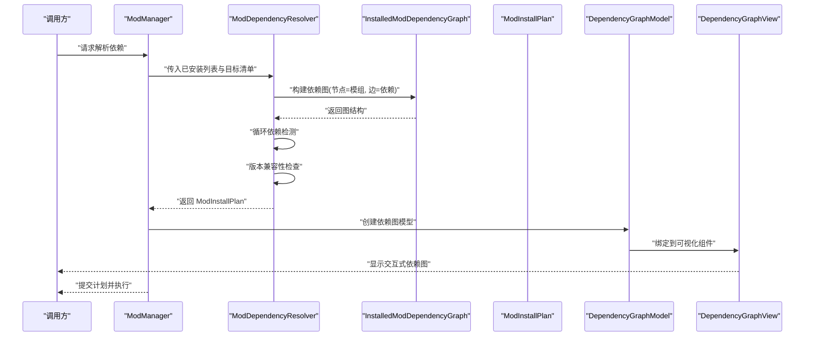
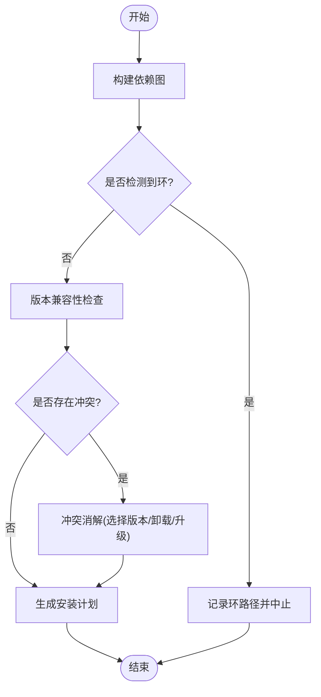
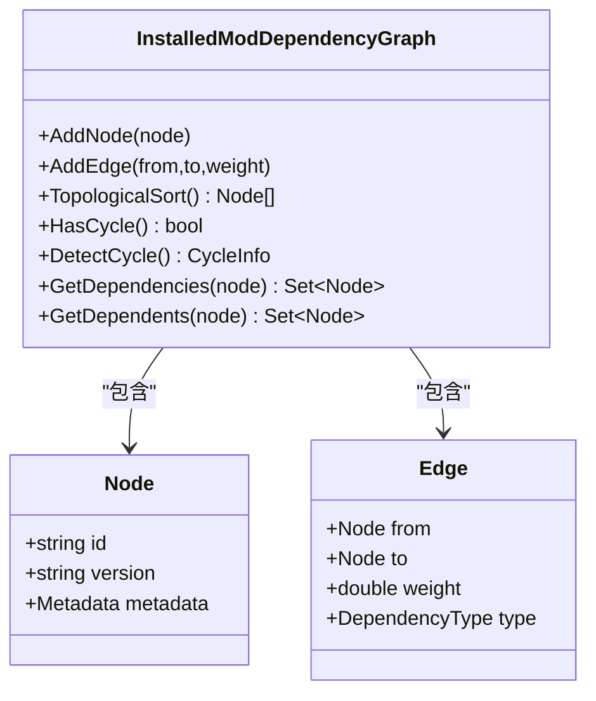
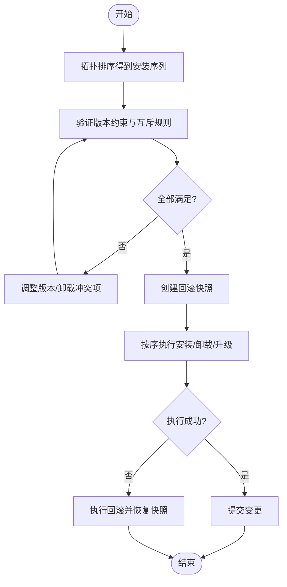
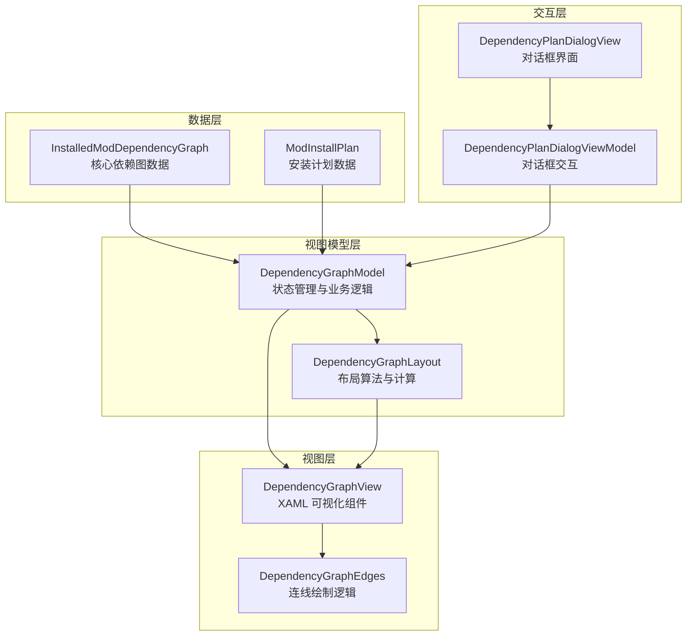
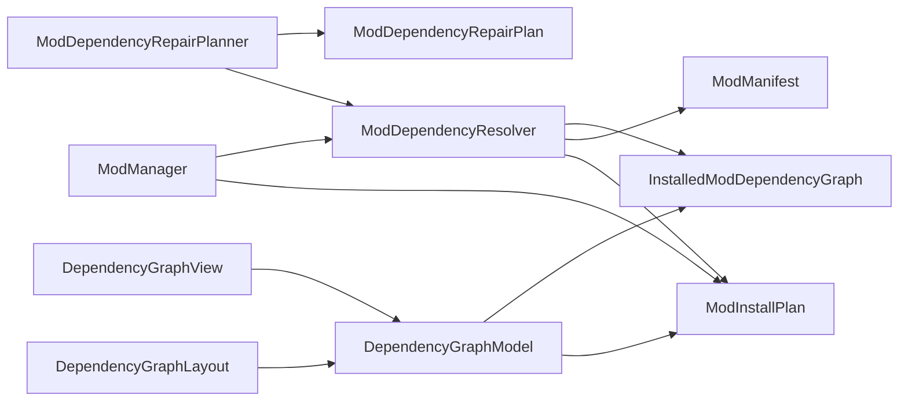

# 依赖解析引擎

<cite>
**本文引用的文件**   
- [ModDependencyResolver.cs](file://src/Crystalfly.Core/Mods/ModDependencyResolver.cs)
- [InstalledModDependencyGraph.cs](file://src/Crystalfly.Core/Mods/InstalledModDependencyGraph.cs)
- [ModInstallPlan.cs](file://src/Crystalfly.Core/Mods/ModInstallPlan.cs)
- [ModDependencyRepairPlanner.cs](file://src/Crystalfly.Core/Mods/ModDependencyRepairPlanner.cs)
- [ModDependencyRepairPlan.cs](file://src/Crystalfly.Core/Mods/ModDependencyRepairPlan.cs)
- [ModManager.cs](file://src/Crystalfly.Core/Mods/ModManager.cs)
- [ModManifest.cs](file://src/Crystalfly.Core/Models/ModManifest.cs)
- [InstalledModReceipt.cs](file://src/Crystalfly.Core/Models/InstalledModReceipt.cs)
- [ModInstallService.cs](file://src/Crystalfly.Core/Mods/ModInstallService.cs)
- [DependencyGraphModel.cs](file://src/Crystalfly.App/ViewModels/DependencyGraph/DependencyGraphModel.cs)
- [DependencyGraphLayout.cs](file://src/Crystalfly.App/ViewModels/DependencyGraph/DependencyGraphLayout.cs)
- [DependencyGraphView.axaml](file://src/Crystalfly.App/Views/Controls/DependencyGraphView.axaml)
- [DependencyGraphEdges.cs](file://src/Crystalfly.App/Views/Controls/DependencyGraphEdges.cs)
- [DependencyPlanDialogViewModel.cs](file://src/Crystalfly.App/ViewModels/Dialogs/DependencyPlanDialogViewModel.cs)
- [DependencyPlanDialogView.axaml](file://src/Crystalfly.App/Views/Dialogs/DependencyPlanDialogView.axaml)
- [DependencyGraphViewInteractionTests.cs](file://tests/Crystalfly.App.Tests/Ui/DependencyGraphViewInteractionTests.cs)
- [DependencyGraphModelTests.cs](file://tests/Crystalfly.App.Tests/ViewModels/DependencyGraphModelTests.cs)
- [DependencyGraphLayoutStoreTests.cs](file://tests/Crystalfly.App.Tests/ViewModels/DependencyGraphLayoutStoreTests.cs)
</cite>

## 更新摘要
**所做更改**   
- 新增交互式依赖图系统章节，详细说明新的可视化架构
- 更新核心组件部分，添加 DependencyGraphModel、DependencyGraphLayout、DependencyGraphView 组件说明
- 扩展架构总览，包含新的可视化层交互流程
- 新增交互式依赖图系统详细分析章节
- 更新项目结构图，反映新的 UI 组件层次
- 增强故障排查指南，包含可视化调试方法

## 目录
1. [简介](#简介)
2. [项目结构](#项目结构)
3. [核心组件](#核心组件)
4. [架构总览](#架构总览)
5. [详细组件分析](#详细组件分析)
6. [交互式依赖图系统](#交互式依赖图系统)
7. [依赖关系分析](#依赖关系分析)
8. [性能考虑](#性能考虑)
9. [故障排查指南](#故障排查指南)
10. [结论](#结论)
11. [附录](#附录)

## 简介
本技术文档聚焦 Crystalfly 的依赖解析引擎，围绕以下目标展开：
- 深入解释 ModDependencyResolver 的算法实现，包括依赖图构建、循环依赖检测、版本兼容性检查等核心逻辑。
- 详细说明 InstalledModDependencyGraph 的数据结构设计，包括节点关系、边权重与遍历算法。
- 阐述 ModInstallPlan 的生成策略，包括安装顺序优化、冲突解决方案与回滚机制。
- **新增** 详细介绍全新的交互式依赖图系统，包括 DependencyGraphModel、DependencyGraphLayout 和 DependencyGraphView 组件的实现原理。
- 提供复杂依赖场景的处理示例，包括多版本共存、条件依赖与可选依赖。
- 给出依赖解析的性能优化技巧与调试方法，并总结常见冲突问题的诊断思路。

## 项目结构
依赖解析相关代码位于 Core 层的 Mods 子目录，配合 Models 中的清单与收据模型，以及测试用例共同构成完整的解析与计划能力。**新增的交互式依赖图系统**位于 App 层的 ViewModels 和 Views 目录中，提供了强大的可视化功能。

**图表来源**
- [ModDependencyResolver.cs](file://src/Crystalfly.Core/Mods/ModDependencyResolver.cs)
- [InstalledModDependencyGraph.cs](file://src/Crystalfly.Core/Mods/InstalledModDependencyGraph.cs)
- [ModInstallPlan.cs](file://src/Crystalfly.Core/Mods/ModInstallPlan.cs)
- [DependencyGraphModel.cs](file://src/Crystalfly.App/ViewModels/DependencyGraph/DependencyGraphModel.cs)
- [DependencyGraphLayout.cs](file://src/Crystalfly.App/ViewModels/DependencyGraph/DependencyGraphLayout.cs)
- [DependencyGraphView.axaml](file://src/Crystalfly.App/Views/Controls/DependencyGraphView.axaml)
- [DependencyGraphEdges.cs](file://src/Crystalfly.App/Views/Controls/DependencyGraphEdges.cs)
- [DependencyPlanDialogViewModel.cs](file://src/Crystalfly.App/ViewModels/Dialogs/DependencyPlanDialogViewModel.cs)

**章节来源**
- [ModDependencyResolver.cs](file://src/Crystalfly.Core/Mods/ModDependencyResolver.cs)
- [InstalledModDependencyGraph.cs](file://src/Crystalfly.Core/Mods/InstalledModDependencyGraph.cs)
- [ModInstallPlan.cs](file://src/Crystalfly.Core/Mods/ModInstallPlan.cs)
- [DependencyGraphModel.cs](file://src/Crystalfly.App/ViewModels/DependencyGraph/DependencyGraphModel.cs)
- [DependencyGraphLayout.cs](file://src/Crystalfly.App/ViewModels/DependencyGraph/DependencyGraphLayout.cs)
- [DependencyGraphView.axaml](file://src/Crystalfly.App/Views/Controls/DependencyGraphView.axaml)

## 核心组件
- **ModDependencyResolver**：负责从已安装模组与清单中构建依赖图、进行版本兼容性与循环依赖检测，并输出可执行的安装计划。
- **InstalledModDependencyGraph**：以图结构表达已安装模组间的依赖关系，支持拓扑排序、环检测与路径查询。
- **ModInstallPlan**：描述一次安装操作的最小变更集，包含待安装/卸载/升级的模组序列及回滚信息。
- **ModDependencyRepairPlanner / ModDependencyRepairPlan**：在检测到不一致时生成修复计划（如降级、替换或重新安装）。
- **ModManager**：协调模组生命周期，调用解析器与计划执行器完成安装、卸载与修复。
- **DependencyGraphModel**：**新增** 交互式依赖图的核心数据模型，管理节点状态、选择状态和布局信息。
- **DependencyGraphLayout**：**新增** 依赖图的布局算法管理器，支持自动布局和手动调整。
- **DependencyGraphView**：**新增** 依赖图的可视化组件，提供交互式的图形界面。
- **DependencyPlanDialogViewModel**：**新增** 依赖计划对话框的视图模型，用于展示和操作依赖解析结果。
- **ModManifest / InstalledModReceipt**：定义模组元数据与已安装凭证，为解析与校验提供基础数据。

**章节来源**
- [ModDependencyResolver.cs](file://src/Crystalfly.Core/Mods/ModDependencyResolver.cs)
- [InstalledModDependencyGraph.cs](file://src/Crystalfly.Core/Mods/InstalledModDependencyGraph.cs)
- [ModInstallPlan.cs](file://src/Crystalfly.Core/Mods/ModInstallPlan.cs)
- [DependencyGraphModel.cs](file://src/Crystalfly.App/ViewModels/DependencyGraph/DependencyGraphModel.cs)
- [DependencyGraphLayout.cs](file://src/Crystalfly.App/ViewModels/DependencyGraph/DependencyGraphLayout.cs)
- [DependencyGraphView.axaml](file://src/Crystalfly.App/Views/Controls/DependencyGraphView.axaml)

## 架构总览
下图展示了依赖解析的关键流程，**新增了交互式可视化层**，从已安装状态与清单出发，构建依赖图，进行环检测与版本约束求解，最终产出安装计划并通过交互式界面展示。

**图表来源**
- [ModDependencyResolver.cs](file://src/Crystalfly.Core/Mods/ModDependencyResolver.cs)
- [InstalledModDependencyGraph.cs](file://src/Crystalfly.Core/Mods/InstalledModDependencyGraph.cs)
- [ModInstallPlan.cs](file://src/Crystalfly.Core/Mods/ModInstallPlan.cs)
- [DependencyGraphModel.cs](file://src/Crystalfly.App/ViewModels/DependencyGraph/DependencyGraphModel.cs)
- [DependencyGraphView.axaml](file://src/Crystalfly.App/Views/Controls/DependencyGraphView.axaml)

## 详细组件分析

### ModDependencyResolver 算法实现
- **输入**
  - 已安装模组集合（来自实例扫描与收据）
  - 目标清单（含所需模组及其版本范围）
- **处理步骤**
  - 依赖图构建：将每个模组作为节点，根据清单声明的依赖建立有向边；同时合并已安装模组的实际依赖。
  - 循环依赖检测：基于深度优先搜索或拓扑排序判定是否存在环；若存在，记录环路径以便诊断。
  - 版本兼容性检查：对每条依赖边，比较需求版本范围与实际安装版本，标记不满足的边与候选解空间。
  - 冲突消解：当同一模组存在多个候选版本或相互排斥时，依据优先级策略选择最优版本；必要时引入卸载/升级动作。
  - 计划生成：综合上述结果，生成最小变更的安装计划，确保无环且满足所有约束。
- **输出**
  - ModInstallPlan：包含待安装、卸载、升级的有序动作序列，以及回滚所需的快照信息。

**图表来源**
- [ModDependencyResolver.cs](file://src/Crystalfly.Core/Mods/ModDependencyResolver.cs)
- [InstalledModDependencyGraph.cs](file://src/Crystalfly.Core/Mods/InstalledModDependencyGraph.cs)
- [ModInstallPlan.cs](file://src/Crystalfly.Core/Mods/ModInstallPlan.cs)

**章节来源**
- [ModDependencyResolver.cs](file://src/Crystalfly.Core/Mods/ModDependencyResolver.cs)
- [InstalledModDependencyGraph.cs](file://src/Crystalfly.Core/Mods/InstalledModDependencyGraph.cs)
- [ModInstallPlan.cs](file://src/Crystalfly.Core/Mods/ModInstallPlan.cs)

### InstalledModDependencyGraph 数据结构与遍历
- **节点与边**
  - 节点：代表一个已安装模组，携带标识、版本与元数据。
  - 边：表示"需要"或"可选"依赖关系，附带权重（例如重要性、稳定性评分），用于排序与冲突消解。
- **关键操作**
  - AddNode/AddEdge：增量构建图。
  - TopologicalSort：按依赖顺序输出安装序列。
  - HasCycle/DetectCycle：判断并定位环。
  - GetDependencies/GetDependents：查询直接/间接依赖与反向影响面。
- **复杂度**
  - 构建：O(V+E)，V 为节点数，E 为边数。
  - 拓扑排序：O(V+E)。
  - 环检测：O(V+E)。
  - 查询：取决于具体实现，通常为 O(1) 到 O(V+E)。

**图表来源**
- [InstalledModDependencyGraph.cs](file://src/Crystalfly.Core/Mods/InstalledModDependencyGraph.cs)

**章节来源**
- [InstalledModDependencyGraph.cs](file://src/Crystalfly.Core/Mods/InstalledModDependencyGraph.cs)

### ModInstallPlan 生成策略
- **安装顺序优化**
  - 基于拓扑排序保证先安装被依赖项，后安装依赖者。
  - 对可选依赖采用延迟安装策略，仅在显式启用时纳入计划。
- **冲突解决方案**
  - 多版本共存：允许不同模组使用同一库的不同版本，通过命名空间隔离或沙箱化避免冲突。
  - 互斥依赖：当两个模组要求同一组件的不同版本且无法共存时，选择优先级更高的方案，并记录卸载动作。
- **回滚机制**
  - 在执行前创建快照（记录受影响文件与清单状态）。
  - 若执行失败，按逆序撤销动作并恢复快照，确保一致性。

**图表来源**
- [ModInstallPlan.cs](file://src/Crystalfly.Core/Mods/ModInstallPlan.cs)
- [ModDependencyResolver.cs](file://src/Crystalfly.Core/Mods/ModDependencyResolver.cs)

**章节来源**
- [ModInstallPlan.cs](file://src/Crystalfly.Core/Mods/ModInstallPlan.cs)
- [ModDependencyResolver.cs](file://src/Crystalfly.Core/Mods/ModDependencyResolver.cs)

### 复杂依赖场景处理示例
- **多版本共存**
  - 场景：模组 A 需要库 X v1.x，模组 B 需要库 X v2.x。
  - 处理：若运行时支持多版本隔离，则保留两版本；否则选择最兼容版本并提示用户。
- **条件依赖**
  - 场景：模组 C 仅在游戏模式为"速通"时才需要模组 D。
  - 处理：解析阶段评估条件表达式，动态决定是否加入依赖边。
- **可选依赖**
  - 场景：模组 E 可选依赖模组 F，以提升功能。
  - 处理：默认不强制安装 F；若用户启用增强模式，则将 F 纳入计划并按需安装。

## 交互式依赖图系统

### 系统架构概述
Crystalfly 的依赖解析引擎现已完全重构为交互式依赖图系统，取代了传统的树形可视化。新系统采用 MVVM 架构模式，包含三个核心组件：

**图表来源**
- [DependencyGraphModel.cs](file://src/Crystalfly.App/ViewModels/DependencyGraph/DependencyGraphModel.cs)
- [DependencyGraphLayout.cs](file://src/Crystalfly.App/ViewModels/DependencyGraph/DependencyGraphLayout.cs)
- [DependencyGraphView.axaml](file://src/Crystalfly.App/Views/Controls/DependencyGraphView.axaml)
- [DependencyGraphEdges.cs](file://src/Crystalfly.App/Views/Controls/DependencyGraphEdges.cs)
- [DependencyPlanDialogViewModel.cs](file://src/Crystalfly.App/ViewModels/Dialogs/DependencyPlanDialogViewModel.cs)

### DependencyGraphModel 核心功能
DependencyGraphModel 作为依赖图系统的核心数据模型，负责管理整个依赖关系的可视化和交互状态：

- **节点管理**
  - 维护所有模组节点的集合，包括节点位置、大小、颜色状态
  - 支持节点的增删改查操作
  - 跟踪节点的选中状态和高亮状态
- **边关系管理**
  - 存储依赖关系边的连接信息
  - 支持不同类型的依赖关系（必需、可选、条件）
  - 管理边的样式和箭头方向
- **状态同步**
  - 与底层 InstalledModDependencyGraph 保持数据同步
  - 响应依赖关系变化事件
  - 维护视图状态的一致性

### DependencyGraphLayout 布局算法
DependencyGraphLayout 实现了多种布局算法，支持自动布局和手动调整：

- **自动布局算法**
  - 层次布局：按照依赖层级从上到下排列节点
  - 力导向布局：基于物理模拟的节点分布
  - 环形布局：适合圆形依赖关系的展示
- **交互布局**
  - 支持拖拽节点调整位置
  - 实时重算连线坐标
  - 智能避让算法避免重叠

### DependencyGraphView 可视化组件
DependencyGraphView 是基于 Avalonia UI 的自定义控件，提供丰富的可视化功能：

- **渲染特性**
  - 高性能 Canvas 渲染
  - 支持缩放和平移操作
  - 节点和连线的动画效果
- **交互功能**
  - 鼠标悬停高亮
  - 点击选择和框选
  - 右键上下文菜单
  - 键盘快捷键支持

**章节来源**
- [DependencyGraphModel.cs](file://src/Crystalfly.App/ViewModels/DependencyGraph/DependencyGraphModel.cs)
- [DependencyGraphLayout.cs](file://src/Crystalfly.App/ViewModels/DependencyGraph/DependencyGraphLayout.cs)
- [DependencyGraphView.axaml](file://src/Crystalfly.App/Views/Controls/DependencyGraphView.axaml)
- [DependencyGraphEdges.cs](file://src/Crystalfly.App/Views/Controls/DependencyGraphEdges.cs)

## 依赖关系分析
- **组件耦合**
  - ModDependencyResolver 强依赖 InstalledModDependencyGraph 与 ModManifest。
  - ModInstallPlan 由 Resolver 生成，并由 ModManager 调度执行。
  - ModDependencyRepairPlanner 在检测到不一致时介入，生成修复计划。
  - **新增** DependencyGraphModel 依赖 InstalledModDependencyGraph 和 ModInstallPlan 作为数据源。
  - **新增** DependencyGraphView 通过 DataBinding 与 DependencyGraphModel 进行数据同步。
- **外部集成点**
  - 清单与收据模型提供权威数据源。
  - 文件系统事务与快照服务用于原子执行与回滚。
  - **新增** Avalonia UI 框架提供跨平台可视化能力。

**图表来源**
- [ModDependencyResolver.cs](file://src/Crystalfly.Core/Mods/ModDependencyResolver.cs)
- [InstalledModDependencyGraph.cs](file://src/Crystalfly.Core/Mods/InstalledModDependencyGraph.cs)
- [ModInstallPlan.cs](file://src/Crystalfly.Core/Mods/ModInstallPlan.cs)
- [DependencyGraphModel.cs](file://src/Crystalfly.App/ViewModels/DependencyGraph/DependencyGraphModel.cs)
- [DependencyGraphView.axaml](file://src/Crystalfly.App/Views/Controls/DependencyGraphView.axaml)

**章节来源**
- [ModDependencyResolver.cs](file://src/Crystalfly.Core/Mods/ModDependencyResolver.cs)
- [InstalledModDependencyGraph.cs](file://src/Crystalfly.Core/Mods/InstalledModDependencyGraph.cs)
- [ModInstallPlan.cs](file://src/Crystalfly.Core/Mods/ModInstallPlan.cs)
- [DependencyGraphModel.cs](file://src/Crystalfly.App/ViewModels/DependencyGraph/DependencyGraphModel.cs)
- [DependencyGraphView.axaml](file://src/Crystalfly.App/Views/Controls/DependencyGraphView.axaml)

## 性能考虑
- **图构建优化**
  - 增量更新：仅对变更的模组重建相关子图，避免全量重算。
  - 缓存依赖闭包：对频繁查询的依赖集合进行缓存，降低重复计算。
- **版本检查优化**
  - 预计算版本区间交集：在解析前对常用库的版本范围做索引，加速匹配。
  - 短路策略：一旦检测到不可满足的硬约束，立即中止后续分支。
- **计划生成优化**
  - 并行化非冲突动作：对无依赖关系的安装任务可并发执行。
  - 批处理回滚：将多次小变更合并为一次事务，减少 IO 开销。
- **可视化性能优化**
  - **新增** 虚拟渲染：仅渲染可见区域内的节点和连线。
  - **新增** 增量更新：只重绘发生变化的元素。
  - **新增** 异步布局：后台线程计算布局，避免阻塞 UI 线程。

## 故障排查指南
- **常见问题**
  - 循环依赖：检查环路径，确认是否有误声明或条件依赖未生效。
  - 版本冲突：查看冲突边与候选版本，评估是否可通过多版本共存解决。
  - 条件依赖失效：核对运行环境参数与条件表达式是否正确。
  - **新增** 可视化渲染问题：检查 DependencyGraphModel 的状态同步和数据绑定。
  - **新增** 布局异常：验证 DependencyGraphLayout 的算法配置和节点尺寸设置。
- **诊断工具**
  - 使用 InstalledModDependencyGraph 的环检测与依赖查询接口定位问题。
  - 借助 ModDependencyResolver 的诊断日志输出，观察解析阶段决策。
  - 通过 ModDependencyRepairPlanner 生成的修复计划，理解系统建议的修正路径。
  - **新增** 使用 DependencyGraphModel 的调试属性，监控状态变化事件。
  - **新增** 利用 Avalonia 调试工具检查 UI 渲染性能。
- **参考测试**
  - 查看 ModDependencyResolverTests 与 InstalledModDependencyGraphTests，了解典型用例与边界情况。
  - **新增** 查看 DependencyGraphModelTests 和 DependencyGraphLayoutStoreTests，验证新组件的正确性。
  - **新增** 参考 DependencyGraphViewInteractionTests，了解交互功能的测试方法。

**章节来源**
- [InstalledModDependencyGraph.cs](file://src/Crystalfly.Core/Mods/InstalledModDependencyGraph.cs)
- [ModDependencyResolver.cs](file://src/Crystalfly.Core/Mods/ModDependencyResolver.cs)
- [DependencyGraphModel.cs](file://src/Crystalfly.App/ViewModels/DependencyGraph/DependencyGraphModel.cs)
- [DependencyGraphLayout.cs](file://src/Crystalfly.App/ViewModels/DependencyGraph/DependencyGraphLayout.cs)
- [DependencyGraphViewInteractionTests.cs](file://tests/Crystalfly.App.Tests/Ui/DependencyGraphViewInteractionTests.cs)
- [DependencyGraphModelTests.cs](file://tests/Crystalfly.App.Tests/ViewModels/DependencyGraphModelTests.cs)
- [DependencyGraphLayoutStoreTests.cs](file://tests/Crystalfly.App.Tests/ViewModels/DependencyGraphLayoutStoreTests.cs)

## 结论
Crystalfly 的依赖解析引擎经过重大重构，已从传统的树形可视化完全转变为现代化的交互式依赖图系统。新系统以图为核心抽象，结合严格的版本约束与环检测，能够在复杂场景中稳定地生成可执行安装计划。通过合理的冲突消解策略与完善的回滚机制，系统在一致性与可用性之间取得良好平衡。

**新增的交互式依赖图系统**显著提升了用户体验，提供了直观的可视化界面和强大的交互功能。DependencyGraphModel、DependencyGraphLayout 和 DependencyGraphView 三个核心组件协同工作，实现了高性能的依赖关系可视化和操作。未来可在多版本共存与条件依赖方面进一步增强自动化与用户体验，同时继续优化可视化性能和交互体验。

## 附录
- **术语**
  - 依赖图：以模组为节点、依赖关系为边的有向图。
  - 拓扑排序：按依赖顺序排列节点的线性序列。
  - 回滚快照：在执行变更前保存的状态副本，用于失败恢复。
  - **新增** MVVM 模式：Model-View-ViewModel 架构设计模式。
  - **新增** 虚拟渲染：仅渲染可见区域内元素的渲染优化技术。
- **最佳实践**
  - 明确声明依赖版本范围，避免过宽导致歧义。
  - 合理使用可选依赖，提升模块化与灵活性。
  - 在大型模组生态中，定期维护依赖健康度报告。
  - **新增** 使用合适的布局算法，确保依赖关系的清晰展示。
  - **新增** 实现增量更新，提高大规模依赖图的渲染性能。