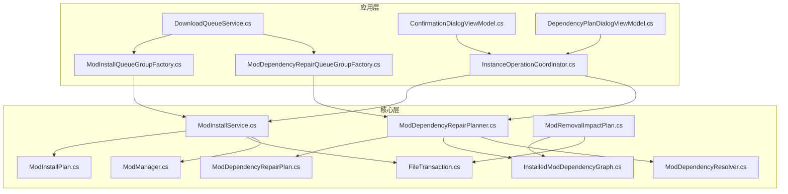
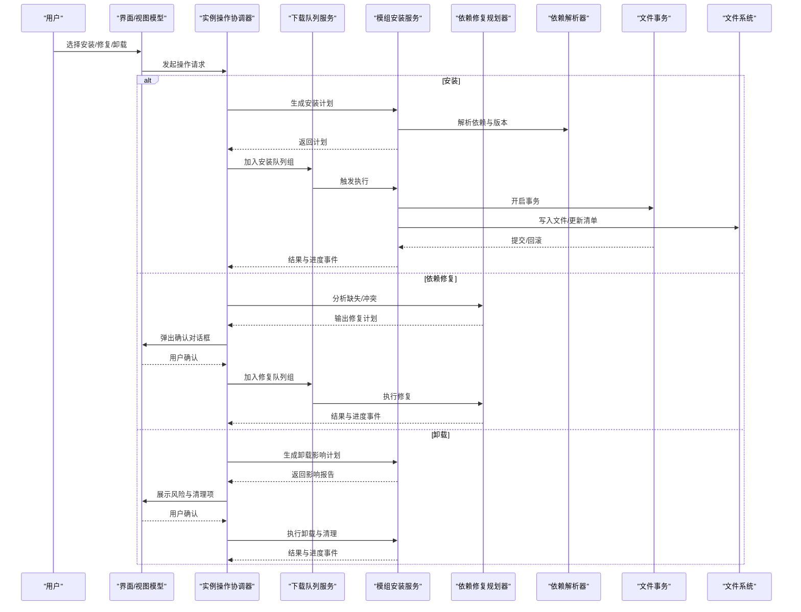
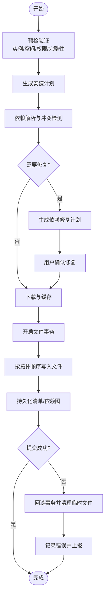
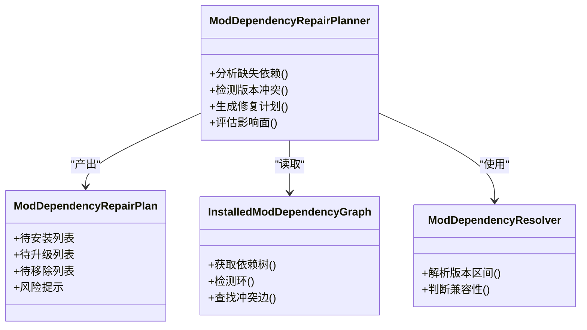
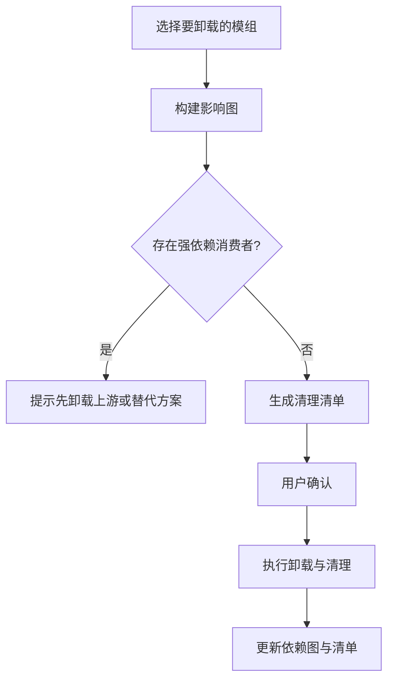
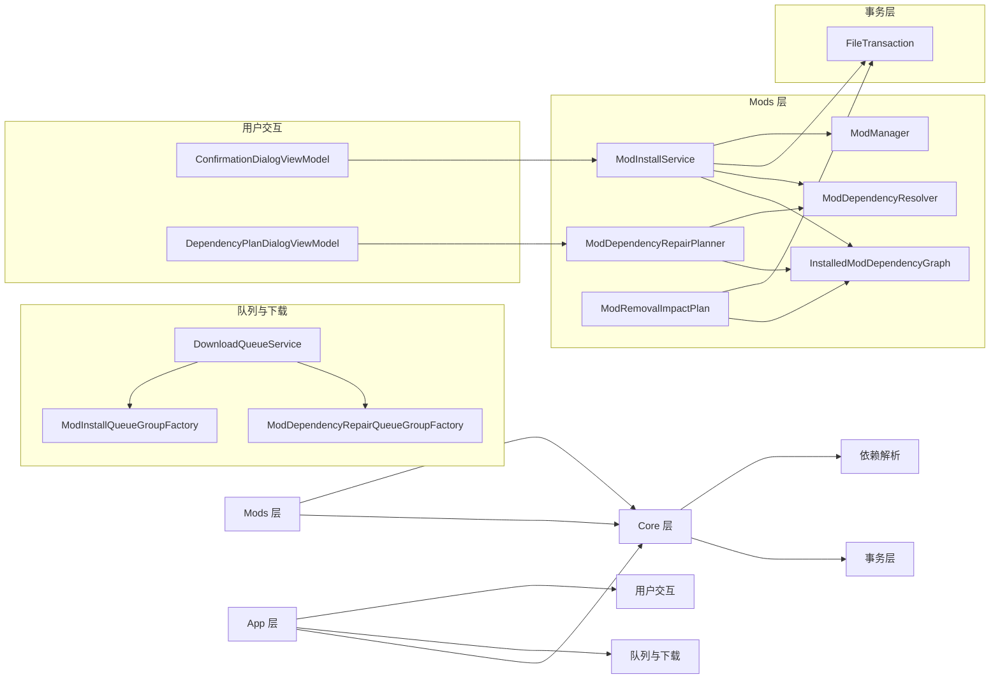

# 安装服务

<cite>
**本文引用的文件**   
- [ModInstallService.cs](file://src/Crystalfly.Core/Mods/ModInstallService.cs)
- [ModDependencyRepairPlanner.cs](file://src/Crystalfly.Core/Mods/ModDependencyRepairPlanner.cs)
- [ModRemovalImpactPlan.cs](file://src/Crystalfly.Core/Mods/ModRemovalImpactPlan.cs)
- [ModInstallPlan.cs](file://src/Crystalfly.Core/Mods/ModInstallPlan.cs)
- [ModDependencyRepairPlan.cs](file://src/Crystalfly.Core/Mods/ModDependencyRepairPlan.cs)
- [InstalledModDependencyGraph.cs](file://src/Crystalfly.Core/Mods/InstalledModDependencyGraph.cs)
- [FileTransaction.cs](file://src/Crystalfly.Core/Transactions/FileTransaction.cs)
- [ModManager.cs](file://src/Crystalfly.Core/Mods/ModManager.cs)
- [ModDependencyResolver.cs](file://src/Crystalfly.Core/Mods/ModDependencyResolver.cs)
- [DownloadQueueService.cs](file://src/Crystalfly.App/Downloads/DownloadQueueService.cs)
- [ModInstallQueueGroupFactory.cs](file://src/Crystalfly.App/Downloads/ModInstallQueueGroupFactory.cs)
- [ModDependencyRepairQueueGroupFactory.cs](file://src/Crystalfly.App/Downloads/ModDependencyRepairQueueGroupFactory.cs)
- [InstanceOperationCoordinator.cs](file://src/Crystalfly.App/Downloads/InstanceOperationCoordinator.cs)
- [ConfirmationDialogViewModel.cs](file://src/Crystalfly.App/ViewModels/Dialogs/ConfirmationDialogViewModel.cs)
- [DependencyPlanDialogViewModel.cs](file://src/Crystalfly.App/ViewModels/Dialogs/DependencyPlanDialogViewModel.cs)
</cite>

## 目录
1. [简介](#简介)
2. [项目结构](#项目结构)
3. [核心组件](#核心组件)
4. [架构总览](#架构总览)
5. [详细组件分析](#详细组件分析)
6. [依赖关系分析](#依赖关系分析)
7. [性能考虑](#性能考虑)
8. [故障排查指南](#故障排查指南)
9. [结论](#结论)
10. [附录](#附录)

## 简介
本文件面向 Crystalfly 的模组安装服务，聚焦以下目标：
- 深入解析 ModInstallService 的安装流程，包括预检验证、文件操作、事务处理与错误恢复。
- 阐述 ModDependencyRepairPlanner 的智能修复策略，涵盖自动依赖解决、冲突消解与用户确认流程。
- 说明 ModRemovalImpactPlan 的影响分析能力，包括依赖影响评估、安全卸载检查与清理策略。
- 提供批量安装、更新与卸载操作的完整示例（以步骤与调用链为主）。
- 覆盖安装进度监控、错误处理与日志记录的实现要点。
- 给出安装失败、权限问题与磁盘空间不足等常见问题的解决方案。

## 项目结构
围绕“安装服务”的核心代码位于 Core 层的 Mods 与 Transactions 子模块，以及 App 层对下载队列与 UI 交互的编排。下图展示了与安装服务相关的关键文件与职责划分。

图表来源
- [ModInstallService.cs](file://src/Crystalfly.Core/Mods/ModInstallService.cs)
- [ModInstallPlan.cs](file://src/Crystalfly.Core/Mods/ModInstallPlan.cs)
- [ModDependencyRepairPlan.cs](file://src/Crystalfly.Core/Mods/ModDependencyRepairPlan.cs)
- [ModDependencyRepairPlanner.cs](file://src/Crystalfly.Core/Mods/ModDependencyRepairPlanner.cs)
- [ModRemovalImpactPlan.cs](file://src/Crystalfly.Core/Mods/ModRemovalImpactPlan.cs)
- [InstalledModDependencyGraph.cs](file://src/Crystalfly.Core/Mods/InstalledModDependencyGraph.cs)
- [FileTransaction.cs](file://src/Crystalfly.Core/Transactions/FileTransaction.cs)
- [ModManager.cs](file://src/Crystalfly.Core/Mods/ModManager.cs)
- [ModDependencyResolver.cs](file://src/Crystalfly.Core/Mods/ModDependencyResolver.cs)
- [DownloadQueueService.cs](file://src/Crystalfly.App/Downloads/DownloadQueueService.cs)
- [ModInstallQueueGroupFactory.cs](file://src/Crystalfly.App/Downloads/ModInstallQueueGroupFactory.cs)
- [ModDependencyRepairQueueGroupFactory.cs](file://src/Crystalfly.App/Downloads/ModDependencyRepairQueueGroupFactory.cs)
- [InstanceOperationCoordinator.cs](file://src/Crystalfly.App/Downloads/InstanceOperationCoordinator.cs)
- [ConfirmationDialogViewModel.cs](file://src/Crystalfly.App/ViewModels/Dialogs/ConfirmationDialogViewModel.cs)
- [DependencyPlanDialogViewModel.cs](file://src/Crystalfly.App/ViewModels/Dialogs/DependencyPlanDialogViewModel.cs)

章节来源
- [ModInstallService.cs](file://src/Crystalfly.Core/Mods/ModInstallService.cs)
- [ModDependencyRepairPlanner.cs](file://src/Crystalfly.Core/Mods/ModDependencyRepairPlanner.cs)
- [ModRemovalImpactPlan.cs](file://src/Crystalfly.Core/Mods/ModRemovalImpactPlan.cs)
- [FileTransaction.cs](file://src/Crystalfly.Core/Transactions/FileTransaction.cs)
- [DownloadQueueService.cs](file://src/Crystalfly.App/Downloads/DownloadQueueService.cs)
- [ModInstallQueueGroupFactory.cs](file://src/Crystalfly.App/Downloads/ModInstallQueueGroupFactory.cs)
- [ModDependencyRepairQueueGroupFactory.cs](file://src/Crystalfly.App/Downloads/ModDependencyRepairQueueGroupFactory.cs)
- [InstanceOperationCoordinator.cs](file://src/Crystalfly.App/Downloads/InstanceOperationCoordinator.cs)
- [ConfirmationDialogViewModel.cs](file://src/Crystalfly.App/ViewModels/Dialogs/ConfirmationDialogViewModel.cs)
- [DependencyPlanDialogViewModel.cs](file://src/Crystalfly.App/ViewModels/Dialogs/DependencyPlanDialogViewModel.cs)

## 核心组件
- ModInstallService：负责一次或多次模组安装的生命周期管理，包含预检、计划生成、依赖解析、下载协调、文件写入、事务提交/回滚、状态持久化与错误恢复。
- ModInstallPlan：描述一次安装任务的目标集合、版本约束、顺序与副作用清单，供执行器消费。
- ModDependencyRepairPlanner：针对缺失/不兼容依赖进行智能修复，产出可执行的修复计划，支持冲突消解与用户确认。
- ModRemovalImpactPlan：在卸载前评估影响范围，识别受影响的下游模组，并制定安全的清理策略。
- FileTransaction：提供原子化的文件级事务，确保写入失败时能一致地回滚。
- InstalledModDependencyGraph：维护已安装模组的依赖图，用于影响分析与冲突检测。
- ModDependencyResolver：基于版本约束与兼容性规则解析依赖。
- ModManager：封装底层模组元数据与实例目录操作。
- DownloadQueueService 与工厂类：将安装任务组织为队列组，驱动并行下载与安装。
- InstanceOperationCoordinator：统一调度实例维度的安装/修复/卸载等操作，并与 UI 交互（确认对话框、计划展示）。

章节来源
- [ModInstallService.cs](file://src/Crystalfly.Core/Mods/ModInstallService.cs)
- [ModInstallPlan.cs](file://src/Crystalfly.Core/Mods/ModInstallPlan.cs)
- [ModDependencyRepairPlanner.cs](file://src/Crystalfly.Core/Mods/ModDependencyRepairPlanner.cs)
- [ModRemovalImpactPlan.cs](file://src/Crystalfly.Core/Mods/ModRemovalImpactPlan.cs)
- [FileTransaction.cs](file://src/Crystalfly.Core/Transactions/FileTransaction.cs)
- [InstalledModDependencyGraph.cs](file://src/Crystalfly.Core/Mods/InstalledModDependencyGraph.cs)
- [ModDependencyResolver.cs](file://src/Crystalfly.Core/Mods/ModDependencyResolver.cs)
- [ModManager.cs](file://src/Crystalfly.Core/Mods/ModManager.cs)
- [DownloadQueueService.cs](file://src/Crystalfly.App/Downloads/DownloadQueueService.cs)
- [ModInstallQueueGroupFactory.cs](file://src/Crystalfly.App/Downloads/ModInstallQueueGroupFactory.cs)
- [ModDependencyRepairQueueGroupFactory.cs](file://src/Crystalfly.App/Downloads/ModDependencyRepairQueueGroupFactory.cs)
- [InstanceOperationCoordinator.cs](file://src/Crystalfly.App/Downloads/InstanceOperationCoordinator.cs)

## 架构总览
安装服务的整体架构遵循“计划-执行-事务-反馈”的分层模式：上层通过队列与协调器组织任务，核心服务负责计划与执行，事务层保证一致性，UI 层负责用户确认与进度展示。

图表来源
- [InstanceOperationCoordinator.cs](file://src/Crystalfly.App/Downloads/InstanceOperationCoordinator.cs)
- [DownloadQueueService.cs](file://src/Crystalfly.App/Downloads/DownloadQueueService.cs)
- [ModInstallService.cs](file://src/Crystalfly.Core/Mods/ModInstallService.cs)
- [ModDependencyRepairPlanner.cs](file://src/Crystalfly.Core/Mods/ModDependencyRepairPlanner.cs)
- [ModDependencyResolver.cs](file://src/Crystalfly.Core/Mods/ModDependencyResolver.cs)
- [FileTransaction.cs](file://src/Crystalfly.Core/Transactions/FileTransaction.cs)

## 详细组件分析

### ModInstallService 安装流程
- 预检验证
  - 校验目标实例路径、游戏构建匹配、磁盘空间、文件锁与权限。
  - 校验待安装包完整性与签名（如适用），并验证依赖约束是否可满足。
- 计划生成
  - 基于 ModInstallPlan 汇总目标模组、版本与顺序，计算最小变更集。
  - 结合已安装依赖图，避免重复安装与循环依赖。
- 依赖解析
  - 使用 ModDependencyResolver 解析版本区间、冲突与可选依赖。
  - 若存在未满足依赖，交由 ModDependencyRepairPlanner 生成修复计划。
- 下载与缓存
  - 通过 DownloadQueueService 与对应工厂类组织下载任务，支持并发与断点续传。
  - 下载完成后进入安装阶段。
- 文件操作与事务
  - 所有写操作由 FileTransaction 包裹，支持原子提交与回滚。
  - 写入顺序遵循拓扑排序，确保先写基础依赖再写上层模组。
- 状态持久化与索引
  - 更新已安装清单、依赖图与侧车文件，保持与文件系统一致。
- 错误处理与恢复
  - 捕获异常后根据事务状态决定回滚；记录错误上下文与重试策略。
  - 对于部分失败的中间态，提供“继续”、“回滚”或“跳过”选项。

图表来源
- [ModInstallService.cs](file://src/Crystalfly.Core/Mods/ModInstallService.cs)
- [ModInstallPlan.cs](file://src/Crystalfly.Core/Mods/ModInstallPlan.cs)
- [ModDependencyResolver.cs](file://src/Crystalfly.Core/Mods/ModDependencyResolver.cs)
- [ModDependencyRepairPlanner.cs](file://src/Crystalfly.Core/Mods/ModDependencyRepairPlanner.cs)
- [FileTransaction.cs](file://src/Crystalfly.Core/Transactions/FileTransaction.cs)
- [DownloadQueueService.cs](file://src/Crystalfly.App/Downloads/DownloadQueueService.cs)

章节来源
- [ModInstallService.cs](file://src/Crystalfly.Core/Mods/ModInstallService.cs)
- [ModInstallPlan.cs](file://src/Crystalfly.Core/Mods/ModInstallPlan.cs)
- [ModDependencyResolver.cs](file://src/Crystalfly.Core/Mods/ModDependencyResolver.cs)
- [ModDependencyRepairPlanner.cs](file://src/Crystalfly.Core/Mods/ModDependencyRepairPlanner.cs)
- [FileTransaction.cs](file://src/Crystalfly.Core/Transactions/FileTransaction.cs)
- [DownloadQueueService.cs](file://src/Crystalfly.App/Downloads/DownloadQueueService.cs)

### ModDependencyRepairPlanner 智能修复策略
- 自动依赖解决
  - 扫描已安装依赖图，识别缺失、版本不兼容与循环依赖。
  - 基于约束求解选择最优候选版本，优先稳定版与最低必要升级。
- 冲突消解
  - 当多个模组要求互斥版本时，尝试替换为兼容版本或建议移除冲突源。
  - 提供多种消解方案，附带影响面评估。
- 用户确认流程
  - 生成 ModDependencyRepairPlan，并通过 UI 展示变更摘要与风险。
  - 等待用户确认后执行，否则中止或保留原状。

图表来源
- [ModDependencyRepairPlanner.cs](file://src/Crystalfly.Core/Mods/ModDependencyRepairPlanner.cs)
- [ModDependencyRepairPlan.cs](file://src/Crystalfly.Core/Mods/ModDependencyRepairPlan.cs)
- [InstalledModDependencyGraph.cs](file://src/Crystalfly.Core/Mods/InstalledModDependencyGraph.cs)
- [ModDependencyResolver.cs](file://src/Crystalfly.Core/Mods/ModDependencyResolver.cs)

章节来源
- [ModDependencyRepairPlanner.cs](file://src/Crystalfly.Core/Mods/ModDependencyRepairPlanner.cs)
- [ModDependencyRepairPlan.cs](file://src/Crystalfly.Core/Mods/ModDependencyRepairPlan.cs)
- [InstalledModDependencyGraph.cs](file://src/Crystalfly.Core/Mods/InstalledModDependencyGraph.cs)
- [ModDependencyResolver.cs](file://src/Crystalfly.Core/Mods/ModDependencyResolver.cs)

### ModRemovalImpactPlan 影响分析
- 依赖影响评估
  - 基于已安装依赖图，定位被卸载模组的所有上游消费者。
  - 标记潜在破坏性变更（如 API 移除、资源丢失）。
- 安全卸载检查
  - 检查是否存在强依赖关系，必要时阻止直接卸载或提示先卸载上游。
  - 识别共享文件与配置项，避免误删。
- 清理策略
  - 生成最小化清理清单，仅删除受影响且不再需要的文件与注册项。
  - 提供回滚快照或备份建议，便于恢复。

图表来源
- [ModRemovalImpactPlan.cs](file://src/Crystalfly.Core/Mods/ModRemovalImpactPlan.cs)
- [InstalledModDependencyGraph.cs](file://src/Crystalfly.Core/Mods/InstalledModDependencyGraph.cs)
- [FileTransaction.cs](file://src/Crystalfly.Core/Transactions/FileTransaction.cs)

章节来源
- [ModRemovalImpactPlan.cs](file://src/Crystalfly.Core/Mods/ModRemovalImpactPlan.cs)
- [InstalledModDependencyGraph.cs](file://src/Crystalfly.Core/Mods/InstalledModDependencyGraph.cs)
- [FileTransaction.cs](file://src/Crystalfly.Core/Transactions/FileTransaction.cs)

### 批量安装、更新与卸载示例
- 批量安装
  - 通过 ModInstallQueueGroupFactory 创建安装队列组，将多个安装任务聚合。
  - 使用 DownloadQueueService 驱动并行下载与串行安装，保证顺序与一致性。
  - 参考路径：[ModInstallQueueGroupFactory.cs](file://src/Crystalfly.App/Downloads/ModInstallQueueGroupFactory.cs)、[DownloadQueueService.cs](file://src/Crystalfly.App/Downloads/DownloadQueueService.cs)。
- 批量更新
  - 先运行 ModDependencyRepairPlanner 生成修复计划，经用户确认后加入修复队列组。
  - 随后触发安装服务执行更新，事务层保障原子性。
  - 参考路径：[ModDependencyRepairQueueGroupFactory.cs](file://src/Crystalfly.App/Downloads/ModDependencyRepairQueueGroupFactory.cs)、[ModDependencyRepairPlanner.cs](file://src/Crystalfly.Core/Mods/ModDependencyRepairPlanner.cs)。
- 批量卸载
  - 对每个目标模组生成 ModRemovalImpactPlan，合并影响面并去重。
  - 依据依赖顺序反向执行卸载，事务层确保回滚能力。
  - 参考路径：[ModRemovalImpactPlan.cs](file://src/Crystalfly.Core/Mods/ModRemovalImpactPlan.cs)、[FileTransaction.cs](file://src/Crystalfly.Core/Transactions/FileTransaction.cs)。

章节来源
- [ModInstallQueueGroupFactory.cs](file://src/Crystalfly.App/Downloads/ModInstallQueueGroupFactory.cs)
- [ModDependencyRepairQueueGroupFactory.cs](file://src/Crystalfly.App/Downloads/ModDependencyRepairQueueGroupFactory.cs)
- [DownloadQueueService.cs](file://src/Crystalfly.App/Downloads/DownloadQueueService.cs)
- [ModDependencyRepairPlanner.cs](file://src/Crystalfly.Core/Mods/ModDependencyRepairPlanner.cs)
- [ModRemovalImpactPlan.cs](file://src/Crystalfly.Core/Mods/ModRemovalImpactPlan.cs)
- [FileTransaction.cs](file://src/Crystalfly.Core/Transactions/FileTransaction.cs)

### 安装进度监控、错误处理与日志记录
- 进度监控
  - 通过队列服务与协调器暴露进度事件，UI 层订阅并渲染。
  - 关键节点：下载百分比、解压中、写入中、提交事务、完成。
- 错误处理
  - 统一捕获 IO、权限、网络与依赖解析异常，分类上报。
  - 支持重试、降级与回滚策略，避免半安装状态。
- 日志记录
  - 记录关键决策点与变更清单，便于审计与回溯。
  - 关联会话 ID 与批次 ID，支持多任务并行时的隔离。

章节来源
- [DownloadQueueService.cs](file://src/Crystalfly.App/Downloads/DownloadQueueService.cs)
- [InstanceOperationCoordinator.cs](file://src/Crystalfly.App/Downloads/InstanceOperationCoordinator.cs)
- [ModInstallService.cs](file://src/Crystalfly.Core/Mods/ModInstallService.cs)
- [FileTransaction.cs](file://src/Crystalfly.Core/Transactions/FileTransaction.cs)

## 依赖关系分析
安装服务内部组件之间的耦合与协作如下：

图表来源
- [ModInstallService.cs](file://src/Crystalfly.Core/Mods/ModInstallService.cs)
- [ModDependencyRepairPlanner.cs](file://src/Crystalfly.Core/Mods/ModDependencyRepairPlanner.cs)
- [ModRemovalImpactPlan.cs](file://src/Crystalfly.Core/Mods/ModRemovalImpactPlan.cs)
- [InstalledModDependencyGraph.cs](file://src/Crystalfly.Core/Mods/InstalledModDependencyGraph.cs)
- [ModDependencyResolver.cs](file://src/Crystalfly.Core/Mods/ModDependencyResolver.cs)
- [ModManager.cs](file://src/Crystalfly.Core/Mods/ModManager.cs)
- [FileTransaction.cs](file://src/Crystalfly.Core/Transactions/FileTransaction.cs)
- [DownloadQueueService.cs](file://src/Crystalfly.App/Downloads/DownloadQueueService.cs)
- [ModInstallQueueGroupFactory.cs](file://src/Crystalfly.App/Downloads/ModInstallQueueGroupFactory.cs)
- [ModDependencyRepairQueueGroupFactory.cs](file://src/Crystalfly.App/Downloads/ModDependencyRepairQueueGroupFactory.cs)
- [ConfirmationDialogViewModel.cs](file://src/Crystalfly.App/ViewModels/Dialogs/ConfirmationDialogViewModel.cs)
- [DependencyPlanDialogViewModel.cs](file://src/Crystalfly.App/ViewModels/Dialogs/DependencyPlanDialogViewModel.cs)

章节来源
- [ModInstallService.cs](file://src/Crystalfly.Core/Mods/ModInstallService.cs)
- [ModDependencyRepairPlanner.cs](file://src/Crystalfly.Core/Mods/ModDependencyRepairPlanner.cs)
- [ModRemovalImpactPlan.cs](file://src/Crystalfly.Core/Mods/ModRemovalImpactPlan.cs)
- [InstalledModDependencyGraph.cs](file://src/Crystalfly.Core/Mods/InstalledModDependencyGraph.cs)
- [ModDependencyResolver.cs](file://src/Crystalfly.Core/Mods/ModDependencyResolver.cs)
- [ModManager.cs](file://src/Crystalfly.Core/Mods/ModManager.cs)
- [FileTransaction.cs](file://src/Crystalfly.Core/Transactions/FileTransaction.cs)
- [DownloadQueueService.cs](file://src/Crystalfly.App/Downloads/DownloadQueueService.cs)
- [ModInstallQueueGroupFactory.cs](file://src/Crystalfly.App/Downloads/ModInstallQueueGroupFactory.cs)
- [ModDependencyRepairQueueGroupFactory.cs](file://src/Crystalfly.App/Downloads/ModDependencyRepairQueueGroupFactory.cs)
- [ConfirmationDialogViewModel.cs](file://src/Crystalfly.App/ViewModels/Dialogs/ConfirmationDialogViewModel.cs)
- [DependencyPlanDialogViewModel.cs](file://src/Crystalfly.App/ViewModels/Dialogs/DependencyPlanDialogViewModel.cs)

## 性能考虑
- 并行下载与串行安装：利用队列服务实现高吞吐下载，同时保证安装阶段的顺序与一致性。
- 增量与去重：在安装前比对现有清单，避免重复写入与冗余操作。
- 事务批量化：将小文件写入合并到单次事务提交，减少系统调用开销。
- 依赖图缓存：对已安装依赖图进行内存缓存，降低重复解析成本。
- I/O 优化：采用缓冲写入与顺序访问，减少随机 I/O。

## 故障排查指南
- 安装失败
  - 现象：安装中途报错或回滚。
  - 排查：查看事务提交前的最后写入步骤与错误上下文；检查依赖解析结果与冲突方案。
  - 参考：[ModInstallService.cs](file://src/Crystalfly.Core/Mods/ModInstallService.cs)、[FileTransaction.cs](file://src/Crystalfly.Core/Transactions/FileTransaction.cs)
- 权限问题
  - 现象：无法写入目标目录或修改清单。
  - 排查：确认运行账户权限、目录只读属性与防病毒软件拦截；以管理员身份重试。
  - 参考：[ModInstallService.cs](file://src/Crystalfly.Core/Mods/ModInstallService.cs)
- 磁盘空间不足
  - 现象：下载或写入阶段失败。
  - 排查：检查可用空间与临时目录配额；清理缓存或更换磁盘。
  - 参考：[ModInstallService.cs](file://src/Crystalfly.Core/Mods/ModInstallService.cs)
- 依赖冲突
  - 现象：无法解析版本或出现互斥依赖。
  - 排查：查看 ModDependencyRepairPlan 提供的消解方案；必要时手动调整版本或移除冲突模组。
  - 参考：[ModDependencyRepairPlanner.cs](file://src/Crystalfly.Core/Mods/ModDependencyRepairPlanner.cs)、[ModDependencyRepairPlan.cs](file://src/Crystalfly.Core/Mods/ModDependencyRepairPlan.cs)
- 卸载导致功能缺失
  - 现象：卸载后某些功能不可用。
  - 排查：检查 ModRemovalImpactPlan 的影响面；按建议顺序卸载或保留必要依赖。
  - 参考：[ModRemovalImpactPlan.cs](file://src/Crystalfly.Core/Mods/ModRemovalImpactPlan.cs)

章节来源
- [ModInstallService.cs](file://src/Crystalfly.Core/Mods/ModInstallService.cs)
- [FileTransaction.cs](file://src/Crystalfly.Core/Transactions/FileTransaction.cs)
- [ModDependencyRepairPlanner.cs](file://src/Crystalfly.Core/Mods/ModDependencyRepairPlanner.cs)
- [ModDependencyRepairPlan.cs](file://src/Crystalfly.Core/Mods/ModDependencyRepairPlan.cs)
- [ModRemovalImpactPlan.cs](file://src/Crystalfly.Core/Mods/ModRemovalImpactPlan.cs)

## 结论
Crystalfly 的模组安装服务通过清晰的计划-执行-事务分层，结合智能依赖修复与影响分析，提供了稳健的批量安装、更新与卸载能力。配合队列服务与 UI 确认机制，既保证了高性能与一致性，又提升了用户体验与可维护性。

## 附录
- 术语
  - 安装计划：描述本次安装的目标与变更清单。
  - 修复计划：描述依赖缺失与冲突的修复方案。
  - 影响计划：描述卸载操作的影响面与清理策略。
  - 事务：保证文件写入原子性的机制。
- 相关文件索引
  - 核心服务与计划：[ModInstallService.cs](file://src/Crystalfly.Core/Mods/ModInstallService.cs)、[ModInstallPlan.cs](file://src/Crystalfly.Core/Mods/ModInstallPlan.cs)、[ModDependencyRepairPlan.cs](file://src/Crystalfly.Core/Mods/ModDependencyRepairPlan.cs)、[ModRemovalImpactPlan.cs](file://src/Crystalfly.Core/Mods/ModRemovalImpactPlan.cs)
  - 依赖与图：[ModDependencyResolver.cs](file://src/Crystalfly.Core/Mods/ModDependencyResolver.cs)、[InstalledModDependencyGraph.cs](file://src/Crystalfly.Core/Mods/InstalledModDependencyGraph.cs)
  - 事务与底层：[FileTransaction.cs](file://src/Crystalfly.Core/Transactions/FileTransaction.cs)、[ModManager.cs](file://src/Crystalfly.Core/Mods/ModManager.cs)
  - 队列与 UI：[DownloadQueueService.cs](file://src/Crystalfly.App/Downloads/DownloadQueueService.cs)、[ModInstallQueueGroupFactory.cs](file://src/Crystalfly.App/Downloads/ModInstallQueueGroupFactory.cs)、[ModDependencyRepairQueueGroupFactory.cs](file://src/Crystalfly.App/Downloads/ModDependencyRepairQueueGroupFactory.cs)、[InstanceOperationCoordinator.cs](file://src/Crystalfly.App/Downloads/InstanceOperationCoordinator.cs)、[ConfirmationDialogViewModel.cs](file://src/Crystalfly.App/ViewModels/Dialogs/ConfirmationDialogViewModel.cs)、[DependencyPlanDialogViewModel.cs](file://src/Crystalfly.App/ViewModels/Dialogs/DependencyPlanDialogViewModel.cs)