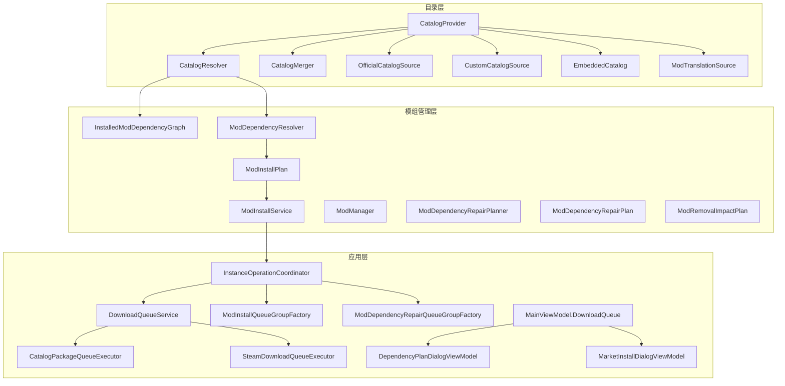
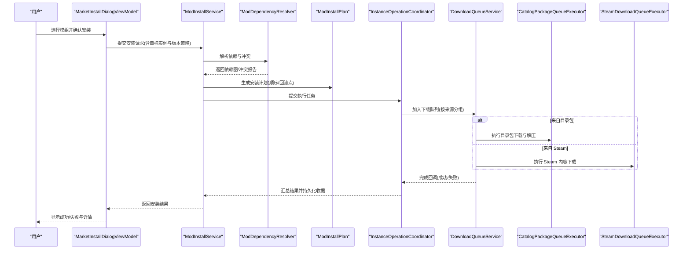
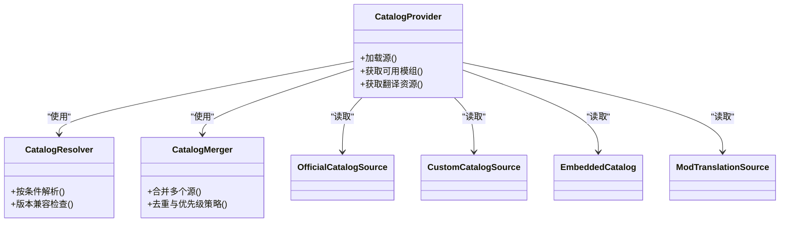
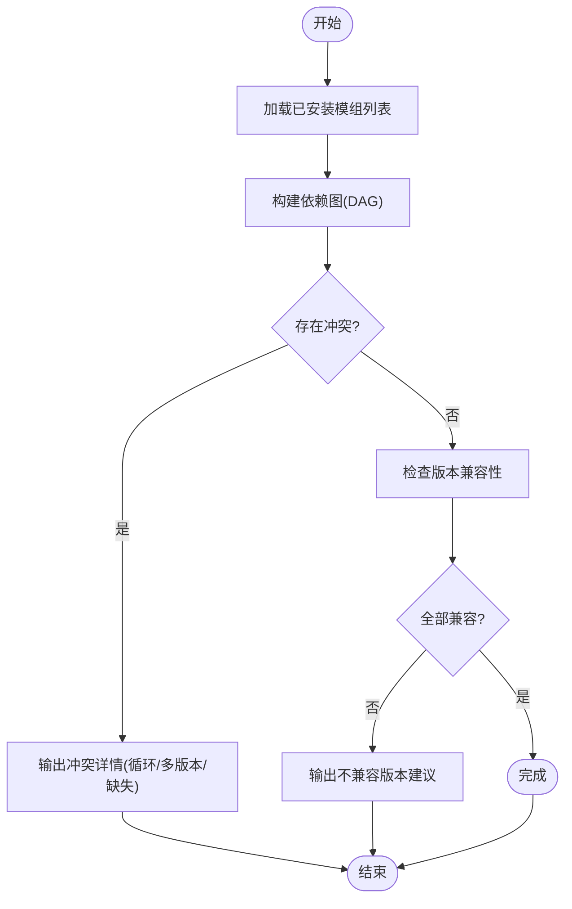
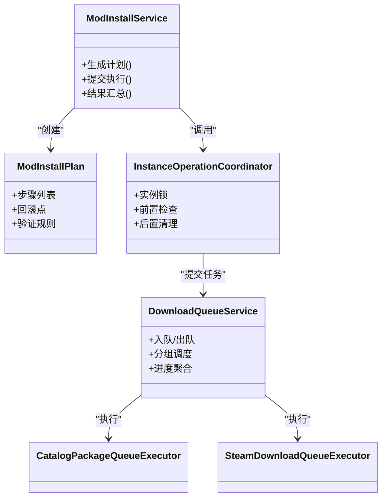
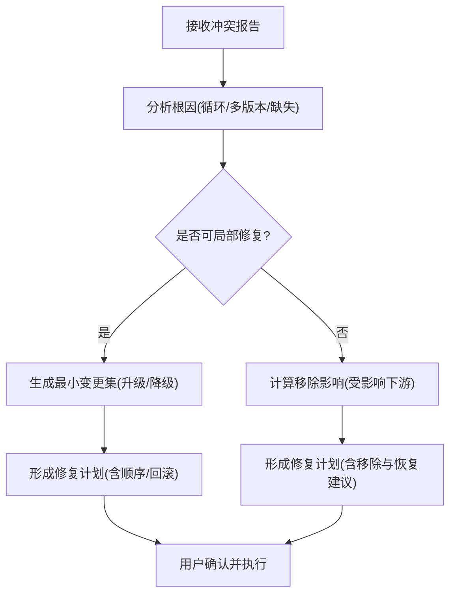
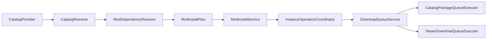

# 模组生态系统

<cite>
**本文引用的文件**   
- [src/Crystalfly.Core/Mods/ModDependencyResolver.cs](file://src/Crystalfly.Core/Mods/ModDependencyResolver.cs)
- [src/Crystalfly.Core/Mods/InstalledModDependencyGraph.cs](file://src/Crystalfly.Core/Mods/InstalledModDependencyGraph.cs)
- [src/Crystalfly.Core/Mods/ModInstallPlan.cs](file://src/Crystalfly.Core/Mods/ModInstallPlan.cs)
- [src/Crystalfly.Core/Mods/ModInstallService.cs](file://src/Crystalfly.Core/Mods/ModInstallService.cs)
- [src/Crystalfly.Core/Mods/ModManager.cs](file://src/Crystalfly.Core/Mods/ModManager.cs)
- [src/Crystalfly.Core/Mods/ModDependencyRepairPlanner.cs](file://src/Crystalfly.Core/Mods/ModDependencyRepairPlanner.cs)
- [src/Crystalfly.Core/Mods/ModDependencyRepairPlan.cs](file://src/Crystalfly.Core/Mods/ModDependencyRepairPlan.cs)
- [src/Crystalfly.Core/Mods/ModRemovalImpactPlan.cs](file://src/Crystalfly.Core/Mods/ModRemovalImpactPlan.cs)
- [src/Crystalfly.App/Downloads/DownloadQueueService.cs](file://src/Crystalfly.App/Downloads/DownloadQueueService.cs)
- [src/Crystalfly.App/Downloads/DownloadQueueModels.cs](file://src/Crystalfly.App/Downloads/DownloadQueueModels.cs)
- [src/Crystalfly.App/Downloads/InstanceOperationCoordinator.cs](file://src/Crystalfly.App/Downloads/InstanceOperationCoordinator.cs)
- [src/Crystalfly.App/Downloads/CatalogPackageQueueExecutor.cs](file://src/Crystalfly.App/Downloads/CatalogPackageQueueExecutor.cs)
- [src/Crystalfly.App/Downloads/SteamDownloadQueueExecutor.cs](file://src/Crystalfly.App/Downloads/SteamDownloadQueueExecutor.cs)
- [src/Crystalfly.App/Downloads/ModInstallQueueGroupFactory.cs](file://src/Crystalfly.App/Downloads/ModInstallQueueGroupFactory.cs)
- [src/Crystalfly.App/Downloads/ModDependencyRepairQueueGroupFactory.cs](file://src/Crystalfly.App/Downloads/ModDependencyRepairQueueGroupFactory.cs)
- [src/Crystalfly.App/ViewModels/MainViewModel.DownloadQueue.cs](file://src/Crystalfly.App/ViewModels/MainViewModel.DownloadQueue.cs)
- [src/Crystalfly.App/ViewModels/Dialogs/DependencyPlanDialogViewModel.cs](file://src/Crystalfly.App/ViewModels/Dialogs/DependencyPlanDialogViewModel.cs)
- [src/Crystalfly.App/ViewModels/Dialogs/MarketInstallDialogViewModel.cs](file://src/Crystalfly.App/ViewModels/Dialogs/MarketInstallDialogViewModel.cs)
- [src/Crystalfly.Core/Catalog/CatalogProvider.cs](file://src/Crystalfly.Core/Catalog/CatalogProvider.cs)
- [src/Crystalfly.Core/Catalog/CatalogResolver.cs](file://src/Crystalfly.Core/Catalog/CatalogResolver.cs)
- [src/Crystalfly.Core/Catalog/CatalogMerger.cs](file://src/Crystalfly.Core/Catalog/CatalogMerger.cs)
- [src/Crystalfly.Core/Catalog/OfficialCatalogSource.cs](file://src/Crystalfly.Core/Catalog/OfficialCatalogSource.cs)
- [src/Crystalfly.Core/Catalog/CustomCatalogSource.cs](file://src/Crystalfly.Core/Catalog/CustomCatalogSource.cs)
- [src/Crystalfly.Core/Catalog/EmbeddedCatalog.cs](file://src/Crystalfly.Core/Catalog/EmbeddedCatalog.cs)
- [src/Crystalfly.Core/Catalog/ModTranslationSource.cs](file://src/Crystalfly.Core/Catalog/ModTranslationSource.cs)
- [src/Crystalfly.Core/Configuration/CrystalflyPaths.cs](file://src/Crystalfly.Core/Configuration/CrystalflyPaths.cs)
- [src/Crystalfly.Core/Serialization/CrystalflyJson.cs](file://src/Crystalfly.Core/Serialization/CrystalflyJson.cs)
- [catalog/catalog.v1.schema.json](file://catalog/catalog.v1.schema.json)
- [catalog/mod-translations.zh-CN.v1.schema.json](file://catalog/mod-translations.zh-CN.v1.schema.json)
</cite>

## 目录
1. [简介](#简介)
2. [项目结构](#项目结构)
3. [核心组件](#核心组件)
4. [架构总览](#架构总览)
5. [详细组件分析](#详细组件分析)
6. [依赖关系分析](#依赖关系分析)
7. [性能考虑](#性能考虑)
8. [故障排查指南](#故障排查指南)
9. [结论](#结论)
10. [附录](#附录)

## 简介
本文件面向 Crystalfly 的模组生态，系统性阐述模组目录系统、依赖解析与修复、批量安装调度、以及开发发布流程。文档以源码为依据，提供架构图、时序图与流程图，帮助读者从高层到代码级全面理解模组安装、卸载、更新与冲突处理机制。

## 项目结构
Crystalfly 将“模组目录”和“模组运行时管理”解耦：
- 目录层（Catalog）负责聚合官方与自定义源、合并与解析模组清单，提供版本与元数据查询能力。
- 模组管理层（Core/Mods）负责依赖图构建、冲突检测、安装计划生成、依赖修复计划等。
- 应用层（App）负责下载队列编排、实例操作协调、UI 交互与对话框展示。

图表来源
- [src/Crystalfly.Core/Catalog/CatalogProvider.cs](file://src/Crystalfly.Core/Catalog/CatalogProvider.cs)
- [src/Crystalfly.Core/Catalog/CatalogResolver.cs](file://src/Crystalfly.Core/Catalog/CatalogResolver.cs)
- [src/Crystalfly.Core/Catalog/CatalogMerger.cs](file://src/Crystalfly.Core/Catalog/CatalogMerger.cs)
- [src/Crystalfly.Core/Catalog/OfficialCatalogSource.cs](file://src/Crystalfly.Core/Catalog/OfficialCatalogSource.cs)
- [src/Crystalfly.Core/Catalog/CustomCatalogSource.cs](file://src/Crystalfly.Core/Catalog/CustomCatalogSource.cs)
- [src/Crystalfly.Core/Catalog/EmbeddedCatalog.cs](file://src/Crystalfly.Core/Catalog/EmbeddedCatalog.cs)
- [src/Crystalfly.Core/Catalog/ModTranslationSource.cs](file://src/Crystalfly.Core/Catalog/ModTranslationSource.cs)
- [src/Crystalfly.Core/Mods/InstalledModDependencyGraph.cs](file://src/Crystalfly.Core/Mods/InstalledModDependencyGraph.cs)
- [src/Crystalfly.Core/Mods/ModDependencyResolver.cs](file://src/Crystalfly.Core/Mods/ModDependencyResolver.cs)
- [src/Crystalfly.Core/Mods/ModInstallPlan.cs](file://src/Crystalfly.Core/Mods/ModInstallPlan.cs)
- [src/Crystalfly.Core/Mods/ModInstallService.cs](file://src/Crystalfly.Core/Mods/ModInstallService.cs)
- [src/Crystalfly.Core/Mods/ModDependencyRepairPlanner.cs](file://src/Crystalfly.Core/Mods/ModDependencyRepairPlanner.cs)
- [src/Crystalfly.Core/Mods/ModDependencyRepairPlan.cs](file://src/Crystalfly.Core/Mods/ModDependencyRepairPlan.cs)
- [src/Crystalfly.Core/Mods/ModRemovalImpactPlan.cs](file://src/Crystalfly.Core/Mods/ModRemovalImpactPlan.cs)
- [src/Crystalfly.App/Downloads/DownloadQueueService.cs](file://src/Crystalfly.App/Downloads/DownloadQueueService.cs)
- [src/Crystalfly.App/Downloads/InstanceOperationCoordinator.cs](file://src/Crystalfly.App/Downloads/InstanceOperationCoordinator.cs)
- [src/Crystalfly.App/Downloads/CatalogPackageQueueExecutor.cs](file://src/Crystalfly.App/Downloads/CatalogPackageQueueExecutor.cs)
- [src/Crystalfly.App/Downloads/SteamDownloadQueueExecutor.cs](file://src/Crystalfly.App/Downloads/SteamDownloadQueueExecutor.cs)
- [src/Crystalfly.App/Downloads/ModInstallQueueGroupFactory.cs](file://src/Crystalfly.App/Downloads/ModInstallQueueGroupFactory.cs)
- [src/Crystalfly.App/Downloads/ModDependencyRepairQueueGroupFactory.cs](file://src/Crystalfly.App/Downloads/ModDependencyRepairQueueGroupFactory.cs)
- [src/Crystalfly.App/ViewModels/MainViewModel.DownloadQueue.cs](file://src/Crystalfly.App/ViewModels/MainViewModel.DownloadQueue.cs)
- [src/Crystalfly.App/ViewModels/Dialogs/DependencyPlanDialogViewModel.cs](file://src/Crystalfly.App/ViewModels/Dialogs/DependencyPlanDialogViewModel.cs)
- [src/Crystalfly.App/ViewModels/Dialogs/MarketInstallDialogViewModel.cs](file://src/Crystalfly.App/ViewModels/Dialogs/MarketInstallDialogViewModel.cs)

章节来源
- [src/Crystalfly.Core/Catalog/CatalogProvider.cs](file://src/Crystalfly.Core/Catalog/CatalogProvider.cs)
- [src/Crystalfly.Core/Mods/ModInstallService.cs](file://src/Crystalfly.Core/Mods/ModInstallService.cs)
- [src/Crystalfly.App/Downloads/DownloadQueueService.cs](file://src/Crystalfly.App/Downloads/DownloadQueueService.cs)

## 核心组件
- 目录提供者与解析器：聚合多源清单、合并条目、按条件解析可用版本与翻译资源。
- 依赖图与解析器：基于已安装模组与目录信息构建依赖图，进行冲突检测与版本兼容性校验。
- 安装计划与服务：生成有序安装计划，驱动下载与部署，保证事务性与可回滚。
- 依赖修复计划器：在冲突或不可满足约束下，智能决策最小变更集（升级/降级/移除）。
- 批量下载与队列：统一调度 Steam 与目录包下载，支持分组、并发与进度聚合。
- UI 视图模型：向用户呈现依赖计划、市场安装选择与下载队列状态。

章节来源
- [src/Crystalfly.Core/Catalog/CatalogResolver.cs](file://src/Crystalfly.Core/Catalog/CatalogResolver.cs)
- [src/Crystalfly.Core/Mods/InstalledModDependencyGraph.cs](file://src/Crystalfly.Core/Mods/InstalledModDependencyGraph.cs)
- [src/Crystalfly.Core/Mods/ModDependencyResolver.cs](file://src/Crystalfly.Core/Mods/ModDependencyResolver.cs)
- [src/Crystalfly.Core/Mods/ModInstallPlan.cs](file://src/Crystalfly.Core/Mods/ModInstallPlan.cs)
- [src/Crystalfly.Core/Mods/ModInstallService.cs](file://src/Crystalfly.Core/Mods/ModInstallService.cs)
- [src/Crystalfly.Core/Mods/ModDependencyRepairPlanner.cs](file://src/Crystalfly.Core/Mods/ModDependencyRepairPlanner.cs)
- [src/Crystalfly.Core/Mods/ModDependencyRepairPlan.cs](file://src/Crystalfly.Core/Mods/ModDependencyRepairPlan.cs)
- [src/Crystalfly.App/Downloads/DownloadQueueService.cs](file://src/Crystalfly.App/Downloads/DownloadQueueService.cs)
- [src/Crystalfly.App/ViewModels/Dialogs/DependencyPlanDialogViewModel.cs](file://src/Crystalfly.App/ViewModels/Dialogs/DependencyPlanDialogViewModel.cs)
- [src/Crystalfly.App/ViewModels/Dialogs/MarketInstallDialogViewModel.cs](file://src/Crystalfly.App/ViewModels/Dialogs/MarketInstallDialogViewModel.cs)

## 架构总览
下图展示了从用户操作到最终落盘的端到端流程：UI 发起安装请求，服务侧生成安装计划并交由队列执行，队列根据来源选择具体执行器，完成后由协调器更新实例状态。

图表来源
- [src/Crystalfly.App/ViewModels/Dialogs/MarketInstallDialogViewModel.cs](file://src/Crystalfly.App/ViewModels/Dialogs/MarketInstallDialogViewModel.cs)
- [src/Crystalfly.Core/Mods/ModInstallService.cs](file://src/Crystalfly.Core/Mods/ModInstallService.cs)
- [src/Crystalfly.Core/Mods/ModDependencyResolver.cs](file://src/Crystalfly.Core/Mods/ModDependencyResolver.cs)
- [src/Crystalfly.Core/Mods/ModInstallPlan.cs](file://src/Crystalfly.Core/Mods/ModInstallPlan.cs)
- [src/Crystalfly.App/Downloads/InstanceOperationCoordinator.cs](file://src/Crystalfly.App/Downloads/InstanceOperationCoordinator.cs)
- [src/Crystalfly.App/Downloads/DownloadQueueService.cs](file://src/Crystalfly.App/Downloads/DownloadQueueService.cs)
- [src/Crystalfly.App/Downloads/CatalogPackageQueueExecutor.cs](file://src/Crystalfly.App/Downloads/CatalogPackageQueueExecutor.cs)
- [src/Crystalfly.App/Downloads/SteamDownloadQueueExecutor.cs](file://src/Crystalfly.App/Downloads/SteamDownloadQueueExecutor.cs)

## 详细组件分析

### 模组目录系统与清单格式
- 目录提供者负责加载官方、自定义与内嵌目录源，并通过合并器整合为统一视图；解析器提供按名称、版本范围、语言等条件的查询能力。
- 清单模式定义位于 schema 文件中，用于校验目录 JSON 与翻译资源的结构完整性。

图表来源
- [src/Crystalfly.Core/Catalog/CatalogProvider.cs](file://src/Crystalfly.Core/Catalog/CatalogProvider.cs)
- [src/Crystalfly.Core/Catalog/CatalogResolver.cs](file://src/Crystalfly.Core/Catalog/CatalogResolver.cs)
- [src/Crystalfly.Core/Catalog/CatalogMerger.cs](file://src/Crystalfly.Core/Catalog/CatalogMerger.cs)
- [src/Crystalfly.Core/Catalog/OfficialCatalogSource.cs](file://src/Crystalfly.Core/Catalog/OfficialCatalogSource.cs)
- [src/Crystalfly.Core/Catalog/CustomCatalogSource.cs](file://src/Crystalfly.Core/Catalog/CustomCatalogSource.cs)
- [src/Crystalfly.Core/Catalog/EmbeddedCatalog.cs](file://src/Crystalfly.Core/Catalog/EmbeddedCatalog.cs)
- [src/Crystalfly.Core/Catalog/ModTranslationSource.cs](file://src/Crystalfly.Core/Catalog/ModTranslationSource.cs)
- [catalog/catalog.v1.schema.json](file://catalog/catalog.v1.schema.json)
- [catalog/mod-translations.zh-CN.v1.schema.json](file://catalog/mod-translations.zh-CN.v1.schema.json)

章节来源
- [src/Crystalfly.Core/Catalog/CatalogProvider.cs](file://src/Crystalfly.Core/Catalog/CatalogProvider.cs)
- [src/Crystalfly.Core/Catalog/CatalogResolver.cs](file://src/Crystalfly.Core/Catalog/CatalogResolver.cs)
- [catalog/catalog.v1.schema.json](file://catalog/catalog.v1.schema.json)
- [catalog/mod-translations.zh-CN.v1.schema.json](file://catalog/mod-translations.zh-CN.v1.schema.json)

### 依赖解析引擎
- 依赖图构建：基于已安装模组集合与目录信息，构造有向无环图（DAG），节点为模组，边表示依赖关系。
- 冲突检测：识别同一模块的多版本需求、循环依赖、缺失依赖等情形。
- 版本兼容性：结合游戏构建信息与模组声明的兼容范围，过滤不兼容版本。

图表来源
- [src/Crystalfly.Core/Mods/InstalledModDependencyGraph.cs](file://src/Crystalfly.Core/Mods/InstalledModDependencyGraph.cs)
- [src/Crystalfly.Core/Mods/ModDependencyResolver.cs](file://src/Crystalfly.Core/Mods/ModDependencyResolver.cs)

章节来源
- [src/Crystalfly.Core/Mods/InstalledModDependencyGraph.cs](file://src/Crystalfly.Core/Mods/InstalledModDependencyGraph.cs)
- [src/Crystalfly.Core/Mods/ModDependencyResolver.cs](file://src/Crystalfly.Core/Mods/ModDependencyResolver.cs)

### 批量安装服务与调度策略
- 安装计划：依据依赖拓扑排序生成有序步骤，标注回滚点与中间状态，确保原子性。
- 队列编排：按来源分组（目录包/Steam），并行下载，聚合进度，失败重试与熔断。
- 实例协调：在执行前后锁定实例，避免并发写入导致损坏。

图表来源
- [src/Crystalfly.Core/Mods/ModInstallPlan.cs](file://src/Crystalfly.Core/Mods/ModInstallPlan.cs)
- [src/Crystalfly.Core/Mods/ModInstallService.cs](file://src/Crystalfly.Core/Mods/ModInstallService.cs)
- [src/Crystalfly.App/Downloads/InstanceOperationCoordinator.cs](file://src/Crystalfly.App/Downloads/InstanceOperationCoordinator.cs)
- [src/Crystalfly.App/Downloads/DownloadQueueService.cs](file://src/Crystalfly.App/Downloads/DownloadQueueService.cs)
- [src/Crystalfly.App/Downloads/CatalogPackageQueueExecutor.cs](file://src/Crystalfly.App/Downloads/CatalogPackageQueueExecutor.cs)
- [src/Crystalfly.App/Downloads/SteamDownloadQueueExecutor.cs](file://src/Crystalfly.App/Downloads/SteamDownloadQueueExecutor.cs)

章节来源
- [src/Crystalfly.Core/Mods/ModInstallPlan.cs](file://src/Crystalfly.Core/Mods/ModInstallPlan.cs)
- [src/Crystalfly.Core/Mods/ModInstallService.cs](file://src/Crystalfly.Core/Mods/ModInstallService.cs)
- [src/Crystalfly.App/Downloads/DownloadQueueService.cs](file://src/Crystalfly.App/Downloads/DownloadQueueService.cs)

### 依赖修复计划器的智能决策
- 输入：当前依赖图、冲突类型、用户偏好（优先升级/降级/移除）。
- 策略：最小变更原则，优先局部调整（如仅升级某依赖），必要时提出移除影响评估。
- 输出：修复计划（包含待升级/降级/移除的模组及顺序），供用户确认执行。

图表来源
- [src/Crystalfly.Core/Mods/ModDependencyRepairPlanner.cs](file://src/Crystalfly.Core/Mods/ModDependencyRepairPlanner.cs)
- [src/Crystalfly.Core/Mods/ModDependencyRepairPlan.cs](file://src/Crystalfly.Core/Mods/ModDependencyRepairPlan.cs)
- [src/Crystalfly.Core/Mods/ModRemovalImpactPlan.cs](file://src/Crystalfly.Core/Mods/ModRemovalImpactPlan.cs)

章节来源
- [src/Crystalfly.Core/Mods/ModDependencyRepairPlanner.cs](file://src/Crystalfly.Core/Mods/ModDependencyRepairPlanner.cs)
- [src/Crystalfly.Core/Mods/ModDependencyRepairPlan.cs](file://src/Crystalfly.Core/Mods/ModDependencyRepairPlan.cs)
- [src/Crystalfly.Core/Mods/ModRemovalImpactPlan.cs](file://src/Crystalfly.Core/Mods/ModRemovalImpactPlan.cs)

### 模组开发指南与发布流程
- 清单与元数据：遵循 catalog 与翻译资源的 schema 定义，确保字段完整与类型正确。
- 版本与兼容性：在清单中声明与游戏构建的兼容范围，避免被解析器过滤。
- 本地调试：通过自定义目录源与内嵌目录进行快速迭代；利用翻译源验证本地化效果。
- 发布建议：先提交至官方目录或自建目录，再在应用内启用对应源进行验证。

章节来源
- [catalog/catalog.v1.schema.json](file://catalog/catalog.v1.schema.json)
- [catalog/mod-translations.zh-CN.v1.schema.json](file://catalog/mod-translations.zh-CN.v1.schema.json)
- [src/Crystalfly.Core/Catalog/CustomCatalogSource.cs](file://src/Crystalfly.Core/Catalog/CustomCatalogSource.cs)
- [src/Crystalfly.Core/Catalog/EmbeddedCatalog.cs](file://src/Crystalfly.Core/Catalog/EmbeddedCatalog.cs)
- [src/Crystalfly.Core/Catalog/ModTranslationSource.cs](file://src/Crystalfly.Core/Catalog/ModTranslationSource.cs)

### 实际操作用例（安装/卸载/更新）
- 安装示例：在市场对话框中选择模组与版本，确认后进入依赖解析与计划生成阶段，随后进入下载队列执行。
- 卸载示例：触发卸载后，系统计算移除影响计划，提示受影响的下游模组，用户确认后执行。
- 更新示例：对已有模组选择新版本，系统重新解析依赖，若产生冲突则给出修复计划供确认。

章节来源
- [src/Crystalfly.App/ViewModels/Dialogs/MarketInstallDialogViewModel.cs](file://src/Crystalfly.App/ViewModels/Dialogs/MarketInstallDialogViewModel.cs)
- [src/Crystalfly.Core/Mods/ModRemovalImpactPlan.cs](file://src/Crystalfly.Core/Mods/ModRemovalImpactPlan.cs)
- [src/Crystalfly.Core/Mods/ModDependencyRepairPlanner.cs](file://src/Crystalfly.Core/Mods/ModDependencyRepairPlanner.cs)

## 依赖关系分析
- 低耦合高内聚：目录层与模组管理层通过接口化的解析器与计划对象交互，便于替换实现与扩展新源。
- 外部集成点：Steam 下载客户端与目录包执行器作为可扩展的执行后端，通过队列服务统一调度。
- 潜在环路风险：依赖图需严格校验，防止循环依赖导致解析失败。

图表来源
- [src/Crystalfly.Core/Catalog/CatalogProvider.cs](file://src/Crystalfly.Core/Catalog/CatalogProvider.cs)
- [src/Crystalfly.Core/Catalog/CatalogResolver.cs](file://src/Crystalfly.Core/Catalog/CatalogResolver.cs)
- [src/Crystalfly.Core/Mods/ModDependencyResolver.cs](file://src/Crystalfly.Core/Mods/ModDependencyResolver.cs)
- [src/Crystalfly.Core/Mods/ModInstallPlan.cs](file://src/Crystalfly.Core/Mods/ModInstallPlan.cs)
- [src/Crystalfly.Core/Mods/ModInstallService.cs](file://src/Crystalfly.Core/Mods/ModInstallService.cs)
- [src/Crystalfly.App/Downloads/InstanceOperationCoordinator.cs](file://src/Crystalfly.App/Downloads/InstanceOperationCoordinator.cs)
- [src/Crystalfly.App/Downloads/DownloadQueueService.cs](file://src/Crystalfly.App/Downloads/DownloadQueueService.cs)
- [src/Crystalfly.App/Downloads/CatalogPackageQueueExecutor.cs](file://src/Crystalfly.App/Downloads/CatalogPackageQueueExecutor.cs)
- [src/Crystalfly.App/Downloads/SteamDownloadQueueExecutor.cs](file://src/Crystalfly.App/Downloads/SteamDownloadQueueExecutor.cs)

章节来源
- [src/Crystalfly.Core/Catalog/CatalogProvider.cs](file://src/Crystalfly.Core/Catalog/CatalogProvider.cs)
- [src/Crystalfly.Core/Mods/ModInstallService.cs](file://src/Crystalfly.Core/Mods/ModInstallService.cs)
- [src/Crystalfly.App/Downloads/DownloadQueueService.cs](file://src/Crystalfly.App/Downloads/DownloadQueueService.cs)

## 性能考虑
- 目录缓存：对合并后的目录结果进行内存缓存，减少重复解析开销。
- 依赖图增量更新：仅在模组变更时重建相关子图，避免全量重建。
- 下载并发控制：按来源限制并发度，避免网络拥塞与磁盘 I/O 瓶颈。
- 序列化优化：使用统一的 JSON 序列化配置，减少反序列化成本。

章节来源
- [src/Crystalfly.Core/Serialization/CrystalflyJson.cs](file://src/Crystalfly.Core/Serialization/CrystalflyJson.cs)
- [src/Crystalfly.Core/Configuration/CrystalflyPaths.cs](file://src/Crystalfly.Core/Configuration/CrystalflyPaths.cs)
- [src/Crystalfly.App/Downloads/DownloadQueueService.cs](file://src/Crystalfly.App/Downloads/DownloadQueueService.cs)

## 故障排查指南
- 常见冲突
  - 循环依赖：检查依赖图是否存在环，定位环上模组并调整版本或移除。
  - 多版本冲突：同一模块被不同模组要求不同版本，选择兼容版本或替代模组。
  - 缺失依赖：补全缺失模组或修正其版本范围。
- 下载失败
  - Steam 认证问题：检查会话与令牌存储。
  - 目录包不可达：校验自定义目录源 URL 与权限。
- 日志与诊断
  - 查看下载队列错误详情与重试次数。
  - 核对安装计划的回滚点是否正确设置。

章节来源
- [src/Crystalfly.Core/Mods/InstalledModDependencyGraph.cs](file://src/Crystalfly.Core/Mods/InstalledModDependencyGraph.cs)
- [src/Crystalfly.Core/Mods/ModDependencyResolver.cs](file://src/Crystalfly.Core/Mods/ModDependencyResolver.cs)
- [src/Crystalfly.App/Downloads/DownloadQueueService.cs](file://src/Crystalfly.App/Downloads/DownloadQueueService.cs)

## 结论
Crystalfly 的模组生态通过清晰的目录层与模组管理层分离，实现了可靠的依赖解析、冲突检测与修复、以及高效的批量安装调度。配合完善的 UI 交互与可插拔执行器，开发者与用户均可获得稳定且友好的体验。

## 附录
- 路径与配置：使用统一的路径与设置存储，确保跨平台一致性与可移植性。
- 测试覆盖：各核心组件均配有单元测试，建议在扩展功能时补充相应用例。

章节来源
- [src/Crystalfly.Core/Configuration/CrystalflyPaths.cs](file://src/Crystalfly.Core/Configuration/CrystalflyPaths.cs)
- [src/Crystalfly.Core/Serialization/CrystalflyJson.cs](file://src/Crystalfly.Core/Serialization/CrystalflyJson.cs)