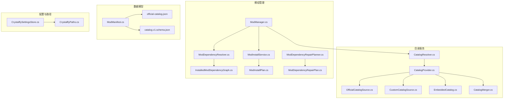
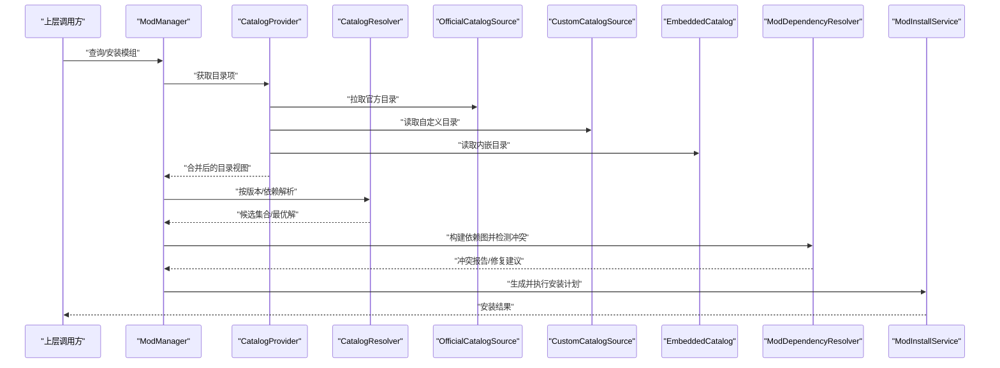
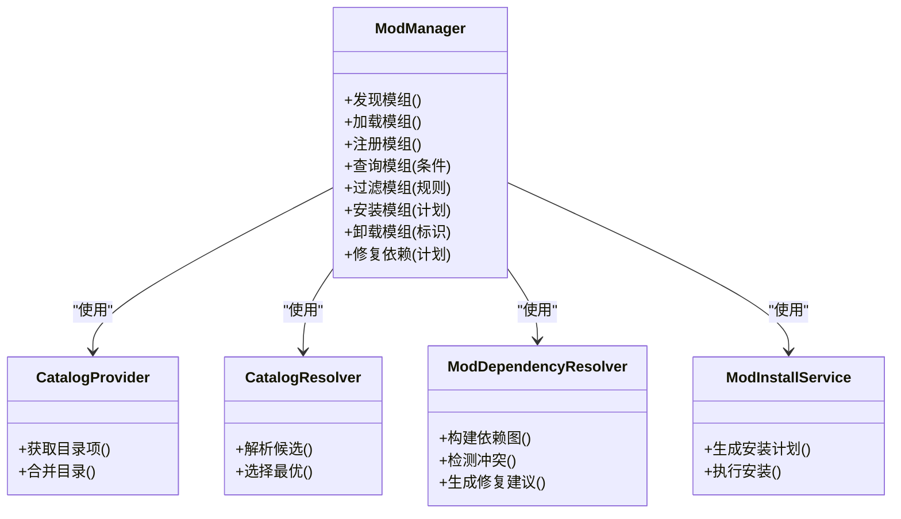
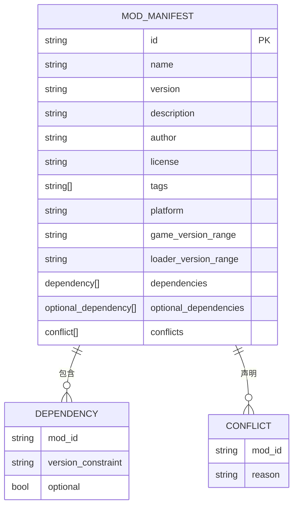
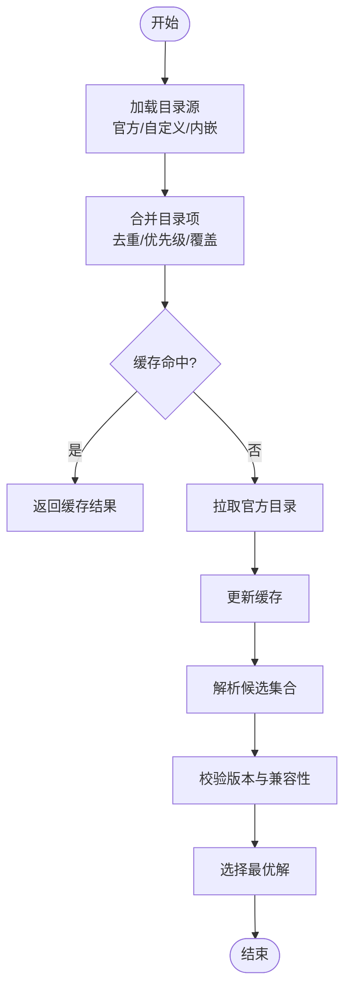
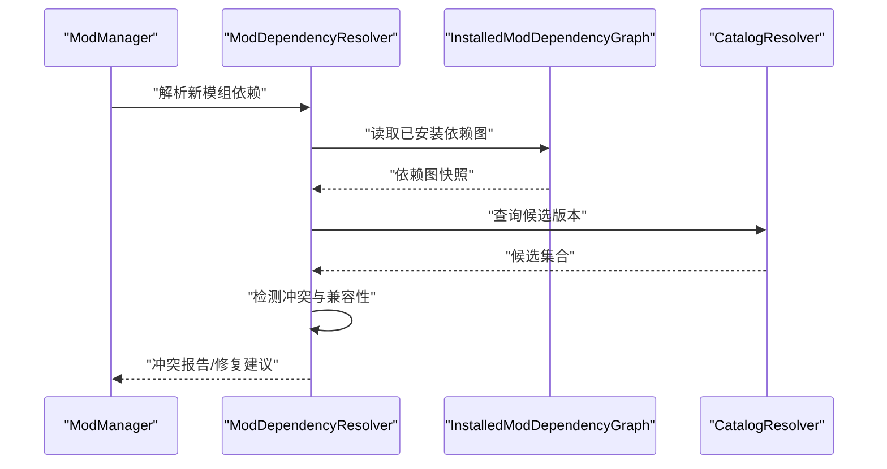
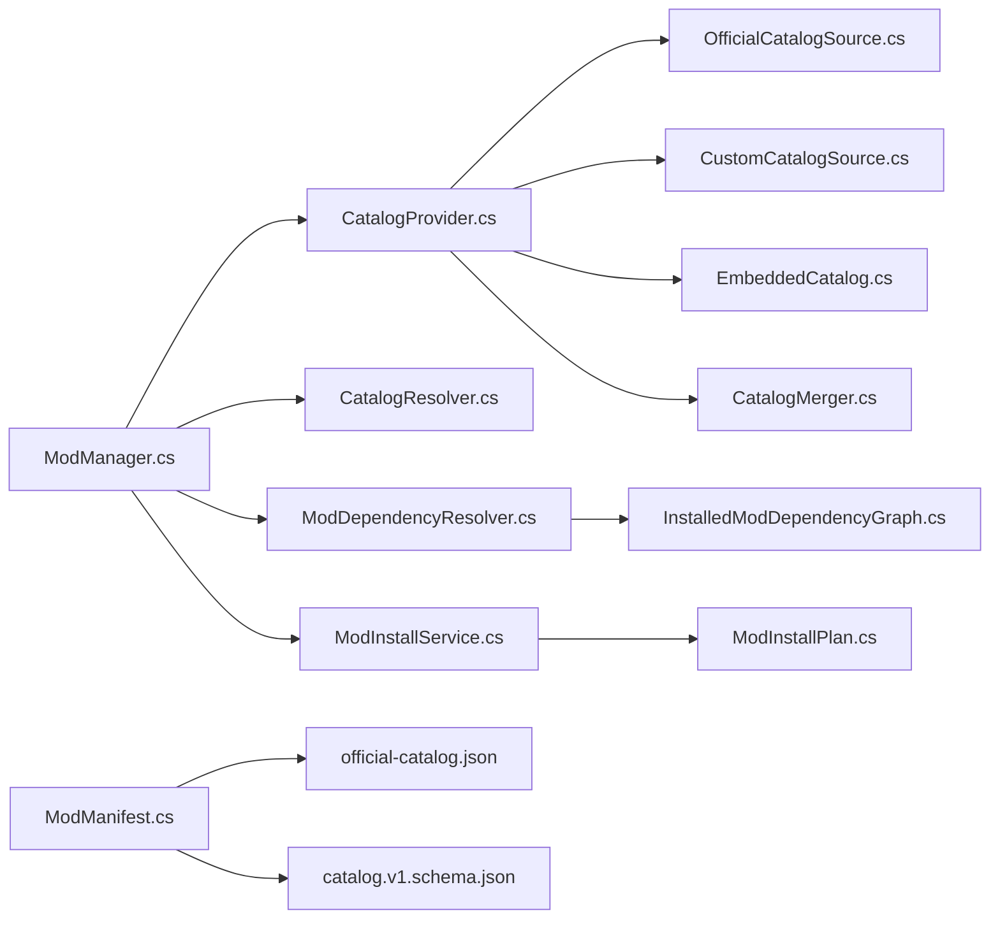

# 模组目录系统

<cite>
**本文引用的文件**   
- [ModManager.cs](file://src/Crystalfly.Core/Mods/ModManager.cs)
- [ModManifest.cs](file://src/Crystalfly.Core/Models/ModManifest.cs)
- [CatalogProvider.cs](file://src/Crystalfly.Core/Catalog/CatalogProvider.cs)
- [CatalogResolver.cs](file://src/Crystalfly.Core/Catalog/CatalogResolver.cs)
- [OfficialCatalogSource.cs](file://src/Crystalfly.Core/Catalog/OfficialCatalogSource.cs)
- [CustomCatalogSource.cs](file://src/Crystalfly.Core/Catalog/CustomCatalogSource.cs)
- [EmbeddedCatalog.cs](file://src/Crystalfly.Core/Catalog/EmbeddedCatalog.cs)
- [CatalogMerger.cs](file://src/Crystalfly.Core/Catalog/CatalogMerger.cs)
- [ModDependencyResolver.cs](file://src/Crystalfly.Core/Mods/ModDependencyResolver.cs)
- [InstalledModDependencyGraph.cs](file://src/Crystalfly.Core/Mods/InstalledModDependencyGraph.cs)
- [ModInstallService.cs](file://src/Crystalfly.Core/Mods/ModInstallService.cs)
- [ModInstallPlan.cs](file://src/Crystalfly.Core/Mods/ModInstallPlan.cs)
- [ModDependencyRepairPlanner.cs](file://src/Crystalfly.Core/Mods/ModDependencyRepairPlanner.cs)
- [ModDependencyRepairPlan.cs](file://src/Crystalfly.Core/Mods/ModDependencyRepairPlan.cs)
- [CrystalflySettingsStore.cs](file://src/Crystalfly.Core/Configuration/CrystalflySettingsStore.cs)
- [CrystalflyPaths.cs](file://src/Crystalfly.Core/Configuration/CrystalflyPaths.cs)
- [official-catalog.json](file://src/Crystalfly.Core/Data/official-catalog.json)
- [catalog.v1.schema.json](file://catalog/catalog.v1.schema.json)
</cite>

## 目录
1. [简介](#简介)
2. [项目结构](#项目结构)
3. [核心组件](#核心组件)
4. [架构总览](#架构总览)
5. [详细组件分析](#详细组件分析)
6. [依赖关系分析](#依赖关系分析)
7. [性能考虑](#性能考虑)
8. [故障排查指南](#故障排查指南)
9. [结论](#结论)
10. [附录](#附录)

## 简介
本技术文档聚焦 Crystalfly 的“模组目录系统”，围绕以下目标展开：
- 深入解释 ModManager 的核心功能，包括模组的发现、加载与管理机制。
- 详细说明 ModManifest 数据模型的结构与字段定义（版本信息、依赖声明、元数据格式等）。
- 阐述 CatalogProvider 与 CatalogResolver 的工作原理，包括目录源解析、缓存策略与性能优化。
- 提供模组清单文件的完整规范说明与示例路径。
- 给出模组注册、查询、过滤等常用操作的实际代码示例（以源码路径引用形式呈现）。
- 解决模组冲突检测与兼容性验证问题。

## 项目结构
模组目录系统主要位于 Core 层，涉及目录服务、清单模型、依赖解析与安装编排等模块。下图展示了与目录系统相关的核心文件及其职责边界。

图表来源
- [CatalogProvider.cs:1-200](file://src/Crystalfly.Core/Catalog/CatalogProvider.cs#L1-L200)
- [CatalogResolver.cs:1-200](file://src/Crystalfly.Core/Catalog/CatalogResolver.cs#L1-L200)
- [OfficialCatalogSource.cs:1-200](file://src/Crystalfly.Core/Catalog/OfficialCatalogSource.cs#L1-L200)
- [CustomCatalogSource.cs:1-200](file://src/Crystalfly.Core/Catalog/CustomCatalogSource.cs#L1-L200)
- [EmbeddedCatalog.cs:1-200](file://src/Crystalfly.Core/Catalog/EmbeddedCatalog.cs#L1-L200)
- [CatalogMerger.cs:1-200](file://src/Crystalfly.Core/Catalog/CatalogMerger.cs#L1-L200)
- [ModManager.cs:1-200](file://src/Crystalfly.Core/Mods/ModManager.cs#L1-L200)
- [ModDependencyResolver.cs:1-200](file://src/Crystalfly.Core/Mods/ModDependencyResolver.cs#L1-L200)
- [InstalledModDependencyGraph.cs:1-200](file://src/Crystalfly.Core/Mods/InstalledModDependencyGraph.cs#L1-L200)
- [ModInstallService.cs:1-200](file://src/Crystalfly.Core/Mods/ModInstallService.cs#L1-L200)
- [ModInstallPlan.cs:1-200](file://src/Crystalfly.Core/Mods/ModInstallPlan.cs#L1-L200)
- [ModDependencyRepairPlanner.cs:1-200](file://src/Crystalfly.Core/Mods/ModDependencyRepairPlanner.cs#L1-L200)
- [ModDependencyRepairPlan.cs:1-200](file://src/Crystalfly.Core/Mods/ModDependencyRepairPlan.cs#L1-L200)
- [ModManifest.cs:1-200](file://src/Crystalfly.Core/Models/ModManifest.cs#L1-L200)
- [official-catalog.json:1-200](file://src/Crystalfly.Core/Data/official-catalog.json#L1-L200)
- [catalog.v1.schema.json:1-200](file://catalog/catalog.v1.schema.json#L1-L200)

章节来源
- [ModManager.cs:1-200](file://src/Crystalfly.Core/Mods/ModManager.cs#L1-L200)
- [CatalogProvider.cs:1-200](file://src/Crystalfly.Core/Catalog/CatalogProvider.cs#L1-L200)
- [CatalogResolver.cs:1-200](file://src/Crystalfly.Core/Catalog/CatalogResolver.cs#L1-L200)
- [ModManifest.cs:1-200](file://src/Crystalfly.Core/Models/ModManifest.cs#L1-L200)

## 核心组件
本节概述目录系统的核心组件及其职责：
- ModManager：模组生命周期管理的入口，负责发现、加载、查询、过滤、安装与卸载协调。
- CatalogProvider：聚合多个目录源（官方、自定义、内嵌），统一对外提供目录项访问能力。
- CatalogResolver：基于版本约束与依赖关系进行解析，返回可安装的候选集或最优解。
- ModManifest：模组清单的数据模型，描述版本、依赖、元数据等。
- ModDependencyResolver / InstalledModDependencyGraph：依赖图构建与冲突检测。
- ModInstallService / ModInstallPlan：安装计划生成与执行。
- ModDependencyRepairPlanner / ModDependencyRepairPlan：修复计划生成与执行。
- 配置与路径：CrystalflySettingsStore 与 CrystalflyPaths 提供设置与路径解析。

章节来源
- [ModManager.cs:1-200](file://src/Crystalfly.Core/Mods/ModManager.cs#L1-L200)
- [CatalogProvider.cs:1-200](file://src/Crystalfly.Core/Catalog/CatalogProvider.cs#L1-L200)
- [CatalogResolver.cs:1-200](file://src/Crystalfly.Core/Catalog/CatalogResolver.cs#L1-L200)
- [ModManifest.cs:1-200](file://src/Crystalfly.Core/Models/ModManifest.cs#L1-L200)
- [ModDependencyResolver.cs:1-200](file://src/Crystalfly.Core/Mods/ModDependencyResolver.cs#L1-L200)
- [InstalledModDependencyGraph.cs:1-200](file://src/Crystalfly.Core/Mods/InstalledModDependencyGraph.cs#L1-L200)
- [ModInstallService.cs:1-200](file://src/Crystalfly.Core/Mods/ModInstallService.cs#L1-L200)
- [ModInstallPlan.cs:1-200](file://src/Crystalfly.Core/Mods/ModInstallPlan.cs#L1-L200)
- [ModDependencyRepairPlanner.cs:1-200](file://src/Crystalfly.Core/Mods/ModDependencyRepairPlanner.cs#L1-L200)
- [ModDependencyRepairPlan.cs:1-200](file://src/Crystalfly.Core/Mods/ModDependencyRepairPlan.cs#L1-L200)
- [CrystalflySettingsStore.cs:1-200](file://src/Crystalfly.Core/Configuration/CrystalflySettingsStore.cs#L1-L200)
- [CrystalflyPaths.cs:1-200](file://src/Crystalfly.Core/Configuration/CrystalflyPaths.cs#L1-L200)

## 架构总览
目录系统采用“多源聚合 + 解析器 + 管理器”的分层架构：
- 目录源层：官方目录、自定义目录、内嵌目录通过 CatalogProvider 聚合。
- 解析层：CatalogResolver 根据版本约束与依赖关系进行解析，输出候选集合或最优解。
- 管理层：ModManager 封装对外的模组管理能力，调用解析器与服务完成安装、卸载、修复等操作。
- 数据模型层：ModManifest 作为清单模型，配合 schema 校验确保一致性。

图表来源
- [ModManager.cs:1-200](file://src/Crystalfly.Core/Mods/ModManager.cs#L1-L200)
- [CatalogProvider.cs:1-200](file://src/Crystalfly.Core/Catalog/CatalogProvider.cs#L1-L200)
- [CatalogResolver.cs:1-200](file://src/Crystalfly.Core/Catalog/CatalogResolver.cs#L1-L200)
- [OfficialCatalogSource.cs:1-200](file://src/Crystalfly.Core/Catalog/OfficialCatalogSource.cs#L1-L200)
- [CustomCatalogSource.cs:1-200](file://src/Crystalfly.Core/Catalog/CustomCatalogSource.cs#L1-L200)
- [EmbeddedCatalog.cs:1-200](file://src/Crystalfly.Core/Catalog/EmbeddedCatalog.cs#L1-L200)
- [ModDependencyResolver.cs:1-200](file://src/Crystalfly.Core/Mods/ModDependencyResolver.cs#L1-L200)
- [ModInstallService.cs:1-200](file://src/Crystalfly.Core/Mods/ModInstallService.cs#L1-L200)

## 详细组件分析

### ModManager 组件分析
ModManager 是模组目录系统的门面，提供统一的 API 用于：
- 模组发现：扫描本地已安装模组与目录项。
- 模组加载：将模组清单与运行时环境结合，形成可用视图。
- 模组管理：注册、查询、过滤、安装、卸载、修复。

图表来源
- [ModManager.cs:1-200](file://src/Crystalfly.Core/Mods/ModManager.cs#L1-L200)
- [CatalogProvider.cs:1-200](file://src/Crystalfly.Core/Catalog/CatalogProvider.cs#L1-L200)
- [CatalogResolver.cs:1-200](file://src/Crystalfly.Core/Catalog/CatalogResolver.cs#L1-L200)
- [ModDependencyResolver.cs:1-200](file://src/Crystalfly.Core/Mods/ModDependencyResolver.cs#L1-L200)
- [ModInstallService.cs:1-200](file://src/Crystalfly.Core/Mods/ModInstallService.cs#L1-L200)

章节来源
- [ModManager.cs:1-200](file://src/Crystalfly.Core/Mods/ModManager.cs#L1-L200)

#### 常用操作示例（源码路径）
- 注册模组：参考 [ModManager.cs:1-200](file://src/Crystalfly.Core/Mods/ModManager.cs#L1-L200)
- 查询模组：参考 [ModManager.cs:1-200](file://src/Crystalfly.Core/Mods/ModManager.cs#L1-L200)
- 过滤模组：参考 [ModManager.cs:1-200](file://src/Crystalfly.Core/Mods/ModManager.cs#L1-L200)
- 安装模组：参考 [ModInstallService.cs:1-200](file://src/Crystalfly.Core/Mods/ModInstallService.cs#L1-L200)、[ModInstallPlan.cs:1-200](file://src/Crystalfly.Core/Mods/ModInstallPlan.cs#L1-L200)
- 修复依赖：参考 [ModDependencyRepairPlanner.cs:1-200](file://src/Crystalfly.Core/Mods/ModDependencyRepairPlanner.cs#L1-L200)、[ModDependencyRepairPlan.cs:1-200](file://src/Crystalfly.Core/Mods/ModDependencyRepairPlan.cs#L1-L200)

### ModManifest 数据模型分析
ModManifest 定义了模组清单的数据结构，包含：
- 版本信息：主版本、次版本、修订号、预发布标记等。
- 依赖声明：直接依赖、可选依赖、冲突声明。
- 元数据格式：名称、描述、作者、许可证、标签、平台要求等。
- 兼容性与约束：游戏版本范围、加载器版本范围等。

图表来源
- [ModManifest.cs:1-200](file://src/Crystalfly.Core/Models/ModManifest.cs#L1-L200)
- [catalog.v1.schema.json:1-200](file://catalog/catalog.v1.schema.json#L1-L200)

章节来源
- [ModManifest.cs:1-200](file://src/Crystalfly.Core/Models/ModManifest.cs#L1-L200)
- [catalog.v1.schema.json:1-200](file://catalog/catalog.v1.schema.json#L1-L200)

### CatalogProvider 与 CatalogResolver 工作原理
- CatalogProvider：
  - 聚合多个目录源：官方目录（网络）、自定义目录（本地）、内嵌目录（程序集资源）。
  - 合并策略：去重、优先级、覆盖规则由 CatalogMerger 控制。
  - 缓存策略：对远程目录响应进行缓存，减少重复请求；本地目录变更时失效缓存。
- CatalogResolver：
  - 输入：用户选择的模组 ID 与版本约束、当前环境信息（游戏/加载器版本）。
  - 处理：解析依赖树、应用版本约束、计算候选集合。
  - 输出：候选集合或最优解（满足约束且无冲突的版本组合）。

图表来源
- [CatalogProvider.cs:1-200](file://src/Crystalfly.Core/Catalog/CatalogProvider.cs#L1-L200)
- [CatalogResolver.cs:1-200](file://src/Crystalfly.Core/Catalog/CatalogResolver.cs#L1-L200)
- [OfficialCatalogSource.cs:1-200](file://src/Crystalfly.Core/Catalog/OfficialCatalogSource.cs#L1-L200)
- [CustomCatalogSource.cs:1-200](file://src/Crystalfly.Core/Catalog/CustomCatalogSource.cs#L1-L200)
- [EmbeddedCatalog.cs:1-200](file://src/Crystalfly.Core/Catalog/EmbeddedCatalog.cs#L1-L200)
- [CatalogMerger.cs:1-200](file://src/Crystalfly.Core/Catalog/CatalogMerger.cs#L1-L200)

章节来源
- [CatalogProvider.cs:1-200](file://src/Crystalfly.Core/Catalog/CatalogProvider.cs#L1-L200)
- [CatalogResolver.cs:1-200](file://src/Crystalfly.Core/Catalog/CatalogResolver.cs#L1-L200)

### 模组冲突检测与兼容性验证
- 冲突检测：
  - 基于 InstalledModDependencyGraph 构建已安装模组的依赖图。
  - ModDependencyResolver 在解析新模组时检查是否存在直接/间接冲突。
- 兼容性验证：
  - 依据 ModManifest 中的版本范围与平台要求进行校验。
  - 结合 CatalogResolver 的版本约束计算，排除不兼容候选。

图表来源
- [ModDependencyResolver.cs:1-200](file://src/Crystalfly.Core/Mods/ModDependencyResolver.cs#L1-L200)
- [InstalledModDependencyGraph.cs:1-200](file://src/Crystalfly.Core/Mods/InstalledModDependencyGraph.cs#L1-L200)
- [CatalogResolver.cs:1-200](file://src/Crystalfly.Core/Catalog/CatalogResolver.cs#L1-L200)

章节来源
- [ModDependencyResolver.cs:1-200](file://src/Crystalfly.Core/Mods/ModDependencyResolver.cs#L1-L200)
- [InstalledModDependencyGraph.cs:1-200](file://src/Crystalfly.Core/Mods/InstalledModDependencyGraph.cs#L1-L200)

### 模组清单文件规范与示例
- 规范来源：
  - 数据模型定义：[ModManifest.cs:1-200](file://src/Crystalfly.Core/Models/ModManifest.cs#L1-L200)
  - Schema 校验：[catalog.v1.schema.json:1-200](file://catalog/catalog.v1.schema.json#L1-L200)
  - 官方目录样例：[official-catalog.json:1-200](file://src/Crystalfly.Core/Data/official-catalog.json#L1-L200)
- 关键要点：
  - 必须包含唯一标识、版本、依赖与元数据。
  - 版本约束需遵循语义化版本与范围表达式。
  - 平台与加载器版本范围应明确，避免运行期不兼容。

章节来源
- [ModManifest.cs:1-200](file://src/Crystalfly.Core/Models/ModManifest.cs#L1-L200)
- [catalog.v1.schema.json:1-200](file://catalog/catalog.v1.schema.json#L1-L200)
- [official-catalog.json:1-200](file://src/Crystalfly.Core/Data/official-catalog.json#L1-L200)

## 依赖关系分析
目录系统与模组管理之间的依赖关系如下：

图表来源
- [ModManager.cs:1-200](file://src/Crystalfly.Core/Mods/ModManager.cs#L1-L200)
- [CatalogProvider.cs:1-200](file://src/Crystalfly.Core/Catalog/CatalogProvider.cs#L1-L200)
- [CatalogResolver.cs:1-200](file://src/Crystalfly.Core/Catalog/CatalogResolver.cs#L1-L200)
- [OfficialCatalogSource.cs:1-200](file://src/Crystalfly.Core/Catalog/OfficialCatalogSource.cs#L1-L200)
- [CustomCatalogSource.cs:1-200](file://src/Crystalfly.Core/Catalog/CustomCatalogSource.cs#L1-L200)
- [EmbeddedCatalog.cs:1-200](file://src/Crystalfly.Core/Catalog/EmbeddedCatalog.cs#L1-L200)
- [CatalogMerger.cs:1-200](file://src/Crystalfly.Core/Catalog/CatalogMerger.cs#L1-L200)
- [ModDependencyResolver.cs:1-200](file://src/Crystalfly.Core/Mods/ModDependencyResolver.cs#L1-L200)
- [InstalledModDependencyGraph.cs:1-200](file://src/Crystalfly.Core/Mods/InstalledModDependencyGraph.cs#L1-L200)
- [ModInstallService.cs:1-200](file://src/Crystalfly.Core/Mods/ModInstallService.cs#L1-L200)
- [ModInstallPlan.cs:1-200](file://src/Crystalfly.Core/Mods/ModInstallPlan.cs#L1-L200)
- [ModManifest.cs:1-200](file://src/Crystalfly.Core/Models/ModManifest.cs#L1-L200)
- [official-catalog.json:1-200](file://src/Crystalfly.Core/Data/official-catalog.json#L1-L200)
- [catalog.v1.schema.json:1-200](file://catalog/catalog.v1.schema.json#L1-L200)

章节来源
- [ModManager.cs:1-200](file://src/Crystalfly.Core/Mods/ModManager.cs#L1-L200)
- [CatalogProvider.cs:1-200](file://src/Crystalfly.Core/Catalog/CatalogProvider.cs#L1-L200)
- [CatalogResolver.cs:1-200](file://src/Crystalfly.Core/Catalog/CatalogResolver.cs#L1-L200)
- [ModDependencyResolver.cs:1-200](file://src/Crystalfly.Core/Mods/ModDependencyResolver.cs#L1-L200)
- [ModInstallService.cs:1-200](file://src/Crystalfly.Core/Mods/ModInstallService.cs#L1-L200)
- [ModManifest.cs:1-200](file://src/Crystalfly.Core/Models/ModManifest.cs#L1-L200)

## 性能考虑
- 目录源缓存：
  - 对官方目录的网络响应进行缓存，降低重复请求开销。
  - 本地目录变更时及时失效缓存，保证一致性。
- 合并与解析优化：
  - 使用 CatalogMerger 进行高效合并，避免重复计算。
  - CatalogResolver 在解析阶段尽早剪枝不满足约束的候选，减少搜索空间。
- I/O 与并发：
  - 并行拉取多个目录源，提升整体吞吐。
  - 对大目录项集合进行分页或增量更新。
- 内存占用：
  - 按需加载模组详情，避免一次性载入全部元数据。
  - 清理不再使用的依赖图快照，防止内存泄漏。

[本节为通用性能指导，无需具体文件分析]

## 故障排查指南
- 常见问题定位：
  - 目录源不可达：检查官方目录网络连通性与自定义目录路径有效性。
  - 版本冲突：查看 ModDependencyResolver 的冲突报告，确认依赖范围是否合理。
  - 兼容性失败：核对 ModManifest 的平台与版本范围是否与当前环境匹配。
- 修复流程：
  - 使用 ModDependencyRepairPlanner 生成修复计划。
  - 通过 ModDependencyRepairPlan 执行修复步骤（升级/降级/移除）。
- 日志与诊断：
  - 记录解析过程的关键决策点，便于回溯。
  - 输出依赖图与候选集合，辅助人工分析。

章节来源
- [ModDependencyResolver.cs:1-200](file://src/Crystalfly.Core/Mods/ModDependencyResolver.cs#L1-L200)
- [ModDependencyRepairPlanner.cs:1-200](file://src/Crystalfly.Core/Mods/ModDependencyRepairPlanner.cs#L1-L200)
- [ModDependencyRepairPlan.cs:1-200](file://src/Crystalfly.Core/Mods/ModDependencyRepairPlan.cs#L1-L200)

## 结论
Crystalfly 的模组目录系统通过多源聚合、严格解析与统一管理，提供了稳定可靠的模组发现、加载与管理能力。ModManifest 的规范化与 Schema 校验确保了清单的一致性；CatalogProvider 与 CatalogResolver 的组合实现了高效的目录解析与候选选择；依赖图与修复计划则有效解决了冲突与兼容性问题。建议在集成与扩展时遵循现有接口契约，充分利用缓存与并发优化，以获得更好的性能与用户体验。

[本节为总结性内容，无需具体文件分析]

## 附录
- 配置与路径：
  - CrystalflySettingsStore：提供设置读写能力。
  - CrystalflyPaths：提供路径解析与标准化。
- 官方目录样例：
  - official-catalog.json：展示目录项结构与字段含义。

章节来源
- [CrystalflySettingsStore.cs:1-200](file://src/Crystalfly.Core/Configuration/CrystalflySettingsStore.cs#L1-L200)
- [CrystalflyPaths.cs:1-200](file://src/Crystalfly.Core/Configuration/CrystalflyPaths.cs#L1-L200)
- [official-catalog.json:1-200](file://src/Crystalfly.Core/Data/official-catalog.json#L1-L200)