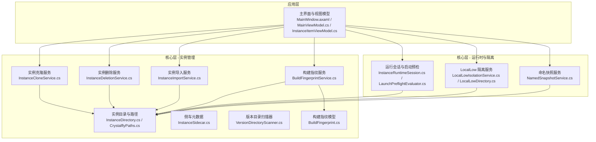
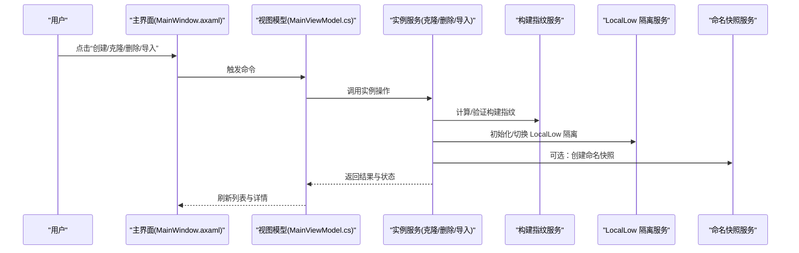
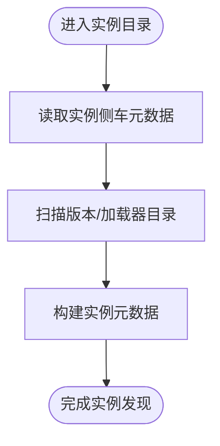
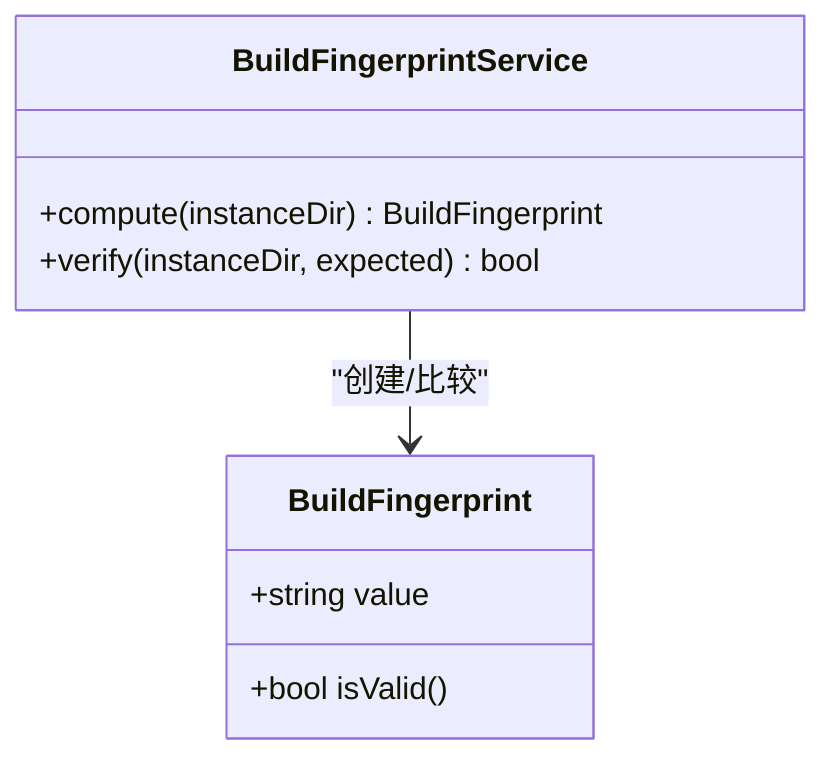
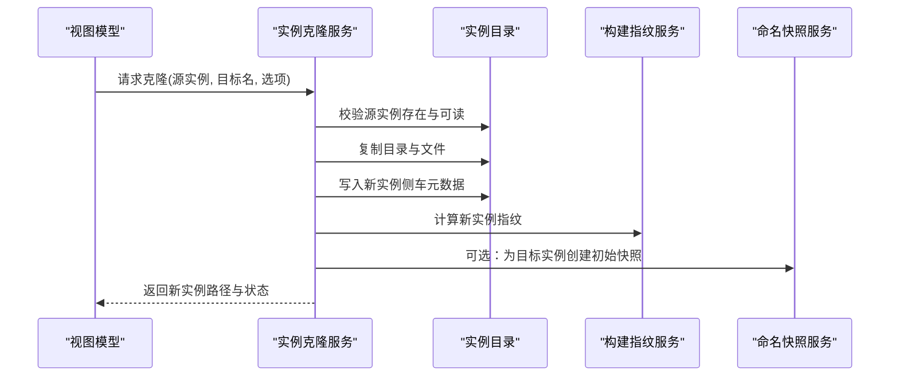
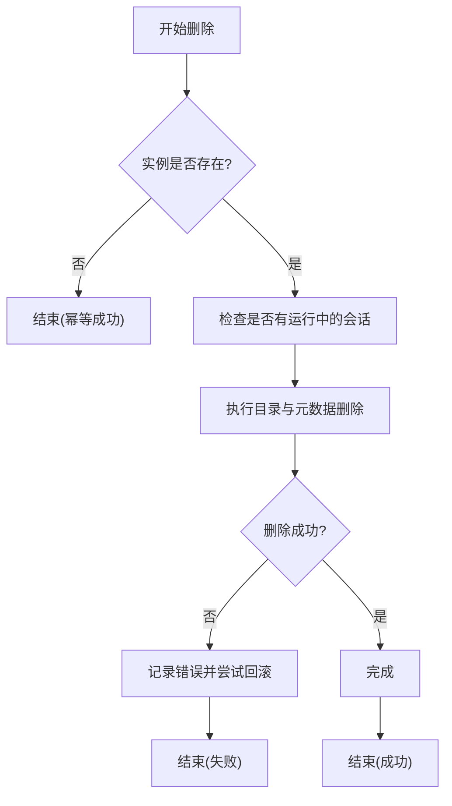
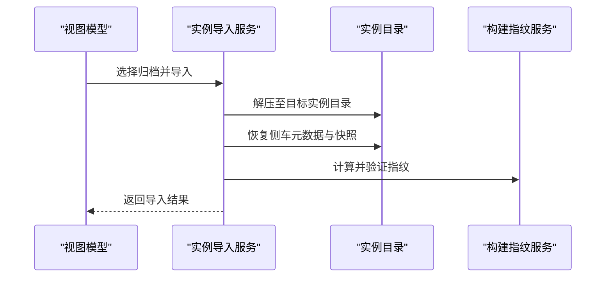
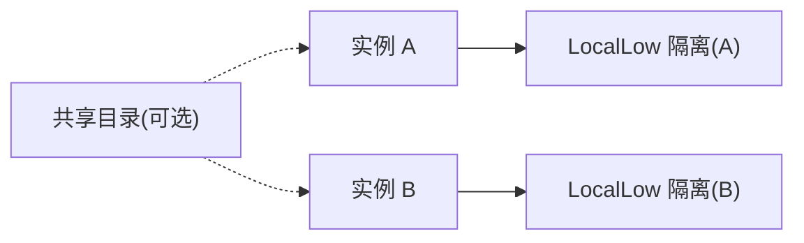
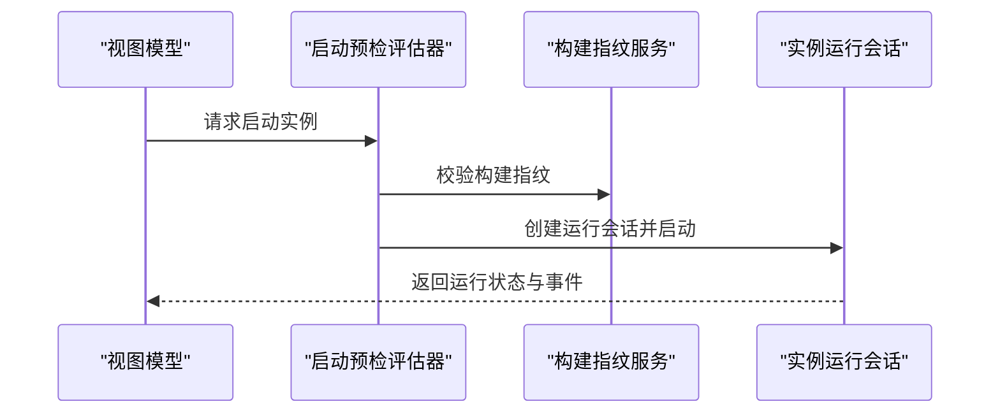
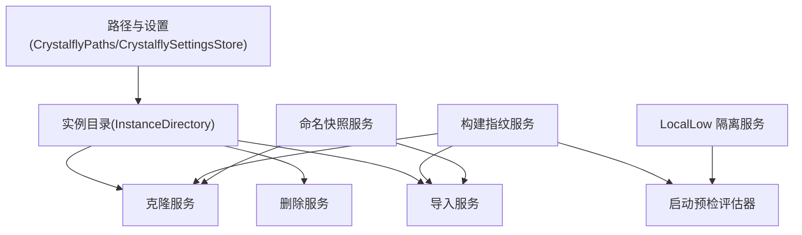

# 游戏实例管理

<cite>
**本文引用的文件**   
- [BuildFingerprintService.cs](file://src/Crystalfly.Core/Instances/BuildFingerprintService.cs)
- [InstanceCloneService.cs](file://src/Crystalfly.Core/Instances/InstanceCloneService.cs)
- [InstanceDeletionService.cs](file://src/Crystalfly.Core/Instances/InstanceDeletionService.cs)
- [InstanceDirectory.cs](file://src/Crystalfly.Core/Instances/InstanceDirectory.cs)
- [InstanceImportService.cs](file://src/Crystalfly.Core/Instances/InstanceImportService.cs)
- [InstanceSidecar.cs](file://src/Crystalfly.Core/Instances/InstanceSidecar.cs)
- [VersionDirectoryScanner.cs](file://src/Crystalfly.Core/Instances/VersionDirectoryScanner.cs)
- [BuildFingerprint.cs](file://src/Crystalfly.Core/Models/BuildFingerprint.cs)
- [CrystalflyPaths.cs](file://src/Crystalfly.Core/Configuration/CrystalflyPaths.cs)
- [CrystalflySettings.cs](file://src/Crystalfly.Core/Configuration/CrystalflySettings.cs)
- [CrystalflySettingsStore.cs](file://src/Crystalfly.Core/Configuration/CrystalflySettingsStore.cs)
- [InstanceRuntimeSession.cs](file://src/Crystalfly.Core/Runtime/InstanceRuntimeSession.cs)
- [LaunchPreflightEvaluator.cs](file://src/Crystalfly.Core/Runtime/LaunchPreflightEvaluator.cs)
- [LocalLowIsolationService.cs](file://src/Crystalfly.Core/LocalLow/LocalLowIsolationService.cs)
- [LocalLowDirectory.cs](file://src/Crystalfly.Core/LocalLow/LocalLowDirectory.cs)
- [NamedSnapshotService.cs](file://src/Crystalfly.Core/Snapshots/NamedSnapshotService.cs)
- [MainViewModel.cs](file://src/Crystalfly.App/ViewModels/MainViewModel.cs)
- [InstanceItemViewModel.cs](file://src/Crystalfly.App/ViewModels/InstanceItemViewModel.cs)
- [MainWindow.axaml](file://src/Crystalfly.App/Views/MainWindow.axaml)
</cite>

## 目录
1. [简介](#简介)
2. [项目结构](#项目结构)
3. [核心组件](#核心组件)
4. [架构总览](#架构总览)
5. [详细组件分析](#详细组件分析)
6. [依赖关系分析](#依赖关系分析)
7. [性能与可靠性](#性能与可靠性)
8. [故障排查指南](#故障排查指南)
9. [结论](#结论)
10. [附录：使用示例与最佳实践](#附录使用示例与最佳实践)

## 简介
本文件面向 Crystalfly 的“游戏实例管理”能力，系统性阐述实例的生命周期（创建、克隆、删除、导入导出）、构建指纹系统的工作原理与验证机制、实例目录结构与配置文件格式、隔离机制与数据共享策略，并提供从 UI 到 API 的使用示例与常见问题解决方案。文档兼顾初学者入门与高级用户深入理解的需求。

## 项目结构
与实例管理相关的代码主要分布在 Core 层的 Instances、Configuration、LocalLow、Runtime、Snapshots 等模块，以及 App 层的 ViewModel 和视图层。下图给出与实例管理直接相关的高层组织关系。

图表来源
- [InstanceDirectory.cs](file://src/Crystalfly.Core/Instances/InstanceDirectory.cs)
- [InstanceCloneService.cs](file://src/Crystalfly.Core/Instances/InstanceCloneService.cs)
- [InstanceDeletionService.cs](file://src/Crystalfly.Core/Instances/InstanceDeletionService.cs)
- [InstanceImportService.cs](file://src/Crystalfly.Core/Instances/InstanceImportService.cs)
- [InstanceSidecar.cs](file://src/Crystalfly.Core/Instances/InstanceSidecar.cs)
- [VersionDirectoryScanner.cs](file://src/Crystalfly.Core/Instances/VersionDirectoryScanner.cs)
- [BuildFingerprintService.cs](file://src/Crystalfly.Core/Instances/BuildFingerprintService.cs)
- [BuildFingerprint.cs](file://src/Crystalfly.Core/Models/BuildFingerprint.cs)
- [CrystalflyPaths.cs](file://src/Crystalfly.Core/Configuration/CrystalflyPaths.cs)
- [InstanceRuntimeSession.cs](file://src/Crystalfly.Core/Runtime/InstanceRuntimeSession.cs)
- [LaunchPreflightEvaluator.cs](file://src/Crystalfly.Core/Runtime/LaunchPreflightEvaluator.cs)
- [LocalLowIsolationService.cs](file://src/Crystalfly.Core/LocalLow/LocalLowIsolationService.cs)
- [LocalLowDirectory.cs](file://src/Crystalfly.Core/LocalLow/LocalLowDirectory.cs)
- [NamedSnapshotService.cs](file://src/Crystalfly.Core/Snapshots/NamedSnapshotService.cs)
- [MainWindow.axaml](file://src/Crystalfly.App/Views/MainWindow.axaml)
- [MainViewModel.cs](file://src/Crystalfly.App/ViewModels/MainViewModel.cs)
- [InstanceItemViewModel.cs](file://src/Crystalfly.App/ViewModels/InstanceItemViewModel.cs)

章节来源
- [InstanceDirectory.cs](file://src/Crystalfly.Core/Instances/InstanceDirectory.cs)
- [CrystalflyPaths.cs](file://src/Crystalfly.Core/Configuration/CrystalflyPaths.cs)
- [InstanceCloneService.cs](file://src/Crystalfly.Core/Instances/InstanceCloneService.cs)
- [InstanceDeletionService.cs](file://src/Crystalfly.Core/Instances/InstanceDeletionService.cs)
- [InstanceImportService.cs](file://src/Crystalfly.Core/Instances/InstanceImportService.cs)
- [InstanceSidecar.cs](file://src/Crystalfly.Core/Instances/InstanceSidecar.cs)
- [VersionDirectoryScanner.cs](file://src/Crystalfly.Core/Instances/VersionDirectoryScanner.cs)
- [BuildFingerprintService.cs](file://src/Crystalfly.Core/Instances/BuildFingerprintService.cs)
- [BuildFingerprint.cs](file://src/Crystalfly.Core/Models/BuildFingerprint.cs)
- [InstanceRuntimeSession.cs](file://src/Crystalfly.Core/Runtime/InstanceRuntimeSession.cs)
- [LaunchPreflightEvaluator.cs](file://src/Crystalfly.Core/Runtime/LaunchPreflightEvaluator.cs)
- [LocalLowIsolationService.cs](file://src/Crystalfly.Core/LocalLow/LocalLowIsolationService.cs)
- [LocalLowDirectory.cs](file://src/Crystalfly.Core/LocalLow/LocalLowDirectory.cs)
- [NamedSnapshotService.cs](file://src/Crystalfly.Core/Snapshots/NamedSnapshotService.cs)
- [MainWindow.axaml](file://src/Crystalfly.App/Views/MainWindow.axaml)
- [MainViewModel.cs](file://src/Crystalfly.App/ViewModels/MainViewModel.cs)
- [InstanceItemViewModel.cs](file://src/Crystalfly.App/ViewModels/InstanceItemViewModel.cs)

## 核心组件
- 实例目录与路径解析：负责实例根目录、子目录约定、全局路径配置与设置持久化。
- 实例克隆服务：基于现有实例快速复制生成新实例，支持选择性拷贝与差异处理。
- 实例删除服务：安全清理实例目录与关联元数据，提供回滚与幂等保障。
- 实例导入服务：将外部打包或导出的实例归档还原为可运行实例。
- 构建指纹服务：对实例关键要素进行哈希计算，用于一致性校验与变更检测。
- 侧车元数据：维护实例级附加信息（如名称、描述、标签、扩展属性）。
- 版本目录扫描器：枚举并识别实例内的版本/加载器目录结构。
- 运行与会话：封装实例启动前检查、进程守护与生命周期事件。
- LocalLow 隔离：按实例隔离用户存档与配置，避免跨实例污染。
- 命名快照：在实例级别提供可命名的状态快照能力。

章节来源
- [InstanceDirectory.cs](file://src/Crystalfly.Core/Instances/InstanceDirectory.cs)
- [CrystalflyPaths.cs](file://src/Crystalfly.Core/Configuration/CrystalflyPaths.cs)
- [CrystalflySettings.cs](file://src/Crystalfly.Core/Configuration/CrystalflySettings.cs)
- [CrystalflySettingsStore.cs](file://src/Crystalfly.Core/Configuration/CrystalflySettingsStore.cs)
- [InstanceCloneService.cs](file://src/Crystalfly.Core/Instances/InstanceCloneService.cs)
- [InstanceDeletionService.cs](file://src/Crystalfly.Core/Instances/InstanceDeletionService.cs)
- [InstanceImportService.cs](file://src/Crystalfly.Core/Instances/InstanceImportService.cs)
- [InstanceSidecar.cs](file://src/Crystalfly.Core/Instances/InstanceSidecar.cs)
- [VersionDirectoryScanner.cs](file://src/Crystalfly.Core/Instances/VersionDirectoryScanner.cs)
- [BuildFingerprintService.cs](file://src/Crystalfly.Core/Instances/BuildFingerprintService.cs)
- [BuildFingerprint.cs](file://src/Crystalfly.Core/Models/BuildFingerprint.cs)
- [InstanceRuntimeSession.cs](file://src/Crystalfly.Core/Runtime/InstanceRuntimeSession.cs)
- [LaunchPreflightEvaluator.cs](file://src/Crystalfly.Core/Runtime/LaunchPreflightEvaluator.cs)
- [LocalLowIsolationService.cs](file://src/Crystalfly.Core/LocalLow/LocalLowIsolationService.cs)
- [LocalLowDirectory.cs](file://src/Crystalfly.Core/LocalLow/LocalLowDirectory.cs)
- [NamedSnapshotService.cs](file://src/Crystalfly.Core/Snapshots/NamedSnapshotService.cs)

## 架构总览
下图展示实例管理在 UI 与核心服务之间的交互关系，以及关键子系统（指纹、隔离、快照）如何参与实例生命周期。

图表来源
- [MainWindow.axaml](file://src/Crystalfly.App/Views/MainWindow.axaml)
- [MainViewModel.cs](file://src/Crystalfly.App/ViewModels/MainViewModel.cs)
- [InstanceCloneService.cs](file://src/Crystalfly.Core/Instances/InstanceCloneService.cs)
- [InstanceDeletionService.cs](file://src/Crystalfly.Core/Instances/InstanceDeletionService.cs)
- [InstanceImportService.cs](file://src/Crystalfly.Core/Instances/InstanceImportService.cs)
- [BuildFingerprintService.cs](file://src/Crystalfly.Core/Instances/BuildFingerprintService.cs)
- [LocalLowIsolationService.cs](file://src/Crystalfly.Core/LocalLow/LocalLowIsolationService.cs)
- [NamedSnapshotService.cs](file://src/Crystalfly.Core/Snapshots/NamedSnapshotService.cs)

## 详细组件分析

### 实例目录结构与配置文件
- 实例根目录由路径解析与设置存储共同决定，包含版本/加载器目录、存档隔离目录、侧车元数据与快照目录等。
- 侧车元数据用于保存实例级非游戏文件信息（如名称、描述、标签、自定义键值），便于 UI 展示与管理。
- 版本目录扫描器负责识别实例内已安装的游戏版本与加载器布局，辅助启动与兼容性判断。

图表来源
- [InstanceDirectory.cs](file://src/Crystalfly.Core/Instances/InstanceDirectory.cs)
- [InstanceSidecar.cs](file://src/Crystalfly.Core/Instances/InstanceSidecar.cs)
- [VersionDirectoryScanner.cs](file://src/Crystalfly.Core/Instances/VersionDirectoryScanner.cs)
- [CrystalflyPaths.cs](file://src/Crystalfly.Core/Configuration/CrystalflyPaths.cs)
- [CrystalflySettings.cs](file://src/Crystalfly.Core/Configuration/CrystalflySettings.cs)
- [CrystalflySettingsStore.cs](file://src/Crystalfly.Core/Configuration/CrystalflySettingsStore.cs)

章节来源
- [InstanceDirectory.cs](file://src/Crystalfly.Core/Instances/InstanceDirectory.cs)
- [InstanceSidecar.cs](file://src/Crystalfly.Core/Instances/InstanceSidecar.cs)
- [VersionDirectoryScanner.cs](file://src/Crystalfly.Core/Instances/VersionDirectoryScanner.cs)
- [CrystalflyPaths.cs](file://src/Crystalfly.Core/Configuration/CrystalflyPaths.cs)
- [CrystalflySettings.cs](file://src/Crystalfly.Core/Configuration/CrystalflySettings.cs)
- [CrystalflySettingsStore.cs](file://src/Crystalfly.Core/Configuration/CrystalflySettingsStore.cs)

### 构建指纹系统：工作原理与验证
- 目标：以不可变方式标识一个实例的“构建状态”，用于一致性校验、冲突检测与变更追踪。
- 输入：实例关键文件集合（例如核心二进制、加载器清单、关键配置等），具体范围由实现定义。
- 算法：对选定文件内容或元数据进行哈希聚合，得到稳定指纹；当关键文件变化时指纹随之改变。
- 验证：在启动前或关键操作前后比对当前指纹与期望指纹，决定是否允许继续。

图表来源
- [BuildFingerprint.cs](file://src/Crystalfly.Core/Models/BuildFingerprint.cs)
- [BuildFingerprintService.cs](file://src/Crystalfly.Core/Instances/BuildFingerprintService.cs)

章节来源
- [BuildFingerprint.cs](file://src/Crystalfly.Core/Models/BuildFingerprint.cs)
- [BuildFingerprintService.cs](file://src/Crystalfly.Core/Instances/BuildFingerprintService.cs)

### 实例克隆流程
- 输入：源实例路径、目标实例名称/路径、是否保留存档/配置等选项。
- 过程：校验源实例有效性 -> 复制实例目录结构 -> 更新侧车元数据 -> 重新计算指纹 -> 可选：创建命名快照。
- 输出：新实例可用，具备独立 LocalLow 隔离。

图表来源
- [InstanceCloneService.cs](file://src/Crystalfly.Core/Instances/InstanceCloneService.cs)
- [InstanceDirectory.cs](file://src/Crystalfly.Core/Instances/InstanceDirectory.cs)
- [BuildFingerprintService.cs](file://src/Crystalfly.Core/Instances/BuildFingerprintService.cs)
- [NamedSnapshotService.cs](file://src/Crystalfly.Core/Snapshots/NamedSnapshotService.cs)

章节来源
- [InstanceCloneService.cs](file://src/Crystalfly.Core/Instances/InstanceCloneService.cs)
- [InstanceDirectory.cs](file://src/Crystalfly.Core/Instances/InstanceDirectory.cs)
- [BuildFingerprintService.cs](file://src/Crystalfly.Core/Instances/BuildFingerprintService.cs)
- [NamedSnapshotService.cs](file://src/Crystalfly.Core/Snapshots/NamedSnapshotService.cs)

### 实例删除流程
- 输入：目标实例路径、是否强制删除、是否保留备份。
- 过程：校验实例存在 -> 停止可能运行的会话 -> 原子性删除目录与元数据 -> 幂等处理重复删除。
- 输出：实例被彻底移除或按策略回滚。

图表来源
- [InstanceDeletionService.cs](file://src/Crystalfly.Core/Instances/InstanceDeletionService.cs)
- [InstanceRuntimeSession.cs](file://src/Crystalfly.Core/Runtime/InstanceRuntimeSession.cs)

章节来源
- [InstanceDeletionService.cs](file://src/Crystalfly.Core/Instances/InstanceDeletionService.cs)
- [InstanceRuntimeSession.cs](file://src/Crystalfly.Core/Runtime/InstanceRuntimeSession.cs)

### 实例导入与导出
- 导入：从归档包恢复实例目录结构、侧车元数据与快照，重建指纹并验证完整性。
- 导出：将实例打包为可移植归档，包含必要文件与元数据，便于迁移与分享。
- 注意：导入时需确保目标路径不存在或为空，避免覆盖已有实例。

图表来源
- [InstanceImportService.cs](file://src/Crystalfly.Core/Instances/InstanceImportService.cs)
- [InstanceDirectory.cs](file://src/Crystalfly.Core/Instances/InstanceDirectory.cs)
- [BuildFingerprintService.cs](file://src/Crystalfly.Core/Instances/BuildFingerprintService.cs)

章节来源
- [InstanceImportService.cs](file://src/Crystalfly.Core/Instances/InstanceImportService.cs)
- [InstanceDirectory.cs](file://src/Crystalfly.Core/Instances/InstanceDirectory.cs)
- [BuildFingerprintService.cs](file://src/Crystalfly.Core/Instances/BuildFingerprintService.cs)

### 实例间隔离机制与数据共享策略
- 隔离：通过 LocalLow 隔离服务为每个实例映射独立的存档与配置目录，避免跨实例污染。
- 共享：可通过侧车元数据或外部共享目录进行可控的数据共享（例如公共模组或资源），但需遵循权限与一致性约束。
- 建议：优先使用实例内资源；仅在必要时启用共享，并做好版本与依赖管理。

图表来源
- [LocalLowIsolationService.cs](file://src/Crystalfly.Core/LocalLow/LocalLowIsolationService.cs)
- [LocalLowDirectory.cs](file://src/Crystalfly.Core/LocalLow/LocalLowDirectory.cs)
- [InstanceSidecar.cs](file://src/Crystalfly.Core/Instances/InstanceSidecar.cs)

章节来源
- [LocalLowIsolationService.cs](file://src/Crystalfly.Core/LocalLow/LocalLowIsolationService.cs)
- [LocalLowDirectory.cs](file://src/Crystalfly.Core/LocalLow/LocalLowDirectory.cs)
- [InstanceSidecar.cs](file://src/Crystalfly.Core/Instances/InstanceSidecar.cs)

### 启动前预检与运行会话
- 预检：在启动前评估实例环境（路径、依赖、指纹一致性、磁盘空间等），不满足条件则阻止启动。
- 会话：封装实例运行时的进程守护、日志收集与异常上报，提供统一的运行生命周期接口。

图表来源
- [LaunchPreflightEvaluator.cs](file://src/Crystalfly.Core/Runtime/LaunchPreflightEvaluator.cs)
- [BuildFingerprintService.cs](file://src/Crystalfly.Core/Instances/BuildFingerprintService.cs)
- [InstanceRuntimeSession.cs](file://src/Crystalfly.Core/Runtime/InstanceRuntimeSession.cs)

章节来源
- [LaunchPreflightEvaluator.cs](file://src/Crystalfly.Core/Runtime/LaunchPreflightEvaluator.cs)
- [BuildFingerprintService.cs](file://src/Crystalfly.Core/Instances/BuildFingerprintService.cs)
- [InstanceRuntimeSession.cs](file://src/Crystalfly.Core/Runtime/InstanceRuntimeSession.cs)

## 依赖关系分析
- 低耦合：各服务围绕实例目录与元数据进行协作，职责清晰，便于替换与测试。
- 关键依赖链：
  - 克隆/删除/导入均依赖实例目录与路径解析。
  - 构建指纹贯穿创建、克隆、导入与启动前预检。
  - 隔离服务在启动与运行阶段生效，保证存档与配置互不干扰。
  - 命名快照可在任意时间点为实例建立一致状态点。

图表来源
- [CrystalflyPaths.cs](file://src/Crystalfly.Core/Configuration/CrystalflyPaths.cs)
- [CrystalflySettingsStore.cs](file://src/Crystalfly.Core/Configuration/CrystalflySettingsStore.cs)
- [InstanceDirectory.cs](file://src/Crystalfly.Core/Instances/InstanceDirectory.cs)
- [InstanceCloneService.cs](file://src/Crystalfly.Core/Instances/InstanceCloneService.cs)
- [InstanceDeletionService.cs](file://src/Crystalfly.Core/Instances/InstanceDeletionService.cs)
- [InstanceImportService.cs](file://src/Crystalfly.Core/Instances/InstanceImportService.cs)
- [BuildFingerprintService.cs](file://src/Crystalfly.Core/Instances/BuildFingerprintService.cs)
- [LaunchPreflightEvaluator.cs](file://src/Crystalfly.Core/Runtime/LaunchPreflightEvaluator.cs)
- [LocalLowIsolationService.cs](file://src/Crystalfly.Core/LocalLow/LocalLowIsolationService.cs)
- [NamedSnapshotService.cs](file://src/Crystalfly.Core/Snapshots/NamedSnapshotService.cs)

章节来源
- [CrystalflyPaths.cs](file://src/Crystalfly.Core/Configuration/CrystalflyPaths.cs)
- [CrystalflySettingsStore.cs](file://src/Crystalfly.Core/Configuration/CrystalflySettingsStore.cs)
- [InstanceDirectory.cs](file://src/Crystalfly.Core/Instances/InstanceDirectory.cs)
- [InstanceCloneService.cs](file://src/Crystalfly.Core/Instances/InstanceCloneService.cs)
- [InstanceDeletionService.cs](file://src/Crystalfly.Core/Instances/InstanceDeletionService.cs)
- [InstanceImportService.cs](file://src/Crystalfly.Core/Instances/InstanceImportService.cs)
- [BuildFingerprintService.cs](file://src/Crystalfly.Core/Instances/BuildFingerprintService.cs)
- [LaunchPreflightEvaluator.cs](file://src/Crystalfly.Core/Runtime/LaunchPreflightEvaluator.cs)
- [LocalLowIsolationService.cs](file://src/Crystalfly.Core/LocalLow/LocalLowIsolationService.cs)
- [NamedSnapshotService.cs](file://src/Crystalfly.Core/Snapshots/NamedSnapshotService.cs)

## 性能与可靠性
- 大目录复制优化：克隆与导入时应采用增量/并行策略，减少 I/O 等待时间。
- 指纹计算优化：仅对关键文件集计算哈希，避免全量扫描带来的开销。
- 事务与回滚：删除与导入应使用事务式文件操作，失败时自动回滚，保证一致性。
- 并发控制：同一实例的写操作串行化，避免竞态条件导致损坏。
- 资源监控：在启动前预检中检查磁盘空间与权限，提前规避失败。

[本节为通用指导，无需特定文件引用]

## 故障排查指南
- 无法启动：检查启动预检结果与构建指纹是否匹配；确认 LocalLow 隔离目录权限正确。
- 克隆失败：确认源实例未被占用且可读；检查目标路径是否存在或具有写入权限。
- 导入失败：验证归档完整性与格式；确认目标实例目录为空或不存在。
- 删除失败：检查是否有运行中的会话占用；查看文件系统权限与回收站策略。
- 快照异常：确认快照服务可用且磁盘空间充足；必要时重建快照索引。

章节来源
- [LaunchPreflightEvaluator.cs](file://src/Crystalfly.Core/Runtime/LaunchPreflightEvaluator.cs)
- [BuildFingerprintService.cs](file://src/Crystalfly.Core/Instances/BuildFingerprintService.cs)
- [LocalLowIsolationService.cs](file://src/Crystalfly.Core/LocalLow/LocalLowIsolationService.cs)
- [InstanceCloneService.cs](file://src/Crystalfly.Core/Instances/InstanceCloneService.cs)
- [InstanceImportService.cs](file://src/Crystalfly.Core/Instances/InstanceImportService.cs)
- [InstanceDeletionService.cs](file://src/Crystalfly.Core/Instances/InstanceDeletionService.cs)
- [NamedSnapshotService.cs](file://src/Crystalfly.Core/Snapshots/NamedSnapshotService.cs)

## 结论
Crystalfly 的实例管理以清晰的目录约定、稳健的指纹系统与完善的隔离机制为核心，配合克隆、删除、导入导出与命名快照等能力，提供了高可靠、易用的多实例管理能力。通过 UI 与底层服务的解耦设计，既便于普通用户使用，也为高级用户提供可扩展的技术基础。

[本节为总结，无需特定文件引用]

## 附录：使用示例与最佳实践

### 通过 UI 进行实例管理
- 创建/克隆：在主界面中选择源实例，填写目标名称与选项，执行克隆；完成后在列表中可见新实例。
- 删除：选中目标实例，执行删除；若提示有运行中的会话，请先停止后再删。
- 导入：选择归档文件，指定目标实例路径，执行导入；成功后可立即启动。
- 快照：在实例详情页创建命名快照，便于后续回滚。

章节来源
- [MainWindow.axaml](file://src/Crystalfly.App/Views/MainWindow.axaml)
- [MainViewModel.cs](file://src/Crystalfly.App/ViewModels/MainViewModel.cs)
- [InstanceItemViewModel.cs](file://src/Crystalfly.App/ViewModels/InstanceItemViewModel.cs)

### 通过 API 进行实例管理（概念说明）
- 创建/克隆：调用克隆服务接口，传入源实例路径与目标实例参数，返回新实例路径与状态。
- 删除：调用删除服务接口，传入目标实例路径与选项，返回操作结果。
- 导入：调用导入服务接口，传入归档路径与目标实例路径，返回导入结果。
- 指纹校验：调用指纹服务接口，传入实例路径与期望指纹，返回一致性结果。
- 启动预检：调用预检评估器接口，传入实例路径，返回预检报告与错误信息。

章节来源
- [InstanceCloneService.cs](file://src/Crystalfly.Core/Instances/InstanceCloneService.cs)
- [InstanceDeletionService.cs](file://src/Crystalfly.Core/Instances/InstanceDeletionService.cs)
- [InstanceImportService.cs](file://src/Crystalfly.Core/Instances/InstanceImportService.cs)
- [BuildFingerprintService.cs](file://src/Crystalfly.Core/Instances/BuildFingerprintService.cs)
- [LaunchPreflightEvaluator.cs](file://src/Crystalfly.Core/Runtime/LaunchPreflightEvaluator.cs)

### 最佳实践
- 先快照后修改：在进行大规模改动前创建命名快照，降低风险。
- 谨慎共享：尽量使用实例内资源，共享目录需谨慎管理与版本对齐。
- 定期校验：在重要节点运行指纹校验，确保构建一致性。
- 容量规划：为大实例预留足够磁盘空间，避免导入/克隆失败。
- 权限管理：确保应用对实例目录与 LocalLow 隔离目录拥有读写权限。

[本节为通用指导，无需特定文件引用]