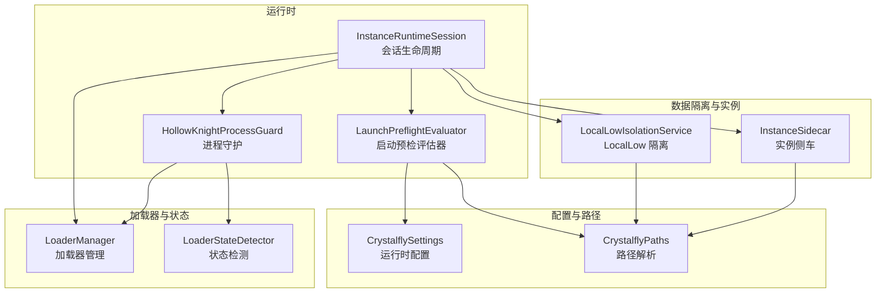
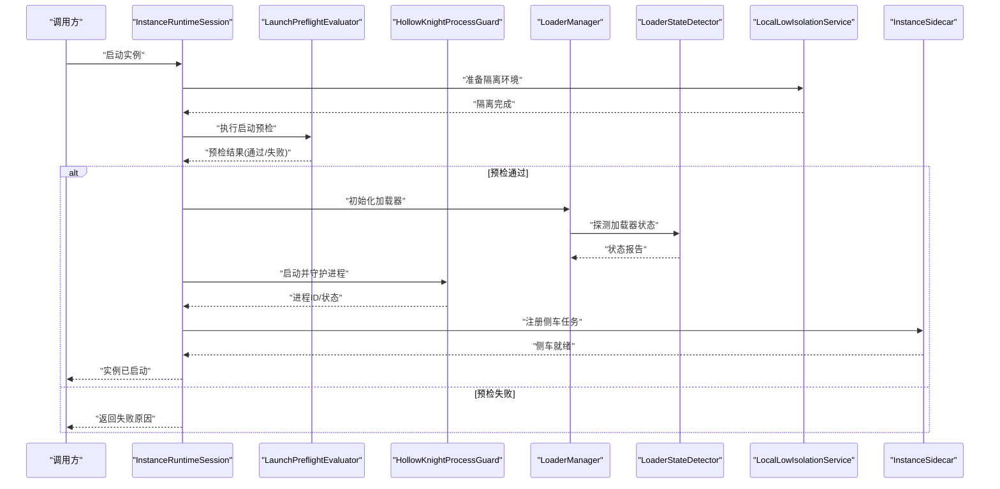
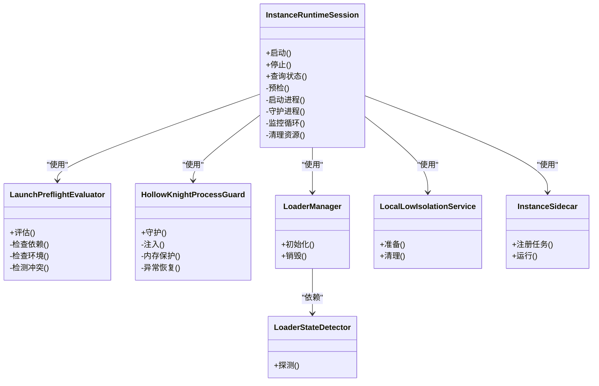
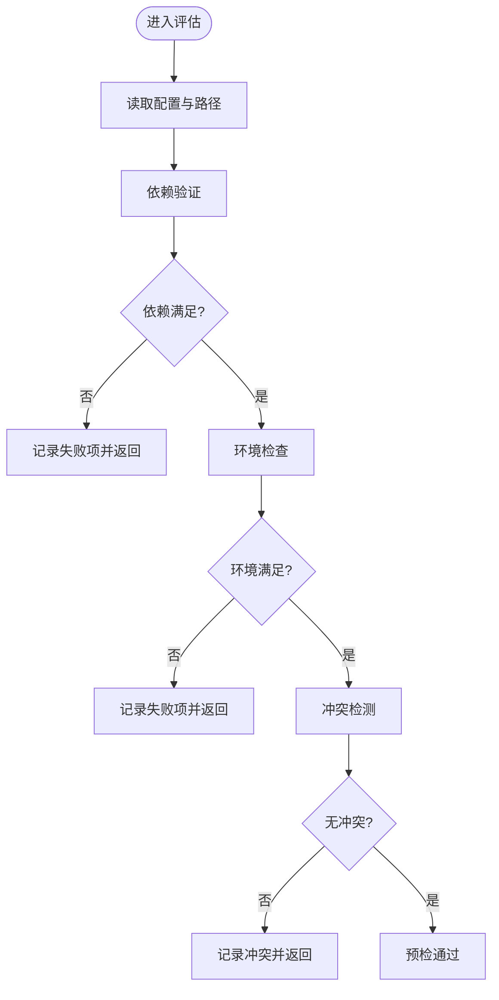
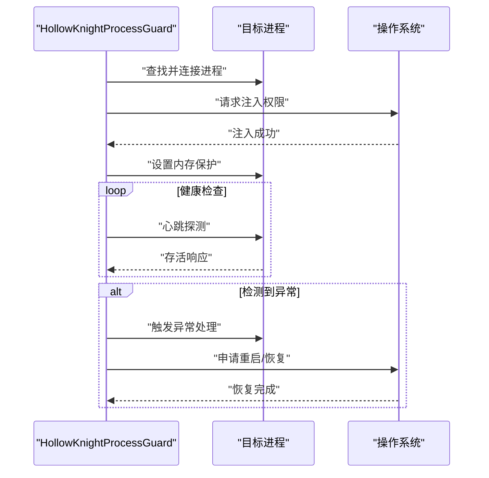
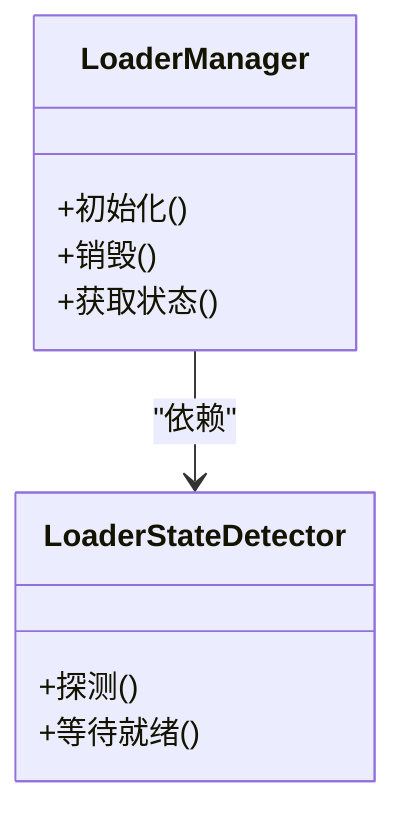
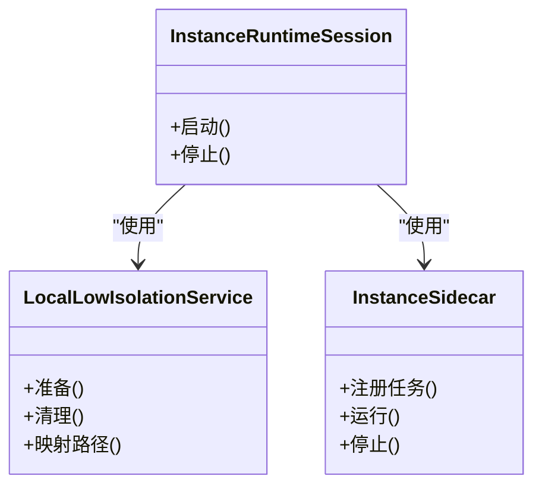
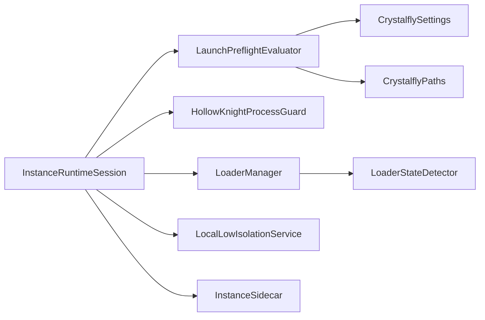

# 运行时管理

<cite>
**本文引用的文件**   
- [InstanceRuntimeSession.cs](file://src/Crystalfly.Core/Runtime/InstanceRuntimeSession.cs)
- [LaunchPreflightEvaluator.cs](file://src/Crystalfly.Core/Runtime/LaunchPreflightEvaluator.cs)
- [HollowKnightProcessGuard.cs](file://src/Crystalfly.Core/Runtime/HollowKnightProcessGuard.cs)
- [CrystalflySettings.cs](file://src/Crystalfly.Core/Configuration/CrystalflySettings.cs)
- [CrystalflyPaths.cs](file://src/Crystalfly.Core/Configuration/CrystalflyPaths.cs)
- [LoaderManager.cs](file://src/Crystalfly.Core/Loaders/LoaderManager.cs)
- [LoaderStateDetector.cs](file://src/Crystalfly.Core/Loaders/LoaderStateDetector.cs)
- [LocalLowIsolationService.cs](file://src/Crystalfly.Core/LocalLow/LocalLowIsolationService.cs)
- [InstanceSidecar.cs](file://src/Crystalfly.Core/Instances/InstanceSidecar.cs)
</cite>

## 目录
1. [简介](#简介)
2. [项目结构](#项目结构)
3. [核心组件](#核心组件)
4. [架构总览](#架构总览)
5. [详细组件分析](#详细组件分析)
6. [依赖关系分析](#依赖关系分析)
7. [性能考虑](#性能考虑)
8. [故障排查指南](#故障排查指南)
9. [结论](#结论)
10. [附录](#附录)

## 简介
本技术文档聚焦 Crystalfly 的运行时管理系统，围绕运行时会话的生命周期、启动预检评估器、游戏进程保护机制、配置与性能调优、并发资源隔离以及错误诊断与恢复进行系统化说明。目标是帮助开发者与维护者理解并扩展 Crystalfly 在实例化、启动、监控与清理方面的能力，确保多实例并发下的稳定性与可观测性。

## 项目结构
与运行时管理直接相关的代码位于 Core 层的 Runtime、Configuration、Loaders、LocalLow 与 Instances 等子模块中：
- Runtime：负责运行时会话、启动前预检与进程守护
- Configuration：提供运行时设置与路径解析
- Loaders：加载器管理与状态检测
- LocalLow：用户数据隔离服务
- Instances：实例侧车（Sidecar）协调

图表来源
- [InstanceRuntimeSession.cs](file://src/Crystalfly.Core/Runtime/InstanceRuntimeSession.cs)
- [LaunchPreflightEvaluator.cs](file://src/Crystalfly.Core/Runtime/LaunchPreflightEvaluator.cs)
- [HollowKnightProcessGuard.cs](file://src/Crystalfly.Core/Runtime/HollowKnightProcessGuard.cs)
- [CrystalflySettings.cs](file://src/Crystalfly.Core/Configuration/CrystalflySettings.cs)
- [CrystalflyPaths.cs](file://src/Crystalfly.Core/Configuration/CrystalflyPaths.cs)
- [LoaderManager.cs](file://src/Crystalfly.Core/Loaders/LoaderManager.cs)
- [LoaderStateDetector.cs](file://src/Crystalfly.Core/Loaders/LoaderStateDetector.cs)
- [LocalLowIsolationService.cs](file://src/Crystalfly.Core/LocalLow/LocalLowIsolationService.cs)
- [InstanceSidecar.cs](file://src/Crystalfly.Core/Instances/InstanceSidecar.cs)

章节来源
- [InstanceRuntimeSession.cs](file://src/Crystalfly.Core/Runtime/InstanceRuntimeSession.cs)
- [LaunchPreflightEvaluator.cs](file://src/Crystalfly.Core/Runtime/LaunchPreflightEvaluator.cs)
- [HollowKnightProcessGuard.cs](file://src/Crystalfly.Core/Runtime/HollowKnightProcessGuard.cs)
- [CrystalflySettings.cs](file://src/Crystalfly.Core/Configuration/CrystalflySettings.cs)
- [CrystalflyPaths.cs](file://src/Crystalfly.Core/Configuration/CrystalflyPaths.cs)
- [LoaderManager.cs](file://src/Crystalfly.Core/Loaders/LoaderManager.cs)
- [LoaderStateDetector.cs](file://src/Crystalfly.Core/Loaders/LoaderStateDetector.cs)
- [LocalLowIsolationService.cs](file://src/Crystalfly.Core/LocalLow/LocalLowIsolationService.cs)
- [InstanceSidecar.cs](file://src/Crystalfly.Core/Instances/InstanceSidecar.cs)

## 核心组件
- 运行时会话（InstanceRuntimeSession）
  - 职责：封装单个实例从启动到退出的完整生命周期，协调预检、进程启动、守护与清理。
  - 关键点：对外暴露启动、停止、查询状态等方法；内部组合预检器与守护器；维护进程句柄与退出码。
- 启动预检评估器（LaunchPreflightEvaluator）
  - 职责：在进程启动前执行依赖验证、环境检查与冲突检测，返回通过或失败及原因。
  - 关键点：读取配置与路径，校验必要文件/目录、端口占用、已存在进程、加载器状态等。
- 进程守护（HollowKnightProcessGuard）
  - 职责：对目标游戏进程进行注入、内存保护与异常恢复，保障运行稳定。
  - 关键点：进程发现、注入策略、内存页权限调整、异常回调与自动重启逻辑。
- 配置与路径（CrystalflySettings、CrystalflyPaths）
  - 职责：提供运行时参数与路径解析，支撑预检与守护行为。
- 加载器与状态（LoaderManager、LoaderStateDetector）
  - 职责：管理加载器生命周期与状态探测，为预检与守护提供基础信息。
- 数据隔离与实例侧车（LocalLowIsolationService、InstanceSidecar）
  - 职责：实现用户数据隔离与实例级协调，避免多实例互相干扰。

章节来源
- [InstanceRuntimeSession.cs](file://src/Crystalfly.Core/Runtime/InstanceRuntimeSession.cs)
- [LaunchPreflightEvaluator.cs](file://src/Crystalfly.Core/Runtime/LaunchPreflightEvaluator.cs)
- [HollowKnightProcessGuard.cs](file://src/Crystalfly.Core/Runtime/HollowKnightProcessGuard.cs)
- [CrystalflySettings.cs](file://src/Crystalfly.Core/Configuration/CrystalflySettings.cs)
- [CrystalflyPaths.cs](file://src/Crystalfly.Core/Configuration/CrystalflyPaths.cs)
- [LoaderManager.cs](file://src/Crystalfly.Core/Loaders/LoaderManager.cs)
- [LoaderStateDetector.cs](file://src/Crystalfly.Core/Loaders/LoaderStateDetector.cs)
- [LocalLowIsolationService.cs](file://src/Crystalfly.Core/LocalLow/LocalLowIsolationService.cs)
- [InstanceSidecar.cs](file://src/Crystalfly.Core/Instances/InstanceSidecar.cs)

## 架构总览
下图展示了运行时会话如何串联预检、守护、加载器与隔离服务，形成端到端的启动与监控流程。

图表来源
- [InstanceRuntimeSession.cs](file://src/Crystalfly.Core/Runtime/InstanceRuntimeSession.cs)
- [LaunchPreflightEvaluator.cs](file://src/Crystalfly.Core/Runtime/LaunchPreflightEvaluator.cs)
- [HollowKnightProcessGuard.cs](file://src/Crystalfly.Core/Runtime/HollowKnightProcessGuard.cs)
- [LoaderManager.cs](file://src/Crystalfly.Core/Loaders/LoaderManager.cs)
- [LoaderStateDetector.cs](file://src/Crystalfly.Core/Loaders/LoaderStateDetector.cs)
- [LocalLowIsolationService.cs](file://src/Crystalfly.Core/LocalLow/LocalLowIsolationService.cs)
- [InstanceSidecar.cs](file://src/Crystalfly.Core/Instances/InstanceSidecar.cs)

## 详细组件分析

### 运行时会话（InstanceRuntimeSession）
- 生命周期阶段
  - 初始化：加载配置与路径，准备隔离环境
  - 预检：委托 LaunchPreflightEvaluator 执行依赖与环境检查
  - 启动：创建/复用加载器，启动目标进程
  - 守护：委托 HollowKnightProcessGuard 进行注入与异常恢复
  - 监控：轮询进程状态，记录日志与指标
  - 清理：释放资源、终止子进程、恢复隔离环境
- 并发与隔离
  - 每个实例拥有独立会话对象，避免共享状态
  - 结合 LocalLowIsolationService 与 InstanceSidecar 实现资源隔离与任务调度
- 关键交互
  - 与 LoaderManager/LoaderStateDetector 协作以确认加载器可用
  - 与 CrystalflySettings/CrystalflyPaths 协作获取运行时参数与路径

图表来源
- [InstanceRuntimeSession.cs](file://src/Crystalfly.Core/Runtime/InstanceRuntimeSession.cs)
- [LaunchPreflightEvaluator.cs](file://src/Crystalfly.Core/Runtime/LaunchPreflightEvaluator.cs)
- [HollowKnightProcessGuard.cs](file://src/Crystalfly.Core/Runtime/HollowKnightProcessGuard.cs)
- [LoaderManager.cs](file://src/Crystalfly.Core/Loaders/LoaderManager.cs)
- [LoaderStateDetector.cs](file://src/Crystalfly.Core/Loaders/LoaderStateDetector.cs)
- [LocalLowIsolationService.cs](file://src/Crystalfly.Core/LocalLow/LocalLowIsolationService.cs)
- [InstanceSidecar.cs](file://src/Crystalfly.Core/Instances/InstanceSidecar.cs)

章节来源
- [InstanceRuntimeSession.cs](file://src/Crystalfly.Core/Runtime/InstanceRuntimeSession.cs)

### 启动预检评估器（LaunchPreflightEvaluator）
- 工作流程
  - 依赖验证：检查必要文件、目录、版本匹配、加载器包完整性
  - 环境检查：操作系统条件、依赖库、端口可用性、磁盘空间
  - 冲突检测：同名进程、端口占用、文件锁定、实例间冲突
- 输出
  - 通过：允许继续启动
  - 失败：返回具体失败项与修复建议
- 配置驱动
  - 基于 CrystalflySettings 与 CrystalflyPaths 动态决定检查项与阈值

图表来源
- [LaunchPreflightEvaluator.cs](file://src/Crystalfly.Core/Runtime/LaunchPreflightEvaluator.cs)
- [CrystalflySettings.cs](file://src/Crystalfly.Core/Configuration/CrystalflySettings.cs)
- [CrystalflyPaths.cs](file://src/Crystalfly.Core/Configuration/CrystalflyPaths.cs)

章节来源
- [LaunchPreflightEvaluator.cs](file://src/Crystalfly.Core/Runtime/LaunchPreflightEvaluator.cs)
- [CrystalflySettings.cs](file://src/Crystalfly.Core/Configuration/CrystalflySettings.cs)
- [CrystalflyPaths.cs](file://src/Crystalfly.Core/Configuration/CrystalflyPaths.cs)

### 游戏进程保护机制（HollowKnightProcessGuard）
- 进程注入
  - 定位目标进程，建立通信通道，注入辅助模块
- 内存保护
  - 调整关键内存页权限，防止外部篡改
- 异常恢复
  - 捕获崩溃/异常事件，触发自动重启或回滚策略
- 监控与告警
  - 定期健康检查，上报状态与指标

图表来源
- [HollowKnightProcessGuard.cs](file://src/Crystalfly.Core/Runtime/HollowKnightProcessGuard.cs)

章节来源
- [HollowKnightProcessGuard.cs](file://src/Crystalfly.Core/Runtime/HollowKnightProcessGuard.cs)

### 加载器管理与状态检测（LoaderManager、LoaderStateDetector）
- LoaderManager
  - 负责加载器的初始化、销毁与生命周期管理
  - 为会话提供稳定的加载器接口
- LoaderStateDetector
  - 探测加载器当前状态（就绪/运行/异常）
  - 为预检与守护提供决策依据

图表来源
- [LoaderManager.cs](file://src/Crystalfly.Core/Loaders/LoaderManager.cs)
- [LoaderStateDetector.cs](file://src/Crystalfly.Core/Loaders/LoaderStateDetector.cs)

章节来源
- [LoaderManager.cs](file://src/Crystalfly.Core/Loaders/LoaderManager.cs)
- [LoaderStateDetector.cs](file://src/Crystalfly.Core/Loaders/LoaderStateDetector.cs)

### 数据隔离与实例侧车（LocalLowIsolationService、InstanceSidecar）
- LocalLowIsolationService
  - 为每个实例提供独立的 LocalLow 目录映射，避免用户数据交叉污染
- InstanceSidecar
  - 作为实例的“侧车”，承载监控、日志收集、热重载等任务
  - 与会话协同，确保任务随实例生命周期一致

图表来源
- [LocalLowIsolationService.cs](file://src/Crystalfly.Core/LocalLow/LocalLowIsolationService.cs)
- [InstanceSidecar.cs](file://src/Crystalfly.Core/Instances/InstanceSidecar.cs)
- [InstanceRuntimeSession.cs](file://src/Crystalfly.Core/Runtime/InstanceRuntimeSession.cs)

章节来源
- [LocalLowIsolationService.cs](file://src/Crystalfly.Core/LocalLow/LocalLowIsolationService.cs)
- [InstanceSidecar.cs](file://src/Crystalfly.Core/Instances/InstanceSidecar.cs)

## 依赖关系分析
- 内聚与耦合
  - InstanceRuntimeSession 作为编排中心，聚合多个子系统，保持高内聚
  - 预检与守护分别关注不同阶段，降低耦合度
- 外部依赖
  - 配置与路径由 CrystalflySettings/CrystalflyPaths 提供
  - 加载器与状态检测由 LoaderManager/LoaderStateDetector 提供
  - 数据隔离由 LocalLowIsolationService 提供
- 潜在循环依赖
  - 会话不直接依赖守护的内部实现细节，仅通过接口交互，避免循环

图表来源
- [InstanceRuntimeSession.cs](file://src/Crystalfly.Core/Runtime/InstanceRuntimeSession.cs)
- [LaunchPreflightEvaluator.cs](file://src/Crystalfly.Core/Runtime/LaunchPreflightEvaluator.cs)
- [HollowKnightProcessGuard.cs](file://src/Crystalfly.Core/Runtime/HollowKnightProcessGuard.cs)
- [LoaderManager.cs](file://src/Crystalfly.Core/Loaders/LoaderManager.cs)
- [LoaderStateDetector.cs](file://src/Crystalfly.Core/Loaders/LoaderStateDetector.cs)
- [LocalLowIsolationService.cs](file://src/Crystalfly.Core/LocalLow/LocalLowIsolationService.cs)
- [InstanceSidecar.cs](file://src/Crystalfly.Core/Instances/InstanceSidecar.cs)
- [CrystalflySettings.cs](file://src/Crystalfly.Core/Configuration/CrystalflySettings.cs)
- [CrystalflyPaths.cs](file://src/Crystalfly.Core/Configuration/CrystalflyPaths.cs)

章节来源
- [InstanceRuntimeSession.cs](file://src/Crystalfly.Core/Runtime/InstanceRuntimeSession.cs)
- [LaunchPreflightEvaluator.cs](file://src/Crystalfly.Core/Runtime/LaunchPreflightEvaluator.cs)
- [HollowKnightProcessGuard.cs](file://src/Crystalfly.Core/Runtime/HollowKnightProcessGuard.cs)
- [LoaderManager.cs](file://src/Crystalfly.Core/Loaders/LoaderManager.cs)
- [LoaderStateDetector.cs](file://src/Crystalfly.Core/Loaders/LoaderStateDetector.cs)
- [LocalLowIsolationService.cs](file://src/Crystalfly.Core/LocalLow/LocalLowIsolationService.cs)
- [InstanceSidecar.cs](file://src/Crystalfly.Core/Instances/InstanceSidecar.cs)
- [CrystalflySettings.cs](file://src/Crystalfly.Core/Configuration/CrystalflySettings.cs)
- [CrystalflyPaths.cs](file://src/Crystalfly.Core/Configuration/CrystalflyPaths.cs)

## 性能考虑
- 预检优化
  - 并行化独立检查项（如文件存在性、端口扫描），减少整体耗时
  - 缓存检查结果，避免重复 IO 与系统调用
- 守护与监控
  - 合理设置健康检查间隔，平衡实时性与开销
  - 使用轻量级心跳协议，避免频繁系统调用
- 资源隔离
  - 按需映射 LocalLow 目录，避免不必要的文件系统操作
  - 限制侧车任务数量与优先级，防止抢占主进程资源
- 配置调优
  - 通过 CrystalflySettings 控制预检深度、守护重试次数、监控频率等参数
  - 根据实例规模与硬件条件调整线程池大小与超时阈值

[本节为通用指导，无需特定文件引用]

## 故障排查指南
- 常见启动失败场景
  - 预检失败：检查依赖是否缺失、环境是否满足、是否存在冲突（端口/进程）
  - 加载器异常：查看 LoaderStateDetector 的状态报告，必要时重置加载器
  - 守护异常：检查注入权限、内存保护设置与异常恢复策略
- 诊断步骤
  - 启用更详细的日志输出，定位失败阶段
  - 使用 LoaderStateDetector 探测加载器状态，确认是否就绪
  - 检查 LocalLowIsolationService 的映射是否正确，避免数据污染
- 恢复策略
  - 自动重试与回滚：在守护层实现指数退避重试
  - 隔离恢复：清理临时映射与锁文件，重新准备隔离环境
  - 侧车自愈：当侧车任务异常时，自动重启对应任务

章节来源
- [LaunchPreflightEvaluator.cs](file://src/Crystalfly.Core/Runtime/LaunchPreflightEvaluator.cs)
- [LoaderStateDetector.cs](file://src/Crystalfly.Core/Loaders/LoaderStateDetector.cs)
- [HollowKnightProcessGuard.cs](file://src/Crystalfly.Core/Runtime/HollowKnightProcessGuard.cs)
- [LocalLowIsolationService.cs](file://src/Crystalfly.Core/LocalLow/LocalLowIsolationService.cs)

## 结论
Crystalfly 的运行时管理以 InstanceRuntimeSession 为核心，将启动预检、进程守护、加载器管理与数据隔离有机整合，形成稳健的多实例并发运行体系。通过配置驱动的预检与可调优的守护策略，系统在稳定性与性能之间取得良好平衡。建议在部署环境中结合日志与监控，持续优化预检与守护参数，提升整体可靠性。

[本节为总结性内容，无需特定文件引用]

## 附录
- 实际示例参考路径（不包含代码内容）
  - 启动与会话管理：[InstanceRuntimeSession.cs](file://src/Crystalfly.Core/Runtime/InstanceRuntimeSession.cs)
  - 启动预检流程：[LaunchPreflightEvaluator.cs](file://src/Crystalfly.Core/Runtime/LaunchPreflightEvaluator.cs)
  - 进程守护与异常恢复：[HollowKnightProcessGuard.cs](file://src/Crystalfly.Core/Runtime/HollowKnightProcessGuard.cs)
  - 配置与路径：[CrystalflySettings.cs](file://src/Crystalfly.Core/Configuration/CrystalflySettings.cs)、[CrystalflyPaths.cs](file://src/Crystalfly.Core/Configuration/CrystalflyPaths.cs)
  - 加载器与状态：[LoaderManager.cs](file://src/Crystalfly.Core/Loaders/LoaderManager.cs)、[LoaderStateDetector.cs](file://src/Crystalfly.Core/Loaders/LoaderStateDetector.cs)
  - 隔离与侧车：[LocalLowIsolationService.cs](file://src/Crystalfly.Core/LocalLow/LocalLowIsolationService.cs)、[InstanceSidecar.cs](file://src/Crystalfly.Core/Instances/InstanceSidecar.cs)

[本节为索引性内容，无需特定文件引用]