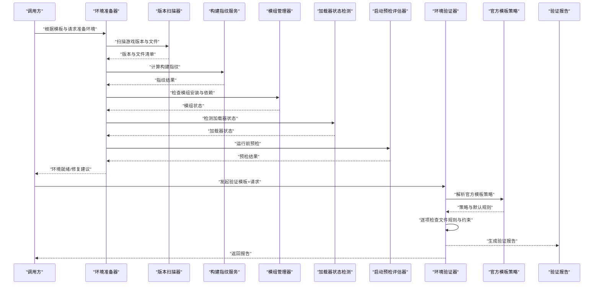
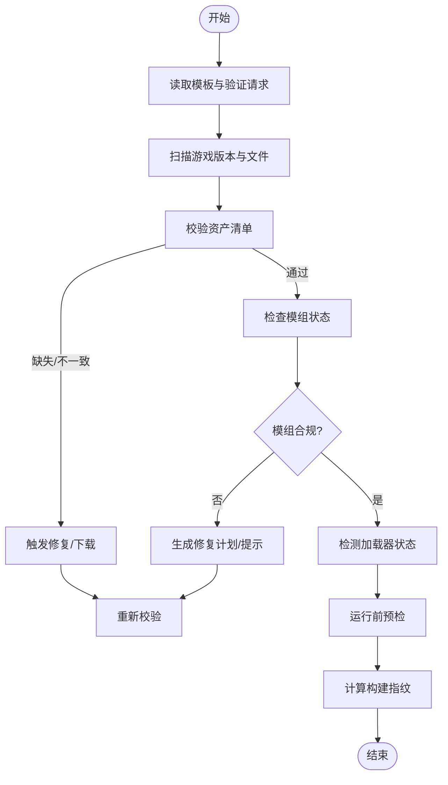
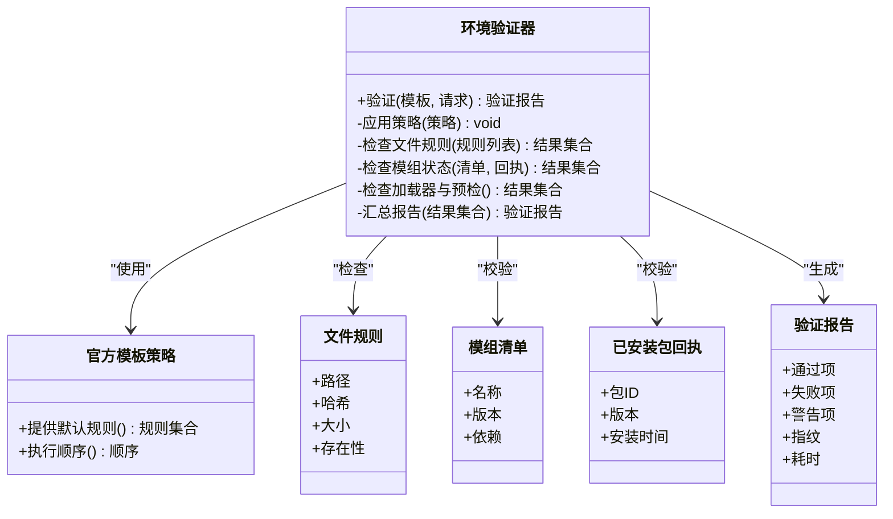
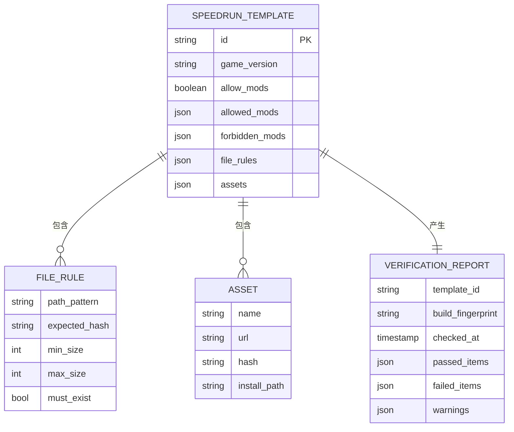
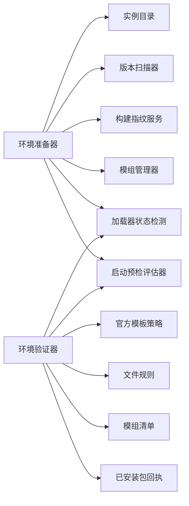

# 速通验证系统

<cite>
**本文引用的文件**   
- [SpeedrunEnvironmentProvisioner.cs](file://src/Crystalfly.Core/Speedrun/SpeedrunEnvironmentProvisioner.cs)
- [SpeedrunEnvironmentVerifier.cs](file://src/Crystalfly.Core/Speedrun/SpeedrunEnvironmentVerifier.cs)
- [OfficialSpeedrunTemplatePolicy.cs](file://src/Crystalfly.Core/Speedrun/OfficialSpeedrunTemplatePolicy.cs)
- [SpeedrunVerificationRequest.cs](file://src/Crystalfly.Core/Speedrun/SpeedrunVerificationRequest.cs)
- [SpeedrunTemplate.cs](file://src/Crystalfly.Core/Models/SpeedrunTemplate.cs)
- [SpeedrunFileRule.cs](file://src/Crystalfly.Core/Models/SpeedrunFileRule.cs)
- [SpeedrunAsset.cs](file://src/Crystalfly.Core/Models/SpeedrunAsset.cs)
- [SpeedrunVerificationReport.cs](file://src/Crystalfly.Core/Models/SpeedrunVerificationReport.cs)
- [BuildFingerprintService.cs](file://src/Crystalfly.Core/Instances/BuildFingerprintService.cs)
- [InstanceDirectory.cs](file://src/Crystalfly.Core/Instances/InstanceDirectory.cs)
- [VersionDirectoryScanner.cs](file://src/Crystalfly.Core/Instances/VersionDirectoryScanner.cs)
- [CrystalflyPaths.cs](file://src/Crystalfly.Core/Configuration/CrystalflyPaths.cs)
- [CrystalflySettingsStore.cs](file://src/Crystalfly.Core/Configuration/CrystalflySettingsStore.cs)
- [ModManifest.cs](file://src/Crystalfly.Core/Models/ModManifest.cs)
- [InstalledPackageReceipt.cs](file://src/Crystalfly.Core/Models/InstalledPackageReceipt.cs)
- [ModManager.cs](file://src/Crystalfly.Core/Mods/ModManager.cs)
- [LoaderStateDetector.cs](file://src/Crystalfly.Core/Loaders/LoaderStateDetector.cs)
- [LaunchPreflightEvaluator.cs](file://src/Crystalfly.Core/Runtime/LaunchPreflightEvaluator.cs)
- [AtomicJsonStore.cs](file://src/Crystalfly.Core/Serialization/AtomicJsonStore.cs)
- [CrystalflyJson.cs](file://src/Crystalfly.Core/Serialization/CrystalflyJson.cs)
</cite>

## 目录
1. [简介](#简介)
2. [项目结构](#项目结构)
3. [核心组件](#核心组件)
4. [架构总览](#架构总览)
5. [详细组件分析](#详细组件分析)
6. [依赖关系分析](#依赖关系分析)
7. [性能考量](#性能考量)
8. [故障排查指南](#故障排查指南)
9. [结论](#结论)
10. [附录](#附录)

## 简介
本文件面向 Crystalfly 的“速通验证系统”，围绕环境准备器与规则验证器两大核心，系统化阐述以下能力：
- 自动化部署机制：游戏文件校验、模组状态检查、运行环境配置。
- 规则检查逻辑：官方模板策略执行与违规检测。
- 验证报告：生成格式与内容结构。
- 标准化配置与自定义模板开发指南。
- 完整工作流程示例。
- 社区规则兼容性与扩展机制。
- 性能基准测试与结果分析方法。

## 项目结构
速通验证相关代码集中在 Core 层的 Speedrun 子模块与 Models 数据模型中，并与实例管理、加载器探测、运行时预检等子系统协作。

```mermaid
graph TB
subgraph "速通验证"
Provisioner["环境准备器<br/>SpeedrunEnvironmentProvisioner"]
Verifier["环境验证器<br/>SpeedrunEnvironmentVerifier"]
Policy["官方模板策略<br/>OfficialSpeedrunTemplatePolicy"]
Request["验证请求<br/>SpeedrunVerificationRequest"]
end
subgraph "数据模型"
Template["模板<br/>SpeedrunTemplate"]
FileRule["文件规则<br/>SpeedrunFileRule"]
Asset["资产清单<br/>SpeedrunAsset"]
Report["验证报告<br/>SpeedrunVerificationReport"]
end
subgraph "实例与运行时"
InstDir["实例目录<br/>InstanceDirectory"]
BuildFP["构建指纹服务<br/>BuildFingerprintService"]
VersionScan["版本扫描器<br/>VersionDirectoryScanner"]
LoaderDetect["加载器状态检测<br/>LoaderStateDetector"]
Preflight["启动预检评估器<br/>LaunchPreflightEvaluator"]
Paths["路径配置<br/>CrystalflyPaths"]
Settings["设置存储<br/>CrystalflySettingsStore"]
end
subgraph "模组与序列化"
ModMgr["模组管理器<br/>ModManager"]
ModManifest["模组清单<br/>ModManifest"]
InstallReceipt["安装回执<br/>InstalledPackageReceipt"]
AtomicJson["原子JSON存储<br/>AtomicJsonStore"]
JsonUtil["JSON工具<br/>CrystalflyJson"]
end
Provisioner --> Template
Provisioner --> InstDir
Provisioner --> BuildFP
Provisioner --> VersionScan
Provisioner --> Paths
Provisioner --> Settings
Provisioner --> ModMgr
Provisioner --> ModManifest
Provisioner --> InstallReceipt
Provisioner --> AtomicJson
Provisioner --> JsonUtil
Verifier --> Template
Verifier --> FileRule
Verifier --> Asset
Verifier --> Report
Verifier --> Policy
Verifier --> LoaderDetect
Verifier --> Preflight
Verifier --> Paths
Verifier --> Settings
```

图表来源
- [SpeedrunEnvironmentProvisioner.cs](file://src/Crystalfly.Core/Speedrun/SpeedrunEnvironmentProvisioner.cs)
- [SpeedrunEnvironmentVerifier.cs](file://src/Crystalfly.Core/Speedrun/SpeedrunEnvironmentVerifier.cs)
- [OfficialSpeedrunTemplatePolicy.cs](file://src/Crystalfly.Core/Speedrun/OfficialSpeedrunTemplatePolicy.cs)
- [SpeedrunVerificationRequest.cs](file://src/Crystalfly.Core/Speedrun/SpeedrunVerificationRequest.cs)
- [SpeedrunTemplate.cs](file://src/Crystalfly.Core/Models/SpeedrunTemplate.cs)
- [SpeedrunFileRule.cs](file://src/Crystalfly.Core/Models/SpeedrunFileRule.cs)
- [SpeedrunAsset.cs](file://src/Crystalfly.Core/Models/SpeedrunAsset.cs)
- [SpeedrunVerificationReport.cs](file://src/Crystalfly.Core/Models/SpeedrunVerificationReport.cs)
- [BuildFingerprintService.cs](file://src/Crystalfly.Core/Instances/BuildFingerprintService.cs)
- [InstanceDirectory.cs](file://src/Crystalfly.Core/Instances/InstanceDirectory.cs)
- [VersionDirectoryScanner.cs](file://src/Crystalfly.Core/Instances/VersionDirectoryScanner.cs)
- [CrystalflyPaths.cs](file://src/Crystalfly.Core/Configuration/CrystalflyPaths.cs)
- [CrystalflySettingsStore.cs](file://src/Crystalfly.Core/Configuration/CrystalflySettingsStore.cs)
- [ModManager.cs](file://src/Crystalfly.Core/Mods/ModManager.cs)
- [ModManifest.cs](file://src/Crystalfly.Core/Models/ModManifest.cs)
- [InstalledPackageReceipt.cs](file://src/Crystalfly.Core/Models/InstalledPackageReceipt.cs)
- [LoaderStateDetector.cs](file://src/Crystalfly.Core/Loaders/LoaderStateDetector.cs)
- [LaunchPreflightEvaluator.cs](file://src/Crystalfly.Core/Runtime/LaunchPreflightEvaluator.cs)
- [AtomicJsonStore.cs](file://src/Crystalfly.Core/Serialization/AtomicJsonStore.cs)
- [CrystalflyJson.cs](file://src/Crystalfly.Core/Serialization/CrystalflyJson.cs)

章节来源
- [SpeedrunEnvironmentProvisioner.cs](file://src/Crystalfly.Core/Speedrun/SpeedrunEnvironmentProvisioner.cs)
- [SpeedrunEnvironmentVerifier.cs](file://src/Crystalfly.Core/Speedrun/SpeedrunEnvironmentVerifier.cs)
- [OfficialSpeedrunTemplatePolicy.cs](file://src/Crystalfly.Core/Speedrun/OfficialSpeedrunTemplatePolicy.cs)
- [SpeedrunVerificationRequest.cs](file://src/Crystalfly.Core/Speedrun/SpeedrunVerificationRequest.cs)
- [SpeedrunTemplate.cs](file://src/Crystalfly.Core/Models/SpeedrunTemplate.cs)
- [SpeedrunFileRule.cs](file://src/Crystalfly.Core/Models/SpeedrunFileRule.cs)
- [SpeedrunAsset.cs](file://src/Crystalfly.Core/Models/SpeedrunAsset.cs)
- [SpeedrunVerificationReport.cs](file://src/Crystalfly.Core/Models/SpeedrunVerificationReport.cs)
- [BuildFingerprintService.cs](file://src/Crystalfly.Core/Instances/BuildFingerprintService.cs)
- [InstanceDirectory.cs](file://src/Crystalfly.Core/Instances/InstanceDirectory.cs)
- [VersionDirectoryScanner.cs](file://src/Crystalfly.Core/Instances/VersionDirectoryScanner.cs)
- [CrystalflyPaths.cs](file://src/Crystalfly.Core/Configuration/CrystalflyPaths.cs)
- [CrystalflySettingsStore.cs](file://src/Crystalfly.Core/Configuration/CrystalflySettingsStore.cs)
- [ModManager.cs](file://src/Crystalfly.Core/Mods/ModManager.cs)
- [ModManifest.cs](file://src/Crystalfly.Core/Models/ModManifest.cs)
- [InstalledPackageReceipt.cs](file://src/Crystalfly.Core/Models/InstalledPackageReceipt.cs)
- [LoaderStateDetector.cs](file://src/Crystalfly.Core/Loaders/LoaderStateDetector.cs)
- [LaunchPreflightEvaluator.cs](file://src/Crystalfly.Core/Runtime/LaunchPreflightEvaluator.cs)
- [AtomicJsonStore.cs](file://src/Crystalfly.Core/Serialization/AtomicJsonStore.cs)
- [CrystalflyJson.cs](file://src/Crystalfly.Core/Serialization/CrystalflyJson.cs)

## 核心组件
- 环境准备器（SpeedrunEnvironmentProvisioner）
  - 职责：依据模板与请求，完成游戏文件校验、模组状态检查、运行环境配置，并输出可复现的构建指纹。
  - 关键输入：模板（SpeedrunTemplate）、验证请求（SpeedrunVerificationRequest）。
  - 关键输出：构建指纹（BuildFingerprint）、环境就绪标记、必要资源清单。
- 环境验证器（SpeedrunEnvironmentVerifier）
  - 职责：基于模板规则对当前实例进行合规性检查，生成结构化验证报告。
  - 关键输入：模板、文件规则、资产清单、加载器状态、预检结果。
  - 关键输出：验证报告（SpeedrunVerificationReport），包含通过/失败项与诊断信息。
- 官方模板策略（OfficialSpeedrunTemplatePolicy）
  - 职责：提供官方模板的执行策略与默认行为，确保社区一致性。
- 数据模型
  - 模板（SpeedrunTemplate）：定义目标版本、允许/禁止的模组集合、文件白名单与黑名单、额外约束。
  - 文件规则（SpeedrunFileRule）：针对特定文件的哈希、存在性、大小或路径匹配规则。
  - 资产清单（SpeedrunAsset）：描述需要下载/校验的资源及其元数据。
  - 验证报告（SpeedrunVerificationReport）：汇总检查结果、错误与警告、耗时与指纹。

章节来源
- [SpeedrunEnvironmentProvisioner.cs](file://src/Crystalfly.Core/Speedrun/SpeedrunEnvironmentProvisioner.cs)
- [SpeedrunEnvironmentVerifier.cs](file://src/Crystalfly.Core/Speedrun/SpeedrunEnvironmentVerifier.cs)
- [OfficialSpeedrunTemplatePolicy.cs](file://src/Crystalfly.Core/Speedrun/OfficialSpeedrunTemplatePolicy.cs)
- [SpeedrunTemplate.cs](file://src/Crystalfly.Core/Models/SpeedrunTemplate.cs)
- [SpeedrunFileRule.cs](file://src/Crystalfly.Core/Models/SpeedrunFileRule.cs)
- [SpeedrunAsset.cs](file://src/Crystalfly.Core/Models/SpeedrunAsset.cs)
- [SpeedrunVerificationReport.cs](file://src/Crystalfly.Core/Models/SpeedrunVerificationReport.cs)

## 架构总览
下图展示了从“准备”到“验证”的端到端流程，以及各组件之间的交互关系。

图表来源
- [SpeedrunEnvironmentProvisioner.cs](file://src/Crystalfly.Core/Speedrun/SpeedrunEnvironmentProvisioner.cs)
- [SpeedrunEnvironmentVerifier.cs](file://src/Crystalfly.Core/Speedrun/SpeedrunEnvironmentVerifier.cs)
- [OfficialSpeedrunTemplatePolicy.cs](file://src/Crystalfly.Core/Speedrun/OfficialSpeedrunTemplatePolicy.cs)
- [VersionDirectoryScanner.cs](file://src/Crystalfly.Core/Instances/VersionDirectoryScanner.cs)
- [BuildFingerprintService.cs](file://src/Crystalfly.Core/Instances/BuildFingerprintService.cs)
- [ModManager.cs](file://src/Crystalfly.Core/Mods/ModManager.cs)
- [LoaderStateDetector.cs](file://src/Crystalfly.Core/Loaders/LoaderStateDetector.cs)
- [LaunchPreflightEvaluator.cs](file://src/Crystalfly.Core/Runtime/LaunchPreflightEvaluator.cs)
- [SpeedrunVerificationReport.cs](file://src/Crystalfly.Core/Models/SpeedrunVerificationReport.cs)

## 详细组件分析

### 环境准备器（自动化部署机制）
- 游戏文件校验
  - 通过版本扫描器获取游戏目录结构与文件清单，结合模板中的资产清单进行完整性校验。
  - 使用构建指纹服务对关键文件集计算指纹，用于后续比对与复现。
- 模组状态检查
  - 查询模组管理器与已安装包回执，确认模组是否按模板要求安装、版本一致且无冲突。
  - 读取模组清单以校验元数据与依赖关系。
- 运行环境配置
  - 基于路径配置与设置存储，定位实例目录、本地低层数据隔离区与日志位置。
  - 通过加载器状态检测与启动预检评估器，确保加载器可用、前置条件满足。
- 输出与幂等性
  - 输出构建指纹与环境就绪状态；支持重复执行时的幂等修复与增量更新。

图表来源
- [SpeedrunEnvironmentProvisioner.cs](file://src/Crystalfly.Core/Speedrun/SpeedrunEnvironmentProvisioner.cs)
- [VersionDirectoryScanner.cs](file://src/Crystalfly.Core/Instances/VersionDirectoryScanner.cs)
- [BuildFingerprintService.cs](file://src/Crystalfly.Core/Instances/BuildFingerprintService.cs)
- [ModManager.cs](file://src/Crystalfly.Core/Mods/ModManager.cs)
- [ModManifest.cs](file://src/Crystalfly.Core/Models/ModManifest.cs)
- [InstalledPackageReceipt.cs](file://src/Crystalfly.Core/Models/InstalledPackageReceipt.cs)
- [LoaderStateDetector.cs](file://src/Crystalfly.Core/Loaders/LoaderStateDetector.cs)
- [LaunchPreflightEvaluator.cs](file://src/Crystalfly.Core/Runtime/LaunchPreflightEvaluator.cs)
- [CrystalflyPaths.cs](file://src/Crystalfly.Core/Configuration/CrystalflyPaths.cs)
- [CrystalflySettingsStore.cs](file://src/Crystalfly.Core/Configuration/CrystalflySettingsStore.cs)

章节来源
- [SpeedrunEnvironmentProvisioner.cs](file://src/Crystalfly.Core/Speedrun/SpeedrunEnvironmentProvisioner.cs)
- [VersionDirectoryScanner.cs](file://src/Crystalfly.Core/Instances/VersionDirectoryScanner.cs)
- [BuildFingerprintService.cs](file://src/Crystalfly.Core/Instances/BuildFingerprintService.cs)
- [ModManager.cs](file://src/Crystalfly.Core/Mods/ModManager.cs)
- [ModManifest.cs](file://src/Crystalfly.Core/Models/ModManifest.cs)
- [InstalledPackageReceipt.cs](file://src/Crystalfly.Core/Models/InstalledPackageReceipt.cs)
- [LoaderStateDetector.cs](file://src/Crystalfly.Core/Loaders/LoaderStateDetector.cs)
- [LaunchPreflightEvaluator.cs](file://src/Crystalfly.Core/Runtime/LaunchPreflightEvaluator.cs)
- [CrystalflyPaths.cs](file://src/Crystalfly.Core/Configuration/CrystalflyPaths.cs)
- [CrystalflySettingsStore.cs](file://src/Crystalfly.Core/Configuration/CrystalflySettingsStore.cs)

### 环境验证器（规则检查逻辑）
- 官方模板策略执行
  - 由官方模板策略提供默认规则与执行顺序，确保不同环境下的判定一致性。
- 违规检测
  - 基于文件规则（存在性、哈希、大小、路径匹配）逐项检查。
  - 结合模组清单与已安装包回执，校验模组版本、签名与依赖。
  - 结合加载器状态与启动预检结果，判定运行环境是否符合速通要求。
- 报告生成
  - 将每项检查的结果、原因与建议写入验证报告，便于用户与自动化流水线消费。

图表来源
- [SpeedrunEnvironmentVerifier.cs](file://src/Crystalfly.Core/Speedrun/SpeedrunEnvironmentVerifier.cs)
- [OfficialSpeedrunTemplatePolicy.cs](file://src/Crystalfly.Core/Speedrun/OfficialSpeedrunTemplatePolicy.cs)
- [SpeedrunFileRule.cs](file://src/Crystalfly.Core/Models/SpeedrunFileRule.cs)
- [ModManifest.cs](file://src/Crystalfly.Core/Models/ModManifest.cs)
- [InstalledPackageReceipt.cs](file://src/Crystalfly.Core/Models/InstalledPackageReceipt.cs)
- [SpeedrunVerificationReport.cs](file://src/Crystalfly.Core/Models/SpeedrunVerificationReport.cs)

章节来源
- [SpeedrunEnvironmentVerifier.cs](file://src/Crystalfly.Core/Speedrun/SpeedrunEnvironmentVerifier.cs)
- [OfficialSpeedrunTemplatePolicy.cs](file://src/Crystalfly.Core/Speedrun/OfficialSpeedrunTemplatePolicy.cs)
- [SpeedrunFileRule.cs](file://src/Crystalfly.Core/Models/SpeedrunFileRule.cs)
- [ModManifest.cs](file://src/Crystalfly.Core/Models/ModManifest.cs)
- [InstalledPackageReceipt.cs](file://src/Crystalfly.Core/Models/InstalledPackageReceipt.cs)
- [SpeedrunVerificationReport.cs](file://src/Crystalfly.Core/Models/SpeedrunVerificationReport.cs)

### 数据模型与序列化
- 模板（SpeedrunTemplate）
  - 定义目标游戏版本、允许的模组集合、禁用模组、文件白/黑名单、额外约束。
- 文件规则（SpeedrunFileRule）
  - 指定路径模式、期望哈希、大小范围、存在性要求。
- 资产清单（SpeedrunAsset）
  - 描述外部资源（如补丁、语言包）的来源、校验值与安装路径。
- 验证报告（SpeedrunVerificationReport）
  - 包含通过/失败/警告条目、诊断消息、构建指纹与耗时统计。
- 序列化
  - 使用原子 JSON 存储与 JSON 工具类，保证并发安全与可读性。

图表来源
- [SpeedrunTemplate.cs](file://src/Crystalfly.Core/Models/SpeedrunTemplate.cs)
- [SpeedrunFileRule.cs](file://src/Crystalfly.Core/Models/SpeedrunFileRule.cs)
- [SpeedrunAsset.cs](file://src/Crystalfly.Core/Models/SpeedrunAsset.cs)
- [SpeedrunVerificationReport.cs](file://src/Crystalfly.Core/Models/SpeedrunVerificationReport.cs)
- [AtomicJsonStore.cs](file://src/Crystalfly.Core/Serialization/AtomicJsonStore.cs)
- [CrystalflyJson.cs](file://src/Crystalfly.Core/Serialization/CrystalflyJson.cs)

章节来源
- [SpeedrunTemplate.cs](file://src/Crystalfly.Core/Models/SpeedrunTemplate.cs)
- [SpeedrunFileRule.cs](file://src/Crystalfly.Core/Models/SpeedrunFileRule.cs)
- [SpeedrunAsset.cs](file://src/Crystalfly.Core/Models/SpeedrunAsset.cs)
- [SpeedrunVerificationReport.cs](file://src/Crystalfly.Core/Models/SpeedrunVerificationReport.cs)
- [AtomicJsonStore.cs](file://src/Crystalfly.Core/Serialization/AtomicJsonStore.cs)
- [CrystalflyJson.cs](file://src/Crystalfly.Core/Serialization/CrystalflyJson.cs)

## 依赖关系分析
- 组件耦合
  - 环境准备器强依赖实例目录、版本扫描器、构建指纹服务、模组管理器与加载器状态检测。
  - 环境验证器依赖官方模板策略、文件规则、模组清单与回执、加载器与预检结果。
- 外部集成点
  - 文件系统访问（游戏目录、模组目录、本地低层数据）。
  - 网络资源（资产清单下载，若需要）。
  - 进程与加载器（检测加载器状态与启动前置条件）。
- 循环依赖
  - 当前设计为单向依赖：准备器与验证器均不互相引用，避免循环。

图表来源
- [SpeedrunEnvironmentProvisioner.cs](file://src/Crystalfly.Core/Speedrun/SpeedrunEnvironmentProvisioner.cs)
- [SpeedrunEnvironmentVerifier.cs](file://src/Crystalfly.Core/Speedrun/SpeedrunEnvironmentVerifier.cs)
- [OfficialSpeedrunTemplatePolicy.cs](file://src/Crystalfly.Core/Speedrun/OfficialSpeedrunTemplatePolicy.cs)
- [InstanceDirectory.cs](file://src/Crystalfly.Core/Instances/InstanceDirectory.cs)
- [VersionDirectoryScanner.cs](file://src/Crystalfly.Core/Instances/VersionDirectoryScanner.cs)
- [BuildFingerprintService.cs](file://src/Crystalfly.Core/Instances/BuildFingerprintService.cs)
- [ModManager.cs](file://src/Crystalfly.Core/Mods/ModManager.cs)
- [ModManifest.cs](file://src/Crystalfly.Core/Models/ModManifest.cs)
- [InstalledPackageReceipt.cs](file://src/Crystalfly.Core/Models/InstalledPackageReceipt.cs)
- [LoaderStateDetector.cs](file://src/Crystalfly.Core/Loaders/LoaderStateDetector.cs)
- [LaunchPreflightEvaluator.cs](file://src/Crystalfly.Core/Runtime/LaunchPreflightEvaluator.cs)

章节来源
- [SpeedrunEnvironmentProvisioner.cs](file://src/Crystalfly.Core/Speedrun/SpeedrunEnvironmentProvisioner.cs)
- [SpeedrunEnvironmentVerifier.cs](file://src/Crystalfly.Core/Speedrun/SpeedrunEnvironmentVerifier.cs)
- [OfficialSpeedrunTemplatePolicy.cs](file://src/Crystalfly.Core/Speedrun/OfficialSpeedrunTemplatePolicy.cs)
- [InstanceDirectory.cs](file://src/Crystalfly.Core/Instances/InstanceDirectory.cs)
- [VersionDirectoryScanner.cs](file://src/Crystalfly.Core/Instances/VersionDirectoryScanner.cs)
- [BuildFingerprintService.cs](file://src/Crystalfly.Core/Instances/BuildFingerprintService.cs)
- [ModManager.cs](file://src/Crystalfly.Core/Mods/ModManager.cs)
- [ModManifest.cs](file://src/Crystalfly.Core/Models/ModManifest.cs)
- [InstalledPackageReceipt.cs](file://src/Crystalfly.Core/Models/InstalledPackageReceipt.cs)
- [LoaderStateDetector.cs](file://src/Crystalfly.Core/Loaders/LoaderStateDetector.cs)
- [LaunchPreflightEvaluator.cs](file://src/Crystalfly.Core/Runtime/LaunchPreflightEvaluator.cs)

## 性能考量
- 文件扫描与哈希
  - 对大目录进行增量扫描与并行哈希计算可降低 I/O 瓶颈。
  - 缓存构建指纹与文件摘要，避免重复计算。
- 模组依赖解析
  - 预先构建依赖图，减少重复解析开销。
- 报告生成
  - 采用流式写入与批处理聚合，降低频繁磁盘写入。
- 基准测试建议
  - 以典型实例规模（文件数量、模组数量）为基准，记录准备与验证的耗时分布。
  - 对比开启/关闭并行策略的差异，选择合适并发度。

[本节为通用性能指导，无需具体文件引用]

## 故障排查指南
- 常见错误与定位
  - 游戏文件不完整：核对资产清单与构建指纹，定位缺失文件。
  - 模组版本不符：比对模组清单与已安装包回执，查看依赖冲突。
  - 加载器不可用：检查加载器状态检测结果与预检失败原因。
- 日志与诊断
  - 利用原子 JSON 存储的记录与 JSON 工具输出的结构化日志，快速定位问题。
  - 在验证报告中关注失败项的诊断信息与修复建议。

章节来源
- [SpeedrunVerificationReport.cs](file://src/Crystalfly.Core/Models/SpeedrunVerificationReport.cs)
- [AtomicJsonStore.cs](file://src/Crystalfly.Core/Serialization/AtomicJsonStore.cs)
- [CrystalflyJson.cs](file://src/Crystalfly.Core/Serialization/CrystalflyJson.cs)

## 结论
速通验证系统通过“准备—验证—报告”的闭环，实现了跨环境的标准化与可复现性。借助官方模板策略与可扩展的规则体系，既能保障社区规则的一致性，又为自定义模板与扩展提供了清晰接口。配合完善的性能优化与故障排查手段，可在大规模环境中稳定运行。

[本节为总结性内容，无需具体文件引用]

## 附录

### 标准化配置方法
- 确定目标模板与游戏版本。
- 使用环境准备器自动完成文件校验、模组安装与加载器预检。
- 保存构建指纹，作为后续验证与审计的依据。

章节来源
- [SpeedrunEnvironmentProvisioner.cs](file://src/Crystalfly.Core/Speedrun/SpeedrunEnvironmentProvisioner.cs)
- [CrystalflyPaths.cs](file://src/Crystalfly.Core/Configuration/CrystalflyPaths.cs)
- [CrystalflySettingsStore.cs](file://src/Crystalfly.Core/Configuration/CrystalflySettingsStore.cs)

### 自定义模板开发指南
- 在模板中声明目标版本、允许/禁用模组、文件规则与资产清单。
- 遵循官方模板策略的默认行为，必要时覆盖特定规则。
- 使用验证器进行回归测试，确保规则变更不会引入误报。

章节来源
- [SpeedrunTemplate.cs](file://src/Crystalfly.Core/Models/SpeedrunTemplate.cs)
- [SpeedrunFileRule.cs](file://src/Crystalfly.Core/Models/SpeedrunFileRule.cs)
- [SpeedrunAsset.cs](file://src/Crystalfly.Core/Models/SpeedrunAsset.cs)
- [OfficialSpeedrunTemplatePolicy.cs](file://src/Crystalfly.Core/Speedrun/OfficialSpeedrunTemplatePolicy.cs)

### 完整工作流程示例
- 步骤一：准备环境
  - 读取模板与请求，扫描版本与文件，校验资产，检查模组与加载器，计算指纹。
- 步骤二：执行验证
  - 应用官方模板策略，逐项检查文件规则与模组状态，生成报告。
- 步骤三：结果消费
  - 解析报告中的通过/失败/警告项，驱动修复或发布决策。

章节来源
- [SpeedrunEnvironmentProvisioner.cs](file://src/Crystalfly.Core/Speedrun/SpeedrunEnvironmentProvisioner.cs)
- [SpeedrunEnvironmentVerifier.cs](file://src/Crystalfly.Core/Speedrun/SpeedrunEnvironmentVerifier.cs)
- [OfficialSpeedrunTemplatePolicy.cs](file://src/Crystalfly.Core/Speedrun/OfficialSpeedrunTemplatePolicy.cs)
- [SpeedrunVerificationReport.cs](file://src/Crystalfly.Core/Models/SpeedrunVerificationReport.cs)

### 社区规则兼容性与扩展机制
- 兼容性
  - 官方模板策略提供统一基线，确保不同发行渠道与平台的一致性。
- 扩展
  - 通过新增文件规则与资产清单，适配新补丁或区域差异。
  - 通过插件化策略接口（由官方模板策略抽象）实现自定义规则集。

章节来源
- [OfficialSpeedrunTemplatePolicy.cs](file://src/Crystalfly.Core/Speedrun/OfficialSpeedrunTemplatePolicy.cs)
- [SpeedrunFileRule.cs](file://src/Crystalfly.Core/Models/SpeedrunFileRule.cs)
- [SpeedrunAsset.cs](file://src/Crystalfly.Core/Models/SpeedrunAsset.cs)

### 性能基准测试与结果分析方法
- 指标
  - 准备阶段耗时（扫描、哈希、模组解析、预检）。
  - 验证阶段耗时（规则匹配、报告生成）。
  - I/O 与 CPU 占用峰值。
- 方法
  - 固定数据集与多次采样取均值。
  - 对比不同并发度与缓存策略的效果。
  - 将结果持久化为结构化记录，便于趋势分析与回归检测。

[本节为通用方法论，无需具体文件引用]