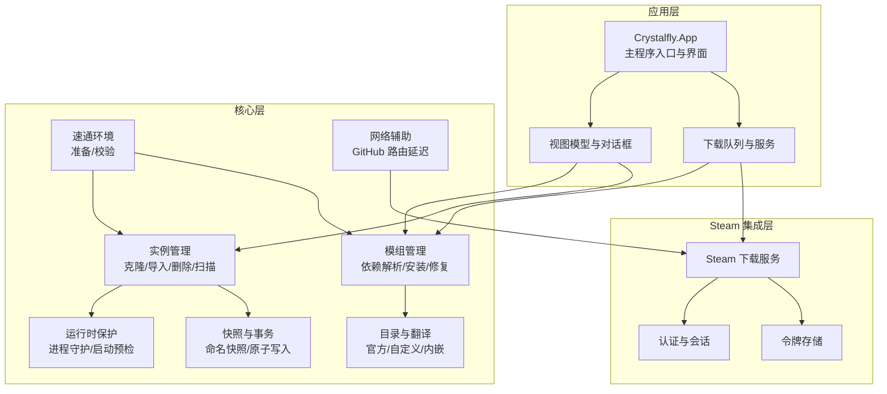
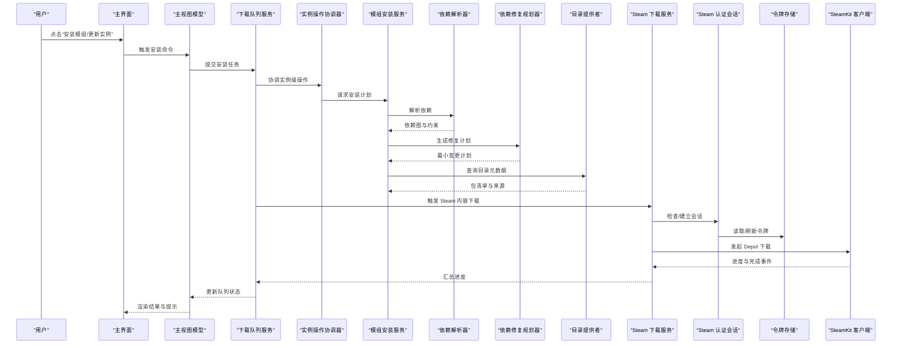
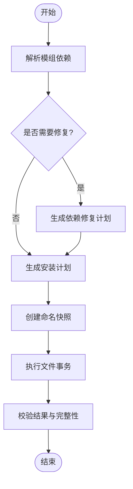
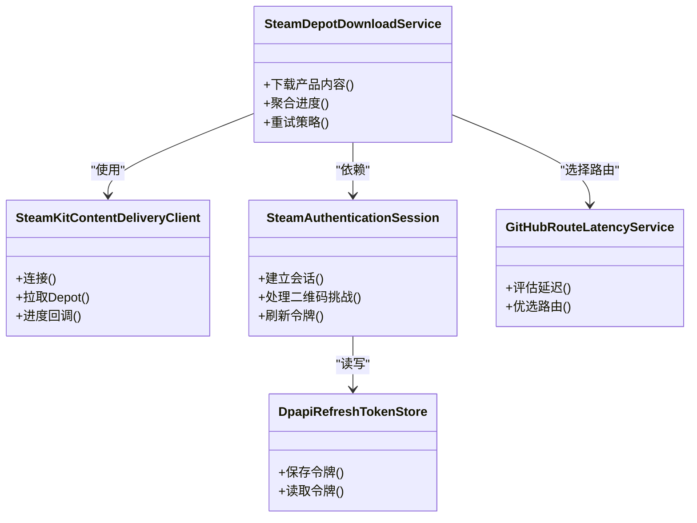
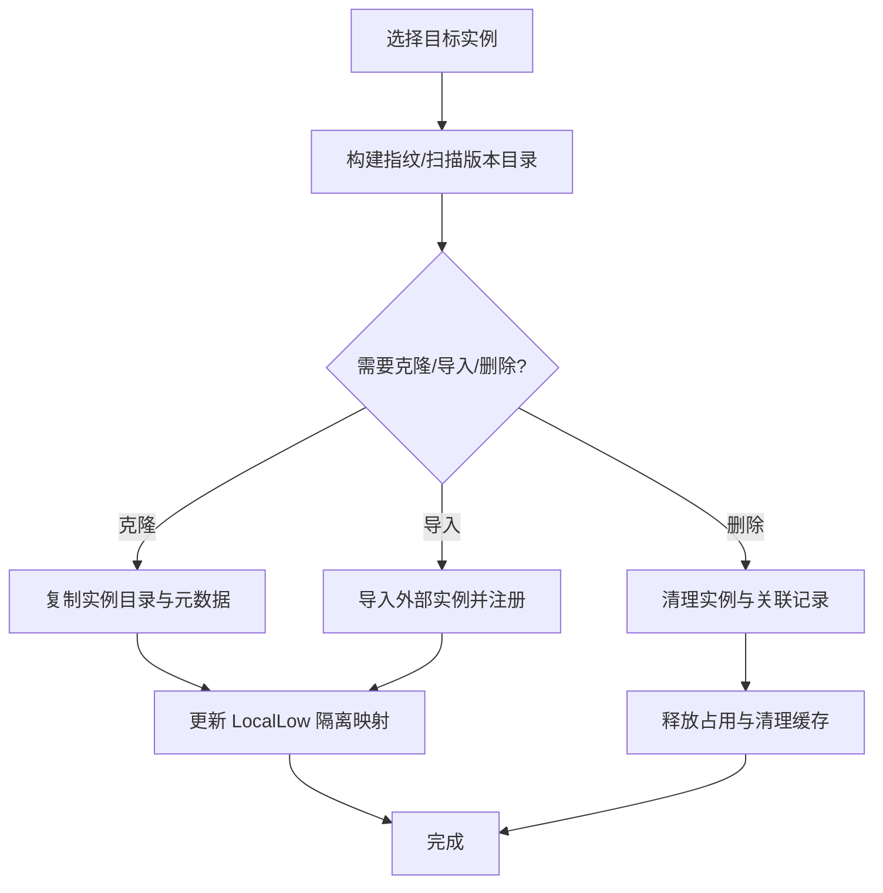
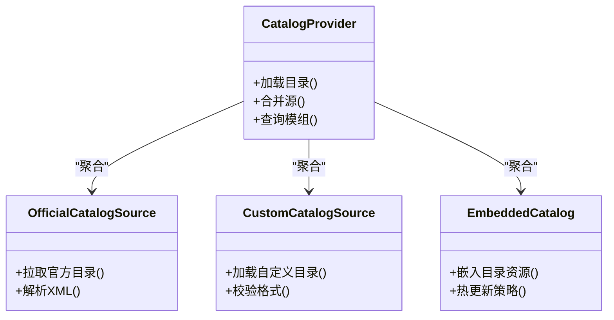
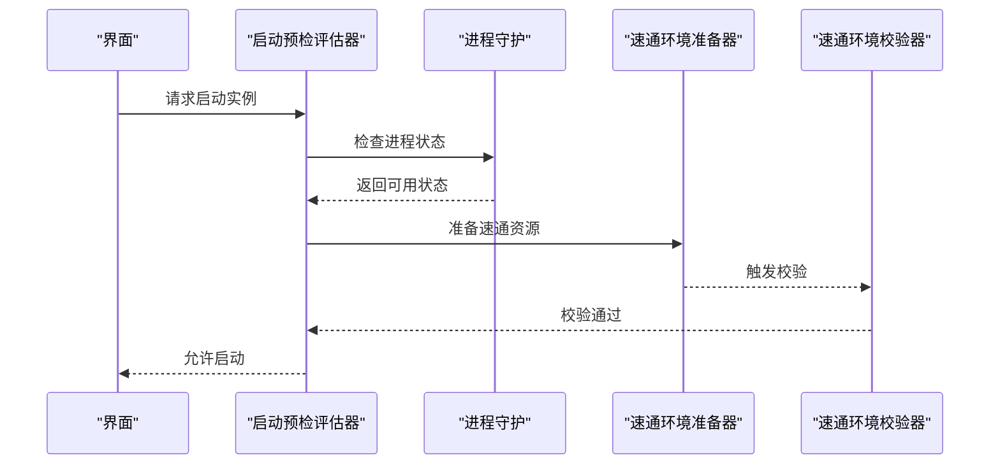
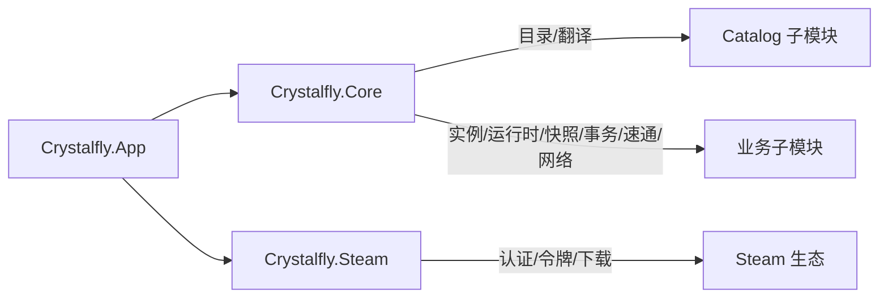

# 项目介绍

<cite>
**本文引用的文件**   
- [Crystalfly.slnx](file://Crystalfly.slnx)
- [Directory.Build.props](file://Directory.Build.props)
- [Program.cs](file://src/Crystalfly.App/Program.cs)
- [App.axaml.cs](file://src/Crystalfly.App/App.axaml.cs)
- [MainWindow.axaml.cs](file://src/Crystalfly.App/Views/MainWindow.axaml.cs)
- [MainViewModel.cs](file://src/Crystalfly.App/ViewModels/MainViewModel.cs)
- [DownloadQueueService.cs](file://src/Crystalfly.App/Downloads/DownloadQueueService.cs)
- [InstanceOperationCoordinator.cs](file://src/Crystalfly.App/Downloads/InstanceOperationCoordinator.cs)
- [ModInstallService.cs](file://src/Crystalfly.Core/Mods/ModInstallService.cs)
- [ModDependencyResolver.cs](file://src/Crystalfly.Core/Mods/ModDependencyResolver.cs)
- [ModDependencyRepairPlanner.cs](file://src/Crystalfly.Core/Mods/ModDependencyRepairPlanner.cs)
- [CatalogProvider.cs](file://src/Crystalfly.Core/Catalog/CatalogProvider.cs)
- [OfficialCatalogSource.cs](file://src/Crystalfly.Core/Catalog/OfficialCatalogSource.cs)
- [CustomCatalogSource.cs](file://src/Crystalfly.Core/Catalog/CustomCatalogSource.cs)
- [EmbeddedCatalog.cs](file://src/Crystalfly.Core/Catalog/EmbeddedCatalog.cs)
- [SteamDepotDownloadService.cs](file://src/Crystalfly.Steam/Downloads/SteamDepotDownloadService.cs)
- [SteamKitContentDeliveryClient.cs](file://src/Crystalfly.Steam/Downloads/SteamKitContentDeliveryClient.cs)
- [SteamAuthenticationSession.cs](file://src/Crystalfly.Steam/Authentication/SteamAuthenticationSession.cs)
- [DpapiRefreshTokenStore.cs](file://src/Crystalfly.Steam/Security/DpapiRefreshTokenStore.cs)
- [InstanceCloneService.cs](file://src/Crystalfly.Core/Instances/InstanceCloneService.cs)
- [InstanceDeletionService.cs](file://src/Crystalfly.Core/Instances/InstanceDeletionService.cs)
- [InstanceImportService.cs](file://src/Crystalfly.Core/Instances/InstanceImportService.cs)
- [BuildFingerprintService.cs](file://src/Crystalfly.Core/Instances/BuildFingerprintService.cs)
- [VersionDirectoryScanner.cs](file://src/Crystalfly.Core/Instances/VersionDirectoryScanner.cs)
- [LocalLowIsolationService.cs](file://src/Crystalfly.Core/LocalLow/LocalLowIsolationService.cs)
- [HollowKnightProcessGuard.cs](file://src/Crystalfly.Core/Runtime/HollowKnightProcessGuard.cs)
- [LaunchPreflightEvaluator.cs](file://src/Crystalfly.Core/Runtime/LaunchPreflightEvaluator.cs)
- [SpeedrunEnvironmentProvisioner.cs](file://src/Crystalfly.Core/Speedrun/SpeedrunEnvironmentProvisioner.cs)
- [SpeedrunEnvironmentVerifier.cs](file://src/Crystalfly.Core/Speedrun/SpeedrunEnvironmentVerifier.cs)
- [NamedSnapshotService.cs](file://src/Crystalfly.Core/Snapshots/NamedSnapshotService.cs)
- [FileTransaction.cs](file://src/Crystalfly.Core/Transactions/FileTransaction.cs)
- [GitHubRouteLatencyService.cs](file://src/Crystalfly.Core/Networking/GitHubRouteLatencyService.cs)
- [product-facts.md](file://docs/product-facts.md)
</cite>

## 目录
1. [简介](#简介)
2. [项目结构](#项目结构)
3. [核心组件](#核心组件)
4. [架构总览](#架构总览)
5. [详细组件分析](#详细组件分析)
6. [依赖关系分析](#依赖关系分析)
7. [性能与体验优化](#性能与体验优化)
8. [故障排查指南](#故障排查指南)
9. [结论](#结论)
10. [附录](#附录)

## 简介
Crystalfly 是一款面向《空洞骑士》（Hollow Knight）的现代化桌面应用，专注于“多实例管理、模组生态整合与 Steam 内容下载优化”。它通过统一的界面与可插拔的目录结构，帮助玩家与开发者在同一个设备上安全地运行多个游戏版本与模组组合，自动解决模组依赖冲突，并提供基于 Steam 的高效内容分发能力。

核心价值与目标
- 多实例管理：在同一台机器上并行维护多个游戏实例，互不干扰，支持克隆、导入、删除与构建指纹识别。
- 模组依赖治理：提供依赖解析、安装计划生成与修复方案，避免手动排错带来的不稳定。
- Steam 集成与下载优化：对接 Steam 内容交付网络，结合路由延迟评估与队列调度，提升大体积资源下载效率。
- 速通与验证：内置速通环境准备与校验能力，为竞速玩家提供稳定一致的运行基线。
- 快照与事务：对关键状态进行命名快照与原子事务保障，降低误操作风险。

适用场景与用户群体
- 普通玩家：快速切换不同模组组合或游戏版本，减少配置负担。
- 模组开发者：在隔离环境中测试模组兼容性与依赖关系，提高迭代效率。
- 速通玩家：一键准备与验证速通环境，确保比赛或挑战的一致性。
- 社区贡献者：通过自定义目录源与翻译目录扩展生态。

差异化优势
- 以“实例”为中心的设计，将游戏版本、模组集与本地存档隔离，避免污染系统级路径。
- 依赖驱动的安装与修复流程，自动生成最小变更计划并可视化确认。
- 深度集成 Steam 下载通道，结合路由延迟选择与并发队列，显著优化大型内容获取体验。
- 开箱即用的速通模板策略与环境校验，兼顾易用性与严谨性。

## 项目结构
本项目采用分层与模块化组织方式，UI 层、核心业务逻辑与 Steam 集成分别位于独立工程，便于测试与维护。

图表来源
- [Program.cs:1-200](file://src/Crystalfly.App/Program.cs#L1-L200)
- [App.axaml.cs:1-200](file://src/Crystalfly.App/App.axaml.cs#L1-L200)
- [MainWindow.axaml.cs:1-200](file://src/Crystalfly.App/Views/MainWindow.axaml.cs#L1-L200)
- [MainViewModel.cs:1-200](file://src/Crystalfly.App/ViewModels/MainViewModel.cs#L1-L200)
- [DownloadQueueService.cs:1-200](file://src/Crystalfly.App/Downloads/DownloadQueueService.cs#L1-L200)
- [InstanceOperationCoordinator.cs:1-200](file://src/Crystalfly.App/Downloads/InstanceOperationCoordinator.cs#L1-L200)
- [ModInstallService.cs:1-200](file://src/Crystalfly.Core/Mods/ModInstallService.cs#L1-L200)
- [ModDependencyResolver.cs:1-200](file://src/Crystalfly.Core/Mods/ModDependencyResolver.cs#L1-L200)
- [ModDependencyRepairPlanner.cs:1-200](file://src/Crystalfly.Core/Mods/ModDependencyRepairPlanner.cs#L1-L200)
- [CatalogProvider.cs:1-200](file://src/Crystalfly.Core/Catalog/CatalogProvider.cs#L1-L200)
- [OfficialCatalogSource.cs:1-200](file://src/Crystalfly.Core/Catalog/OfficialCatalogSource.cs#L1-L200)
- [CustomCatalogSource.cs:1-200](file://src/Crystalfly.Core/Catalog/CustomCatalogSource.cs#L1-L200)
- [EmbeddedCatalog.cs:1-200](file://src/Crystalfly.Core/Catalog/EmbeddedCatalog.cs#L1-L200)
- [SteamDepotDownloadService.cs:1-200](file://src/Crystalfly.Steam/Downloads/SteamDepotDownloadService.cs#L1-L200)
- [SteamKitContentDeliveryClient.cs:1-200](file://src/Crystalfly.Steam/Downloads/SteamKitContentDeliveryClient.cs#L1-L200)
- [SteamAuthenticationSession.cs:1-200](file://src/Crystalfly.Steam/Authentication/SteamAuthenticationSession.cs#L1-L200)
- [DpapiRefreshTokenStore.cs:1-200](file://src/Crystalfly.Steam/Security/DpapiRefreshTokenStore.cs#L1-L200)
- [InstanceCloneService.cs:1-200](file://src/Crystalfly.Core/Instances/InstanceCloneService.cs#L1-L200)
- [InstanceDeletionService.cs:1-200](file://src/Crystalfly.Core/Instances/InstanceDeletionService.cs#L1-L200)
- [InstanceImportService.cs:1-200](file://src/Crystalfly.Core/Instances/InstanceImportService.cs#L1-L200)
- [BuildFingerprintService.cs:1-200](file://src/Crystalfly.Core/Instances/BuildFingerprintService.cs#L1-L200)
- [VersionDirectoryScanner.cs:1-200](file://src/Crystalfly.Core/Instances/VersionDirectoryScanner.cs#L1-L200)
- [LocalLowIsolationService.cs:1-200](file://src/Crystalfly.Core/LocalLow/LocalLowIsolationService.cs#L1-L200)
- [HollowKnightProcessGuard.cs:1-200](file://src/Crystalfly.Core/Runtime/HollowKnightProcessGuard.cs#L1-L200)
- [LaunchPreflightEvaluator.cs:1-200](file://src/Crystalfly.Core/Runtime/LaunchPreflightEvaluator.cs#L1-L200)
- [SpeedrunEnvironmentProvisioner.cs:1-200](file://src/Crystalfly.Core/Speedrun/SpeedrunEnvironmentProvisioner.cs#L1-L200)
- [SpeedrunEnvironmentVerifier.cs:1-200](file://src/Crystalfly.Core/Speedrun/SpeedrunEnvironmentVerifier.cs#L1-L200)
- [NamedSnapshotService.cs:1-200](file://src/Crystalfly.Core/Snapshots/NamedSnapshotService.cs#L1-L200)
- [FileTransaction.cs:1-200](file://src/Crystalfly.Core/Transactions/FileTransaction.cs#L1-L200)
- [GitHubRouteLatencyService.cs:1-200](file://src/Crystalfly.Core/Networking/GitHubRouteLatencyService.cs#L1-L200)

章节来源
- [Crystalfly.slnx:1-200](file://Crystalfly.slnx#L1-L200)
- [Directory.Build.props:1-200](file://Directory.Build.props#L1-L200)
- [Program.cs:1-200](file://src/Crystalfly.App/Program.cs#L1-L200)
- [App.axaml.cs:1-200](file://src/Crystalfly.App/App.axaml.cs#L1-L200)
- [MainWindow.axaml.cs:1-200](file://src/Crystalfly.App/Views/MainWindow.axaml.cs#L1-L200)
- [MainViewModel.cs:1-200](file://src/Crystalfly.App/ViewModels/MainViewModel.cs#L1-L200)
- [DownloadQueueService.cs:1-200](file://src/Crystalfly.App/Downloads/DownloadQueueService.cs#L1-L200)
- [InstanceOperationCoordinator.cs:1-200](file://src/Crystalfly.App/Downloads/InstanceOperationCoordinator.cs#L1-L200)
- [ModInstallService.cs:1-200](file://src/Crystalfly.Core/Mods/ModInstallService.cs#L1-L200)
- [ModDependencyResolver.cs:1-200](file://src/Crystalfly.Core/Mods/ModDependencyResolver.cs#L1-L200)
- [ModDependencyRepairPlanner.cs:1-200](file://src/Crystalfly.Core/Mods/ModDependencyRepairPlanner.cs#L1-L200)
- [CatalogProvider.cs:1-200](file://src/Crystalfly.Core/Catalog/CatalogProvider.cs#L1-L200)
- [OfficialCatalogSource.cs:1-200](file://src/Crystalfly.Core/Catalog/OfficialCatalogSource.cs#L1-L200)
- [CustomCatalogSource.cs:1-200](file://src/Crystalfly.Core/Catalog/CustomCatalogSource.cs#L1-L200)
- [EmbeddedCatalog.cs:1-200](file://src/Crystalfly.Core/Catalog/EmbeddedCatalog.cs#L1-L200)
- [SteamDepotDownloadService.cs:1-200](file://src/Crystalfly.Steam/Downloads/SteamDepotDownloadService.cs#L1-L200)
- [SteamKitContentDeliveryClient.cs:1-200](file://src/Crystalfly.Steam/Downloads/SteamKitContentDeliveryClient.cs#L1-L200)
- [SteamAuthenticationSession.cs:1-200](file://src/Crystalfly.Steam/Authentication/SteamAuthenticationSession.cs#L1-L200)
- [DpapiRefreshTokenStore.cs:1-200](file://src/Crystalfly.Steam/Security/DpapiRefreshTokenStore.cs#L1-L200)
- [InstanceCloneService.cs:1-200](file://src/Crystalfly.Core/Instances/InstanceCloneService.cs#L1-L200)
- [InstanceDeletionService.cs:1-200](file://src/Crystalfly.Core/Instances/InstanceDeletionService.cs#L1-L200)
- [InstanceImportService.cs:1-200](file://src/Crystalfly.Core/Instances/InstanceImportService.cs#L1-L200)
- [BuildFingerprintService.cs:1-200](file://src/Crystalfly.Core/Instances/BuildFingerprintService.cs#L1-L200)
- [VersionDirectoryScanner.cs:1-200](file://src/Crystalfly.Core/Instances/VersionDirectoryScanner.cs#L1-L200)
- [LocalLowIsolationService.cs:1-200](file://src/Crystalfly.Core/LocalLow/LocalLowIsolationService.cs#L1-L200)
- [HollowKnightProcessGuard.cs:1-200](file://src/Crystalfly.Core/Runtime/HollowKnightProcessGuard.cs#L1-L200)
- [LaunchPreflightEvaluator.cs:1-200](file://src/Crystalfly.Core/Runtime/LaunchPreflightEvaluator.cs#L1-L200)
- [SpeedrunEnvironmentProvisioner.cs:1-200](file://src/Crystalfly.Core/Speedrun/SpeedrunEnvironmentProvisioner.cs#L1-L200)
- [SpeedrunEnvironmentVerifier.cs:1-200](file://src/Crystalfly.Core/Speedrun/SpeedrunEnvironmentVerifier.cs#L1-L200)
- [NamedSnapshotService.cs:1-200](file://src/Crystalfly.Core/Snapshots/NamedSnapshotService.cs#L1-L200)
- [FileTransaction.cs:1-200](file://src/Crystalfly.Core/Transactions/FileTransaction.cs#L1-L200)
- [GitHubRouteLatencyService.cs:1-200](file://src/Crystalfly.Core/Networking/GitHubRouteLatencyService.cs#L1-L200)

## 核心组件
- 应用与界面
  - 主程序与窗口负责生命周期管理与 UI 初始化，视图模型承载交互状态与命令。
  - 下载队列服务协调模组安装与 Steam 内容下载的排队与执行。
- 核心业务
  - 实例管理：提供克隆、导入、删除、构建指纹识别与版本目录扫描，配合 LocalLow 隔离服务实现存档与配置隔离。
  - 模组管理：依赖解析、安装计划生成、依赖修复规划与影响评估，保证变更可控。
  - 目录与翻译：聚合官方、自定义与内嵌目录源，统一解析与合并，支持中文翻译目录。
  - 运行时保护：进程守护与启动前检查，避免冲突与不一致状态。
  - 快照与事务：命名快照与原子文件事务，确保回滚与一致性。
  - 速通环境：按官方策略准备与校验速通所需资源，提供可复现的运行基线。
  - 网络辅助：GitHub 路由延迟评估，辅助选择更优下载路径。
- Steam 集成
  - 认证与会话：二维码挑战与刷新令牌持久化，简化登录流程。
  - 下载服务：基于 SteamKit 的内容交付客户端与下载进度聚合，提升吞吐与稳定性。

章节来源
- [Program.cs:1-200](file://src/Crystalfly.App/Program.cs#L1-L200)
- [App.axaml.cs:1-200](file://src/Crystalfly.App/App.axaml.cs#L1-L200)
- [MainWindow.axaml.cs:1-200](file://src/Crystalfly.App/Views/MainWindow.axaml.cs#L1-L200)
- [MainViewModel.cs:1-200](file://src/Crystalfly.App/ViewModels/MainViewModel.cs#L1-L200)
- [DownloadQueueService.cs:1-200](file://src/Crystalfly.App/Downloads/DownloadQueueService.cs#L1-L200)
- [InstanceOperationCoordinator.cs:1-200](file://src/Crystalfly.App/Downloads/InstanceOperationCoordinator.cs#L1-L200)
- [ModInstallService.cs:1-200](file://src/Crystalfly.Core/Mods/ModInstallService.cs#L1-L200)
- [ModDependencyResolver.cs:1-200](file://src/Crystalfly.Core/Mods/ModDependencyResolver.cs#L1-L200)
- [ModDependencyRepairPlanner.cs:1-200](file://src/Crystalfly.Core/Mods/ModDependencyRepairPlanner.cs#L1-L200)
- [CatalogProvider.cs:1-200](file://src/Crystalfly.Core/Catalog/CatalogProvider.cs#L1-L200)
- [OfficialCatalogSource.cs:1-200](file://src/Crystalfly.Core/Catalog/OfficialCatalogSource.cs#L1-L200)
- [CustomCatalogSource.cs:1-200](file://src/Crystalfly.Core/Catalog/CustomCatalogSource.cs#L1-L200)
- [EmbeddedCatalog.cs:1-200](file://src/Crystalfly.Core/Catalog/EmbeddedCatalog.cs#L1-L200)
- [SteamDepotDownloadService.cs:1-200](file://src/Crystalfly.Steam/Downloads/SteamDepotDownloadService.cs#L1-L200)
- [SteamKitContentDeliveryClient.cs:1-200](file://src/Crystalfly.Steam/Downloads/SteamKitContentDeliveryClient.cs#L1-L200)
- [SteamAuthenticationSession.cs:1-200](file://src/Crystalfly.Steam/Authentication/SteamAuthenticationSession.cs#L1-L200)
- [DpapiRefreshTokenStore.cs:1-200](file://src/Crystalfly.Steam/Security/DpapiRefreshTokenStore.cs#L1-L200)
- [InstanceCloneService.cs:1-200](file://src/Crystalfly.Core/Instances/InstanceCloneService.cs#L1-L200)
- [InstanceDeletionService.cs:1-200](file://src/Crystalfly.Core/Instances/InstanceDeletionService.cs#L1-L200)
- [InstanceImportService.cs:1-200](file://src/Crystalfly.Core/Instances/InstanceImportService.cs#L1-L200)
- [BuildFingerprintService.cs:1-200](file://src/Crystalfly.Core/Instances/BuildFingerprintService.cs#L1-L200)
- [VersionDirectoryScanner.cs:1-200](file://src/Crystalfly.Core/Instances/VersionDirectoryScanner.cs#L1-L200)
- [LocalLowIsolationService.cs:1-200](file://src/Crystalfly.Core/LocalLow/LocalLowIsolationService.cs#L1-L200)
- [HollowKnightProcessGuard.cs:1-200](file://src/Crystalfly.Core/Runtime/HollowKnightProcessGuard.cs#L1-L200)
- [LaunchPreflightEvaluator.cs:1-200](file://src/Crystalfly.Core/Runtime/LaunchPreflightEvaluator.cs#L1-L200)
- [SpeedrunEnvironmentProvisioner.cs:1-200](file://src/Crystalfly.Core/Speedrun/SpeedrunEnvironmentProvisioner.cs#L1-L200)
- [SpeedrunEnvironmentVerifier.cs:1-200](file://src/Crystalfly.Core/Speedrun/SpeedrunEnvironmentVerifier.cs#L1-L200)
- [NamedSnapshotService.cs:1-200](file://src/Crystalfly.Core/Snapshots/NamedSnapshotService.cs#L1-L200)
- [FileTransaction.cs:1-200](file://src/Crystalfly.Core/Transactions/FileTransaction.cs#L1-L200)
- [GitHubRouteLatencyService.cs:1-200](file://src/Crystalfly.Core/Networking/GitHubRouteLatencyService.cs#L1-L200)

## 架构总览
整体架构遵循“界面—编排—核心—外部集成”的分层模式。UI 通过视图模型发起操作，由下载队列与实例操作协调器编排任务；核心层提供实例、模组、目录、运行时、快照与速通等能力；Steam 集成层提供认证、令牌存储与下载服务，并通过网络辅助选择最优路由。

图表来源
- [MainWindow.axaml.cs:1-200](file://src/Crystalfly.App/Views/MainWindow.axaml.cs#L1-L200)
- [MainViewModel.cs:1-200](file://src/Crystalfly.App/ViewModels/MainViewModel.cs#L1-L200)
- [DownloadQueueService.cs:1-200](file://src/Crystalfly.App/Downloads/DownloadQueueService.cs#L1-L200)
- [InstanceOperationCoordinator.cs:1-200](file://src/Crystalfly.App/Downloads/InstanceOperationCoordinator.cs#L1-L200)
- [ModInstallService.cs:1-200](file://src/Crystalfly.Core/Mods/ModInstallService.cs#L1-L200)
- [ModDependencyResolver.cs:1-200](file://src/Crystalfly.Core/Mods/ModDependencyResolver.cs#L1-L200)
- [ModDependencyRepairPlanner.cs:1-200](file://src/Crystalfly.Core/Mods/ModDependencyRepairPlanner.cs#L1-L200)
- [CatalogProvider.cs:1-200](file://src/Crystalfly.Core/Catalog/CatalogProvider.cs#L1-L200)
- [SteamDepotDownloadService.cs:1-200](file://src/Crystalfly.Steam/Downloads/SteamDepotDownloadService.cs#L1-L200)
- [SteamKitContentDeliveryClient.cs:1-200](file://src/Crystalfly.Steam/Downloads/SteamKitContentDeliveryClient.cs#L1-L200)
- [SteamAuthenticationSession.cs:1-200](file://src/Crystalfly.Steam/Authentication/SteamAuthenticationSession.cs#L1-L200)
- [DpapiRefreshTokenStore.cs:1-200](file://src/Crystalfly.Steam/Security/DpapiRefreshTokenStore.cs#L1-L200)

## 详细组件分析

### 模组依赖与安装流程
该流程围绕“解析—计划—修复—安装”展开，确保变更最小化且可回滚。

图表来源
- [ModDependencyResolver.cs:1-200](file://src/Crystalfly.Core/Mods/ModDependencyResolver.cs#L1-L200)
- [ModDependencyRepairPlanner.cs:1-200](file://src/Crystalfly.Core/Mods/ModDependencyRepairPlanner.cs#L1-L200)
- [ModInstallService.cs:1-200](file://src/Crystalfly.Core/Mods/ModInstallService.cs#L1-L200)
- [NamedSnapshotService.cs:1-200](file://src/Crystalfly.Core/Snapshots/NamedSnapshotService.cs#L1-L200)
- [FileTransaction.cs:1-200](file://src/Crystalfly.Core/Transactions/FileTransaction.cs#L1-L200)

章节来源
- [ModDependencyResolver.cs:1-200](file://src/Crystalfly.Core/Mods/ModDependencyResolver.cs#L1-L200)
- [ModDependencyRepairPlanner.cs:1-200](file://src/Crystalfly.Core/Mods/ModDependencyRepairPlanner.cs#L1-L200)
- [ModInstallService.cs:1-200](file://src/Crystalfly.Core/Mods/ModInstallService.cs#L1-L200)
- [NamedSnapshotService.cs:1-200](file://src/Crystalfly.Core/Snapshots/NamedSnapshotService.cs#L1-L200)
- [FileTransaction.cs:1-200](file://src/Crystalfly.Core/Transactions/FileTransaction.cs#L1-L200)

### Steam 内容下载与认证
通过认证会话与令牌存储维持登录态，使用 SteamKit 客户端进行 Depot 下载，并结合路由延迟服务优化路径选择。

图表来源
- [SteamDepotDownloadService.cs:1-200](file://src/Crystalfly.Steam/Downloads/SteamDepotDownloadService.cs#L1-L200)
- [SteamKitContentDeliveryClient.cs:1-200](file://src/Crystalfly.Steam/Downloads/SteamKitContentDeliveryClient.cs#L1-L200)
- [SteamAuthenticationSession.cs:1-200](file://src/Crystalfly.Steam/Authentication/SteamAuthenticationSession.cs#L1-L200)
- [DpapiRefreshTokenStore.cs:1-200](file://src/Crystalfly.Steam/Security/DpapiRefreshTokenStore.cs#L1-L200)
- [GitHubRouteLatencyService.cs:1-200](file://src/Crystalfly.Core/Networking/GitHubRouteLatencyService.cs#L1-L200)

章节来源
- [SteamDepotDownloadService.cs:1-200](file://src/Crystalfly.Steam/Downloads/SteamDepotDownloadService.cs#L1-L200)
- [SteamKitContentDeliveryClient.cs:1-200](file://src/Crystalfly.Steam/Downloads/SteamKitContentDeliveryClient.cs#L1-L200)
- [SteamAuthenticationSession.cs:1-200](file://src/Crystalfly.Steam/Authentication/SteamAuthenticationSession.cs#L1-L200)
- [DpapiRefreshTokenStore.cs:1-200](file://src/Crystalfly.Steam/Security/DpapiRefreshTokenStore.cs#L1-L200)
- [GitHubRouteLatencyService.cs:1-200](file://src/Crystalfly.Core/Networking/GitHubRouteLatencyService.cs#L1-L200)

### 实例管理与隔离
实例管理涵盖克隆、导入、删除、构建指纹识别与版本目录扫描，配合 LocalLow 隔离服务确保存档与配置互不干扰。

图表来源
- [InstanceCloneService.cs:1-200](file://src/Crystalfly.Core/Instances/InstanceCloneService.cs#L1-L200)
- [InstanceImportService.cs:1-200](file://src/Crystalfly.Core/Instances/InstanceImportService.cs#L1-L200)
- [InstanceDeletionService.cs:1-200](file://src/Crystalfly.Core/Instances/InstanceDeletionService.cs#L1-L200)
- [BuildFingerprintService.cs:1-200](file://src/Crystalfly.Core/Instances/BuildFingerprintService.cs#L1-L200)
- [VersionDirectoryScanner.cs:1-200](file://src/Crystalfly.Core/Instances/VersionDirectoryScanner.cs#L1-L200)
- [LocalLowIsolationService.cs:1-200](file://src/Crystalfly.Core/LocalLow/LocalLowIsolationService.cs#L1-L200)

章节来源
- [InstanceCloneService.cs:1-200](file://src/Crystalfly.Core/Instances/InstanceCloneService.cs#L1-L200)
- [InstanceImportService.cs:1-200](file://src/Crystalfly.Core/Instances/InstanceImportService.cs#L1-L200)
- [InstanceDeletionService.cs:1-200](file://src/Crystalfly.Core/Instances/InstanceDeletionService.cs#L1-L200)
- [BuildFingerprintService.cs:1-200](file://src/Crystalfly.Core/Instances/BuildFingerprintService.cs#L1-L200)
- [VersionDirectoryScanner.cs:1-200](file://src/Crystalfly.Core/Instances/VersionDirectoryScanner.cs#L1-L200)
- [LocalLowIsolationService.cs:1-200](file://src/Crystalfly.Core/LocalLow/LocalLowIsolationService.cs#L1-L200)

### 目录与翻译聚合
目录提供者聚合官方、自定义与内嵌目录源，统一解析与合并，为模组市场与安装流程提供一致的数据视图。

图表来源
- [CatalogProvider.cs:1-200](file://src/Crystalfly.Core/Catalog/CatalogProvider.cs#L1-L200)
- [OfficialCatalogSource.cs:1-200](file://src/Crystalfly.Core/Catalog/OfficialCatalogSource.cs#L1-L200)
- [CustomCatalogSource.cs:1-200](file://src/Crystalfly.Core/Catalog/CustomCatalogSource.cs#L1-L200)
- [EmbeddedCatalog.cs:1-200](file://src/Crystalfly.Core/Catalog/EmbeddedCatalog.cs#L1-L200)

章节来源
- [CatalogProvider.cs:1-200](file://src/Crystalfly.Core/Catalog/CatalogProvider.cs#L1-L200)
- [OfficialCatalogSource.cs:1-200](file://src/Crystalfly.Core/Catalog/OfficialCatalogSource.cs#L1-L200)
- [CustomCatalogSource.cs:1-200](file://src/Crystalfly.Core/Catalog/CustomCatalogSource.cs#L1-L200)
- [EmbeddedCatalog.cs:1-200](file://src/Crystalfly.Core/Catalog/EmbeddedCatalog.cs#L1-L200)

### 运行时保护与速通环境
运行时保护确保游戏进程不被意外终止或重复启动，速通环境则依据官方策略准备与校验必要资源，保障竞速一致性。

图表来源
- [LaunchPreflightEvaluator.cs:1-200](file://src/Crystalfly.Core/Runtime/LaunchPreflightEvaluator.cs#L1-L200)
- [HollowKnightProcessGuard.cs:1-200](file://src/Crystalfly.Core/Runtime/HollowKnightProcessGuard.cs#L1-L200)
- [SpeedrunEnvironmentProvisioner.cs:1-200](file://src/Crystalfly.Core/Speedrun/SpeedrunEnvironmentProvisioner.cs#L1-L200)
- [SpeedrunEnvironmentVerifier.cs:1-200](file://src/Crystalfly.Core/Speedrun/SpeedrunEnvironmentVerifier.cs#L1-L200)

章节来源
- [LaunchPreflightEvaluator.cs:1-200](file://src/Crystalfly.Core/Runtime/LaunchPreflightEvaluator.cs#L1-L200)
- [HollowKnightProcessGuard.cs:1-200](file://src/Crystalfly.Core/Runtime/HollowKnightProcessGuard.cs#L1-L200)
- [SpeedrunEnvironmentProvisioner.cs:1-200](file://src/Crystalfly.Core/Speedrun/SpeedrunEnvironmentProvisioner.cs#L1-L200)
- [SpeedrunEnvironmentVerifier.cs:1-200](file://src/Crystalfly.Core/Speedrun/SpeedrunEnvironmentVerifier.cs#L1-L200)

## 依赖关系分析
从模块耦合度看，UI 仅依赖视图模型与下载队列；核心层内部通过清晰的服务边界解耦；Steam 集成层作为外部依赖被上层按需调用。

图表来源
- [Crystalfly.slnx:1-200](file://Crystalfly.slnx#L1-L200)
- [Directory.Build.props:1-200](file://Directory.Build.props#L1-L200)
- [Program.cs:1-200](file://src/Crystalfly.App/Program.cs#L1-L200)
- [App.axaml.cs:1-200](file://src/Crystalfly.App/App.axaml.cs#L1-L200)
- [CatalogProvider.cs:1-200](file://src/Crystalfly.Core/Catalog/CatalogProvider.cs#L1-L200)
- [SteamDepotDownloadService.cs:1-200](file://src/Crystalfly.Steam/Downloads/SteamDepotDownloadService.cs#L1-L200)

章节来源
- [Crystalfly.slnx:1-200](file://Crystalfly.slnx#L1-L200)
- [Directory.Build.props:1-200](file://Directory.Build.props#L1-L200)
- [Program.cs:1-200](file://src/Crystalfly.App/Program.cs#L1-L200)
- [App.axaml.cs:1-200](file://src/Crystalfly.App/App.axaml.cs#L1-L200)
- [CatalogProvider.cs:1-200](file://src/Crystalfly.Core/Catalog/CatalogProvider.cs#L1-L200)
- [SteamDepotDownloadService.cs:1-200](file://src/Crystalfly.Steam/Downloads/SteamDepotDownloadService.cs#L1-L200)

## 性能与体验优化
- 下载队列与并发控制：通过队列服务与组工厂对模组安装与 Steam 下载进行统一编排，避免争用与阻塞。
- 路由延迟评估：在网络层引入延迟评估，优先选择低延迟路径，提升下载稳定性与速度。
- 原子事务与快照：对文件变更采用事务与命名快照，缩短失败恢复时间，减少无效重试。
- 本地缓存与增量更新：利用目录源与内嵌目录的合并策略，减少重复拉取与解析开销。

[本节为通用指导，无需列出具体文件来源]

## 故障排查指南
- 认证失败或令牌过期
  - 现象：无法访问 Steam 内容或下载中断。
  - 排查：检查认证会话是否有效、刷新令牌是否可读写。
  - 参考实现
    - [SteamAuthenticationSession.cs:1-200](file://src/Crystalfly.Steam/Authentication/SteamAuthenticationSession.cs#L1-L200)
    - [DpapiRefreshTokenStore.cs:1-200](file://src/Crystalfly.Steam/Security/DpapiRefreshTokenStore.cs#L1-L200)
- 依赖冲突导致安装失败
  - 现象：安装计划不可行或回滚频繁。
  - 排查：查看依赖解析结果与修复计划，确认最小变更范围。
  - 参考实现
    - [ModDependencyResolver.cs:1-200](file://src/Crystalfly.Core/Mods/ModDependencyResolver.cs#L1-L200)
    - [ModDependencyRepairPlanner.cs:1-200](file://src/Crystalfly.Core/Mods/ModDependencyRepairPlanner.cs#L1-L200)
- 实例状态不一致
  - 现象：启动失败或存档丢失。
  - 排查：核对构建指纹与版本目录扫描结果，确认 LocalLow 隔离映射。
  - 参考实现
    - [BuildFingerprintService.cs:1-200](file://src/Crystalfly.Core/Instances/BuildFingerprintService.cs#L1-L200)
    - [VersionDirectoryScanner.cs:1-200](file://src/Crystalfly.Core/Instances/VersionDirectoryScanner.cs#L1-L200)
    - [LocalLowIsolationService.cs:1-200](file://src/Crystalfly.Core/LocalLow/LocalLowIsolationService.cs#L1-L200)
- 下载进度异常
  - 现象：进度停滞或速率过低。
  - 排查：检查路由延迟评估与客户端连接状态，必要时切换路由或重试。
  - 参考实现
    - [SteamDepotDownloadService.cs:1-200](file://src/Crystalfly.Steam/Downloads/SteamDepotDownloadService.cs#L1-L200)
    - [SteamKitContentDeliveryClient.cs:1-200](file://src/Crystalfly.Steam/Downloads/SteamKitContentDeliveryClient.cs#L1-L200)
    - [GitHubRouteLatencyService.cs:1-200](file://src/Crystalfly.Core/Networking/GitHubRouteLatencyService.cs#L1-L200)

章节来源
- [SteamAuthenticationSession.cs:1-200](file://src/Crystalfly.Steam/Authentication/SteamAuthenticationSession.cs#L1-L200)
- [DpapiRefreshTokenStore.cs:1-200](file://src/Crystalfly.Steam/Security/DpapiRefreshTokenStore.cs#L1-L200)
- [ModDependencyResolver.cs:1-200](file://src/Crystalfly.Core/Mods/ModDependencyResolver.cs#L1-L200)
- [ModDependencyRepairPlanner.cs:1-200](file://src/Crystalfly.Core/Mods/ModDependencyRepairPlanner.cs#L1-L200)
- [BuildFingerprintService.cs:1-200](file://src/Crystalfly.Core/Instances/BuildFingerprintService.cs#L1-L200)
- [VersionDirectoryScanner.cs:1-200](file://src/Crystalfly.Core/Instances/VersionDirectoryScanner.cs#L1-L200)
- [LocalLowIsolationService.cs:1-200](file://src/Crystalfly.Core/LocalLow/LocalLowIsolationService.cs#L1-L200)
- [SteamDepotDownloadService.cs:1-200](file://src/Crystalfly.Steam/Downloads/SteamDepotDownloadService.cs#L1-L200)
- [SteamKitContentDeliveryClient.cs:1-200](file://src/Crystalfly.Steam/Downloads/SteamKitContentDeliveryClient.cs#L1-L200)
- [GitHubRouteLatencyService.cs:1-200](file://src/Crystalfly.Core/Networking/GitHubRouteLatencyService.cs#L1-L200)

## 结论
Crystalfly 以“实例为中心”的设计理念，将模组生态、Steam 内容与速通需求统一到一套现代化桌面应用中。通过依赖治理、事务与快照、路由优化与认证集成，显著降低了多实例与模组管理的复杂度，提升了下载效率与运行稳定性。无论是普通玩家、模组开发者还是速通玩家，都能从中获得高效、可靠且可扩展的体验。

[本节为总结性内容，无需列出具体文件来源]

## 附录
- 产品事实与定位说明
  - [product-facts.md:1-200](file://docs/product-facts.md#L1-L200)

章节来源
- [product-facts.md:1-200](file://docs/product-facts.md#L1-L200)