# Crystalfly

[简体中文](README.md) | **English**

Crystalfly manages Hollow Knight game builds, loaders, mods, saves, snapshots, Steam depot downloads, and dedicated speedrun environments on Windows 10/11 x64. The Launch page is the only entry point for selecting and managing launchable instances; actual game downloads live under Download → Game Versions.

> Current version: `1.1.2`. This release provides unsigned local Windows x64 portable and installer artifacts. The Speedrun page checks official Speedrun.com boards on demand for new world records and podium results while preserving an offline baseline.

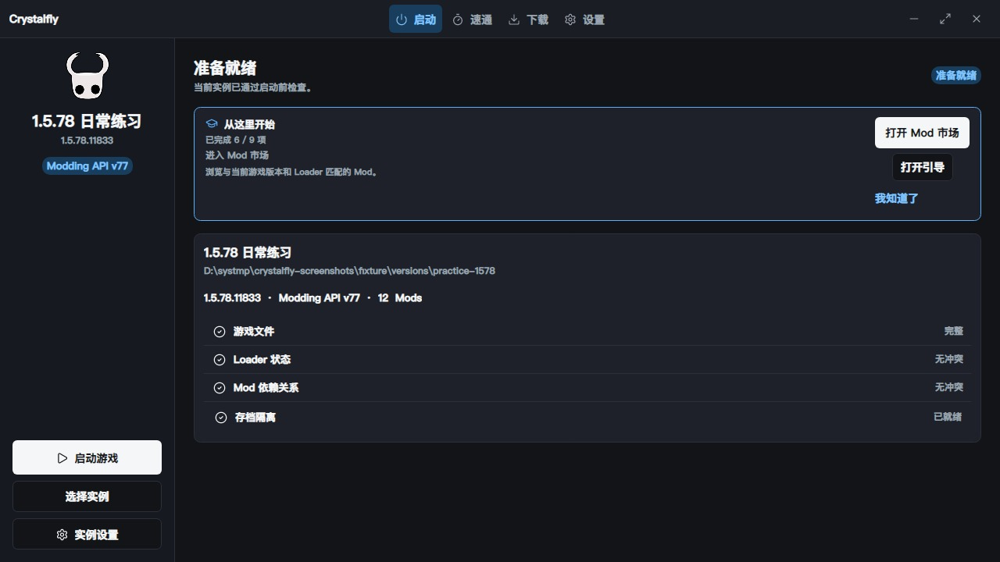
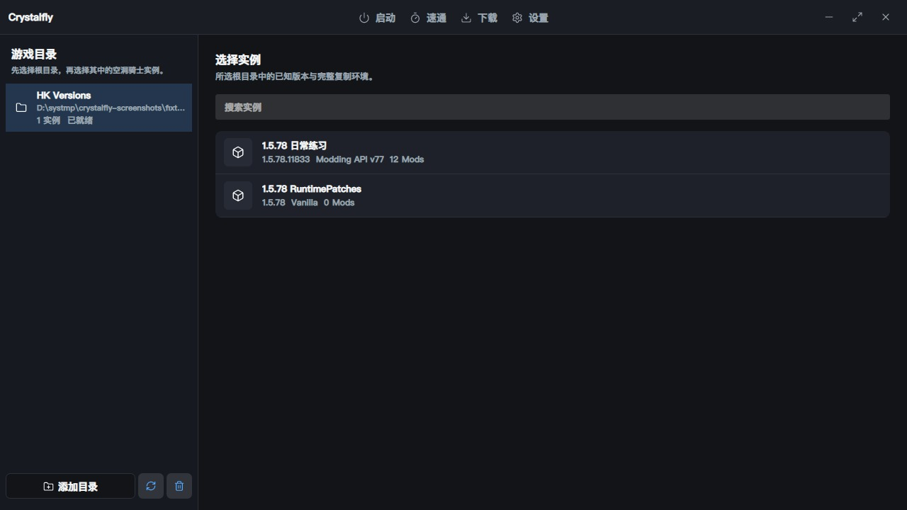

### UI acceptance screenshots

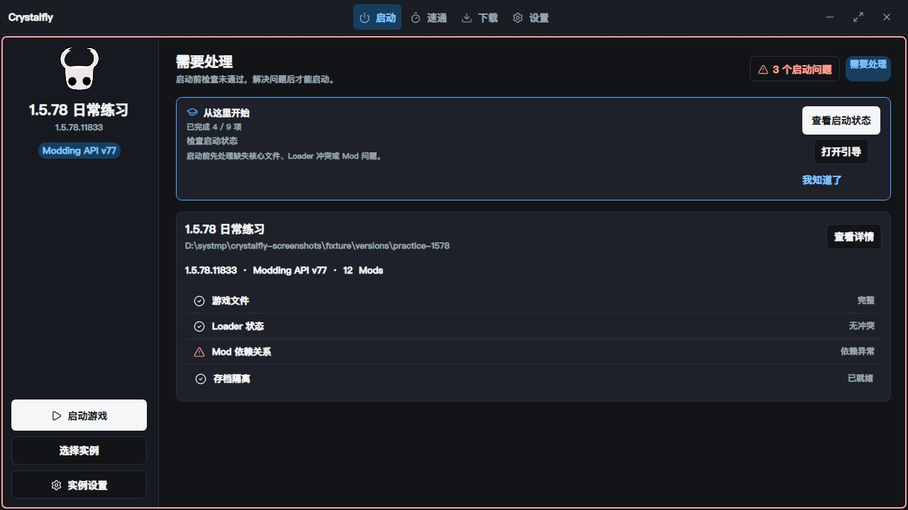
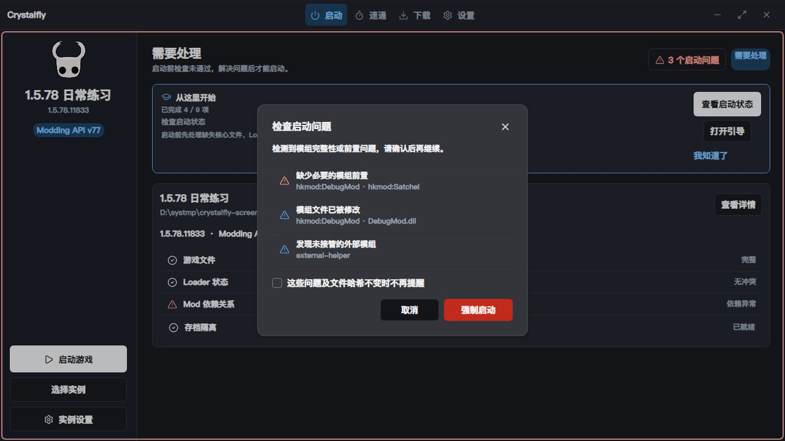
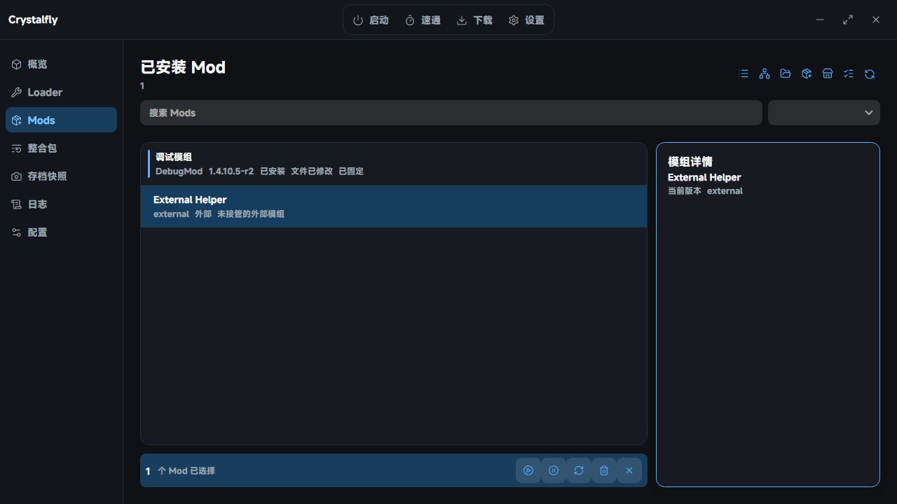
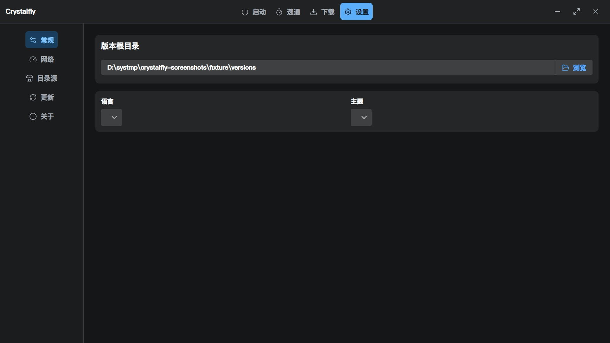
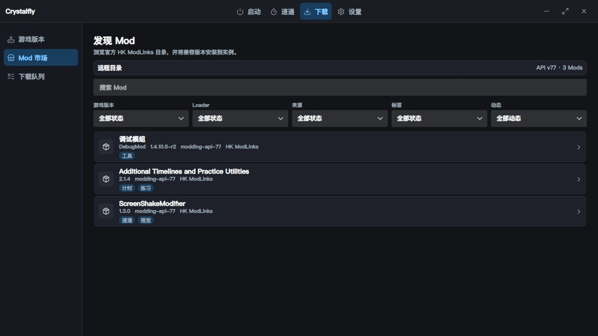
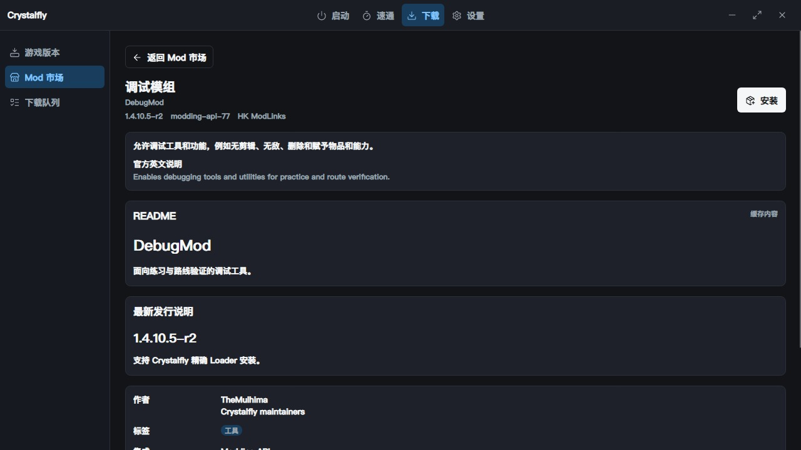
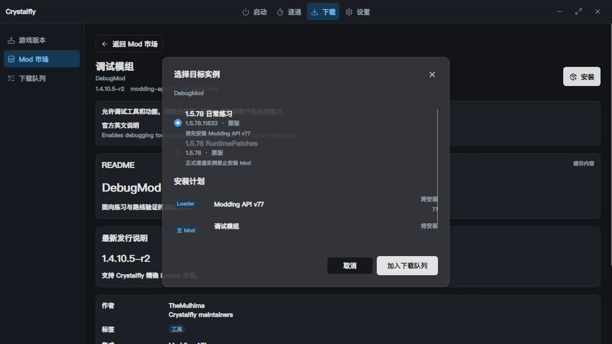
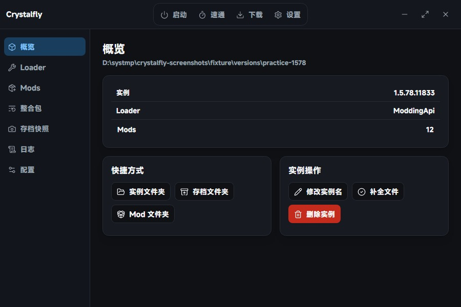
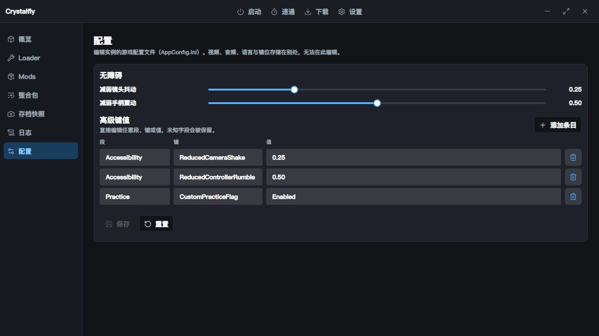
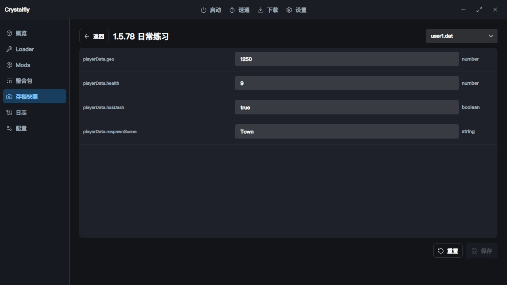
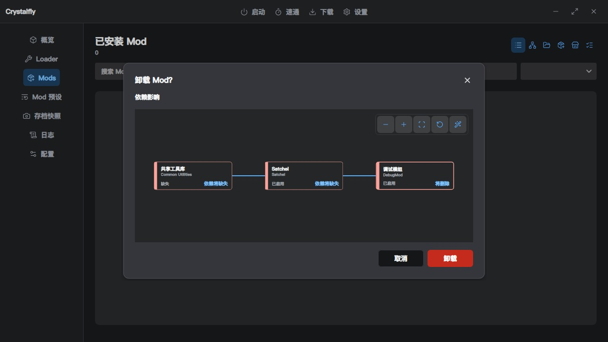

### Highlights

- **First-run wizard**: an 8-step onboarding guide appears on first launch (import game → pick instance → install Loader → add Mods → launch → extras); reopen it any time from Settings → General.
- **Game directory discovery**: besides Steam libraries, scans all local drives recursively to find non-Steam Hollow Knight installs, with live progress while scanning.
- Manages multiple game directories while keeping one active root for existing operations. It discovers a selected directory itself or its direct children, and finds verified Hollow Knight installs from Steam libraries without taking ownership until confirmation.
- Scans instance and build files in the background at startup without waiting for the remote catalog or Steam reconnect. Settings is a top text tab, the instance entry is named Select Instance, and pages, cards, and actions use fast spring motion that can follow the system, reduce motion, or turn off.
- Uses custom title-bar controls with a native resize border and explicitly requests system-rounded corners on Windows 11 while remaining compatible with Windows 10.
- Recognizes `1.2.2.1`, `1.4.3.2`, `1.5.78.11833`, and a dynamic stable `latest` channel.
- Uses the Launch-page instance entry to select, open settings, clone a full copy, or permanently delete an instance. Deletion first checks running games, queued downloads, and file transactions, then removes both game and instance state directories after confirmation.
- Installs, switches, repairs, and removes mutually exclusive loaders through recoverable file transactions.
- Discovers online mods under Download → Mod Market, then installs them to a selected compatible instance. Installed Mods provides information, open-folder, enable/disable, and uninstall shortcuts plus multi-select batch actions.
- Filters the market by recently added or updated activity, and renders sanitized README and latest release notes with ETag-backed offline cache fallback.
- Reinstalls or repairs managed official Mods without changing their enabled state, and safely locates or transactionally deletes per-instance global settings.
- Supports an exact-build, exact-Modding-API HTTPS custom ModLinks replacement that remains visibly unverified.
- Previews the loader, recursive dependencies, and requested mod before enqueueing background work. Dependency chains stay serial while independent install groups use up to three concurrent network transfers.
- Validates the game build, exact loader package ID, and full dependency closure so Modding API v37/v60/v77/v78, BepInEx, and cross-build mods cannot be mixed.
- Discovers managed and external Mods, verifies receipt hashes, supports one-click external takeover, then automatically matches taken-over Mods to catalog entries (name + Loader family + build) so dependency resolution works; unique matches relink automatically, ambiguous ones ask the user, and a declined prompt is shown again next time.
- Keeps a persistent red launch warning frame. Only Mod file and dependency problems can be force-launched; game files, Loader, transactions, LocalLow, and process conflicts remain absolute blockers.
- Provides a global offline mode that disconnects Steam sessions. Catalogs, custom catalogs, and downloads use verified caches only, while queued network work waits for online mode to return.
- Displays detected BepInEx, Modding API, and `Player.log` files with their source paths and refreshable tail content.
- Imports local loaders only through a validated Crystalfly manifest and keeps them marked unverified.
- Steam sign-in supports **username/password** and QR code. Steam Guard codes (email / mobile) are collected through dialogs; accounts with the mobile authenticator prefer device confirmation. SteamKit2 downloads the public branch plus any user-entered Windows Depot Manifest; it follows the Windows system proxy with a WebSocket login transport, pausing Steam work and reconnecting saved accounts after a proxy change or unexpected disconnect. Under accelerators that return no HTTPS content server, downloads fall back to HTTP servers. Unverified historical versions remain vanilla-only and upgrade automatically when a later catalog entry matches their Manifest and file fingerprint. Each file uses up to sixteen concurrent chunk requests; completed instances receive `steam_appid.txt`, and refresh tokens and remembered credentials are protected with Windows DPAPI for the current user.
- Lets users switch between direct GitHub access, smart selection, `gh-proxy.org`, `gh-proxy.com`, `ghproxy.net`, and `ghfast.top` while testing each route latency. Only official GitHub catalogs and GitHub-hosted packages are proxied; smart selection prefers the fastest available route and falls back through the pool to direct GitHub access. Steam, custom catalogs, and other download URLs keep their original route, with the same package verification.
- Swaps per-instance LocalLow data before launch, captures it after exit, then restores the original shared data.
- Creates persistent named save snapshots containing only non-log LocalLow data, plus dedicated speedrun copies with template-specific tools and a pre-launch report.
- Edits the selected instance's isolated `AppConfig.ini` while preserving unknown settings and committing changes through atomic replacement.
- Edits only `user1.dat` through `user4.dat` from the selected instance or one of its named snapshots. Save decoding and expansion run asynchronously, and empty save sets show an explicit state instead of blocking the window.
- Creates append or exact Mod presets bound to one build and Loader, with dependency-ordered apply, local JSON import/export, share codes, and restoration of the pre-apply install and enabled state.
- Accepts strictly validated `crystalfly://` commands through single-instance forwarding. The installer registers the protocol, and every state-changing external request shows a parsed summary before confirmation.
- Checks a signed stable update manifest once per day. Users can update now, defer, or skip a version; installed mode runs the Inno installer, while portable mode preserves `Data` through same-volume backup and replacement.

The current built-in speedrun templates are intentionally unverified because the catalog does not yet contain a trusted rules revision and complete Steam file allowlist. Unknown new public manifests remain launchable as vanilla, but loader installation stays locked until the catalog verifies the build.

### Compatibility

| Game build | Loader | DebugMod |
| --- | --- | --- |
| `1.2.2.1` | Modding API v37 | `legacy/1.2.2.1` |
| `1.4.3.2` | Modding API v60 | `legacy/1.4.3.2` |
| `1.5.78.11833` | Modding API v77 | `legacy/1.5.78` |
| Current verified stable | Modding API v78 or BepInEx 5.4.23.4 | `latest` |

The current stable build is decided by the remote catalog's Steam public manifest, never hard-coded. Unknown new manifests can be downloaded and launched as vanilla, but Crystalfly locks Loader installation until the catalog ships a new build fingerprint and compatibility list.

- DebugMod: <https://github.com/wzxnb2333/New.HK.Debug/releases/tag/v1.4.10.5-r2>
- Modding API v78: <https://github.com/wzxnb2333/api/releases/tag/1.5.12620.0-78>
- Modding API v37: <https://github.com/wzxnb2333/api/releases/tag/1.2.2.1-37-windows>

### Launch checks, Mod Market, and instance details

After an instance is selected, the launch page checks the executable, running processes, Loader state, Mod dependencies and file hashes, pending transaction recovery, and per-instance LocalLow readiness. Mod-only problems can be force-launched after a detailed confirmation; absolute blockers cannot. A per-instance issue fingerprint can suppress repeated dialogs while the exact issue and file hash remain unchanged, but the red warning frame stays visible.

Download → Mod Market discovers online mods and filters them by keyword, game build, loader, source, and tag. Its detail view shows description, authors, dependencies, integrations, repository, source, and exact compatibility before the user chooses a target instance. A vanilla target can install the catalog's exact required loader after confirmation, then re-evaluates compatibility before installing the mod. Conflicted, drifted, unknown-build, and official speedrun instances remain unavailable.

The target dialog previews the loader, every recursive dependency, and the requested mod. Confirmation only adds the plan to Download → Download Queue, so the market remains usable. Each dependency chain runs in loader/dependency/mod order; unrelated groups share up to three network slots. Transfers may continue while the game runs, but installation waits for the target game process to exit. Transient network failures retry three times, while deterministic hash, manifest, and compatibility errors fail immediately. Unfinished tasks resume after restart; failed tasks remain available for manual retry.

When the UI is Simplified Chinese, the market also loads Crystalfly's independently maintained HK ModLinks Chinese translation catalog. It searches translated names, descriptions, and labels alongside official English metadata; missing translations fall back to English. The source policy and validation command are documented in [docs/mod-translations.zh-CN.md](docs/mod-translations.zh-CN.md).

The Installed Mods page includes receipt-backed and external Mods and can filter enabled, disabled, local, external, pinned, updateable, or unhealthy entries. External Mods stay read-only until explicit takeover. Managed Mods support health inspection and exact-version repair; local takeovers support re-import or accepting current hashes. Pinning protects entries from batch uninstall and dependency cleanup. Uninstall previews a dependency-impact tree and only suggests unused dependencies instead of deleting them automatically.

Mod Packs store an exact game build, Loader, and managed Mod versions. Local or external entries contain only names and file hashes, never files, download URLs, or local paths. Append mode installs or enables missing entries; exact mode also disables unlisted, unpinned Mods while retaining every transitive dependency of an enabled pinned Mod. Plans run through the existing queue in dependency order, and the restore point is captured when execution is about to modify the instance. The complete Mod Pack group excludes other mutations of that instance, and restore validates pinned entries, receipts, and file health before writing. Mod Pack JSON is limited to 128 KiB and 1,000 entries. Local JSON sharing remains available offline; the hosted service uses 12-character share codes.

Compatibility uses the exact loader package ID rather than treating every Modding API or BepInEx release as interchangeable. Crystalfly-managed loaders can be repaired or removed. A manually installed BepInEx with a verifiable version is detected as externally owned: matching plugins may be installed, but Crystalfly never repairs, removes, overwrites, or takes ownership of the BepInEx installation. Manually installed Modding API remains `Drifted` because no trusted vanilla assembly backup exists.

The Logs page discovers BepInEx, Modding API, and shared `Player.log` files, shows each source path, and reads refreshable tail content. The shared `Player.log` may belong to the most recently launched instance, so instance-local loader logs are the stronger source when diagnosing one instance.

### Speedrun environments

The three built-in RuntimePatches templates create dedicated full copies from a user-selected clean Vanilla instance. Crystalfly pins the AssemblyPatches v1.0.2 Windows release and verifies both the ZIP and inner `Assembly-CSharp.dll` SHA-256.

- `1.2.2.1`, `1.4.3.2`, and `1.5.78` are supported without Modding API, BepInEx, or LoadNormaliser.
- Every option defaults off. `1.2.2.1` has no `FasterIntroSkip`; `1.5.78` has no `ScreenShakeModifier`.
- `FasterIntroSkip` and `MiniSaveStates` surface category-rule warnings. Users must still check the current SRC rules.

Pre-launch validation checks the core game fingerprint, RuntimePatches DLL, isolated configuration, Loader/Mod markers, transactions, and LocalLow state. Technical errors block launch; rule warnings do not. PNGs, skins, and ordinary extra files are ignored. Legacy template instances remain on disk but must be recreated.

Verification reports are pre-launch integrity snapshots. They do not attest that files remain unchanged after the report is written. The first release publishes source only; locally built binaries are not Authenticode-signed.

### Develop

```powershell
dotnet restore '.\Crystalfly.slnx'
dotnet build '.\Crystalfly.slnx' -c Release --no-restore
dotnet test '.\Crystalfly.slnx' -c Release --no-build
dotnet run --project '.\src\Crystalfly.App\Crystalfly.App.csproj'
```

### Release build

```powershell
pwsh -NoProfile -File '.\scripts\build-release.ps1' -Version '1.1.2'

# Build and install locally without an update-signing key; no update manifest is emitted.
pwsh -NoProfile -File '.\scripts\build-and-install.ps1' -Version '1.1.2' -UnsignedLocal
```

The scripts automatically locate Inno Setup 6 from `PATH` or its standard install directories. Pass `-IsccPath '<path to ISCC.exe>'` for a custom location. Release builds read `CRYSTALFLY_UPDATE_SIGNING_KEY` from the ignored `.env.update-signing` file and use `tools/Crystalfly.ReleaseTool` to sign the update manifest; never commit the private key file. For local verification only, pass `-UnsignedLocal`; this omits `update-manifest.v1.json` and must not be uploaded as a public Release. `build-and-install.ps1` reads the version from `Directory.Build.props`, runs the full Release build and tests, validates the artifacts, then silently updates `D:\Program Files\Crystalfly` with administrator approval and verifies the installed version. It stops when Crystalfly is running and never terminates the process. The installer defaults to `D:\Program Files\Crystalfly` and requests administrator privileges; the portable ZIP can be extracted elsewhere. Outputs under `artifacts` include the self-contained publish, updater helper, portable ZIP, installer, signed `update-manifest.v1.json`, and `SHA256SUMS.txt`. Assets are not Authenticode-signed yet; the client still verifies the Ed25519 manifest signature plus each asset's SHA-256, size, and version.

Application settings use `%LOCALAPPDATA%\Crystalfly`, or `Data` beside the executable when `portable.flag` exists. Per-instance state stays under the active game directory's `.crystalfly` folder.

Crystalfly is licensed under [GPL-3.0-only](LICENSE). Hollow Knight, loaders, and mods are not redistributed by this repository and retain their own licenses.
