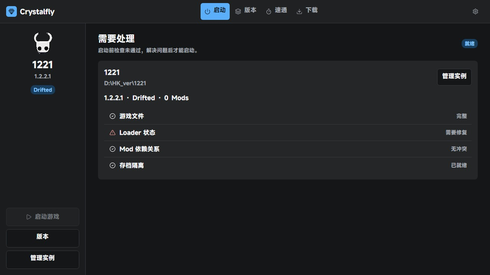
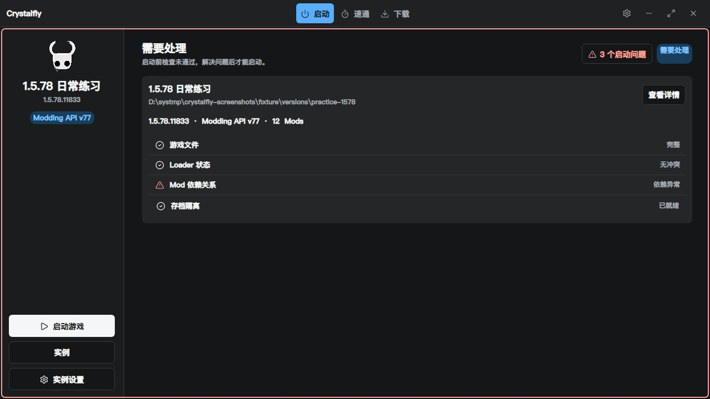
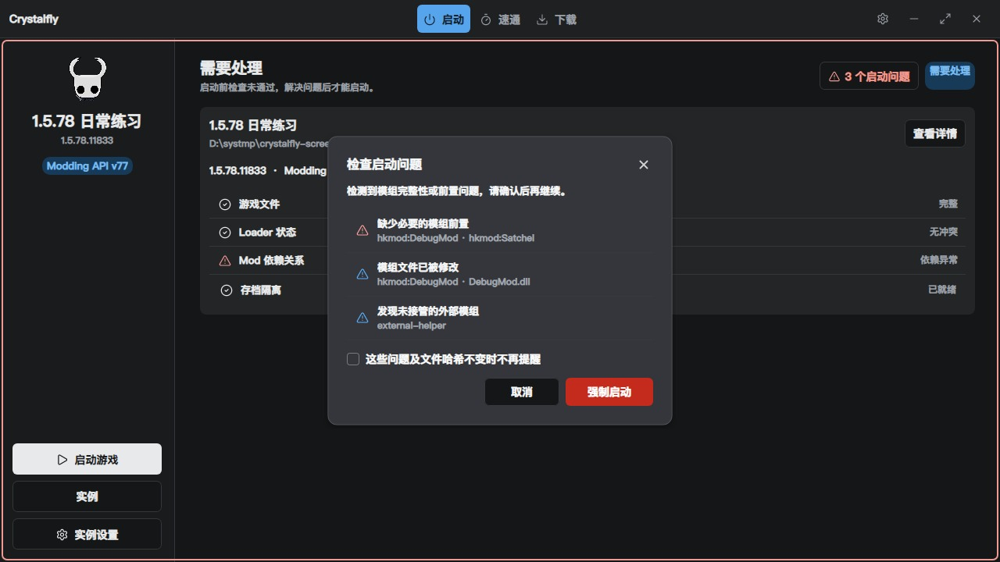
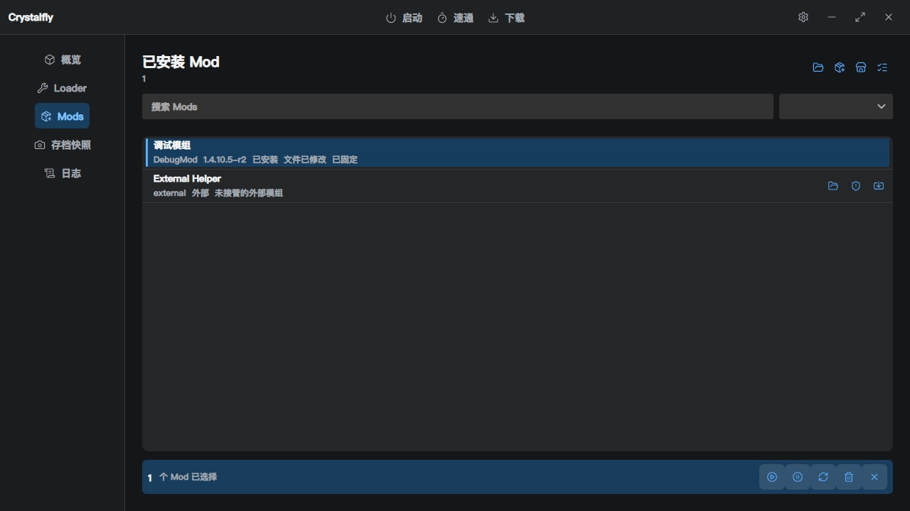
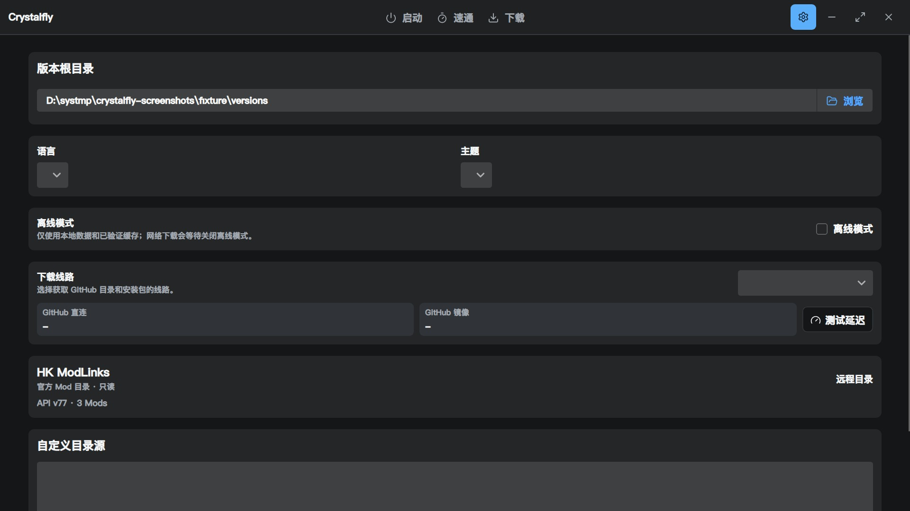
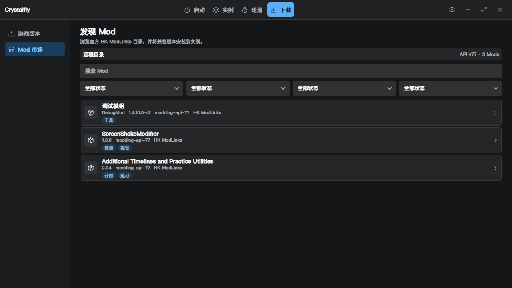
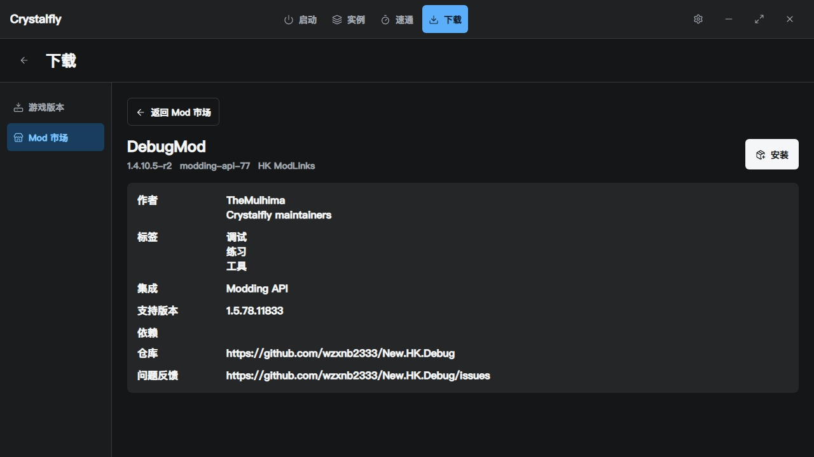
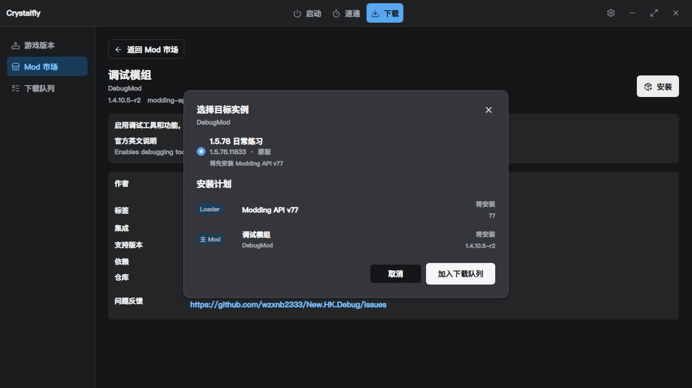
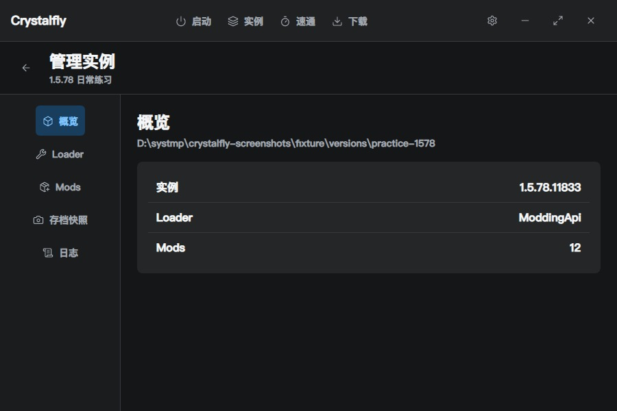

# Crystalfly

Crystalfly 是面向 Windows 10/11 x64 的《空洞骑士》游戏版本、Loader、Mod、存档与速通环境管理器。顶部“实例”用于选择和管理可启动目录；真正的游戏版本下载位于“下载 → 游戏版本”。界面采用单实例上下文，避免把不同实例的 Loader、Mod 和存档状态混在一起。

> 当前稳定版：`0.3.0`。GitHub Release 提供 Windows x64 便携包和安装包。

[English](#english)



### 界面验收截图










## 功能

- 扫描用户选择的版本根目录，并把每个直接子目录作为独立实例。
- 识别 `1.2.2.1`、`1.4.3.2`、`1.5.78.11833` 和动态 `latest` 稳定通道。
- 顶部实例选择器可直接切换、进入设置、完整克隆或永久删除实例；删除会先检查游戏进程、下载任务与文件事务，确认后同时移除游戏目录和实例状态。
- 事务化安装、切换、修复和卸载 Loader，检测冲突及文件漂移。
- 支持带 Crystalfly 清单的高级本地 Loader 导入，并永久标记为“未验证”。
- 在“下载 → Mod 市场”中搜索在线 Mod、查看详情并选择目标实例；在实例的“已安装 Mod”页通过信息、打开目录、启停和卸载快捷操作管理单个 Mod，也可多选后批量处理。
- 安装前展示 Loader、递归前置与主 Mod；确认后加入后台下载队列，同一依赖链串行，独立安装组最多三路并发。
- 安装前检查游戏版本、精确 Loader ID 和完整依赖闭包，阻止 Modding API v37/v60/v77/v78、BepInEx 及不同游戏版本的 Mod 混装。
- 主动扫描受管理与外部 Mod，显示文件缺失、修改、额外文件和未接管状态；外部 Mod 可由用户确认接管，本地接管项不提供自动更新。
- 启动页持续用红框显示 Mod 完整性和依赖问题。只有 Mod 文件与依赖问题允许用户确认后强制启动；游戏文件、Loader、事务、LocalLow 和进程冲突始终阻止启动。
- 支持固定 Mod；批量卸载和无用前置建议会跳过固定项，单独卸载前需先取消固定。
- 全局离线模式使目录、翻译、Mod 和 Steam 下载只使用已验证缓存；网络队列等待恢复在线，不影响本地实例管理。
- 在实例日志页查看 BepInEx、Modding API 和 `Player.log` 的最新内容及来源路径。
- 通过 SteamKit2 扫码登录并下载 public 分支历史 manifest；同一文件最多十六路并发下载 Chunk，完成后生成 `steam_appid.txt` 以直接启动对应实例，refresh token 仅以当前 Windows 用户的 DPAPI 加密保存。
- 设置页可在 GitHub 直连与 GitHub 镜像间切换并分别测试延迟；镜像仅代理官方 GitHub 目录和 GitHub 托管安装包，Steam、自定义目录及其他下载地址保持原线路，包校验规则不变。
- 启动前切换实例 LocalLow，退出后写回，并恢复原共享数据。
- 创建永久命名“存档快照”；快照仅包含实例的非日志 LocalLow，事务临时恢复点成功后自动清理。
- 创建独立速通副本，按模板部署速通工具，并在每次启动前写出验证报告。

## 兼容矩阵

| 游戏版本 | Loader | DebugMod |
| --- | --- | --- |
| `1.2.2.1` | Modding API v37 | `legacy/1.2.2.1` |
| `1.4.3.2` | Modding API v60 | `legacy/1.4.3.2` |
| `1.5.78.11833` | Modding API v77 | `legacy/1.5.78` |
| 当前已验证稳定版 | Modding API v78 或 BepInEx 5.4.23.4 | `latest` |

“当前稳定版”由远程 catalog 的 Steam public manifest 决定，不在界面或兼容逻辑中写死版本号。未知的新 manifest 可以下载并以原版启动，但 Crystalfly 会锁定 Loader 安装，直到 catalog 提供新的构建指纹和兼容清单。

- DebugMod：<https://github.com/wzxnb2333/New.HK.Debug/releases/tag/v1.4.10.5-r2>
- Modding API v78：<https://github.com/wzxnb2333/api/releases/tag/1.5.12620.0-78>
- Modding API v37：<https://github.com/wzxnb2333/api/releases/tag/1.2.2.1-37-windows>

## 启动

需要 [.NET SDK 10](https://dotnet.microsoft.com/download/dotnet/10.0)：

```powershell
dotnet restore '.\Crystalfly.slnx'
dotnet run --project '.\src\Crystalfly.App\Crystalfly.App.csproj'
```

首次使用：

1. 在“设置”中选择版本根目录，例如 `D:\HK_ver`。
2. Crystalfly 只扫描直接子目录，并忽略 `<版本根目录>\.crystalfly`。
3. 在顶部“实例”中选择实例，再进入实例详情管理 Loader、“已安装 Mod”和“存档快照”。
4. 需要下载游戏时进入“下载 → 游戏版本”；需要查找在线 Mod 时进入“下载 → Mod 市场”；进度、速度、取消与重试位于“下载 → 下载队列”。
5. 启动游戏时不要同时运行其他《空洞骑士》进程。

## 启动预检、Mod 市场与实例详情

选择实例后，启动页会检查游戏可执行文件、进程、Loader、Mod 依赖与文件哈希、待恢复事务和实例 LocalLow。Mod 文件或依赖问题可在明确确认后强制启动；游戏文件、Loader、事务、LocalLow 和进程冲突始终阻止启动。问题变化会让“不再提醒”指纹自动失效，红色问题框始终保留。

“下载 → Mod 市场”负责发现在线 Mod：可按关键词、游戏版本、Loader、来源和标签筛选，查看描述、作者、依赖、集成、仓库及精确兼容范围，再选择一个兼容实例安装。Vanilla 实例可在确认后先安装目录指定的精确 Loader，再重新验证并安装 Mod；Loader 冲突、漂移、未知构建和正式速通实例不可作为安装目标。

选择目标实例后会先显示 Loader、全部递归前置和主 Mod 的安装计划。确认只负责加入后台队列，不会锁住市场。每条依赖链按 Loader、前置、主 Mod 顺序执行；互不相关的安装组最多并行三个网络任务。游戏运行时可继续下载，写入目标实例前会等待游戏退出。网络错误自动重试三次；哈希、清单和兼容性错误不会盲目重试。关闭程序时会保存未完成及失败任务；未完成任务会在重启后继续，失败任务会保留并等待手动重试。

实例的“已安装 Mod”页只管理当前实例内的 Mod，可按名称、ID 或版本搜索，并按全部、启用、停用、本地和可更新状态筛选。每项提供信息、打开目录、启停和卸载快捷操作；进入多选后可全选、取消选择，并批量启用、停用、更新或卸载。卸载前会展示依赖影响树；依赖修复会列出需要重新启用或下载安装的项目，无法安全修复时明确阻止操作。本地 Mod 不提供自动更新。

Loader 兼容按精确包 ID 判断，不会把所有 Modding API 或 BepInEx 版本视为等价。Crystalfly 安装的 Loader 可修复和卸载；手动安装且能确认版本的 BepInEx 标记为外部所有，仅允许安装完全匹配的插件，不会修复、卸载、覆盖或接管 BepInEx 本体。手动安装的 Modding API 因缺少原版程序集备份会保持 `Drifted`。

“日志”页会发现当前实例的 BepInEx、Modding API 和共享 `Player.log`，显示日志来源路径，并支持刷新和查看文件末尾内容。共享 `Player.log` 可能来自最近运行的实例，排查当前实例时应优先使用实例目录内的 Loader 日志。

## 速通环境

四个内置模板会创建专用完整副本，不会临时修改日常或练习实例。当前 catalog 没有完整、可信的规则修订与 Steam 文件白名单，因此模板明确显示“未验证”；不会伪造正式验证标记。规则与文件清单齐备后，远程 catalog 可在不更新客户端的情况下启用正式验证。

- `1.2.2.1` 单跑和比赛模板部署 ScreenShakeModifier，不支持 LoadNormaliser。
- `1.5.78` 单跑模板不部署 LoadNormaliser；该版本使用游戏内置的屏幕震动设置。
- 只有 `1.5.78` 比赛模板部署 LoadNormaliser，并可选择 `1`、`2`、`3` 或 `5` 秒。

正式可信模板验证失败时会阻止启动；当前未验证模板仍会生成报告并明确保留未验证状态。

验证报告是启动前文件完整性的时间点快照，不证明报告写出后文件仍未变化。

## 高级本地 Loader

本地 Loader 必须由一个 JSON 清单和同目录 ZIP 组成。界面只接受该清单，不接受裸 Loader ZIP。示例：

```json
{
  "schemaVersion": 1,
  "id": "community-loader",
  "name": "Community Loader",
  "version": "1.0.0",
  "loaderState": "moddingApi",
  "packageFile": "CommunityLoader.zip",
  "sizeBytes": 123456,
  "sha256": "AAAAAAAAAAAAAAAAAAAAAAAAAAAAAAAAAAAAAAAAAAAAAAAAAAAAAAAAAAAAAAAA",
  "supportedBuildIds": ["1.5.78.11833"],
  "managedFiles": ["hollow_knight_Data/Managed/Assembly-CSharp.dll"]
}
```

`loaderState` 只能是 `moddingApi` 或 `bepInEx`。清单路径、ZIP 大小和 SHA-256 会在修改实例前验证；本地来源始终显示“未验证”。

## 数据位置

- 安装模式设置：`%LOCALAPPDATA%\Crystalfly`
- 便携模式设置：程序旁 `Data`（存在 `portable.flag` 时）
- 实例元数据、缓存、事务、LocalLow 和快照：`<版本根目录>\.crystalfly`
- 实例标识：`<实例目录>\.crystalfly-instance.json`

首次接管 LocalLow 前会保留完整共享备份。发生崩溃时，事务日志只在能够用阶段和文件哈希证明安全的情况下自动恢复；否则实例进入 `NeedsAttention` 并禁止启动。

## 构建与验证

```powershell
dotnet restore '.\Crystalfly.slnx'
dotnet build '.\Crystalfly.slnx' -c Release --no-restore
dotnet test '.\Crystalfly.slnx' -c Release --no-build

pwsh -NoProfile -File '.\scripts\build-release.ps1' -Version '0.3.0'

# 构建、测试并静默更新固定安装目录（请先关闭 Crystalfly）
pwsh -NoProfile -File '.\scripts\build-and-install.ps1'
```

脚本会自动查找 Inno Setup 6；自定义安装位置可传入 `-IsccPath '<ISCC.exe 路径>'`。`build-and-install.ps1` 会从 `Directory.Build.props` 读取版本号，执行完整 Release 构建和测试，验证产物后以管理员权限静默更新 `D:\Program Files\Crystalfly`，最后核对已安装版本。运行中的 Crystalfly 会使流程停止，不会强制关闭程序。安装包默认安装到 `D:\Program Files\Crystalfly`，需要管理员权限。便携 ZIP 可直接解压到其他目录。本地输出位于 `artifacts`：self-contained publish、带 `portable.flag` 的便携 ZIP、Inno Setup 安装包和 `SHA256SUMS.txt`。首轮只公开源码；本地产物未做 Authenticode 签名，仅用于本机验证。详细设计见 [架构文档](docs/architecture.md)。

## 许可证

Crystalfly 使用 [GPL-3.0-only](LICENSE)。第三方游戏、Loader 和 Mod 不随仓库分发，仍受各自许可证约束。

## English

Crystalfly manages Hollow Knight game builds, loaders, mods, saves, snapshots, Steam depot downloads, and dedicated speedrun environments on Windows 10/11 x64. The top-level Instances page manages launchable directories; actual game downloads live under Download → Game Versions.

The current stable release is `0.3.0`. GitHub Releases provide a Windows x64 portable ZIP and Inno Setup installer.


### UI acceptance screenshots


### Highlights

- Discovers direct child directories under a user-selected version root and keeps each instance isolated.
- Recognizes `1.2.2.1`, `1.4.3.2`, `1.5.78.11833`, and a dynamic stable `latest` channel.
- Uses the top instance selector to switch, open settings, clone a full copy, or permanently delete an instance. Deletion first checks running games, queued downloads, and file transactions, then removes both game and instance state directories after confirmation.
- Installs, switches, repairs, and removes mutually exclusive loaders through recoverable file transactions.
- Discovers online mods under Download → Mod Market, then installs them to a selected compatible instance. Installed Mods provides information, open-folder, enable/disable, and uninstall shortcuts plus multi-select batch actions.
- Previews the loader, recursive dependencies, and requested mod before enqueueing background work. Dependency chains stay serial while independent install groups use up to three concurrent network transfers.
- Validates the game build, exact loader package ID, and full dependency closure so Modding API v37/v60/v77/v78, BepInEx, and cross-build mods cannot be mixed.
- Discovers managed and external Mods, verifies receipt hashes, supports explicit local takeover, exact-version repair, pinning, and unused-dependency suggestions.
- Keeps a persistent red launch warning frame. Only Mod file and dependency problems can be force-launched; game files, Loader, transactions, LocalLow, and process conflicts remain absolute blockers.
- Provides a global offline mode. Catalogs and downloads use verified caches only, while queued network work waits for online mode to return.
- Displays detected BepInEx, Modding API, and `Player.log` files with their source paths and refreshable tail content.
- Imports local loaders only through a validated Crystalfly manifest and keeps them marked unverified.
- Uses SteamKit2 for QR authentication and public manifest downloads, with up to sixteen concurrent chunk requests per file. Completed instances receive `steam_appid.txt` for direct launch. Refresh tokens are protected with Windows DPAPI for the current user.
- Lets users switch between direct GitHub access and a GitHub mirror and test each route latency. Only official GitHub catalogs and GitHub-hosted packages are proxied; Steam, custom catalogs, and other download URLs keep their original route, with the same package verification.
- Swaps per-instance LocalLow data before launch, captures it after exit, then restores the original shared data.
- Creates persistent named save snapshots containing only non-log LocalLow data, plus dedicated speedrun copies with template-specific tools and a pre-launch report.

The current built-in speedrun templates are intentionally unverified because the catalog does not yet contain a trusted rules revision and complete Steam file allowlist. Unknown new public manifests remain launchable as vanilla, but loader installation stays locked until the catalog verifies the build.

### Launch checks, Mod Market, and instance details

After an instance is selected, the launch page checks the executable, running processes, Loader state, Mod dependencies and file hashes, pending transaction recovery, and per-instance LocalLow readiness. Mod-only problems can be force-launched after a detailed confirmation; absolute blockers cannot. A per-instance issue fingerprint can suppress repeated dialogs while the exact issue and file hash remain unchanged, but the red warning frame stays visible.

Download → Mod Market discovers online mods and filters them by keyword, game build, loader, source, and tag. Its detail view shows description, authors, dependencies, integrations, repository, source, and exact compatibility before the user chooses a target instance. A vanilla target can install the catalog's exact required loader after confirmation, then re-evaluates compatibility before installing the mod. Conflicted, drifted, unknown-build, and official speedrun instances remain unavailable.

The target dialog previews the loader, every recursive dependency, and the requested mod. Confirmation only adds the plan to Download → Download Queue, so the market remains usable. Each dependency chain runs in loader/dependency/mod order; unrelated groups share up to three network slots. Transfers may continue while the game runs, but installation waits for the target game process to exit. Transient network failures retry three times, while deterministic hash, manifest, and compatibility errors fail immediately. Unfinished tasks resume after restart; failed tasks remain available for manual retry.

When the UI is Simplified Chinese, the market also loads the maintained HK ModLinks Chinese translation catalog. It searches translated names, descriptions, and labels alongside official English metadata; missing translations fall back to English. The source data and import command are documented in [docs/mod-translations.zh-CN.md](docs/mod-translations.zh-CN.md).

The Installed Mods page includes receipt-backed and external Mods and can filter enabled, disabled, local, external, pinned, updateable, or unhealthy entries. External Mods stay read-only until explicit takeover. Managed Mods support health inspection and exact-version repair; local takeovers support re-import or accepting current hashes. Pinning protects entries from batch uninstall and dependency cleanup. Uninstall previews a dependency-impact tree and only suggests unused dependencies instead of deleting them automatically.

Compatibility uses the exact loader package ID rather than treating every Modding API or BepInEx release as interchangeable. Crystalfly-managed loaders can be repaired or removed. A manually installed BepInEx with a verifiable version is detected as externally owned: matching plugins may be installed, but Crystalfly never repairs, removes, overwrites, or takes ownership of the BepInEx installation. Manually installed Modding API remains `Drifted` because no trusted vanilla assembly backup exists.

The Logs page discovers BepInEx, Modding API, and shared `Player.log` files, shows each source path, and reads refreshable tail content. The shared `Player.log` may belong to the most recently launched instance, so instance-local loader logs are the stronger source when diagnosing one instance.

### Speedrun environments

The four built-in templates create dedicated full copies and remain explicitly unverified until the catalog contains a trusted rules revision and complete Steam file allowlist.

- The `1.2.2.1` solo and race templates deploy ScreenShakeModifier and do not support LoadNormaliser.
- The `1.5.78` solo template does not deploy LoadNormaliser and uses the game's built-in screen shake setting.
- Only the `1.5.78` race template deploys LoadNormaliser, with selectable `1`, `2`, `3`, or `5` second variants.

A failed trusted-template report blocks launch. Current unverified templates still write a report and retain their unverified status.

Verification reports are pre-launch integrity snapshots. They do not attest that files remain unchanged after the report is written. The first release publishes source only; locally built binaries are not Authenticode-signed.

### Develop

```powershell
dotnet restore '.\Crystalfly.slnx'
dotnet build '.\Crystalfly.slnx' -c Release --no-restore
dotnet test '.\Crystalfly.slnx' -c Release --no-build
dotnet run --project '.\src\Crystalfly.App\Crystalfly.App.csproj'
```

### Release build

```powershell
pwsh -NoProfile -File '.\scripts\build-release.ps1' -Version '0.3.0'

# Build, test, and silently update the fixed install directory after closing Crystalfly.
pwsh -NoProfile -File '.\scripts\build-and-install.ps1'
```

The scripts automatically locate Inno Setup 6 from `PATH` or its standard install directories. Pass `-IsccPath '<path to ISCC.exe>'` for a custom location. `build-and-install.ps1` reads the version from `Directory.Build.props`, runs the full Release build and tests, validates the artifacts, then silently updates `D:\Program Files\Crystalfly` with administrator approval and verifies the installed version. It stops when Crystalfly is running and never terminates the process. The installer defaults to `D:\Program Files\Crystalfly` and requests administrator privileges; the portable ZIP can be extracted elsewhere. Outputs under `artifacts` include the self-contained publish, portable ZIP, installer, and `SHA256SUMS.txt`.

Application settings use `%LOCALAPPDATA%\Crystalfly`, or `Data` beside the executable when `portable.flag` exists. Per-instance state always stays under `<version-root>\.crystalfly`.

Crystalfly is licensed under [GPL-3.0-only](LICENSE). Hollow Knight, loaders, and mods are not redistributed by this repository and retain their own licenses.
